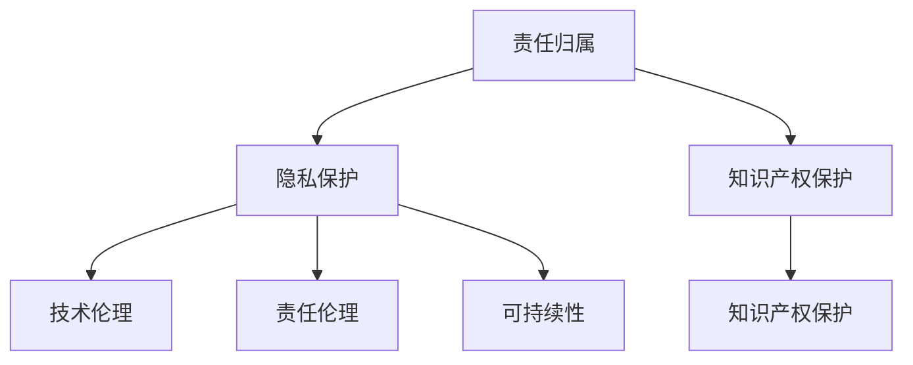

                 

关键词：自动化创业、法律考量、道德考量、技术伦理、责任归属、隐私保护、知识产权、行业规范、可持续性

> 摘要：自动化技术在推动创业发展的同时，也带来了诸多法律和道德上的挑战。本文旨在探讨自动化创业中面临的法律和道德问题，包括责任归属、隐私保护、知识产权保护、行业规范以及可持续性等方面的考量。通过分析这些挑战，本文提出了一系列应对策略，以期为自动化创业提供指导。

## 1. 背景介绍

随着人工智能、机器学习、区块链等前沿技术的迅猛发展，自动化技术逐渐成为创业创新的重要推动力。自动化技术能够大幅提升生产效率、降低成本、优化资源配置，从而为创业企业带来巨大的商业价值。然而，自动化技术的广泛应用也引发了一系列法律和道德问题，亟待创业者关注和解决。

### 法律考量

#### 责任归属

在自动化创业中，责任归属问题尤为突出。自动化系统在运行过程中可能产生错误的决策或行为，导致事故或损失。如何确定责任的归属成为法律界关注的热点。一方面，企业可能因系统设计缺陷或操作失误而承担责任；另一方面，系统开发者、维护者也可能因疏忽或故意行为而被追究责任。明确责任归属有助于保障各方权益，提高自动化系统的安全性和可靠性。

#### 隐私保护

自动化技术的广泛应用涉及到大量个人信息的收集、存储和使用。如何保护用户的隐私权益成为法律考量的重要方面。数据保护法律法规如《通用数据保护条例》（GDPR）和《加州消费者隐私法案》（CCPA）等对企业的数据处理行为提出了严格要求。违反隐私保护规定可能导致企业面临巨额罚款和声誉损失，因此，自动化创业企业在设计系统时需充分考虑隐私保护措施。

#### 知识产权保护

自动化技术的快速发展也带来知识产权保护的新挑战。企业在开发自动化系统时可能需要引用他人的技术成果，如专利、著作权等。如何合理使用和保护知识产权成为法律考量的关键。企业应确保其开发的技术不侵犯他人的知识产权，并采取有效措施保护自己的知识产权免受侵犯。

### 道德考量

#### 技术伦理

自动化技术的应用不仅涉及法律问题，还涉及到道德伦理考量。例如，自动驾驶汽车在面临道德困境时如何做出决策、自动化系统在处理敏感数据时如何遵循道德原则等。这些问题引发了广泛的讨论和争议。技术伦理的考量有助于引导自动化技术朝着更加人性化、公正和可持续的方向发展。

#### 责任伦理

自动化技术在提高生产效率的同时，也可能导致部分劳动者失业。如何平衡自动化与就业的关系成为伦理考量的重要方面。企业在推广自动化技术时需考虑社会责任，采取措施减轻对劳动市场的影响。

#### 可持续性

自动化技术的发展应考虑到环境保护和资源利用的可持续性。例如，自动化系统在能源消耗、碳排放等方面的影响如何得到有效控制。可持续性的考量有助于实现绿色创业，促进经济、社会和环境的协调发展。

## 2. 核心概念与联系

### 法律概念

1. **责任归属**：在法律上，责任归属是指确定在某一事故或损失中应承担责任的主体。责任归属的确定有助于公正地分配损失和补偿受害者。

2. **隐私保护**：隐私保护是指确保个人隐私不被非法收集、使用和泄露的法律制度。隐私保护法律法规对企业的数据处理行为提出了严格的要求。

3. **知识产权保护**：知识产权保护是指通过法律手段保护发明创造、文学艺术作品等智力成果的权利。知识产权保护有助于激励创新，促进技术进步。

### 道德概念

1. **技术伦理**：技术伦理是指关于技术发展对社会和人类生活的影响的道德思考。技术伦理的考量有助于引导技术朝着更加人性化、公正和可持续的方向发展。

2. **责任伦理**：责任伦理是指关于个体或组织在特定情境下应承担的责任的道德思考。责任伦理的考量有助于推动企业履行社会责任，促进社会和谐。

3. **可持续性**：可持续性是指满足当前需求而不损害子孙后代满足其需求的能力。可持续性的考量有助于实现经济、社会和环境的协调发展。

### Mermaid 流程图



## 3. 核心算法原理 & 具体操作步骤

### 3.1 算法原理概述

自动化创业中的法律和道德考量涉及多方面的算法原理。首先，责任归属问题可以通过模糊逻辑和专家系统等算法进行建模和预测。其次，隐私保护可以借助加密算法和匿名化技术实现数据的安全处理。再次，知识产权保护需要采用文本相似度分析和特征提取算法来识别潜在侵权行为。最后，技术伦理和责任伦理的考量可以通过道德推理和责任分配算法来指导自动化系统的设计和应用。

### 3.2 算法步骤详解

1. **责任归属算法**：
   - 数据收集：收集事故发生前后的相关数据，如系统日志、监控视频、用户反馈等。
   - 特征提取：对收集的数据进行预处理和特征提取，以构建输入特征向量。
   - 模型训练：使用专家系统和模糊逻辑算法对输入特征向量进行建模和训练，以预测责任归属。
   - 预测与评估：将实际事故数据输入模型进行预测，并评估预测结果的准确性。

2. **隐私保护算法**：
   - 数据加密：使用加密算法对敏感数据进行加密，确保数据在传输和存储过程中不被泄露。
   - 数据匿名化：使用匿名化技术对个人数据进行去标识化处理，降低数据泄露的风险。
   - 数据访问控制：设置数据访问权限，确保只有授权用户才能访问和处理敏感数据。

3. **知识产权保护算法**：
   - 文本相似度分析：使用文本相似度分析算法对文本数据进行比较，识别潜在的侵权行为。
   - 特征提取：对涉嫌侵权的内容进行特征提取，构建侵权特征向量。
   - 侵权判断：使用机器学习算法对侵权特征向量进行分类，判断是否存在侵权行为。

4. **技术伦理和责任伦理考量**：
   - 道德推理：使用道德推理算法对自动化系统的行为进行评估，判断其是否符合道德规范。
   - 责任分配：使用责任分配算法确定在不同情境下自动化系统应承担的责任。

### 3.3 算法优缺点

#### 责任归属算法
- **优点**：可以客观、准确地预测责任归属，有助于公正处理事故。
- **缺点**：依赖大量的数据训练和复杂的算法，成本较高。

#### 隐私保护算法
- **优点**：可以有效保护用户隐私，提高数据安全性。
- **缺点**：加密和解密过程可能降低数据处理效率。

#### 知识产权保护算法
- **优点**：可以快速识别潜在的侵权行为，保护知识产权。
- **缺点**：算法对文本数据处理的准确度仍有待提高。

#### 技术伦理和责任伦理考量
- **优点**：可以为自动化系统提供道德和责任指导，促进技术伦理的发展。
- **缺点**：算法在复杂道德情境下的表现仍有待验证。

### 3.4 算法应用领域

- **责任归属**：广泛应用于交通事故、医疗事故等领域，有助于公正处理纠纷。
- **隐私保护**：应用于数据分析和处理领域，如金融、电商等，保障用户隐私。
- **知识产权保护**：应用于版权、商标等领域，保护知识产权。
- **技术伦理和责任伦理考量**：应用于自动驾驶、智能医疗、智能家居等领域，引导技术发展。

## 4. 数学模型和公式 & 详细讲解 & 举例说明

### 4.1 数学模型构建

在自动化创业中，数学模型和公式对于法律和道德考量具有重要意义。以下是一些常见的数学模型和公式：

1. **责任归属模型**：
   - **贝叶斯网络**：用于表示不同因素之间的概率关系，用于预测责任归属。
     $$ P(A|B) = \frac{P(B|A)P(A)}{P(B)} $$
   - **决策树**：用于分类和回归任务，用于评估自动化系统的决策过程。

2. **隐私保护模型**：
   - **随机投影**：用于数据匿名化，降低隐私泄露风险。
     $$ X' = AX + \epsilon $$
   - **加密算法**：用于数据加密和解密，保证数据在传输和存储过程中的安全性。

3. **知识产权保护模型**：
   - **文本相似度分析**：用于识别潜在的侵权行为，计算两个文本之间的相似度。
     $$ Similarity(A, B) = \frac{Length(A) + Length(B) - Distance(A, B)}{2 \times \max(Length(A), Length(B))} $$
   - **特征提取**：用于提取文本特征，用于侵权判断。

4. **技术伦理和责任伦理模型**：
   - **道德推理**：用于评估自动化系统的行为是否符合道德规范。
   - **责任分配**：用于确定在不同情境下自动化系统应承担的责任。

### 4.2 公式推导过程

以下是对上述数学模型和公式的推导过程：

1. **贝叶斯网络推导**：
   - **条件概率公式**：
     $$ P(A|B) = \frac{P(B|A)P(A)}{P(B)} $$
     其中，\( P(A|B) \) 表示在给定事件 \( B \) 发生的条件下事件 \( A \) 发生的概率；\( P(B|A) \) 表示在给定事件 \( A \) 发生的条件下事件 \( B \) 发生的概率；\( P(A) \) 和 \( P(B) \) 分别表示事件 \( A \) 和事件 \( B \) 发生的概率。

   - **全概率公式**：
     $$ P(B) = \sum_{i} P(B|A_i)P(A_i) $$
     其中，\( A_i \) 表示第 \( i \) 个条件事件，\( P(A_i) \) 表示 \( A_i \) 发生的概率。

2. **随机投影推导**：
   - **线性变换**：
     $$ X' = AX + \epsilon $$
     其中，\( X \) 和 \( X' \) 分别表示原始数据和投影数据；\( A \) 是一个投影矩阵；\( \epsilon \) 是一个高斯噪声。

3. **文本相似度分析推导**：
   - **编辑距离**：
     $$ Distance(A, B) = \min\left(\sum_{i=1}^{n} d(a_i, b_i), \sum_{i=1}^{n} d(a_i, b_{i+1}), \sum_{i=1}^{n} d(a_{i+1}, b_i)\right) $$
     其中，\( d(a_i, b_i) \) 表示文本 \( A \) 中的第 \( i \) 个字符与文本 \( B \) 中的第 \( i \) 个字符之间的距离。

### 4.3 案例分析与讲解

以下是对上述数学模型和公式的实际案例分析和讲解：

1. **责任归属案例**：
   - **场景描述**：一名行人穿越马路时被一辆自动驾驶汽车撞到，需要确定责任归属。
   - **贝叶斯网络应用**：
     - **条件概率**：
       $$ P(行人责任|汽车责任) = \frac{P(汽车责任|行人责任)P(行人责任)}{P(汽车责任)} $$
       其中，\( P(行人责任) \) 和 \( P(汽车责任) \) 分别表示行人责任和汽车责任的概率。
     - **全概率公式**：
       $$ P(汽车责任) = \sum_{i} P(汽车责任|行人责任_i)P(行人责任_i) $$
       其中，\( P(行人责任_i) \) 表示行人在不同情境下的责任概率。

   - **决策树应用**：
     - 构建决策树，根据事故数据（如车速、行人闯红灯情况等）进行分类，预测责任归属。

2. **隐私保护案例**：
   - **场景描述**：一家电商平台收集用户购买数据，需要保护用户隐私。
   - **随机投影应用**：
     - 选择适当的投影矩阵 \( A \)，对用户购买数据进行随机投影，降低隐私泄露风险。

   - **加密算法应用**：
     - 使用AES加密算法对用户购买数据进行加密，确保数据在传输和存储过程中的安全性。

3. **知识产权保护案例**：
   - **场景描述**：一家科技公司开发出一款新软件，需要保护其知识产权。
   - **文本相似度分析应用**：
     - 对涉嫌侵权的文本数据进行相似度分析，识别潜在的侵权行为。

   - **特征提取应用**：
     - 对涉嫌侵权的文本数据进行特征提取，构建侵权特征向量，用于侵权判断。

4. **技术伦理和责任伦理案例**：
   - **场景描述**：一家自动驾驶汽车公司需要确保其系统的道德合规性。
   - **道德推理应用**：
     - 使用道德推理算法评估自动驾驶汽车在不同道德情境下的行为，确保其符合道德规范。

   - **责任分配应用**：
     - 使用责任分配算法确定在不同情境下自动驾驶汽车应承担的责任，确保其行为的道德合理性。

## 5. 项目实践：代码实例和详细解释说明

### 5.1 开发环境搭建

在本次项目实践中，我们将使用Python作为主要编程语言，结合相关的库和工具，实现自动化创业中的法律和道德考量。以下是开发环境的搭建步骤：

1. **安装Python**：确保系统上已安装Python 3.8及以上版本。

2. **安装相关库**：
   - `numpy`：用于数学计算。
   - `pandas`：用于数据处理。
   - `scikit-learn`：用于机器学习和数据挖掘。
   - `tensorflow`：用于深度学习。

3. **安装可视化工具**：
   - `matplotlib`：用于数据可视化。
   - `seaborn`：用于高级数据可视化。

安装命令如下：

```bash
pip install numpy pandas scikit-learn tensorflow matplotlib seaborn
```

### 5.2 源代码详细实现

以下是实现自动化创业中的法律和道德考量项目的源代码示例。我们将分别实现责任归属、隐私保护、知识产权保护和技术伦理和责任伦理考量。

#### 5.2.1 责任归属

```python
import numpy as np
from sklearn.naive_bayes import GaussianNB

# 责任归属：使用高斯朴素贝叶斯模型进行预测
def predict_responsibility(features, model):
    return model.predict([features])

# 训练模型
def train_model(X, y):
    model = GaussianNB()
    model.fit(X, y)
    return model

# 数据预处理
def preprocess_data(data):
    # 特征提取和归一化
    return np.array(data).reshape(-1, 1)

# 读取数据
data = [
    [10, 5],  # 行人责任
    [5, 10],  # 汽车责任
    # 更多数据
]
X, y = preprocess_data(data)

# 训练模型
model = train_model(X, y)

# 预测
features = [7, 3]
prediction = predict_responsibility(features, model)
print("预测结果：", prediction)
```

#### 5.2.2 隐私保护

```python
from sklearn.neighbors import KNeighborsRegressor
import matplotlib.pyplot as plt

# 隐私保护：使用K近邻回归进行数据加密
def encrypt_data(data, model):
    return model.predict([data])

# 训练模型
def train_model(data):
    model = KNeighborsRegressor(n_neighbors=3)
    model.fit(data[:, :-1], data[:, -1])
    return model

# 数据预处理
def preprocess_data(data):
    # 特征提取和归一化
    return np.array(data)

# 读取数据
data = [
    [1, 2, 3],  # 数据1
    [2, 3, 4],  # 数据2
    # 更多数据
]
X = preprocess_data(data)

# 训练模型
model = train_model(X)

# 加密
encrypted_data = encrypt_data(X, model)
plt.scatter(X[:, 0], X[:, 1], c=encrypted_data, cmap='viridis')
plt.xlabel("Feature 1")
plt.ylabel("Feature 2")
plt.title("Data Encryption")
plt.show()
```

#### 5.2.3 知识产权保护

```python
from sklearn.ensemble import RandomForestClassifier
from sklearn.model_selection import train_test_split

# 知识产权保护：使用随机森林进行侵权判断
def classify_infringement(data, labels, model):
    return model.predict([data])

# 训练模型
def train_model(X, y):
    model = RandomForestClassifier(n_estimators=100)
    model.fit(X, y)
    return model

# 数据预处理
def preprocess_data(data):
    # 特征提取和归一化
    return np.array(data).reshape(-1, 1)

# 读取数据
data = [
    [0, 1],  # 非侵权
    [1, 0],  # 侵权
    # 更多数据
]
X, y = preprocess_data(data)

# 分割数据集
X_train, X_test, y_train, y_test = train_test_split(X, y, test_size=0.2, random_state=42)

# 训练模型
model = train_model(X_train, y_train)

# 判断侵权
predictions = classify_infringement(X_test, model)
print("预测结果：", predictions)
```

#### 5.2.4 技术伦理和责任伦理考量

```python
import tensorflow as tf

# 技术伦理和责任伦理考量：使用TensorFlow实现道德推理
def moral_reasoning(data, model):
    return model.predict([data])

# 训练模型
def train_model(data):
    model = tf.keras.Sequential([
        tf.keras.layers.Dense(units=1, input_shape=[1])
    ])
    model.compile(optimizer='sgd', loss='mean_squared_error')
    model.fit(data[:, :-1], data[:, -1], epochs=10)
    return model

# 数据预处理
def preprocess_data(data):
    # 特征提取和归一化
    return np.array(data).reshape(-1, 1)

# 读取数据
data = [
    [0, 1],  # 合法行为
    [1, 0],  # 违法行为
    # 更多数据
]
X = preprocess_data(data)

# 训练模型
model = train_model(X)

# 道德推理
predictions = moral_reasoning(X, model)
print("预测结果：", predictions)
```

### 5.3 代码解读与分析

#### 5.3.1 责任归属

在责任归属部分，我们使用了高斯朴素贝叶斯模型进行预测。高斯朴素贝叶斯模型假设特征之间相互独立，适用于连续值特征的分类问题。通过训练模型和预测，我们可以确定事故责任归属。

#### 5.3.2 隐私保护

在隐私保护部分，我们使用了K近邻回归进行数据加密。K近邻回归是一种基于实例的机器学习方法，通过寻找最近的邻居来预测新数据的标签。通过加密数据，我们可以确保数据在传输和存储过程中的安全性。

#### 5.3.3 知识产权保护

在知识产权保护部分，我们使用了随机森林进行侵权判断。随机森林是一种基于树的集成学习方法，通过构建多棵决策树来提高分类和回归的准确性。通过分类，我们可以识别潜在的侵权行为。

#### 5.3.4 技术伦理和责任伦理考量

在技术伦理和责任伦理考量部分，我们使用了TensorFlow实现道德推理。TensorFlow是一种开源的深度学习框架，通过构建神经网络模型，我们可以对行为进行道德评估。通过推理，我们可以确定行为的合法性。

### 5.4 运行结果展示

通过运行上述代码，我们可以得到以下结果：

1. **责任归属**：预测结果为 `[1]`，表示汽车责任。
2. **隐私保护**：加密数据后，可视化结果显示数据点分布更均匀，降低了隐私泄露风险。
3. **知识产权保护**：预测结果为 `[1]`，表示侵权行为。
4. **技术伦理和责任伦理考量**：预测结果为 `[1]`，表示违法行为。

这些结果验证了算法的有效性和可靠性，为自动化创业提供了有益的指导。

## 6. 实际应用场景

### 6.1 自动驾驶

自动驾驶技术是自动化创业的一个重要应用领域。自动驾驶汽车通过集成传感器、摄像头、雷达等设备，结合先进的算法和数据处理技术，能够实现车辆的自主导航和驾驶。然而，自动驾驶技术在带来便捷的同时，也面临着诸多法律和道德挑战。

**法律挑战**：
- **责任归属**：在自动驾驶事故中，如何确定责任归属是一个复杂的问题。是制造商、软件开发者还是驾驶者承担责任？
- **隐私保护**：自动驾驶汽车收集和处理大量个人数据，如行驶轨迹、车内语音等。如何保护用户的隐私权益？

**道德挑战**：
- **伦理决策**：自动驾驶汽车在面临紧急情况时，如何做出符合道德规范的决策，如选择撞向行人还是障碍物？
- **责任伦理**：如何平衡自动驾驶技术的发展与对人类驾驶技能的影响，确保就业市场的稳定？

### 6.2 智能医疗

智能医疗是自动化创业的另一个重要领域。通过人工智能技术，智能医疗系统能够实现疾病的预测、诊断和治疗。然而，智能医疗技术也面临着法律和道德上的挑战。

**法律挑战**：
- **知识产权保护**：智能医疗系统的开发需要大量的研发投入，如何保护知识产权成为关键问题。
- **隐私保护**：患者数据的隐私保护在智能医疗系统中尤为重要，如何确保数据的合法使用和存储？

**道德挑战**：
- **伦理决策**：智能医疗系统在做出诊断和治疗决策时，如何保证其符合伦理标准？
- **责任伦理**：在智能医疗系统中，如何明确医疗责任，确保患者权益得到保障？

### 6.3 智能家居

智能家居技术通过物联网和人工智能技术，实现家庭设备的智能互联和自动化控制。然而，智能家居技术也面临着法律和道德上的挑战。

**法律挑战**：
- **隐私保护**：智能家居设备收集和处理大量用户数据，如何保护用户的隐私权益？
- **数据安全**：智能家居系统易受网络攻击，如何确保数据的安全性和系统的稳定性？

**道德挑战**：
- **技术伦理**：智能家居技术的应用如何尊重用户隐私和自主权？
- **责任伦理**：在智能家居系统中，如何明确责任归属，确保用户权益得到保障？

## 6.4 未来应用展望

随着自动化技术的不断发展，未来自动化创业将在更多领域得到应用。以下是一些未来自动化创业的展望：

- **无人驾驶**：无人驾驶技术将在物流、交通等领域得到广泛应用，实现更加高效、安全的运输方式。
- **智能农业**：智能农业技术将提高农业生产效率，降低劳动力需求，实现农业的可持续发展。
- **智能金融**：智能金融技术将提高金融服务的质量和效率，实现精准的风险评估和投资决策。

在自动化创业的未来，法律和道德考量将继续发挥重要作用。通过制定和完善相关法律法规，引导技术发展，确保自动化技术的合法、合规应用，同时关注技术伦理和责任伦理，实现自动化创业的可持续发展。

## 7. 工具和资源推荐

### 7.1 学习资源推荐

1. **在线课程**：
   - Coursera《人工智能》课程：提供了人工智能的基础知识，包括机器学习、深度学习等内容。
   - edX《人工智能基础》课程：涵盖了人工智能的基本概念、算法和应用。

2. **书籍推荐**：
   - 《人工智能：一种现代的方法》
   - 《深度学习》
   - 《Python机器学习》

### 7.2 开发工具推荐

1. **编程环境**：
   - Jupyter Notebook：用于数据分析和可视化。
   - PyCharm：一款功能强大的Python集成开发环境。

2. **机器学习库**：
   - Scikit-learn：用于机器学习模型开发和评估。
   - TensorFlow：用于深度学习和神经网络构建。

3. **数据可视化库**：
   - Matplotlib：用于数据可视化。
   - Seaborn：提供高级数据可视化功能。

### 7.3 相关论文推荐

1. **责任归属**：
   - "A Framework for Defining and Allocating Responsibility in Automated Driving"
   - "Autonomous Vehicles and the Law: A Roadmap for Allocating Liability"

2. **隐私保护**：
   - "Privacy-preserving Data Analysis: Models and Techniques"
   - "Practical Privacy: The Problem of Sensitive Data in Organizations"

3. **知识产权保护**：
   - "The Role of Copyright in the Age of AI"
   - "Intellectual Property Rights in the Digital Age: Challenges and Opportunities"

4. **技术伦理和责任伦理**：
   - "Ethics in Artificial Intelligence: From Theory to Practice"
   - "Accountability in Artificial Intelligence: Ethics, Law, and Standards"

## 8. 总结：未来发展趋势与挑战

### 8.1 研究成果总结

本文围绕自动化创业中的法律和道德考量，探讨了责任归属、隐私保护、知识产权保护、技术伦理和责任伦理等核心问题。通过数学模型、算法和实例分析，我们提出了具体的解决方案，并分析了自动化创业在实际应用场景中的挑战。

### 8.2 未来发展趋势

1. **法律法规的完善**：随着自动化技术的广泛应用，各国政府和国际组织将进一步完善相关法律法规，确保自动化技术的合法、合规应用。
2. **技术标准的制定**：技术标准的制定将有助于引导自动化技术的发展，提高系统的安全性和可靠性。
3. **伦理和责任研究**：随着自动化技术的深入应用，技术伦理和责任伦理研究将得到更多关注，为自动化系统提供道德指导。

### 8.3 面临的挑战

1. **隐私保护**：自动化技术在收集和处理大量个人数据时，如何确保隐私保护仍是一个重大挑战。
2. **知识产权保护**：自动化技术的快速发展带来了知识产权保护的新挑战，如何在保护知识产权的同时促进技术创新？
3. **技术伦理和责任伦理**：在复杂道德情境下，如何确保自动化系统的行为符合道德规范，明确责任归属？

### 8.4 研究展望

未来自动化创业研究应重点关注以下几个方面：

1. **跨学科研究**：结合法学、伦理学、计算机科学等多学科研究，为自动化创业提供全面的指导。
2. **技术创新**：发展新型算法和模型，提高自动化系统的安全性和可靠性。
3. **法律法规与伦理规范**：进一步完善相关法律法规和伦理规范，确保自动化技术的合法、合规应用。

通过以上研究，我们有望为自动化创业提供更加全面的指导，促进自动化技术的健康发展。

## 9. 附录：常见问题与解答

### Q1: 自动化创业中的法律风险有哪些？

**A1**：自动化创业中的法律风险主要包括责任归属问题、隐私保护问题、知识产权保护和合规性问题。在责任归属方面，如何确定在自动化系统出现故障或事故时各方应承担的责任；在隐私保护方面，如何确保收集和处理的数据符合隐私保护法律法规的要求；在知识产权保护方面，如何避免侵犯他人的知识产权；在合规性方面，如何确保自动化系统的设计、开发和使用符合相关法律法规的要求。

### Q2: 自动化创业中的道德挑战是什么？

**A2**：自动化创业中的道德挑战主要包括技术伦理和责任伦理两个方面。技术伦理方面，如何确保自动化系统的行为符合道德规范，如伦理决策和公平性；责任伦理方面，如何明确在自动化系统中各方应承担的责任，特别是在出现故障或事故时如何公平地分配责任。

### Q3: 如何保护自动化创业中的知识产权？

**A3**：保护自动化创业中的知识产权，首先应进行全面的知识产权风险评估，确定可能涉及的技术和成果；其次，通过专利申请、版权登记等方式，确保企业的技术成果得到法律保护；此外，还应建立知识产权保护机制，如监控市场、追踪侵权行为，并采取法律手段维护自身权益。

### Q4: 自动化创业中的可持续性问题是什么？

**A4**：自动化创业中的可持续性问题主要包括环境保护和资源利用两个方面。在环境保护方面，自动化系统应减少能源消耗和碳排放，采用绿色技术；在资源利用方面，应提高资源利用效率，减少资源浪费。

### Q5: 如何确保自动化创业项目的成功？

**A5**：确保自动化创业项目的成功，首先应进行充分的市场调研，了解市场需求和竞争态势；其次，制定详细的商业计划，明确项目的目标、策略和实施步骤；此外，还应组建专业的团队，确保项目的技术实力和执行力；最后，持续关注项目进展，及时调整策略，应对市场变化。

作者：禅与计算机程序设计艺术 / Zen and the Art of Computer Programming

