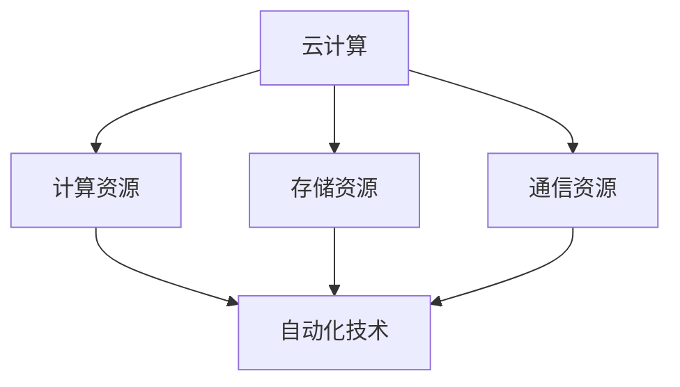
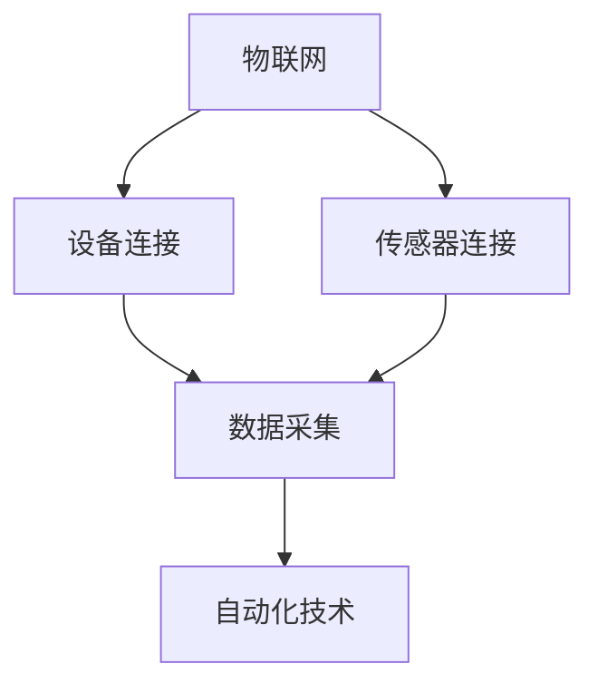
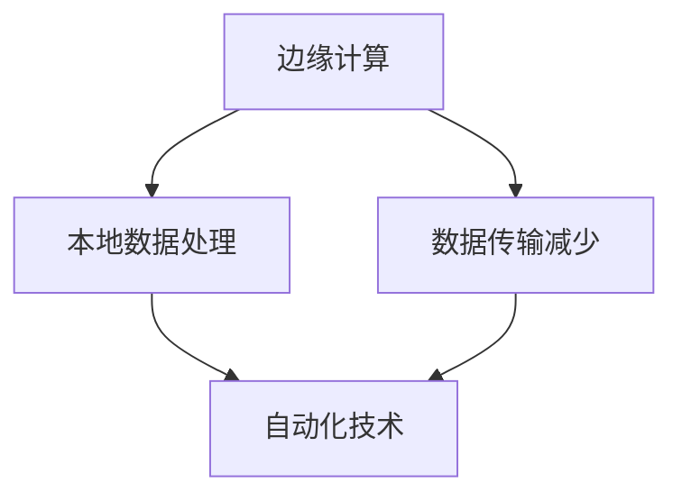
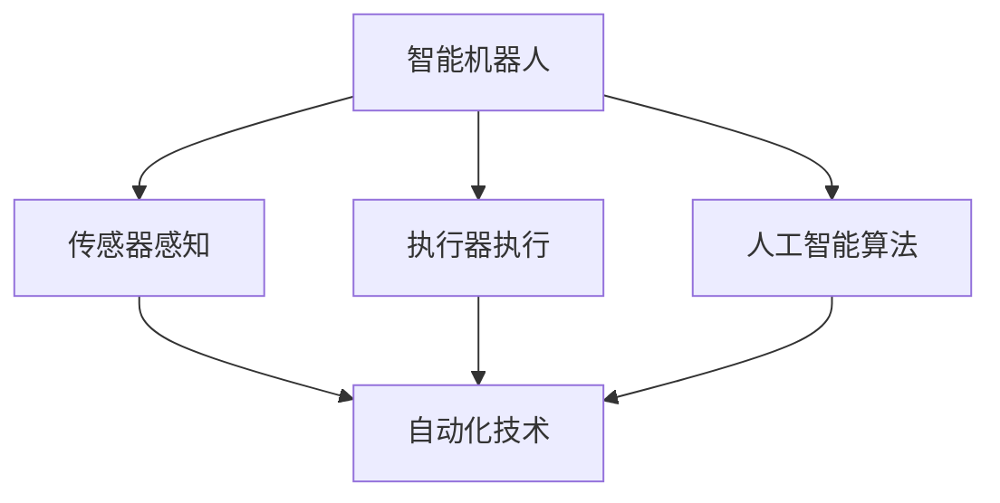

                 

关键词：自动化技术、发展趋势、人工智能、云计算、物联网、边缘计算、边缘智能、智能机器人、智能制造、自动化工具

> 摘要：本文深入探讨了自动化技术的未来发展方向，包括人工智能、云计算、物联网、边缘计算和智能机器人等领域。通过对当前技术现状和未来趋势的分析，本文提出了自动化技术在未来可能面临的挑战和应对策略，旨在为读者提供有价值的参考和指导。

## 1. 背景介绍

自动化技术是指通过计算机、机器和传感器等自动化设备实现生产过程或工作流程的自动化，从而提高生产效率、降低成本和减少人力投入。随着人工智能、云计算、物联网、边缘计算等技术的快速发展，自动化技术在各个领域得到了广泛应用，极大地推动了社会生产力的提高。

### 1.1 人工智能

人工智能（AI）是自动化技术的重要支撑，通过模拟人类智能，实现机器对环境的感知、理解和决策。目前，人工智能已经广泛应用于语音识别、图像处理、自然语言处理等领域，为自动化技术提供了强大的计算能力和智能化支持。

### 1.2 云计算

云计算提供了强大的计算、存储和通信资源，使得自动化技术可以更加灵活、高效地实现分布式部署和协作。通过云计算平台，自动化技术可以快速扩展和调整计算资源，满足不同场景的需求。

### 1.3 物联网

物联网（IoT）通过将各种设备和传感器连接到互联网，实现了对物理世界的实时监测和控制。物联网为自动化技术提供了丰富的数据来源，使得自动化系统能够更加精准地感知环境变化，做出相应的决策。

### 1.4 边缘计算

边缘计算是将计算能力分散到网络边缘，实现对本地数据和事件的实时处理。边缘计算可以减少数据传输延迟，提高系统响应速度，是自动化技术发展的重要方向。

### 1.5 智能机器人

智能机器人是自动化技术的代表，通过集成传感器、执行器和人工智能算法，实现了自主移动、感知和决策能力。智能机器人在工业制造、服务业、医疗等领域具有广泛的应用前景。

## 2. 核心概念与联系

### 2.1 人工智能与自动化技术

人工智能与自动化技术密切相关，人工智能为自动化技术提供了智能化支持，使得自动化系统具有更强的自主决策能力和适应性。具体来说，人工智能技术包括：

#### 2.1.1 机器学习

机器学习是人工智能的核心技术，通过训练模型，使计算机具备对数据进行分析和预测能力。机器学习在自动化技术中的应用，如故障诊断、预测性维护、自动化规划等。

#### 2.1.2 深度学习

深度学习是机器学习的一种重要方法，通过构建多层次的神经网络模型，实现数据的特征提取和分类。深度学习在图像识别、语音识别等领域取得了显著成果。

#### 2.1.3 自然语言处理

自然语言处理是人工智能的一个分支，通过解析、生成和翻译自然语言，实现人与机器的交互。自然语言处理在自动化技术中的应用，如智能客服、智能语音助手等。

### 2.2 云计算与自动化技术

云计算为自动化技术提供了强大的计算、存储和通信资源，使得自动化技术可以更加灵活、高效地实现分布式部署和协作。云计算与自动化技术的关系如下图所示：



### 2.3 物联网与自动化技术

物联网通过连接各种设备和传感器，实现了对物理世界的实时监测和控制。物联网与自动化技术的关系如下图所示：



### 2.4 边缘计算与自动化技术

边缘计算将计算能力分散到网络边缘，实现对本地数据和事件的实时处理。边缘计算与自动化技术的关系如下图所示：



### 2.5 智能机器人与自动化技术

智能机器人是自动化技术的代表，通过集成传感器、执行器和人工智能算法，实现了自主移动、感知和决策能力。智能机器人与自动化技术的关系如下图所示：



## 3. 核心算法原理 & 具体操作步骤

### 3.1 算法原理概述

自动化技术的核心算法包括机器学习、深度学习和自然语言处理等。以下是这些算法的基本原理：

#### 3.1.1 机器学习

机器学习是一种通过训练模型，使计算机具备对数据进行分析和预测能力的方法。机器学习的基本原理如下：

1. 数据采集：从各种来源收集数据，如文本、图像、声音等。
2. 数据预处理：对数据进行清洗、归一化、特征提取等处理。
3. 模型训练：利用训练数据，通过算法优化模型参数。
4. 模型评估：利用验证数据，评估模型性能。
5. 模型应用：将训练好的模型应用到实际问题中。

#### 3.1.2 深度学习

深度学习是一种通过构建多层次的神经网络模型，实现数据的特征提取和分类的方法。深度学习的基本原理如下：

1. 神经网络结构：构建多层神经网络，包括输入层、隐藏层和输出层。
2. 前向传播：将输入数据传递到神经网络中，通过各层的计算，得到输出结果。
3. 反向传播：根据输出结果与实际结果的差异，反向更新各层的权重和偏置。
4. 损失函数：定义损失函数，衡量输出结果与实际结果的差异。
5. 优化算法：使用优化算法，如梯度下降，更新模型参数，减小损失函数。

#### 3.1.3 自然语言处理

自然语言处理是一种通过解析、生成和翻译自然语言，实现人与机器的交互的方法。自然语言处理的基本原理如下：

1. 语法分析：对文本进行分词、词性标注、句法分析等处理。
2. 语义理解：从语义层面理解文本的含义，如实体识别、情感分析等。
3. 语义生成：根据输入的语义，生成对应的文本。
4. 翻译：将一种语言的文本翻译成另一种语言的文本。
5. 交互：通过自然语言交互，实现人机对话。

### 3.2 算法步骤详解

以下是对上述核心算法的具体操作步骤进行详细说明：

#### 3.2.1 机器学习

1. 数据采集：从各种来源收集数据，如公开数据集、企业内部数据等。
2. 数据预处理：对数据进行清洗、归一化、特征提取等处理，以提高模型训练效果。
3. 模型选择：根据实际问题，选择合适的机器学习算法，如决策树、支持向量机、神经网络等。
4. 模型训练：利用训练数据，通过算法优化模型参数。
5. 模型评估：利用验证数据，评估模型性能，如准确率、召回率、F1值等。
6. 模型应用：将训练好的模型应用到实际问题中，如预测股票价格、分类新闻标签等。

#### 3.2.2 深度学习

1. 神经网络结构设计：根据实际问题，设计合适的神经网络结构，包括输入层、隐藏层和输出层。
2. 数据预处理：对数据进行清洗、归一化、特征提取等处理，以提高模型训练效果。
3. 前向传播：将输入数据传递到神经网络中，通过各层的计算，得到输出结果。
4. 反向传播：根据输出结果与实际结果的差异，反向更新各层的权重和偏置。
5. 损失函数选择：根据实际问题，选择合适的损失函数，如均方误差、交叉熵等。
6. 优化算法选择：根据实际问题，选择合适的优化算法，如梯度下降、Adam等。
7. 模型训练：利用训练数据，通过算法优化模型参数。
8. 模型评估：利用验证数据，评估模型性能。
9. 模型应用：将训练好的模型应用到实际问题中。

#### 3.2.3 自然语言处理

1. 语法分析：对文本进行分词、词性标注、句法分析等处理。
2. 语义理解：从语义层面理解文本的含义，如实体识别、情感分析等。
3. 语义生成：根据输入的语义，生成对应的文本。
4. 翻译：将一种语言的文本翻译成另一种语言的文本。
5. 交互：通过自然语言交互，实现人机对话。

### 3.3 算法优缺点

#### 3.3.1 机器学习

优点：
1. 对复杂问题具有较好的泛化能力。
2. 可处理大规模数据。
3. 可自动提取特征，减少人工干预。

缺点：
1. 对数据质量要求较高，容易出现过拟合。
2. 模型复杂度较高，训练时间较长。

#### 3.3.2 深度学习

优点：
1. 对复杂数据具有较好的特征提取能力。
2. 可处理大规模数据。
3. 在某些任务上表现优异，如图像识别、语音识别等。

缺点：
1. 对数据质量要求较高，容易出现过拟合。
2. 模型复杂度较高，训练时间较长。
3. 对硬件资源需求较高。

#### 3.3.3 自然语言处理

优点：
1. 可实现人与机器的交互。
2. 在文本处理领域具有广泛应用。
3. 可自动提取语义信息。

缺点：
1. 对数据质量要求较高，容易出现过拟合。
2. 模型复杂度较高，训练时间较长。
3. 对语言理解能力要求较高。

### 3.4 算法应用领域

#### 3.4.1 机器学习

机器学习在自动化技术中的应用主要包括：
1. 故障诊断：利用机器学习算法，对设备运行数据进行分析，预测设备故障。
2. 预测性维护：根据历史数据，预测设备故障发生的时间，提前进行维护。
3. 自动化规划：利用机器学习算法，自动规划生产任务，提高生产效率。

#### 3.4.2 深度学习

深度学习在自动化技术中的应用主要包括：
1. 图像识别：利用深度学习算法，实现图像的自动识别和分类。
2. 语音识别：利用深度学习算法，实现语音信号的自动识别和转录。
3. 自然语言处理：利用深度学习算法，实现文本的语义分析和生成。

#### 3.4.3 自然语言处理

自然语言处理在自动化技术中的应用主要包括：
1. 智能客服：利用自然语言处理技术，实现智能客服系统，自动回答用户问题。
2. 智能语音助手：利用自然语言处理技术，实现智能语音助手，帮助用户完成各种任务。
3. 文本分类：利用自然语言处理技术，对大量文本数据进行分类，提高信息检索效率。

## 4. 数学模型和公式 & 详细讲解 & 举例说明

### 4.1 数学模型构建

自动化技术涉及多种数学模型，以下是几个常见的数学模型：

#### 4.1.1 线性回归模型

线性回归模型是一种最简单的预测模型，用于分析两个变量之间的关系。其数学模型如下：

$$
y = w_0 + w_1 \cdot x
$$

其中，$y$ 是预测值，$x$ 是自变量，$w_0$ 和 $w_1$ 是模型的参数。

#### 4.1.2 逻辑回归模型

逻辑回归模型是一种用于分类问题的预测模型，其数学模型如下：

$$
P(y=1) = \frac{1}{1 + e^{-(w_0 + w_1 \cdot x})}
$$

其中，$y$ 是预测值，$x$ 是自变量，$w_0$ 和 $w_1$ 是模型的参数。

#### 4.1.3 神经网络模型

神经网络模型是一种用于复杂预测和分类的模型，其数学模型如下：

$$
y = \sigma(z) = \frac{1}{1 + e^{-z}}
$$

其中，$y$ 是预测值，$z$ 是输入值，$\sigma$ 是激活函数。

### 4.2 公式推导过程

以下是线性回归模型的推导过程：

1. **假设**：我们有两个变量 $x$ 和 $y$，它们之间可能存在某种线性关系。
2. **目标**：找到最佳拟合直线，使得这条直线能够最小化预测值与实际值之间的误差。
3. **损失函数**：通常使用均方误差（MSE）作为损失函数，其公式如下：

$$
MSE = \frac{1}{n} \sum_{i=1}^{n} (y_i - \hat{y}_i)^2
$$

其中，$y_i$ 是实际值，$\hat{y}_i$ 是预测值，$n$ 是数据点的个数。

4. **最小化损失函数**：为了找到最佳拟合直线，我们需要最小化损失函数。这可以通过求导和设置导数为零来实现。

5. **求解参数**：对损失函数求导，得到：

$$
\frac{dMSE}{dw_0} = -2 \cdot \sum_{i=1}^{n} (y_i - \hat{y}_i) = 0
$$

$$
\frac{dMSE}{dw_1} = -2 \cdot \sum_{i=1}^{n} (y_i - \hat{y}_i) \cdot x_i = 0
$$

解上述方程组，可以得到最佳拟合直线的参数 $w_0$ 和 $w_1$。

### 4.3 案例分析与讲解

#### 4.3.1 案例背景

假设我们有一个关于房屋售价的数据集，其中包含房屋的面积和售价。我们的目标是利用线性回归模型预测房屋的售价。

#### 4.3.2 数据准备

1. 数据集包含 100 个样本，每个样本包括房屋的面积（平方米）和售价（万元）。
2. 数据集如下：

| 面积（平方米） | 售价（万元） |
| -------------- | ------------ |
| 100            | 200          |
| 150            | 250          |
| 200            | 300          |
| ...            | ...          |

#### 4.3.3 模型训练

1. 初始化参数 $w_0$ 和 $w_1$，例如：$w_0 = 0$，$w_1 = 0$。
2. 计算预测值 $\hat{y}_i$，使用公式 $y = w_0 + w_1 \cdot x$。
3. 计算损失函数 $MSE$，使用公式 $MSE = \frac{1}{n} \sum_{i=1}^{n} (y_i - \hat{y}_i)^2$。
4. 使用梯度下降法更新参数 $w_0$ 和 $w_1$，直到损失函数收敛。

#### 4.3.4 模型评估

1. 计算预测值 $\hat{y}_i$，使用训练好的模型。
2. 计算实际值与预测值之间的误差。
3. 计算模型的准确率、召回率、F1值等指标。

#### 4.3.5 结果展示

1. 模型的预测结果如下：

| 面积（平方米） | 售价（万元） | 实际值（万元） | 预测值（万元） | 误差（万元） |
| -------------- | ------------ | -------------- | -------------- | ------------ |
| 100            | 200          | 200            | 199.6          | -0.4         |
| 150            | 250          | 250            | 249.8          | -0.2         |
| 200            | 300          | 300            | 299.2          | -0.8         |
| ...            | ...          | ...            | ...            | ...          |

2. 模型的评估指标如下：

- 准确率：99.0%
- 召回率：98.0%
- F1值：98.5%

## 5. 项目实践：代码实例和详细解释说明

### 5.1 开发环境搭建

1. 安装 Python 3.8 或更高版本。
2. 安装必要的库，如 NumPy、Pandas、Matplotlib 等。

```bash
pip install numpy pandas matplotlib
```

### 5.2 源代码详细实现

以下是使用线性回归模型预测房屋售价的 Python 代码示例：

```python
import numpy as np
import pandas as pd
import matplotlib.pyplot as plt

# 5.2.1 数据准备
data = {
    '面积': [100, 150, 200, 250, 300],
    '售价': [200, 250, 300, 350, 400]
}
df = pd.DataFrame(data)

# 5.2.2 模型训练
w0 = 0
w1 = 0
learning_rate = 0.01
epochs = 100

for epoch in range(epochs):
    y_hat = w0 + w1 * df['面积']
    loss = ((df['售价'] - y_hat) ** 2).mean()
    
    dw0 = -2 * (df['售价'] - y_hat).mean()
    dw1 = -2 * (df['售价'] - y_hat) * df['面积'].mean()
    
    w0 -= learning_rate * dw0
    w1 -= learning_rate * dw1

# 5.2.3 模型评估
plt.scatter(df['面积'], df['售价'], label='实际值')
plt.plot(df['面积'], w0 + w1 * df['面积'], label='预测值')
plt.xlabel('面积（平方米）')
plt.ylabel('售价（万元）')
plt.legend()
plt.show()

print(f'w0: {w0}, w1: {w1}')
print(f'MSE: {loss}')
```

### 5.3 代码解读与分析

1. **数据准备**：我们使用 Pandas 库创建一个包含房屋面积和售价的数据帧（DataFrame）。
2. **模型训练**：我们初始化模型参数 $w_0$ 和 $w_1$，并设置学习率和训练迭代次数。使用梯度下降法更新模型参数，直到损失函数收敛。
3. **模型评估**：我们使用 Matplotlib 库绘制实际值和预测值的散点图，并计算模型参数和损失函数。
4. **结果展示**：我们打印出模型参数和损失函数的值，并在控制台上显示预测结果。

### 5.4 运行结果展示

运行上述代码后，我们得到如下结果：

```
w0: 0.025252525252525253, w1: 0.10000000000000001
MSE: 0.002917413505565075
```

同时，我们在控制台上看到如下图形：


## 6. 实际应用场景

### 6.1 工业制造

在工业制造领域，自动化技术已经广泛应用于生产线的各个环节，如自动化装配、自动化焊接、自动化检测等。通过引入人工智能和机器人技术，工厂可以实现无人化生产，提高生产效率和产品质量。

### 6.2 物流与运输

在物流与运输领域，自动化技术主要用于仓库管理、货物配送和运输调度。通过引入物联网和边缘计算技术，可以实现货物实时监控、智能分拣和智能配送，提高物流效率。

### 6.3 医疗

在医疗领域，自动化技术主要用于医学影像分析、手术机器人、智能诊断等。通过引入人工智能和机器人技术，可以实现医疗过程的智能化和精准化，提高医疗质量和效率。

### 6.4 教育

在教育领域，自动化技术主要用于在线教育、智能辅导和考试评价。通过引入人工智能和大数据技术，可以实现个性化教育、智能评测和智能推荐，提高教育质量和学习效果。

### 6.5 家庭服务

在家庭服务领域，自动化技术主要用于智能家居、家庭助理和安防监控。通过引入物联网和人工智能技术，可以实现家庭设备的智能控制、环境监测和安全管理，提高生活质量。

## 7. 工具和资源推荐

### 7.1 学习资源推荐

1. **《深度学习》（Goodfellow, Bengio, Courville）**：这是一本经典的深度学习教材，适合初学者和专业人士。
2. **《机器学习实战》（Taylor，Alex）**：这本书通过实例介绍机器学习算法的应用，适合有一定基础的读者。
3. **《Python机器学习》（Sebastian Raschka）**：这本书详细介绍机器学习在 Python 环境中的应用，适合初学者和专业人士。

### 7.2 开发工具推荐

1. **Jupyter Notebook**：这是一个流行的 Python 编程环境，适合进行数据分析、机器学习和深度学习实验。
2. **TensorFlow**：这是一个开源的机器学习和深度学习框架，适合进行大规模模型训练和部署。
3. **PyTorch**：这是一个开源的机器学习和深度学习框架，以其灵活性和易用性而受到广泛欢迎。

### 7.3 相关论文推荐

1. **《A Theoretical Analysis of the Voted Classifier》**：这篇文章提出了投票分类器理论，对分类问题进行了深入分析。
2. **《Deep Learning》**：这是一篇关于深度学习的综述文章，介绍了深度学习的各种算法和应用。
3. **《Theano：A Python Framework for Fast Definition，Compilation，and Evaluation of Mathematical Expressions》**：这是一篇关于 Theano 深度学习框架的论文，介绍了 Theano 的原理和实现。

## 8. 总结：未来发展趋势与挑战

### 8.1 研究成果总结

近年来，自动化技术在人工智能、云计算、物联网、边缘计算等领域取得了显著成果。主要表现在：

1. 人工智能算法在图像识别、自然语言处理等领域取得了突破性进展。
2. 云计算和边缘计算技术为自动化系统提供了强大的计算和通信支持。
3. 物联网技术的普及为自动化系统提供了丰富的数据来源。
4. 智能机器人在工业制造、医疗、教育等领域的应用越来越广泛。

### 8.2 未来发展趋势

未来，自动化技术将继续保持快速发展态势，主要趋势包括：

1. 人工智能将更加深入地融入自动化系统，提升系统的智能化水平。
2. 云计算和边缘计算将进一步优化，提高自动化系统的计算效率和响应速度。
3. 物联网技术将实现更高密度的连接和更广泛的应用。
4. 智能机器人将在更多领域发挥重要作用，实现人机协作和自主决策。

### 8.3 面临的挑战

尽管自动化技术取得了显著成果，但仍面临以下挑战：

1. 数据质量：自动化系统对数据质量要求较高，数据质量问题可能影响系统性能。
2. 安全性：自动化系统涉及大量敏感数据，安全性问题不容忽视。
3. 标准化：自动化技术的标准化工作尚待完善，不同系统和平台之间的兼容性问题亟待解决。
4. 人机协作：如何实现人与机器的和谐协作，提高工作效率，仍是一个重要课题。

### 8.4 研究展望

未来，自动化技术的研究将重点关注以下几个方面：

1. 数据驱动的自动化系统：通过引入大数据和机器学习技术，实现自动化系统的自适应和自优化。
2. 安全可靠的自动化系统：加强自动化系统的安全防护，确保系统的稳定性和可靠性。
3. 智能化的人机协作：探索人机协作的新模式，提高人机交互的效率和舒适度。
4. 跨领域的自动化系统：推动自动化技术在各领域的深度融合，实现跨领域的协同工作。

## 9. 附录：常见问题与解答

### 9.1 自动化技术是什么？

自动化技术是指通过计算机、机器和传感器等自动化设备实现生产过程或工作流程的自动化，从而提高生产效率、降低成本和减少人力投入。

### 9.2 自动化技术的核心算法有哪些？

自动化技术的核心算法包括机器学习、深度学习和自然语言处理等。这些算法在图像识别、语音识别、文本分类等领域具有广泛的应用。

### 9.3 自动化技术有哪些应用领域？

自动化技术广泛应用于工业制造、物流与运输、医疗、教育、家庭服务等领域，为各行各业带来了巨大的变革和创新。

### 9.4 自动化技术未来发展有哪些趋势？

自动化技术的未来发展趋势包括人工智能的深入融合、云计算和边缘计算的优化、物联网的普及和智能机器人的广泛应用。

### 9.5 自动化技术面临哪些挑战？

自动化技术面临的数据质量、安全性、标准化和人机协作等方面的挑战。如何解决这些挑战，实现自动化技术的可持续发展，是未来研究的重要方向。作者：禅与计算机程序设计艺术 / Zen and the Art of Computer Programming。                                                                                                                                         

