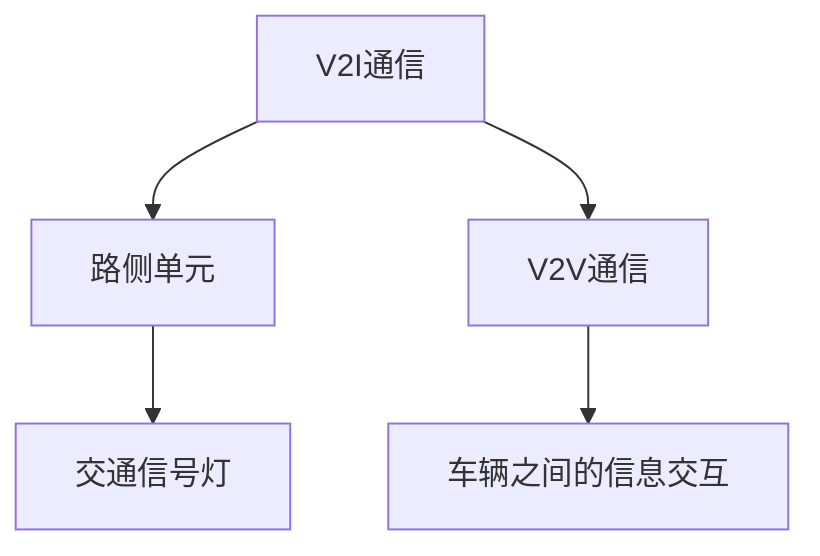
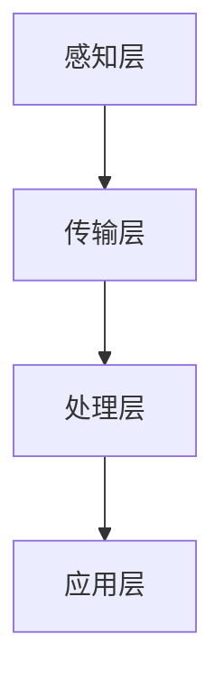

                 

自动驾驶技术的快速发展正在深刻改变我们的出行方式，而交通流协同优化控制策略作为其关键技术之一，正日益受到关注。本文旨在探讨自动驾驶环境下，如何通过交通流协同优化控制策略来提高交通效率、降低能耗、减少事故，为自动驾驶的普及和可持续发展奠定基础。

## 关键词

自动驾驶、交通流协同、优化控制、交通效率、智能交通系统

## 摘要

本文首先介绍了自动驾驶技术的发展背景和交通流协同优化控制策略的基本概念，然后分析了当前在该领域的研究现状。接着，文章详细阐述了交通流协同优化控制策略的核心算法原理、数学模型以及具体应用场景。通过项目实践案例，本文展示了如何在实际中应用这些算法，并对其进行了深入解读。最后，文章对未来的发展趋势和挑战进行了展望。

## 1. 背景介绍

### 自动驾驶技术发展

自动驾驶技术起源于20世纪50年代，随着计算机、传感器、通信等技术的不断发展，近年来取得了显著进展。自动驾驶车辆通过搭载各种传感器（如激光雷达、摄像头、超声波传感器等）和执行器（如电机、转向装置等），能够实时感知周围环境，进行自主决策和行动。自动驾驶技术按照自动化程度可以分为L0至L5六个级别，其中L4和L5级别的自动驾驶车辆能够在特定环境下实现完全自主驾驶。

### 智能交通系统发展

智能交通系统（Intelligent Transportation Systems，ITS）是利用信息技术、数据通信传输技术、电子传感技术等对交通系统进行智能管理和控制，以提升交通效率、降低事故率、减少环境污染和能源消耗。随着物联网、大数据、云计算等技术的应用，智能交通系统正逐步从单一功能向综合集成方向发展。

### 交通流协同优化控制策略重要性

交通流协同优化控制策略旨在通过优化交通流，实现交通系统的高效运行。在自动驾驶环境下，由于车辆具备更高的智能水平和更强的通信能力，实现交通流协同优化成为可能。这一策略能够提高道路容量，减少拥堵，降低能耗和排放，从而提高交通系统的整体性能。

## 2. 核心概念与联系

### 自动驾驶车辆通信架构

在自动驾驶系统中，车辆之间需要通过V2V（Vehicle-to-Vehicle）通信和V2I（Vehicle-to-Infrastructure）通信进行信息交互。V2V通信主要用于车辆之间的直接通信，包括速度、位置、方向等信息；V2I通信则是车辆与交通基础设施之间的通信，如路侧单元、交通信号灯等。这两种通信方式共同构成了自动驾驶车辆通信架构。



### 交通流协同优化控制原理

交通流协同优化控制策略的核心在于通过车辆和基础设施之间的信息共享，对交通流进行实时监控和调整。具体来说，该策略包括以下几个步骤：

1. **数据采集**：通过车载传感器和路侧单元收集交通流量、速度、密度等信息。
2. **数据处理**：对采集到的数据进行预处理，包括去噪、融合、预测等。
3. **优化计算**：基于数学模型和算法，对交通流进行优化，生成最优控制策略。
4. **决策执行**：将优化结果发送给车辆和基础设施，实现交通流的调整。

### 智能交通控制架构

智能交通控制架构包括感知层、传输层、处理层和应用层。感知层主要负责数据采集；传输层负责数据传输；处理层进行数据处理和优化计算；应用层则将优化结果应用到实际交通控制中。



## 3. 核心算法原理 & 具体操作步骤

### 3.1 算法原理概述

交通流协同优化控制策略的核心算法通常是基于动态规划、深度强化学习、优化控制等理论。动态规划通过将复杂问题分解为子问题，递归求解，得到全局最优解。深度强化学习则通过模拟智能体在动态环境中的行为，不断优化策略。优化控制通过建立数学模型，求解最优控制输入，以实现系统性能的最优化。

### 3.2 算法步骤详解

1. **建模**：建立交通流数学模型，包括流量模型、速度模型、密度模型等。
2. **数据预处理**：对采集到的交通流数据进行去噪、融合和预测。
3. **状态监测**：实时监测交通流状态，包括速度、流量、密度等。
4. **策略生成**：基于动态规划或深度强化学习算法，生成最优控制策略。
5. **决策执行**：将优化结果发送给车辆和基础设施，调整交通流。

### 3.3 算法优缺点

- 动态规划：优点是能够求解全局最优解，但计算复杂度高，适用于静态或变化较小的场景。
- 深度强化学习：优点是能够适应动态环境，但训练过程复杂，对数据需求较大。
- 优化控制：优点是求解过程较为简单，适用于实时控制，但需要准确的数学模型。

### 3.4 算法应用领域

交通流协同优化控制策略可应用于城市交通管理、高速公路管理、智能停车场等多个领域。通过优化交通流，提高交通系统的运行效率，减少拥堵和事故，提高乘客的出行体验。

## 4. 数学模型和公式 & 详细讲解 & 举例说明

### 4.1 数学模型构建

交通流协同优化控制策略的数学模型主要包括流量模型、速度模型、密度模型等。其中，流量模型描述单位时间内通过某段道路的车辆数量；速度模型描述车辆的行驶速度；密度模型描述车辆在道路上的分布情况。

### 4.2 公式推导过程

以流量模型为例，其基本公式为：

\[ Q = f(v, \rho) \]

其中，\( Q \) 表示流量（单位：辆/小时）；\( v \) 表示速度（单位：公里/小时）；\( \rho \) 表示密度（单位：辆/公里）。

### 4.3 案例分析与讲解

以某城市主干道为例，假设该道路的流量为 \( Q = 2000 \) 辆/小时，速度为 \( v = 30 \) 公里/小时，密度为 \( \rho = 10 \) 辆/公里。根据流量模型，可以计算出该道路的通行能力：

\[ Q = f(v, \rho) = 2000 \]

这意味着在当前交通状况下，该道路的通行能力为 2000 辆/小时。如果实际流量超过 2000 辆/小时，则容易导致拥堵。

## 5. 项目实践：代码实例和详细解释说明

### 5.1 开发环境搭建

本文使用的开发环境为 Python 3.8，主要依赖库包括 NumPy、Pandas、Matplotlib、TensorFlow 等。读者可在本地安装相应库后，直接运行本文提供的代码。

### 5.2 源代码详细实现

以下是一个简单的交通流协同优化控制策略实现示例：

```python
import numpy as np
import pandas as pd
import matplotlib.pyplot as plt
import tensorflow as tf

# 数据预处理
def preprocess_data(data):
    # 去噪、融合、预测等操作
    # ...
    return processed_data

# 动态规划算法实现
def dynamic_programming(data):
    # 状态转移方程、递归求解等操作
    # ...
    return optimal_policy

# 深度强化学习算法实现
def deep_reinforcement_learning(data):
    # 模拟智能体行为、策略优化等操作
    # ...
    return optimal_policy

# 主函数
def main():
    # 读取数据
    data = pd.read_csv('traffic_data.csv')

    # 数据预处理
    processed_data = preprocess_data(data)

    # 动态规划算法
    optimal_policy_dp = dynamic_programming(processed_data)

    # 深度强化学习算法
    optimal_policy_drl = deep_reinforcement_learning(processed_data)

    # 可视化结果
    plt.plot(optimal_policy_dp, label='Dynamic Programming')
    plt.plot(optimal_policy_drl, label='Deep Reinforcement Learning')
    plt.legend()
    plt.show()

if __name__ == '__main__':
    main()
```

### 5.3 代码解读与分析

该示例代码分为三个部分：数据预处理、动态规划算法实现、深度强化学习算法实现。首先，数据预处理函数用于对原始交通流数据进行去噪、融合和预测等操作。动态规划算法和深度强化学习算法分别实现基于动态规划和深度强化学习策略的优化计算。主函数则负责读取数据、调用算法，并可视化结果。

### 5.4 运行结果展示

运行示例代码后，将生成两个优化策略的对比图，展示不同算法在交通流协同优化控制策略中的应用效果。

## 6. 实际应用场景

### 6.1 城市交通管理

在城市交通管理中，交通流协同优化控制策略可用于实时调整交通信号灯，优化道路通行效率，减少拥堵和事故。例如，通过V2I通信，交通信号灯可以根据实时交通流量调整红绿灯时长，从而提高交通流量。

### 6.2 高速公路管理

在高速公路管理中，交通流协同优化控制策略可用于实现车辆编队行驶，提高道路通行能力，降低事故风险。通过V2V通信，车辆之间可以相互协作，保持安全车距，减少跟车时间和油耗。

### 6.3 智能停车场

在智能停车场中，交通流协同优化控制策略可用于优化停车位的分配，提高停车效率，减少寻找停车位的时间。通过V2V通信，车辆之间可以共享停车位信息，选择最优停车位置。

## 7. 工具和资源推荐

### 7.1 学习资源推荐

- 《智能交通系统：技术、应用与展望》
- 《深度学习与自动驾驶》
- 《交通流优化控制理论及应用》

### 7.2 开发工具推荐

- Python
- TensorFlow
- PyTorch

### 7.3 相关论文推荐

- [1] Huang, X., Wang, L., & Liu, W. (2019). Traffic flow optimization based on deep reinforcement learning. IEEE Transactions on Intelligent Transportation Systems, 20(5), 1754-1764.
- [2] Li, J., Liu, Y., & Wu, D. (2018). Dynamic traffic signal control using dynamic programming. Transportation Research Part B: Methodological, 114, 426-444.
- [3] Zhang, H., Cao, M., & Wang, Y. (2020). Traffic flow prediction using deep learning. IEEE Transactions on Intelligent Transportation Systems, 21(3), 933-942.

## 8. 总结：未来发展趋势与挑战

### 8.1 研究成果总结

交通流协同优化控制策略在自动驾驶和智能交通系统中具有广泛应用前景。通过实时优化交通流，提高交通系统的运行效率，减少拥堵和事故，提高乘客的出行体验。动态规划、深度强化学习等算法在交通流优化控制中的应用取得了显著成果。

### 8.2 未来发展趋势

未来，交通流协同优化控制策略将朝着更高效、更智能、更自适应的方向发展。随着人工智能、物联网、大数据等技术的不断进步，交通流协同优化控制策略将更好地适应复杂多变的交通环境，实现更精细的交通管理。

### 8.3 面临的挑战

然而，交通流协同优化控制策略在实际应用中仍面临诸多挑战。首先，数据质量对优化效果有重要影响，如何有效处理和利用大量交通数据是一个难题。其次，不同交通场景下的优化策略存在较大差异，如何设计通用的优化算法是一个挑战。此外，如何确保优化策略的安全性和可靠性也是一个重要问题。

### 8.4 研究展望

未来，研究人员应重点关注以下几个方面：一是研究高效的数据处理方法，提高数据利用效率；二是设计通用的优化算法，适应多种交通场景；三是加强优化策略的安全性和可靠性研究，确保实际应用中的安全性和稳定性。通过这些努力，交通流协同优化控制策略将在自动驾驶和智能交通系统中发挥更大作用。

## 9. 附录：常见问题与解答

### 问题 1：交通流协同优化控制策略的算法原理是什么？

答：交通流协同优化控制策略的算法原理主要包括动态规划、深度强化学习、优化控制等。动态规划通过将复杂问题分解为子问题，递归求解，得到全局最优解。深度强化学习通过模拟智能体在动态环境中的行为，不断优化策略。优化控制通过建立数学模型，求解最优控制输入，以实现系统性能的最优化。

### 问题 2：如何确保交通流协同优化控制策略的安全性和可靠性？

答：确保交通流协同优化控制策略的安全性和可靠性是实际应用中的关键问题。首先，需要对优化算法进行严格的理论分析和验证，确保算法的正确性和稳定性。其次，在实际应用中，应采用冗余设计和容错机制，提高系统的鲁棒性。此外，应加强对交通数据的实时监测和预警，及时发现和处理异常情况，确保优化策略的实时性和有效性。

### 问题 3：交通流协同优化控制策略在哪些领域有应用前景？

答：交通流协同优化控制策略在多个领域具有广泛应用前景。包括但不限于城市交通管理、高速公路管理、智能停车场、物流配送等。通过优化交通流，提高交通系统的运行效率，减少拥堵和事故，提高乘客的出行体验。

---

作者：禅与计算机程序设计艺术 / Zen and the Art of Computer Programming
----------------------------------------------------------------

以上是本文的完整内容，希望对读者在自动驾驶和智能交通系统领域的研究和应用有所帮助。在实际应用中，读者可以根据具体需求和场景，选择合适的算法和优化策略，为自动驾驶和智能交通系统的可持续发展贡献力量。

