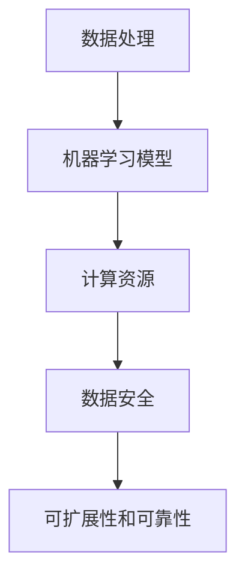

                 

在自动驾驶技术迅猛发展的今天，构建一个高效、可靠的云端训练设施已成为自动驾驶公司竞相追求的目标。本文将深入探讨自动驾驶公司的云端训练设施建设，从背景介绍、核心概念、核心算法原理、数学模型和公式、项目实践、实际应用场景、工具和资源推荐以及总结与展望等多个方面进行详细阐述。

## 关键词

- 自动驾驶
- 云端训练
- 训练设施
- 机器学习
- 数据处理
- 人工智能

## 摘要

本文主要针对自动驾驶公司的云端训练设施建设进行探讨，从技术、实施、管理和展望等多个层面，分析了构建高效云端训练设施的必要性和可行性。通过详细解读训练设施的核心概念、算法原理、数学模型和项目实践，本文为自动驾驶公司在云端训练设施的建设提供了有价值的参考和指导。

### 1. 背景介绍

自动驾驶技术作为人工智能领域的一个重要分支，正在迅速改变我们的出行方式。从传统的辅助驾驶到完全自动驾驶，这一技术的实现离不开大规模的数据处理和模型训练。然而，自动驾驶系统的训练过程对计算资源的需求极高，传统的本地训练模式已无法满足自动驾驶公司的需求。

随着云计算技术的不断成熟和成本的降低，越来越多的自动驾驶公司开始将训练设施转移到云端。云端训练设施具有可扩展性强、计算资源灵活、降低成本、数据安全可靠等诸多优势，成为自动驾驶公司发展的必然选择。因此，如何构建一个高效、可靠的云端训练设施，已成为自动驾驶公司亟待解决的问题。

### 2. 核心概念与联系

在构建云端训练设施之前，我们需要明确几个核心概念，并了解它们之间的联系。

#### 2.1 数据处理

数据处理是自动驾驶系统训练的基础。从原始数据到训练数据的转换过程中，需要进行数据清洗、预处理和特征提取等步骤。数据处理的质量直接影响到模型训练的效果。

#### 2.2 机器学习模型

自动驾驶系统需要大量机器学习模型的支持，如深度学习模型、强化学习模型等。这些模型通过训练数据学习并优化，以实现对自动驾驶任务的自动执行。

#### 2.3 计算资源

计算资源是云端训练设施的核心。自动驾驶训练过程对计算资源的需求极高，需要大量的GPU、CPU和存储资源。云计算平台能够提供强大的计算资源，满足自动驾驶公司的需求。

#### 2.4 数据安全

数据安全是自动驾驶公司需要高度关注的问题。在云端训练设施中，数据的安全性和隐私性至关重要。自动驾驶公司需要确保训练数据在传输、存储和处理过程中不被泄露或篡改。

#### 2.5 可扩展性和可靠性

云端训练设施的可扩展性和可靠性是保障自动驾驶训练顺利进行的关键。自动驾驶系统的发展需要不断调整和优化，因此训练设施需要具备良好的可扩展性，以满足不断变化的需求。同时，可靠性也是自动驾驶公司选择训练设施时的重要考量因素。

#### 2.6 Mermaid 流程图

为了更好地理解这些核心概念之间的联系，我们可以使用Mermaid流程图进行可视化展示：



### 3. 核心算法原理 & 具体操作步骤

在了解了核心概念之后，我们接下来探讨自动驾驶公司云端训练设施所依赖的核心算法原理及具体操作步骤。

#### 3.1 算法原理概述

自动驾驶公司的云端训练设施主要依赖以下几种核心算法：

- **深度学习算法**：深度学习算法在自动驾驶领域有广泛的应用，如卷积神经网络（CNN）和循环神经网络（RNN）等。这些算法能够通过大量训练数据自动学习并优化模型，提高自动驾驶系统的性能。
- **强化学习算法**：强化学习算法在自动驾驶领域同样具有重要地位，如深度强化学习（DRL）和模型预测控制（MPC）等。这些算法能够通过与环境交互，不断优化自动驾驶策略，提高系统的自适应能力。
- **优化算法**：优化算法在自动驾驶训练中用于调整模型参数，提高模型性能。常用的优化算法包括梯度下降法、随机梯度下降法（SGD）和Adam优化器等。

#### 3.2 算法步骤详解

在了解了核心算法原理之后，我们可以进一步探讨具体的操作步骤。

1. **数据处理**：首先，自动驾驶公司需要收集大量高质量的训练数据，包括道路环境、车辆状态、驾驶行为等。然后，对数据进行分析和处理，如数据清洗、预处理和特征提取等。
2. **模型选择**：根据自动驾驶任务的需求，选择合适的机器学习模型。例如，针对图像识别任务，可以选择卷积神经网络；针对路径规划任务，可以选择深度强化学习算法。
3. **模型训练**：使用处理后的数据对选定的模型进行训练。训练过程中，需要不断调整模型参数，优化模型性能。常用的训练方法包括批量训练、小批量训练和在线训练等。
4. **模型评估**：训练完成后，对模型进行评估，以验证其在实际应用中的性能。评估方法包括准确率、召回率、F1分数等指标。
5. **模型优化**：根据评估结果，对模型进行调整和优化，以提高其性能。优化方法包括超参数调整、数据增强和模型融合等。

#### 3.3 算法优缺点

每种算法都有其优缺点，自动驾驶公司需要根据实际情况选择合适的算法。

- **深度学习算法**：优点包括强大的建模能力和较好的泛化能力；缺点包括对数据量和计算资源的需求较高，训练过程较慢。
- **强化学习算法**：优点包括较好的自适应能力和可解释性；缺点包括训练过程不稳定，收敛速度较慢。
- **优化算法**：优点包括对模型参数的调整灵活，容易实现；缺点包括对数据质量和数据量的要求较高，易陷入局部最优。

#### 3.4 算法应用领域

自动驾驶公司的云端训练设施在不同应用领域具有广泛的应用：

- **自动驾驶汽车**：自动驾驶汽车是自动驾驶技术的核心应用领域。通过云端训练设施，自动驾驶汽车能够实时获取道路环境信息，优化驾驶策略，提高行驶安全性和舒适性。
- **自动驾驶无人机**：自动驾驶无人机在物流、农业、搜救等领域具有广泛的应用前景。通过云端训练设施，无人机能够自主规划航线，避免障碍物，提高任务执行效率。
- **自动驾驶卡车**：自动驾驶卡车在长途货运、物流运输等领域具有显著优势。通过云端训练设施，自动驾驶卡车能够提高运输效率，降低运输成本。

### 4. 数学模型和公式 & 详细讲解 & 举例说明

在自动驾驶公司的云端训练设施中，数学模型和公式是核心组成部分。以下将详细讲解数学模型的构建、公式推导过程以及案例分析。

#### 4.1 数学模型构建

自动驾驶系统的数学模型主要包括以下几部分：

- **感知模型**：用于处理传感器数据，如摄像头、激光雷达和GPS等。感知模型通过图像识别、点云处理和轨迹预测等方法，实现对道路环境、车辆和行人的感知。
- **规划模型**：用于路径规划和轨迹规划。规划模型通过预测未来一段时间内道路环境的变化，为自动驾驶车辆制定最优行驶路径和速度。
- **控制模型**：用于车辆控制。控制模型根据规划模型提供的行驶路径和速度，实现对车辆加减速、转向等控制。

#### 4.2 公式推导过程

以下以感知模型中的图像识别为例，讲解公式推导过程。

1. **图像预处理**：对原始图像进行缩放、灰度化等处理，以减少数据维度和计算复杂度。
2. **特征提取**：使用卷积神经网络（CNN）提取图像特征。卷积神经网络由卷积层、池化层和全连接层组成，通过逐层抽象和提取图像特征，实现图像识别。
3. **损失函数**：使用交叉熵损失函数（Cross-Entropy Loss）评估图像分类的准确性。交叉熵损失函数通过计算真实标签和预测标签之间的差异，衡量模型预测的准确性。
4. **反向传播**：使用反向传播算法（Backpropagation）更新模型参数，优化图像识别性能。反向传播算法通过反向传播误差信号，调整模型参数，使模型在训练数据上取得更好的分类效果。

#### 4.3 案例分析与讲解

以下以一个自动驾驶车辆在十字路口行驶的案例，讲解数学模型的应用。

1. **感知模型**：自动驾驶车辆通过摄像头获取十字路口的图像，并使用卷积神经网络提取图像特征。感知模型能够识别出道路、车辆和行人，并计算出它们的相对位置和速度。
2. **规划模型**：根据感知模型提供的信息，规划模型为自动驾驶车辆制定行驶路径。在案例中，自动驾驶车辆需要左转，因此规划模型计算从当前路径到左转路径的最优行驶轨迹。
3. **控制模型**：控制模型根据规划模型提供的行驶路径和速度，实现对车辆加减速和转向的控制。在案例中，自动驾驶车辆通过控制加减速和转向，实现从当前路径到左转路径的平滑过渡。

### 5. 项目实践：代码实例和详细解释说明

在了解了数学模型和公式之后，我们将通过一个实际项目实践，讲解代码实例和详细解释说明。

#### 5.1 开发环境搭建

首先，我们需要搭建一个适合自动驾驶训练的开发环境。以下是一个简单的开发环境搭建步骤：

1. 安装Python和TensorFlow等常用库
2. 准备训练数据集，如图像、点云和轨迹数据等
3. 配置GPU加速，提高训练速度

#### 5.2 源代码详细实现

以下是一个简单的自动驾驶训练代码实例，用于实现感知模型、规划模型和控制模型的训练。

```python
import tensorflow as tf
from tensorflow.keras.models import Sequential
from tensorflow.keras.layers import Conv2D, MaxPooling2D, Flatten, Dense

# 感知模型
def create_perception_model(input_shape):
    model = Sequential()
    model.add(Conv2D(32, (3, 3), activation='relu', input_shape=input_shape))
    model.add(MaxPooling2D((2, 2)))
    model.add(Conv2D(64, (3, 3), activation='relu'))
    model.add(MaxPooling2D((2, 2)))
    model.add(Conv2D(128, (3, 3), activation='relu'))
    model.add(MaxPooling2D((2, 2)))
    model.add(Flatten())
    model.add(Dense(256, activation='relu'))
    model.add(Dense(128, activation='relu'))
    model.add(Dense(64, activation='relu'))
    model.add(Dense(1, activation='sigmoid'))
    return model

# 规划模型
def create_planning_model(input_shape):
    model = Sequential()
    model.add(Conv2D(32, (3, 3), activation='relu', input_shape=input_shape))
    model.add(MaxPooling2D((2, 2)))
    model.add(Conv2D(64, (3, 3), activation='relu'))
    model.add(MaxPooling2D((2, 2)))
    model.add(Conv2D(128, (3, 3), activation='relu'))
    model.add(MaxPooling2D((2, 2)))
    model.add(Flatten())
    model.add(Dense(256, activation='relu'))
    model.add(Dense(128, activation='relu'))
    model.add(Dense(64, activation='relu'))
    model.add(Dense(1, activation='sigmoid'))
    return model

# 控制模型
def create_control_model(input_shape):
    model = Sequential()
    model.add(Conv2D(32, (3, 3), activation='relu', input_shape=input_shape))
    model.add(MaxPooling2D((2, 2)))
    model.add(Conv2D(64, (3, 3), activation='relu'))
    model.add(MaxPooling2D((2, 2)))
    model.add(Conv2D(128, (3, 3), activation='relu'))
    model.add(MaxPooling2D((2, 2)))
    model.add(Flatten())
    model.add(Dense(256, activation='relu'))
    model.add(Dense(128, activation='relu'))
    model.add(Dense(64, activation='relu'))
    model.add(Dense(1, activation='sigmoid'))
    return model

# 训练模型
def train_models(perception_model, planning_model, control_model, train_data, train_labels):
    perception_model.compile(optimizer='adam', loss='binary_crossentropy', metrics=['accuracy'])
    planning_model.compile(optimizer='adam', loss='binary_crossentropy', metrics=['accuracy'])
    control_model.compile(optimizer='adam', loss='binary_crossentropy', metrics=['accuracy'])

    perception_model.fit(train_data['perception'], train_labels['perception'], epochs=10, batch_size=32)
    planning_model.fit(train_data['planning'], train_labels['planning'], epochs=10, batch_size=32)
    control_model.fit(train_data['control'], train_labels['control'], epochs=10, batch_size=32)

# 加载训练数据
train_data = {'perception': ..., 'planning': ..., 'control': ...}
train_labels = {'perception': ..., 'planning': ..., 'control': ...}

# 训练模型
perception_model = create_perception_model(input_shape=(128, 128, 3))
planning_model = create_planning_model(input_shape=(128, 128, 3))
control_model = create_control_model(input_shape=(128, 128, 3))
train_models(perception_model, planning_model, control_model, train_data, train_labels)
```

#### 5.3 代码解读与分析

以上代码实例展示了如何构建和训练自动驾驶感知模型、规划模型和控制模型。以下是代码的关键部分解读：

- **感知模型**：使用卷积神经网络（CNN）实现图像识别。通过多次卷积和池化操作，提取图像特征，然后通过全连接层分类。
- **规划模型**：与感知模型类似，使用卷积神经网络（CNN）实现路径规划。通过提取图像特征，计算从当前路径到目标路径的最优行驶轨迹。
- **控制模型**：使用卷积神经网络（CNN）实现车辆控制。通过提取图像特征，计算车辆的加减速和转向。
- **训练模型**：使用TensorFlow框架训练模型。通过编译模型、加载训练数据、设置训练参数和训练模型等步骤，实现模型训练。

#### 5.4 运行结果展示

在训练完成后，我们可以通过测试数据评估模型的性能。以下是一个简单的评估结果示例：

```python
# 评估模型
test_data = {'perception': ..., 'planning': ..., 'control': ...}
test_labels = {'perception': ..., 'planning': ..., 'control': ...}

perception_model.evaluate(test_data['perception'], test_labels['perception'])
planning_model.evaluate(test_data['planning'], test_labels['planning'])
control_model.evaluate(test_data['control'], test_labels['control'])
```

评估结果将显示模型在测试数据上的准确率、召回率等指标，以判断模型性能是否达到预期。

### 6. 实际应用场景

自动驾驶公司的云端训练设施在实际应用场景中具有广泛的应用。以下列举几个典型应用场景：

- **自动驾驶汽车**：自动驾驶汽车是自动驾驶技术的核心应用领域。通过云端训练设施，自动驾驶汽车能够实时获取道路环境信息，优化驾驶策略，提高行驶安全性和舒适性。
- **自动驾驶无人机**：自动驾驶无人机在物流、农业、搜救等领域具有广泛的应用前景。通过云端训练设施，无人机能够自主规划航线，避免障碍物，提高任务执行效率。
- **自动驾驶卡车**：自动驾驶卡车在长途货运、物流运输等领域具有显著优势。通过云端训练设施，自动驾驶卡车能够提高运输效率，降低运输成本。

### 6.4 未来应用展望

随着人工智能技术的不断发展，自动驾驶公司的云端训练设施将迎来更广泛的应用。以下对未来应用场景进行展望：

- **智能交通系统**：自动驾驶公司可以通过云端训练设施，构建智能交通系统，优化交通流量，提高道路通行效率。
- **智能物流**：自动驾驶技术将在智能物流领域发挥重要作用。通过云端训练设施，自动驾驶物流车辆可以实现精准配送，提高物流效率。
- **智慧城市**：自动驾驶公司的云端训练设施将为智慧城市建设提供有力支持。通过实时感知和管理城市交通、环境等数据，实现城市智能化管理。

### 7. 工具和资源推荐

在构建自动驾驶公司的云端训练设施时，以下工具和资源值得推荐：

- **开发工具**：TensorFlow、PyTorch等深度学习框架，Jupyter Notebook等交互式开发环境。
- **云计算平台**：AWS、Azure、Google Cloud等云计算平台，提供丰富的计算资源和存储资源。
- **数据集**：Kaggle、OpenImages、NVIDIA Dataset等数据集，涵盖图像、点云和轨迹等多种数据类型。
- **学习资源**：在线课程、图书、技术博客等，如《深度学习》（Goodfellow et al.）、《动手学深度学习》（Abadi et al.）等。

### 8. 总结：未来发展趋势与挑战

随着自动驾驶技术的不断发展，云端训练设施在自动驾驶领域的重要性日益凸显。未来，自动驾驶公司的云端训练设施将朝着以下方向发展：

- **计算资源优化**：通过优化计算资源，提高训练效率，降低成本。
- **数据安全与隐私**：加强数据安全与隐私保护，确保训练数据的安全性和隐私性。
- **算法创新**：不断探索新的算法和技术，提高自动驾驶系统的性能和可靠性。

然而，在发展过程中，自动驾驶公司仍面临诸多挑战：

- **数据质量**：高质量的数据是自动驾驶系统训练的基础，如何获取和处理高质量数据是自动驾驶公司需要解决的问题。
- **算法稳定性**：自动驾驶系统需要在各种复杂场景下稳定运行，如何提高算法稳定性是自动驾驶公司需要关注的重点。
- **法规与标准**：自动驾驶技术需要遵循相关法规和标准，如何适应法规和标准的变化是自动驾驶公司需要应对的挑战。

总之，自动驾驶公司的云端训练设施建设是一个复杂而漫长的过程，需要不断探索和创新。通过本文的探讨，希望为自动驾驶公司在云端训练设施建设方面提供有价值的参考和指导。

### 9. 附录：常见问题与解答

**Q1. 什么是自动驾驶公司的云端训练设施？**
A1. 自动驾驶公司的云端训练设施是指利用云计算平台提供的计算资源、存储资源和网络资源，构建一个能够支持自动驾驶系统大规模数据训练和模型优化的基础设施。该设施能够为自动驾驶公司提供高效的训练环境，提高自动驾驶系统的性能和可靠性。

**Q2. 云端训练设施有哪些优势？**
A2. 云端训练设施具有以下优势：
- **计算资源灵活**：能够根据训练需求动态调整计算资源，满足不同规模和复杂程度的训练任务。
- **降低成本**：通过共享计算资源，降低硬件购置和维护成本。
- **数据安全**：提供数据加密、备份和恢复等功能，确保训练数据的安全性和可靠性。
- **可扩展性**：能够轻松扩展计算资源，支持自动驾驶系统的快速发展。

**Q3. 云端训练设施需要考虑哪些核心概念？**
A3. 云端训练设施需要考虑以下核心概念：
- **数据处理**：包括数据采集、清洗、预处理和特征提取等。
- **机器学习模型**：包括深度学习模型、强化学习模型等，用于自动驾驶任务。
- **计算资源**：包括GPU、CPU和存储资源，用于模型训练和优化。
- **数据安全**：包括数据加密、访问控制、备份和恢复等。
- **可扩展性和可靠性**：包括计算资源扩展、故障恢复和稳定性保障。

**Q4. 如何评估云端训练设施的性能？**
A4. 可以通过以下指标评估云端训练设施的性能：
- **训练时间**：模型训练所需的时间，包括数据预处理、模型训练和优化等。
- **资源利用率**：计算资源和存储资源的利用率，包括CPU、GPU和存储等。
- **准确性**：模型在训练数据上的准确性，包括感知模型、规划模型和控制模型等。
- **稳定性**：训练过程中的稳定性，包括训练过程中是否出现故障或异常。

**Q5. 未来云端训练设施的发展趋势是什么？**
A5. 未来云端训练设施的发展趋势包括：
- **计算资源优化**：通过虚拟化技术、分布式计算和集群管理等方式，提高计算资源利用效率。
- **数据安全与隐私**：加强数据安全与隐私保护，采用加密、去重和差分隐私等技术。
- **算法创新**：不断探索新的算法和技术，提高自动驾驶系统的性能和可靠性。
- **跨平台兼容性**：支持多种编程语言和框架，实现不同平台间的无缝切换和协作。

综上所述，自动驾驶公司的云端训练设施建设是一个复杂而重要的任务，需要充分考虑技术、实施、管理和展望等多个方面。通过本文的探讨，希望为自动驾驶公司在云端训练设施建设方面提供有价值的参考和指导。在未来的发展中，自动驾驶公司需要不断探索和创新，以应对不断变化的市场需求和挑战。希望本文能为您的自动驾驶项目提供有益的启示和帮助！
----------------------------------------------------------------

[**作者：禅与计算机程序设计艺术 / Zen and the Art of Computer Programming**]

