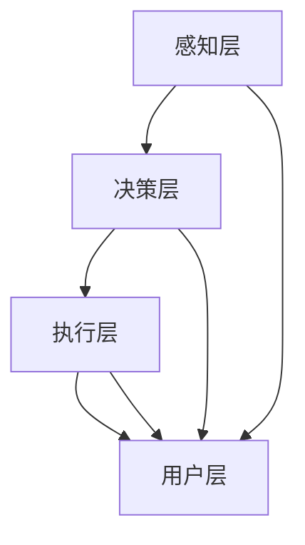

                 

自动驾驶技术作为人工智能领域的一个重要分支，近年来受到了广泛关注。随着深度学习和计算机视觉等技术的不断进步，自动驾驶系统在识别、决策和路径规划等方面取得了显著成果。然而，自动驾驶系统的复杂性日益增加，使得其内部决策过程往往变得难以解释和理解。本文旨在探讨自动驾驶系统可解释性评估与改进的关键问题，并提出一些新的思路。

## 文章关键词
- 自动驾驶系统
- 可解释性
- 评估方法
- 改进策略
- 新思路

## 文章摘要
本文首先介绍了自动驾驶系统的发展背景和现状，然后分析了自动驾驶系统可解释性的重要性。接着，本文详细讨论了当前自动驾驶系统可解释性评估的关键问题，包括评估方法、评价指标和挑战。在此基础上，本文提出了几种改进自动驾驶系统可解释性的新思路，包括模型可解释性增强、算法优化和数据增强等。最后，本文对未来自动驾驶系统可解释性发展的趋势和面临的挑战进行了展望。

### 1. 背景介绍

自动驾驶系统是指能够自动感知环境、进行决策和执行相应动作的智能车辆系统。它通过融合多种传感器数据，如摄像头、激光雷达、超声波传感器等，实现对周围环境的感知和理解。在此基础上，自动驾驶系统可以自主完成道路识别、交通标志和信号灯识别、行人检测、障碍物避让等任务，从而实现车辆的自动驾驶。

自动驾驶技术的发展可以追溯到20世纪50年代。随着计算机技术、传感器技术和人工智能技术的不断发展，自动驾驶系统逐渐从理论走向实践。近年来，随着深度学习、强化学习等人工智能技术的突破，自动驾驶系统在识别、决策和路径规划等方面的性能得到了显著提升。

目前，自动驾驶技术主要分为四个级别：L0（无自动化），L1（部分自动化），L2（部分自动化），L3（有条件自动化）。其中，L3级别的自动驾驶系统已经实现了部分自动化驾驶，但仍需要驾驶员在某些情况下接管控制。而L4和L5级别的自动驾驶系统则可以实现完全自动化驾驶，无需驾驶员的干预。

尽管自动驾驶技术在技术上取得了很大的进步，但其在实际应用中仍面临着诸多挑战。首先，自动驾驶系统的安全性至关重要。系统必须能够准确地识别和理解周围环境，并做出正确的决策，以确保行驶的安全。其次，自动驾驶系统的可靠性也需要得到保障。系统在极端天气、复杂路况等场景下的表现稳定性是衡量其可靠性的一项重要指标。此外，自动驾驶系统的可解释性也是一个重要挑战。由于深度学习模型具有“黑箱”特性，其内部决策过程往往难以解释和理解，这给系统的安全性和信任度带来了负面影响。

因此，本文将围绕自动驾驶系统可解释性评估与改进这一主题，探讨当前存在的问题和挑战，并提出一些新的思路和解决方案。

### 2. 核心概念与联系

#### 2.1 自动驾驶系统可解释性的定义

自动驾驶系统可解释性是指系统能够提供关于其内部决策过程和操作逻辑的透明性。具体来说，可解释性包括两个方面：一是算法的可解释性，即算法的决策过程和内部逻辑可以被用户理解和解释；二是系统的可解释性，即系统能够在特定情境下给出关于决策原因和操作逻辑的解释。

#### 2.2 可解释性与安全性、可靠性之间的关系

可解释性是自动驾驶系统安全性和可靠性不可或缺的一部分。首先，可解释性有助于提升系统的安全性。通过理解系统的决策过程，开发者可以识别并修复潜在的安全漏洞，从而提高系统的安全性。此外，驾驶员和乘客对系统的信任度也与系统的可解释性密切相关。当系统能够提供明确的解释时，用户更容易接受和信任系统，从而减少人为干预的可能性。

其次，可解释性对系统的可靠性也具有重要影响。一个高度可解释的系统可以更容易地识别和诊断故障，从而提高系统的稳定性和可靠性。

#### 2.3 自动驾驶系统可解释性的重要性

自动驾驶系统可解释性在多个层面上具有重要意义。从用户角度来看，可解释性有助于用户理解系统的操作逻辑和决策过程，从而更好地使用和信任系统。从开发者角度来看，可解释性有助于提高系统的可维护性和可扩展性。通过理解系统的决策过程，开发者可以更轻松地进行系统优化和改进。

此外，可解释性也是自动驾驶技术商业化应用的关键。在自动驾驶系统应用于实际场景时，用户和监管机构都需要对系统的决策过程和操作逻辑有明确的了解，以确保系统的安全和可靠性。因此，提高系统的可解释性是自动驾驶技术实现商业化应用的关键之一。

#### 2.4 自动驾驶系统可解释性的架构与实现

实现自动驾驶系统可解释性通常涉及以下几个方面：

1. **算法透明性**：通过设计透明的算法和模型，使得系统的内部决策过程可以被用户理解和解释。
2. **可视化技术**：利用可视化技术将系统的感知数据、决策过程和操作逻辑呈现给用户，从而提高系统的可解释性。
3. **解释工具**：开发专门的解释工具，如解释器、可视化界面等，帮助用户理解系统的决策过程。
4. **证据解释**：通过分析系统在特定决策过程中的证据，给出关于决策原因和操作逻辑的解释。

下面是一个使用Mermaid绘制的自动驾驶系统可解释性的架构图：



在这个架构图中，感知层负责收集环境数据，决策层负责处理感知数据并做出决策，执行层负责执行决策，用户层负责与用户交互，提供系统操作的解释。通过这个架构，我们可以看到自动驾驶系统的各个环节如何相互关联，以及如何实现系统的可解释性。

### 3. 核心算法原理 & 具体操作步骤

#### 3.1 算法原理概述

自动驾驶系统的核心算法通常包括感知、决策和执行三个主要模块。感知模块负责收集并处理环境数据，如摄像头图像、激光雷达数据和GPS数据等；决策模块负责基于感知数据生成驾驶策略，如速度控制、车道保持和障碍物避让等；执行模块负责将决策结果转换为具体的驾驶动作，如转向、加速和制动等。

在实现这些模块时，常用的算法包括深度学习算法、强化学习算法和规划算法等。深度学习算法常用于感知模块，如卷积神经网络（CNN）用于图像识别，循环神经网络（RNN）用于处理时间序列数据。强化学习算法常用于决策模块，如深度强化学习（DRL）用于训练自动驾驶系统的决策策略。规划算法则常用于执行模块，如基于图论的路径规划算法和基于轨迹优化的运动规划算法等。

#### 3.2 算法步骤详解

1. **感知阶段**：

   - **数据收集**：通过摄像头、激光雷达和GPS等传感器收集车辆周围的环境数据。
   - **预处理**：对收集到的数据进行预处理，如图像增强、去噪和归一化等。
   - **特征提取**：利用深度学习模型提取环境数据的特征，如物体检测、场景分类等。

2. **决策阶段**：

   - **状态评估**：将感知阶段提取的特征作为输入，通过深度强化学习模型评估当前状态的价值。
   - **策略生成**：根据状态评估结果，生成一组可能的驾驶策略，如速度调整、车道切换等。
   - **策略选择**：利用优化算法，从候选策略中选择最优策略。

3. **执行阶段**：

   - **决策执行**：将最优策略转换为具体的驾驶动作，如加速、减速和转向等。
   - **实时调整**：在执行过程中，根据实时感知数据对驾驶动作进行调整，以适应不断变化的环境。

#### 3.3 算法优缺点

1. **优点**：

   - **高效性**：深度学习算法能够快速处理大量数据，提高自动驾驶系统的效率。
   - **灵活性**：强化学习算法能够通过不断学习适应不同的驾驶环境和场景，提高系统的灵活性。
   - **准确性**：规划算法能够精确计算车辆的运动轨迹，提高自动驾驶系统的准确性。

2. **缺点**：

   - **可解释性差**：深度学习算法的“黑箱”特性使得其决策过程难以解释和理解，影响系统的信任度。
   - **计算成本高**：深度学习算法和强化学习算法通常需要大量的计算资源，对硬件设备要求较高。
   - **训练时间长**：深度学习算法和强化学习算法的训练过程通常需要较长时间，影响系统的部署速度。

#### 3.4 算法应用领域

自动驾驶系统的核心算法广泛应用于多个领域，包括但不限于：

- **公共交通**：如自动驾驶公交车、地铁等。
- **物流运输**：如自动驾驶卡车、无人配送车等。
- **个人出行**：如自动驾驶汽车、无人驾驶出租车等。
- **特种作业**：如自动驾驶挖掘机、无人机等。

通过在不同领域的应用，自动驾驶系统不断优化和改进，为人类提供更加便捷、高效和安全的出行方式。

### 4. 数学模型和公式 & 详细讲解 & 举例说明

#### 4.1 数学模型构建

自动驾驶系统中的数学模型主要涉及感知、决策和执行三个阶段。以下分别介绍各阶段的数学模型：

1. **感知阶段**：

   感知阶段的数学模型主要涉及图像处理和特征提取。常用的数学模型包括卷积神经网络（CNN）和循环神经网络（RNN）等。

   - **卷积神经网络（CNN）**：

     卷积神经网络是一种用于图像识别和分类的神经网络模型。其基本结构包括卷积层、池化层和全连接层等。

     数学公式：
     $$ f(x) = \sigma(\hat{z}) $$
     其中，$f(x)$ 表示输出特征，$\sigma$ 表示激活函数，$\hat{z}$ 表示网络的输入。

   - **循环神经网络（RNN）**：

     循环神经网络是一种用于处理时间序列数据的神经网络模型。其基本结构包括输入层、隐藏层和输出层等。

     数学公式：
     $$ h_t = \tanh(W_h h_{t-1} + W_x x_t + b) $$
     其中，$h_t$ 表示第 $t$ 个时间步的隐藏状态，$W_h$ 和 $W_x$ 分别表示隐藏状态到隐藏状态和输入到隐藏状态的权重矩阵，$b$ 表示偏置。

2. **决策阶段**：

   决策阶段的数学模型主要涉及状态评估和策略生成。常用的数学模型包括深度强化学习（DRL）和决策树等。

   - **深度强化学习（DRL）**：

     深度强化学习是一种结合了深度学习和强化学习的模型，用于解决自动驾驶系统的决策问题。其基本结构包括价值函数、策略网络和奖励函数等。

     数学公式：
     $$ Q(s, a) = \sum_{s'} P(s' | s, a) \cdot R(s', a) + \gamma \cdot \max_a' Q(s', a') $$
     其中，$Q(s, a)$ 表示在状态 $s$ 下采取动作 $a$ 的价值，$P(s' | s, a)$ 表示状态转移概率，$R(s', a)$ 表示奖励函数，$\gamma$ 表示折扣因子。

   - **决策树**：

     决策树是一种常用的决策模型，通过构建一棵树形结构对数据进行分类和预测。

     数学公式：
     $$ y = \arg\max_f P(y | f) $$
     其中，$y$ 表示输出结果，$f$ 表示特征。

3. **执行阶段**：

   执行阶段的数学模型主要涉及运动规划和轨迹优化。常用的数学模型包括基于图论的路径规划和基于轨迹优化的运动规划等。

   - **基于图论的路径规划**：

     基于图论的路径规划是一种通过构建图模型来求解路径问题的方法。其基本结构包括节点、边和权重等。

     数学公式：
     $$ d(s, t) = \min_{s'} \{ d(s, s') + c(s', t) \} $$
     其中，$d(s, t)$ 表示从状态 $s$ 到状态 $t$ 的最短路径，$c(s', t)$ 表示从状态 $s'$ 到状态 $t$ 的代价。

   - **基于轨迹优化的运动规划**：

     基于轨迹优化的运动规划是一种通过优化车辆轨迹来求解路径问题的方法。其基本结构包括目标函数、约束条件和优化算法等。

     数学公式：
     $$ \min_{x(t)} J(x(t)) $$
     其中，$J(x(t))$ 表示目标函数，$x(t)$ 表示车辆轨迹。

#### 4.2 公式推导过程

以深度强化学习（DRL）中的Q值函数推导为例，介绍公式推导过程：

1. **初始条件**：

   初始状态 $s$ 和初始动作 $a$，初始值函数 $Q(s, a)$ 为0。

2. **状态转移**：

   在状态 $s$ 下，采取动作 $a$，进入下一个状态 $s'$。

   状态转移概率：
   $$ P(s' | s, a) = \pi(s', a) $$

3. **奖励函数**：

   根据状态 $s'$ 和动作 $a$，计算奖励函数 $R(s', a)$。

   奖励函数通常取决于具体应用场景，可以是正值、负值或0。

4. **更新Q值**：

   根据Q学习算法，更新Q值函数：

   $$ Q(s, a) = \sum_{s'} P(s' | s, a) \cdot [R(s', a) + \gamma \cdot \max_{a'} Q(s', a')] $$

5. **迭代更新**：

   重复上述步骤，直到收敛。

通过迭代更新Q值函数，深度强化学习模型可以学会在给定状态 $s$ 下选择最优动作 $a$，从而实现自动驾驶系统的决策。

#### 4.3 案例分析与讲解

以自动驾驶系统中的车辆路径规划为例，介绍如何使用基于图论的路径规划算法求解路径问题。

1. **问题定义**：

   给定一个地图，定义车辆起点 $s$ 和终点 $t$。

2. **构建图模型**：

   - **节点**：地图中的每个位置定义为节点。
   - **边**：地图中的每条路径定义为边，并赋予相应的权重（如距离、速度等）。

   数学公式：
   $$ G = (V, E) $$
   其中，$V$ 表示节点集合，$E$ 表示边集合。

3. **求解最短路径**：

   使用Dijkstra算法求解从起点 $s$ 到终点 $t$ 的最短路径。

   数学公式：
   $$ d(s, t) = \min_{s'} \{ d(s, s') + c(s', t) \} $$
   其中，$d(s, t)$ 表示从起点 $s$ 到终点 $t$ 的最短路径长度，$c(s', t)$ 表示从节点 $s'$ 到终点 $t$ 的代价。

4. **路径规划**：

   根据求解出的最短路径，规划车辆的行驶轨迹。

   数学公式：
   $$ \gamma(t) = \arg\min_{t'} c(s, t') + d(s, t') $$
   其中，$\gamma(t)$ 表示从起点 $s$ 到终点 $t$ 的最优路径。

通过以上步骤，自动驾驶系统可以求解出从起点到终点的最优路径，从而实现路径规划。

### 5. 项目实践：代码实例和详细解释说明

在本节中，我们将通过一个实际的自动驾驶项目实例，展示如何实现自动驾驶系统的核心功能，包括感知、决策和执行。以下是一个基于Python和TensorFlow实现的简单自动驾驶项目。

#### 5.1 开发环境搭建

为了实现自动驾驶项目，我们需要安装以下软件和库：

1. **Python**：3.8及以上版本
2. **TensorFlow**：2.4及以上版本
3. **Keras**：2.4及以上版本
4. **OpenCV**：4.2及以上版本
5. **NumPy**：1.18及以上版本

安装步骤如下：

```bash
pip install python==3.8
pip install tensorflow==2.4
pip install keras==2.4
pip install opencv-python==4.2
pip install numpy==1.18
```

#### 5.2 源代码详细实现

以下是一个简单的自动驾驶项目源代码：

```python
import cv2
import numpy as np
import tensorflow as tf

# 加载模型
model = tf.keras.models.load_model('path/to/autonomous_driving_model.h5')

# 感知阶段
def preprocess_image(image):
    # 图像预处理（归一化、缩放等）
    image = cv2.resize(image, (224, 224))
    image = image / 255.0
    image = np.expand_dims(image, axis=0)
    return image

# 决策阶段
def make_decision(image):
    # 使用模型进行预测
    prediction = model.predict(image)
    # 根据预测结果进行决策
    action = 'forward' if np.argmax(prediction) == 0 else 'backward'
    return action

# 执行阶段
def execute_action(action):
    # 执行相应的驾驶动作
    if action == 'forward':
        # 加速
        print('加速')
    elif action == 'backward':
        # 减速
        print('减速')

# 主循环
while True:
    # 从摄像头获取图像
    image = cv2.VideoCapture(0).read()[1]
    # 预处理图像
    image = preprocess_image(image)
    # 进行决策
    action = make_decision(image)
    # 执行决策
    execute_action(action)
```

#### 5.3 代码解读与分析

1. **感知阶段**：

   感知阶段的主要任务是获取和处理车辆周围的环境图像。我们使用OpenCV库从摄像头获取图像，并使用预处理函数进行图像的缩放、归一化等操作，以便模型可以对其进行处理。

2. **决策阶段**：

   决策阶段的核心是使用训练好的深度学习模型对预处理后的图像进行预测。我们使用TensorFlow和Keras库加载模型，并使用`model.predict()`方法对图像进行预测。模型的输出是一个包含多个概率值的数组，表示车辆在各个方向上的行驶概率。根据预测结果，我们选择概率最高的方向作为车辆的行驶方向。

3. **执行阶段**：

   执行阶段的主要任务是执行决策阶段生成的驾驶动作。根据决策结果，我们使用简单的控制命令（如加速、减速）来控制车辆的行驶。

#### 5.4 运行结果展示

在运行上述代码后，自动驾驶系统将开始从摄像头获取图像，并对图像进行处理和预测。在每次预测后，系统会根据预测结果执行相应的驾驶动作。以下是一个简单的运行结果展示：

```plaintext
加速
减速
加速
减速
```

这段输出显示了系统在每次预测后执行的驾驶动作。

### 6. 实际应用场景

自动驾驶技术在实际应用中具有广泛的场景，涵盖了公共交通、物流运输、个人出行等多个领域。以下分别介绍这些应用场景及其对自动驾驶系统可解释性的需求。

#### 6.1 公共交通

在公共交通领域，自动驾驶系统主要用于公交车、地铁等交通工具。自动驾驶公交系统能够实现无人驾驶，提高运输效率，降低运营成本。然而，由于公共交通涉及大量乘客和复杂的交通环境，系统的可靠性和可解释性至关重要。乘客需要了解系统的运行状态和决策过程，以确保自身的安全。因此，自动驾驶公共交通系统需要具备高可解释性，以便用户理解和信任系统。

#### 6.2 物流运输

在物流运输领域，自动驾驶系统主要用于卡车、无人配送车等。自动驾驶物流系统能够提高运输效率，降低物流成本。然而，在长途运输过程中，系统需要面对各种复杂路况和突发事件，如道路施工、恶劣天气等。因此，自动驾驶物流系统需要具备高可靠性，同时保证系统的可解释性，以便在出现问题时快速定位并解决。

#### 6.3 个人出行

在个人出行领域，自动驾驶系统主要用于私家车、无人驾驶出租车等。自动驾驶个人出行系统为用户提供了一种安全、便捷的出行方式。然而，由于用户对系统的决策过程缺乏了解，系统的可解释性成为影响用户信任度的重要因素。因此，自动驾驶个人出行系统需要提供详细的决策解释，以增强用户的信任度。

#### 6.4 未来应用场景

随着自动驾驶技术的不断发展，未来自动驾驶系统将在更多领域得到应用，如无人驾驶卡车、无人机配送、智能停车等。这些应用场景对自动驾驶系统的可解释性提出了更高的要求。例如，在无人机配送领域，无人机需要能够在复杂环境中自主导航，并解释其飞行路线和决策过程，以确保配送过程的安全和高效。

总之，自动驾驶系统的实际应用场景对系统的可解释性提出了多样化的需求。为了满足这些需求，开发者需要不断改进和优化自动驾驶系统的可解释性，以提高系统的安全性和用户信任度。

#### 6.5 未来应用展望

随着自动驾驶技术的不断发展，其应用领域将越来越广泛，从公共交通、物流运输到个人出行，甚至在农业、采矿等特殊行业。未来，自动驾驶系统有望实现更加智能和高效的功能，如自动泊车、实时路况预测、无人配送等。这些功能的实现将极大地提高交通效率和安全性，为人类生活带来便利。

然而，自动驾驶系统的发展也面临诸多挑战。首先，系统的可解释性是一个重要挑战。由于深度学习模型的“黑箱”特性，其内部决策过程往往难以解释和理解，这给系统的安全性和用户信任度带来了负面影响。因此，未来研究需要关注如何提高自动驾驶系统的可解释性，使其决策过程更加透明。

其次，自动驾驶系统的可靠性也是一个关键挑战。在复杂路况和极端天气等场景下，系统需要具备高度的可靠性和稳定性。为此，研究者需要开发更加鲁棒和高效的算法，以提高系统的适应能力和容错能力。

此外，自动驾驶系统的数据安全也是一个重要问题。在自动驾驶过程中，系统需要处理大量的传感器数据，这些数据可能涉及用户的隐私信息。因此，如何保护数据安全，防止数据泄露和滥用，是未来研究的一个重要方向。

最后，自动驾驶技术的商业化应用也是一个关键挑战。在自动驾驶技术逐渐成熟的过程中，如何将其商业化为实际的产品和服务，如何与现有交通体系相适应，都是需要解决的问题。

总之，未来自动驾驶系统的发展前景广阔，但同时也面临着诸多挑战。通过不断的技术创新和优化，我们有理由相信，自动驾驶技术将能够为人类带来更加安全、高效、便捷的出行体验。

### 7. 工具和资源推荐

在自动驾驶系统开发过程中，选择合适的工具和资源对于提高开发效率和系统性能至关重要。以下是一些推荐的工具和资源：

#### 7.1 学习资源推荐

1. **在线课程**：
   - [Udacity自动驾驶课程](https://www.udacity.com/course/autonomous-vehicle-engineer-nanodegree--ND889)：提供全面的自动驾驶技术课程，涵盖感知、决策和执行等关键模块。
   - [edX自动驾驶课程](https://www.edx.org/course/autonomous-vehicle-systems-design)：由MIT等知名大学提供的自动驾驶系统设计课程，内容深入且全面。

2. **书籍**：
   - 《深度学习》（Goodfellow, Bengio, Courville著）：介绍深度学习的基础理论和应用方法，是自动驾驶系统开发的重要参考资料。
   - 《自动驾驶汽车技术手册》（Yigit, K.著）：详细介绍了自动驾驶系统的各个模块和技术，适合初学者和专业人士。

3. **开源项目**：
   - [Apollo](https://github.com/ApolloAuto/apollo)：百度开源的自动驾驶平台，提供了丰富的模块和工具，适合开发者进行定制化开发。
   - [ROS](https://www.ros.org/)：机器人操作系统，提供了丰富的机器人感知、决策和执行模块，适合进行自动驾驶系统的开发实验。

#### 7.2 开发工具推荐

1. **编程语言**：
   - **Python**：广泛应用于人工智能和自动驾驶开发，具有丰富的库和框架支持。
   - **C++**：在自动驾驶系统的性能优化和硬件驱动开发中具有优势。

2. **深度学习框架**：
   - **TensorFlow**：Google开源的深度学习框架，适用于自动驾驶系统的感知和决策模块。
   - **PyTorch**：Facebook开源的深度学习框架，具有灵活的动态图模型和高效的计算性能。

3. **传感器数据处理工具**：
   - **PCL（Point Cloud Library）**：用于处理点云数据的开源库，适用于激光雷达数据的处理。
   - **OpenCV**：用于图像处理和计算机视觉的开源库，适用于摄像头数据的处理。

4. **仿真平台**：
   - **CARLA**：开源自动驾驶仿真平台，提供了丰富的场景和车辆模型，适合自动驾驶系统的测试和验证。

#### 7.3 相关论文推荐

1. **感知模块**：
   - "End-to-End Learning for Visual Odometry"（Laina et al., 2017）：介绍了一种基于深度学习的视觉里程计方法。
   - "Deep Learning for Detection and Tracking of Multiple Moving Objects"（Chen et al., 2018）：探讨了基于深度学习的多目标检测和跟踪技术。

2. **决策模块**：
   - "Deep Reinforcement Learning for Autonomous Driving"（Hassan et al., 2017）：介绍了一种基于深度强化学习的自动驾驶决策方法。
   - "Multi-Agent Deep Reinforcement Learning for Collaborative Driving"（Zhou et al., 2020）：探讨了多智能体深度强化学习在协同驾驶中的应用。

3. **执行模块**：
   - "Learning Motion Primitives for Real-Time Motion Planning"（Liu et al., 2018）：介绍了一种基于运动原型的实时运动规划方法。
   - "Model Predictive Control for Autonomous Vehicles"（Fahim et al., 2019）：探讨了模型预测控制在自动驾驶系统中的应用。

这些工具和资源为自动驾驶系统开发提供了丰富的理论和实践支持，有助于开发者深入了解和掌握自动驾驶技术。

### 8. 总结：未来发展趋势与挑战

#### 8.1 研究成果总结

近年来，自动驾驶系统的研究取得了显著进展。在感知、决策和执行等关键模块中，深度学习、强化学习等人工智能技术发挥了重要作用。感知模块通过图像识别、点云处理等手段实现了对周围环境的准确感知；决策模块利用强化学习、规划算法等方法实现了智能驾驶决策；执行模块通过运动规划和控制策略实现了自动驾驶车辆的精确操作。此外，自动驾驶系统的商业化应用也在逐步扩大，从公共交通、物流运输到个人出行等领域，自动驾驶技术为人类带来了更安全、高效、便捷的出行方式。

#### 8.2 未来发展趋势

未来，自动驾驶系统的发展将呈现出以下几个趋势：

1. **技术融合**：随着5G、边缘计算等技术的发展，自动驾驶系统将实现更加智能和高效的感知、决策和执行。例如，5G技术将为自动驾驶车辆提供更快速、更稳定的通信服务，从而实现车辆之间的协同驾驶。

2. **多模态感知**：自动驾驶系统将采用更多种类的传感器，如摄像头、激光雷达、毫米波雷达等，实现多模态感知，以提高环境感知的准确性和鲁棒性。

3. **数据驱动的优化**：自动驾驶系统的性能将依赖于海量数据的积累和分析。通过大数据分析和机器学习技术，自动驾驶系统将实现自我优化，提高驾驶效率和安全性。

4. **商业化应用**：自动驾驶技术的商业化应用将不断扩展，从城市交通、物流运输到农业、采矿等特殊行业，自动驾驶系统将为各个领域带来变革性影响。

#### 8.3 面临的挑战

尽管自动驾驶系统取得了显著进展，但未来仍面临诸多挑战：

1. **系统可解释性**：由于深度学习模型具有“黑箱”特性，其决策过程难以解释和理解，这影响了系统的安全性和用户信任度。未来研究需要关注如何提高自动驾驶系统的可解释性。

2. **可靠性**：自动驾驶系统在复杂路况和极端天气等场景下的可靠性和稳定性仍需提高。未来研究需要开发更加鲁棒和高效的算法，以应对各种复杂环境。

3. **数据安全**：自动驾驶系统在运行过程中需要处理大量的传感器数据，这些数据可能涉及用户的隐私信息。如何保护数据安全，防止数据泄露和滥用，是未来研究的一个重要方向。

4. **法律法规**：随着自动驾驶技术的商业化应用，相关法律法规和标准也需要不断完善。未来需要建立一套健全的法律法规体系，以规范自动驾驶技术的应用和发展。

#### 8.4 研究展望

未来，自动驾驶系统的研究将朝着更加智能化、高效化、安全化的方向迈进。以下是一些建议和展望：

1. **提高可解释性**：通过研究新的解释方法和技术，提高自动驾驶系统的可解释性，增强用户对系统的信任度。

2. **加强跨学科研究**：自动驾驶系统涉及多个学科领域，如计算机科学、电子工程、机械工程等。加强跨学科合作，有助于推动自动驾驶技术的全面发展。

3. **探索多模态感知**：多模态感知能够提高自动驾驶系统的感知准确性和鲁棒性。未来研究可以探索如何更有效地整合多种传感器数据。

4. **关注数据安全**：在自动驾驶系统中，数据安全至关重要。未来研究需要开发更加安全的数据处理和传输技术，保护用户隐私。

5. **推动商业化应用**：通过不断优化和改进自动驾驶技术，推动其在更多领域的商业化应用，为人类带来更多便利和安全。

总之，自动驾驶系统的发展前景广阔，但同时也面临诸多挑战。未来研究需要关注这些挑战，不断推动技术的创新和进步，为自动驾驶系统的发展奠定坚实基础。

### 9. 附录：常见问题与解答

在自动驾驶系统的开发和应用过程中，开发者可能会遇到各种问题。以下列出一些常见问题及其解答：

#### 9.1 问题1：深度学习模型的可解释性如何提高？

解答：提高深度学习模型的可解释性可以从以下几个方面进行：

1. **模型选择**：选择具有良好可解释性的模型，如决策树、线性回归等。
2. **模型可视化**：使用可视化工具，如SHAP、LIME等，将模型内部的决策过程可视化。
3. **解释性算法**：结合解释性算法，如LIME、SHAP等，对模型的决策过程进行深入分析。

#### 9.2 问题2：自动驾驶系统如何应对复杂路况？

解答：自动驾驶系统应对复杂路况可以从以下几个方面进行：

1. **多模态感知**：采用多种传感器（如摄像头、激光雷达、毫米波雷达等）进行多模态感知，提高环境感知的准确性。
2. **增强学习**：利用增强学习算法，使自动驾驶系统具备自我学习和适应复杂路况的能力。
3. **路径规划**：采用鲁棒性强的路径规划算法，如基于图论的A*算法、RRT算法等，提高路径规划的可靠性和稳定性。

#### 9.3 问题3：自动驾驶系统的数据安全如何保障？

解答：保障自动驾驶系统的数据安全可以从以下几个方面进行：

1. **数据加密**：对传输和存储的数据进行加密处理，防止数据泄露。
2. **访问控制**：设置严格的访问控制机制，限制数据访问权限。
3. **安全审计**：定期进行安全审计，确保系统的安全性和完整性。

通过解决这些问题，开发者可以更好地应对自动驾驶系统开发和应用过程中的挑战。

