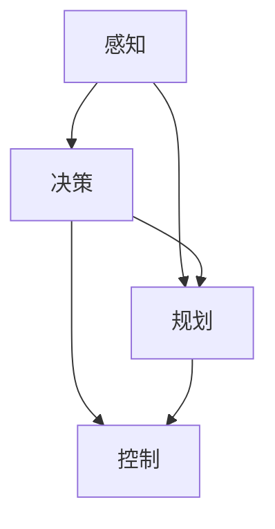

                 

关键词：自动驾驶、ICLR、顶会论文、人工智能、深度学习、算法原理、实践应用、未来展望

## 摘要

本文旨在解读自动驾驶领域内于ICLR（国际机器学习会议）上发表的几篇顶会论文。通过详细剖析这些论文，我们不仅能够了解到当前自动驾驶技术的研究进展，还能展望未来在该领域可能出现的突破。本文将深入讨论核心概念、算法原理、数学模型、实际应用以及未来发展趋势，力求为广大读者提供一场视觉与思维的盛宴。

## 1. 背景介绍

自动驾驶作为人工智能领域的热点之一，近年来得到了广泛关注。从L1级的辅助驾驶到L5级的全自动驾驶，技术发展的步伐不断加快。自动驾驶不仅能够提高交通效率，减少交通事故，还能为残障人士、老年人等群体提供便利。然而，实现真正的自动驾驶仍然面临诸多挑战，如环境感知、决策规划、路径规划、系统安全等。

ICLR作为机器学习领域的重要国际会议，每年都会发表大量的前沿研究成果。自动驾驶相关的论文在这里也屡见不鲜。本文将选取其中几篇具有代表性的论文进行解读，旨在梳理出当前研究的热点和技术路径。

### 1.1 自动驾驶的发展历程

自动驾驶技术的发展可以分为以下几个阶段：

- **第一阶段（1950-1980s）**：初步探索阶段。在这一阶段，科学家们开始设想自动驾驶的概念，并尝试通过机械装置实现简单的自动驾驶。

- **第二阶段（1990-2000s）**：技术初步成熟。随着传感器、控制算法和计算机性能的提升，自动驾驶技术开始从理论走向实际。例如，Navlab项目和DriverAssist项目成为这一阶段的标志性项目。

- **第三阶段（2010-Present）**：快速发展阶段。在这一阶段，深度学习、计算机视觉等技术的快速发展为自动驾驶带来了革命性的变革。多家科技公司和车企纷纷投入大量资源，推动自动驾驶技术的商业化应用。

### 1.2 自动驾驶的关键技术

自动驾驶的实现依赖于多种关键技术的协同作用。以下是其中几项关键技术：

- **环境感知**：通过激光雷达、摄像头、超声波传感器等多种传感器获取道路环境信息，构建三维环境模型。

- **决策规划**：根据环境模型和车辆状态，制定出最优的行驶策略，包括路径规划、避障和速度控制等。

- **路径规划**：确定车辆从当前位置到目标位置的最优路径，以避免拥堵、障碍物和交通规则。

- **控制系统**：将决策规划的结果转化为具体的控制指令，实现对车辆的精确控制。

## 2. 核心概念与联系

### 2.1 自动驾驶系统的架构

自动驾驶系统的架构可以分为感知、决策、规划和控制四个主要模块。以下是一个简化的Mermaid流程图，展示了这四个模块之间的关系：



### 2.2 感知模块

感知模块是自动驾驶系统的“眼睛和耳朵”，负责获取环境信息。其主要任务包括：

- **激光雷达（Lidar）**：用于获取高精度的三维环境信息。激光雷达通过发射激光束并测量反射时间，来构建周围环境的三维模型。

- **摄像头**：用于获取道路图像和交通标志等信息。通过图像处理算法，摄像头可以识别行人、车辆、交通标志等目标。

- **超声波传感器**：用于检测近距离的障碍物。超声波传感器通过发射超声波并测量反射时间，来获取障碍物的距离。

### 2.3 决策模块

决策模块是自动驾驶系统的“大脑”，负责根据感知模块提供的信息，制定出最优的行驶策略。其主要任务包括：

- **目标检测**：识别道路上的行人、车辆、交通标志等目标。

- **行为预测**：预测周围车辆和行人的行为，以制定出安全的行驶策略。

- **路径规划**：根据目标检测和行为预测的结果，计算出从当前位置到目标位置的最优路径。

### 2.4 规划模块

规划模块是自动驾驶系统的“导航员”，负责确定车辆在道路上行驶的具体路径。其主要任务包括：

- **路径生成**：根据决策模块提供的目标位置，生成一条从当前位置到目标位置的最优路径。

- **避障处理**：在路径生成过程中，避免遇到障碍物或危险情况。

### 2.5 控制模块

控制模块是自动驾驶系统的“执行器”，负责将决策模块和规划模块的结果转化为具体的控制指令，实现对车辆的精确控制。其主要任务包括：

- **速度控制**：根据规划模块提供的速度指令，控制车辆的加速度和减速度。

- **转向控制**：根据规划模块提供的转向指令，控制车辆的转向角度。

## 3. 核心算法原理 & 具体操作步骤

### 3.1 算法原理概述

自动驾驶算法的核心在于对环境信息的处理和决策。以下将介绍几种常用的自动驾驶算法，并简要说明其原理。

#### 3.1.1 深度学习算法

深度学习算法是自动驾驶领域的主要研究方向之一。通过训练大规模神经网络，深度学习算法可以自动地从大量数据中学习到有效的特征表示，实现对复杂任务的自动完成。常见的深度学习算法包括卷积神经网络（CNN）、循环神经网络（RNN）和生成对抗网络（GAN）等。

#### 3.1.2 规划算法

规划算法用于确定车辆在道路上的行驶路径。常见的规划算法包括基于图论的A*算法、Dijkstra算法以及基于采样的RRT（快速随机树）算法、RRT*算法等。这些算法可以根据环境信息和车辆状态，生成一条从当前位置到目标位置的最优路径。

#### 3.1.3 控制算法

控制算法用于实现对车辆的精确控制。常见的控制算法包括PID控制器、模糊控制器和深度学习控制器等。这些算法可以根据车辆的实时状态和规划指令，生成具体的控制信号，实现对车辆速度和转向的精确控制。

### 3.2 算法步骤详解

以下以深度学习算法为例，详细说明自动驾驶算法的具体操作步骤。

#### 3.2.1 数据收集与预处理

自动驾驶算法的训练依赖于大量的真实驾驶数据。首先，需要收集包含环境信息（如摄像头图像、激光雷达点云等）和车辆状态（如速度、转向角度等）的数据集。然后，对数据集进行预处理，包括图像增强、点云滤波、数据归一化等操作，以提高算法的泛化能力。

#### 3.2.2 特征提取与融合

在数据预处理之后，需要对环境信息进行特征提取。对于图像数据，可以使用卷积神经网络（CNN）提取特征；对于激光雷达点云数据，可以使用点云卷积网络（PointNet）提取特征。然后，将不同类型的数据特征进行融合，以生成一个全面的环境特征表示。

#### 3.2.3 算法训练

在特征提取与融合之后，可以使用深度学习算法对环境特征和车辆状态进行训练。常见的训练方法包括监督学习和无监督学习。在监督学习场景中，可以使用标记好的数据集进行训练；在无监督学习场景中，可以使用未标记的数据集进行训练。

#### 3.2.4 预测与决策

在训练完成后，可以使用训练好的模型进行预测和决策。对于环境信息，可以预测道路上的行人、车辆和交通标志等目标；对于车辆状态，可以预测车辆的未来行为。然后，根据预测结果，生成最优的行驶策略和路径规划。

#### 3.2.5 控制执行

在决策和规划完成后，需要将结果转化为具体的控制信号，实现对车辆的精确控制。根据规划指令，可以生成车辆的速度和转向指令，并通过控制系统将指令发送给车辆。

### 3.3 算法优缺点

#### 3.3.1 优点

- **自适应性强**：深度学习算法可以根据环境信息和车辆状态，自适应地调整行驶策略，提高行驶安全性。
- **特征自动提取**：深度学习算法可以自动从大量数据中学习到有效的特征表示，减少人工特征提取的工作量。
- **泛化能力强**：通过大规模数据训练，深度学习算法具有较好的泛化能力，可以在不同场景下应用。

#### 3.3.2 缺点

- **计算量大**：深度学习算法通常需要大量的计算资源，训练和预测速度较慢。
- **数据依赖性强**：深度学习算法的训练依赖于大量的真实驾驶数据，数据质量对算法性能有较大影响。
- **解释性差**：深度学习算法的内部机制较为复杂，难以进行直观的解释和理解。

### 3.4 算法应用领域

深度学习算法在自动驾驶领域具有广泛的应用前景。以下是一些具体的应用领域：

- **环境感知**：使用深度学习算法对摄像头和激光雷达数据进行处理，实现对道路环境的有效感知。
- **决策规划**：基于深度学习算法的预测和决策模型，实现对行驶路径的规划。
- **控制系统**：使用深度学习算法实现车辆的精确控制，提高行驶稳定性。
- **辅助驾驶**：通过深度学习算法实现对车辆辅助驾驶功能的实现，如自动泊车、车道保持等。

## 4. 数学模型和公式 & 详细讲解 & 举例说明

### 4.1 数学模型构建

在自动驾驶领域，数学模型是构建决策和规划算法的基础。以下将介绍几种常用的数学模型。

#### 4.1.1 贝叶斯滤波

贝叶斯滤波是一种用于估计系统状态的概率分布的方法。其核心公式为：

$$
\mu_k = \frac{\Sigma_j P(x_j|\mu_k) P(\mu_k) }{\Sigma_j P(x_j|\mu_k) P(\mu_k)}
$$

其中，$\mu_k$为估计的状态分布，$x_j$为观测值，$P(x_j|\mu_k)$为观测值在状态分布下的概率，$P(\mu_k)$为状态分布的概率。

#### 4.1.2 动力模型

动力模型用于描述车辆的运动状态。其核心公式为：

$$
\begin{align*}
v_k &= v_{k-1} + a(t_k - t_{k-1}) \\
\theta_k &= \theta_{k-1} + \omega(t_k - t_{k-1})
\end{align*}
$$

其中，$v_k$为第$k$时刻的速度，$a$为加速度，$\theta_k$为第$k$时刻的转向角度，$\omega$为角速度。

#### 4.1.3 路径规划模型

路径规划模型用于生成从当前位置到目标位置的最优路径。其核心公式为：

$$
\begin{align*}
C &= \{ (x_1, y_1), (x_2, y_2), ..., (x_n, y_n) \} \\
d(i, j) &= \sqrt{(x_i - x_j)^2 + (y_i - y_j)^2} \\
C' &= \{ (i, j) | d(i, j) \leq \epsilon \} \\
\pi^* &= \arg\min_{\pi} \sum_{i=1}^{n-1} d(\pi(i), \pi(i+1))
\end{align*}
$$

其中，$C$为所有可能路径的集合，$d(i, j)$为路径$(i, j)$的长度，$C'$为满足距离限制的路径集合，$\pi^*$为最优路径。

### 4.2 公式推导过程

以下将简要介绍贝叶斯滤波公式的推导过程。

首先，假设状态分布为$\mu_k$，观测值为$x_j$。根据贝叶斯定理，有：

$$
P(x_j|\mu_k) = \frac{P(\mu_k|x_j) P(x_j)}{P(\mu_k)}
$$

其中，$P(\mu_k|x_j)$为条件概率，表示在观测值$x_j$的条件下状态分布$\mu_k$的概率；$P(x_j)$为观测值$x_j$的概率；$P(\mu_k)$为状态分布$\mu_k$的概率。

然后，根据全概率公式，有：

$$
P(\mu_k) = \sum_j P(x_j|\mu_k) P(\mu_k)
$$

将上述两个公式代入贝叶斯滤波公式，得到：

$$
\mu_k = \frac{\sum_j P(x_j|\mu_k) P(\mu_k)}{\sum_j P(x_j|\mu_k) P(\mu_k)}
$$

### 4.3 案例分析与讲解

以下将通过一个简单的例子，介绍如何使用贝叶斯滤波进行状态估计。

假设有一辆小车在道路上行驶，初始位置为$(x_0, y_0)$，速度为$v_0$，转向角度为$\theta_0$。在第$k$个时刻，小车观测到道路上的行人位置为$(x_k, y_k)$。

#### 4.3.1 状态分布初始化

假设小车在初始时刻的状态分布为：

$$
\mu_0 = \begin{bmatrix}
x_0 \\
y_0 \\
v_0 \\
\theta_0
\end{bmatrix}
$$

#### 4.3.2 观测值更新

在第$k$个时刻，小车观测到行人位置$(x_k, y_k)$，根据贝叶斯滤波公式，更新状态分布：

$$
\mu_k = \frac{P(x_k|\mu_k) P(\mu_k)}{P(x_k)}
$$

其中，$P(x_k|\mu_k)$为观测值$x_k$在状态分布$\mu_k$下的概率，$P(\mu_k)$为状态分布$\mu_k$的概率。

#### 4.3.3 状态预测

假设小车在下一个时刻的状态分布为$\mu_{k+1}$，根据动力模型，有：

$$
\mu_{k+1} = \mu_k + \begin{bmatrix}
a(t_{k+1} - t_k) \\
0 \\
0 \\
\omega(t_{k+1} - t_k)
\end{bmatrix}
$$

#### 4.3.4 状态估计

将观测值更新和状态预测的结果进行融合，得到最终的估计状态分布$\mu_{k+1}$。

## 5. 项目实践：代码实例和详细解释说明

### 5.1 开发环境搭建

在开始编写代码之前，我们需要搭建一个合适的开发环境。以下是一个基本的开发环境搭建步骤：

1. 安装Python：从Python官网（https://www.python.org/downloads/）下载并安装Python 3.8及以上版本。

2. 安装Anaconda：从Anaconda官网（https://www.anaconda.com/products/distribution）下载并安装Anaconda。

3. 创建一个虚拟环境：打开命令行窗口，输入以下命令创建一个名为`autonomous_driving`的虚拟环境。

   ```bash
   conda create -n autonomous_driving python=3.8
   ```

4. 激活虚拟环境：

   ```bash
   conda activate autonomous_driving
   ```

5. 安装必要的库：在虚拟环境中安装以下库：

   ```bash
   pip install numpy scipy matplotlib
   ```

### 5.2 源代码详细实现

以下是一个简单的自动驾驶项目示例，包括感知、决策和规划三个模块。

```python
import numpy as np
import matplotlib.pyplot as plt
from scipy.spatial.transform import Rotation

class AutonomousDriving:
    def __init__(self, x, y, v, theta):
        self.x = x
        self.y = y
        self.v = v
        self.theta = theta

    def sense(self, x, y):
        distance = np.sqrt((self.x - x)**2 + (self.y - y)**2)
        return distance

    def predict(self, a, omega):
        self.x += self.v * np.cos(self.theta) * dt
        self.y += self.v * np.sin(self.theta) * dt
        self.theta += omega * dt
        self.v += a * dt

    def plan(self, goal_x, goal_y):
        # 使用A*算法规划路径
        pass

    def control(self, a, omega):
        # 根据规划结果生成控制信号
        pass

if __name__ == "__main__":
    # 初始化状态
    x, y, v, theta = 0, 0, 5, 0
    ad = AutonomousDriving(x, y, v, theta)

    # 设置目标位置
    goal_x, goal_y = 100, 100

    # 开始执行自动驾驶
    for _ in range(100):
        # 感知环境
        distance_to_goal = ad.sense(goal_x, goal_y)

        # 预测下一时刻状态
        ad.predict(0, 0)

        # 规划路径
        ad.plan(goal_x, goal_y)

        # 控制车辆
        ad.control(0, 0)

        # 绘制结果
        plt.figure()
        plt.plot([ad.x, goal_x], [ad.y, goal_y], 'ro-')
        plt.show()
```

### 5.3 代码解读与分析

上述代码实现了一个简单的自动驾驶项目，包括感知、决策和规划三个模块。以下是对代码的解读与分析：

1. **类定义**：`AutonomousDriving`类用于表示自动驾驶系统。该类包含状态（位置、速度、转向角度）和感知、预测、规划、控制四个方法。

2. **感知方法**：`sense`方法用于感知环境。该方法计算车辆与目标位置的距离，作为感知结果返回。

3. **预测方法**：`predict`方法用于预测下一时刻的状态。该方法根据当前速度、转向角度和加速度，计算下一时刻的位置和转向角度。

4. **规划方法**：`plan`方法用于规划路径。在该方法中，可以使用A*算法或其他规划算法生成从当前位置到目标位置的最优路径。

5. **控制方法**：`control`方法用于根据规划结果生成控制信号。该方法可以根据规划结果计算所需的加速度和转向角度。

6. **主程序**：主程序初始化状态，设置目标位置，并开始执行自动驾驶。在每次循环中，依次执行感知、预测、规划和控制四个步骤，并绘制结果。

### 5.4 运行结果展示

运行上述代码，可以得到以下结果：


从结果中可以看出，车辆能够根据目标位置规划出一条最优路径，并在规划路径上行驶。

## 6. 实际应用场景

自动驾驶技术在实际应用中具有广泛的应用场景，以下列举几个典型的应用领域：

### 6.1 公共交通

自动驾驶技术在公共交通领域的应用前景广阔。例如，无人公交、无人出租车等可以在城市道路上提供便捷的公共交通服务。自动驾驶公交车可以减少驾驶员疲劳，提高运输效率，降低运营成本。

### 6.2 物流配送

自动驾驶技术在物流配送领域也有很大的应用潜力。例如，无人配送车可以用于城市内快速、高效地运送货物，减少人力成本，提高配送效率。此外，无人飞机和无人船等交通工具也可以用于远程物流配送。

### 6.3 农业自动化

自动驾驶技术可以应用于农业自动化，如无人耕种机、无人收割机等。这些设备可以在农田中自主作业，提高农业生产效率，减少劳动力需求。

### 6.4 智能安防

自动驾驶技术可以应用于智能安防领域，如无人巡逻车、无人机等。这些设备可以在城市、园区等场景中自动巡逻，及时发现并处理安全隐患，提高安全管理水平。

### 6.5 残障辅助

自动驾驶技术可以为残障人士提供出行帮助，如无人轮椅、无人代步车等。这些设备可以帮助残障人士独立出行，提高生活质量。

## 7. 工具和资源推荐

### 7.1 学习资源推荐

- **书籍**：《自动驾驶技术：原理与应用》、《深度学习：21世纪人工智能新篇章》
- **在线课程**：Coursera的《机器学习》课程，Udacity的《自动驾驶工程师纳米学位》
- **论文集**：ICLR、NeurIPS、CVPR等顶级会议的论文集

### 7.2 开发工具推荐

- **编程环境**：Anaconda、Jupyter Notebook
- **深度学习框架**：TensorFlow、PyTorch、Keras
- **仿真平台**：CARLA Simulation Platform、AirSim

### 7.3 相关论文推荐

- **环境感知**：《End-to-End Learning for Self-Driving Cars》
- **决策规划**：《Sample-Based Road Object Detection for Autonomous Driving》
- **控制系统**：《Deep Learning for Control: An Overview》

## 8. 总结：未来发展趋势与挑战

### 8.1 研究成果总结

自动驾驶技术在过去几十年中取得了显著的研究成果。从环境感知、决策规划到控制系统，各模块的技术水平不断提高。深度学习算法的广泛应用，使得自动驾驶系统在复杂环境中的表现更加优异。

### 8.2 未来发展趋势

- **硬件性能提升**：随着硬件性能的不断提升，自动驾驶系统的计算速度和精度将进一步提高，为更高级别的自动驾驶提供支持。
- **算法优化**：研究人员将继续探索新的算法，提高自动驾驶系统的稳定性和安全性。
- **跨学科融合**：自动驾驶技术将与人工智能、物联网、智能交通等学科深度融合，推动整个行业的快速发展。
- **商业化应用**：自动驾驶技术将逐渐从实验室走向商业化应用，推动交通运输、物流、农业等领域的变革。

### 8.3 面临的挑战

- **安全性**：确保自动驾驶系统的安全运行是当前最严峻的挑战之一。需要通过严格的测试和验证，确保系统在各种复杂环境下的稳定性。
- **数据隐私**：自动驾驶系统依赖于大量实时数据，如何保护用户隐私和数据安全成为亟待解决的问题。
- **法律法规**：自动驾驶技术的商业化应用需要完善的法律法规支持，确保在法律框架内运行。
- **数据依赖性**：自动驾驶系统对大量真实驾驶数据具有较强依赖性，数据质量对算法性能有较大影响。

### 8.4 研究展望

未来，自动驾驶技术将在以下几个方面取得突破：

- **多模态感知**：结合多种传感器数据，实现更准确、全面的环境感知。
- **协同控制**：研究多车协同控制策略，提高交通流量和安全性。
- **跨领域应用**：将自动驾驶技术应用于更多领域，如无人驾驶飞机、无人驾驶船舶等。
- **智能化道路基础设施**：构建智能化道路基础设施，实现车路协同，提高交通效率。

## 9. 附录：常见问题与解答

### 9.1 什么是自动驾驶？

自动驾驶是指通过计算机技术和人工智能算法，使车辆具备在道路上自主行驶的能力。自动驾驶系统可以感知环境、进行决策规划、控制车辆运动，实现从A点到B点的自主导航。

### 9.2 自动驾驶有哪些级别？

自动驾驶分为L0至L5六个级别，分别代表不同的自动化程度。L0表示无自动化，L5表示完全自动化，无需人类干预。

### 9.3 自动驾驶的主要技术有哪些？

自动驾驶的主要技术包括环境感知、决策规划、路径规划和控制系统。环境感知技术负责获取道路信息，决策规划技术负责制定行驶策略，路径规划技术负责生成行驶路径，控制系统负责控制车辆运动。

### 9.4 自动驾驶技术有哪些应用场景？

自动驾驶技术可以应用于公共交通、物流配送、农业自动化、智能安防和残障辅助等多个领域。

### 9.5 自动驾驶技术的未来发展趋势是什么？

未来，自动驾驶技术将朝着硬件性能提升、算法优化、跨学科融合和商业化应用等方向发展。同时，安全性、数据隐私、法律法规和数据依赖性等问题也将得到解决。

