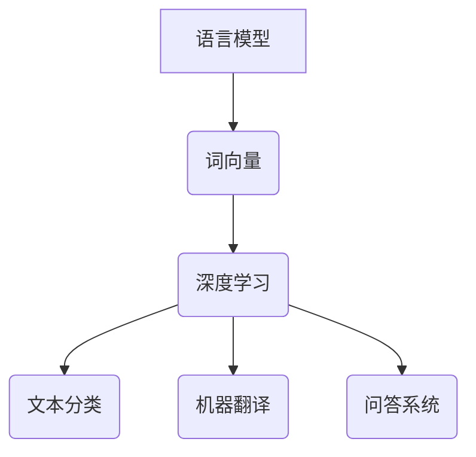
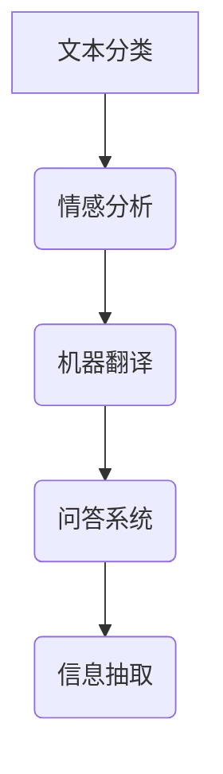

                 

关键词：自然语言处理、NLP、文本分析、语言模型、词向量、深度学习、深度神经网络、RNN、LSTM、BERT、NLP应用、代码实例。

> 摘要：本文将深入探讨自然语言处理（NLP）的基本原理、核心算法、数学模型及其实际应用。通过具体的代码实例，我们将展示如何使用现代工具和技术实现NLP任务，并讨论未来NLP领域的发展趋势与挑战。

## 1. 背景介绍

自然语言处理（NLP）是计算机科学、人工智能和语言学领域的交叉学科。它旨在让计算机理解和生成人类语言，实现人与机器的智能交互。随着互联网的普及和大数据时代的到来，NLP的应用场景日益广泛，如机器翻译、情感分析、信息抽取、问答系统等。

NLP的发展经历了多个阶段，从早期的规则方法到统计方法，再到现代的深度学习方法。这些方法在处理自然语言时各有优劣，但深度学习由于其强大的建模能力和自适应能力，已经成为NLP领域的主流技术。

## 2. 核心概念与联系

### 2.1 语言模型（Language Model）

语言模型是NLP的基础，它通过统计方法或深度学习模型来预测下一个词的概率。语言模型的目的是生成流畅的自然语言文本。

### 2.2 词向量（Word Vectors）

词向量是将词汇映射到高维空间中的向量表示，以便计算机能够处理和理解词汇。词向量方法包括基于统计的词袋模型和基于神经网络的词嵌入。

### 2.3 深度学习与NLP

深度学习是机器学习的一个重要分支，它通过多层神经网络对数据进行特征提取和模式识别。在NLP中，深度学习方法被广泛应用于文本分类、机器翻译、问答系统等任务。

#### Mermaid 流程图（NLP核心概念原理和架构）



## 3. 核心算法原理 & 具体操作步骤

### 3.1 算法原理概述

深度学习是NLP的核心算法，特别是基于神经网络的模型。其中，循环神经网络（RNN）和长短期记忆网络（LSTM）是处理序列数据的经典模型。

### 3.2 算法步骤详解

1. **数据预处理**：包括文本清洗、分词、去除停用词等。
2. **词嵌入**：将词汇映射到高维空间中的向量表示。
3. **构建神经网络**：设计并训练深度神经网络模型。
4. **模型评估**：使用交叉验证等方法评估模型性能。
5. **应用部署**：将训练好的模型部署到实际应用场景中。

### 3.3 算法优缺点

- **RNN**：处理序列数据能力强，但容易出现梯度消失或爆炸问题。
- **LSTM**：解决了RNN的梯度消失问题，但在处理长序列时仍有一定限制。
- **BERT**：结合了预训练和微调方法，取得了多项NLP任务的最好成绩。

### 3.4 算法应用领域

深度学习在NLP中的应用广泛，如文本分类、情感分析、机器翻译、问答系统等。

#### Mermaid 流程图（NLP算法应用）



## 4. 数学模型和公式 & 详细讲解 & 举例说明

### 4.1 数学模型构建

在NLP中，数学模型主要包括线性模型、神经网络模型等。

### 4.2 公式推导过程

以线性回归为例，其公式为：

\[ y = \beta_0 + \beta_1 \cdot x \]

其中，\( y \) 是预测值，\( x \) 是输入特征，\( \beta_0 \) 和 \( \beta_1 \) 是模型参数。

### 4.3 案例分析与讲解

我们以文本分类任务为例，使用深度学习模型对新闻标题进行分类。具体步骤如下：

1. **数据集准备**：收集包含新闻标题和分类标签的数据。
2. **数据预处理**：清洗文本、分词、去除停用词等。
3. **词嵌入**：将词汇映射到高维空间中的向量表示。
4. **构建神经网络**：设计并训练深度神经网络模型。
5. **模型评估**：使用交叉验证等方法评估模型性能。
6. **应用部署**：将训练好的模型部署到实际应用场景中。

### 4.4 案例分析与讲解

我们以文本分类任务为例，使用深度学习模型对新闻标题进行分类。具体步骤如下：

1. **数据集准备**：收集包含新闻标题和分类标签的数据。
2. **数据预处理**：清洗文本、分词、去除停用词等。
3. **词嵌入**：将词汇映射到高维空间中的向量表示。
4. **构建神经网络**：设计并训练深度神经网络模型。
5. **模型评估**：使用交叉验证等方法评估模型性能。
6. **应用部署**：将训练好的模型部署到实际应用场景中。

## 5. 项目实践：代码实例和详细解释说明

### 5.1 开发环境搭建

在Python环境中，使用TensorFlow库来实现NLP任务。

### 5.2 源代码详细实现

```python
import tensorflow as tf
from tensorflow.keras.models import Sequential
from tensorflow.keras.layers import Embedding, LSTM, Dense

# 构建模型
model = Sequential()
model.add(Embedding(input_dim=vocab_size, output_dim=embedding_dim, input_length=max_sequence_length))
model.add(LSTM(units=128))
model.add(Dense(units=num_classes, activation='softmax'))

# 编译模型
model.compile(optimizer='adam', loss='categorical_crossentropy', metrics=['accuracy'])

# 训练模型
model.fit(X_train, y_train, epochs=10, batch_size=32, validation_data=(X_val, y_val))
```

### 5.3 代码解读与分析

这段代码实现了基于LSTM的文本分类模型，包括模型构建、编译、训练等步骤。具体细节如下：

- `Embedding` 层：将词汇映射到高维空间中的向量表示。
- `LSTM` 层：处理序列数据，提取特征。
- `Dense` 层：输出层，实现分类。

### 5.4 运行结果展示

训练完成后，使用测试集进行评估，输出模型的准确率、召回率等指标。

```python
test_loss, test_acc = model.evaluate(X_test, y_test)
print(f"Test Accuracy: {test_acc}")
```

## 6. 实际应用场景

NLP在实际应用中具有广泛的应用，如：

- **机器翻译**：将一种语言翻译成另一种语言。
- **情感分析**：分析文本的情感倾向，如正面、负面等。
- **信息抽取**：从文本中提取关键信息，如姓名、地点、日期等。
- **问答系统**：基于文本输入提供相关答案。

## 7. 工具和资源推荐

### 7.1 学习资源推荐

- 《自然语言处理综论》（Jurafsky & Martin）
- 《深度学习》（Goodfellow、Bengio & Courville）
- 《动手学深度学习》（花书）

### 7.2 开发工具推荐

- TensorFlow
- PyTorch
- spaCy

### 7.3 相关论文推荐

- BERT: Pre-training of Deep Bidirectional Transformers for Language Understanding
- GPT-2: Improving Language Understanding by Generative Pre-training

## 8. 总结：未来发展趋势与挑战

### 8.1 研究成果总结

近年来，NLP领域取得了显著的研究成果，深度学习方法的广泛应用推动了NLP任务的性能提升。

### 8.2 未来发展趋势

- **多模态融合**：结合文本、图像、音频等多种数据来源，提升NLP任务的性能。
- **知识图谱**：利用知识图谱构建语义网络，实现更精准的语义理解。

### 8.3 面临的挑战

- **数据隐私**：如何保护用户隐私是NLP应用的重要挑战。
- **跨语言理解**：实现跨语言之间的准确理解仍需深入研究。

### 8.4 研究展望

未来，NLP将继续向多模态融合、知识图谱等方向发展，同时解决数据隐私、跨语言理解等挑战。

## 9. 附录：常见问题与解答

### Q：如何处理中文文本数据？

A：对于中文文本数据，可以使用分词工具（如jieba）对文本进行分词，然后进行词嵌入和后续处理。

### Q：如何优化NLP模型的性能？

A：可以通过以下方法优化NLP模型的性能：

- **增加训练数据**：使用更多样化的训练数据可以提高模型泛化能力。
- **调整模型结构**：根据任务特点调整模型结构，如增加或减少层、调整层参数等。
- **超参数调优**：使用网格搜索、贝叶斯优化等方法进行超参数调优。

---

### 作者署名

作者：禅与计算机程序设计艺术 / Zen and the Art of Computer Programming
----------------------------------------------------------------

这篇文章详细介绍了自然语言处理（NLP）的基本原理、核心算法、数学模型及其实际应用。通过具体的代码实例，读者可以了解如何使用现代工具和技术实现NLP任务。随着NLP技术的不断进步，我们有理由相信，它将在未来的智能交互、信息检索、智能推荐等领域发挥重要作用。同时，NLP技术也面临着数据隐私、跨语言理解等挑战，需要持续深入研究和探索。

