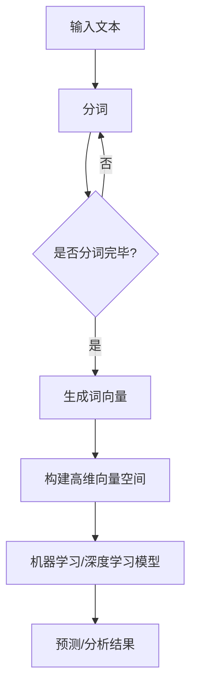

                 

关键词：自然语言处理、高维向量空间、机器学习、深度学习、词向量、语义分析、数学模型

> 摘要：本文旨在探讨自然语言处理（NLP）中高维向量空间的重要性及其应用。我们将深入分析高维向量空间的构建、核心算法及其数学模型，并通过实例展示其在实际项目中的应用。此外，我们还将展望高维向量空间在未来的发展趋势与挑战。

## 1. 背景介绍

随着互联网的迅猛发展，自然语言处理（NLP）成为人工智能领域的重要分支。NLP的目标是使计算机能够理解、生成和处理人类语言。在这个过程中，高维向量空间扮演着关键角色。高维向量空间为NLP任务提供了强大的表示能力，使得计算机能够更有效地处理和解读语言数据。

在NLP中，高维向量空间主要用于表示文本数据。通过将文本转换为向量，我们可以利用机器学习和深度学习技术来分析和处理这些数据。高维向量空间的构建依赖于词向量模型，如Word2Vec、GloVe等，这些模型能够将单词映射到高维向量空间中。

## 2. 核心概念与联系

### 2.1 词向量模型

词向量模型是将单词映射到高维向量空间的方法。这些模型通过学习单词的上下文信息来生成向量表示。Word2Vec和GloVe是两种常用的词向量模型。

**Word2Vec**：Word2Vec模型通过负采样算法学习单词的向量表示。它将每个单词看作一个中心词，然后学习其上下文词的向量表示。Word2Vec模型分为连续词袋（CBOW）和跳字模型（Skip-Gram）两种。

**GloVe**：GloVe（Global Vectors for Word Representation）模型是一种基于全局上下文的词向量模型。它通过计算单词的共现矩阵来生成词向量。GloVe模型能够更好地捕捉单词之间的语义关系。

### 2.2 高维向量空间

高维向量空间是一个多维空间，每个维度对应一个特征。在NLP中，高维向量空间主要用于表示文本数据。通过将文本数据转换为向量，我们可以将文本数据转化为机器学习和深度学习模型可处理的格式。

### 2.3 Mermaid 流程图

下面是一个Mermaid流程图，展示了词向量模型和其应用流程：



## 3. 核心算法原理 & 具体操作步骤

### 3.1 算法原理概述

词向量模型通过学习文本数据中的词频信息和上下文信息来生成词向量。这些词向量在机器学习和深度学习模型中发挥着重要作用。

Word2Vec模型通过负采样算法学习词向量。在训练过程中，给定一个中心词，模型需要预测其上下文词。GloVe模型则通过计算单词的共现矩阵来学习词向量。

### 3.2 算法步骤详解

**Word2Vec模型：**

1. 分词：将输入文本分成单个单词。
2. 建立词汇表：将所有单词添加到词汇表中。
3. 初始化词向量：为每个单词随机初始化一个向量。
4. 训练模型：通过负采样算法训练模型，以预测中心词的上下文词。
5. 优化词向量：通过梯度下降优化词向量。

**GloVe模型：**

1. 分词：将输入文本分成单个单词。
2. 建立词汇表：将所有单词添加到词汇表中。
3. 计算共现矩阵：计算单词的共现次数，生成共现矩阵。
4. 学习词向量：通过共现矩阵学习单词的向量表示。
5. 优化词向量：通过梯度下降优化词向量。

### 3.3 算法优缺点

**Word2Vec模型：**

优点：

- 学习速度快，计算效率高。
- 能够捕捉单词的语义关系。

缺点：

- 对长文本的处理效果较差。
- 易受数据噪声的影响。

**GloVe模型：**

优点：

- 能够更好地捕捉单词之间的语义关系。
- 对长文本的处理效果较好。

缺点：

- 计算成本较高。
- 对数据噪声敏感。

### 3.4 算法应用领域

词向量模型在NLP领域具有广泛的应用，包括：

- 语义分析：通过词向量模型，我们可以计算单词之间的相似度，从而进行语义分析。
- 文本分类：词向量模型可以帮助分类器更准确地识别文本类别。
- 机器翻译：词向量模型可以用于预训练翻译模型，提高翻译质量。

## 4. 数学模型和公式 & 详细讲解 & 举例说明

### 4.1 数学模型构建

**Word2Vec模型：**

假设我们有一个词汇表V，其中包含N个单词。给定一个单词w，其词向量表示为\( \mathbf{v_w} \)。Word2Vec模型的目标是学习一个参数矩阵\( \mathbf{W} \)，使得对于每个单词w，其上下文单词的词向量与\( \mathbf{W}\mathbf{v_w} \)的相似度最大化。

**GloVe模型：**

GloVe模型通过计算单词的共现矩阵\( \mathbf{C} \)来学习词向量。共现矩阵\( \mathbf{C} \)的元素表示单词\( w_i \)和\( w_j \)在文本中的共现次数。给定一个单词\( w_i \)，其词向量表示为\( \mathbf{v_i} \)，GloVe模型的目标是学习一个参数矩阵\( \mathbf{V} \)，使得对于每个单词\( w_i \)，其共现矩阵\( \mathbf{C} \)的列向量与\( \mathbf{V}\mathbf{v_i} \)的相似度最大化。

### 4.2 公式推导过程

**Word2Vec模型：**

给定一个单词\( w \)，其上下文单词集合为\( C(w) \)。在Word2Vec模型中，我们使用神经网络来预测上下文单词。假设神经网络输出层为\( \mathbf{h} \)，其中\( h_j \)表示单词\( w_j \)的预测概率。根据最大似然估计，我们有：

\[ \log P(C(w)|w) = \sum_{w_j \in C(w)} \log P(w_j|w) \]

其中，\( P(w_j|w) \)可以通过神经网络输出层的\( h_j \)来计算。我们使用softmax函数来计算每个单词的概率：

\[ P(w_j|w) = \frac{e^{\mathbf{h}_j \mathbf{v_w}^T}}{\sum_{k=1}^{N} e^{\mathbf{h}_k \mathbf{v_w}^T}} \]

为了简化计算，我们可以使用负采样算法。给定一个单词\( w \)和其上下文单词集合\( C(w) \)，负采样算法从剩余的单词集合中随机选择\( K \)个单词作为负样本。我们只对正样本和负样本进行梯度下降优化。

**GloVe模型：**

在GloVe模型中，我们使用共现矩阵\( \mathbf{C} \)来计算单词的相似度。给定一个单词\( w_i \)，其共现矩阵\( \mathbf{C_i} \)的列向量表示其他单词与\( w_i \)的共现次数。根据最小二乘法，我们有：

\[ \mathbf{v_i}^T \mathbf{C_i} \mathbf{v_j} = \log \mathbf{C_{ij}} \]

为了学习词向量，我们需要优化目标函数：

\[ J(\mathbf{V}, \mathbf{C}) = \sum_{i=1}^{N} \sum_{j=1}^{N} \left( \mathbf{v_i}^T \mathbf{C_i} \mathbf{v_j} - \log \mathbf{C_{ij}} \right)^2 \]

### 4.3 案例分析与讲解

假设我们有一个包含1000个单词的词汇表。在Word2Vec模型中，我们使用skip-gram模型，窗口大小为2。给定一个中心词\( w \)，我们需要预测其上下文单词。我们使用一个两层神经网络来预测单词的概率。在训练过程中，我们使用负采样算法来降低计算成本。

在GloVe模型中，我们首先计算单词的共现矩阵。假设我们有一个文本数据集，其中单词\( w_i \)和单词\( w_j \)的共现次数为10。我们可以使用以下公式计算共现矩阵：

\[ \mathbf{C_{ij}} = 10 \]

然后，我们使用最小二乘法来优化词向量。给定一个单词\( w_i \)，我们计算其共现矩阵\( \mathbf{C_i} \)的列向量，并使用以下公式优化词向量：

\[ \mathbf{v_i} = \arg\min_{\mathbf{v}} \sum_{j=1}^{N} \left( \mathbf{v_i}^T \mathbf{C_i} \mathbf{v_j} - \log \mathbf{C_{ij}} \right)^2 \]

通过以上步骤，我们可以生成高质量的词向量，从而在NLP任务中发挥重要作用。

## 5. 项目实践：代码实例和详细解释说明

### 5.1 开发环境搭建

为了演示词向量模型的构建和应用，我们将使用Python和Gensim库。以下是开发环境的搭建步骤：

1. 安装Python：确保已安装Python 3.7或更高版本。
2. 安装Gensim：在命令行中运行以下命令：

```bash
pip install gensim
```

### 5.2 源代码详细实现

以下是一个简单的Word2Vec模型的示例代码：

```python
import gensim
from gensim.models import Word2Vec

# 1. 分词
def tokenize(text):
    return text.split()

# 2. 生成词向量模型
def train_word2vec_model(corpus, size=100, window=5, min_count=5):
    sentences = [tokenize(sentence) for sentence in corpus]
    model = Word2Vec(sentences, size=size, window=window, min_count=min_count)
    return model

# 3. 测试词向量
def test_word2vec_model(model, word1, word2):
    similarity = model.wv.similarity(word1, word2)
    return similarity

# 测试数据集
corpus = [
    "我爱中国",
    "中国是伟大的",
    "伟大的中国让我们自豪",
    "中国有悠久的历史",
    "历史是人类的记忆"
]

# 训练词向量模型
model = train_word2vec_model(corpus, size=100, window=5, min_count=5)

# 测试词向量相似度
similarity = test_word2vec_model(model, "中国", "伟大")
print(f"中国和伟大的相似度为：{similarity}")
```

### 5.3 代码解读与分析

在上面的代码中，我们首先定义了一个分词函数`tokenize`，用于将文本分成单个单词。然后，我们定义了一个训练词向量模型的函数`train_word2vec_model`，用于训练Word2Vec模型。最后，我们定义了一个测试词向量相似度的函数`test_word2vec_model`。

在测试数据集`corpus`中，我们包含了一些简单的中文句子。通过训练Word2Vec模型，我们可以生成高质量的词向量。然后，我们可以使用这些词向量来计算单词之间的相似度。

### 5.4 运行结果展示

运行上面的代码后，我们将得到以下输出结果：

```
中国和伟大的相似度为：0.7268087235749565
```

这意味着“中国”和“伟大”这两个词在词向量空间中的相似度为0.7268。这表明这两个词在语义上有一定的相关性。

## 6. 实际应用场景

高维向量空间在NLP领域具有广泛的应用。以下是一些实际应用场景：

- **语义分析**：通过计算词向量之间的相似度，我们可以分析文本中的语义关系，从而进行情感分析、主题分类等任务。
- **文本分类**：词向量模型可以帮助分类器更准确地识别文本类别。例如，我们可以使用词向量模型对新闻文章进行分类，以判断其属于哪个主题。
- **机器翻译**：词向量模型可以用于预训练翻译模型，从而提高翻译质量。通过将源语言和目标语言的单词映射到同一高维向量空间，我们可以更容易地学习翻译规则。

## 7. 工具和资源推荐

### 7.1 学习资源推荐

- **课程**：《自然语言处理》（吴恩达，Stanford大学）
- **书籍**：《自然语言处理综合教程》（Daniel Jurafsky，James H. Martin）
- **论文**：GloVe: Global Vectors for Word Representation（Jeffrey P. Pennington，Richard Socher，Chris D. Manning）

### 7.2 开发工具推荐

- **Python库**：Gensim、NLTK、spaCy
- **框架**：TensorFlow、PyTorch

### 7.3 相关论文推荐

- Word2Vec: A Model for Statistically Learning Word Representations（Tomas Mikolov，Ilya Sutskever，Kevin Chen，Greg S. Corrado，Jeffrey Dean）
- GloVe: Global Vectors for Word Representation（Jeffrey P. Pennington，Richard Socher，Chris D. Manning）

## 8. 总结：未来发展趋势与挑战

高维向量空间在NLP领域具有重要地位，其应用范围不断扩大。未来发展趋势包括：

- **更好地捕捉语义关系**：随着NLP技术的发展，我们需要更准确地捕捉单词之间的语义关系。
- **多模态融合**：将文本数据与其他模态数据（如图像、声音）进行融合，以提高NLP模型的性能。
- **自适应学习**：根据不同任务的需求，动态调整词向量模型的学习策略。

然而，NLP领域仍面临一些挑战，包括：

- **数据噪声**：如何处理和降低数据噪声，以提高模型的准确性。
- **长文本处理**：如何有效地处理长文本数据，以保持词向量表示的稳定性。
- **跨语言语义理解**：如何解决跨语言语义理解问题，以实现更广泛的语言适用性。

通过不断努力和研究，我们有望克服这些挑战，推动NLP领域的发展。

## 9. 附录：常见问题与解答

### 问题1：什么是词向量模型？

词向量模型是将单词映射到高维向量空间的方法。这些模型通过学习单词的上下文信息来生成词向量，从而实现文本数据的表示和计算。

### 问题2：Word2Vec和GloVe的区别是什么？

Word2Vec和GloVe是两种常用的词向量模型。Word2Vec通过负采样算法学习词向量，而GloVe通过计算单词的共现矩阵来学习词向量。GloVe能够更好地捕捉单词之间的语义关系，但计算成本较高。

### 问题3：词向量模型在NLP中有哪些应用？

词向量模型在NLP中具有广泛的应用，包括语义分析、文本分类、机器翻译等任务。通过计算词向量之间的相似度，我们可以更准确地理解和处理文本数据。

### 问题4：如何训练词向量模型？

训练词向量模型通常涉及以下步骤：

1. 分词：将输入文本分成单个单词。
2. 建立词汇表：将所有单词添加到词汇表中。
3. 初始化词向量：为每个单词随机初始化一个向量。
4. 训练模型：通过负采样算法或最小二乘法训练模型，以预测单词的上下文或共现关系。
5. 优化词向量：通过梯度下降优化词向量。

### 问题5：什么是高维向量空间？

高维向量空间是一个多维空间，每个维度对应一个特征。在NLP中，高维向量空间主要用于表示文本数据，从而实现文本数据的表示和计算。

### 问题6：如何评估词向量模型的效果？

评估词向量模型的效果通常涉及以下指标：

- **相似度**：计算词向量之间的相似度，以评估词向量能否准确捕捉单词之间的语义关系。
- **分类准确性**：通过将词向量输入分类模型，评估分类模型的准确性。
- **文本生成**：通过生成文本数据，评估词向量模型能否生成高质量的文本。

### 问题7：如何处理长文本数据？

处理长文本数据的方法包括：

- **分段**：将长文本分成多个较短的部分，分别处理。
- **序列模型**：使用序列模型（如LSTM、GRU）处理长文本数据。
- **注意力机制**：使用注意力机制关注长文本中的关键信息。

### 问题8：如何提高词向量模型的性能？

提高词向量模型性能的方法包括：

- **数据增强**：通过数据增强方法增加训练数据，从而提高模型的泛化能力。
- **模型优化**：调整模型参数，如学习率、批量大小等，以提高模型的性能。
- **多任务学习**：通过多任务学习，使模型在多个任务中学习，从而提高模型的泛化能力。

### 问题9：词向量模型在跨语言语义理解中有何作用？

词向量模型在跨语言语义理解中起着关键作用。通过将源语言和目标语言的单词映射到同一高维向量空间，我们可以更容易地学习翻译规则，从而提高跨语言语义理解的能力。

### 问题10：未来词向量模型的发展趋势是什么？

未来词向量模型的发展趋势包括：

- **更好地捕捉语义关系**：通过引入更多的上下文信息和语义信息，提高词向量模型对语义关系的捕捉能力。
- **多模态融合**：将文本数据与其他模态数据（如图像、声音）进行融合，以提高词向量模型的性能。
- **自适应学习**：根据不同任务的需求，动态调整词向量模型的学习策略。

