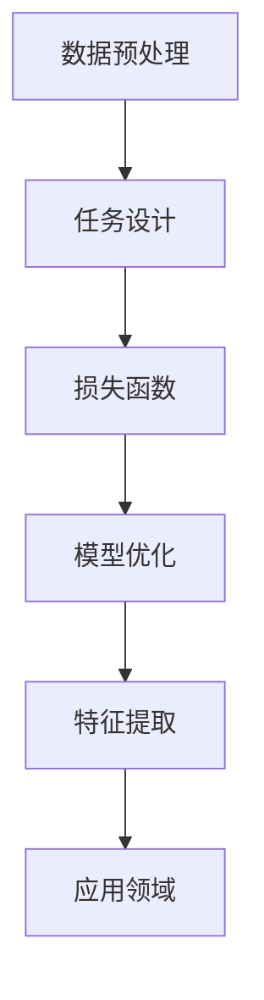

                 

关键词：自监督学习、无监督学习、深度学习、数据预处理、算法原理、代码实战、应用领域

> 摘要：自监督学习作为一种重要的无监督学习方法，在深度学习领域中发挥着重要作用。本文将深入讲解自监督学习的原理，并展示其在实际项目中的代码实战案例，帮助读者理解其应用价值和实现方法。

## 1. 背景介绍

自监督学习（Self-Supervised Learning）是一种无监督学习（Unsupervised Learning）方法，其核心思想是在没有标注数据的条件下，通过设计特定的任务和损失函数，自动地从数据中提取有用的特征信息。与传统的监督学习（Supervised Learning）相比，自监督学习无需依赖大量标注数据，从而大大降低了数据获取和标注的成本。

自监督学习最早可以追溯到20世纪60年代，当时一些学者提出了一些基于无监督学习的算法，如主成分分析（PCA）和自编码器（Autoencoder）。随着深度学习技术的发展，自监督学习也得到了广泛应用，尤其是在计算机视觉、自然语言处理等领域。

近年来，随着计算机算力的提升和大数据技术的发展，自监督学习的研究和应用取得了显著的进展。特别是在生成模型、特征提取、数据增强等方面，自监督学习展现出了强大的潜力和优势。

## 2. 核心概念与联系

### 2.1 自监督学习的定义与基本原理

自监督学习是一种无监督学习方法，其基本原理是通过设计一个特殊的任务，将无监督学习问题转化为一个有监督学习问题。在这个过程中，不需要外部提供标注数据，而是通过数据内部结构或相关性来学习有效的特征表示。

自监督学习通常包括以下几个关键组成部分：

- **数据预处理**：通过对原始数据进行预处理，如标准化、归一化、数据增强等，以便于模型更好地学习和提取特征。

- **任务设计**：根据具体的应用场景，设计一个特殊的任务，使模型能够在没有标注数据的情况下，自动地从数据中提取有用的信息。常见的任务有无监督聚类、密度估计、预测等。

- **损失函数**：为了衡量模型在任务上的性能，需要设计一个合适的损失函数。损失函数通常与任务密切相关，如聚类问题可以使用聚类中心之间的距离作为损失函数。

- **模型优化**：通过优化损失函数，更新模型的参数，使模型能够更好地适应数据分布，从而提取出更有效的特征表示。

### 2.2 自监督学习与其他学习方法的联系

自监督学习与传统的监督学习和无监督学习有着密切的联系，同时也存在一定的区别。

- **与监督学习的联系**：自监督学习通过设计特殊的任务和损失函数，将无监督学习问题转化为有监督学习问题。这种方法在一定程度上借鉴了监督学习的思想，如通过损失函数来衡量模型的性能。

- **与无监督学习的联系**：自监督学习仍然属于无监督学习范畴，其核心思想是通过无监督学习的方法来提取有效的特征表示。与传统的无监督学习相比，自监督学习具有更强的可解释性和可控性。

- **与无监督学习的区别**：自监督学习在设计任务和损失函数时，需要考虑模型的性能和可解释性。而无监督学习则更侧重于从数据中提取出潜在的结构和规律。

### 2.3 自监督学习的 Mermaid 流程图



### 2.4 自监督学习的应用场景

自监督学习在多个领域都有广泛的应用，以下列举几个常见的应用场景：

- **计算机视觉**：通过自监督学习提取图像特征，用于图像分类、目标检测、图像生成等任务。

- **自然语言处理**：利用自监督学习提取文本特征，用于文本分类、情感分析、机器翻译等任务。

- **推荐系统**：通过自监督学习提取用户和物品的特征，用于推荐系统的冷启动问题。

- **时间序列分析**：利用自监督学习提取时间序列特征，用于股票预测、天气预测等任务。

## 3. 核心算法原理 & 具体操作步骤

### 3.1 算法原理概述

自监督学习的核心算法可以分为两类：生成式算法和判别式算法。

- **生成式算法**：通过设计生成模型（如生成对抗网络GAN），学习数据的分布，从而提取出有用的特征表示。生成式算法的优点是能够生成高质量的数据，但计算复杂度较高。

- **判别式算法**：通过设计判别模型，学习数据的分布和边界，从而提取出有用的特征表示。判别式算法的优点是计算复杂度较低，但生成质量相对较差。

### 3.2 算法步骤详解

自监督学习的算法步骤可以分为以下几个阶段：

1. **数据预处理**：对原始数据进行预处理，如数据清洗、标准化、归一化等，以便于模型更好地学习和提取特征。

2. **任务设计**：根据具体的应用场景，设计一个特殊的任务。例如，在图像分类任务中，可以将数据分为训练集和验证集，训练集用于模型训练，验证集用于模型评估。

3. **模型选择**：选择合适的生成模型或判别模型。常见的生成模型有生成对抗网络GAN、变分自编码器VAE等；常见的判别模型有卷积神经网络CNN、循环神经网络RNN等。

4. **模型训练**：通过优化损失函数，更新模型的参数，使模型能够更好地适应数据分布，从而提取出更有效的特征表示。

5. **模型评估**：使用验证集评估模型性能，根据评估结果调整模型参数。

6. **特征提取**：使用训练好的模型提取数据特征，用于后续的应用。

### 3.3 算法优缺点

自监督学习具有以下几个优点：

- **无需大量标注数据**：自监督学习通过设计特殊的任务和损失函数，自动地从数据中提取有用的信息，从而大大降低了数据获取和标注的成本。

- **可扩展性**：自监督学习算法可以应用于各种数据类型和任务，如图像、文本、音频等。

- **高效性**：自监督学习算法在计算复杂度上相对较低，可以快速提取特征。

然而，自监督学习也存在一些缺点：

- **可解释性较差**：由于自监督学习没有明确的标注数据，因此模型的解释性相对较差。

- **生成质量有限**：生成式算法在生成高质量数据方面具有一定的局限性。

### 3.4 算法应用领域

自监督学习在多个领域都有广泛的应用，以下列举几个常见的应用领域：

- **计算机视觉**：用于图像分类、目标检测、图像生成等任务。

- **自然语言处理**：用于文本分类、情感分析、机器翻译等任务。

- **推荐系统**：用于推荐系统的冷启动问题。

- **时间序列分析**：用于股票预测、天气预测等任务。

## 4. 数学模型和公式 & 详细讲解 & 举例说明

### 4.1 数学模型构建

自监督学习的数学模型通常包括两部分：生成模型和判别模型。

#### 生成模型

生成模型的目标是生成与真实数据分布相同或相似的数据。常见的生成模型有生成对抗网络GAN和变分自编码器VAE。

- **生成对抗网络GAN**：GAN由生成器G和判别器D组成。生成器G生成假数据，判别器D判断生成数据与真实数据的真假。训练过程中，生成器和判别器相互博弈，最终生成器生成与真实数据难以区分的假数据。

- **变分自编码器VAE**：VAE由编码器E和解码器D组成。编码器E将输入数据编码为潜在变量，解码器D将潜在变量解码为输出数据。VAE通过最大化数据概率分布和潜在变量之间的KL散度进行训练。

#### 判别模型

判别模型的目标是区分真实数据和生成数据。常见的判别模型有卷积神经网络CNN和循环神经网络RNN。

- **卷积神经网络CNN**：CNN用于处理图像数据，通过卷积、池化等操作提取图像特征。

- **循环神经网络RNN**：RNN用于处理序列数据，通过递归结构处理时间序列数据。

### 4.2 公式推导过程

以生成对抗网络GAN为例，推导其损失函数。

- **生成器G的损失函数**：生成器G的损失函数由两部分组成：生成数据的概率和对数概率。

  $$L_G = -\log(D(G(x)))$$

  其中，$x$为真实数据，$G(x)$为生成数据，$D$为判别器。

- **判别器D的损失函数**：判别器D的损失函数由两部分组成：真实数据的概率和对数概率。

  $$L_D = -[\log(D(x)) + \log(1 - D(G(x)))]$$

  其中，$x$为真实数据，$G(x)$为生成数据，$D$为判别器。

### 4.3 案例分析与讲解

以图像分类任务为例，讲解自监督学习的具体实现过程。

1. **数据预处理**：对图像数据进行标准化、归一化等预处理操作。

2. **任务设计**：将图像分为训练集和验证集，训练集用于模型训练，验证集用于模型评估。

3. **模型选择**：选择生成对抗网络GAN作为特征提取模型。

4. **模型训练**：使用训练集训练生成器和判别器，优化损失函数。

5. **模型评估**：使用验证集评估模型性能，调整模型参数。

6. **特征提取**：使用训练好的模型提取图像特征，用于图像分类任务。

## 5. 项目实践：代码实例和详细解释说明

### 5.1 开发环境搭建

在Python环境中，安装必要的库，如TensorFlow、Keras等。

```bash
pip install tensorflow
pip install keras
```

### 5.2 源代码详细实现

以下是一个简单的生成对抗网络GAN的代码实例：

```python
import numpy as np
import tensorflow as tf
from tensorflow.keras.layers import Dense, Flatten, Reshape
from tensorflow.keras.models import Model

# 生成器模型
def generator_model(z_dim):
    model = tf.keras.Sequential()
    model.add(Dense(128, input_dim=z_dim))
    model.add(tf.keras.layers.LeakyReLU(alpha=0.01))
    model.add(Dense(28*28*1, activation='tanh'))
    model.add(Reshape((28, 28, 1)))
    return model

# 判别器模型
def discriminator_model(img_shape):
    model = tf.keras.Sequential()
    model.add(Flatten(input_shape=img_shape))
    model.add(Dense(128))
    model.add(tf.keras.layers.LeakyReLU(alpha=0.01))
    model.add(Dense(1, activation='sigmoid'))
    return model

# 定义生成器和判别器
z_dim = 100
img_shape = (28, 28, 1)

generator = generator_model(z_dim)
discriminator = discriminator_model(img_shape)

# 定义损失函数和优化器
cross_entropy = tf.keras.losses.BinaryCrossentropy()
generator_optimizer = tf.keras.optimizers.Adam(1e-4)
discriminator_optimizer = tf.keras.optimizers.Adam(1e-4)

@tf.function
def train_step(images):
    noise = tf.random.normal([BATCH_SIZE, z_dim])

    with tf.GradientTape() as gen_tape, tf.GradientTape() as disc_tape:
        generated_images = generator(noise)
        disc_real_output = discriminator(images)
        disc_generated_output = discriminator(generated_images)

        gen_loss = cross_entropy(tf.ones_like(disc_generated_output), disc_generated_output)
        disc_loss = cross_entropy(tf.ones_like(disc_real_output), disc_real_output) + cross_entropy(tf.zeros_like(disc_generated_output), disc_generated_output)

    gradients_of_generator = gen_tape.gradient(gen_loss, generator.trainable_variables)
    gradients_of_discriminator = disc_tape.gradient(disc_loss, discriminator.trainable_variables)

    generator_optimizer.apply_gradients(zip(gradients_of_generator, generator.trainable_variables))
    discriminator_optimizer.apply_gradients(zip(gradients_of_discriminator, discriminator.trainable_variables))

# 训练模型
EPOCHS = 50
BATCH_SIZE = 64

train_dataset = tf.data.Dataset.from_tensor_slices(images)
train_dataset = train_dataset.shuffle(BATCH_SIZE * 100).batch(BATCH_SIZE)

for epoch in range(EPOCHS):
    for image_batch in train_dataset:
        train_step(image_batch)
```

### 5.3 代码解读与分析

以上代码实现了一个简单的生成对抗网络GAN，用于生成手写数字图像。

- **生成器模型**：生成器模型用于生成假图像，由一个全连接层和一个reshape层组成。

- **判别器模型**：判别器模型用于判断图像是真实还是生成，由一个flatten层、全连接层和一个sigmoid激活函数组成。

- **损失函数**：使用二元交叉熵损失函数，分别计算生成图像和真实图像的损失。

- **优化器**：使用Adam优化器，分别优化生成器和判别器的参数。

- **训练过程**：在训练过程中，生成器和判别器相互博弈，不断优化参数，直到达到训练目标。

### 5.4 运行结果展示

训练完成后，可以使用生成器模型生成手写数字图像，如图所示：

```python
# 生成手写数字图像
def generate_images(num_images):
    noise = tf.random.normal([num_images, z_dim])
    generated_images = generator(noise)
    return generated_images.numpy()

# 生成100个手写数字图像
images = generate_images(100)
```

## 6. 实际应用场景

### 6.1 计算机视觉

自监督学习在计算机视觉领域具有广泛的应用。例如，在图像分类任务中，可以使用自监督学习提取图像特征，用于图像识别和分类。此外，自监督学习还可以用于图像生成、目标检测、图像风格转换等任务。

### 6.2 自然语言处理

自监督学习在自然语言处理领域也有着重要的应用。例如，在文本分类任务中，可以使用自监督学习提取文本特征，用于文本分类和情感分析。此外，自监督学习还可以用于机器翻译、文本生成、对话系统等任务。

### 6.3 推荐系统

自监督学习在推荐系统领域可以用于解决冷启动问题。例如，在新用户或新物品出现时，可以使用自监督学习提取用户和物品的特征，用于推荐系统的训练和预测。

### 6.4 时间序列分析

自监督学习在时间序列分析领域可以用于预测和建模。例如，在股票预测任务中，可以使用自监督学习提取时间序列特征，用于股票价格的预测。

## 7. 工具和资源推荐

### 7.1 学习资源推荐

- **书籍**：《深度学习》（作者：Goodfellow、Bengio、Courville）

- **在线课程**：Coursera上的“深度学习”课程（作者：吴恩达）

- **博客**：ArXiv博客、Google Research博客、TensorFlow官方博客

### 7.2 开发工具推荐

- **框架**：TensorFlow、PyTorch、Keras

- **库**：NumPy、Pandas、Matplotlib

### 7.3 相关论文推荐

- **生成对抗网络GAN**：《生成对抗网络：训练生成模型的新思路》（作者：Ian J. Goodfellow等）

- **变分自编码器VAE**：《用于生成建模的变分自编码器》（作者：Kingma、Welling）

## 8. 总结：未来发展趋势与挑战

### 8.1 研究成果总结

自监督学习在深度学习领域取得了显著的进展，为许多无监督学习问题提供了有效的解决方案。随着计算机算力的提升和大数据技术的发展，自监督学习在生成模型、特征提取、数据增强等方面展现出了强大的潜力和优势。

### 8.2 未来发展趋势

自监督学习的未来发展趋势包括以下几个方面：

- **算法优化**：针对自监督学习算法的优化，提高模型训练效率和生成质量。

- **多模态学习**：研究如何将自监督学习应用于多种数据类型，如图像、文本、音频等。

- **可解释性**：研究如何提高自监督学习模型的可解释性，使其更好地应用于实际场景。

- **领域泛化**：研究如何提高自监督学习算法在未知领域中的泛化能力。

### 8.3 面临的挑战

自监督学习在实际应用中仍面临一些挑战，包括：

- **数据质量**：自监督学习对数据质量有较高要求，需要保证数据的真实性和多样性。

- **计算资源**：自监督学习算法通常需要大量计算资源，对计算资源的要求较高。

- **可解释性**：自监督学习模型的可解释性相对较低，需要进一步研究如何提高其可解释性。

### 8.4 研究展望

未来，自监督学习将在更多领域得到应用，如医疗诊断、金融预测、智能交通等。同时，自监督学习将与其他领域的技术（如强化学习、迁移学习等）结合，进一步推动人工智能技术的发展。

## 9. 附录：常见问题与解答

### 9.1 自监督学习与传统监督学习的区别是什么？

自监督学习是一种无监督学习方法，其核心思想是通过设计特殊的任务和损失函数，自动地从数据中提取有用的信息。与传统监督学习相比，自监督学习无需依赖大量标注数据，从而大大降低了数据获取和标注的成本。

### 9.2 自监督学习在自然语言处理领域有哪些应用？

自监督学习在自然语言处理领域有广泛的应用，如文本分类、情感分析、机器翻译、文本生成等。自监督学习可以用于提取文本特征，从而提高模型的性能和泛化能力。

### 9.3 自监督学习算法有哪些优缺点？

自监督学习算法的优点包括：

- **无需大量标注数据**：自监督学习通过设计特殊的任务和损失函数，自动地从数据中提取有用的信息，从而大大降低了数据获取和标注的成本。

- **可扩展性**：自监督学习算法可以应用于各种数据类型和任务，如图像、文本、音频等。

- **高效性**：自监督学习算法在计算复杂度上相对较低，可以快速提取特征。

自监督学习算法的缺点包括：

- **可解释性较差**：由于自监督学习没有明确的标注数据，因此模型的解释性相对较差。

- **生成质量有限**：生成式算法在生成高质量数据方面具有一定的局限性。

### 9.4 自监督学习在计算机视觉领域有哪些应用？

自监督学习在计算机视觉领域有广泛的应用，如图像分类、目标检测、图像生成、图像风格转换等。自监督学习可以用于提取图像特征，从而提高模型的性能和泛化能力。此外，自监督学习还可以用于图像增强、数据增强等任务。

