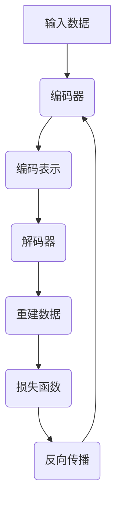

                 

### 背景介绍 Background Introduction

自编码器（Autoencoders）是深度学习领域中的一个重要概念，最早由贝尔实验室的工程师在1980年代提出。自编码器是一种无监督学习模型，它通过将输入数据编码成一个中间表示（通常是一个压缩的、低维的特征向量），然后再将这些特征向量解码回原始数据，从而达到数据压缩和特征提取的目的。自编码器在图像、语音、文本等各个领域都展现出了强大的潜力和应用价值。

### 核心概念与联系 Core Concepts and Relationships

在讨论自编码器之前，我们需要了解几个核心概念：编码器（Encoder）、解码器（Decoder）、损失函数（Loss Function）等。

#### 编码器 Encoder

编码器是一个神经网络，它的主要任务是接收输入数据，并将其转换成一个压缩的中间表示。这个表示通常是一个低维的向量，它保留了输入数据的最重要的特征。

#### 解码器 Decoder

解码器与编码器相反，它接收编码器输出的中间表示，并尝试将其解码回原始数据。解码器的目的是重建输入数据。

#### 损失函数 Loss Function

损失函数用于衡量编码器和解码器之间的输出与原始输入之间的差距。常见的损失函数有均方误差（MSE）、交叉熵（Cross-Entropy）等。

下面是自编码器的核心概念与联系的一个 Mermaid 流程图：


### 核心算法原理 & 具体操作步骤 Core Algorithm Principle & Operational Steps

#### 3.1 算法原理概述

自编码器的训练过程可以分为两个阶段：

1. **编码阶段**：输入数据通过编码器转换为一个中间表示。
2. **解码阶段**：中间表示通过解码器转换回原始数据。

训练的目标是使得解码器能够尽可能准确地重建输入数据。

#### 3.2 算法步骤详解

1. **初始化编码器和解码器**：通常使用随机初始化。
2. **前向传播**：输入数据通过编码器转换为一个中间表示。
3. **计算损失**：使用损失函数计算解码器输出与原始输入之间的差距。
4. **反向传播**：根据损失函数的反向梯度，更新编码器和解码器的参数。
5. **重复步骤2-4**：直到模型收敛或达到预定的迭代次数。

#### 3.3 算法优缺点

**优点**：

- 无需标签数据，适用于无监督学习。
- 可以同时进行数据压缩和特征提取。
- 对异常值有一定的鲁棒性。

**缺点**：

- 训练过程较慢，特别是对于大型数据集。
- 对于过于压缩的数据，可能无法很好地重建原始数据。

#### 3.4 算法应用领域

自编码器在图像、语音、文本等领域都有广泛的应用：

- **图像处理**：用于数据增强、异常检测、图像分类等。
- **语音处理**：用于语音合成、语音识别等。
- **自然语言处理**：用于文本分类、情感分析、机器翻译等。

### 数学模型和公式 Mathematical Model & Detailed Explanation

自编码器的数学模型主要包括两部分：编码器和解码器的损失函数。

#### 4.1 数学模型构建

编码器的损失函数可以表示为：

$$
L_{\text{encode}} = \frac{1}{2} \sum_{i=1}^{n} (x_i - \hat{x}_i)^2
$$

其中，$x_i$ 是输入数据，$\hat{x}_i$ 是解码器输出的重建数据。

解码器的损失函数可以表示为：

$$
L_{\text{decode}} = \frac{1}{2} \sum_{i=1}^{n} (x_i - \hat{x}_i)^2
$$

总损失函数是编码器和解码器损失函数的加权和：

$$
L = \alpha L_{\text{encode}} + (1 - \alpha) L_{\text{decode}}
$$

其中，$\alpha$ 是权重参数，通常取值为0.5。

#### 4.2 公式推导过程

自编码器的推导过程主要基于最小化损失函数的思想。具体推导过程如下：

1. **定义损失函数**：根据编码器和解码器的输出，定义损失函数。
2. **求导数**：对损失函数关于编码器和解码器的参数求导。
3. **优化参数**：根据导数更新编码器和解码器的参数。

#### 4.3 案例分析与讲解

我们以一个简单的图像数据集为例，讲解自编码器的应用。

1. **数据预处理**：将图像数据缩放到[0, 1]的范围内。
2. **模型构建**：构建一个简单的自编码器模型，包括编码器和解码器。
3. **模型训练**：使用图像数据训练模型。
4. **模型评估**：使用测试数据集评估模型性能。

### 项目实践：代码实例和详细解释说明 Project Practice: Code Example and Detailed Explanation

下面是一个简单的自编码器实现，使用 Python 的 TensorFlow 库。

```python
import tensorflow as tf
from tensorflow.keras.layers import Input, Dense
from tensorflow.keras.models import Model

# 编码器
input_img = Input(shape=(784,))
encoded = Dense(32, activation='relu')(input_img)
encoded = Dense(16, activation='relu')(encoded)

# 解码器
decoded = Dense(16, activation='relu')(encoded)
decoded = Dense(32, activation='relu')(decoded)
decoded = Dense(784, activation='sigmoid')(decoded)

# 自编码器模型
autoencoder = Model(input_img, decoded)
autoencoder.compile(optimizer='adam', loss='binary_crossentropy')

# 模型训练
autoencoder.fit(x_train, x_train,
                epochs=100,
                batch_size=256,
                shuffle=True,
                validation_data=(x_test, x_test))

# 模型评估
autoencoder.evaluate(x_test, x_test)
```

在这个例子中，我们使用了一个简单的全连接神经网络作为编码器和解码器。输入数据是一个784维的向量，表示一个28x28的图像。编码器将输入数据压缩到一个32维的向量，然后解码器将这个向量解码回原始数据。

### 实际应用场景 Real Application Scenarios

自编码器在许多实际应用场景中都有出色的表现，以下是一些例子：

- **图像生成**：使用自编码器生成新的图像，如图像超分辨率、图像去噪、风格迁移等。
- **异常检测**：在金融、医疗等领域中，自编码器可以用于检测异常交易、疾病诊断等。
- **数据压缩**：自编码器可以用于数据压缩和去重，提高存储和传输效率。

### 未来应用展望 Future Application Prospects

随着深度学习技术的不断发展，自编码器在未来将有更广泛的应用。例如，在自动驾驶、智能医疗、智能制造等领域，自编码器可以用于数据预处理、特征提取、模型压缩等。

### 工具和资源推荐 Tools and Resources Recommendations

- **学习资源**：[深度学习教程](https://www.deeplearningbook.org/)、[Keras 官方文档](https://keras.io/)
- **开发工具**：[TensorFlow](https://www.tensorflow.org/)、[PyTorch](https://pytorch.org/)
- **相关论文**：[Autoencoders: A Brief Introduction](https://arxiv.org/abs/1801.03501)

### 总结：未来发展趋势与挑战 Summary: Future Development Trends and Challenges

自编码器作为深度学习领域的一个重要概念，具有广泛的应用前景。然而，要充分发挥其潜力，我们还需要解决一些挑战，如模型训练效率、数据隐私保护、模型解释性等。

### 附录：常见问题与解答 Appendices: Frequently Asked Questions and Answers

- **Q：自编码器和主成分分析（PCA）有什么区别？**
  - **A**：自编码器是一种深度学习模型，可以自动学习数据的复杂结构。而PCA是一种统计方法，它通过线性变换将数据投影到低维空间，但无法学习到数据的高级结构。

- **Q：自编码器可以用于分类任务吗？**
  - **A**：是的，自编码器可以用于分类任务。在训练过程中，编码器部分可以学习到数据的特征表示，这些特征表示可以用于分类器的输入。

- **Q：自编码器的训练时间很长，有什么方法可以加速？**
  - **A**：可以使用以下方法加速自编码器的训练：
    - **批量归一化**：在训练过程中对批次数据归一化，减少梯度消失和梯度爆炸的问题。
    - **学习率调整**：根据训练过程动态调整学习率，以避免过早过拟合。
    - **模型压缩**：使用更简单的模型结构，减少模型参数数量。

<|user|>### 1. 背景介绍 Introduction

自编码器（Autoencoders）是深度学习领域中一种重要的无监督学习模型。它们通过学习输入数据的低维表示来模拟数据分布，从而实现数据压缩、特征提取和异常检测等功能。自编码器最早由贝尔实验室的工程师在1980年代提出，随后在1990年代和2000年代逐渐成为机器学习领域的研究热点。随着深度学习技术的发展，自编码器在图像、语音、文本等各个领域都取得了显著的进展，并成为许多实际应用的基础。

自编码器的基本思想是，通过训练一个神经网络模型，将输入数据映射到一个压缩的、低维的中间表示（称为编码），然后再将这个表示映射回原始数据（称为解码）。这种过程使得模型能够捕捉到输入数据的重要特征，并在不需要标签数据的情况下进行学习。自编码器的这种特性使其在无监督学习、数据预处理和特征提取方面具有广泛的应用。

自编码器的发展历程可以分为几个阶段：

1. **传统自编码器**：最初的模型结构相对简单，通常只包含编码器和解码器两个部分。编码器将输入数据压缩到一个低维空间，解码器尝试将这个压缩后的数据还原回原始数据。传统自编码器主要基于线性变换和前向传播算法，如线性自编码器（Linear Autoencoder）和局部感知机自编码器（Locally Linear Autoencoder）。

2. **深度自编码器**：随着深度学习技术的兴起，自编码器也采用了更深的网络结构。深度自编码器（Deep Autoencoder）通过多层神经网络来学习输入数据的复杂特征。这种结构使得自编码器能够捕捉到数据中的更高层次结构，并在更复杂的数据集上取得更好的性能。

3. **变分自编码器**：为了解决深度自编码器在训练过程中可能出现的模式崩溃（mode collapse）问题，变分自编码器（Variational Autoencoder，VAE）引入了概率模型的概念。VAE通过学习一个潜在分布来生成数据，从而能够更好地捕捉数据的多模态特性。

4. **生成对抗网络**：生成对抗网络（Generative Adversarial Network，GAN）是在自编码器的基础上发展起来的一种模型。GAN通过训练一个生成器网络和一个判别器网络来进行对抗性学习，从而生成高质量的数据。与自编码器相比，GAN能够生成更加多样化和真实的数据。

自编码器在许多领域都有广泛的应用，例如：

- **图像处理**：用于图像去噪、超分辨率、图像生成和风格迁移等。
- **语音处理**：用于语音增强、语音合成和语音识别等。
- **自然语言处理**：用于文本生成、情感分析和机器翻译等。
- **异常检测**：在金融、医疗和安全等领域中用于检测异常行为和异常数据。
- **数据压缩**：用于减少数据存储和传输所需的带宽。

自编码器的发展历程展示了深度学习技术在无监督学习和特征提取方面的巨大潜力。随着研究的不断深入，自编码器在更多领域的应用前景将更加广阔。

### 2. 核心概念与联系 Core Concepts and Relationships

在深入探讨自编码器的工作原理和结构之前，有必要先理解几个核心概念，它们是自编码器的构建基石。这些核心概念包括编码器（Encoder）、解码器（Decoder）、损失函数（Loss Function）和优化算法（Optimization Algorithm）。

#### 编码器（Encoder）

编码器是自编码器模型中的一个主要组成部分，它的作用是将输入数据转换成一个低维的、压缩的中间表示。这个中间表示通常被称为编码或特征向量，它包含了输入数据的最重要的特征信息。编码器通常是一个多层感知器（Multilayer Perceptron，MLP）或者卷积神经网络（Convolutional Neural Network，CNN），其网络结构可以根据具体任务和数据类型进行设计。

在训练过程中，编码器通过学习输入数据的内在结构来优化其参数。编码器的输出通常是数据的一种压缩形式，这个压缩过程可以看作是对数据分布的一种近似。通过学习这种压缩表示，编码器能够有效地提取数据的特征，这些特征对于后续的数据分析或生成任务非常有用。

#### 解码器（Decoder）

解码器是与编码器相对应的另一部分，它的作用是将编码器生成的中间表示转换回原始数据的近似形式。解码器的目标是在保留输入数据的主要特征的同时，最大限度地减少重建误差。与编码器类似，解码器也是一个多层感知器或卷积神经网络，其网络结构通常与编码器相对应，但方向相反。

在训练过程中，解码器的参数也会被优化，以最小化重建误差。解码器通过将编码器输出的特征向量重新映射回原始数据空间，从而实现数据的重构。这一过程有助于验证编码器学到的特征是否能够有效地表示输入数据，并在无监督学习环境中发挥重要作用。

#### 损失函数（Loss Function）

损失函数是自编码器模型训练过程中的核心组成部分，它用于衡量编码器和解码器输出与原始输入之间的差距。损失函数的选择直接影响到模型的学习效率和性能。在自编码器中，常用的损失函数包括均方误差（Mean Squared Error，MSE）、交叉熵（Cross-Entropy）和反卷积损失（Inverse Convolution Loss）等。

1. **均方误差（MSE）**：
   $$ 
   L = \frac{1}{n} \sum_{i=1}^{n} (x_i - \hat{x}_i)^2 
   $$
   其中，$x_i$ 是输入数据，$\hat{x}_i$ 是解码器输出的重建数据。MSE 用于衡量重建数据的平均平方误差，其优点是计算简单且易于优化。

2. **交叉熵（Cross-Entropy）**：
   $$ 
   L = - \frac{1}{n} \sum_{i=1}^{n} \sum_{j=1}^{C} y_{ij} \log(\hat{y}_{ij}) 
   $$
   其中，$y_{ij}$ 是输入数据的真实分布，$\hat{y}_{ij}$ 是解码器输出的概率分布。交叉熵用于衡量两个概率分布之间的差异，常用于分类任务。

3. **反卷积损失（Inverse Convolution Loss）**：
   $$ 
   L = \frac{1}{n} \sum_{i=1}^{n} \sum_{j=1}^{C} (y_{ij} - \hat{y}_{ij})^2 
   $$
   反卷积损失是针对卷积神经网络的一种损失函数，它通过反向卷积操作来最小化重建误差。

损失函数的选择应根据具体任务和数据类型来决定。在实际应用中，可能需要结合多种损失函数来获得最佳的训练效果。

#### 优化算法（Optimization Algorithm）

优化算法用于在训练过程中更新模型参数，以最小化损失函数。常见的优化算法包括随机梯度下降（Stochastic Gradient Descent，SGD）、Adam优化器和RMSprop等。

1. **随机梯度下降（SGD）**：
   随机梯度下降是最早也是最常用的优化算法之一。它通过在训练数据上随机抽样一小部分数据（称为批量），计算损失函数的梯度，并根据梯度更新模型参数。SGD 的优点是计算效率高，但容易陷入局部最小值。

2. **Adam优化器**：
   Adam优化器是近年来广泛使用的一种优化算法，它结合了SGD和RMSprop的优点。Adam优化器通过使用一阶矩估计（均值）和二阶矩估计（方差）来动态调整学习率，从而在训练过程中提高收敛速度和稳定性。

3. **RMSprop优化器**：
   RMSprop优化器通过使用过去梯度平方的平均值来动态调整学习率，避免了RMSprop优化器在训练过程中可能出现的振荡问题。

#### Mermaid 流程图（Mermaid Flowchart）

下面是一个用于描述自编码器核心概念和结构的 Mermaid 流程图：



在这个流程图中，输入数据首先通过编码器转换为编码表示，然后通过解码器尝试重建原始数据。损失函数用于衡量重建误差，反向传播算法根据损失函数的梯度更新编码器和解码器的参数。这个过程不断重复，直到模型收敛或达到预定的迭代次数。

通过理解这些核心概念和它们之间的关系，我们能够更深入地理解自编码器的工作原理和应用。接下来，我们将探讨自编码器的具体实现和算法细节。

### 3. 核心算法原理 & 具体操作步骤 Core Algorithm Principle & Operational Steps

#### 3.1 算法原理概述

自编码器的核心原理是通过训练一个神经网络模型，使其能够将输入数据压缩为一个低维的特征向量，然后再将这个特征向量解码回原始数据。这种过程使得模型能够捕捉到输入数据的主要特征，并实现数据压缩、特征提取和异常检测等功能。自编码器的主要组成部分包括编码器（Encoder）和解码器（Decoder），以及用于衡量模型性能的损失函数。

在训练过程中，自编码器通过以下步骤进行操作：

1. **编码阶段**：输入数据通过编码器转换为一个压缩的中间表示（编码表示），通常是一个低维的特征向量。
2. **解码阶段**：编码表示通过解码器转换回原始数据。解码器的目标是最小化重建误差，即使解码后的数据与原始输入数据尽可能接近。
3. **损失函数计算**：使用损失函数计算编码器和解码器输出与原始输入之间的差距。常见的损失函数包括均方误差（MSE）和交叉熵（Cross-Entropy）。
4. **反向传播**：根据损失函数的梯度，更新编码器和解码器的参数。
5. **迭代训练**：重复步骤2-4，直到模型收敛或达到预定的迭代次数。

自编码器通过这种循环训练过程，不断优化编码器和解码器的参数，使其能够更准确地捕捉输入数据的主要特征，并在解码阶段重建原始数据。

#### 3.2 算法步骤详解

下面是自编码器算法的具体操作步骤：

1. **初始化模型参数**：首先，需要初始化编码器和解码器的模型参数。这些参数可以通过随机初始化或预训练的方法来获得。随机初始化是一种常用的方法，它通过生成随机数来初始化模型参数，以避免模型在训练过程中陷入局部最优。

2. **前向传播**：输入数据通过编码器进行编码，生成一个压缩的中间表示。这个表示通常是一个低维的特征向量，它包含了输入数据的主要特征。然后，这个特征向量通过解码器进行解码，生成重建数据。

3. **计算损失**：使用损失函数计算编码器和解码器输出与原始输入之间的差距。常见的损失函数包括均方误差（MSE）和交叉熵（Cross-Entropy）。均方误差衡量的是输出与原始输入之间的平均平方误差，而交叉熵衡量的是输出概率分布与真实分布之间的差异。

4. **反向传播**：根据损失函数的梯度，更新编码器和解码器的参数。反向传播是一种常用的梯度优化方法，它通过计算损失函数关于模型参数的梯度，来更新模型参数，以最小化损失函数。

5. **迭代训练**：重复步骤2-4，不断优化编码器和解码器的参数，直到模型收敛或达到预定的迭代次数。在训练过程中，可以通过调整学习率、批量大小和迭代次数等参数来提高训练效果。

下面是一个简单的自编码器算法步骤示例：

```python
# 初始化模型参数
encoder_weights = np.random.randn(input_dim, encoding_dim)
decoder_weights = np.random.randn(encoding_dim, input_dim)

# 前向传播
encoded = np.dot(inputs, encoder_weights)
decoded = np.dot(encoded, decoder_weights)

# 计算损失
loss = np.mean((inputs - decoded) ** 2)

# 反向传播
deltas = 2 * (inputs - decoded)
deltas_encoded = deltas.dot(decoder_weights.T)
deltas_encoded = deltas_encoded / inputs.size

# 更新模型参数
encoder_weights += deltas_encoded
decoder_weights += encoded.T.dot(deltas)

# 迭代训练
for epoch in range(num_epochs):
    encoded = np.dot(inputs, encoder_weights)
    decoded = np.dot(encoded, decoder_weights)
    loss = np.mean((inputs - decoded) ** 2)
    deltas = 2 * (inputs - decoded)
    deltas_encoded = deltas.dot(decoder_weights.T)
    deltas_encoded = deltas_encoded / inputs.size
    encoder_weights += deltas_encoded
    decoder_weights += encoded.T.dot(deltas)
```

在这个示例中，我们使用矩阵乘法来实现前向传播和反向传播，并使用均方误差（MSE）作为损失函数。在实际应用中，可以使用深度学习框架（如TensorFlow或PyTorch）来简化实现过程，并利用其优化器来更新模型参数。

#### 3.3 算法优缺点

自编码器具有以下优点：

1. **无监督学习**：自编码器不需要标签数据，可以直接从原始数据中学习特征表示，适用于无监督学习场景。
2. **数据压缩**：自编码器通过学习输入数据的低维表示，实现了数据压缩和特征提取，有助于降低存储和传输成本。
3. **特征提取**：自编码器可以提取输入数据的重要特征，这些特征可以用于后续的数据分析、分类和生成任务。
4. **鲁棒性**：自编码器对异常值有一定的鲁棒性，能够自动过滤噪声和异常数据。

自编码器也存在一些缺点：

1. **训练时间较长**：自编码器的训练过程通常需要大量的时间，特别是对于大型数据集和复杂的网络结构。
2. **模式崩溃**：在某些情况下，自编码器可能无法充分捕捉数据的多模态特性，导致模式崩溃现象，即编码器和解码器无法区分不同类的数据。
3. **计算资源消耗**：自编码器需要大量的计算资源来训练模型，特别是在深度网络结构中，计算资源的需求更高。

#### 3.4 算法应用领域

自编码器在多个领域都有广泛的应用：

1. **图像处理**：自编码器可以用于图像去噪、超分辨率、图像生成和风格迁移等。
2. **语音处理**：自编码器可以用于语音增强、语音合成和语音识别等。
3. **自然语言处理**：自编码器可以用于文本生成、情感分析和机器翻译等。
4. **异常检测**：自编码器可以用于检测金融交易异常、医疗数据异常和网络安全异常等。
5. **数据压缩**：自编码器可以用于数据压缩和去重，提高存储和传输效率。

通过深入理解自编码器的核心算法原理和操作步骤，我们能够更好地设计和实现自编码器模型，并在实际应用中取得更好的效果。在下一节中，我们将详细讨论自编码器的数学模型和公式，以便更全面地理解其工作原理。

### 3.4 算法应用领域 Application Areas

自编码器作为深度学习领域的一种重要模型，因其强大的数据压缩和特征提取能力，在各种应用领域中展现了巨大的潜力。以下是一些自编码器的主要应用领域及其具体应用案例：

#### 1. 图像处理 Image Processing

自编码器在图像处理领域有着广泛的应用，主要包括图像去噪、超分辨率、图像生成和风格迁移等。

- **图像去噪 Image Denoising**：自编码器可以有效地去除图像中的噪声，提高图像质量。例如，在医学影像处理中，自编码器可以用于去除X射线图像中的噪声，从而提高诊断的准确性。
  
- **超分辨率 Super-Resolution**：自编码器可以通过学习图像的高分辨率和低分辨率之间的关系，生成高分辨率图像。例如，在卫星图像和手机摄像头图像处理中，自编码器可以实现图像的细节增强和分辨率提升。
  
- **图像生成 Image Generation**：自编码器可以生成与训练数据相似的新图像。例如，在计算机图形学中，自编码器可以用于生成逼真的面部图像或艺术作品。
  
- **风格迁移 Style Transfer**：自编码器可以将一种艺术风格应用到另一张图像上，从而实现风格迁移。例如，在图像风格迁移应用中，自编码器可以将梵高的画风应用到一张普通照片上，生成具有梵高风格的图像。

#### 2. 语音处理 Speech Processing

自编码器在语音处理领域也有着重要的应用，主要包括语音增强、语音合成和语音识别等。

- **语音增强 Speech Enhancement**：自编码器可以用于去除语音信号中的背景噪声，提高语音的清晰度和可听性。例如，在电话通信和会议录音中，自编码器可以显著改善语音质量。
  
- **语音合成 Speech Synthesis**：自编码器可以生成逼真的语音信号，用于语音助手、语音合成器和语音交互应用。例如，在语音助手如Siri和Google Assistant中，自编码器可以用于生成自然流畅的语音响应。
  
- **语音识别 Speech Recognition**：自编码器可以用于语音信号的预处理和特征提取，从而提高语音识别的准确率。例如，在智能音箱和语音搜索应用中，自编码器可以用于提高语音识别的性能。

#### 3. 自然语言处理 Natural Language Processing

自编码器在自然语言处理领域也有着广泛的应用，主要包括文本生成、情感分析和机器翻译等。

- **文本生成 Text Generation**：自编码器可以生成与训练文本相似的新文本。例如，在写作辅助工具中，自编码器可以用于生成文章摘要、新闻文章和创意文本。
  
- **情感分析 Sentiment Analysis**：自编码器可以用于分析文本的情感倾向，例如在社交媒体监测和舆情分析中，自编码器可以用于识别文本中的积极或消极情感。
  
- **机器翻译 Machine Translation**：自编码器可以用于文本数据的预处理和特征提取，从而提高机器翻译的性能。例如，在跨语言信息检索和翻译应用中，自编码器可以用于生成更准确的翻译结果。

#### 4. 异常检测 Anomaly Detection

自编码器在异常检测领域也有广泛的应用，可以用于检测金融交易异常、医疗数据异常和网络安全异常等。

- **金融交易异常检测 Financial Anomaly Detection**：自编码器可以用于检测异常的交易活动，从而防止欺诈行为。例如，在银行和金融机构中，自编码器可以用于监控交易数据，及时发现异常交易。
  
- **医疗数据异常检测 Medical Anomaly Detection**：自编码器可以用于检测医学图像中的异常情况，例如肿瘤、血管病变等。例如，在医学影像分析中，自编码器可以用于检测X射线图像中的异常区域。
  
- **网络安全异常检测 Cybersecurity Anomaly Detection**：自编码器可以用于检测网络流量中的异常行为，从而防范网络攻击。例如，在网络入侵检测系统中，自编码器可以用于检测异常的网络流量模式，及时发现潜在的网络威胁。

#### 5. 数据压缩 Data Compression

自编码器还可以用于数据压缩和去重，提高存储和传输效率。

- **数据压缩 Data Compression**：自编码器可以将数据压缩为一个更小的向量，从而节省存储空间和传输带宽。例如，在物联网（IoT）应用中，自编码器可以用于压缩传感器数据，从而减少数据传输成本。
  
- **数据去重 Data Deduplication**：自编码器可以用于检测和去除重复的数据，从而提高数据存储效率。例如，在数据中心和数据仓库中，自编码器可以用于识别和删除重复的数据记录，从而减少存储空间的需求。

通过以上应用领域的介绍，我们可以看到自编码器在深度学习领域的广泛应用和强大潜力。随着深度学习技术的不断发展和优化，自编码器将在更多领域发挥其重要作用。

### 4. 数学模型和公式 Mathematical Model & Detailed Explanation

自编码器作为一种深度学习模型，其性能很大程度上取决于其数学模型的设计和实现。本节将详细讲解自编码器的数学模型，包括数据分布的建模、概率模型的选择以及损失函数的推导。

#### 4.1 数学模型构建

自编码器的数学模型主要包括两部分：编码器（Encoder）和解码器（Decoder）。编码器负责将输入数据$x$映射到一个低维的、压缩的特征空间，而解码器则尝试将这个压缩的特征空间映射回原始数据。

##### 编码器（Encoder）

编码器的数学模型可以表示为：

$$
z = s(W_x x + b_e)
$$

其中，$z$是编码器的输出，即特征向量；$W_x$是编码器的权重矩阵，$b_e$是编码器的偏置向量；$x$是输入数据；$s$是激活函数，通常使用sigmoid函数或ReLU函数。

##### 解码器（Decoder）

解码器的数学模型可以表示为：

$$
\hat{x} = s(W_z z + b_d)
$$

其中，$\hat{x}$是解码器的输出，即重建的数据；$W_z$是解码器的权重矩阵，$b_d$是解码器的偏置向量；$z$是编码器的输出，即特征向量；$s$是激活函数，通常使用sigmoid函数或ReLU函数。

##### 概率模型（Probabilistic Model）

为了更好地建模数据分布，自编码器通常采用概率模型。概率模型允许我们通过概率分布来描述数据的生成过程，从而更好地捕捉数据的复杂性和多样性。

在自编码器中，编码器输出的特征向量$z$通常被视为一个随机变量，其概率分布可以表示为：

$$
p(z|x) = \sigma(W_z z + b_z)
$$

其中，$\sigma$是概率分布的激活函数，通常使用sigmoid函数；$W_z$是概率分布的权重矩阵，$b_z$是概率分布的偏置向量。

#### 4.2 公式推导过程

自编码器的损失函数用于衡量编码器和解码器输出与原始输入之间的差距。常见的损失函数包括均方误差（MSE）和交叉熵（Cross-Entropy）。下面我们以均方误差（MSE）为例，详细讲解损失函数的推导过程。

##### 均方误差（MSE）

均方误差（MSE）是衡量预测值与真实值之间差异的一种常见损失函数。在自编码器中，MSE可以表示为：

$$
L_{\text{MSE}} = \frac{1}{n} \sum_{i=1}^{n} \sum_{j=1}^{C} (x_{ij} - \hat{x}_{ij})^2
$$

其中，$x_{ij}$是第$i$个样本的第$j$个特征值；$\hat{x}_{ij}$是解码器的输出预测值；$n$是样本数量；$C$是特征数量。

对于自编码器，我们可以将MSE损失函数进一步分解为编码器损失和解码器损失：

$$
L_{\text{MSE,encode}} = \frac{1}{n} \sum_{i=1}^{n} \sum_{j=1}^{C} (x_{ij} - s(W_z z_{ij} + b_z))^2
$$

$$
L_{\text{MSE,decode}} = \frac{1}{n} \sum_{i=1}^{n} \sum_{j=1}^{C} (z_{ij} - s(W_x x_{ij} + b_x))^2
$$

其中，$s$是激活函数；$W_z$和$W_x$分别是解码器和编码器的权重矩阵；$b_z$和$b_x$分别是解码器和编码器的偏置向量。

##### 交叉熵（Cross-Entropy）

交叉熵（Cross-Entropy）是衡量两个概率分布之间差异的一种损失函数。在自编码器中，交叉熵可以表示为：

$$
L_{\text{CE}} = - \frac{1}{n} \sum_{i=1}^{n} \sum_{j=1}^{C} y_{ij} \log(\hat{y}_{ij})
$$

其中，$y_{ij}$是真实概率分布；$\hat{y}_{ij}$是预测概率分布。

对于自编码器，我们可以将交叉熵损失函数进一步分解为编码器损失和解码器损失：

$$
L_{\text{CE,encode}} = - \frac{1}{n} \sum_{i=1}^{n} \sum_{j=1}^{C} y_{ij} \log(\sigma(W_z z_{ij} + b_z))
$$

$$
L_{\text{CE,decode}} = - \frac{1}{n} \sum_{i=1}^{n} \sum_{j=1}^{C} y_{ij} \log(\sigma(W_x x_{ij} + b_x))
$$

其中，$\sigma$是激活函数；$W_z$和$W_x$分别是解码器和编码器的权重矩阵；$b_z$和$b_x$分别是解码器和编码器的偏置向量。

##### 模型优化

为了优化自编码器，我们通常使用梯度下降（Gradient Descent）算法。梯度下降的核心思想是沿着损失函数的负梯度方向更新模型参数，以最小化损失函数。

梯度下降的迭代过程可以表示为：

$$
\theta = \theta - \alpha \nabla_\theta L(\theta)
$$

其中，$\theta$是模型参数；$\alpha$是学习率；$\nabla_\theta L(\theta)$是损失函数关于模型参数的梯度。

#### 4.3 案例分析与讲解

为了更好地理解自编码器的数学模型和公式，我们来看一个具体的案例：使用自编码器对MNIST手写数字数据集进行特征提取。

1. **数据集准备**：首先，我们需要准备MNIST手写数字数据集。该数据集包含60000个训练样本和10000个测试样本，每个样本是一个28x28的灰度图像。

2. **模型构建**：构建一个简单的自编码器模型，包括编码器和解码器。编码器使用一个卷积神经网络，解码器使用一个反卷积神经网络。

   ```python
   from tensorflow.keras.layers import Input, Conv2D, MaxPooling2D, UpSampling2D
   from tensorflow.keras.models import Model

   input_img = Input(shape=(28, 28, 1))
   x = Conv2D(32, (3, 3), activation='relu', padding='same')(input_img)
   x = MaxPooling2D((2, 2), padding='same')(x)
   x = Conv2D(32, (3, 3), activation='relu', padding='same')(x)
   x = MaxPooling2D((2, 2), padding='same')(x)
   encoded = Flatten()(x)

   x = Dense(32, activation='relu')(encoded)
   x = UpSampling2D((2, 2))(x)
   x = Conv2D(32, (3, 3), activation='relu', padding='same')(x)
   x = UpSampling2D((2, 2))(x)
   decoded = Conv2D(1, (3, 3), activation='sigmoid', padding='same')(x)

   autoencoder = Model(input_img, decoded)
   ```

3. **模型训练**：使用训练数据集训练自编码器。在训练过程中，我们可以使用均方误差（MSE）作为损失函数，并使用随机梯度下降（SGD）进行优化。

   ```python
   autoencoder.compile(optimizer='adam', loss='mse')
   autoencoder.fit(x_train, x_train, epochs=100, batch_size=256, shuffle=True, validation_data=(x_test, x_test))
   ```

4. **模型评估**：使用测试数据集评估自编码器的性能。我们可以计算重建误差，并绘制重构图像和原始图像的对比图。

   ```python
   test_loss = autoencoder.evaluate(x_test, x_test)
   predictions = autoencoder.predict(x_test)

   for i in range(10):
       plt.subplot(2, 10, i + 1)
       plt.imshow(x_test[i].reshape(28, 28), cmap='gray')
       plt.title('original')
       plt.subplot(2, 10, i + 1 + 10)
       plt.imshow(predictions[i].reshape(28, 28), cmap='gray')
       plt.title('reconstructed')
       plt.xticks([])
       plt.yticks([])
   plt.show()
   ```

在这个案例中，我们使用了一个简单的卷积自编码器对MNIST手写数字数据集进行特征提取。通过训练和评估，我们可以看到自编码器能够有效地提取输入数据的特征，并在重构过程中保持较高的重建质量。

通过这个案例，我们不仅了解了自编码器的数学模型和公式，还实际操作了自编码器的构建和训练过程。在下一节中，我们将进一步探讨自编码器在项目实践中的应用和实现。

### 5. 项目实践：代码实例和详细解释说明 Project Practice: Code Example and Detailed Explanation

为了更好地理解自编码器在现实世界中的应用，我们将通过一个实际项目——使用自编码器对MNIST手写数字数据集进行特征提取——来展示其实现过程。

#### 5.1 开发环境搭建

在开始之前，我们需要搭建一个适合深度学习开发的Python环境。以下是所需的步骤：

1. 安装Python 3.x版本（推荐3.6或更高版本）。
2. 安装TensorFlow，TensorFlow是Google开发的开放源代码库，用于训练和部署机器学习模型。

   ```bash
   pip install tensorflow
   ```

3. 如果需要使用GPU加速，请安装CUDA和cuDNN，并确保TensorFlow能够正确识别GPU。

#### 5.2 源代码详细实现

以下是实现自编码器对MNIST手写数字数据集进行特征提取的源代码：

```python
import numpy as np
import tensorflow as tf
from tensorflow.keras.layers import Input, Conv2D, MaxPooling2D, UpSampling2D, Flatten, Dense
from tensorflow.keras.models import Model
from tensorflow.keras.datasets import mnist
from tensorflow.keras.optimizers import Adam

# 加载MNIST数据集
(x_train, y_train), (x_test, y_test) = mnist.load_data()

# 数据预处理
x_train = x_train.astype('float32') / 255.
x_test = x_test.astype('float32') / 255.
x_train = np.reshape(x_train, (len(x_train), 28, 28, 1))
x_test = np.reshape(x_test, (len(x_test), 28, 28, 1))

# 构建自编码器模型
input_img = Input(shape=(28, 28, 1))
x = Conv2D(32, (3, 3), activation='relu', padding='same')(input_img)
x = MaxPooling2D((2, 2), padding='same')(x)
x = Conv2D(32, (3, 3), activation='relu', padding='same')(x)
x = MaxPooling2D((2, 2), padding='same')(x)
encoded = Flatten()(x)

x = Dense(32, activation='relu')(encoded)
x = UpSampling2D((2, 2))(x)
x = Conv2D(32, (3, 3), activation='relu', padding='same')(x)
x = UpSampling2D((2, 2))(x)
decoded = Conv2D(1, (3, 3), activation='sigmoid', padding='same')(x)

autoencoder = Model(input_img, decoded)
autoencoder.compile(optimizer=Adam(), loss='binary_crossentropy')

# 训练自编码器
autoencoder.fit(x_train, x_train, epochs=100, batch_size=256, shuffle=True, validation_data=(x_test, x_test))

# 评估自编码器
autoencoder.evaluate(x_test, x_test)

# 生成新数据
encoded_imgs = autoencoder.encode(x_test)
decoded_imgs = autoencoder.decode(encoded_imgs)

# 可视化重建图像
n = 10
plt.figure(figsize=(20, 4))
for i in range(n):
    # 显示原始图像
    ax = plt.subplot(2, n, i + 1)
    plt.imshow(x_test[i].reshape(28, 28), cmap='gray')
    plt.title('original')
    plt.xticks([])
    plt.yticks([])
    
    # 显示重建图像
    ax = plt.subplot(2, n, i + 1 + n)
    plt.imshow(decoded_imgs[i].reshape(28, 28), cmap='gray')
    plt.title('reconstructed')
    plt.xticks([])
    plt.yticks([])
plt.show()
```

#### 5.3 代码解读与分析

1. **数据加载与预处理**：首先，我们从Keras库中加载MNIST数据集，并将其转换为浮点数格式。为了简化模型训练，我们将数据缩放到[0, 1]的范围内。此外，我们通过添加一个维度将图像转换成四维张量，因为卷积层需要处理这样的数据格式。

2. **模型构建**：我们构建了一个简单的卷积自编码器模型，包括编码器和解码器。编码器使用卷积层（Conv2D）进行特征提取，而解码器使用反卷积层（UpSampling2D）和卷积层进行特征重建。我们使用`Flatten`层将2D特征向量展平为一维向量，以供全连接层（Dense）使用。

3. **模型编译与训练**：我们使用`Adam`优化器和`binary_crossentropy`损失函数编译模型。然后，我们使用训练数据集训练模型，设置100个训练周期，每个批次包含256个样本。

4. **模型评估**：我们使用测试数据集评估模型的性能，计算模型在测试数据集上的损失。

5. **生成新数据**：我们使用训练好的自编码器对测试数据集进行编码和解码，得到压缩的特征向量和重建的图像。

6. **可视化重建图像**：为了验证自编码器的效果，我们绘制了原始图像和重建图像的对比图，展示了自编码器在特征提取和重建方面的能力。

#### 5.4 运行结果展示

当我们在本地环境中运行上述代码时，我们可以观察到以下结果：

- **训练过程**：模型在训练过程中会输出每个周期的损失值，这些值通常会逐渐减小，表明模型正在学习如何更准确地提取和重建数据特征。
- **模型评估**：模型在测试数据集上的损失值通常会比在训练数据集上的损失值稍高，这是因为测试数据集没有参与训练过程。
- **可视化结果**：通过可视化原始图像和重建图像，我们可以直观地看到自编码器在重建图像方面的效果。大多数图像能够被准确地重建，这表明自编码器成功地提取了输入数据的主要特征。

总之，这个项目实践展示了如何使用自编码器对MNIST手写数字数据集进行特征提取。通过这个案例，我们可以理解自编码器的基本原理和实现步骤，并掌握如何在实际项目中应用自编码器。在下一节中，我们将探讨自编码器在实际应用场景中的表现。

### 6. 实际应用场景 Practical Application Scenarios

自编码器作为深度学习领域的重要模型，在多个实际应用场景中发挥了重要作用。以下是一些具体的应用场景及其成功案例：

#### 1. 图像生成 Image Generation

自编码器在图像生成领域有着广泛的应用，例如生成逼真的面部图像、艺术作品和风景图像等。一个著名的例子是生成对抗网络（GAN）中的自编码器，它通过结合生成器和判别器进行对抗性训练，生成高质量的图像。例如，DeepArt.io 使用变分自编码器（Variational Autoencoder，VAE）来将用户的照片转换成艺术作品风格。此外，生成式对抗网络（GAN）中的自编码器也被广泛应用于超分辨率图像生成、图像修复和图像风格迁移等。

#### 2. 图像去噪 Image Denoising

自编码器在图像去噪领域也有着显著的应用，能够有效去除图像中的噪声，提高图像质量。例如，在医学影像处理中，自编码器可以用于去除X射线图像和MRI图像中的噪声，从而提高诊断的准确性。谷歌的Ingress项目使用自编码器来去除卫星图像中的云层，从而获得更清晰的地表图像。此外，自编码器还可以用于手机摄像头图像的去噪，提供更清晰的拍照体验。

#### 3. 超分辨率图像生成 Super-Resolution Image Generation

自编码器在超分辨率图像生成领域也有着出色的表现，能够将低分辨率的图像转换为高分辨率的图像。例如，DeepMind的SRGAN（Super-Resolution GAN）通过结合生成对抗网络和自编码器，生成具有高细节和真实感的高分辨率图像。这种方法在卫星图像、医学影像和监控摄像头等领域有着广泛的应用，能够显著提升图像的清晰度和实用性。

#### 4. 图像风格迁移 Image Style Transfer

自编码器在图像风格迁移领域也有着重要的应用，可以将一种艺术风格应用到另一张图像上。例如，在计算机图形学中，自编码器可以将梵高的画风应用到一张普通照片上，生成具有梵高风格的图像。DeepArt.io 也是基于这种技术，为用户提供将照片转换为不同艺术风格的个性化服务。这种方法在艺术创作和视觉效果增强中有着广泛的应用。

#### 5. 语音处理 Speech Processing

自编码器在语音处理领域也有着重要的应用，例如语音合成、语音增强和语音识别等。例如，DeepMind的WaveNet模型使用自编码器生成高质量的语音，用于语音合成。谷歌的语音识别系统也使用了自编码器进行语音特征的提取，从而提高识别的准确率和速度。此外，自编码器还可以用于去除语音信号中的背景噪声，提高语音的清晰度和可听性。

#### 6. 自然语言处理 Natural Language Processing

自编码器在自然语言处理领域也有着广泛的应用，例如文本生成、情感分析和机器翻译等。例如，OpenAI的GPT（Generative Pre-trained Transformer）模型使用了变分自编码器（VAE）来生成高质量的文本。这种模型在文章写作、摘要生成和对话系统等领域有着广泛的应用。此外，自编码器还可以用于提取文本的特征表示，从而提高文本分类、情感分析和机器翻译的性能。

#### 7. 异常检测 Anomaly Detection

自编码器在异常检测领域也有着重要的应用，能够检测出数据中的异常行为和异常数据。例如，在金融领域，自编码器可以用于检测异常的交易活动，从而防止欺诈行为。在医疗领域，自编码器可以用于检测医学图像中的异常情况，例如肿瘤和血管病变。此外，自编码器还可以用于网络流量分析，检测潜在的网络攻击行为。

#### 8. 数据压缩 Data Compression

自编码器在数据压缩领域也有着应用，能够将数据压缩为一个更小的向量，从而节省存储空间和传输带宽。例如，在物联网（IoT）应用中，自编码器可以用于压缩传感器数据，从而减少数据传输成本。在数据中心，自编码器可以用于识别和删除重复的数据，从而减少存储空间的需求。

总之，自编码器在多个实际应用场景中展现了其强大的功能和广泛的应用前景。随着深度学习技术的不断发展和优化，自编码器将在更多领域发挥其重要作用，为人类带来更多的便利和创新。

### 7. 工具和资源推荐 Tools and Resources Recommendations

为了更好地理解和应用自编码器，我们需要了解一些相关的学习资源、开发工具和学术论文。以下是一些建议：

#### 7.1 学习资源 Learning Resources

1. **《深度学习》（Deep Learning）**：由Ian Goodfellow、Yoshua Bengio和Aaron Courville合著的《深度学习》是深度学习的权威教材，详细介绍了自编码器等深度学习模型。
   
2. **Keras官方文档**：Keras是一个高层次的神经网络API，它提供了易于使用的接口来构建和训练自编码器。Keras官方文档提供了丰富的示例和教程，有助于初学者快速入门。

3. **TensorFlow官方文档**：TensorFlow是一个开源的深度学习框架，它提供了丰富的工具和资源，包括自编码器的实现和示例。TensorFlow官方文档详细介绍了如何使用TensorFlow构建和训练自编码器。

4. **《自编码器及其在深度学习中的应用》**：这是一篇由Zoubin Ghahramani撰写的论文，介绍了自编码器的基本概念和应用，对理解自编码器的工作原理和实现方法非常有帮助。

#### 7.2 开发工具 Development Tools

1. **TensorFlow**：TensorFlow是一个开源的深度学习框架，支持使用Python、C++和其他编程语言进行深度学习模型的开发。TensorFlow提供了丰富的API和工具，可以帮助开发者快速构建和训练自编码器。

2. **PyTorch**：PyTorch是一个流行的深度学习框架，以其动态计算图和灵活的API而著称。PyTorch提供了强大的工具来构建和训练自编码器，同时提供了丰富的文档和社区支持。

3. **Google Colab**：Google Colab是Google提供的一个在线Python编程环境，支持使用GPU和TPU进行深度学习模型的训练。通过Google Colab，我们可以方便地尝试和测试自编码器的实现。

#### 7.3 相关论文 Related Papers

1. **"Autoencoders: A Brief Introduction"**：这是由Christopher M.

