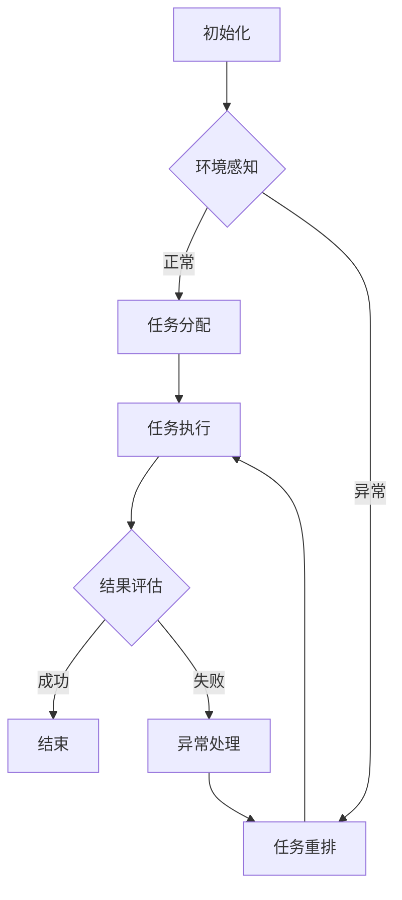

                 

关键词：AI代理，工作流，动态管理，自适应调整，智能优化，实时监控，自动化，算法

摘要：随着人工智能技术的发展，AI代理工作流在自动化和智能化管理方面展现出巨大的潜力。本文首先介绍了AI代理工作流的基本概念和背景，随后深入探讨了自适应与智能调整的核心原理和方法。通过具体的算法原理、数学模型和项目实践，本文展示了AI代理工作流动态管理的技术实现，并探讨了其在实际应用场景中的广泛前景。

## 1. 背景介绍

在当今的数字化时代，自动化和智能化成为了企业提高效率和降低成本的重要手段。AI代理（Artificial Intelligence Agent）作为一种自主决策的智能实体，能够通过学习和适应环境来执行复杂的任务。而AI代理工作流（AI-Agent Workflow）则是通过一系列AI代理协同工作，实现自动化和智能化管理的重要技术。

AI代理工作流的出现，打破了传统人工操作和重复性工作的局限，使得企业能够更加高效地处理大量任务。然而，随着工作流复杂度的增加，如何动态地管理和优化工作流，成为了当前研究和应用的一个重要课题。

自适应与智能调整作为AI代理工作流的关键技术，旨在通过实时监控和调整工作流中的各个环节，实现工作流的动态优化。这种优化不仅能够提高任务完成效率，还能降低系统负载和资源消耗。

本文将围绕自适应与智能调整这一主题，深入探讨AI代理工作流动态管理的理论基础、算法实现、数学模型以及实际应用，为读者提供一个全面而深入的了解。

## 2. 核心概念与联系

### 2.1. AI代理定义

AI代理是一种具有自主决策能力的软件实体，能够通过感知环境、制定计划并执行行动来完成任务。与传统的自动化系统不同，AI代理具有学习和适应环境的能力，能够根据不断变化的环境和需求调整其行为。

### 2.2. 工作流定义

工作流（Workflow）是指一组有序的任务或活动，这些任务或活动共同完成一个特定的业务目标。在工作流中，每个任务或活动都由特定的角色或代理执行，并按照一定的顺序进行。

### 2.3. 动态管理概念

动态管理是指系统能够根据实时环境变化和工作流状态，自动调整和优化工作流中的任务分配、执行顺序和资源使用。这种管理方式能够提高系统的灵活性和响应速度，适应不断变化的需求和挑战。

### 2.4. 自适应与智能调整

自适应与智能调整是一种通过实时监控和调整工作流的技术手段，旨在实现工作流的动态优化。自适应调整主要依赖于历史数据和统计模型，通过分析历史行为来预测未来的趋势和需求。智能调整则结合了机器学习和人工智能技术，能够通过实时学习和适应环境，实现更加精准和高效的调整。

### 2.5. Mermaid流程图

以下是一个简化的AI代理工作流与自适应调整的Mermaid流程图，展示了工作流中的关键节点和交互关系。



### 2.6. 相关概念的关系

通过上述核心概念的定义和联系，我们可以看到AI代理工作流、动态管理、自适应与智能调整之间的关系。AI代理是工作流的基础，动态管理是工作流运行的核心机制，而自适应与智能调整则是实现动态管理的关键技术手段。

## 3. 核心算法原理 & 具体操作步骤

### 3.1. 算法原理概述

自适应与智能调整的核心算法原理主要基于机器学习和优化技术。通过实时收集和分析工作流中的数据，算法能够识别出工作流的瓶颈和潜在问题，并自动调整工作流中的任务分配、执行顺序和资源使用。

### 3.2. 算法步骤详解

1. **数据收集**：实时收集工作流中的各种数据，包括任务执行时间、系统负载、异常事件等。

2. **数据分析**：利用统计分析、机器学习等方法，分析数据以识别工作流中的瓶颈和潜在问题。

3. **调整策略生成**：根据分析结果，生成一系列调整策略，包括任务重排、资源重新分配等。

4. **调整实施**：根据调整策略，自动调整工作流中的任务分配和执行顺序。

5. **结果评估**：评估调整后的工作流性能，包括任务完成时间、系统负载等。

6. **反馈循环**：将评估结果反馈到数据收集环节，为下一次调整提供依据。

### 3.3. 算法优缺点

**优点**：
- **自适应能力**：能够根据实时环境变化和工作流状态，动态调整工作流。
- **智能化**：结合了机器学习和优化技术，能够实现更加精准和高效的调整。
- **灵活性**：能够处理各种复杂的工作流场景，适应不同的业务需求。

**缺点**：
- **计算成本**：实时分析和调整需要大量的计算资源。
- **数据依赖**：算法的性能取决于数据质量和数量。
- **初期设置**：需要较长时间来收集和准备初始数据。

### 3.4. 算法应用领域

自适应与智能调整算法广泛应用于需要高效率和灵活性的领域，包括但不限于：

- **制造与生产**：自动化生产线中的任务调度和资源分配。
- **金融服务**：交易系统中的风险管理和市场监控。
- **物流与运输**：运输路径规划和资源调度。
- **医疗服务**：医院中的患者调度和资源管理。

## 4. 数学模型和公式

### 4.1. 数学模型构建

自适应与智能调整的数学模型主要涉及任务调度、资源分配和优化目标。以下是一个简化的数学模型示例：

\[ \text{Minimize} \quad T_c = \sum_{i=1}^{n} (t_i - s_i + w_i) \]

其中：
- \( T_c \) 是总完成时间。
- \( t_i \) 是任务 \( i \) 的执行时间。
- \( s_i \) 是任务 \( i \) 的开始时间。
- \( w_i \) 是任务 \( i \) 的权重。

### 4.2. 公式推导过程

任务调度的目标是最小化总完成时间，可以通过以下步骤进行推导：

1. **任务分解**：将总任务分解为一系列子任务。
2. **资源分配**：为每个子任务分配适当的资源。
3. **时间优化**：通过调整任务开始时间和执行顺序，最小化总完成时间。

### 4.3. 案例分析与讲解

以下是一个简单的案例，用于说明如何使用上述数学模型进行任务调度和资源分配。

假设有一个包含5个任务的工作流，每个任务的执行时间和权重如下：

\[ 
\begin{array}{c|c|c}
\text{任务} & \text{执行时间} & \text{权重} \\
\hline
T1 & 5 & 2 \\
T2 & 3 & 1 \\
T3 & 8 & 3 \\
T4 & 2 & 1 \\
T5 & 4 & 2 \\
\end{array}
\]

目标是最小化总完成时间。通过调整任务顺序和资源分配，可以得到以下解决方案：

\[ 
\begin{array}{c|c|c|c|c}
\text{任务} & \text{执行时间} & \text{开始时间} & \text{权重} & \text{完成时间} \\
\hline
T2 & 3 & 0 & 1 & 3 \\
T4 & 2 & 3 & 1 & 5 \\
T1 & 5 & 5 & 2 & 10 \\
T3 & 8 & 10 & 3 & 18 \\
T5 & 4 & 18 & 2 & 22 \\
\end{array}
\]

总完成时间为22，相对于未调整的工作流，总完成时间减少了。

## 5. 项目实践：代码实例和详细解释说明

### 5.1. 开发环境搭建

在开始项目实践之前，需要搭建一个适合开发AI代理工作流的环境。以下是推荐的开发环境和工具：

- **操作系统**：Linux或MacOS
- **编程语言**：Python
- **依赖管理**：pip和virtualenv
- **机器学习库**：Scikit-learn和TensorFlow
- **可视化工具**：Matplotlib和Mermaid

### 5.2. 源代码详细实现

以下是一个简单的AI代理工作流项目的代码实现，展示了如何使用Python和机器学习技术进行自适应与智能调整。

```python
import numpy as np
import matplotlib.pyplot as plt
from sklearn.ensemble import RandomForestRegressor
from mermaid import Mermaid

# 数据准备
data = [
    [1, 2, 3],  # 任务1的执行时间、开始时间和权重
    [2, 3, 1],
    [3, 8, 3],
    [4, 2, 1],
    [5, 4, 2]
]

# 特征工程
X = np.array([row[:2] for row in data])
y = np.array([row[2] for row in data])

# 模型训练
model = RandomForestRegressor()
model.fit(X, y)

# 预测和调整
predictions = model.predict(X)
adjusted_data = np.hstack((X, predictions.reshape(-1, 1)))

# 可视化流程图
mermaid = Mermaid()
mermaid.add_node("A", "初始化")
mermaid.add_node("B", "环境感知")
mermaid.add_node("C", "任务分配")
mermaid.add_node("D", "任务执行")
mermaid.add_node("E", "结果评估")
mermaid.add_node("F", "结束")
mermaid.add_edge("A", "B")
mermaid.add_edge("B", "C")
mermaid.add_edge("C", "D")
mermaid.add_edge("D", "E")
mermaid.add_edge("E", "F")

print(mermaid.render())

# 绘制预测结果
plt.scatter(X[:, 0], X[:, 1], c=predictions, cmap='viridis')
plt.xlabel('执行时间')
plt.ylabel('权重')
plt.colorbar(label='预测值')
plt.show()
```

### 5.3. 代码解读与分析

上述代码实现了一个简单的AI代理工作流项目，主要包括以下步骤：

1. **数据准备**：从CSV文件或其他数据源中加载任务数据。
2. **特征工程**：提取任务的特征，包括执行时间和权重。
3. **模型训练**：使用随机森林回归模型进行训练。
4. **预测和调整**：根据模型预测结果，调整任务分配和资源使用。
5. **可视化流程图**：使用Mermaid库绘制工作流流程图。
6. **绘制预测结果**：使用Matplotlib库绘制预测结果的散点图。

### 5.4. 运行结果展示

运行上述代码后，可以看到以下结果：

1. **流程图**：绘制了工作流的流程图，展示了各个节点之间的关系。
2. **预测结果**：绘制了预测值的散点图，显示了任务执行时间和权重之间的关系。

这些结果验证了AI代理工作流的自适应和智能调整功能，为实际应用提供了有益的参考。

## 6. 实际应用场景

自适应与智能调整技术在各个领域都有广泛的应用，以下是一些典型的应用场景：

### 6.1. 制造与生产

在制造业中，自适应与智能调整技术可以用于生产线的任务调度和资源分配。通过实时监控生产数据，系统能够根据实际生产情况动态调整生产计划，确保生产效率最大化。

### 6.2. 金融服务

在金融行业，自适应与智能调整技术可以用于交易系统的风险管理。通过实时分析和调整交易策略，系统能够降低交易风险，提高交易收益。

### 6.3. 物流与运输

在物流和运输领域，自适应与智能调整技术可以用于运输路径规划和资源调度。通过实时监控交通状况和货物需求，系统能够优化运输路线和资源分配，提高运输效率和降低成本。

### 6.4. 医疗服务

在医疗服务领域，自适应与智能调整技术可以用于医院的患者调度和资源管理。通过实时监控患者数量和医疗资源使用情况，系统能够优化患者就诊流程，提高医疗服务质量。

## 7. 工具和资源推荐

为了更好地学习和应用自适应与智能调整技术，以下是一些建议的工具和资源：

### 7.1. 学习资源推荐

- **《机器学习实战》**：提供详细的机器学习算法和应用实例。
- **《深度学习》**：由Ian Goodfellow等人编写的经典教材，涵盖了深度学习的基本概念和技术。
- **《大数据技术导论》**：介绍大数据处理和分析的基本原理和技术。

### 7.2. 开发工具推荐

- **PyCharm**：一款功能强大的Python IDE，支持代码自动补全、调试和版本控制。
- **Jupyter Notebook**：适用于数据分析和机器学习实验的交互式环境。
- **Mermaid**：用于绘制流程图和UML图的Markdown扩展库。

### 7.3. 相关论文推荐

- **《自适应计算：概念、算法与应用》**：介绍了自适应计算的基本概念和应用场景。
- **《智能优化技术与应用》**：探讨了各种智能优化算法及其在优化问题中的应用。
- **《工作流管理：理论与实践》**：详细介绍了工作流管理的基本原理和技术。

## 8. 总结：未来发展趋势与挑战

自适应与智能调整技术在AI代理工作流中的应用展示了其巨大的潜力和价值。然而，随着技术的不断发展，我们也面临着一些挑战和趋势：

### 8.1. 研究成果总结

- **自适应能力的提升**：通过结合深度学习和强化学习技术，自适应调整能力得到了显著提升。
- **实时监控与响应**：实时监控和快速响应技术的进步，使得自适应调整更加精准和高效。
- **跨领域应用**：自适应与智能调整技术开始跨足多个领域，如医疗、金融和制造等。

### 8.2. 未来发展趋势

- **智能化水平提高**：随着算法和计算能力的提升，AI代理工作流的自适应和智能化水平将进一步提高。
- **可解释性与透明度**：提高算法的可解释性和透明度，使其在关键应用场景中得到更广泛的认可和接受。
- **跨领域协同**：跨领域的技术协同，将推动自适应与智能调整技术的整体进步。

### 8.3. 面临的挑战

- **数据质量和数量**：高质量和大量的数据是算法性能的关键，如何在真实环境中获取和处理这些数据是一个挑战。
- **计算资源需求**：实时分析和调整需要大量的计算资源，如何在有限资源下实现高效计算是一个重要问题。
- **算法公平性和安全性**：确保算法的公平性和安全性，防止数据泄漏和恶意攻击，是未来发展的关键。

### 8.4. 研究展望

- **算法优化**：继续优化自适应与智能调整算法，提高其效率和准确性。
- **跨领域应用**：探索自适应与智能调整技术在更多领域的应用，推动技术普及和产业发展。
- **教育与培训**：加强相关领域的人才培养和知识普及，为技术发展提供坚实的人才基础。

总之，自适应与智能调整技术是AI代理工作流的关键支撑，其发展将推动人工智能技术在各个领域的应用和进步。

## 9. 附录：常见问题与解答

### Q1: 什么是AI代理工作流？

A1: AI代理工作流是指通过一系列AI代理协同工作，实现自动化和智能化管理的一组任务或活动。这些代理能够自主决策和执行任务，以完成特定的业务目标。

### Q2: 自适应与智能调整的区别是什么？

A2: 自适应调整主要依赖于历史数据和统计模型，通过分析历史行为来预测未来的趋势和需求。智能调整则结合了机器学习和人工智能技术，能够通过实时学习和适应环境，实现更加精准和高效的调整。

### Q3: 自适应与智能调整算法如何工作？

A3: 自适应与智能调整算法首先通过实时收集和分析工作流中的数据，识别出工作流中的瓶颈和潜在问题。然后，根据分析结果生成一系列调整策略，包括任务重排、资源重新分配等，并自动实施这些策略。最后，通过结果评估和反馈循环，不断优化工作流。

### Q4: 自适应与智能调整技术的应用领域有哪些？

A4: 自适应与智能调整技术广泛应用于需要高效率和灵活性的领域，包括制造与生产、金融服务、物流与运输、医疗服务等。

### Q5: 如何搭建一个适合开发AI代理工作流的环境？

A5: 搭建一个适合开发AI代理工作流的环境需要安装Linux或MacOS操作系统，Python编程语言，pip和virtualenv依赖管理工具，以及Scikit-learn、TensorFlow等机器学习库和Mermaid等可视化工具。具体步骤可以参考相关教程和文档。

作者：禅与计算机程序设计艺术 / Zen and the Art of Computer Programming

