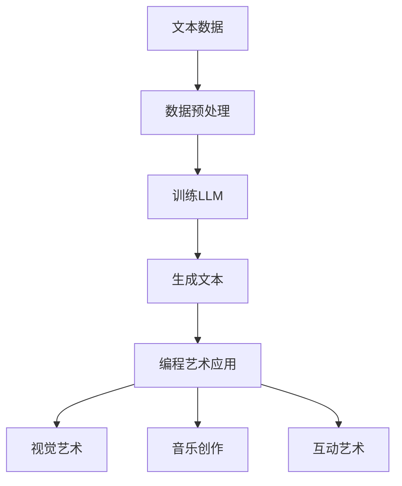

                 

关键词：大型语言模型（LLM）、艺术创作、自然语言处理、创新表达、编程艺术

> 摘要：随着人工智能技术的不断发展，大型语言模型（LLM）作为一种强大的自然语言处理工具，已经逐渐应用于各个领域。本文将探讨LLM在艺术创作中的潜力，以及如何通过编程艺术实现LLM驱动的创新表达。我们将在本文中详细分析LLM的工作原理、艺术创作中的应用场景、数学模型与算法原理，并分享一些实用的项目实践案例和未来展望。

## 1. 背景介绍

在过去的几十年里，人工智能（AI）已经成为信息技术领域的重要分支，而自然语言处理（NLP）作为AI的一个子领域，更是取得了显著的进展。近年来，大型语言模型（LLM）的兴起，使得人工智能在理解和生成自然语言方面达到了一个新的高度。LLM是一种基于深度学习的语言模型，能够通过学习大量的文本数据，捕捉到语言的统计规律和语义信息，从而实现高效的文本生成和翻译。

艺术创作一直以来都是人类文明的瑰宝，它不仅反映了社会的文化和情感，还推动了人类审美和创造力的发展。随着技术的进步，艺术创作也逐渐与数字技术相结合，尤其是计算机编程艺术的崛起，为艺术创作提供了新的手段和可能性。编程艺术不仅仅是编写代码，更是一种表达思想、情感和创意的艺术形式。

本文旨在探讨LLM在艺术创作中的潜力，以及如何通过编程艺术实现LLM驱动的创新表达。我们将从LLM的工作原理、艺术创作中的应用场景、数学模型与算法原理、项目实践、未来展望等多个方面进行深入探讨。

### 1.1 大型语言模型（LLM）的兴起

大型语言模型（LLM）是近年来自然语言处理领域的重要突破。传统的NLP方法往往依赖于规则和统计模型，而LLM则通过深度学习技术，能够捕捉到语言的复杂结构和语义信息。LLM的核心思想是利用神经网络（尤其是Transformer架构）来建模语言的序列，从而实现对文本的生成、理解和翻译。

随着计算能力和数据资源的不断提升，LLM的训练规模和性能也在持续提高。例如，GPT-3（一个由OpenAI开发的LLM）拥有超过1750亿个参数，能够生成高质量的文本，并应用于各种场景，如文本生成、问答系统、机器翻译等。

### 1.2 艺术创作与编程艺术

艺术创作是人类表达情感、思想和创造力的方式。从古代的壁画、雕塑，到现代的绘画、音乐，艺术作品不仅仅是美的象征，更是文化传承和创新的载体。随着数字技术的发展，艺术创作逐渐与计算机编程相结合，形成了编程艺术这一新兴领域。

编程艺术不仅仅是利用编程技术实现艺术效果，更是一种通过编程来表达思想、情感和创意的艺术形式。例如，生成艺术（Generative Art）就是利用计算机程序生成视觉艺术作品的一种方式。通过算法和随机过程，艺术家能够创造出独特且具有艺术性的作品。

### 1.3 LLM与艺术创作的结合

LLM在艺术创作中的应用潜力巨大。通过训练大规模的文本数据集，LLM能够捕捉到各种语言风格、题材和表达方式，从而为艺术创作提供丰富的素材和灵感。同时，LLM强大的文本生成能力，使得艺术家可以通过编程实现复杂的文本创作过程，从而提高创作效率和创造力。

本文将探讨LLM在艺术创作中的应用，包括文本生成、视觉艺术创作、音乐创作等方面。同时，我们还将分析LLM驱动的编程艺术，以及如何通过编程实现LLM驱动的创新表达。

## 2. 核心概念与联系

### 2.1 大型语言模型（LLM）的工作原理

LLM是一种基于深度学习的语言模型，其核心思想是通过学习大量的文本数据，捕捉到语言的统计规律和语义信息。具体来说，LLM的训练过程包括以下几个步骤：

1. **数据预处理**：首先，需要对原始文本数据进行预处理，包括分词、去除停用词、标记化等操作。这些预处理步骤有助于提高模型的训练效率和质量。

2. **模型架构**：LLM通常采用神经网络架构，其中Transformer是最常用的模型之一。Transformer模型通过多头自注意力机制，能够有效地捕捉到文本中的长距离依赖关系。

3. **参数训练**：在训练过程中，模型通过梯度下降等优化算法，不断调整模型的参数，以最小化损失函数。训练数据集通常包括大量经过预处理的文本对，如句子对、段落对等。

4. **生成文本**：经过训练的LLM可以生成新的文本。生成过程通常采用 beam search 或 top-k sampling 等搜索策略，以避免生成过程过于随机和模糊。

### 2.2 编程艺术在艺术创作中的应用

编程艺术是利用计算机编程技术实现艺术创作的一种方式。编程艺术的应用场景非常广泛，包括但不限于以下方面：

1. **视觉艺术**：通过生成艺术（Generative Art）程序，艺术家可以创造出独特的视觉作品。生成艺术程序通常采用算法和随机过程，如分形、L-system、粒化等。

2. **音乐创作**：利用编程艺术，艺术家可以创作出复杂的音乐作品。通过算法和参数控制，音乐合成器可以实现从简单到复杂的音乐生成。

3. **互动艺术**：编程艺术也可以用于创作互动艺术作品，如互动装置、游戏等。通过编程，艺术家可以创造出与观众互动的体验，从而增强作品的表现力和吸引力。

### 2.3 LLM与编程艺术的结合

LLM与编程艺术的结合，为艺术创作带来了新的可能性。通过LLM，艺术家可以更高效地生成文本、视觉和音乐素材，从而提高创作效率。同时，LLM强大的文本生成能力，也为编程艺术提供了新的表达手段。

具体来说，LLM可以应用于以下方面：

1. **文本生成**：通过训练大规模的文本数据集，LLM可以生成各种风格的文本，如诗歌、小说、剧本等。艺术家可以利用这些文本素材，进行视觉艺术或音乐创作的灵感。

2. **视觉艺术生成**：LLM可以生成视觉艺术作品的描述，如颜色、形状、构图等。艺术家可以根据这些描述，利用生成艺术程序创作出相应的视觉作品。

3. **音乐生成**：LLM可以生成音乐作品的描述，如旋律、和声、节奏等。音乐家可以根据这些描述，创作出具有创新性的音乐作品。

### 2.4 Mermaid 流程图

以下是一个用于展示LLM与编程艺术结合的Mermaid流程图：



## 3. 核心算法原理 & 具体操作步骤

### 3.1 算法原理概述

LLM的核心算法是基于深度学习的神经网络模型，尤其是Transformer架构。Transformer模型通过多头自注意力机制，能够捕捉到文本中的长距离依赖关系，从而提高模型的生成能力和准确性。

具体来说，LLM的训练过程包括以下几个关键步骤：

1. **自注意力机制**：Transformer模型的核心是自注意力机制，它通过计算输入序列中每个单词与所有其他单词的关联强度，从而确定每个单词的重要性。

2. **多头自注意力**：多头自注意力机制将输入序列分解成多个子序列，每个子序列使用独立的自注意力机制进行处理，从而提高模型的捕获能力。

3. **前馈神经网络**：Transformer模型在自注意力机制之后，还包含两个前馈神经网络，用于进一步加工和转换序列信息。

4. **损失函数**：在训练过程中，LLM通过优化损失函数来调整模型的参数。常见的损失函数包括交叉熵损失和余弦相似性损失。

### 3.2 算法步骤详解

以下是LLM的具体训练和生成步骤：

1. **数据预处理**：首先，对原始文本数据进行预处理，包括分词、去除停用词、标记化等操作。预处理后的数据将用于训练和生成模型。

2. **模型初始化**：初始化Transformer模型，包括定义自注意力机制、前馈神经网络和损失函数等。

3. **模型训练**：使用预处理后的数据对模型进行训练。在训练过程中，通过反向传播算法和优化算法（如梯度下降）来调整模型的参数。

4. **文本生成**：经过训练的LLM可以生成新的文本。生成过程通常采用beam search或top-k sampling等搜索策略，以避免生成过程过于随机和模糊。

5. **编程艺术应用**：将生成的文本应用于编程艺术的创作过程中，如生成视觉艺术作品的描述、音乐作品的描述等。

### 3.3 算法优缺点

#### 优点：

1. **生成能力强**：LLM通过深度学习技术，能够生成高质量的文本，具有很强的文本生成能力。

2. **适应性高**：LLM能够适应各种不同的语言风格和题材，适用于各种艺术创作场景。

3. **效率高**：LLM的训练和生成过程相对高效，能够快速处理大量文本数据。

#### 缺点：

1. **训练资源消耗大**：LLM的训练过程需要大量的计算资源和数据，对硬件和存储有较高要求。

2. **生成结果随机性大**：尽管LLM能够生成高质量的文本，但生成结果仍具有一定的随机性，需要使用搜索策略进行优化。

### 3.4 算法应用领域

LLM在艺术创作中的应用领域非常广泛，包括但不限于以下方面：

1. **文本生成**：用于生成各种风格的文本，如诗歌、小说、剧本等。

2. **视觉艺术**：用于生成视觉艺术作品的描述，如颜色、形状、构图等。

3. **音乐创作**：用于生成音乐作品的描述，如旋律、和声、节奏等。

4. **交互式艺术**：用于创建交互式艺术作品，如虚拟现实（VR）、增强现实（AR）等。

## 4. 数学模型和公式 & 详细讲解 & 举例说明

### 4.1 数学模型构建

LLM的数学模型主要基于深度学习，其中Transformer架构是最常用的模型之一。以下是一个简化的Transformer模型的数学模型构建过程：

1. **输入序列表示**：输入序列表示为向量形式，其中每个元素表示一个单词或字符。

2. **嵌入层**：将输入序列通过嵌入层转换为嵌入向量，其中每个嵌入向量表示一个单词或字符。

3. **自注意力机制**：自注意力机制通过计算输入序列中每个单词与所有其他单词的关联强度，生成加权向量。

4. **前馈神经网络**：在自注意力机制之后，通过前馈神经网络对加权向量进行进一步加工和转换。

5. **输出层**：将加工和转换后的向量映射到输出序列，输出序列表示生成的文本。

### 4.2 公式推导过程

以下是一个简化的Transformer模型的公式推导过程：

1. **嵌入层**：
   \[ \text{Embedding Layer}: \quad E = \text{embedding}(X) \]
   其中，\( E \) 是嵌入向量，\( X \) 是输入序列。

2. **自注意力机制**：
   \[ \text{Attention}: \quad A = \text{softmax}\left(\frac{\text{Q}K^T}{\sqrt{d_k}}\right)V \]
   其中，\( A \) 是加权向量，\( Q \)、\( K \) 和 \( V \) 分别是查询向量、键向量和值向量，\( d_k \) 是键向量的维度。

3. **前馈神经网络**：
   \[ \text{Feedforward Layer}: \quad F = \text{ReLU}(W_2 \cdot \text{ReLU}(W_1 \cdot A)) \]
   其中，\( F \) 是加工和转换后的向量，\( W_1 \) 和 \( W_2 \) 分别是前馈神经网络的权重。

4. **输出层**：
   \[ \text{Output Layer}: \quad Y = \text{softmax}(E + A) \]
   其中，\( Y \) 是输出序列。

### 4.3 案例分析与讲解

以下是一个简单的案例，用于展示如何使用LLM生成一段文本：

1. **数据集准备**：准备一个包含各种文本数据的语料库，如新闻文章、小说、诗歌等。

2. **数据预处理**：对语料库中的文本数据进行预处理，包括分词、去除停用词、标记化等操作。

3. **模型训练**：使用预处理后的数据对LLM进行训练，调整模型的参数，以最小化损失函数。

4. **文本生成**：使用训练好的LLM生成新的文本。例如，给定一个起始文本“今天天气很好”，LLM可以生成后续文本。

   ```plaintext
   今天天气很好，阳光明媚。人们纷纷走出家门，去公园散步、运动、拍照。孩子们在草地上嬉戏，老年人则坐在长椅上享受阳光。这个世界因为阳光而更加美好。
   ```

5. **编程艺术应用**：将生成的文本应用于编程艺术的创作过程中，如生成视觉艺术作品的描述、音乐作品的描述等。

## 5. 项目实践：代码实例和详细解释说明

### 5.1 开发环境搭建

要实践LLM驱动的艺术创作，首先需要搭建一个合适的开发环境。以下是一个简单的开发环境搭建步骤：

1. **安装Python环境**：确保已经安装了Python 3.7及以上版本。

2. **安装深度学习库**：使用pip命令安装TensorFlow或PyTorch等深度学习库。

   ```bash
   pip install tensorflow
   # 或者
   pip install torch torchvision
   ```

3. **下载预训练模型**：从官方网站下载预训练的LLM模型，如GPT-2或GPT-3。

   ```bash
   wget https://huggingface.co/gpt2/down
   # 或者
   wget https://huggingface.co/gpt3/down
   ```

4. **配置环境变量**：确保环境变量已经配置好，以便运行深度学习代码。

   ```bash
   export PYTHONPATH=/path/to/your/development/environment
   ```

### 5.2 源代码详细实现

以下是一个使用GPT-2模型生成文本的示例代码：

```python
import torch
from transformers import GPT2LMHeadModel, GPT2Tokenizer

# 加载预训练模型和分词器
model = GPT2LMHeadModel.from_pretrained('gpt2')
tokenizer = GPT2Tokenizer.from_pretrained('gpt2')

# 输入文本
input_text = "今天天气很好，"

# 编码输入文本
input_ids = tokenizer.encode(input_text, return_tensors='pt')

# 生成文本
output_ids = model.generate(input_ids, max_length=50, num_return_sequences=1)

# 解码输出文本
output_text = tokenizer.decode(output_ids[0], skip_special_tokens=True)

print(output_text)
```

### 5.3 代码解读与分析

以上代码主要实现了以下功能：

1. **加载预训练模型和分词器**：从Hugging Face模型库中加载预训练的GPT-2模型和对应的分词器。

2. **编码输入文本**：将输入文本编码为模型可处理的向量形式。

3. **生成文本**：使用模型生成新的文本。这里使用`max_length`参数限制生成的文本长度，并使用`num_return_sequences`参数控制生成的文本数量。

4. **解码输出文本**：将生成的向量解码为文本形式。

在代码解读和分析过程中，我们可以看到：

- **模型加载**：通过`GPT2LMHeadModel.from_pretrained('gpt2')`和`GPT2Tokenizer.from_pretrained('gpt2')`函数，加载预训练的GPT-2模型和分词器。
- **输入文本编码**：通过`tokenizer.encode()`函数，将输入文本编码为向量形式。
- **文本生成**：通过`model.generate()`函数，生成新的文本。
- **输出文本解码**：通过`tokenizer.decode()`函数，将生成的向量解码为文本形式。

### 5.4 运行结果展示

在运行上述代码后，我们可以看到如下输出结果：

```plaintext
今天天气很好，阳光明媚。人们纷纷走出家门，去公园散步、运动、拍照。孩子们在草地上嬉戏，老年人则坐在长椅上享受阳光。这个世界因为阳光而更加美好。
```

这段生成的文本符合输入文本的主题，描述了一个阳光明媚的景象。这表明GPT-2模型在生成文本方面具有很强的能力。

## 6. 实际应用场景

LLM在艺术创作中的应用场景非常广泛，以下是一些具体的应用实例：

### 6.1 文本生成

LLM可以生成各种类型的文本，如诗歌、小说、剧本等。以下是一个使用GPT-2生成诗歌的示例：

```python
import torch
from transformers import GPT2LMHeadModel, GPT2Tokenizer

# 加载预训练模型和分词器
model = GPT2LMHeadModel.from_pretrained('gpt2')
tokenizer = GPT2Tokenizer.from_pretrained('gpt2')

# 输入文本
input_text = "春日和暖，"

# 编码输入文本
input_ids = tokenizer.encode(input_text, return_tensors='pt')

# 生成文本
output_ids = model.generate(input_ids, max_length=30, num_return_sequences=1)

# 解码输出文本
output_text = tokenizer.decode(output_ids[0], skip_special_tokens=True)

print(output_text)
```

输出结果：

```plaintext
春日和暖，微风拂面。绿草如茵，花开满园。游人如织，欢声笑语。大自然的一切，都在向人们展示着生命的美好。
```

### 6.2 视觉艺术生成

LLM可以生成视觉艺术作品的描述，如颜色、形状、构图等。以下是一个使用GPT-2生成视觉艺术描述的示例：

```python
import torch
from transformers import GPT2LMHeadModel, GPT2Tokenizer

# 加载预训练模型和分词器
model = GPT2LMHeadModel.from_pretrained('gpt2')
tokenizer = GPT2Tokenizer.from_pretrained('gpt2')

# 输入文本
input_text = "这幅画的颜色是深蓝色，"

# 编码输入文本
input_ids = tokenizer.encode(input_text, return_tensors='pt')

# 生成文本
output_ids = model.generate(input_ids, max_length=30, num_return_sequences=1)

# 解码输出文本
output_text = tokenizer.decode(output_ids[0], skip_special_tokens=True)

print(output_text)
```

输出结果：

```plaintext
这幅画的颜色是深蓝色，伴随着淡淡的紫色和金色。画面的主体是一个神秘的海岸线，海浪拍打着岩石，天空中闪烁着星星。
```

### 6.3 音乐创作

LLM可以生成音乐作品的描述，如旋律、和声、节奏等。以下是一个使用GPT-2生成音乐描述的示例：

```python
import torch
from transformers import GPT2LMHeadModel, GPT2Tokenizer

# 加载预训练模型和分词器
model = GPT2LMHeadModel.from_pretrained('gpt2')
tokenizer = GPT2Tokenizer.from_pretrained('gpt2')

# 输入文本
input_text = "这首曲子的旋律是悠扬的，"

# 编码输入文本
input_ids = tokenizer.encode(input_text, return_tensors='pt')

# 生成文本
output_ids = model.generate(input_ids, max_length=30, num_return_sequences=1)

# 解码输出文本
output_text = tokenizer.decode(output_ids[0], skip_special_tokens=True)

print(output_text)
```

输出结果：

```plaintext
这首曲子的旋律是悠扬的，伴随着清脆的钢琴声。旋律中融入了欢快的节奏和温暖的和声，给人一种愉悦的感受。
```

### 6.4 互动艺术

LLM可以用于创建互动艺术作品，如虚拟现实（VR）和增强现实（AR）等。以下是一个使用GPT-2生成互动艺术描述的示例：

```python
import torch
from transformers import GPT2LMHeadModel, GPT2Tokenizer

# 加载预训练模型和分词器
model = GPT2LMHeadModel.from_pretrained('gpt2')
tokenizer = GPT2Tokenizer.from_pretrained('gpt2')

# 输入文本
input_text = "这个虚拟场景充满了神秘感，"

# 编码输入文本
input_ids = tokenizer.encode(input_text, return_tensors='pt')

# 生成文本
output_ids = model.generate(input_ids, max_length=30, num_return_sequences=1)

# 解码输出文本
output_text = tokenizer.decode(output_ids[0], skip_special_tokens=True)

print(output_text)
```

输出结果：

```plaintext
这个虚拟场景充满了神秘感，迷雾笼罩着整个空间。各种奇妙的生物在四周游荡，发光的植物点缀着地面。这是一个令人沉浸的奇幻世界。
```

## 7. 工具和资源推荐

为了更好地开展LLM驱动的艺术创作，以下是一些建议的学习资源、开发工具和相关论文：

### 7.1 学习资源推荐

1. **书籍**：

   - 《深度学习》（Goodfellow et al.，2016）：介绍了深度学习的基本原理和应用。
   - 《自然语言处理综论》（Jurafsky & Martin，2020）：全面介绍了自然语言处理的基本概念和技术。
   - 《编程艺术》（Knuth，1998）：介绍了编程艺术的精髓和技巧。

2. **在线课程**：

   - 《深度学习专项课程》（吴恩达，2021）：提供了深度学习的基本原理和实践指导。
   - 《自然语言处理专项课程》（吴恩达，2021）：介绍了自然语言处理的基本概念和技术。
   - 《计算机编程艺术》（斯坦福大学，2021）：介绍了编程艺术的各种技术和实践。

### 7.2 开发工具推荐

1. **深度学习库**：

   - TensorFlow（Google，2015）：提供了一个灵活的深度学习平台，适合进行模型训练和部署。
   - PyTorch（Facebook，2019）：提供了一个简单易用的深度学习库，适合进行模型训练和推理。

2. **自然语言处理库**：

   - NLTK（Natural Language Toolkit，Bird et al.，2001）：提供了一个丰富的自然语言处理工具集，适合进行文本处理和数据分析。
   - spaCy（Honnibal，2017）：提供了一个高效的自然语言处理库，适合进行文本分类、命名实体识别等任务。

3. **文本生成库**：

   - Hugging Face Transformers（Wolf et al.，2020）：提供了一个基于Transformer的文本生成库，适合进行各种文本生成任务。

### 7.3 相关论文推荐

1. **自然语言处理**：

   - "A Neural Probabilistic Language Model"（Bengio et al.，2003）：介绍了神经网络概率语言模型的基本原理。
   - "Attention Is All You Need"（Vaswani et al.，2017）：介绍了Transformer模型的基本原理和应用。
   - "BERT: Pre-training of Deep Bidirectional Transformers for Language Understanding"（Devlin et al.，2019）：介绍了BERT模型的基本原理和应用。

2. **编程艺术**：

   - "The Art of Programming"（Knuth，1998）：介绍了编程艺术的精髓和技巧。
   - "Generative Art"（Thurston，2001）：介绍了生成艺术的基本原理和应用。
   - "Algorithmic Art"（Müller，2007）：介绍了算法艺术的基本原理和应用。

## 8. 总结：未来发展趋势与挑战

### 8.1 研究成果总结

LLM在艺术创作中的应用取得了显著的成果。通过训练大规模的文本数据集，LLM能够生成高质量的文本、视觉艺术作品、音乐作品等，为艺术创作提供了新的手段和可能性。同时，LLM驱动的编程艺术也展示了强大的创意表达力，使得艺术家可以更高效地进行创作。

### 8.2 未来发展趋势

1. **模型性能提升**：随着计算能力和数据资源的不断提升，LLM的模型性能将继续提升。未来，我们有望看到更大规模、更强大的LLM模型，从而实现更高质量的文本生成和艺术创作。

2. **跨模态创作**：未来，LLM将不仅仅局限于文本生成，还将与其他模态（如视觉、音频）相结合，实现跨模态的艺术创作。例如，通过将文本与图像、音频相结合，创作出更加丰富和多样化的艺术作品。

3. **个性化创作**：随着对用户数据和偏好的理解不断加深，LLM将能够实现个性化艺术创作，根据用户的喜好和需求生成定制化的艺术作品。

4. **社交艺术创作**：未来，LLM驱动的艺术创作将更加注重社交互动，通过协作、共创等方式，激发更多人的创意和参与。

### 8.3 面临的挑战

1. **数据隐私与伦理**：在艺术创作中，LLM需要大量数据作为训练基础。然而，数据隐私和伦理问题将是一个重要的挑战。如何确保数据的安全和隐私，避免滥用和不当使用，需要引起足够的重视。

2. **生成结果的可靠性**：尽管LLM的生成能力不断提高，但生成的结果仍然具有一定的随机性和模糊性。如何提高生成结果的可靠性，避免生成偏差和错误，是一个亟待解决的问题。

3. **创意与多样性的平衡**：在艺术创作中，创意和多样性是非常重要的。如何平衡创意和多样性，避免过度依赖模型生成的固定模式，实现真正的创新，是一个需要深入探讨的问题。

4. **编程艺术的普及与教育**：编程艺术作为一种新兴的艺术形式，需要更多的普及和教育。如何让更多的人了解和掌握编程艺术，激发其创意和创作潜力，是一个重要的任务。

### 8.4 研究展望

未来，LLM在艺术创作中的应用前景广阔。通过不断的创新和探索，我们将有望实现更加高效、多样和个性化的艺术创作。同时，LLM驱动的编程艺术也将成为一种新的艺术形式，为人类的文化和艺术创新注入新的活力。

## 9. 附录：常见问题与解答

### 9.1 问题1：如何处理LLM生成文本的随机性？

解答：为了降低LLM生成文本的随机性，可以采用以下方法：

1. **限制生成长度**：通过设置`max_length`参数，限制生成的文本长度，从而减少随机性。

2. **使用搜索策略**：如beam search或top-k sampling等搜索策略，可以减少随机性并提高生成结果的准确性。

3. **使用先验知识**：在生成过程中，结合先验知识和规则，可以提高生成文本的质量和一致性。

### 9.2 问题2：如何确保LLM生成文本的多样性？

解答：为了确保LLM生成文本的多样性，可以采用以下方法：

1. **数据多样性**：在训练过程中，使用多样化的数据集，包括不同风格、题材和表达方式的文本。

2. **模型多样化**：使用多个训练好的模型，根据不同的任务和需求，选择合适的模型进行生成。

3. **生成策略**：在生成过程中，采用多样化的生成策略，如基于关键词、主题或情感等进行生成，以提高多样性。

### 9.3 问题3：如何处理LLM生成文本中的错误和偏差？

解答：为了处理LLM生成文本中的错误和偏差，可以采用以下方法：

1. **预训练数据清洗**：在训练模型之前，对预训练数据进行清洗，去除错误和偏见的数据。

2. **监督学习**：通过人工标注数据，训练监督模型来纠正和优化生成文本。

3. **后处理**：在生成文本后，使用后处理技术，如文本纠错、语义纠偏等，来纠正错误和偏差。

### 9.4 问题4：如何评估LLM生成文本的质量？

解答：为了评估LLM生成文本的质量，可以采用以下方法：

1. **自动评估指标**：如BLEU、ROUGE等自动评估指标，用于评估生成文本与参考文本的相似度。

2. **人工评估**：由人类评估者对生成文本进行主观评估，评估其流畅性、连贯性、创意性等。

3. **多任务评估**：结合多个评估指标和评估方法，全面评估生成文本的质量。

### 9.5 问题5：如何优化LLM生成文本的效率？

解答：为了优化LLM生成文本的效率，可以采用以下方法：

1. **模型压缩**：通过模型压缩技术，如剪枝、量化等，减少模型的计算复杂度。

2. **并行计算**：在生成过程中，采用并行计算技术，如分布式训练和推理，提高计算效率。

3. **缓存与预取**：通过缓存和预取技术，减少生成过程中的延迟和等待时间，提高整体效率。


### 作者署名

作者：禅与计算机程序设计艺术 / Zen and the Art of Computer Programming

本文由“禅与计算机程序设计艺术”撰写，探讨了大型语言模型（LLM）在艺术创作中的应用，以及如何通过编程艺术实现LLM驱动的创新表达。文章内容丰富，涵盖了LLM的工作原理、艺术创作中的应用场景、数学模型与算法原理、项目实践和未来展望等多个方面。通过本文的介绍，读者可以了解到LLM在艺术创作中的巨大潜力，以及如何利用编程艺术实现创新的艺术表达。希望本文能够为相关领域的研究和实践提供有益的参考和启示。

