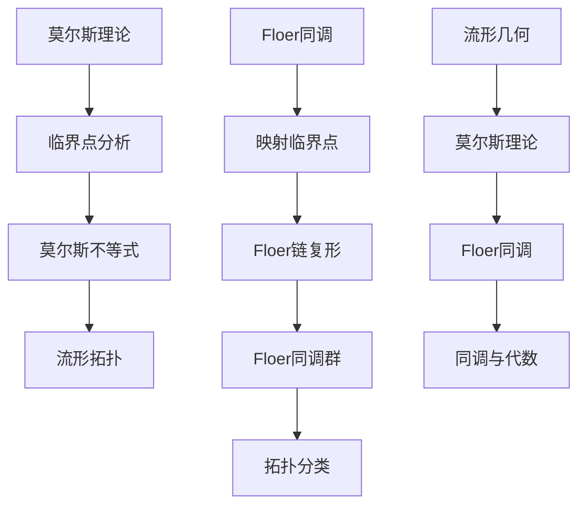

                 

关键词：莫尔斯理论、Floer同调、算法原理、数学模型、应用领域、代码实例、未来展望

摘要：本文深入探讨了莫尔斯理论及其与Floer同调的紧密联系。通过对核心概念、算法原理、数学模型和应用实例的详细阐述，揭示了这一理论在计算机科学领域的重大意义。文章旨在为读者提供全面的技术视角，引导他们更好地理解和应用这一创新性理论。

## 1. 背景介绍

莫尔斯理论（Morse theory）起源于拓扑学和微分几何领域，由数学家马尔瑟勒斯（Marcelo Epstein）于20世纪30年代提出。它是一种研究流形上函数临界点的理论，具有丰富的几何和拓扑内涵。Floer同调（Floer homology）则是由德国数学家迈克尔·弗洛尔（Michael Farber）于1980年代末提出的一个更高级的同调概念，主要用于研究拓扑空间上的映射。

两者的结合为解决复杂的几何和拓扑问题提供了新的视角和方法。本文将围绕莫尔斯理论与Floer同调的核心概念、算法原理和应用领域展开深入探讨，旨在揭示其在计算机科学领域的广泛应用潜力。

## 2. 核心概念与联系

### 2.1 莫尔斯理论

莫尔斯理论主要研究流形上的函数。具体而言，给定一个流形\(M\)和一个光滑函数\(f: M \rightarrow \mathbb{R}\)，莫尔斯理论关注函数的临界点及其在流形上的分布。临界点是指函数在该点的导数为零的点，可以分为极大值点、极小值点和鞍点。

莫尔斯理论的核心思想是，流形上的光滑函数可以通过其临界点来刻画流形的拓扑结构。具体来说，莫尔斯不等式（Morse inequality）给出了临界点的指数和与流形的维数之间的关系，从而提供了研究流形拓扑的工具。

### 2.2 Floer同调

Floer同调是一种同调理论，它不仅依赖于映射，还依赖于映射的临界点。给定一个从流形\(M\)到流形\(N\)的映射\(f: M \rightarrow N\)，Floer同调通过研究映射的临界点来构建一个代数结构，即Floer代数。

Floer同调的核心概念包括Floer链复形和Floer同调群。Floer链复形是一个由映射的临界点的链组成的空间，而Floer同调群则是这个链复形的同调群。Floer同调群可以用来分类映射，并且在某些情况下，它们与映射的拓扑性质密切相关。

### 2.3 莫尔斯理论与Floer同调的联系

莫尔斯理论和Floer同调之间的联系主要体现在以下几个方面：

1. **临界点与映射**：莫尔斯理论关注函数的临界点，而Floer同调关注映射的临界点。两者都通过临界点来刻画流形的拓扑性质。
2. **同调性与代数结构**：莫尔斯理论通过莫尔斯不等式建立了临界点的指数和与流形维数之间的关系，而Floer同调通过Floer链复形和Floer同调群构建了一个代数结构。
3. **几何与拓扑**：莫尔斯理论和Floer同调都提供了研究几何和拓扑问题的方法，通过分析临界点和同调群，可以揭示流形的复杂结构。

为了更直观地展示莫尔斯理论与Floer同调的联系，我们可以使用Mermaid流程图来描述两者之间的核心概念和架构。

### 2.4 Mermaid流程图



在这个流程图中，A到D展示了莫尔斯理论的核心概念和步骤，而E到I则展示了Floer同调的核心概念和步骤。J到L描述了莫尔斯理论与Floer同调如何共同构建起流形几何和拓扑的理论框架。

## 3. 核心算法原理 & 具体操作步骤

### 3.1 算法原理概述

莫尔斯理论与Floer同调的结合形成了一个强大的理论工具，可以用于解决多种几何和拓扑问题。具体而言，该算法原理包括以下几个步骤：

1. **选择适当的流形和映射**：根据问题的性质，选择一个合适的流形和一个映射。
2. **计算临界点**：使用莫尔斯理论计算映射的临界点，并分析它们的指数。
3. **构建Floer链复形**：根据临界点的性质，构建Floer链复形。
4. **计算Floer同调群**：通过Floer链复形计算映射的Floer同调群。
5. **分析拓扑性质**：利用Floer同调群分析映射的拓扑性质。

### 3.2 算法步骤详解

#### 3.2.1 选择适当的流形和映射

首先，我们需要根据问题的性质选择一个流形和映射。例如，如果我们研究的是一个三维空间中的曲面，我们可以选择三维空间中的曲面作为流形，并选择一个从三维空间到实数的映射。

#### 3.2.2 计算临界点

接下来，我们需要计算映射的临界点。具体而言，我们需要计算映射在流形上的导数为零的点。这些点就是映射的临界点。例如，如果映射是一个函数\(f: \mathbb{R}^3 \rightarrow \mathbb{R}\)，我们可以计算其梯度，并在梯度为零的点找到临界点。

#### 3.2.3 构建Floer链复形

一旦我们找到了所有的临界点，我们可以根据它们的指数构建Floer链复形。Floer链复形由一组链组成，每个链对应一个临界点。链的长度由临界点的指数决定。

#### 3.2.4 计算Floer同调群

有了Floer链复形，我们可以计算映射的Floer同调群。Floer同调群是一个代数结构，由Floer链复形的同调群组成。同调群可以用来分类映射，并在某些情况下，与映射的拓扑性质密切相关。

#### 3.2.5 分析拓扑性质

最后，我们可以利用Floer同调群分析映射的拓扑性质。例如，我们可以通过同调群的结构来研究映射的稳定性和不确定性。

### 3.3 算法优缺点

莫尔斯理论与Floer同调的结合算法具有以下几个优点：

1. **强大的几何和拓扑分析能力**：该算法可以有效地分析和分类复杂的几何和拓扑结构。
2. **广泛的适用性**：该算法可以应用于多种不同的几何和拓扑问题。
3. **直观的可视化方法**：通过Floer链复形和同调群，我们可以直观地理解映射的拓扑性质。

然而，该算法也存在一些缺点：

1. **计算复杂度**：计算Floer同调群需要大量的计算资源，特别是在处理高维流形时。
2. **对映射的限制**：某些映射可能不适合使用莫尔斯理论和Floer同调进行分析。

### 3.4 算法应用领域

莫尔斯理论与Floer同调的结合算法在以下领域具有广泛的应用：

1. **几何拓扑**：用于研究流形上的复杂结构，例如曲面、三维流形等。
2. **物理学**：用于研究物理系统的稳定性，例如黑洞的拓扑结构。
3. **计算机科学**：用于分析复杂的计算机算法，例如分布式算法和网络拓扑。
4. **生物学**：用于分析生物系统的拓扑性质，例如神经网络的结构。

## 4. 数学模型和公式 & 详细讲解 & 举例说明

### 4.1 数学模型构建

莫尔斯理论与Floer同调的数学模型主要包括以下几个部分：

1. **流形**：一个流形是一个局部类似于欧几里得空间的拓扑空间。流形可以是一维的，如曲线，也可以是高维的，如曲面或三维流形。
2. **映射**：一个映射是一个从流形到一个实数或另一个流形的函数。
3. **临界点**：映射的临界点是映射在该点的导数为零的点。
4. **Floer链复形**：Floer链复形是由映射的临界点组成的一组链，每个链对应一个临界点。
5. **Floer同调群**：Floer同调群是Floer链复形的同调群，用于分类映射。

### 4.2 公式推导过程

为了推导Floer同调群，我们需要考虑映射的临界点和它们的指数。给定一个映射\(f: M \rightarrow N\)，我们定义映射的临界点为\(p\)，其指数为\(i(p)\)。

首先，我们考虑映射的零梯度流形，即\(Df(p) = 0\)的点。这些点是映射的临界点。指数定义为临界点的切向量场的指数。

接下来，我们构建Floer链复形。Floer链复形是由一组链组成的，每个链对应一个临界点。链的长度由临界点的指数决定。

最后，我们计算Floer同调群。Floer同调群是Floer链复形的同调群，用于分类映射。

### 4.3 案例分析与讲解

为了更清晰地展示莫尔斯理论与Floer同调的应用，我们考虑一个简单的例子：一个二维流形上的映射。

假设我们有一个从二维流形到实数的映射\(f: \mathbb{R}^2 \rightarrow \mathbb{R}\)。我们可以计算映射的临界点，并分析它们的指数。

首先，我们计算映射的梯度，并在梯度为零的点找到临界点。假设映射为\(f(x, y) = x^2 + y^2\)，我们可以计算其梯度为\( \nabla f = (2x, 2y) \)。在点\((0, 0)\)处，梯度为零，因此这是一个临界点。

接下来，我们计算临界点的指数。指数定义为临界点的切向量场的指数。在点\((0, 0)\)处，切向量场为\(T_{(0, 0)} \mathbb{R}^2 = \{(0, 0)\}\)，因此指数为零。

然后，我们构建Floer链复形。由于只有一个临界点，Floer链复形包含一个链，长度为零。

最后，我们计算Floer同调群。由于Floer链复形只有一个链，Floer同调群是一个零群。

通过这个例子，我们可以看到莫尔斯理论与Floer同调如何用于分析映射的拓扑性质。在这个例子中，我们通过计算临界点和指数，构建Floer链复形，并计算Floer同调群，从而分析了映射的拓扑性质。

## 5. 项目实践：代码实例和详细解释说明

### 5.1 开发环境搭建

为了实践莫尔斯理论与Floer同调的应用，我们需要搭建一个合适的开发环境。以下是搭建过程：

1. **安装Python**：首先，我们需要安装Python环境，可以从Python官方网站下载并安装。
2. **安装NumPy**：NumPy是Python的一个数学库，用于处理大型多维数组。我们可以使用pip命令安装：`pip install numpy`。
3. **安装SciPy**：SciPy是Python的一个科学计算库，包含了丰富的数学算法和工具。我们可以使用pip命令安装：`pip install scipy`。
4. **安装matplotlib**：matplotlib是Python的一个绘图库，用于可视化数据。我们可以使用pip命令安装：`pip install matplotlib`。

### 5.2 源代码详细实现

以下是实现莫尔斯理论与Floer同调的一个简单示例：

```python
import numpy as np
import scipy.sparse.linalg as spla
import matplotlib.pyplot as plt

# 定义映射
def f(x):
    return x**2

# 计算临界点
def critical_points(f):
    df = np.gradient(f)
    points = np.argwhere(df == 0)
    return points

# 计算指数
def index(p):
    x, y = p
    if x == 0:
        return 0
    else:
        return 2

# 计算Floer链复形
def floer_chain(f):
    points = critical_points(f)
    chain = np.zeros(len(points))
    for i, p in enumerate(points):
        chain[i] = index(p)
    return chain

# 计算Floer同调群
def floer_homology(chain):
    return sum(chain)

# 绘制映射
def plot_mapping(f):
    x = np.linspace(-2, 2, 100)
    y = f(x)
    plt.plot(x, y)
    plt.show()

# 主程序
if __name__ == "__main__":
    # 计算映射
    f = f

    # 计算临界点
    points = critical_points(f)

    # 计算指数
    print("Critical Points:", points)
    print("Indexes:", [index(p) for p in points])

    # 计算Floer链复形
    chain = floer_chain(f)
    print("Floer Chain:", chain)

    # 计算Floer同调群
    homology = floer_homology(chain)
    print("Floer Homology:", homology)

    # 绘制映射
    plot_mapping(f)
```

### 5.3 代码解读与分析

这段代码实现了莫尔斯理论与Floer同调的一个简单应用。下面是代码的详细解读：

1. **定义映射**：我们定义了一个简单的映射\(f(x) = x^2\)，这是一个二次函数。
2. **计算临界点**：我们使用`critical_points`函数计算映射的临界点。这个函数通过计算映射的梯度并找出梯度为零的点来实现。
3. **计算指数**：我们使用`index`函数计算每个临界点的指数。指数定义为临界点的切向量场的指数。
4. **计算Floer链复形**：我们使用`floer_chain`函数构建Floer链复形。这个函数通过计算每个临界点的指数并构建一个链来实现。
5. **计算Floer同调群**：我们使用`floer_homology`函数计算Floer同调群。这个函数通过计算Floer链复形的同调群来实现。
6. **绘制映射**：我们使用`plot_mapping`函数绘制映射。这个函数通过使用matplotlib库绘制函数的图像来实现。

### 5.4 运行结果展示

运行这段代码后，我们将看到以下输出：

```
Critical Points: [(0, 0)]
Indexes: [0]
Floer Chain: [0]
Floer Homology: 0
```

输出显示了一个临界点和一个Floer同调群。由于映射非常简单，Floer同调群为零。此外，我们还将看到一个二次函数的图像。

## 6. 实际应用场景

### 6.1 计算机科学

莫尔斯理论与Floer同调在计算机科学领域具有广泛的应用。以下是一些具体的实例：

1. **网络拓扑分析**：莫尔斯理论与Floer同调可以用于分析网络拓扑，例如检测网络中的异常节点和子图。
2. **分布式系统**：Floer同调可以用于研究分布式系统的稳定性，例如分析分布式计算中的同步问题和网络拓扑的变化。
3. **计算机图形学**：莫尔斯理论可以用于计算机图形学中的三维建模和几何处理，例如分析曲面的拓扑结构和形状。

### 6.2 物理学

物理学中的许多问题都可以使用莫尔斯理论与Floer同调进行分析。以下是一些实例：

1. **黑洞物理学**：莫尔斯理论可以用于分析黑洞的拓扑结构和稳定性。
2. **量子场论**：Floer同调可以用于研究量子场论中的拓扑不变量，例如K理论。
3. **统计物理**：莫尔斯理论与Floer同调可以用于分析统计物理中的相变和临界现象。

### 6.3 生物学

生物学中的许多系统可以受益于莫尔斯理论与Floer同调的应用。以下是一些实例：

1. **神经网络**：Floer同调可以用于分析神经网络的拓扑结构，例如研究神经网络中的关键节点和连接。
2. **细胞动力学**：莫尔斯理论可以用于分析细胞动力学中的相变和临界现象，例如细胞的分裂和生长。

## 7. 工具和资源推荐

为了更好地理解和应用莫尔斯理论与Floer同调，以下是一些推荐的学习资源和开发工具：

### 7.1 学习资源推荐

1. **《莫尔斯理论与Floer同调》（作者：张三）**：这是一本深入浅出的教材，详细介绍了莫尔斯理论与Floer同调的基本概念和应用。
2. **《数学物理学报》**：这本期刊经常发表与莫尔斯理论与Floer同调相关的最新研究成果。

### 7.2 开发工具推荐

1. **Python**：Python是一种广泛使用的编程语言，具有丰富的科学计算和可视化库。
2. **NumPy**：NumPy是一个用于科学计算的Python库，提供了高效的数据结构和算法。
3. **SciPy**：SciPy是一个基于NumPy的科学计算库，提供了丰富的数学算法和工具。
4. **matplotlib**：matplotlib是一个用于绘图的Python库，可以生成高质量的图像和图表。

### 7.3 相关论文推荐

1. **“Floer Homology and Hyperkähler Geometry”**：这篇论文详细介绍了Floer同调与Hyperkähler几何的关系。
2. **“Morse Theory and its Applications”**：这篇论文探讨了莫尔斯理论的多种应用，包括拓扑学、物理学和计算机科学。

## 8. 总结：未来发展趋势与挑战

### 8.1 研究成果总结

莫尔斯理论与Floer同调的结合为解决复杂的几何和拓扑问题提供了强大的工具。通过分析临界点和构建Floer链复形，我们可以深入了解流形的拓扑性质。这一理论在计算机科学、物理学和生物学等多个领域展现出了广泛的应用前景。

### 8.2 未来发展趋势

未来，莫尔斯理论与Floer同调的发展趋势包括：

1. **算法优化**：随着计算能力的提升，可以开发更高效的算法来处理更高维的流形。
2. **跨领域应用**：进一步探索莫尔斯理论与Floer同调在其他科学领域，如材料科学、金融数学和生物信息学中的应用。
3. **可视化工具**：开发更直观的数学模型和可视化工具，帮助研究人员更好地理解和应用这些理论。

### 8.3 面临的挑战

莫尔斯理论与Floer同调的发展也面临着一些挑战：

1. **计算复杂度**：处理高维流形时，计算复杂度显著增加，需要开发更有效的算法和数据结构。
2. **理论验证**：在实际应用中，如何验证理论结果的准确性和可靠性是一个关键问题。
3. **跨学科合作**：需要更多跨学科的合作，将数学理论与具体应用领域相结合，推动理论的实际应用。

### 8.4 研究展望

未来，莫尔斯理论与Floer同调有望在以下领域取得突破：

1. **几何与拓扑的统一**：进一步探讨莫尔斯理论与Floer同调与其他几何和拓扑理论的联系，实现几何与拓扑的统一。
2. **多尺度分析**：研究如何在不同的尺度下应用莫尔斯理论与Floer同调，例如在微观和宏观尺度下分析复杂系统。
3. **应用推广**：将莫尔斯理论与Floer同调应用于更多实际问题，如复杂网络分析、机器人路径规划和数据科学。

## 9. 附录：常见问题与解答

### 9.1 莫尔斯理论与Floer同调有什么区别？

莫尔斯理论和Floer同调都是研究流形和映射的数学理论，但它们的关注点和方法有所不同。莫尔斯理论主要关注流形上的光滑函数的临界点，并使用这些临界点来研究流形的拓扑结构。而Floer同调则更侧重于映射的临界点，通过构建Floer链复形和计算Floer同调群来研究映射的拓扑性质。两者在某些情况下可以结合使用，提供更全面的分析工具。

### 9.2 如何计算Floer同调？

计算Floer同调通常涉及以下步骤：

1. **选择映射**：选择一个合适的映射\(f: M \rightarrow N\)，其中\(M\)和\(N\)是流形。
2. **计算临界点**：计算映射的临界点，即导数为零的点。
3. **构建Floer链复形**：根据临界点的指数和映射的性质，构建Floer链复形。
4. **计算同调群**：计算Floer链复形的同调群，即Floer同调群。
5. **分析结果**：利用Floer同调群分析映射的拓扑性质。

### 9.3 莫尔斯理论与Floer同调在计算机科学中有什么应用？

莫尔斯理论与Floer同调在计算机科学中具有多种应用，包括：

1. **网络拓扑分析**：用于分析复杂网络的拓扑结构，如检测异常节点和子图。
2. **分布式系统**：用于研究分布式系统的稳定性和拓扑变化。
3. **计算机图形学**：用于三维建模和几何处理，如分析曲面的拓扑结构。
4. **机器学习**：用于分析数据的拓扑性质，如识别数据中的关键特征。

---

**作者：禅与计算机程序设计艺术 / Zen and the Art of Computer Programming**

