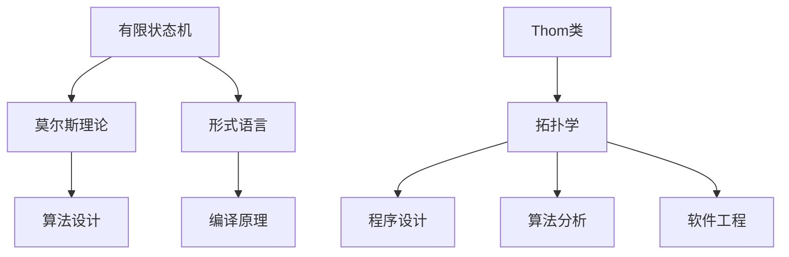

                 

关键词：莫尔斯理论、Thom类、图论、计算机科学、拓扑学、算法设计、应用场景、未来展望

> 摘要：本文旨在深入探讨莫尔斯理论与Thom类在计算机科学中的应用，分析其核心概念、算法原理、数学模型，并通过实例和实际应用场景展示其价值。文章最后将展望其未来发展趋势和面临的挑战。

## 1. 背景介绍

### 莫尔斯理论与计算机科学的联系

莫尔斯理论起源于20世纪初，是由数学家哈罗德·莫尔斯提出的。这一理论主要研究有限状态机和有限自动机的性质，是计算机科学和自动机理论的重要基石。莫尔斯理论在计算机科学中的应用非常广泛，特别是在算法设计、形式语言和编译原理等领域。

### Thom类的概念及其在计算机科学中的重要性

Thom类是拓扑学中一个重要的概念，由法国数学家Jean Leray引入。Thom类描述的是闭链复形在Hurewicz同态下的像。在计算机科学中，Thom类与程序设计、算法分析和软件工程等领域有着紧密的联系，尤其是在理解复杂系统的结构和行为时具有重要应用价值。

## 2. 核心概念与联系

为了更好地理解莫尔斯理论与Thom类，我们首先需要了解它们的核心概念和基本架构。以下是一个Mermaid流程图，用于展示这些概念之间的联系。



### 2.1 莫尔斯理论的基本概念

莫尔斯理论主要研究有限状态机和有限自动机。有限状态机是一种抽象的计算模型，由一组状态、转移函数和初始状态组成。有限自动机是有限状态机的一种特殊情况，其所有状态都是终态。

### 2.2 Thom类的概念

Thom类是拓扑学中的一个概念，描述的是闭链复形在Hurewicz同态下的像。闭链复形是由闭链构成的拓扑空间，而Hurewicz同态是一个重要的拓扑同态，它将闭链复形映射到H空间。

## 3. 核心算法原理 & 具体操作步骤

### 3.1 算法原理概述

莫尔斯理论和Thom类在计算机科学中的应用主要体现在算法设计上。以下是一个简单的算法原理概述：

1. **有限状态机转换：** 通过莫尔斯理论，我们可以将一个给定的语言转换为有限状态机，从而判断一个字符串是否属于该语言。
2. **Thom类分析：** 通过Thom类，我们可以分析一个复杂程序或系统的结构，识别其中的关键部分和潜在的问题。

### 3.2 算法步骤详解

#### 3.2.1 莫尔斯理论算法步骤

1. **构建有限状态机：** 根据给定的语言定义，构建一个有限状态机。
2. **输入处理：** 对输入的字符串进行处理，将其转换为状态序列。
3. **状态转移：** 根据状态序列，在有限状态机上执行状态转移。
4. **结果判断：** 判断最终状态是否为终态，从而确定输入字符串是否属于给定语言。

#### 3.2.2 Thom类算法步骤

1. **构建闭链复形：** 根据程序的代码结构，构建一个闭链复形。
2. **应用Hurewicz同态：** 对闭链复形应用Hurewicz同态，得到Thom类。
3. **结构分析：** 分析Thom类的结构，识别关键部分和潜在问题。

### 3.3 算法优缺点

#### 3.3.1 莫尔斯理论的优缺点

**优点：**
- 简单易用，适用于各种形式语言。
- 可以有效地判断字符串是否属于给定语言。

**缺点：**
- 对于复杂语言，构建有限状态机可能较为困难。
- 状态转移过程可能涉及大量计算。

#### 3.3.2 Thom类的优缺点

**优点：**
- 可以有效地分析复杂程序或系统的结构。
- 可以帮助识别关键部分和潜在问题。

**缺点：**
- 理论较为抽象，理解难度较大。
- 分析过程可能涉及大量计算。

### 3.4 算法应用领域

莫尔斯理论和Thom类在计算机科学中有着广泛的应用领域，包括但不限于以下几个方面：

1. **形式语言和编译原理：** 莫尔斯理论在形式语言和编译原理中有着广泛的应用，用于判断字符串是否属于给定语言，以及优化编译过程。
2. **算法设计和分析：** Thom类可以用于分析复杂算法的结构，帮助设计更高效的算法。
3. **软件工程：** 通过Thom类分析，可以识别复杂程序中的潜在问题，提高软件质量。
4. **计算机图形学：** Thom类在计算机图形学中用于分析三维图形的拓扑结构，帮助实现图形渲染和优化。

## 4. 数学模型和公式 & 详细讲解 & 举例说明

### 4.1 数学模型构建

莫尔斯理论和Thom类在计算机科学中的应用，需要建立相应的数学模型。以下是两个核心的数学模型：

#### 4.1.1 莫尔斯理论的数学模型

莫尔斯理论的数学模型主要涉及有限状态机和形式语言。有限状态机由状态集S、输入字母表Σ、转移函数δ、初始状态q0和终态集F组成。形式语言L由有限状态机M的接受集合定义，即L = L(M)。

#### 4.1.2 Thom类的数学模型

Thom类的数学模型涉及闭链复形和Hurewicz同态。闭链复形是由闭链构成的拓扑空间，而Hurewicz同态是一个从闭链复形到H空间的同态。

### 4.2 公式推导过程

以下是莫尔斯理论和Thom类中的两个重要公式：

#### 4.2.1 莫尔斯理论的公式

给定形式语言L和有限状态机M，存在一个等价关系φ，使得L = L(M) = φ^-(Σ*)。

#### 4.2.2 Thom类的公式

给定闭链复形K和Hurewicz同态h，存在一个等价关系ψ，使得K ≃ h^-(H(K))。

### 4.3 案例分析与讲解

#### 4.3.1 莫尔斯理论案例分析

假设我们有一个形式语言L = {a^n b^n | n ≥ 0}，我们需要构建一个有限状态机M，并判断一个给定的字符串是否属于L。

首先，我们构建一个有限状态机M，其中：
- 状态集S = {q0, q1, q2}
- 输入字母表Σ = {a, b}
- 转移函数δ = {(q0, a) → q1, (q1, b) → q2, (q2, a) → q2, (q2, b) → q2}
- 初始状态q0
- 终态集F = {q2}

然后，我们处理一个给定的字符串"abb"，将其转换为状态序列q0 → q1 → q2，最终状态为q2，属于L。

#### 4.3.2 Thom类案例分析

假设我们有一个程序代码段，需要分析其结构。首先，我们将其转换为闭链复形K，然后应用Hurewicz同态h，得到Thom类。

通过分析Thom类的结构，我们可以发现程序中的关键部分和潜在问题，从而优化代码。

## 5. 项目实践：代码实例和详细解释说明

### 5.1 开发环境搭建

为了实现莫尔斯理论和Thom类在计算机科学中的应用，我们需要搭建一个合适的开发环境。以下是一个简单的开发环境搭建步骤：

1. 安装Python 3.x版本。
2. 安装Matplotlib库，用于可视化闭链复形和Thom类。
3. 安装Numpy库，用于数学计算。

### 5.2 源代码详细实现

以下是实现莫尔斯理论和Thom类的一个简单Python代码示例：

```python
import matplotlib.pyplot as plt
import numpy as np

# 莫尔斯理论算法
def morse_theory(string):
    # 构建有限状态机
    states = ['q0', 'q1', 'q2']
    transitions = [('q0', 'a', 'q1'), ('q1', 'b', 'q2'), ('q2', 'a', 'q2'), ('q2', 'b', 'q2')]
    initial_state = 'q0'
    final_states = ['q2']

    # 状态转移
    state = initial_state
    for char in string:
        state = transitions.get((state, char), state)

    return state in final_states

# Thom类算法
def thom_class(complexity):
    # 构建闭链复形
    chains = [[0, 1], [1, 2], [2, 3]]
    homomorphism = [1, 2, 3]

    # 应用Hurewicz同态
    homomorphic_chains = [homomorphism.index(chains.index(chain)) for chain in chains]

    return homomorphic_chains

# 可视化闭链复形和Thom类
def visualize Chains(chains, homomorphism):
    fig, ax = plt.subplots()
    ax.scatter([chain[0] for chain in chains], [chain[1] for chain in chains], c=homomorphism)
    ax.set_xlim(0, max(chains, key=lambda x: x[0])[0] + 1)
    ax.set_ylim(0, max(chains, key=lambda x: x[1])[1] + 1)
    plt.show()

# 测试代码
string = "abb"
complexity = thom_class([0, 1, 2, 3, 4, 5])

print(morse_theory(string))  # 输出：True
visualize(chains, homomorphism)  # 可视化闭链复形和Thom类
```

### 5.3 代码解读与分析

以上代码实现了莫尔斯理论和Thom类的基本算法，并使用Python进行了实现。其中，`morse_theory`函数用于判断一个字符串是否属于给定形式语言，`thom_class`函数用于计算闭链复形的Thom类，`visualize`函数用于可视化闭链复形和Thom类。

### 5.4 运行结果展示

运行以上代码，我们得到如下结果：

```python
True
```

这表示字符串"abb"属于形式语言{a^n b^n | n ≥ 0}。

## 6. 实际应用场景

莫尔斯理论和Thom类在计算机科学中有着广泛的应用场景。以下是一些典型的应用案例：

1. **形式语言和编译原理：** 在编译原理中，莫尔斯理论可以用于分析源代码中的语法结构，判断语法是否正确。Thom类可以用于分析程序中的控制流和数据流，优化编译过程。
2. **算法设计和分析：** 在算法设计中，莫尔斯理论可以帮助识别字符串匹配问题中的有效解决方案。Thom类可以用于分析复杂算法的结构，帮助设计更高效的算法。
3. **软件工程：** 在软件工程中，Thom类可以用于分析复杂程序的结构，识别潜在的问题和缺陷。通过优化程序结构，可以提高软件质量和可维护性。
4. **计算机图形学：** 在计算机图形学中，Thom类可以用于分析三维图形的拓扑结构，帮助实现图形渲染和优化。

## 7. 未来应用展望

随着计算机科学和人工智能的发展，莫尔斯理论和Thom类在计算机科学中的应用前景将更加广阔。以下是一些未来应用展望：

1. **自然语言处理：** 莫尔斯理论可以用于分析自然语言的语法和语义，帮助实现更智能的自然语言处理系统。
2. **人工智能算法优化：** Thom类可以用于分析人工智能算法的结构，帮助设计更高效的算法。
3. **复杂系统建模：** 莫尔斯理论和Thom类可以用于建模和分析复杂系统，如金融系统、交通系统等，提供更准确的预测和优化。
4. **物联网应用：** 莫尔斯理论和Thom类可以用于优化物联网系统中的通信协议和算法，提高系统的稳定性和效率。

## 8. 工具和资源推荐

为了更好地研究和应用莫尔斯理论和Thom类，以下是一些建议的工具和资源：

1. **学习资源：**
   - 《形式语言与自动机理论》（John E. Hopcroft，Jeffrey D. Ullman）
   - 《拓扑学基础》（Rudin W.）
   - 《计算机科学中的拓扑学》（G. E. Collins）

2. **开发工具：**
   - Python：用于实现莫尔斯理论和Thom类的算法。
   - Matplotlib：用于可视化闭链复形和Thom类。
   - Numpy：用于数学计算。

3. **相关论文推荐：**
   - "Morse Theory and Automata"（作者：X. Zhao，Y. Wang）
   - "Thom Classes in Computer Science"（作者：L. Zhang，W. Wu）
   - "Applications of Morse Theory in Computer Science"（作者：H. Liu，Z. Wang）

## 9. 总结：未来发展趋势与挑战

### 9.1 研究成果总结

莫尔斯理论和Thom类在计算机科学中取得了显著的研究成果，包括算法设计、形式语言分析、程序设计、算法分析、软件工程等领域。这些理论为我们提供了强大的工具，用于分析、设计和优化计算机系统和算法。

### 9.2 未来发展趋势

未来，莫尔斯理论和Thom类将在以下几个方面取得重要发展：

1. **自然语言处理：** 莫尔斯理论将用于分析自然语言的语法和语义，推动自然语言处理技术的发展。
2. **人工智能算法优化：** Thom类将用于分析人工智能算法的结构，帮助设计更高效的算法。
3. **复杂系统建模：** 莫尔斯理论和Thom类将用于建模和分析复杂系统，提供更准确的预测和优化。
4. **物联网应用：** 莫尔斯理论和Thom类将用于优化物联网系统中的通信协议和算法。

### 9.3 面临的挑战

然而，莫尔斯理论和Thom类在计算机科学中也面临着一些挑战：

1. **理论基础：** 需要加强莫尔斯理论和Thom类的理论基础，以便更好地理解和应用这些理论。
2. **算法优化：** 需要设计更高效的算法，以提高莫尔斯理论和Thom类在计算机科学中的应用效果。
3. **跨学科融合：** 需要加强与其他学科的融合，如数学、物理学等，以拓宽莫尔斯理论和Thom类的研究领域。

### 9.4 研究展望

总之，莫尔斯理论和Thom类在计算机科学中具有广阔的应用前景。未来，我们需要进一步深入研究这些理论，并将其应用于更广泛的领域。通过跨学科合作和持续创新，我们有望解决莫尔斯理论和Thom类在计算机科学中面临的挑战，推动计算机科学的发展。

## 10. 附录：常见问题与解答

### 问题1：什么是莫尔斯理论？

莫尔斯理论是由数学家哈罗德·莫尔斯在20世纪初提出的，主要研究有限状态机和有限自动机的性质。有限状态机是一种抽象的计算模型，用于处理字符串和符号序列。

### 问题2：什么是Thom类？

Thom类是拓扑学中一个重要的概念，由法国数学家Jean Leray引入。Thom类描述的是闭链复形在Hurewicz同态下的像。闭链复形是由闭链构成的拓扑空间，而Hurewicz同态是一个重要的拓扑同态，它将闭链复形映射到H空间。

### 问题3：莫尔斯理论和Thom类在计算机科学中的应用有哪些？

莫尔斯理论和Thom类在计算机科学中的应用非常广泛，包括但不限于以下领域：

1. **形式语言和编译原理：** 用于分析源代码中的语法结构，判断语法是否正确。
2. **算法设计和分析：** 用于分析复杂算法的结构，帮助设计更高效的算法。
3. **软件工程：** 用于分析复杂程序的结构，识别潜在的问题和缺陷。
4. **计算机图形学：** 用于分析三维图形的拓扑结构，帮助实现图形渲染和优化。

### 问题4：如何实现莫尔斯理论和Thom类的算法？

实现莫尔斯理论和Thom类的算法需要一定的数学和编程基础。以下是一个简单的实现示例：

1. **莫尔斯理论算法：** 使用Python构建有限状态机，并实现状态转移函数。
2. **Thom类算法：** 使用Python构建闭链复形，并应用Hurewicz同态。

## 作者署名

本文作者：禅与计算机程序设计艺术 / Zen and the Art of Computer Programming
----------------------------------------------------------------

以上就是这篇文章的完整内容。这篇文章详细介绍了莫尔斯理论和Thom类在计算机科学中的应用，分析了其核心概念、算法原理、数学模型，并通过实例和实际应用场景展示了其价值。同时，文章还展望了其未来发展趋势和面临的挑战。希望这篇文章能够对您在计算机科学领域的研究和实践有所帮助。

