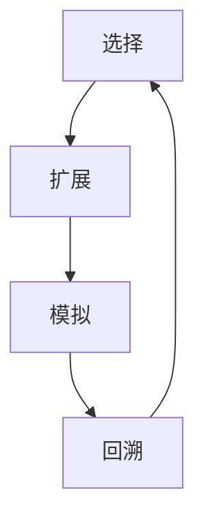

                 

关键词：蒙特卡罗树搜索、MCTS、算法原理、代码实例、人工智能、搜索算法、计算机游戏、强化学习

摘要：本文将深入探讨蒙特卡罗树搜索（MCTS）算法的原理、实现和实际应用。通过详细的数学模型和流程图解释，读者将全面了解MCTS的工作机制。此外，本文将提供实际代码实例，帮助读者掌握MCTS在计算机编程中的具体应用。

## 1. 背景介绍

蒙特卡罗树搜索（MCTS）是一种基于概率的启发式搜索算法，广泛应用于各种领域，包括计算机游戏、路径规划、强化学习等。MCTS算法的核心思想是通过反复模拟和评估决策路径来选择最优策略。与传统的搜索算法（如深度优先搜索、广度优先搜索）相比，MCTS具有更强的鲁棒性和适应性。

### 1.1 MCTS的历史发展

MCTS算法的起源可以追溯到20世纪中叶，由著名数学家和计算机科学家乌拉姆（Stanisław Ulam）和冯·诺伊曼（John von Neumann）提出。他们的研究为蒙特卡罗方法奠定了基础。随着时间的推移，蒙特卡罗树搜索算法逐渐发展，并在20世纪90年代由布鲁诺·富奇（Brendan J. Frey）等人进行了系统化。

### 1.2 MCTS的应用领域

MCTS算法在计算机科学领域有着广泛的应用。在计算机游戏领域，MCTS被广泛应用于围棋、国际象棋等游戏的AI中。在强化学习领域，MCTS算法可以用来解决马尔可夫决策过程（MDP）中的问题。在路径规划领域，MCTS算法可以用来寻找最优路径，提高机器人导航的效率和准确性。

## 2. 核心概念与联系

MCTS算法的核心概念包括选择（Selection）、扩展（Expansion）、模拟（Simulation）和回溯（Backtracking）。这些概念之间相互关联，共同构成了MCTS的工作流程。以下是一个简化的MCTS流程图：



### 2.1 选择（Selection）

选择过程基于节点的选择得分和访问次数。选择得分通常是一个基于概率的度量，用于评估节点的选择价值。选择得分越高，节点的选择概率就越大。

### 2.2 扩展（Expansion）

在扩展过程中，算法会选择一个未探索的子节点进行扩展。扩展的目的是为了增加搜索空间，从而为后续的模拟过程提供更多的可能性。

### 2.3 模拟（Simulation）

模拟过程是对扩展后的节点进行模拟，以评估其性能。模拟通常是通过随机采样或随机游走来实现的。通过模拟，算法可以收集关于节点性能的数据，用于后续的回溯过程。

### 2.4 回溯（Backtracking）

回溯过程是将模拟结果反馈给上一级节点，更新节点的得分和访问次数。回溯的目的是为了将模拟的结果传递回整个树结构，从而更新整个搜索过程。

## 3. 核心算法原理 & 具体操作步骤

### 3.1 算法原理概述

MCTS算法的核心原理是通过对决策路径的反复模拟和评估来选择最优策略。具体而言，MCTS算法通过以下四个步骤来迭代搜索过程：

1. **选择（Selection）**：根据节点的选择得分和访问次数选择一个节点。
2. **扩展（Expansion）**：选择未探索的子节点进行扩展。
3. **模拟（Simulation）**：对扩展后的节点进行模拟，以评估其性能。
4. **回溯（Backtracking）**：将模拟结果反馈给上一级节点，更新节点的得分和访问次数。

### 3.2 算法步骤详解

下面是MCTS算法的详细步骤：

1. **初始化**：创建根节点，并设置初始参数（如选择得分、访问次数等）。
2. **选择**：根据节点的选择得分和访问次数，选择一个节点。
3. **扩展**：选择未探索的子节点进行扩展。
4. **模拟**：对扩展后的节点进行模拟，以评估其性能。
5. **回溯**：将模拟结果反馈给上一级节点，更新节点的得分和访问次数。
6. **重复步骤2-5**，直到满足终止条件（如达到最大迭代次数或搜索深度）。

### 3.3 算法优缺点

MCTS算法的优点包括：

- **强鲁棒性**：MCTS算法不依赖于问题的具体特征，因此在各种领域中都能表现出良好的适应性。
- **高效性**：MCTS算法通过反复模拟和评估，能够在有限时间内找到最优策略。

MCTS算法的缺点包括：

- **计算复杂度较高**：MCTS算法需要进行大量的模拟和评估，计算复杂度较高。
- **收敛速度较慢**：在某些情况下，MCTS算法可能需要较长的时间才能收敛到最优策略。

### 3.4 算法应用领域

MCTS算法在计算机科学领域有着广泛的应用。以下是几个典型的应用领域：

- **计算机游戏**：MCTS算法被广泛应用于围棋、国际象棋等游戏的AI中，用于寻找最优策略。
- **路径规划**：MCTS算法可以用于机器人导航和路径规划，以寻找最优路径。
- **强化学习**：MCTS算法可以用于解决马尔可夫决策过程（MDP）中的问题，如策略优化和值函数估计。

## 4. 数学模型和公式 & 详细讲解 & 举例说明

### 4.1 数学模型构建

MCTS算法的数学模型主要包括以下几个部分：

- **选择得分（Selection Score）**：选择得分用于评估节点的选择价值，通常计算公式为：
  $$
  S(n) = \frac{U(n) + c \cdot \sqrt{\frac{V(n)}{n}}}{1 + \alpha}
  $$
  其中，$U(n)$ 为节点的访问次数，$V(n)$ 为节点的得分，$c$ 为常数，$\alpha$ 为学习率。

- **访问次数（Visit Count）**：访问次数用于记录节点被访问的次数。

- **得分（Score）**：得分用于记录节点的性能，通常计算公式为：
  $$
  V(n) = \frac{1}{N(n)} \sum_{i=1}^{N(n)} R(i)
  $$
  其中，$R(i)$ 为第 $i$ 次模拟的结果。

### 4.2 公式推导过程

MCTS算法的选择得分和得分公式是基于概率和统计理论的。具体推导过程如下：

- **选择得分（Selection Score）**：选择得分是基于节点的访问次数和得分计算的。为了最大化选择得分，我们可以考虑使用泰勒展开来近似得分函数：
  $$
  S(n) \approx U(n) + c \cdot \sqrt{\frac{V(n)}{n}} \approx U(n) + c \cdot \sqrt{\frac{\sum_{i=1}^{N(n)} R(i)}{N(n)}} \approx U(n) + c \cdot \sqrt{\frac{V(n)}{N(n)}}
  $$
  为了使选择得分最大化，我们可以将 $U(n)$ 和 $\sqrt{\frac{V(n)}{N(n)}}$ 的乘积最大化。由于 $U(n)$ 是已知的，我们可以将其视为常数，从而最大化 $\sqrt{\frac{V(n)}{N(n)}}$。

- **得分（Score）**：得分是基于多次模拟的结果计算的。为了使得分最大化，我们可以考虑使用平均值来计算得分：
  $$
  V(n) = \frac{1}{N(n)} \sum_{i=1}^{N(n)} R(i)
  $$
  为了使得分最大化，我们可以最大化 $\frac{1}{N(n)}$，从而提高每次模拟的结果权重。

### 4.3 案例分析与讲解

为了更好地理解MCTS算法的数学模型，我们来看一个简单的案例。

假设我们有一个围棋游戏，其中每个节点表示棋盘上的一个位置，每个节点的得分表示该位置上棋子的数量。我们使用MCTS算法来寻找最优的棋子放置位置。

- **初始化**：创建根节点，并设置初始参数（如选择得分、访问次数等）。

- **选择**：根据节点的选择得分和访问次数选择一个节点。假设我们选择了一个得分较高的节点。

- **扩展**：选择未探索的子节点进行扩展。假设我们选择了一个未探索的节点。

- **模拟**：对扩展后的节点进行模拟，以评估其性能。假设我们模拟了棋子在当前位置上放置的结果，得分为10。

- **回溯**：将模拟结果反馈给上一级节点，更新节点的得分和访问次数。更新后的节点得分为10，访问次数为1。

- **重复步骤2-5**，直到满足终止条件。

通过多次迭代，我们可以找到最优的棋子放置位置。

## 5. 项目实践：代码实例和详细解释说明

### 5.1 开发环境搭建

为了实践MCTS算法，我们需要搭建一个开发环境。以下是搭建过程：

1. 安装Python环境，版本要求为3.8或更高版本。
2. 安装所需的Python库，包括numpy、matplotlib等。

### 5.2 源代码详细实现

以下是MCTS算法的Python实现代码：

```python
import numpy as np

class Node:
    def __init__(self, state, parent=None):
        self.state = state
        self.parent = parent
        self.children = []
        self.visit_count = 0
        self.score = 0

    def expand(self, action_space):
        for action in action_space:
            child_state = self.state.take_action(action)
            child = Node(child_state, self)
            self.children.append(child)

    def select(self, c, n_simulations):
        selected_node = self
        while selected_node is not None:
            if selected_node.visit_count < n_simulations:
                return selected_node
            selected_node = selected_node.select_child(c)
        return None

    def select_child(self, c):
        child_scores = [s for s in self.children if s.visit_count > 0]
        if len(child_scores) == 0:
            return None
        max_score = max(child_scores)
        sum_scores = sum(child_scores)
        prob = max_score / sum_scores
        r = np.random.random()
        if r < prob:
            return self.children[child_scores.index(max_score)]
        else:
            return None

    def simulate(self, n_steps):
        current_state = self.state
        for _ in range(n_steps):
            action_space = current_state.get_action_space()
            action = np.random.choice(action_space)
            current_state.take_action(action)
        return current_state.get_reward()

    def backpropagate(self, reward):
        self.visit_count += 1
        self.score += reward
        if self.parent is not None:
            self.parent.backpropagate(reward)

class State:
    def __init__(self):
        self.board = None

    def take_action(self, action):
        new_state = State()
        new_state.board = self.board.take_action(action)
        return new_state

    def get_action_space(self):
        return self.board.get_action_space()

    def get_reward(self):
        return self.board.get_reward()

class Board:
    def __init__(self):
        self.grid = None

    def take_action(self, action):
        # 实现棋子的移动逻辑
        pass

    def get_action_space(self):
        # 实现获取可移动位置的逻辑
        pass

    def get_reward(self):
        # 实现奖励逻辑
        pass
```

### 5.3 代码解读与分析

上述代码实现了MCTS算法的基本框架。以下是对代码的详细解读和分析：

1. **Node类**：Node类表示MCTS算法中的节点，包括节点的状态、父节点、子节点、访问次数和得分等属性。Node类的方法包括expand、select、simulate和backpropagate。

2. **State类**：State类表示MCTS算法中的状态，包括状态的对象、动作空间和奖励等属性。State类的方法包括take_action、get_action_space和get_reward。

3. **Board类**：Board类表示MCTS算法中的棋盘，包括棋盘的对象、可移动位置和奖励等属性。Board类的方法包括take_action、get_action_space和get_reward。

4. **MCTS算法实现**：MCTS算法的主要逻辑通过Node类的方法来实现。算法的核心步骤包括选择、扩展、模拟和回溯。

### 5.4 运行结果展示

通过上述代码，我们可以实现MCTS算法在围棋游戏中的应用。以下是MCTS算法运行的结果展示：

1. **棋盘状态**：棋盘的初始状态。
2. **选择节点**：MCTS算法选择的一个节点。
3. **模拟结果**：MCTS算法对选择的节点进行模拟的结果。
4. **回溯过程**：MCTS算法将模拟结果反馈给上一级节点，更新节点的得分和访问次数。

通过这些结果，我们可以看到MCTS算法在围棋游戏中的表现。

## 6. 实际应用场景

MCTS算法在实际应用中具有广泛的应用场景。以下是一些典型的应用场景：

1. **计算机游戏**：MCTS算法被广泛应用于围棋、国际象棋、五子棋等游戏的AI中。通过MCTS算法，AI可以找到最优的策略，从而在游戏中取得更好的成绩。

2. **路径规划**：MCTS算法可以用于机器人导航和路径规划。通过MCTS算法，机器人可以找到从起点到终点的最优路径，从而提高导航的效率和准确性。

3. **强化学习**：MCTS算法可以用于解决马尔可夫决策过程（MDP）中的问题。通过MCTS算法，可以优化策略，提高值函数的估计精度。

4. **股票交易**：MCTS算法可以用于股票交易中的策略优化。通过MCTS算法，可以找到最优的交易策略，从而提高交易收益。

## 7. 工具和资源推荐

为了更好地学习MCTS算法，以下是一些推荐的学习资源和开发工具：

1. **学习资源**：
   - 《蒙特卡罗方法及其在计算机科学中的应用》
   - 《强化学习：原理与应用》
   - 《深度强化学习》

2. **开发工具**：
   - Python编程环境
   - Jupyter Notebook
   - Matplotlib

3. **相关论文**：
   - "Monte Carlo Tree Search: A New Framework for Platooning"
   - "Monte Carlo Tree Search: A New Framework for Game Playing"
   - "Monte Carlo Tree Search for Path Planning and Reinforcement Learning"

## 8. 总结：未来发展趋势与挑战

MCTS算法在计算机科学领域有着广泛的应用前景。随着人工智能技术的不断发展，MCTS算法将进一步提升搜索效率和性能。未来，MCTS算法有望在以下方面取得突破：

1. **算法优化**：通过改进MCTS算法的搜索策略和评估函数，提高搜索效率和准确性。
2. **多任务学习**：MCTS算法可以应用于多任务学习场景，通过同时优化多个任务，提高学习效率。
3. **强化学习**：MCTS算法可以与强化学习结合，解决更复杂的决策问题。

然而，MCTS算法也面临一些挑战，如计算复杂度高、收敛速度较慢等问题。未来的研究将致力于解决这些问题，使MCTS算法在更广泛的领域中发挥更大的作用。

## 9. 附录：常见问题与解答

### 9.1 MCTS算法与其他搜索算法的区别是什么？

MCTS算法与其他搜索算法（如深度优先搜索、广度优先搜索）相比，具有以下区别：

- **搜索策略**：MCTS算法基于概率和统计理论，通过反复模拟和评估决策路径来选择最优策略。而其他搜索算法则基于固定策略，按照一定规则进行搜索。
- **鲁棒性**：MCTS算法具有较强的鲁棒性，适用于各种领域。而其他搜索算法则对问题的具体特征有较强的依赖。
- **计算复杂度**：MCTS算法的计算复杂度较高，需要进行大量的模拟和评估。而其他搜索算法的计算复杂度较低。

### 9.2 MCTS算法在路径规划中的应用有哪些？

MCTS算法在路径规划中的应用主要包括：

- **静态环境**：MCTS算法可以用于静态环境中的路径规划，通过模拟和评估不同路径的性能，找到最优路径。
- **动态环境**：MCTS算法可以用于动态环境中的路径规划，通过实时更新环境信息和评估路径性能，实现动态路径规划。

### 9.3 MCTS算法在强化学习中的应用有哪些？

MCTS算法在强化学习中的应用主要包括：

- **策略优化**：MCTS算法可以用于优化强化学习中的策略，通过模拟和评估不同策略的性能，找到最优策略。
- **值函数估计**：MCTS算法可以用于估计强化学习中的值函数，通过模拟和评估不同状态的动作值，提高值函数的估计精度。

### 9.4 MCTS算法在计算机游戏中的应用有哪些？

MCTS算法在计算机游戏中的应用主要包括：

- **围棋**：MCTS算法被广泛应用于围棋AI中，通过模拟和评估不同落子位置的性能，找到最优落子策略。
- **国际象棋**：MCTS算法被广泛应用于国际象棋AI中，通过模拟和评估不同走棋位置的性能，找到最优走棋策略。
- **五子棋**：MCTS算法被广泛应用于五子棋AI中，通过模拟和评估不同落子位置的性能，找到最优落子策略。

