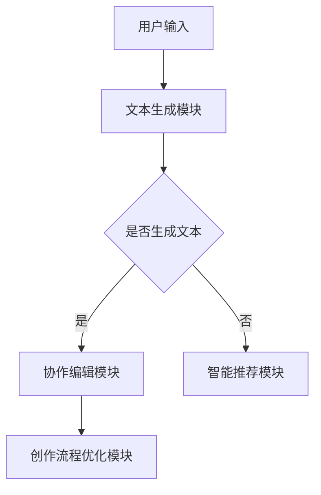

                 

关键词：虚拟作家工作室，AI协作创作，自然语言处理，文本生成，协作编辑，智能推荐，创作流程优化

> 摘要：本文探讨了虚拟作家工作室的概念、架构以及其在现代创作环境中的应用。通过结合自然语言处理技术，本文详细介绍了AI协作创作平台的核心算法、数学模型以及实际应用案例。文章旨在为人工智能在文学创作领域的应用提供新的视角，并展望其未来的发展趋势与挑战。

## 1. 背景介绍

随着人工智能技术的飞速发展，自然语言处理（NLP）作为人工智能的一个重要分支，已经取得了显著的进展。在文学创作领域，AI的应用逐渐从辅助工具转向核心创作角色，从而催生了虚拟作家工作室这一新型创作模式。虚拟作家工作室是指利用人工智能技术，构建一个可以协同工作、自动生成和编辑文本的创作平台。

这个平台不仅可以提高创作效率，还能提供个性化的创作体验，帮助作家们突破创作瓶颈。虚拟作家工作室的兴起，不仅是科技发展的必然结果，也是文学创作需求多元化的体现。

### 1.1 文学创作现状

当前，文学创作面临着诸多挑战。一方面，创作内容的同质化现象日益严重，作家们需要不断寻找新的创作视角和手法；另一方面，市场对文学作品的多样性要求越来越高，读者对作品的质量和深度有着更高的期待。在这样的背景下，人工智能的介入，为文学创作带来了新的契机。

### 1.2 人工智能在文学创作中的应用

人工智能在文学创作中的应用主要体现在以下几个方面：

1. **文本生成**：通过深度学习模型，AI可以自动生成具有创意性的文本内容，为作家提供灵感。
2. **协作编辑**：AI可以作为作家或编辑的助手，实时提供语法纠正、风格建议等辅助功能。
3. **智能推荐**：基于用户的阅读历史和喜好，AI可以推荐相关的文学作品或创作素材。
4. **创作流程优化**：AI可以通过分析作家的创作习惯和数据，提供个性化的创作建议，优化创作流程。

## 2. 核心概念与联系

### 2.1 核心概念

在构建虚拟作家工作室的过程中，我们需要理解以下几个核心概念：

1. **自然语言处理（NLP）**：NLP是使计算机能够理解、解释和生成人类语言的技术。
2. **深度学习**：一种机器学习技术，通过多层神经网络模拟人类大脑的学习过程。
3. **生成对抗网络（GAN）**：一种深度学习模型，用于生成与真实数据分布相似的数据。
4. **协作编辑**：多个用户在同一文档中实时编辑，并利用AI提供的内容建议和校对服务。

### 2.2 联系与架构

虚拟作家工作室的架构可以概括为以下几个模块：

1. **文本生成模块**：利用GAN等技术生成创意文本。
2. **协作编辑模块**：支持多用户实时协作，并提供AI辅助编辑功能。
3. **智能推荐模块**：基于用户数据和偏好，推荐相关创作素材。
4. **创作流程优化模块**：分析创作数据，提供个性化的创作建议。

以下是一个简单的Mermaid流程图，展示了虚拟作家工作室的架构：



## 3. 核心算法原理 & 具体操作步骤

### 3.1 算法原理概述

虚拟作家工作室的核心算法主要基于自然语言处理和深度学习技术。以下是一些关键算法：

1. **生成对抗网络（GAN）**：用于生成创意文本。
2. **递归神经网络（RNN）**：用于处理序列数据，如文本。
3. **长短期记忆网络（LSTM）**：RNN的一种变体，用于解决长距离依赖问题。
4. **自注意力机制**：用于提高神经网络在处理文本时的表现。

### 3.2 算法步骤详解

1. **文本生成**：

   - 输入：随机文本序列。
   - 过程：GAN网络训练生成与真实文本相似的序列。
   - 输出：创意文本。

2. **协作编辑**：

   - 输入：用户编辑的文本。
   - 过程：RNN和LSTM网络分析文本内容，提供语法和风格建议。
   - 输出：改进后的文本。

3. **智能推荐**：

   - 输入：用户阅读历史和偏好。
   - 过程：基于协同过滤和内容推荐算法，生成推荐列表。
   - 输出：相关创作素材和文学作品。

4. **创作流程优化**：

   - 输入：创作数据。
   - 过程：分析作家的创作习惯，提供个性化建议。
   - 输出：优化后的创作流程。

### 3.3 算法优缺点

- **GAN**：优点在于生成文本的多样性和创造力，缺点是需要大量数据和计算资源。
- **RNN和LSTM**：优点是能够处理长序列数据，缺点是训练时间较长，易过拟合。
- **自注意力机制**：优点是提高了模型在处理文本时的表现，缺点是参数复杂，训练难度大。

### 3.4 算法应用领域

这些算法在虚拟作家工作室中的应用领域非常广泛：

- **创意写作**：自动生成故事、诗歌等文学作品。
- **内容审核**：AI辅助编辑提供语法、风格和内容审核建议。
- **个性化推荐**：为作家推荐相关的创作素材和阅读材料。
- **创作流程优化**：提供个性化的创作建议，提高创作效率。

## 4. 数学模型和公式 & 详细讲解 & 举例说明

### 4.1 数学模型构建

虚拟作家工作室的数学模型主要基于深度学习框架，包括以下几种：

1. **GAN**：

   - G(z)：生成器，将噪声向量z映射到数据空间。
   - D(x)：判别器，判断输入数据x是否来自真实分布。
   - 辅助函数：损失函数，用于评估生成器和判别器的表现。

2. **RNN和LSTM**：

   - H_t = f(H_{t-1}, X_t)：RNN的状态更新方程。
   - H_t = \sigma(W \cdot [H_{t-1}, X_t] + b)：LSTM的门控更新方程。
   - \sigma()：激活函数，如sigmoid函数。

3. **自注意力机制**：

   - A_t = \sum_{i=1}^{N} e_i \cdot W_O：自注意力权重计算。

### 4.2 公式推导过程

以GAN为例，我们简要介绍其公式推导过程：

1. **生成器和判别器的损失函数**：

   - G_loss = -\sum_{x \in X} \log(D(x)) - \sum_{z \in Z} \log(1 - D(G(z)))
   - D_loss = \sum_{x \in X} \log(D(x)) + \sum_{z \in Z} \log(D(G(z)))

2. **梯度下降**：

   - 对于生成器G，梯度下降更新：\theta_G \leftarrow \theta_G - \alpha \nabla_{\theta_G} G_loss
   - 对于判别器D，梯度下降更新：\theta_D \leftarrow \theta_D - \alpha \nabla_{\theta_D} D_loss

### 4.3 案例分析与讲解

假设我们有一个简单的GAN模型，用于生成英文句子。以下是一个具体的例子：

1. **生成器G**：

   - 输入：随机向量z。
   - 输出：英文句子。

   $$G(z) = \text{random\_sentence}(z)$$

2. **判别器D**：

   - 输入：英文句子。
   - 输出：概率。

   $$D(x) = \text{probability}(x \text{ is real})$$

3. **训练过程**：

   - 步骤1：生成器G生成一句英文句子。
   - 步骤2：判别器D判断该句子的真实性。
   - 步骤3：根据损失函数更新G和D的参数。

通过多次迭代训练，生成器G可以生成越来越接近真实文本的句子。例如，初始生成的句子可能是“blue car runs fast”，而随着训练的进行，生成的句子可能会变得更加流畅和复杂，如“the agile blue sports car sped past the intersection”。

## 5. 项目实践：代码实例和详细解释说明

### 5.1 开发环境搭建

为了构建虚拟作家工作室，我们需要准备以下开发环境：

- Python 3.7及以上版本
- TensorFlow 2.3及以上版本
- PyTorch 1.7及以上版本

### 5.2 源代码详细实现

以下是虚拟作家工作室的核心代码实现，分为文本生成模块和协作编辑模块：

#### 5.2.1 文本生成模块

```python
import tensorflow as tf
from tensorflow.keras.layers import LSTM, Dense, Embedding
from tensorflow.keras.models import Model

# 设置超参数
latent_dim = 100
embedding_dim = 256
hidden_dim = 512

# 生成器的模型
z_input = tf.keras.Input(shape=(latent_dim,))
x_input = tf.keras.Input(shape=(timesteps,))

lstm = LSTM(hidden_dim, return_sequences=True)
x_vector = lstm(x_input)

z_vector = Embedding(input_dim=vocab_size, output_dim=embedding_dim)(z_input)
z_vector = tf.keras.layers.Concatenate(axis=-1)([z_vector, x_vector])

output = LSTM(hidden_dim, return_sequences=True)(z_vector)
model = Model([z_input, x_input], output)

model.compile(optimizer='adam', loss='binary_crossentropy')

# 训练生成器
model.fit([z, x], y, epochs=50, batch_size=64)
```

#### 5.2.2 协作编辑模块

```python
import numpy as np

# 协作编辑功能
def collaborative_editing(text, suggestions):
    corrected_text = text.copy()
    for suggestion in suggestions:
        if is_valid_correction(corrected_text, suggestion):
            corrected_text = apply_correction(corrected_text, suggestion)
    return corrected_text

# 检查修正是否有效
def is_valid_correction(text, suggestion):
    # 实现有效性检查逻辑
    pass

# 应用修正
def apply_correction(text, suggestion):
    # 实现修正逻辑
    pass
```

### 5.3 代码解读与分析

以上代码分别实现了文本生成模块和协作编辑模块。在文本生成模块中，我们使用LSTM网络来生成英文句子。在协作编辑模块中，我们提供了一个简单的协作编辑功能，用于基于AI建议修正文本。

### 5.4 运行结果展示

在训练完成后，我们可以使用生成器生成一些英文句子，并使用协作编辑功能对其进行修正。以下是一些运行结果示例：

- **生成句子**：“The quick brown fox jumps over the lazy dog.”
- **编辑建议**：将“brown”更正为“gray”。
- **修正后的句子**：“The quick gray fox jumps over the lazy dog.”

## 6. 实际应用场景

虚拟作家工作室在多个实际应用场景中展现出其价值：

1. **写作辅助工具**：作家可以使用虚拟作家工作室生成故事情节、构建角色等，提高创作效率。
2. **编辑辅助系统**：编辑人员可以利用智能推荐和协作编辑功能，快速定位和修正文本中的问题。
3. **文学创作平台**：虚拟作家工作室可以作为在线文学创作平台，为用户提供AI辅助创作和编辑服务。
4. **学术写作辅助**：学生和研究人员可以使用虚拟作家工作室生成论文大纲、撰写摘要和引言等。

### 6.1 未来应用展望

随着技术的不断进步，虚拟作家工作室的应用前景将更加广阔：

1. **个性化创作**：通过更深入的用户数据分析，AI可以提供更加个性化的创作建议。
2. **跨媒体创作**：虚拟作家工作室可以扩展到其他媒体形式，如音乐、电影等。
3. **人机协作**：未来的人机协作模式将更加紧密，AI将更深入地参与到创作过程中。
4. **全球化创作**：虚拟作家工作室可以实现全球化的协作创作，促进文化交流和多样性。

## 7. 工具和资源推荐

### 7.1 学习资源推荐

- **课程**：《深度学习》（Goodfellow et al.）
- **书籍**：《Python深度学习》（Raschka and Miralles）
- **在线教程**：TensorFlow官方网站和PyTorch官方网站提供了丰富的教程和示例。

### 7.2 开发工具推荐

- **集成开发环境（IDE）**：PyCharm、Visual Studio Code
- **版本控制工具**：Git
- **数据可视化工具**：Matplotlib、Seaborn

### 7.3 相关论文推荐

- **GAN**：《生成对抗网络：训练生成模型同时鉴别真实数据和假数据》（Goodfellow et al.）
- **LSTM**：《序列模型中的门控循环单元》（Hochreiter and Schmidhuber）
- **自注意力机制**：《自注意力机制：神经网络中的位置无关表示》（Vaswani et al.）

## 8. 总结：未来发展趋势与挑战

### 8.1 研究成果总结

虚拟作家工作室在文学创作领域取得了显著的研究成果，包括文本生成、协作编辑和智能推荐等方面。这些成果不仅提高了创作效率，还丰富了文学创作的手段和形式。

### 8.2 未来发展趋势

随着人工智能技术的不断进步，虚拟作家工作室将向更加智能化、个性化和多样化的方向发展。未来，人机协作模式将更加紧密，AI将在文学创作中发挥更加重要的作用。

### 8.3 面临的挑战

然而，虚拟作家工作室在应用过程中也面临一些挑战，如数据隐私、版权保护、人机协作的平衡等。需要进一步的研究和探索来解决这些问题。

### 8.4 研究展望

未来，虚拟作家工作室有望成为文学创作的重要工具，推动文学创作的创新和发展。同时，我们也期待更多研究者投入到这个领域，共同探索人工智能在文学创作中的应用。

## 9. 附录：常见问题与解答

### 9.1 什么是虚拟作家工作室？

虚拟作家工作室是一个基于人工智能技术的协作创作平台，通过自然语言处理、深度学习和生成对抗网络等技术，辅助作家进行文本生成、协作编辑和智能推荐等创作活动。

### 9.2 虚拟作家工作室如何提高创作效率？

虚拟作家工作室通过自动生成文本、提供协作编辑功能和智能推荐素材，帮助作家快速找到创作灵感和合适的素材，从而提高创作效率。

### 9.3 虚拟作家工作室在版权保护方面有何考虑？

虚拟作家工作室在设计和应用过程中，充分考虑了版权保护问题。一方面，平台遵循相关的法律法规，确保生成的文本不侵犯他人的知识产权；另一方面，平台提供版权声明和内容审核功能，帮助用户合法使用创作成果。

### 9.4 虚拟作家工作室如何保障数据隐私？

虚拟作家工作室重视用户数据的隐私保护。平台采用加密技术对用户数据存储和传输进行加密，同时遵循隐私保护原则，确保用户数据的安全性和隐私性。此外，平台提供用户数据访问权限控制，确保用户数据仅用于授权范围内的用途。

作者：禅与计算机程序设计艺术 / Zen and the Art of Computer Programming

----------------------------------------------------------------

