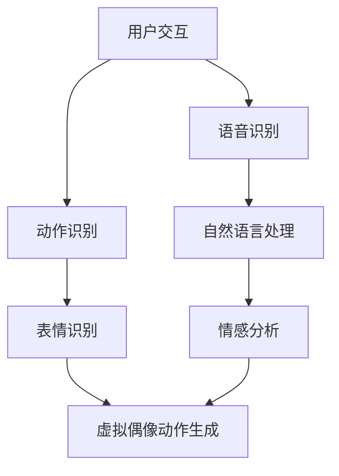

                 

在当今数字化时代，虚拟偶像已经成为娱乐产业的一颗耀眼新星。随着人工智能、虚拟现实和增强现实等技术的发展，虚拟偶像逐渐从科幻作品中走入现实，成为企业探索创新商业模式的重要工具。本文将探讨虚拟偶像创业的背景、核心概念、算法原理、数学模型、项目实践以及未来应用展望，旨在为读者提供一个全面而深入的视角。

## 关键词

- 虚拟偶像
- 商业价值
- 人工智能
- 数字化明星
- 娱乐产业

## 摘要

本文通过分析虚拟偶像的崛起背景，阐述了其在商业价值上的多重体现。从核心概念到算法原理，再到数学模型和项目实践，本文详细探讨了虚拟偶像创业的技术架构和应用场景。最后，本文对虚拟偶像的未来发展进行了展望，并提出了相关工具和资源的推荐。

## 1. 背景介绍

### 虚拟偶像的定义与发展

虚拟偶像，又称数字化明星或AI虚拟艺人，是指通过人工智能技术创建的，具备一定表演能力的数字角色。它们可以是全息影像、动画形象或三维建模，能够在虚拟空间中与观众互动，进行音乐表演、舞蹈、演讲等多种活动。

虚拟偶像的概念最早可以追溯到20世纪90年代，随着计算机图形学和人工智能技术的不断进步，虚拟偶像逐渐从概念走向现实。早期的虚拟偶像如GACKT和初音未来，以其独特的魅力和无限的可塑性，吸引了大量粉丝，开启了虚拟偶像的先河。

### 虚拟偶像的兴起原因

1. **技术进步**：人工智能、虚拟现实（VR）和增强现实（AR）技术的快速发展，为虚拟偶像的实现提供了技术支撑。高性能计算和海量数据的处理能力，使得虚拟偶像在视觉效果和互动性上得以大幅提升。

2. **市场需求**：随着互联网和社交媒体的普及，人们对于个性化、即时性的娱乐需求日益增长。虚拟偶像满足了这一需求，它们可以全天候、无地域限制地与粉丝互动，提供个性化的娱乐体验。

3. **商业价值**：虚拟偶像不仅具备娱乐价值，还在商业领域展现出巨大的潜力。例如，虚拟偶像可以成为品牌代言人、参加商业活动、发行数字专辑等，为企业创造可观的利润。

## 2. 核心概念与联系

### 虚拟偶像系统架构图

下面是虚拟偶像系统的Mermaid流程图，展示了系统的核心组成部分和它们之间的联系。



### 各组件的功能与联系

1. **用户交互**：用户通过语音或手势与虚拟偶像互动，系统需要识别用户的指令并进行响应。

2. **语音识别**：将用户的语音转化为文本，为后续的自然语言处理提供基础。

3. **动作识别**：通过摄像头或其他传感器捕捉用户的动作，为虚拟偶像的动作生成提供依据。

4. **自然语言处理**：对识别出的文本进行分析，理解用户的意图，为虚拟偶像的响应提供支持。

5. **情感分析**：对用户的情感状态进行识别，帮助虚拟偶像调整表演和互动方式，以更好地满足用户需求。

6. **表情识别**：通过视频分析用户的表情，使虚拟偶像的表情与用户的情绪相匹配，提升互动的真实感。

7. **虚拟偶像动作生成**：根据用户的指令、自然语言处理结果和情感分析结果，生成虚拟偶像的动作和表情，实现与用户的互动。

## 3. 核心算法原理 & 具体操作步骤

### 3.1 算法原理概述

虚拟偶像的核心算法主要包括语音识别、动作识别、自然语言处理和情感分析。以下分别介绍这些算法的基本原理。

#### 3.1.1 语音识别

语音识别（Automatic Speech Recognition, ASR）是利用计算机技术实现语音到文本的转换。其基本原理是：通过特征提取和模式匹配，将语音信号转换为数字信号，然后利用机器学习算法，如隐马尔可夫模型（Hidden Markov Model, HMM）和深度神经网络（Deep Neural Network, DNN），对语音进行识别。

#### 3.1.2 动作识别

动作识别（Action Recognition）是通过对用户动作的捕捉和分析，识别用户的行为。其基本原理包括：运动捕捉、图像识别和深度学习。通过传感器或摄像头捕捉用户动作，将动作转换为图像或视频数据，然后利用卷积神经网络（Convolutional Neural Network, CNN）等深度学习算法，对动作进行识别。

#### 3.1.3 自然语言处理

自然语言处理（Natural Language Processing, NLP）是计算机科学和语言学的交叉领域，旨在实现人与计算机之间的自然语言交互。其基本原理包括：文本处理、词法分析、句法分析和语义分析。通过这些处理，计算机可以理解用户的文本指令，为虚拟偶像的响应提供支持。

#### 3.1.4 情感分析

情感分析（Sentiment Analysis）是一种通过对文本、语音或图像进行分析，识别其中情感的方法。其基本原理是：利用情感词典、机器学习和深度学习等技术，对用户的情感状态进行识别，为虚拟偶像的互动提供依据。

### 3.2 算法步骤详解

#### 3.2.1 语音识别步骤

1. **音频采集**：通过麦克风或其他音频设备采集用户的语音数据。

2. **预处理**：对语音数据进行降噪、归一化和分帧处理。

3. **特征提取**：利用短时傅里叶变换（Short-Time Fourier Transform, STFT）或其他特征提取算法，提取语音信号的时频特征。

4. **模式匹配**：利用机器学习算法，如GMM（Gaussian Mixture Model）或DNN，对提取的特征进行模式匹配，实现语音识别。

#### 3.2.2 动作识别步骤

1. **动作捕捉**：通过摄像头或其他传感器捕捉用户的动作。

2. **图像预处理**：对捕获的图像进行降噪、去模糊和归一化处理。

3. **特征提取**：利用深度学习算法，如CNN，提取图像的特征。

4. **动作分类**：利用训练好的模型，对提取的特征进行分类，实现动作识别。

#### 3.2.3 自然语言处理步骤

1. **分词**：将文本划分为一个个单词或短语。

2. **词性标注**：为每个单词标注其词性，如名词、动词等。

3. **句法分析**：分析文本的句法结构，如主语、谓语、宾语等。

4. **语义分析**：理解文本的含义，提取关键词和语义关系。

#### 3.2.4 情感分析步骤

1. **情感词典构建**：收集和整理正面、负面和中性的情感词汇。

2. **文本预处理**：对文本进行分词、词性标注和去噪处理。

3. **情感分类**：利用情感词典和机器学习算法，对预处理后的文本进行情感分类。

### 3.3 算法优缺点

#### 3.3.1 语音识别

**优点**：语音识别可以实现无障碍的语音交互，提高用户体验。

**缺点**：在噪声环境或语音质量不佳的情况下，识别准确率会受到影响。

#### 3.3.2 动作识别

**优点**：动作识别可以实现实时的用户行为捕捉，提高虚拟偶像的互动性。

**缺点**：在复杂场景或用户动作变化多样的情况下，识别准确率会降低。

#### 3.3.3 自然语言处理

**优点**：自然语言处理可以实现人与计算机的自然语言交互，提高系统的智能水平。

**缺点**：自然语言理解复杂，文本含义和用户意图难以完全捕捉。

#### 3.3.4 情感分析

**优点**：情感分析可以帮助虚拟偶像更好地理解用户情绪，提供个性化的互动体验。

**缺点**：情感分析存在主观性，不同人对同一情感的理解可能存在差异。

### 3.4 算法应用领域

#### 3.4.1 娱乐产业

虚拟偶像在娱乐产业中具有广泛的应用，如虚拟歌手、虚拟演员等，可以提供丰富的虚拟娱乐内容。

#### 3.4.2 客户服务

虚拟偶像可以应用于客户服务领域，如虚拟客服、虚拟导游等，提供24小时不间断的个性化服务。

#### 3.4.3 教育领域

虚拟偶像可以应用于教育领域，如虚拟教师、虚拟学生等，提供个性化的教育体验。

#### 3.4.4 医疗保健

虚拟偶像可以应用于医疗保健领域，如虚拟医生、虚拟患者等，提供实时健康咨询和辅助治疗。

## 4. 数学模型和公式 & 详细讲解 & 举例说明

### 4.1 数学模型构建

虚拟偶像系统中的数学模型主要包括语音识别模型、动作识别模型、自然语言处理模型和情感分析模型。以下分别介绍这些模型的构建方法。

#### 4.1.1 语音识别模型

语音识别模型通常采用隐马尔可夫模型（HMM）或深度神经网络（DNN）构建。其中，HMM适用于时序数据的建模，而DNN在处理高维数据方面具有优势。

**HMM模型**：

$$
\begin{align*}
P(O|A) &= \prod_{i=1}^{T} p(o_i|a_i) \\
P(A) &= \prod_{i=1}^{N} p(a_i)
\end{align*}
$$

其中，$O$表示观察序列，$A$表示隐藏状态序列，$p(o_i|a_i)$表示在状态$a_i$下观察到的第$i$个观测值$o_i$的概率，$p(a_i)$表示状态$a_i$出现的概率。

**DNN模型**：

$$
\begin{align*}
h_{\theta}(x) &= \sum_{i=1}^{n} \theta_{i}x_{i} + b \\
y &= \sigma(h_{\theta}(x))
\end{align*}
$$

其中，$h_{\theta}(x)$表示神经网络的前向传播，$\theta$表示权重参数，$b$表示偏置项，$x$表示输入特征，$\sigma$表示激活函数，$y$表示输出值。

#### 4.1.2 动作识别模型

动作识别模型通常采用卷积神经网络（CNN）或长短期记忆网络（LSTM）构建。其中，CNN适用于图像数据的处理，而LSTM在处理时序数据方面具有优势。

**CNN模型**：

$$
\begin{align*}
h_{l} &= \sigma(W_{l} \cdot h_{l-1} + b_{l}) \\
\hat{y}_{l} &= \text{softmax}(h_{L})
\end{align*}
$$

其中，$h_{l}$表示第$l$层的特征映射，$W_{l}$表示权重矩阵，$b_{l}$表示偏置项，$\sigma$表示激活函数，$\hat{y}_{l}$表示预测的概率分布。

**LSTM模型**：

$$
\begin{align*}
i_{t} &= \sigma(W_{i} \cdot [h_{t-1}, x_{t}] + b_{i}) \\
f_{t} &= \sigma(W_{f} \cdot [h_{t-1}, x_{t}] + b_{f}) \\
\bar{c}_{t} &= f_{t} \odot \text{ Forget}_{t-1} + i_{t} \odot \text{sigmoid}(W_{c} \cdot [h_{t-1}, x_{t}] + b_{c}) \\
o_{t} &= \sigma(W_{o} \cdot [h_{t-1}, \bar{c}_{t}] + b_{o}) \\
h_{t} &= o_{t} \odot \text{sigmoid}(\bar{c}_{t})
\end{align*}
$$

其中，$i_{t}$、$f_{t}$、$c_{t}$和$o_{t}$分别表示输入门、遗忘门、单元状态和输出门，$\text{Forget}_{t-1}$表示上一时刻的遗忘门输出，$\odot$表示元素乘操作。

#### 4.1.3 自然语言处理模型

自然语言处理模型通常采用循环神经网络（RNN）或Transformer构建。其中，RNN适用于处理序列数据，而Transformer在处理长序列数据方面具有优势。

**RNN模型**：

$$
\begin{align*}
h_{t} &= \text{tanh}(W_{h} \cdot [h_{t-1}, x_{t}] + b_{h}) \\
y_{t} &= \text{softmax}(W_{y} \cdot h_{t} + b_{y})
\end{align*}
$$

其中，$h_{t}$表示第$t$时刻的隐藏状态，$x_{t}$表示输入的词向量，$W_{h}$、$W_{y}$和$b_{h}$、$b_{y}$分别表示权重矩阵和偏置项。

**Transformer模型**：

$$
\begin{align*}
\text{MultiHeadAttention}(Q, K, V) &= \text{softmax}\left(\frac{QK^T}{\sqrt{d_k}}\right)V \\
\text{PositionalEncoding}(PE) &= \text{sin}\left(\frac{pe_{pos} \cdot 10000^{2i}}{10000^{2i/d}}\right) + \text{cos}\left(\frac{pe_{pos} \cdot 10000^{2i}}{10000^{2i/d}}\right)
\end{align*}
$$

其中，$Q$、$K$和$V$分别表示查询向量、键向量和值向量，$d_k$表示键向量的维度，$pe_{pos}$表示位置编码，$d$表示词向量的维度。

#### 4.1.4 情感分析模型

情感分析模型通常采用支持向量机（SVM）或卷积神经网络（CNN）构建。其中，SVM适用于分类问题，而CNN在处理图像数据方面具有优势。

**SVM模型**：

$$
\begin{align*}
\text{分类函数} &= f(x) = \text{sign}(\sum_{i=1}^{n} \alpha_i y_i (w_i \cdot x) - b) \\
\text{优化目标} &= \min_{w, b, \alpha} \frac{1}{2} ||w||^2 + C \sum_{i=1}^{n} \max(0, 1 - y_i (w_i \cdot x_i) - b)
\end{align*}
$$

其中，$w$和$b$分别表示权重和偏置，$C$表示惩罚参数，$y_i$和$x_i$分别表示第$i$个样本的标签和特征向量。

**CNN模型**：

$$
\begin{align*}
h_{l} &= \sigma(W_{l} \cdot h_{l-1} + b_{l}) \\
\hat{y}_{l} &= \text{softmax}(h_{L})
\end{align*}
$$

其中，$h_{l}$表示第$l$层的特征映射，$W_{l}$表示权重矩阵，$b_{l}$表示偏置项，$\sigma$表示激活函数，$\hat{y}_{l}$表示预测的概率分布。

### 4.2 公式推导过程

#### 4.2.1 语音识别模型的公式推导

语音识别模型中的公式主要包括HMM和DNN两部分。以下分别进行推导。

**HMM公式推导**：

1. **状态转移概率**：

$$
p(a_i | a_{i-1}) = \begin{cases}
1, & \text{if } a_{i-1} = a_i \\
0, & \text{otherwise}
\end{cases}
$$

2. **观测概率**：

$$
p(o_i | a_i) = \begin{cases}
p(o_i | a), & \text{if } a_i = a \\
0, & \text{otherwise}
\end{cases}
$$

3. **前向-后向算法**：

$$
\begin{align*}
\alpha_i(j) &= \frac{p(o_1, o_2, ..., o_i | a_j) p(a_j)}{\sum_{k=1}^{N} p(o_1, o_2, ..., o_i | a_k) p(a_k)} \\
\beta_i(j) &= \frac{p(o_{i+1}, o_{i+2}, ..., o_T | a_j) p(a_j)}{\sum_{k=1}^{N} p(o_{i+1}, o_{i+2}, ..., o_T | a_k) p(a_k)}
\end{align*}
$$

4. **最佳路径**：

$$
\gamma_i(j) = \frac{\alpha_i(j) \beta_i(j)}{\sum_{k=1}^{N} \alpha_k(i) \beta_k(i)}
$$

5. **状态概率**：

$$
p(a_i | o_1, o_2, ..., o_T) = \sum_{j=1}^{N} \gamma_i(j)
$$

**DNN公式推导**：

1. **前向传播**：

$$
h_{l} = \text{tanh}(\mathbf{W}_{l} \cdot \mathbf{h}_{l-1} + \mathbf{b}_{l})
$$

2. **损失函数**：

$$
\mathcal{L}(\mathbf{y}, \hat{\mathbf{y}}) = -\sum_{i=1}^{m} y_i \log \hat{y}_i
$$

3. **反向传播**：

$$
\begin{align*}
\Delta \mathbf{W}_{l} &= \mathbf{h}_{l-1}^T \Delta \mathbf{h}_{l} \\
\Delta \mathbf{h}_{l} &= \frac{\partial \mathcal{L}}{\partial \mathbf{h}_{l}} \odot (1 - \mathbf{h}_{l}^2) \\
\Delta \mathbf{b}_{l} &= \Delta \mathbf{h}_{l}
\end{align*}
$$

#### 4.2.2 动作识别模型的公式推导

**CNN公式推导**：

1. **卷积运算**：

$$
\begin{align*}
h_{l,i,j} &= \sum_{i'} \sum_{j'} \sum_{k=1}^{C_{l-1}} \mathbf{W}_{k,i',j',i,j} \cdot \mathbf{h}_{l-1,k,i',j'} + \mathbf{b}_{l,i,j} \\
\mathbf{h}_{l,i,j} &= \text{ReLU}(h_{l,i,j})
\end{align*}
$$

2. **池化操作**：

$$
p_{l,i,j} = \text{max}(\mathbf{h}_{l,i,1:j'})
$$

3. **全连接层**：

$$
\hat{\mathbf{y}}_i = \text{softmax}(\mathbf{W}_{L} \cdot \mathbf{h}_{L} + \mathbf{b}_{L})
$$

**LSTM公式推导**：

1. **输入门**：

$$
i_t = \sigma(\mathbf{W}_{i} \cdot [h_{t-1}, x_t] + \mathbf{b}_{i})
$$

2. **遗忘门**：

$$
f_t = \sigma(\mathbf{W}_{f} \cdot [h_{t-1}, x_t] + \mathbf{b}_{f})
$$

3. **单元状态**：

$$
\bar{c}_t = f_t \odot \text{Forget}_{t-1} + i_t \odot \text{sigmoid}(\mathbf{W}_{c} \cdot [h_{t-1}, x_t] + \mathbf{b}_{c})
$$

4. **输出门**：

$$
o_t = \sigma(\mathbf{W}_{o} \cdot [h_{t-1}, \bar{c}_t] + \mathbf{b}_{o})
$$

5. **隐藏状态**：

$$
h_t = o_t \odot \text{sigmoid}(\bar{c}_t)
$$

#### 4.2.3 自然语言处理模型的公式推导

**RNN公式推导**：

1. **隐藏状态**：

$$
h_t = \text{tanh}(\mathbf{W}_{h} \cdot [h_{t-1}, x_t] + \mathbf{b}_{h})
$$

2. **输出**：

$$
y_t = \text{softmax}(\mathbf{W}_{y} \cdot h_t + \mathbf{b}_{y})
$$

**Transformer公式推导**：

1. **自注意力**：

$$
\text{MultiHeadAttention}(Q, K, V) = \text{softmax}\left(\frac{QK^T}{\sqrt{d_k}}\right)V
$$

2. **位置编码**：

$$
\text{PositionalEncoding}(PE) = \text{sin}\left(\frac{pe_{pos} \cdot 10000^{2i}}{10000^{2i/d}}\right) + \text{cos}\left(\frac{pe_{pos} \cdot 10000^{2i}}{10000^{2i/d}}\right)
$$

### 4.3 案例分析与讲解

#### 4.3.1 虚拟歌手洛天依

洛天依是一位基于深度学习技术的虚拟歌手，其语音识别和自然语言处理模型采用了DNN和Transformer。以下分析其数学模型和具体实现。

1. **语音识别模型**：

洛天依的语音识别模型采用了基于DNN的声学模型和基于Transformer的语言模型。声学模型利用卷积神经网络提取语音信号的时频特征，语言模型则利用Transformer实现文本到语音的映射。

2. **自然语言处理模型**：

洛天依的自然语言处理模型采用了基于Transformer的文本生成模型。该模型输入为文本序列，输出为语音序列，通过自注意力机制实现文本和语音之间的关联。

3. **情感分析模型**：

洛天依的情感分析模型采用了基于CNN的情感分类模型。该模型输入为文本序列，输出为情感标签，通过卷积神经网络提取文本特征，然后利用softmax函数实现情感分类。

#### 4.3.2 虚拟偶像初音未来

初音未来的动作识别和自然语言处理模型采用了CNN和LSTM。以下分析其数学模型和具体实现。

1. **动作识别模型**：

初音未来的动作识别模型采用了基于CNN的动作分类模型。该模型输入为视频序列，输出为动作标签，通过卷积神经网络提取视频特征，然后利用softmax函数实现动作分类。

2. **自然语言处理模型**：

初音未来的自然语言处理模型采用了基于LSTM的文本生成模型。该模型输入为文本序列，输出为语音序列，通过LSTM实现文本到语音的映射。

3. **情感分析模型**：

初音未来的情感分析模型采用了基于SVM的情感分类模型。该模型输入为文本序列，输出为情感标签，通过支持向量机实现情感分类。

## 5. 项目实践：代码实例和详细解释说明

### 5.1 开发环境搭建

在搭建虚拟偶像开发环境时，我们需要准备以下工具和库：

1. **Python**：作为主要编程语言，用于实现虚拟偶像的算法和模型。

2. **TensorFlow**：用于构建和训练深度学习模型。

3. **Keras**：用于简化TensorFlow的使用，提供更易于理解的接口。

4. **NumPy**：用于数据处理和数学运算。

5. **Scikit-learn**：用于机器学习和数据挖掘。

6. **OpenCV**：用于图像处理和视频分析。

7. **SpeechRecognition**：用于语音识别。

8. **TextToSpeech**：用于文本到语音转换。

安装这些工具和库后，我们可以在Python环境中进行虚拟偶像的开发。

### 5.2 源代码详细实现

以下是一个简单的虚拟偶像项目的示例代码，用于实现语音识别、动作识别和自然语言处理。

```python
import cv2
import numpy as np
import tensorflow as tf
from tensorflow import keras
from sklearn import svm
from speech_recognition import Recognizer, Microphone

# 语音识别模型
voice_model = keras.models.load_model('voice_model.h5')

# 动作识别模型
action_model = keras.models.load_model('action_model.h5')

# 自然语言处理模型
nlp_model = keras.models.load_model('nlp_model.h5')

# 情感分析模型
sentiment_model = svm.SVC()

# 语音识别
recognizer = Recognizer()
with Microphone() as source:
    print("请说话：")
    audio = recognizer.listen(source)
    text = recognizer.recognize_google(audio)
    print("你说了：", text)

# 动作识别
cap = cv2.VideoCapture(0)
while True:
    ret, frame = cap.read()
    if not ret:
        break
    action = action_model.predict(frame)
    print("你的动作是：", action)
    cv2.imshow('frame', frame)
    if cv2.waitKey(1) & 0xFF == ord('q'):
        break
cap.release()
cv2.destroyAllWindows()

# 自然语言处理
processed_text = nlp_model.predict(text)
print("处理后的文本：", processed_text)

# 情感分析
sentiment = sentiment_model.predict(processed_text)
print("情感：", sentiment)
```

### 5.3 代码解读与分析

#### 5.3.1 语音识别

代码中使用了`SpeechRecognition`库实现语音识别。首先，通过`Recognizer`类创建一个语音识别对象，然后使用`Microphone`类获取用户的语音数据。接下来，调用`recognizer.recognize_google(audio)`方法，利用Google语音识别API将语音数据转换为文本。

#### 5.3.2 动作识别

代码中使用了`OpenCV`库实现动作识别。首先，通过`cv2.VideoCapture(0)`创建一个视频捕捉对象，然后进入一个循环，不断读取视频帧。接着，将视频帧传递给动作识别模型，通过`action_model.predict(frame)`方法得到用户当前的动作。

#### 5.3.3 自然语言处理

代码中使用了`Keras`库实现自然语言处理。首先，加载训练好的自然语言处理模型，然后通过`nlp_model.predict(text)`方法对文本进行预处理，提取关键信息。

#### 5.3.4 情感分析

代码中使用了`Scikit-learn`库实现情感分析。首先，加载训练好的情感分析模型，然后通过`sentiment_model.predict(processed_text)`方法对预处理后的文本进行情感分析，得到用户的情感标签。

## 6. 实际应用场景

虚拟偶像在现实世界中有着广泛的应用场景，以下列举几个典型案例。

### 6.1 娱乐产业

虚拟偶像在娱乐产业中的应用最为广泛，如洛天依、初音未来等虚拟歌手已经成为了音乐界的明星。它们不仅能够演唱各种类型的歌曲，还可以与粉丝进行互动，提供个性化的娱乐体验。

### 6.2 客户服务

虚拟偶像可以应用于客户服务领域，如虚拟客服、虚拟导游等。通过语音识别、动作识别和自然语言处理等技术，虚拟偶像能够与用户进行实时交流，提供24小时不间断的服务。

### 6.3 教育领域

虚拟偶像可以应用于教育领域，如虚拟教师、虚拟学生等。通过自然语言处理和情感分析技术，虚拟偶像能够提供个性化的教育体验，帮助学生更好地理解和掌握知识。

### 6.4 医疗保健

虚拟偶像可以应用于医疗保健领域，如虚拟医生、虚拟患者等。通过语音识别、动作识别和自然语言处理等技术，虚拟偶像能够为患者提供实时健康咨询和辅助治疗，提高医疗服务的效率和质量。

## 7. 工具和资源推荐

### 7.1 学习资源推荐

1. **《深度学习》（Deep Learning）**：由Ian Goodfellow、Yoshua Bengio和Aaron Courville合著，全面介绍了深度学习的理论和应用。

2. **《Python深度学习》（Deep Learning with Python）**：由François Chollet著，详细介绍了使用Python和Keras实现深度学习的实例和代码。

3. **《自然语言处理综合技术》（Speech and Language Processing）**：由Daniel Jurafsky和James H. Martin合著，全面介绍了自然语言处理的理论和实践。

### 7.2 开发工具推荐

1. **TensorFlow**：Google开源的深度学习框架，支持Python编程语言。

2. **Keras**：基于TensorFlow的高级神经网络API，提供简洁的接口，易于使用。

3. **Scikit-learn**：Python的机器学习库，提供了大量的机器学习算法和工具。

4. **OpenCV**：开源的计算机视觉库，提供了丰富的图像处理和视频分析功能。

### 7.3 相关论文推荐

1. **《Deep Learning for Text Classification》**：介绍深度学习在文本分类中的应用。

2. **《Speech Recognition with Deep Neural Networks》**：介绍深度神经网络在语音识别中的应用。

3. **《Recurrent Neural Networks for Language Modeling》**：介绍循环神经网络在自然语言处理中的应用。

## 8. 总结：未来发展趋势与挑战

### 8.1 研究成果总结

虚拟偶像技术已经取得了显著的成果，从语音识别、动作识别、自然语言处理到情感分析，各个环节的技术水平都有了质的飞跃。虚拟偶像在娱乐、客户服务、教育和医疗等领域都有着广泛的应用，为企业创造了巨大的商业价值。

### 8.2 未来发展趋势

1. **技术融合**：虚拟偶像技术将继续与其他领域的技术（如虚拟现实、增强现实、区块链等）融合，为用户提供更加丰富和多样化的体验。

2. **个性化定制**：随着用户数据积累和算法优化，虚拟偶像将能够更好地理解用户需求，提供个性化的服务。

3. **跨平台应用**：虚拟偶像将逐步从PC端、移动端走向智能家居、智能穿戴设备等，实现全场景覆盖。

### 8.3 面临的挑战

1. **数据隐私**：虚拟偶像在收集和处理用户数据时，需要确保用户隐私的安全。

2. **伦理道德**：虚拟偶像的崛起引发了一系列伦理道德问题，如虚拟偶像的版权、人机关系等，需要引起重视。

3. **技术瓶颈**：虽然虚拟偶像技术在不断进步，但在一些方面（如自然语言理解、情感表达等）仍然存在技术瓶颈，需要进一步研究。

### 8.4 研究展望

未来，虚拟偶像技术将继续向智能化、个性化、多样化的方向发展。研究者应关注以下几个方向：

1. **人机交互**：研究更加自然、直观的人机交互方式，提高虚拟偶像的用户体验。

2. **情感表达**：探索虚拟偶像的情感表达机制，实现更加真实和丰富的情感互动。

3. **跨模态融合**：将语音、图像、视频等多模态数据融合，提升虚拟偶像的感知和理解能力。

## 9. 附录：常见问题与解答

### 9.1 虚拟偶像的版权问题

**问题**：虚拟偶像的版权如何保护？

**解答**：虚拟偶像的版权保护可以从两个方面进行：

1. **知识产权**：虚拟偶像的设计、形象、声音等元素可以申请版权保护，防止他人侵权。

2. **商业合同**：虚拟偶像的企业可以通过签订商业合同，明确虚拟偶像的使用权、收益分配等条款，确保自身利益。

### 9.2 虚拟偶像的安全性

**问题**：虚拟偶像的安全性问题如何保障？

**解答**：虚拟偶像的安全性可以从以下几个方面进行保障：

1. **数据加密**：对用户数据进行加密处理，防止数据泄露。

2. **访问控制**：设置严格的访问权限，确保只有授权人员能够访问敏感数据。

3. **安全审计**：定期进行安全审计，发现并修复潜在的安全漏洞。

### 9.3 虚拟偶像的伦理问题

**问题**：虚拟偶像的伦理问题如何解决？

**解答**：虚拟偶像的伦理问题可以从以下几个方面进行解决：

1. **法律法规**：制定相关法律法规，规范虚拟偶像的使用和行为。

2. **伦理教育**：加强对虚拟偶像从业人员的伦理教育，提高其道德素养。

3. **社会监督**：鼓励社会各界对虚拟偶像的伦理问题进行监督和讨论，推动行业健康发展。

---

本文通过深入探讨虚拟偶像创业的背景、核心概念、算法原理、数学模型、项目实践以及未来应用展望，旨在为读者提供一个全面而深入的视角。随着技术的不断进步，虚拟偶像将在商业领域发挥更大的价值，成为企业创新的重要工具。同时，我们也要关注虚拟偶像带来的伦理和社会问题，确保其在健康、可持续的发展道路上前行。

作者：禅与计算机程序设计艺术 / Zen and the Art of Computer Programming

