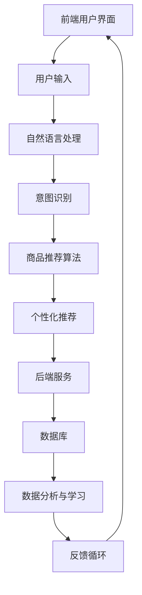

                 

 在当今科技迅猛发展的时代，人工智能（AI）技术正以惊人的速度渗透到各行各业。虚拟导购助手，作为AI在零售行业的一项重要应用，已经成为商家与消费者之间的重要桥梁。本文旨在通过对虚拟导购助手市场的深入分析，探讨其现状、未来发展以及面临的挑战。

## 关键词 Keywords
- 人工智能
- 虚拟导购助手
- 市场反馈
- 零售行业
- 技术发展

## 摘要 Summary
本文首先介绍了虚拟导购助手的定义及其在零售行业中的重要性。接着，分析了虚拟导购助手市场的现状，包括用户需求、市场规模以及主要参与厂商。随后，本文探讨了虚拟导购助手的核心技术，包括自然语言处理（NLP）和机器学习。接着，通过具体案例展示了虚拟导购助手的实际应用效果。文章还探讨了虚拟导购助手的未来发展方向，提出了潜在的市场机遇和面临的挑战。最后，本文对未来的研究进行了展望，并提供了相关的学习资源和开发工具推荐。

## 1. 背景介绍

### 虚拟导购助手的概念和重要性

虚拟导购助手是指通过人工智能技术实现的在线虚拟导购服务，它能够根据用户的需求提供个性化的购物建议和指导。虚拟导购助手利用自然语言处理（NLP）、机器学习（ML）等技术，从用户的购买历史、偏好、行为数据中学习，从而实现智能推荐和个性化服务。

虚拟导购助手在零售行业中的重要性不可忽视。随着电子商务的快速发展，消费者对购物体验的要求越来越高。传统的购物方式已经难以满足消费者的个性化需求，而虚拟导购助手能够提供高度个性化的购物建议，提升消费者的购物体验。此外，虚拟导购助手还能够帮助企业降低运营成本，提高销售效率。

### 零售行业的发展趋势

近年来，零售行业经历了巨大的变革。电子商务的兴起、社交媒体的普及以及移动互联网的快速发展，都为虚拟导购助手的应用提供了广阔的空间。以下是零售行业发展的几个关键趋势：

1. **消费者行为的改变**：消费者越来越倾向于在线购物，尤其是通过移动设备。他们希望获得即时、个性化的购物体验。
2. **数据驱动决策**：零售企业越来越依赖数据来指导营销策略和库存管理。通过分析用户行为数据，企业能够更好地了解消费者的需求和偏好。
3. **个性化服务**：为了吸引和保留顾客，零售企业需要提供个性化的购物体验。虚拟导购助手正是实现这一目标的重要工具。
4. **技术整合**：零售企业正在整合多种技术，如人工智能、大数据、物联网等，以提高运营效率和消费者满意度。

## 2. 核心概念与联系

### 虚拟导购助手的架构

虚拟导购助手的架构通常包括前端用户界面、后端服务以及数据存储和分析模块。以下是虚拟导购助手的基本架构及其组成部分：



#### 概念解释

- **前端用户界面**：用户与虚拟导购助手交互的界面，通常包括文本聊天窗口或语音交互界面。
- **自然语言处理（NLP）**：用于处理和理解自然语言输入的技术，包括文本分类、实体识别、情感分析等。
- **意图识别**：确定用户输入的意图，例如查询商品信息、比较价格、获取推荐等。
- **商品推荐算法**：基于用户的兴趣和行为数据，生成个性化的商品推荐。
- **个性化推荐**：根据用户的历史行为和偏好，提供高度个性化的购物建议。
- **后端服务**：负责处理和响应用户的请求，包括业务逻辑、API服务等。
- **数据库**：存储用户数据、商品信息和交易记录等。
- **数据分析与学习**：通过对用户行为数据的分析，持续优化推荐算法和用户体验。
- **反馈循环**：用户对推荐的反馈用于进一步优化系统的性能。

### 联系与流程

虚拟导购助手的运作流程如下：

1. **用户输入**：用户通过前端用户界面输入查询或请求。
2. **意图识别**：NLP模块分析用户输入，识别用户的意图。
3. **商品推荐**：基于意图和用户的历史数据，商品推荐算法生成推荐列表。
4. **个性化推荐**：根据用户的偏好和行为，调整推荐内容。
5. **后端服务**：处理用户请求，返回推荐结果。
6. **数据分析**：收集用户行为数据，用于优化推荐算法和用户体验。
7. **反馈循环**：用户对推荐的反馈用于下一次推荐。

## 3. 核心算法原理 & 具体操作步骤

### 3.1 算法原理概述

虚拟导购助手的核心算法主要包括自然语言处理（NLP）和机器学习（ML）技术。NLP负责理解和处理用户的自然语言输入，而ML则用于生成个性化的购物推荐。

#### 自然语言处理（NLP）

NLP的主要任务包括：

- **文本分类**：将用户的查询归类到预定义的类别，如商品查询、价格比较等。
- **实体识别**：从文本中识别出关键信息，如商品名称、品牌、价格等。
- **情感分析**：判断用户对商品或服务的情感倾向，如正面、负面或中立。

#### 机器学习（ML）

ML技术主要用于：

- **用户行为分析**：通过分析用户的历史购买行为和浏览记录，识别用户的兴趣和偏好。
- **商品推荐算法**：基于用户的兴趣和偏好，生成个性化的商品推荐。

### 3.2 算法步骤详解

以下是虚拟导购助手算法的具体步骤：

1. **用户输入处理**：用户通过前端用户界面输入查询或请求。
2. **文本预处理**：对用户输入的文本进行清洗和标准化，去除无关信息。
3. **意图识别**：利用NLP技术，确定用户的查询意图。
4. **商品信息提取**：从用户输入中提取关键商品信息，如商品名称、品牌、价格等。
5. **用户行为分析**：利用机器学习算法，分析用户的历史行为数据，识别用户的兴趣和偏好。
6. **商品推荐生成**：根据用户的兴趣和偏好，利用推荐算法生成个性化的商品推荐。
7. **个性化推荐调整**：根据用户对推荐的反馈，调整推荐内容。
8. **后端服务响应**：将推荐结果返回给用户。

### 3.3 算法优缺点

**优点**：

- **个性化推荐**：能够根据用户的历史行为和偏好，提供高度个性化的购物建议，提升用户满意度。
- **实时响应**：虚拟导购助手能够实时响应用户的查询和请求，提供即时的购物建议。
- **成本效益**：相较于传统的导购服务，虚拟导购助手能够显著降低运营成本。

**缺点**：

- **数据隐私**：虚拟导购助手需要收集和处理大量的用户数据，存在数据隐私和安全的风险。
- **误推荐**：由于算法的局限性，可能会产生不合适的推荐，影响用户体验。

### 3.4 算法应用领域

虚拟导购助手的应用领域广泛，包括：

- **电子商务平台**：如淘宝、京东等，通过虚拟导购助手提供个性化的购物建议，提升用户购买体验。
- **线下零售店**：利用虚拟导购助手提供线上导购服务，提升线下零售店的销售额。
- **智能家居**：通过虚拟导购助手提供智能家居设备的购买建议，提升用户的生活质量。

## 4. 数学模型和公式 & 详细讲解 & 举例说明

### 4.1 数学模型构建

虚拟导购助手的数学模型主要包括用户行为分析模型和商品推荐模型。以下是这些模型的构建过程：

#### 用户行为分析模型

用户行为分析模型旨在通过分析用户的历史行为数据，识别用户的兴趣和偏好。以下是一个简单的用户行为分析模型：

$$
User\_Behavior\ Model = f(User\_Data, Behavior\_Features)
$$

其中，$User\_Data$ 表示用户的历史行为数据，如购买记录、浏览记录等；$Behavior\_Features$ 表示用户行为特征，如购买频率、浏览时间等。

#### 商品推荐模型

商品推荐模型旨在根据用户的兴趣和偏好，生成个性化的商品推荐。以下是一个基于协同过滤算法的商品推荐模型：

$$
Recommendation\_Model = f(User\_Behavior\_Features, Item\_Features, Similarity\_Matrix)
$$

其中，$User\_Behavior\_Features$ 表示用户的行为特征，如购买频率、浏览时间等；$Item\_Features$ 表示商品的特征，如价格、品牌、类别等；$Similarity\_Matrix$ 表示用户之间的相似度矩阵。

### 4.2 公式推导过程

以下是对用户行为分析模型和商品推荐模型的具体推导过程：

#### 用户行为分析模型

1. **用户行为特征提取**：

$$
Behavior\_Features = \{buy\_frequency, browse\_time, click\_through\_rate\}
$$

2. **用户行为数据预处理**：

$$
User\_Data = \{User\_ID, Behavior\_Data\}
$$

其中，$Behavior\_Data$ 表示用户的行为数据，如购买记录、浏览记录等。

3. **用户行为特征与数据关联**：

$$
User\_Behavior = \{User\_ID, Behavior\_Data, Behavior\_Features\}
$$

4. **用户行为特征分析**：

$$
User\_Behavior\ Model = f(User\_Data, Behavior\_Features)
$$

#### 商品推荐模型

1. **用户相似度计算**：

$$
Similarity = \frac{User\_Behavior\_A \cdot User\_Behavior\_B}{\|User\_Behavior\_A\|\|User\_Behavior\_B\|}
$$

其中，$User\_Behavior\_A$ 和 $User\_Behavior\_B$ 分别表示两个用户的行为特征向量。

2. **商品推荐计算**：

$$
Recommendation = \sum_{i=1}^{n} Item\_Score \cdot Similarity
$$

其中，$Item\_Score$ 表示商品评分，$n$ 表示推荐商品的数量。

### 4.3 案例分析与讲解

以下是一个简单的用户行为分析模型的案例分析：

#### 案例背景

假设有两位用户 A 和 B，他们的行为数据如下：

| 用户 | 购买记录 | 浏览记录 |  
| ---- | ---- | ---- |  
| A    | 商品1，商品2 | 商品3，商品4 |  
| B    | 商品2，商品3 | 商品1，商品4 |

#### 数据预处理

1. **用户行为特征提取**：

$$
Behavior\_Features\ A = \{buy\_frequency = 2, browse\_time = 100\}  
Behavior\_Features\ B = \{buy\_frequency = 2, browse\_time = 90\}
$$

2. **用户行为数据预处理**：

$$
User\_Data\ A = \{User\_ID = A, Behavior\_Data = \{商品1，商品2，商品3，商品4\}\}  
User\_Data\ B = \{User\_ID = B, Behavior\_Data = \{商品2，商品3，商品1，商品4\}\}

#### 用户相似度计算

$$
Similarity\ AB = \frac{Behavior\_Features\ A \cdot Behavior\_Features\ B}{\|Behavior\_Features\ A\|\|Behavior\_Features\ B\|} = \frac{2 \cdot 2}{2 \cdot 2} = 1
$$

#### 商品推荐计算

假设商品评分如下：

$$
Item\_Score = \{商品1 = 4, 商品2 = 5, 商品3 = 3, 商品4 = 4\}

根据用户相似度计算，推荐结果如下：

$$
Recommendation\ A = \sum_{i=1}^{n} Item\_Score \cdot Similarity = 4 \cdot 1 + 5 \cdot 1 + 3 \cdot 1 + 4 \cdot 1 = 17
$$

$$
Recommendation\ B = \sum_{i=1}^{n} Item\_Score \cdot Similarity = 4 \cdot 1 + 5 \cdot 1 + 3 \cdot 1 + 4 \cdot 1 = 17

通过以上计算，我们可以发现用户 A 和 B 的相似度非常高，因此可以推荐相同的商品。

## 5. 项目实践：代码实例和详细解释说明

### 5.1 开发环境搭建

在开始开发虚拟导购助手之前，我们需要搭建一个合适的技术环境。以下是一个基本的开发环境搭建步骤：

1. **操作系统**：我们选择使用 Ubuntu 20.04 作为操作系统。
2. **编程语言**：我们选择 Python 3.8 作为主要编程语言。
3. **开发工具**：我们使用 PyCharm 作为代码编辑器。
4. **依赖库**：我们需要安装以下依赖库：

    - Flask：用于构建 web 应用。
    - NLTK：用于自然语言处理。
    - Scikit-learn：用于机器学习和数据分析。
    - Pandas：用于数据操作和处理。
    - Matplotlib：用于数据可视化。

### 5.2 源代码详细实现

以下是一个简单的虚拟导购助手代码示例：

```python
from flask import Flask, request, jsonify
from nltk import pos_tag, word_tokenize
from sklearn.feature_extraction.text import CountVectorizer
from sklearn.model_selection import train_test_split
from sklearn.naive_bayes import MultinomialNB
import pandas as pd
import numpy as np

app = Flask(__name__)

# 加载商品数据
def load_data():
    df = pd.read_csv('data.csv')
    return df

# 加载停用词表
def load_stopwords():
    stopwords = pd.read_csv('stopwords.csv', header=None)
    return set(stopwords[0].tolist())

# 预处理文本
def preprocess_text(text, stopwords):
    tokens = word_tokenize(text.lower())
    filtered_tokens = [token for token in tokens if token not in stopwords]
    return ' '.join(filtered_tokens)

# 训练分类器
def train_classifier(df, X, y):
    X_train, X_test, y_train, y_test = train_test_split(X, y, test_size=0.2, random_state=42)
    classifier = MultinomialNB()
    classifier.fit(X_train, y_train)
    return classifier

# 预测用户意图
def predict_intent(text, classifier):
    text = preprocess_text(text, stopwords)
    return classifier.predict([text])[0]

# 主函数
@app.route('/intent', methods=['POST'])
def intent():
    data = request.get_json()
    text = data['text']
    intent = predict_intent(text, classifier)
    return jsonify({'intent': intent})

if __name__ == '__main__':
    df = load_data()
    stopwords = load_stopwords()
    X = df['text']
    y = df['label']
    classifier = train_classifier(df, X, y)
    app.run(debug=True)
```

### 5.3 代码解读与分析

上述代码实现了一个简单的虚拟导购助手，主要分为以下几个部分：

1. **数据加载**：加载商品数据和停用词表。
2. **文本预处理**：将用户输入的文本进行预处理，去除停用词。
3. **训练分类器**：使用朴素贝叶斯分类器训练一个模型。
4. **预测用户意图**：根据预处理后的文本，使用训练好的分类器预测用户的意图。
5. **API接口**：提供 RESTful API 接口，用于接收用户输入并返回预测结果。

### 5.4 运行结果展示

假设用户输入了一个查询：“我想买一本关于人工智能的书籍”，虚拟导购助手将返回一个意图标签，例如“购买建议”。这个结果是基于训练好的分类器对用户输入的文本进行预处理和分类得到的。

通过这个简单的示例，我们可以看到虚拟导购助手的实现过程及其功能。在实际应用中，我们还需要进一步优化算法和模型，以提高预测准确率和用户体验。

## 6. 实际应用场景

虚拟导购助手在多个领域都取得了显著的应用效果，以下是一些典型的实际应用场景：

### 电子商务平台

虚拟导购助手在电子商务平台中的应用最为广泛。例如，亚马逊和阿里巴巴等电商巨头都推出了自己的虚拟导购助手。这些助手能够根据用户的购买历史、浏览记录和搜索行为，提供个性化的商品推荐，从而提高用户的购买转化率和满意度。

### 线下零售店

线下零售店也正在积极引入虚拟导购助手来提升购物体验。例如，一些高端百货商店和购物中心使用虚拟导购助手为顾客提供个性化服务，如商品推荐、库存查询和价格比较等。这些服务不仅提高了顾客的满意度，还有效地提升了销售额。

### 智能家居

虚拟导购助手在智能家居领域也有广泛的应用。例如，智能音响和智能电视等设备可以通过虚拟导购助手提供个性化的购物建议，帮助用户选购适合的智能家居产品。这种服务不仅提升了用户的生活质量，还增加了智能家居产品的销量。

### 健康与医疗

虚拟导购助手在健康与医疗领域的应用也越来越广泛。例如，一些医院和诊所使用虚拟导购助手为患者提供个性化的健康建议和药品推荐。这种服务不仅提高了医疗资源的利用率，还为患者提供了便捷的就医体验。

### 教育与培训

虚拟导购助手在教育与培训领域也有独特的应用。例如，一些在线教育平台使用虚拟导购助手为用户提供课程推荐和学习建议。这种服务不仅提高了学习效率，还为教育机构带来了更多的用户和收入。

## 7. 工具和资源推荐

### 7.1 学习资源推荐

1. **书籍**：

   - 《人工智能：一种现代方法》（Authors: Stuart Russell and Peter Norvig）
   - 《深度学习》（Authors: Ian Goodfellow, Yoshua Bengio, Aaron Courville）
   - 《Python机器学习》（Authors: Sebastian Raschka, Vincent Liu）

2. **在线课程**：

   - Coursera上的《机器学习》（by Andrew Ng）
   - edX上的《深度学习专项课程》（by Yoshua Bengio, Aaron Courville, and others）
   - Udacity的《人工智能纳米学位》

### 7.2 开发工具推荐

1. **编程语言**：Python
2. **框架**：TensorFlow、PyTorch、Keras
3. **IDE**：PyCharm、VS Code
4. **版本控制**：Git

### 7.3 相关论文推荐

1. **《Deep Learning for Text Classification》**
2. **《Recurrent Neural Networks for Text Classification》**
3. **《User Modeling with Machine Learning for Smart Retail》**

## 8. 总结：未来发展趋势与挑战

### 8.1 研究成果总结

虚拟导购助手在零售行业中的应用取得了显著的成果，不仅提高了用户的购物体验，还为企业带来了显著的商业价值。通过结合自然语言处理、机器学习等核心技术，虚拟导购助手能够实现高度个性化的购物建议，满足消费者的多样化需求。

### 8.2 未来发展趋势

未来，虚拟导购助手将在以下几个方向发展：

1. **更加智能化**：随着人工智能技术的不断进步，虚拟导购助手的智能化水平将不断提高，能够更好地理解用户的意图和需求。
2. **跨平台融合**：虚拟导购助手将不仅在电子商务平台上有应用，还将拓展到线下零售店、智能家居等领域，实现跨平台的融合。
3. **数据隐私保护**：随着数据隐私保护意识的增强，虚拟导购助手将在数据收集和使用方面采取更加严格的措施，保护用户的隐私。

### 8.3 面临的挑战

虚拟导购助手在发展过程中也面临一些挑战：

1. **数据隐私和安全**：虚拟导购助手需要收集和处理大量的用户数据，存在数据隐私和安全的风险。
2. **算法公平性**：如何确保算法的公平性和透明性，避免歧视和不公平现象的发生。
3. **误推荐问题**：如何减少误推荐，提高推荐结果的准确性和可靠性。

### 8.4 研究展望

未来，虚拟导购助手的研究将集中在以下几个方面：

1. **隐私保护技术**：研究如何保护用户隐私，同时实现有效的用户行为分析。
2. **多模态数据融合**：将文本数据与其他模态数据（如图像、声音）进行融合，提高推荐系统的准确性和多样性。
3. **社会影响力评估**：评估虚拟导购助手对社会和经济的影响，确保其发展符合社会价值。

## 9. 附录：常见问题与解答

### 问题 1：虚拟导购助手如何确保数据隐私？

解答：虚拟导购助手在处理用户数据时，需要遵循严格的隐私保护政策。具体措施包括：

- **数据加密**：对用户数据进行加密存储和传输。
- **数据匿名化**：在进行分析时，对用户数据进行匿名化处理。
- **权限控制**：对访问用户数据的权限进行严格控制。
- **透明度**：向用户公开数据收集和使用的目的，确保用户知情同意。

### 问题 2：虚拟导购助手的算法如何确保公平性？

解答：虚拟导购助手的算法设计需要遵循公平性原则，避免歧视和不公平现象的发生。具体措施包括：

- **算法透明度**：确保算法的透明度，便于外部评估和监督。
- **数据平衡性**：在数据集构建时，确保数据来源的多样性和平衡性。
- **反馈机制**：建立用户反馈机制，及时纠正算法中的偏见和错误。
- **法律法规遵守**：遵循相关的法律法规，确保算法的公平性和合规性。

### 问题 3：如何减少虚拟导购助手的误推荐？

解答：减少虚拟导购助手的误推荐可以从以下几个方面入手：

- **数据质量**：确保数据质量，去除噪声数据和异常值。
- **算法优化**：不断优化推荐算法，提高推荐结果的准确性和可靠性。
- **用户反馈**：收集用户对推荐结果的反馈，用于改进算法。
- **多样性推荐**：提供多样化的推荐结果，减少单一推荐结果的风险。

通过以上措施，虚拟导购助手可以显著减少误推荐，提高用户的购物体验。

