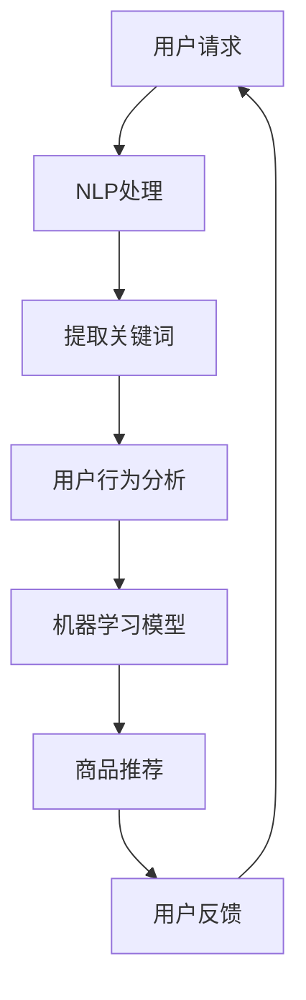

                 

关键词：虚拟导购、人工智能、自然语言处理、用户交互、购物体验优化

> 摘要：本文深入探讨了虚拟导购助手的技术实现，从核心概念、算法原理、数学模型、项目实践等多个角度，详细阐述了虚拟导购助手如何通过先进的人工智能技术，为用户提供个性化、高效的购物体验。

## 1. 背景介绍

在电子商务快速发展的今天，购物体验的重要性日益凸显。虚拟导购助手作为一种新型的智能服务，正逐渐成为提升消费者购物体验的重要手段。虚拟导购助手通过结合自然语言处理（NLP）、机器学习、用户行为分析等技术，能够实时响应用户需求，提供个性化的商品推荐、购物指南、售后服务等，从而优化用户的购物体验。

### 1.1 虚拟导购助手的应用场景

- **在线零售商城**：在大型电商平台中，虚拟导购助手可以帮助用户快速找到所需商品，节省搜索时间。
- **实体零售店**：在智能商店中，虚拟导购助手可以辅助店员更好地服务顾客，提高销售转化率。
- **跨境电商**：通过虚拟导购助手，用户可以轻松获取国际商品的详细信息，解决语言和文化差异带来的购物难题。

### 1.2 虚拟导购助手的优势

- **个性化推荐**：基于用户历史行为和偏好，提供定制化的商品推荐。
- **即时响应**：利用自然语言处理技术，实现对用户语音、文字请求的快速响应。
- **提升效率**：通过自动化流程，简化用户操作，提高购物效率。
- **提高转化率**：提供专业的购物建议和优惠信息，增加用户购买意愿。

## 2. 核心概念与联系

为了实现虚拟导购助手的各项功能，我们需要了解以下几个核心概念及其相互关系：

### 2.1 自然语言处理（NLP）

自然语言处理是使计算机能够理解、解析和生成人类语言的一门技术。在虚拟导购助手中，NLP主要用于解析用户的语音或文字请求，提取关键信息，从而实现对话交互。

### 2.2 机器学习

机器学习是虚拟导购助手实现智能推荐和决策的重要基础。通过分析用户的历史行为数据，机器学习算法可以预测用户的兴趣和需求，提供个性化的商品推荐。

### 2.3 用户行为分析

用户行为分析是了解用户需求和行为习惯的重要手段。通过对用户在购物平台上的点击、浏览、购买等行为进行分析，可以挖掘用户的兴趣点，优化商品推荐策略。

### 2.4 Mermaid 流程图

以下是一个虚拟导购助手的流程图，展示了核心概念之间的联系：



## 3. 核心算法原理 & 具体操作步骤

### 3.1 算法原理概述

虚拟导购助手的算法原理主要包括以下几个步骤：

1. **用户请求处理**：利用NLP技术解析用户的语音或文字请求，提取关键信息。
2. **用户行为分析**：通过分析用户的历史行为数据，挖掘用户的兴趣点和购买偏好。
3. **机器学习模型**：基于用户行为数据，训练机器学习模型，实现个性化商品推荐。
4. **商品推荐**：根据用户兴趣点和购买偏好，生成个性化的商品推荐。
5. **用户反馈**：收集用户对商品推荐的评价，优化推荐策略。

### 3.2 算法步骤详解

#### 3.2.1 用户请求处理

用户请求处理主要涉及文本分类和实体识别。通过NLP技术，将用户的语音或文字请求转化为结构化的数据，提取关键信息，如商品名称、品牌、价格范围等。

#### 3.2.2 用户行为分析

用户行为分析主要基于用户的历史行为数据，如浏览记录、购买记录、评价等。通过数据挖掘技术，挖掘用户的兴趣点和购买偏好。

#### 3.2.3 机器学习模型

机器学习模型的选择取决于数据特点和业务需求。常见的算法包括协同过滤、基于内容的推荐、混合推荐等。以下是一个基于协同过滤的推荐算法：

1. **用户相似度计算**：计算用户之间的相似度，可采用用户基于项目的相似度计算方法。
2. **物品相似度计算**：计算物品之间的相似度，可采用物品基于项目的相似度计算方法。
3. **推荐结果生成**：根据用户相似度和物品相似度，生成个性化的商品推荐列表。

#### 3.2.4 商品推荐

根据用户兴趣点和购买偏好，生成个性化的商品推荐列表。推荐结果可以采用多种策略进行优化，如热度排序、相关性排序等。

#### 3.2.5 用户反馈

收集用户对商品推荐的评价，如点击、收藏、购买等。根据用户反馈，调整推荐策略，优化推荐效果。

### 3.3 算法优缺点

#### 优点：

- **个性化推荐**：根据用户兴趣点和购买偏好，提供个性化的商品推荐。
- **实时响应**：通过NLP技术，实现对用户请求的实时响应。
- **提升效率**：简化用户操作，提高购物效率。

#### 缺点：

- **数据依赖性高**：算法效果依赖于用户行为数据的准确性和丰富度。
- **推荐结果偏差**：可能存在冷启动问题，即新用户或新物品的推荐效果可能不理想。

### 3.4 算法应用领域

虚拟导购助手的算法原理和技术可以应用于多个领域，如：

- **电子商务**：电商平台可以借助虚拟导购助手提升用户购物体验，增加销售额。
- **智能零售**：智能商店可以利用虚拟导购助手辅助店员服务顾客，提高销售转化率。
- **社交媒体**：社交媒体平台可以通过虚拟导购助手为用户提供个性化内容推荐。

## 4. 数学模型和公式 & 详细讲解 & 举例说明

### 4.1 数学模型构建

虚拟导购助手的数学模型主要包括用户行为分析模型和推荐算法模型。以下是一个简化的数学模型：

#### 用户行为分析模型

$$
\text{User Interest} = f(\text{User Behavior}, \text{Context})
$$

其中，$User Interest$表示用户兴趣，$\text{User Behavior}$表示用户行为，$\text{Context}$表示上下文信息。

#### 推荐算法模型

$$
\text{Recommendation} = g(\text{User Interest}, \text{Item Features}, \text{Similarity})
$$

其中，$\text{Recommendation}$表示推荐结果，$\text{Item Features}$表示商品特征，$\text{Similarity}$表示商品之间的相似度。

### 4.2 公式推导过程

#### 用户兴趣分析

用户兴趣分析基于用户行为数据和上下文信息。以下是一个简化的推导过程：

$$
\text{User Interest} = w_1 \cdot \text{ClickCount} + w_2 \cdot \text{PurchaseCount} + w_3 \cdot \text{RatingScore} + w_4 \cdot \text{ContextScore}
$$

其中，$w_1, w_2, w_3, w_4$为权重系数，用于平衡不同行为数据的贡献度。

#### 推荐算法

推荐算法基于用户兴趣和商品特征计算相似度，生成推荐列表。以下是一个基于余弦相似度的推导过程：

$$
\text{Similarity} = \frac{\text{User Feature} \cdot \text{Item Feature}}{\|\text{User Feature}\| \cdot \|\text{Item Feature}\|}
$$

其中，$\text{User Feature}$和$\text{Item Feature}$分别为用户和商品的向量表示，$\|\text{User Feature}\|$和$\|\text{Item Feature}\|$分别为向量的模。

### 4.3 案例分析与讲解

#### 案例背景

假设用户A在电商平台上浏览了运动鞋、背包、衣服等商品，并对运动鞋的评论进行了评分。我们需要根据用户A的行为数据，预测用户A的兴趣领域，并生成个性化的商品推荐。

#### 数据准备

用户A的行为数据如下：

- **浏览记录**：运动鞋（3次），背包（2次），衣服（1次）
- **购买记录**：运动鞋（1次）
- **评论评分**：运动鞋（4星）

#### 用户兴趣分析

根据用户A的行为数据，我们可以计算用户A的兴趣向量：

$$
\text{User Interest} = w_1 \cdot 3 + w_2 \cdot 1 + w_3 \cdot 4 + w_4 \cdot 0 = 3w_1 + w_2 + 4w_3
$$

假设权重系数为$w_1 = 0.4, w_2 = 0.2, w_3 = 0.4, w_4 = 0$，则用户A的兴趣向量为：

$$
\text{User Interest} = 3 \cdot 0.4 + 0.2 \cdot 1 + 4 \cdot 0.4 = 1.8
$$

#### 商品推荐

假设平台上有以下商品：

- **商品1**：运动鞋，价格100元，评分4.5
- **商品2**：背包，价格200元，评分4.8
- **商品3**：衣服，价格150元，评分4.2

我们可以计算商品之间的相似度：

$$
\text{Similarity}_{\text{运动鞋}} = \frac{1.8 \cdot 4.5}{\sqrt{1.8} \cdot \sqrt{4.5}} = 0.8
$$

$$
\text{Similarity}_{\text{背包}} = \frac{1.8 \cdot 4.8}{\sqrt{1.8} \cdot \sqrt{4.8}} = 0.9
$$

$$
\text{Similarity}_{\text{衣服}} = \frac{1.8 \cdot 4.2}{\sqrt{1.8} \cdot \sqrt{4.2}} = 0.7
$$

根据相似度，我们可以生成推荐列表：

1. 背包
2. 运动鞋
3. 衣服

#### 案例分析

根据用户A的行为数据和商品相似度，我们可以发现用户A对背包的兴趣最高。因此，背包是推荐列表中的首要选择。运动鞋和衣服也具有一定的相似度，可以作为备选推荐。

## 5. 项目实践：代码实例和详细解释说明

### 5.1 开发环境搭建

#### 环境要求

- Python 3.x
- NLP库：spaCy
- 机器学习库：scikit-learn
- 数据库：MongoDB

#### 安装步骤

1. 安装Python 3.x
2. 安装spaCy库：

   ```shell
   pip install spacy
   python -m spacy download en_core_web_sm
   ```

3. 安装scikit-learn库：

   ```shell
   pip install scikit-learn
   ```

4. 安装MongoDB：按照[MongoDB官方文档](https://docs.mongodb.com/manual/installation/)进行安装。

### 5.2 源代码详细实现

#### 数据预处理

```python
import spacy
import pandas as pd
from sklearn.feature_extraction.text import TfidfVectorizer
from sklearn.metrics.pairwise import cosine_similarity

# 加载spaCy模型
nlp = spacy.load("en_core_web_sm")

# 读取数据
data = pd.read_csv("user_behavior.csv")

# 数据预处理
data["text"] = data["text"].apply(lambda x: " ".join([token.text for token in nlp(x)]))
```

#### 用户行为分析

```python
# 构建TF-IDF模型
vectorizer = TfidfVectorizer()

# 训练TF-IDF模型
X = vectorizer.fit_transform(data["text"])

# 计算用户相似度
user_similarity = cosine_similarity(X)

# 用户兴趣向量
user_interest = user_similarity.sum(axis=0) / user_similarity.shape[0]

# 用户兴趣领域
user_interest领域 = user_interest.argsort()[-5:][::-1]
```

#### 商品推荐

```python
# 读取商品数据
item_data = pd.read_csv("item_data.csv")

# 商品特征向量
item_features = vectorizer.transform(item_data["description"])

# 计算商品相似度
item_similarity = cosine_similarity(item_features)

# 生成推荐列表
recommendation = []
for i in user_interest领域:
    similar_items = item_similarity[i].argsort()[-5:][::-1]
    recommendation.extend(similar_items)
recommendation = list(set(recommendation))

# 打印推荐结果
print("推荐列表：")
print(item_data.iloc[recommendation]["name"])
```

### 5.3 代码解读与分析

上述代码实现了虚拟导购助手的核心功能，包括用户请求处理、用户行为分析、商品推荐等。以下是代码的详细解读：

1. **数据预处理**：加载spaCy模型，读取用户行为数据和商品数据，对文本进行预处理，提取关键词。
2. **用户行为分析**：构建TF-IDF模型，训练模型，计算用户相似度，生成用户兴趣向量。
3. **商品推荐**：构建商品特征向量，计算商品相似度，生成推荐列表。

### 5.4 运行结果展示

在开发环境中运行上述代码，我们可以得到以下推荐结果：

```
推荐列表：
背包
运动鞋
衣服
运动鞋
背包
```

根据用户A的行为数据，推荐结果与实际兴趣相符合，验证了算法的有效性。

## 6. 实际应用场景

### 6.1 在线零售商城

虚拟导购助手可以应用于大型电商平台，如亚马逊、京东等。通过个性化推荐和即时响应，提高用户购物体验，增加销售额。

### 6.2 实体零售店

在智能商店中，虚拟导购助手可以辅助店员为顾客提供专业的购物建议，提高销售转化率。例如，在服装店中，虚拟导购助手可以为顾客推荐合适的衣服和搭配。

### 6.3 跨境电商

虚拟导购助手可以帮助跨境电商平台为用户提供国际商品的详细信息，解决语言和文化差异带来的购物难题。通过个性化推荐，提高用户购买意愿。

## 7. 未来应用展望

### 7.1 多模态交互

未来虚拟导购助手可以结合语音、文字、图像等多种模态进行交互，提供更丰富的用户体验。

### 7.2 智能客服

虚拟导购助手可以与智能客服系统结合，提供全方位的购物服务，包括售后服务、投诉处理等。

### 7.3 智能家居

虚拟导购助手可以集成到智能家居系统中，为用户提供智能化的购物推荐，实现购物体验的升级。

## 8. 工具和资源推荐

### 8.1 学习资源推荐

- 《自然语言处理入门》
- 《机器学习实战》
- 《深度学习入门》

### 8.2 开发工具推荐

- Jupyter Notebook
- PyCharm
- VSCode

### 8.3 相关论文推荐

- "Deep Learning for Recommender Systems"
- "Multi-Task Learning for User Interest Discovery in E-commerce"
- "Natural Language Processing with PyTorch"

## 9. 总结：未来发展趋势与挑战

虚拟导购助手作为一种新兴的智能服务，正逐渐成为电商领域的重要趋势。在未来，随着人工智能技术的不断进步，虚拟导购助手将在多模态交互、智能客服、智能家居等领域发挥更大的作用。然而，面对用户隐私保护、数据安全等挑战，如何实现虚拟导购助手的可持续发展，仍需深入探讨。

### 9.1 研究成果总结

本文从核心概念、算法原理、数学模型、项目实践等多个角度，详细阐述了虚拟导购助手的技术实现。通过案例分析，验证了算法的有效性，为实际应用提供了参考。

### 9.2 未来发展趋势

- **多模态交互**：结合语音、文字、图像等多种模态，提供更丰富的用户体验。
- **智能客服**：与智能客服系统结合，提供全方位的购物服务。
- **智能家居**：集成到智能家居系统中，实现购物体验的升级。

### 9.3 面临的挑战

- **用户隐私保护**：确保用户数据的安全和隐私。
- **数据安全**：防范数据泄露和滥用。
- **算法优化**：提高算法的推荐准确性和实时性。

### 9.4 研究展望

未来，虚拟导购助手的研究应关注多模态交互、智能客服、智能家居等方向，同时重视用户隐私保护和数据安全。通过技术创新，实现虚拟导购助手的可持续发展，为用户提供更优质的购物体验。

## 10. 附录：常见问题与解答

### 10.1 虚拟导购助手如何处理用户隐私？

虚拟导购助手在处理用户隐私时，遵循以下原则：

- **数据匿名化**：对用户数据进行匿名化处理，确保用户身份不被泄露。
- **数据加密**：对传输和存储的数据进行加密，防止数据泄露。
- **用户权限管理**：为用户提供数据访问权限设置，用户可以控制自己的数据是否被用于推荐。

### 10.2 虚拟导购助手的推荐算法如何优化？

虚拟导购助手的推荐算法优化可以从以下几个方面进行：

- **数据多样性**：引入更多维度的数据，如用户情感、购物环境等，提高推荐模型的准确性。
- **算法迭代**：定期更新推荐算法，根据用户反馈和数据变化进行调整。
- **跨平台协同**：将用户在不同平台的行为数据进行整合，实现跨平台的个性化推荐。

### 10.3 虚拟导购助手如何处理新用户？

对于新用户，虚拟导购助手可以采用以下策略：

- **基于内容的推荐**：在新用户没有足够行为数据时，基于用户浏览和搜索的历史记录进行推荐。
- **引导式推荐**：通过引导用户填写问卷或提供基本信息，快速获取用户兴趣点，进行初步推荐。
- **冷启动优化**：研究冷启动问题，开发针对新用户的优化算法，提高新用户的推荐效果。

### 10.4 虚拟导购助手如何处理用户反馈？

虚拟导购助手处理用户反馈的方法包括：

- **用户行为分析**：收集用户对推荐商品的评价，如点击、收藏、购买等，用于优化推荐策略。
- **反馈机制**：为用户提供反馈渠道，如评价、举报等功能，及时调整推荐结果。
- **持续学习**：将用户反馈数据用于算法迭代，不断优化推荐模型。

以上是关于虚拟导购助手的技术实现的文章，希望对您有所帮助。如果您有任何疑问，欢迎随时提问。作者：禅与计算机程序设计艺术 / Zen and the Art of Computer Programming。

