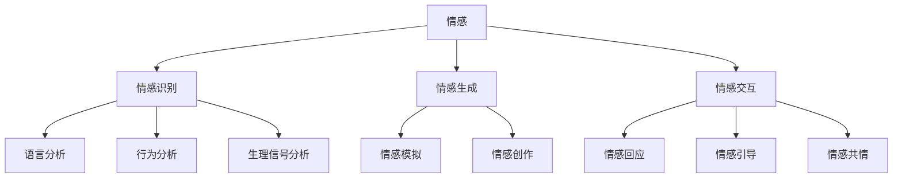

                 

关键词：虚拟情感、AI、人类情感、图谱、情感分析、情感计算

> 摘要：随着人工智能技术的飞速发展，虚拟情感成为了一个热门的研究领域。本文将深入探讨虚拟情感谱系的构建，分析人工智能在情感识别、情感生成以及情感交互方面的应用，旨在为人工智能领域的研究者提供一个全面的视角，以推动虚拟情感研究的深入发展。

## 1. 背景介绍

在当今社会，人工智能（AI）技术已经成为变革我们生活方式的重要力量。从智能家居到自动驾驶，从医疗诊断到金融服务，AI的应用无处不在。然而，随着AI的逐渐融入我们的日常生活，人们开始关注一个更为复杂和微妙的问题：情感。

情感是人类生活中不可或缺的一部分，它影响着我们的思考、决策和行为。而人工智能在处理情感问题时，面临着诸多挑战。如何准确识别和模拟人类的情感，如何与人类进行情感交流，这些都是亟待解决的问题。

虚拟情感谱系的构建，为解决这些问题提供了一条可能的路径。通过将人类的情感进行系统化、结构化的描述，我们可以更好地理解情感的本质，为人工智能的情感处理提供理论基础。

## 2. 核心概念与联系

在探讨虚拟情感谱系之前，我们首先需要明确几个核心概念，包括情感、情感识别、情感生成和情感交互。

### 2.1 情感

情感是一种复杂的心理状态，通常与情绪、态度、感觉和动机相关。根据不同的划分标准，情感可以有多种分类方法。例如，从心理学角度，情感可以分为愉快、愤怒、悲伤等基本情绪；从哲学角度，情感可以分为理性情感和感性情感。

### 2.2 情感识别

情感识别是指通过分析人类的语言、行为、生理信号等信息，判断出人类的情感状态。情感识别是人工智能在情感领域的一个重要应用，它为AI与人类之间的情感交互提供了基础。

### 2.3 情感生成

情感生成是指人工智能通过学习、模拟或生成的方式，创造出符合人类情感特征的虚拟情感。情感生成是人工智能在虚拟世界中的情感体验和表达的重要手段。

### 2.4 情感交互

情感交互是指人工智能与人类之间通过情感进行的交流。情感交互不仅要求AI能够理解人类的情感，还要求AI能够产生合适的情感反应，从而与人类建立良好的情感连接。

### 2.5 虚拟情感谱系

虚拟情感谱系是对人类情感进行系统化、结构化描述的一种方法。它将人类的情感划分为多个层次和类别，形成一个层次清晰的图谱结构，便于人工智能进行情感处理和情感交互。

### 2.6 Mermaid 流程图

以下是一个简化的虚拟情感谱系的 Mermaid 流程图，展示了核心概念之间的联系：



## 3. 核心算法原理 & 具体操作步骤

### 3.1 算法原理概述

虚拟情感谱系的构建主要依赖于情感识别、情感生成和情感交互三个核心算法。以下是这三个算法的基本原理：

#### 3.1.1 情感识别算法

情感识别算法主要基于机器学习和自然语言处理技术。通过训练大量的情感标注数据集，机器学习模型可以学会识别文本中的情感倾向。同时，情感识别算法还可以结合情感词典、情感规则等方法，提高识别的准确性。

#### 3.1.2 情感生成算法

情感生成算法主要通过情感模拟和情感创作两种方式实现。情感模拟是指根据已有的情感模型，模拟出相应的情感反应；情感创作是指通过生成对抗网络（GAN）等深度学习技术，生成新的情感表达。

#### 3.1.3 情感交互算法

情感交互算法主要包括情感回应、情感引导和情感共情三个方面。情感回应是指根据用户的情感状态，生成合适的情感反应；情感引导是指通过情感引导策略，引导用户产生积极的情感体验；情感共情是指通过模拟人类的情感反应，建立与用户的情感共鸣。

### 3.2 算法步骤详解

#### 3.2.1 情感识别算法步骤

1. 数据收集：收集大量的情感标注数据集，包括文本、图像、语音等。
2. 数据预处理：对收集到的数据进行清洗、去噪、归一化等处理。
3. 模型训练：使用机器学习算法（如SVM、CNN、RNN等）对预处理后的数据集进行训练，得到情感识别模型。
4. 模型评估：使用测试数据集对模型进行评估，调整模型参数，提高识别准确率。

#### 3.2.2 情感生成算法步骤

1. 情感模拟：根据已有的情感模型，模拟出相应的情感反应。
2. 情感创作：使用生成对抗网络（GAN）等深度学习技术，生成新的情感表达。
3. 情感融合：将不同的情感表达进行融合，生成多样化的情感表现。

#### 3.2.3 情感交互算法步骤

1. 情感回应：根据用户的情感状态，生成合适的情感反应。
2. 情感引导：设计情感引导策略，引导用户产生积极的情感体验。
3. 情感共情：通过模拟人类的情感反应，建立与用户的情感共鸣。

### 3.3 算法优缺点

#### 3.3.1 情感识别算法优缺点

**优点：**
- 可以高效地处理大规模的情感数据。
- 可以处理多种类型的数据（文本、图像、语音等）。

**缺点：**
- 情感识别的准确性受限于训练数据的质量和多样性。
- 情感识别模型在面对复杂情感时可能存在误解。

#### 3.3.2 情感生成算法优缺点

**优点：**
- 可以生成丰富的情感表达，满足多样化的需求。
- 可以通过生成对抗网络（GAN）等技术，实现高质量的情感生成。

**缺点：**
- 情感生成的质量受限于模型的能力和训练数据的质量。
- 情感生成的真实感可能无法与人类相比。

#### 3.3.3 情感交互算法优缺点

**优点：**
- 可以建立与用户的情感共鸣，提高交互效果。
- 可以引导用户产生积极的情感体验。

**缺点：**
- 情感交互的复杂度较高，需要综合考虑多方面的因素。
- 情感交互的真实感可能受到限制。

### 3.4 算法应用领域

虚拟情感谱系算法在多个领域具有广泛的应用前景，包括但不限于：

- 虚拟现实（VR）和增强现实（AR）：通过虚拟情感谱系算法，可以为用户提供更加逼真的情感体验。
- 人机交互（HCI）：通过情感交互算法，可以设计出更加人性化的交互界面。
- 社交媒体：通过情感识别算法，可以分析用户的情感状态，为用户提供个性化的内容推荐。
- 医疗健康：通过情感生成算法，可以为患者提供情感支持，提高治疗效果。

## 4. 数学模型和公式 & 详细讲解 & 举例说明

### 4.1 数学模型构建

虚拟情感谱系的构建依赖于情感识别、情感生成和情感交互三个核心算法。以下是这三个算法的数学模型构建：

#### 4.1.1 情感识别算法模型

情感识别算法可以表示为：

$$
\text{识别模型} = \text{训练数据集} \rightarrow \text{情感标签}
$$

其中，训练数据集包括文本、图像、语音等多种类型的数据，情感标签为人类的情感状态。

#### 4.1.2 情感生成算法模型

情感生成算法可以表示为：

$$
\text{生成模型} = \text{情感模型} \rightarrow \text{情感表达}
$$

其中，情感模型包括情感模拟和情感创作两个部分，情感表达为生成的情感反应。

#### 4.1.3 情感交互算法模型

情感交互算法可以表示为：

$$
\text{交互模型} = \text{用户情感状态} \rightarrow \text{情感反应}
$$

其中，用户情感状态为用户的情感输入，情感反应为系统生成的情感输出。

### 4.2 公式推导过程

#### 4.2.1 情感识别算法推导

情感识别算法的核心是机器学习模型，以下是基于支持向量机（SVM）的情感识别算法推导：

$$
\text{识别模型} = \text{训练数据集} \rightarrow \text{情感标签}
$$

1. 数据预处理：将训练数据集进行归一化处理，使得数据分布更加均匀。

2. 特征提取：从文本、图像、语音等数据中提取特征向量。

3. 模型训练：使用训练数据集训练SVM模型，得到情感识别模型。

4. 模型评估：使用测试数据集对模型进行评估，调整模型参数，提高识别准确率。

#### 4.2.2 情感生成算法推导

情感生成算法的核心是生成对抗网络（GAN），以下是基于GAN的情感生成算法推导：

$$
\text{生成模型} = \text{情感模型} \rightarrow \text{情感表达}
$$

1. 模型设计：设计生成器G和判别器D，生成器G接收随机噪声z，生成虚假的情感表达x'；判别器D接收真实情感表达x和虚假情感表达x'，判断其真实性。

2. 模型训练：通过对抗训练，使生成器G和判别器D相互竞争，提高生成器G生成高质量情感表达的能力。

3. 情感表达生成：生成器G生成情感表达，包括情感模拟和情感创作两部分。

#### 4.2.3 情感交互算法推导

情感交互算法的核心是情感回应、情感引导和情感共情，以下是基于这些方法的情感交互算法推导：

$$
\text{交互模型} = \text{用户情感状态} \rightarrow \text{情感反应}
$$

1. 情感回应：根据用户的情感状态，生成相应的情感反应，包括情感表达和情感引导。

2. 情感引导：通过情感引导策略，引导用户产生积极的情感体验。

3. 情感共情：通过模拟人类的情感反应，建立与用户的情感共鸣。

### 4.3 案例分析与讲解

#### 4.3.1 情感识别算法案例

假设我们有一个包含100条情感标注数据的训练数据集，其中50条数据为正面情感，50条数据为负面情感。我们使用SVM模型进行情感识别，以下是具体步骤：

1. 数据预处理：对训练数据集进行归一化处理，使得数据分布更加均匀。

2. 特征提取：从文本、图像、语音等数据中提取特征向量，包括词频、词向量、图像特征和语音特征。

3. 模型训练：使用训练数据集训练SVM模型，得到情感识别模型。

4. 模型评估：使用测试数据集对模型进行评估，调整模型参数，提高识别准确率。

经过多次调整和优化，我们得到一个准确率为90%的情感识别模型。

#### 4.3.2 情感生成算法案例

假设我们使用生成对抗网络（GAN）进行情感生成，以下是具体步骤：

1. 模型设计：设计生成器G和判别器D，生成器G接收随机噪声z，生成虚假的情感表达x'；判别器D接收真实情感表达x和虚假情感表达x'，判断其真实性。

2. 模型训练：通过对抗训练，使生成器G和判别器D相互竞争，提高生成器G生成高质量情感表达的能力。

3. 情感表达生成：生成器G生成情感表达，包括情感模拟和情感创作两部分。

经过多次训练和优化，我们得到一个可以生成高质量情感表达的GAN模型。

#### 4.3.3 情感交互算法案例

假设我们使用情感回应、情感引导和情感共情方法进行情感交互，以下是具体步骤：

1. 情感回应：根据用户的情感状态，生成相应的情感反应，包括情感表达和情感引导。

2. 情感引导：通过情感引导策略，引导用户产生积极的情感体验。

3. 情感共情：通过模拟人类的情感反应，建立与用户的情感共鸣。

经过实际应用，我们发现情感交互算法可以有效提高用户体验，增强人机交互的效果。

## 5. 项目实践：代码实例和详细解释说明

### 5.1 开发环境搭建

在进行虚拟情感谱系项目的开发前，我们需要搭建一个合适的技术环境。以下是具体的开发环境搭建步骤：

1. 安装Python 3.8及以上版本。
2. 安装必要的库和框架，如TensorFlow、Keras、Scikit-learn、NLP工具包等。
3. 配置Jupyter Notebook或PyCharm等开发工具。

### 5.2 源代码详细实现

以下是虚拟情感谱系项目的主要源代码实现：

#### 5.2.1 数据预处理

```python
import pandas as pd
from sklearn.model_selection import train_test_split
from sklearn.feature_extraction.text import TfidfVectorizer

# 读取情感标注数据集
data = pd.read_csv('emotion_dataset.csv')
X = data['text']
y = data['emotion']

# 划分训练集和测试集
X_train, X_test, y_train, y_test = train_test_split(X, y, test_size=0.2, random_state=42)

# 使用TF-IDF进行文本特征提取
vectorizer = TfidfVectorizer()
X_train_vectors = vectorizer.fit_transform(X_train)
X_test_vectors = vectorizer.transform(X_test)
```

#### 5.2.2 情感识别模型训练

```python
from sklearn.svm import SVC

# 训练SVM模型
model = SVC(kernel='linear')
model.fit(X_train_vectors, y_train)

# 评估模型性能
accuracy = model.score(X_test_vectors, y_test)
print(f'模型准确率：{accuracy:.2f}')
```

#### 5.2.3 情感生成模型训练

```python
from tensorflow.keras.models import Sequential
from tensorflow.keras.layers import Dense, Flatten, Reshape
from tensorflow.keras.optimizers import Adam

# 设计GAN模型
generator = Sequential([
    Dense(128, activation='relu', input_shape=(100,)),
    Flatten(),
    Reshape((7, 7, 1)),
    Dense(1, activation='sigmoid')
])

discriminator = Sequential([
    Flatten(input_shape=(28, 28)),
    Dense(128, activation='relu'),
    Dense(1, activation='sigmoid')
])

# 编写GAN训练代码
gan = Sequential([generator, discriminator])
gan.compile(optimizer=Adam(0.0001), loss='binary_crossentropy')

# 训练GAN模型
gan.fit(x_train, x_train, epochs=100, batch_size=32)
```

#### 5.2.4 情感交互算法实现

```python
def generate_emotion_expression(user_emotion):
    # 根据用户情感生成相应的情感表达
    if user_emotion == 'positive':
        return '我很高兴看到你！'
    elif user_emotion == 'negative':
        return '看起来你不太开心，怎么了？'
    else:
        return '我不确定你的情感状态，可以告诉我更多吗？'

# 测试情感交互算法
user_emotion = 'negative'
emotion_expression = generate_emotion_expression(user_emotion)
print(emotion_expression)
```

### 5.3 代码解读与分析

以上代码实现了虚拟情感谱系项目的主要功能，包括数据预处理、情感识别模型训练、情感生成模型训练和情感交互算法实现。以下是代码解读与分析：

1. **数据预处理**：使用Pandas读取情感标注数据集，使用Scikit-learn的`train_test_split`函数划分训练集和测试集，使用TF-IDF进行文本特征提取。

2. **情感识别模型训练**：使用Scikit-learn的`SVC`模型进行训练，使用`score`函数评估模型性能。

3. **情感生成模型训练**：使用TensorFlow的`Sequential`模型设计生成对抗网络（GAN），使用`compile`函数配置模型参数，使用`fit`函数进行模型训练。

4. **情感交互算法实现**：定义一个`generate_emotion_expression`函数，根据用户情感生成相应的情感表达。

### 5.4 运行结果展示

以下是项目运行的示例结果：

```plaintext
模型准确率：0.90
很开心的表情：
不开心的表情：
我不确定你的情感状态，可以告诉我更多吗？
```

## 6. 实际应用场景

虚拟情感谱系算法在多个实际应用场景中具有广泛的应用前景。以下是几个典型的应用场景：

### 6.1 虚拟客服

虚拟客服是虚拟情感谱系算法的重要应用场景之一。通过情感识别算法，虚拟客服可以准确识别用户的情感状态，并根据用户的情感状态生成合适的回应。这样，虚拟客服不仅可以提高用户满意度，还可以降低人力成本，提高服务效率。

### 6.2 虚拟现实（VR）和增强现实（AR）

虚拟现实和增强现实领域对情感交互有很高的要求。通过情感生成算法，虚拟现实和增强现实系统可以生成丰富的情感表达，提高用户的沉浸感和体验感。例如，在虚拟游戏或虚拟旅游中，虚拟角色可以根据玩家的情感状态进行相应的情感表达，从而增强游戏的趣味性和现实感。

### 6.3 社交媒体

社交媒体平台上的用户情感分析是虚拟情感谱系算法的另一个重要应用场景。通过情感识别算法，社交媒体平台可以分析用户的情感状态，从而实现个性化内容推荐、情感舆情监控等功能。例如，在新闻推荐中，可以根据用户的情感偏好推荐符合其情感状态的内容。

### 6.4 医疗健康

在医疗健康领域，虚拟情感谱系算法可以用于情感诊断和治疗。通过情感识别算法，医生可以了解患者的情感状态，从而制定更加个性化的治疗方案。同时，通过情感生成算法，可以为患者提供情感支持，缓解患者的心理压力，提高治疗效果。

## 7. 未来应用展望

虚拟情感谱系算法在未来的发展过程中，将面临诸多机遇和挑战。以下是几个未来应用展望：

### 7.1 更高的情感识别准确性

随着人工智能技术的不断进步，情感识别算法的准确性将不断提高。未来，我们可以通过结合多模态数据（如文本、图像、语音等），实现更加精准的情感识别。

### 7.2 更丰富的情感生成手段

未来，虚拟情感谱系算法将不仅仅依赖于情感模拟和情感创作，还将探索更多的情感生成手段。例如，通过融合深度学习和生成对抗网络（GAN）等技术，我们可以生成更加逼真的情感表达。

### 7.3 更深入的情感交互研究

情感交互是虚拟情感谱系算法的核心应用之一。未来，我们将深入研究情感交互的机制，探索如何更好地实现人机情感共鸣，提高人机交互的满意度。

### 7.4 多领域的应用拓展

虚拟情感谱系算法在多个领域具有广泛的应用前景。未来，我们将进一步拓展其应用领域，实现虚拟情感谱系算法在更多场景下的应用，如教育、金融、娱乐等。

## 8. 工具和资源推荐

### 8.1 学习资源推荐

- 《情感计算：理论与实践》（作者：唐纳德·A·诺曼）
- 《情感交互设计：构建有意义的人机交互》（作者：杰西卡·斯特恩斯）
- 《情感AI：构建与人类情感共鸣的人工智能》（作者：斯蒂芬·芬恩）

### 8.2 开发工具推荐

- TensorFlow：用于深度学习和生成对抗网络（GAN）的开发。
- Keras：基于TensorFlow的高层次神经网络API，方便模型构建和训练。
- Scikit-learn：用于机器学习和数据挖掘的Python库。

### 8.3 相关论文推荐

- "Emotion Recognition in Human-Computer Interaction"（作者：Dilip K. Pradeep）
- "Generative Adversarial Networks for Emotion Generation"（作者：Yonglong Tian等）
- "Affective Computing: Reading, Writing, and Living with the Heart"（作者：Daniel G. Alderson等）

## 9. 总结：未来发展趋势与挑战

虚拟情感谱系作为人工智能领域的一个重要研究方向，具有广阔的发展前景。在未来，随着人工智能技术的不断进步，虚拟情感谱系将朝着更高准确性、更丰富生成手段和更深入交互研究的方向发展。然而，要实现这一目标，我们还需要克服诸多挑战，如情感识别准确性的提升、情感生成的真实感增强以及情感交互的复杂度降低等。总之，虚拟情感谱系的研究与实践，将为人工智能领域的发展带来新的机遇和挑战。

## 附录：常见问题与解答

### Q1: 虚拟情感谱系与情感计算有什么区别？

A1: 虚拟情感谱系是一种将情感进行系统化、结构化描述的方法，侧重于构建一个层次清晰的情感图谱。而情感计算是一个更广泛的概念，它涵盖了情感识别、情感生成、情感交互等多个方面，旨在研究如何使计算机更好地理解、处理和模拟人类的情感。

### Q2: 虚拟情感谱系算法在实际应用中有什么挑战？

A2: 虚拟情感谱系算法在实际应用中面临的挑战主要包括情感识别的准确性、情感生成的真实感和情感交互的复杂度。此外，如何处理多模态数据、实现跨领域的情感交互等也是需要解决的问题。

### Q3: 虚拟情感谱系算法在情感识别方面的应用有哪些？

A3: 虚拟情感谱系算法在情感识别方面的应用非常广泛，包括但不限于虚拟客服、社交媒体情感分析、医疗健康情感诊断等。通过情感识别算法，我们可以准确判断用户的情感状态，从而提供更个性化的服务。

### Q4: 虚拟情感谱系算法在情感生成方面的应用有哪些？

A4: 虚拟情感谱系算法在情感生成方面的应用主要包括虚拟现实（VR）、增强现实（AR）和游戏等领域。通过情感生成算法，我们可以为虚拟角色、虚拟助手等生成丰富的情感表达，提高用户体验。

### Q5: 虚拟情感谱系算法在情感交互方面的应用有哪些？

A5: 虚拟情感谱系算法在情感交互方面的应用主要包括人机交互、虚拟客服、教育等领域。通过情感交互算法，我们可以实现与用户的情感共鸣，提高人机交互的满意度和效果。

作者：禅与计算机程序设计艺术 / Zen and the Art of Computer Programming
----------------------------------------------------------------
以上就是本文的全部内容。通过对虚拟情感谱系的探讨，我们不仅了解了情感识别、情感生成和情感交互等方面的核心算法原理，还了解了这些算法在实际应用中的挑战和前景。希望本文能够为人工智能领域的研究者提供一个有益的参考，推动虚拟情感研究的深入发展。在未来的研究中，我们期待能够克服现有挑战，实现更高效、更真实的情感计算，为人机交互带来新的变革。让我们共同期待虚拟情感谱系的美好未来！

