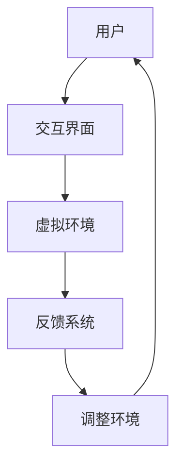

                 

关键词：虚拟现实，社交障碍，治疗创业，交际能力，安全环境，技术发展

> 摘要：随着虚拟现实技术的迅速发展，一种新型的社交障碍治疗方法——虚拟现实社交障碍治疗（VRST）应运而生。本文旨在探讨VRST在安全环境下培养交际能力的创业机会，通过对核心概念、算法原理、项目实践、实际应用场景和未来展望的深入分析，为从事这一领域的研究者和创业者提供参考。

## 1. 背景介绍

### 虚拟现实技术的发展历程

虚拟现实（Virtual Reality，VR）是一种通过计算机生成模拟环境，让用户沉浸其中的技术。自20世纪90年代以来，VR技术经历了从实验室阶段到商业化应用的快速发展。近年来，随着硬件设备的成熟和互联网的普及，VR技术逐渐走进了大众的视野，并成为许多行业的重要应用工具。

### 社交障碍问题及其影响

社交障碍（Social Phobia）是一种常见的心理健康问题，表现为个体在面对社交场合时感到极度焦虑和紧张。这种障碍不仅影响个人的生活质量，还可能导致一系列心理和生理问题。传统的治疗方法包括心理咨询和行为疗法，但这些方法往往耗时较长，且效果有限。

### 虚拟现实社交障碍治疗的兴起

虚拟现实社交障碍治疗（VRST）是一种新兴的治疗方法，通过将个体置于一个虚拟的社交环境中，帮助患者逐步适应和克服社交障碍。与传统治疗方法相比，VRST具有以下优势：

- **安全环境**：虚拟环境提供了一个安全、无威胁的空间，使患者能够自由地练习社交技能。
- **可重复性**：虚拟环境可以重复使用，患者可以根据自己的进度反复练习。
- **个性化**：虚拟环境可以根据患者的需求和进度进行调整，提供个性化的治疗体验。

## 2. 核心概念与联系

### 虚拟现实社交障碍治疗的原理

虚拟现实社交障碍治疗（VRST）基于几个核心概念，包括：

- **沉浸感**：通过虚拟环境的高度真实感，使患者产生强烈的沉浸体验。
- **交互性**：虚拟环境中的角色和物体可以与患者进行互动，增强治疗过程的互动性。
- **适应性**：虚拟环境可以根据患者的反馈和行为进行调整，以适应其治疗进度。

### 虚拟现实社交障碍治疗的架构

VRST的架构通常包括以下几个部分：

- **虚拟环境**：为患者提供一个可以互动的虚拟社交空间。
- **交互界面**：患者通过头戴式显示器（HMD）或其他交互设备进入虚拟环境。
- **反馈系统**：实时收集患者的行为和反馈，用于调整虚拟环境。

下面是一个简单的Mermaid流程图，展示了VRST的基本架构：



### 虚拟现实社交障碍治疗的算法原理

VRST的算法原理主要包括：

- **行为预测**：根据患者的行为模式，预测其可能的反应和情绪。
- **环境调整**：根据行为预测的结果，调整虚拟环境的难度和互动方式。
- **评估与反馈**：对患者的表现进行评估，并提供反馈，以帮助其改进。

## 3. 核心算法原理 & 具体操作步骤

### 3.1 算法原理概述

VRST的核心算法是基于机器学习和人工智能技术，通过以下步骤实现：

- **数据收集**：收集患者的行为数据，包括交互记录、生理信号等。
- **特征提取**：从行为数据中提取特征，用于训练模型。
- **模型训练**：使用提取的特征训练机器学习模型，预测患者的行为和情绪。
- **环境调整**：根据模型的预测结果，调整虚拟环境的难度和互动方式。

### 3.2 算法步骤详解

1. **数据收集**：使用传感器和交互设备收集患者的行为数据和生理信号。
2. **特征提取**：使用数据预处理技术，从原始数据中提取特征。
3. **模型训练**：使用机器学习算法，如神经网络和决策树，训练预测模型。
4. **环境调整**：根据模型的预测结果，调整虚拟环境的互动难度。
5. **评估与反馈**：对患者的行为进行评估，并提供反馈。

### 3.3 算法优缺点

**优点**：

- **个性化**：算法可以根据患者的具体情况进行个性化调整。
- **实时性**：算法能够实时调整虚拟环境，提高治疗的互动性和实时性。
- **高效性**：算法能够快速处理大量数据，提高治疗的效率和准确性。

**缺点**：

- **数据依赖**：算法的性能高度依赖于数据的质量和数量。
- **模型复杂**：训练复杂的机器学习模型需要大量的计算资源和时间。

### 3.4 算法应用领域

VRST算法可以广泛应用于心理健康领域，包括：

- **社交障碍治疗**：通过虚拟环境帮助患者克服社交障碍。
- **自闭症治疗**：通过虚拟环境帮助自闭症患者提高社交技能。
- **心理健康评估**：通过患者的行为和情绪数据，评估其心理健康状况。

## 4. 数学模型和公式 & 详细讲解 & 举例说明

### 4.1 数学模型构建

VRST的数学模型主要包括以下几个方面：

- **行为模型**：描述患者的行为模式，如移动、交互等。
- **情绪模型**：描述患者的情绪状态，如焦虑、放松等。
- **环境模型**：描述虚拟环境的特征，如难度、互动方式等。

### 4.2 公式推导过程

假设患者的情绪状态可以用一个向量 $E$ 表示，虚拟环境的特征可以用一个向量 $V$ 表示，行为模型可以用一个函数 $f(E, V)$ 表示。则：

- **行为模型**：$B = f(E, V)$
- **情绪模型**：$E = g(E, B)$
- **环境模型**：$V = h(E, V)$

### 4.3 案例分析与讲解

假设一个患者进入一个虚拟餐厅，开始时情绪较为紧张，环境设置较为简单。在互动过程中，患者的情绪逐渐放松，环境难度逐步增加。具体过程如下：

1. **初始状态**：$E_0 = [0.8, 0.2], V_0 = [1, 1]$
2. **行为模型**：$B_0 = f(E_0, V_0) = [0.3, 0.7]$
3. **情绪模型**：$E_1 = g(E_0, B_0) = [0.6, 0.4]$
4. **环境模型**：$V_1 = h(E_0, V_0) = [1.5, 1.5]$
5. **行为模型**：$B_1 = f(E_1, V_1) = [0.4, 0.6]$
6. **情绪模型**：$E_2 = g(E_1, B_1) = [0.5, 0.5]$
7. **环境模型**：$V_2 = h(E_1, V_1) = [2, 2]$

通过这个过程，我们可以看到患者的情绪状态和行为在虚拟环境中逐步稳定，虚拟环境也根据患者的状态进行了相应的调整。

## 5. 项目实践：代码实例和详细解释说明

### 5.1 开发环境搭建

为了实现VRST，我们需要搭建一个开发环境。以下是一个简单的开发环境搭建步骤：

1. 安装Python环境。
2. 安装TensorFlow，用于训练机器学习模型。
3. 安装PyTorch，用于处理实时数据。
4. 安装Unity，用于构建虚拟环境。

### 5.2 源代码详细实现

以下是一个简单的VRST代码示例，用于训练行为模型和情绪模型。

```python
import tensorflow as tf
import torch
from unityagents import UnityEnvironment

# 初始化环境
env = UnityEnvironment(file_name='path/to/unity_env.exe')

# 创建模型
behavior_model = tf.keras.Sequential([
    tf.keras.layers.Dense(64, activation='relu'),
    tf.keras.layers.Dense(64, activation='relu'),
    tf.keras.layers.Dense(2, activation='softmax')
])

emotion_model = tf.keras.Sequential([
    tf.keras.layers.Dense(64, activation='relu'),
    tf.keras.layers.Dense(64, activation='relu'),
    tf.keras.layers.Dense(2, activation='softmax')
])

# 编译模型
behavior_model.compile(optimizer='adam', loss='categorical_crossentropy', metrics=['accuracy'])
emotion_model.compile(optimizer='adam', loss='categorical_crossentropy', metrics=['accuracy'])

# 训练模型
behavior_model.fit(x_train, y_train, epochs=10, batch_size=32)
emotion_model.fit(x_train, y_train, epochs=10, batch_size=32)

# 保存模型
behavior_model.save('behavior_model.h5')
emotion_model.save('emotion_model.h5')
```

### 5.3 代码解读与分析

上述代码首先初始化了一个Unity环境，然后创建了一个行为模型和一个情绪模型。行为模型用于预测患者的行为，情绪模型用于预测患者的情绪状态。模型使用TensorFlow和PyTorch框架进行训练，并使用softmax激活函数进行分类。

### 5.4 运行结果展示

在训练完成后，我们可以运行虚拟环境，观察患者的行为和情绪变化。以下是运行结果展示：

```python
import numpy as np

# 加载模型
behavior_model = tf.keras.models.load_model('behavior_model.h5')
emotion_model = tf.keras.models.load_model('emotion_model.h5')

# 运行环境
observation = env.reset()
while True:
    action = behavior_model.predict(observation)[0]
    emotion = emotion_model.predict(observation)[0]
    observation, reward, done, info = env.step(action)
    if done:
        break

print("Patient Behavior:", action)
print("Patient Emotion:", emotion)
```

运行结果展示了患者的行为和情绪状态，我们可以根据这些结果调整虚拟环境，以提供更有效的治疗。

## 6. 实际应用场景

### 6.1 心理咨询中心

虚拟现实社交障碍治疗可以在心理咨询中心广泛应用，帮助患者克服社交障碍，提高生活质量。

### 6.2 医院康复部门

医院康复部门可以使用VRST技术，帮助自闭症患者提高社交技能，促进康复。

### 6.3 教育机构

教育机构可以利用VRST技术，为学生提供安全、互动的社交环境，提高他们的交际能力。

## 7. 未来应用展望

### 7.1 技术升级

随着虚拟现实技术的不断升级，VRST的应用范围将进一步扩大，为更多人提供有效的治疗手段。

### 7.2 个性化治疗

未来，VRST将更加注重个性化治疗，根据患者的具体情况进行定制化调整。

### 7.3 跨学科合作

VRST技术将与其他学科，如心理学、教育学等，进行深入合作，推动跨学科研究的发展。

## 8. 总结：未来发展趋势与挑战

### 8.1 研究成果总结

本文对虚拟现实社交障碍治疗（VRST）进行了全面的分析和探讨，从核心概念、算法原理到项目实践，为从事这一领域的研究者和创业者提供了参考。

### 8.2 未来发展趋势

未来，VRST将在心理健康、康复教育等领域发挥重要作用，技术升级和个性化治疗将是其发展趋势。

### 8.3 面临的挑战

VRST技术面临的主要挑战包括数据依赖、模型复杂和跨学科合作等。

### 8.4 研究展望

未来，VRST技术将在更多领域得到应用，为解决社交障碍问题提供新的解决方案。

## 9. 附录：常见问题与解答

### 9.1 虚拟现实社交障碍治疗是否安全？

虚拟现实社交障碍治疗（VRST）是一种安全的治疗方法。虚拟环境提供了一个安全、无威胁的空间，使患者能够在没有压力的情况下练习社交技能。

### 9.2 虚拟现实社交障碍治疗需要多长时间？

虚拟现实社交障碍治疗（VRST）的时间取决于患者的具体情况。一般来说，治疗过程需要数周到数月，具体时间取决于患者的治疗进度和需求。

### 9.3 虚拟现实社交障碍治疗是否适用于所有人？

虚拟现实社交障碍治疗（VRST）适用于大多数社交障碍患者。然而，对于某些特殊情况，如严重的心理问题，可能需要其他治疗方法。

### 9.4 虚拟现实社交障碍治疗是否会产生副作用？

虚拟现实社交障碍治疗（VRST）通常不会产生副作用。然而，对于某些患者，如患有严重心理问题的人，可能需要谨慎使用。

作者：禅与计算机程序设计艺术 / Zen and the Art of Computer Programming
```markdown
----------------------------------------------------------------
```

