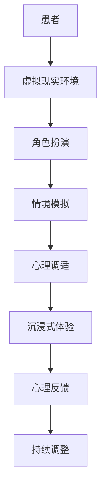

                 

 **关键词**：虚拟现实、角色扮演治疗、沉浸式心理调适、创业心理、虚拟治疗、沉浸式体验、心理健康

**摘要**：
随着虚拟现实技术的不断成熟，虚拟现实（VR）在心理健康领域中的应用逐渐受到关注。本文探讨了虚拟现实角色扮演治疗在创业心理调适中的应用，介绍了沉浸式心理调适的概念，分析了虚拟现实在心理治疗中的优势，并提供了具体的实施步骤和实际案例，为心理健康领域和创业者提供了新的思路和方法。

## 1. 背景介绍

### 虚拟现实技术概述

虚拟现实（Virtual Reality，VR）是一种通过计算机模拟实现的、沉浸式的三维环境。VR技术利用计算机图形系统和传感器技术，创造出一个逼真的三维空间，用户通过头戴显示器（Head-Mounted Display，HMD）和手柄等设备，可以在这个虚拟空间中自由移动、互动，体验到高度的沉浸感。

VR技术的发展可以追溯到20世纪60年代的模拟技术，但真正引起广泛关注的是20世纪90年代后期随着图形处理能力的提升和互联网的普及。进入21世纪，VR技术得到了迅猛发展，不仅应用于游戏娱乐领域，还在医疗、教育、设计等多个领域展现出了巨大的潜力。

### 心理健康领域中的虚拟现实应用

在心理健康领域，虚拟现实技术已被广泛应用于治疗焦虑症、恐惧症、创伤后应激障碍（PTSD）等心理问题。通过虚拟现实环境，患者可以安全地模拟和面对他们害怕的情境，逐步消除恐惧和焦虑。

例如，恐惧飞行症患者可以在VR环境中模拟飞行过程，逐渐适应飞行中的不适感。创伤后应激障碍患者可以通过VR重现创伤事件，进行暴露治疗，从而减轻创伤记忆的影响。

此外，虚拟现实还被用于心理评估和诊断，如虚拟现实认知测试（Virtual Reality Cognitive Test，VRCT）等，通过虚拟环境评估患者的认知能力、情绪状态和行为反应。

### 创业心理与心理健康

创业是一项充满挑战和压力的任务。创业者需要面对市场竞争、资金压力、团队管理等多重挑战，常常伴随着焦虑、抑郁、失眠等心理健康问题。因此，针对创业者的心理调适和心理健康维护变得尤为重要。

创业过程中的压力源包括但不限于：

1. **市场不确定性**：市场环境变化迅速，创业者需要不断调整战略以应对变化。
2. **资金压力**：资金短缺是创业过程中最常见的挑战之一，创业者往往需要寻求外部投资或贷款。
3. **团队管理**：创业者需要管理团队，协调各种人际关系，解决内部冲突。
4. **自我期望**：创业者往往对自己有较高的期望，希望尽快取得成功。

这些压力源会对创业者的心理健康产生负面影响，影响创业效率和成功率。因此，有效调适心理状态，维护心理健康，对创业者来说至关重要。

## 2. 核心概念与联系

### 虚拟现实角色扮演治疗

虚拟现实角色扮演治疗（Virtual Reality Role-Playing Therapy，VR-RPT）是一种利用虚拟现实技术，让患者在一个安全、受控的虚拟环境中进行角色扮演和情境模拟的心理治疗方法。通过虚拟现实环境，患者可以安全地尝试和处理现实生活中遇到的困难情境，提高情绪调节能力和解决问题的能力。

### 沉浸式心理调适

沉浸式心理调适（Immersive Psychological Adjustment）是指通过虚拟现实技术创造高度沉浸的环境，帮助个体进行心理调适的过程。这种调适过程不仅包括应对压力、焦虑和抑郁等负面情绪，还可以用于增强自信心、提升情绪管理和解决问题的能力。

### VR-RPT与沉浸式心理调适的联系

虚拟现实角色扮演治疗与沉浸式心理调适之间存在紧密的联系。VR-RPT利用虚拟现实技术创造一个沉浸式的环境，让患者在这个环境中进行角色扮演和情境模拟，从而实现心理调适。沉浸式心理调适则强调通过高度沉浸的虚拟环境，帮助个体实现心理上的适应和调整。

### Mermaid 流程图



在上述流程图中，患者通过虚拟现实环境进行角色扮演和情境模拟，体验沉浸式体验，并在心理反馈过程中进行持续的心理调适。

## 3. 核心算法原理 & 具体操作步骤

### 3.1 算法原理概述

虚拟现实角色扮演治疗的算法原理主要基于以下几个核心概念：

1. **情境模拟**：通过虚拟现实技术模拟患者现实生活中遇到的各种情境，帮助患者面对和处理这些情境。
2. **情绪调节**：通过虚拟环境中的互动和反馈，帮助患者学会情绪调节方法，提高应对压力和焦虑的能力。
3. **认知重构**：通过角色扮演，帮助患者重新审视自己的认知和行为模式，进行认知重构。

### 3.2 算法步骤详解

#### 步骤1：情境创建

在开始虚拟现实角色扮演治疗前，首先需要创建一个逼真的虚拟环境。这个虚拟环境需要包括患者可能遇到的各种情境，如会议讨论、团队协作、产品演示等。情境创建的过程通常包括以下步骤：

1. **需求分析**：了解患者的具体需求，确定需要模拟的情境类型和内容。
2. **场景设计**：根据需求分析的结果，设计虚拟环境中的场景，包括建筑风格、室内布置、人物角色等。
3. **编程实现**：使用虚拟现实开发工具，如Unity或Unreal Engine，实现虚拟环境的编程和搭建。

#### 步骤2：角色创建

在虚拟环境中创建角色，这些角色可以是患者自己，也可以是其他人物。角色创建的过程通常包括以下步骤：

1. **角色设计**：根据患者的需求，设计角色的外观、性格和背景故事。
2. **角色编程**：使用人工智能技术，为角色编写行为和互动逻辑，使其能够与现实中的患者进行互动。

#### 步骤3：情境模拟

将患者放入虚拟环境中，开始情境模拟。情境模拟的过程通常包括以下步骤：

1. **情境启动**：启动虚拟环境，患者进入角色扮演状态。
2. **互动互动**：患者在虚拟环境中与其他角色互动，处理情境中的各种问题和挑战。
3. **反馈收集**：收集患者在情境模拟过程中的行为和情绪数据，用于后续分析和调整。

#### 步骤4：情绪调节

在情境模拟过程中，通过虚拟环境的互动和反馈，帮助患者进行情绪调节。情绪调节的过程通常包括以下步骤：

1. **情绪监测**：使用生理传感器和面部识别技术，监测患者的情绪状态。
2. **情绪反馈**：根据患者的情绪状态，提供实时反馈，帮助患者识别和调节情绪。
3. **认知重构**：通过角色扮演和情境模拟，帮助患者重新审视自己的认知和行为模式，进行认知重构。

#### 步骤5：评估与调整

对虚拟现实角色扮演治疗的效果进行评估，并根据评估结果进行必要的调整。评估与调整的过程通常包括以下步骤：

1. **效果评估**：评估患者在治疗过程中的情绪变化、行为表现和认知重构情况。
2. **结果分析**：分析评估结果，确定治疗的有效性和不足之处。
3. **调整方案**：根据分析结果，调整虚拟环境中的情境设置、角色互动和情绪反馈策略。

### 3.3 算法优缺点

#### 优点

1. **高度沉浸性**：虚拟现实技术创造了一个逼真的虚拟环境，使患者能够完全沉浸在情境中，提高治疗的实效性。
2. **安全可控**：虚拟现实环境是一个安全、受控的环境，患者可以在没有风险的情况下尝试和处理现实生活中遇到的困难情境。
3. **灵活调整**：虚拟环境可以根据患者的需求和反馈进行灵活调整，提高治疗的个性化程度。
4. **成本效益**：相比于传统的心理治疗，虚拟现实角色扮演治疗具有更高的成本效益，降低了治疗成本。

#### 缺点

1. **技术依赖性**：虚拟现实角色扮演治疗依赖于高精度的计算机技术和传感器设备，对技术和设备的要求较高。
2. **体验差异性**：不同患者的体验感受可能存在较大差异，需要针对不同患者进行个性化的调整。
3. **隐私风险**：虚拟现实环境中的数据安全和隐私保护是一个重要问题，需要采取有效的措施确保患者数据的安全。

### 3.4 算法应用领域

虚拟现实角色扮演治疗在心理健康领域的应用范围广泛，包括但不限于以下领域：

1. **焦虑症治疗**：通过虚拟现实技术模拟患者害怕的情境，帮助患者逐步克服焦虑症状。
2. **恐惧症治疗**：针对特定的恐惧症，如恐惧飞行、恐惧社交等，通过虚拟现实技术进行情境模拟和暴露治疗。
3. **创伤后应激障碍治疗**：通过虚拟现实技术重现创伤事件，帮助患者进行暴露治疗和认知重构。
4. **创业心理调适**：通过虚拟现实技术模拟创业过程中的各种情境，帮助创业者进行心理调适和压力管理。
5. **心理评估与诊断**：利用虚拟现实技术进行心理测试和评估，为心理治疗提供科学依据。

## 4. 数学模型和公式 & 详细讲解 & 举例说明

### 4.1 数学模型构建

虚拟现实角色扮演治疗的数学模型主要涉及以下几个方面：

1. **情境建模**：使用情境图（Scenario Graph）对虚拟环境中的各种情境进行建模，描述情境之间的关系和变化。
2. **角色建模**：使用状态转移图（State Transition Graph）对虚拟环境中的角色行为进行建模，描述角色的行为模式和行为转换。
3. **情绪建模**：使用情绪空间模型（Emotional Space Model）对患者的情绪状态进行建模，描述情绪的变化和调节过程。

### 4.2 公式推导过程

以下是一个简化的情绪调节公式的推导过程：

\[ E_{new} = f(E_{current}, I_{input}) \]

其中：

- \( E_{new} \) 表示新情绪状态。
- \( E_{current} \) 表示当前情绪状态。
- \( I_{input} \) 表示情绪输入。

情绪输入 \( I_{input} \) 可以来自外部环境（如情境变化）或内部感受（如生理反应）。情绪调节函数 \( f \) 可以表示为：

\[ f(E_{current}, I_{input}) = E_{current} + \alpha \cdot I_{input} \]

其中：

- \( \alpha \) 表示情绪调节系数，用于调节情绪输入对当前情绪状态的影响。

### 4.3 案例分析与讲解

假设一个创业者面临团队冲突的情境，当前情绪状态为焦虑（\( E_{current} = 0.8 \)），情绪输入为冲突加剧（\( I_{input} = -0.3 \)）。根据上述公式，可以计算出新的情绪状态：

\[ E_{new} = 0.8 + \alpha \cdot (-0.3) \]

其中，\( \alpha \) 可以根据实际情况进行调整。假设 \( \alpha = 0.5 \)，则新的情绪状态为：

\[ E_{new} = 0.8 - 0.15 = 0.65 \]

这意味着，通过虚拟现实角色扮演治疗，创业者的情绪状态有所缓解，焦虑感降低。在实际应用中，可以通过多次模拟和情绪调节，帮助创业者更好地应对团队冲突，提高情绪调节能力。

## 5. 项目实践：代码实例和详细解释说明

### 5.1 开发环境搭建

在进行虚拟现实角色扮演治疗的开发过程中，首先需要搭建一个适合的开发环境。以下是一个基于Unity引擎的开发环境搭建步骤：

1. **安装Unity Hub**：从Unity官网下载并安装Unity Hub，用于管理Unity版本和项目。
2. **创建新项目**：在Unity Hub中创建一个新的3D项目，选择适合的Unity版本和项目模板。
3. **安装必要插件**：安装必要的插件，如Unity XR插件（用于虚拟现实开发）和行为树插件（用于角色行为控制）。
4. **配置虚拟现实设备**：连接虚拟现实设备（如Oculus Quest或HTC Vive），在Unity编辑器中进行设备配置和调试。

### 5.2 源代码详细实现

以下是一个虚拟现实角色扮演治疗的源代码实现示例，主要包括角色创建、情境模拟和情绪调节三个部分：

```csharp
using UnityEngine;
using UnityEngine.XR;

public class VRRolePlaying : MonoBehaviour
{
    // 角色控制变量
    public GameObject player;
    public GameObject npc;

    // 情境控制变量
    public string[] scenarios = { "Meeting", "Team Conflict", "Product Presentation" };
    private int currentScenario = 0;

    // 情绪调节变量
    private float currentEmotion = 0.5f;
    private float emotionChange = 0.1f;

    // 初始化
    void Start()
    {
        // 创建玩家和NPC角色
        player = Instantiate(player, Vector3.zero, Quaternion.identity);
        npc = Instantiate(npc, Vector3.zero, Quaternion.identity);

        // 初始化情境
        SetScenario(scenarios[currentScenario]);
    }

    // 更新
    void Update()
    {
        // 情绪调节
        currentEmotion += emotionChange * Time.deltaTime;
        currentEmotion = Mathf.Clamp(currentEmotion, 0, 1);

        // 输出情绪状态
        Debug.Log("Current Emotion: " + currentEmotion);
    }

    // 设置情境
    private void SetScenario(string scenario)
    {
        // 根据情境更新场景
        switch (scenario)
        {
            case "Meeting":
                // 更新会议场景
                break;
            case "Team Conflict":
                // 更新团队冲突场景
                break;
            case "Product Presentation":
                // 更新产品演示场景
                break;
        }
    }
}
```

### 5.3 代码解读与分析

上述代码实现了一个简单的虚拟现实角色扮演治疗场景，主要包括角色控制、情境模拟和情绪调节三个部分。

1. **角色控制**：代码中定义了玩家角色（player）和NPC角色（npc）的变量，通过Instantiate函数创建角色实例。角色创建后，可以根据需要进行位置和旋转的调整。
2. **情境模拟**：代码中定义了一个字符串数组（scenarios）用于存储不同的情境，通过SetScenario函数切换不同的情境。在实际应用中，可以根据情境类型进行相应的场景更新和交互处理。
3. **情绪调节**：代码中定义了一个当前情绪状态（currentEmotion）和一个情绪变化量（emotionChange）。在Update函数中，通过线性调整当前情绪状态，实现情绪的动态变化。情绪状态的变化可以通过调试输出进行监控。

### 5.4 运行结果展示

在Unity编辑器中运行上述代码，可以看到玩家角色和NPC角色在虚拟环境中互动。通过情境切换，玩家可以体验到不同的情境场景。同时，情绪调节功能可以实时监控和调整当前情绪状态，帮助玩家更好地应对情境挑战。

### 5.5 总结与展望

虚拟现实角色扮演治疗在心理健康领域具有巨大的潜力。通过本文的代码实例和详细解释，我们可以看到虚拟现实技术如何应用于心理健康治疗。然而，虚拟现实角色扮演治疗仍面临一些挑战，如技术实现复杂度、用户体验差异性等。未来，随着虚拟现实技术的不断发展和完善，虚拟现实角色扮演治疗有望在更广泛的应用领域发挥作用，为心理健康领域带来更多创新和突破。

## 6. 实际应用场景

虚拟现实角色扮演治疗在创业心理调适中的应用已经得到了初步验证，并在多个实际场景中展现出显著效果。以下是一些具体的实际应用场景：

### 6.1 创业焦虑治疗

创业者在面对市场不确定性、资金压力和团队管理等问题时，常常会感到焦虑和紧张。通过虚拟现实角色扮演治疗，创业者可以在一个安全、受控的环境中模拟这些情境，逐步适应和处理焦虑情绪。例如，创业者可以在虚拟环境中模拟团队会议，练习如何应对冲突和压力，从而提高情绪调节能力和解决问题的能力。

### 6.2 创业压力管理

创业过程中的压力管理是创业者心理健康的重要组成部分。虚拟现实角色扮演治疗可以通过模拟不同的压力情境，帮助创业者学会有效的压力管理方法。例如，创业者可以在虚拟环境中模拟资金短缺的情境，学习如何合理分配资源、寻找外部投资或调整经营策略，从而更好地应对创业压力。

### 6.3 创业团队协作

团队协作是创业成功的关键因素之一。虚拟现实角色扮演治疗可以帮助创业者模拟团队协作的情境，提高团队沟通和协作能力。例如，创业者可以在虚拟环境中参与团队协作项目，通过互动和反馈，学会如何更好地协调团队成员、解决内部冲突，从而提高团队协作效率。

### 6.4 创业自我认知

创业者的自我认知对其创业行为和心理健康具有重要影响。虚拟现实角色扮演治疗可以通过模拟不同的角色和情境，帮助创业者重新审视自己的认知和行为模式，进行自我认知和调整。例如，创业者可以在虚拟环境中模拟与投资者谈判的情境，学会如何更好地展示自己的优势和应对投资者的质疑，从而提高自信心和自我认知。

### 6.5 创业心理健康评估

虚拟现实角色扮演治疗还可以用于创业者的心理健康评估。通过虚拟环境中的互动和反馈，评估创业者的情绪状态、行为反应和心理压力水平，为心理健康干预提供科学依据。例如，创业者可以在虚拟环境中完成一系列心理测试，通过分析测试结果，识别潜在的心理健康问题，并制定相应的干预措施。

### 6.6 创业培训与教育

虚拟现实角色扮演治疗还可以用于创业培训和教育。通过虚拟环境中的情境模拟和互动，创业者可以学习创业过程中的关键技能和知识，提高创业成功的机会。例如，创业者可以在虚拟环境中模拟创业项目的可行性分析、市场调研、团队组建等过程，通过实践和反思，掌握创业的基本方法和技巧。

## 7. 未来应用展望

虚拟现实角色扮演治疗在心理健康领域和创业心理调适中的应用前景广阔。随着虚拟现实技术的不断发展和完善，未来虚拟现实角色扮演治疗有望在以下几个方面取得突破：

### 7.1 技术优化

未来，虚拟现实技术将更加成熟，提供更高的沉浸感和更真实的交互体验。这将使得虚拟现实角色扮演治疗的逼真度更高，用户体验更佳，从而提高治疗的效果。

### 7.2 个性化定制

通过大数据和人工智能技术的应用，虚拟现实角色扮演治疗可以实现个性化定制。根据患者的具体需求和特点，定制个性化的治疗方案，提高治疗的针对性和有效性。

### 7.3 多学科融合

虚拟现实角色扮演治疗可以与心理学、教育学、医学等多个学科融合，形成多学科协同的综合性治疗模式。这将有助于提高治疗的科学性和全面性，为心理健康领域和创业心理调适提供更多创新思路和方法。

### 7.4 广泛应用

随着虚拟现实技术的普及和应用范围的扩大，虚拟现实角色扮演治疗有望在更广泛的领域得到应用。例如，在教育、旅游、医疗等领域，虚拟现实角色扮演治疗都可以发挥重要作用，为人们提供更加丰富和多样化的体验。

### 7.5 政策支持

政府和社会各界对心理健康问题的关注逐渐增加，未来有望出台更多政策支持心理健康领域的发展。这将包括资金投入、人才培养、技术支持等方面，为虚拟现实角色扮演治疗的应用提供良好的外部环境。

总之，虚拟现实角色扮演治疗在心理健康领域和创业心理调适中的应用前景广阔，具有巨大的发展潜力。随着技术的不断进步和应用范围的扩大，虚拟现实角色扮演治疗有望成为心理健康领域和创业心理调适的重要手段，为人们的心理健康和创业成功提供有力支持。

## 8. 工具和资源推荐

### 8.1 学习资源推荐

1. **《虚拟现实技术导论》**：这是一本介绍虚拟现实基本概念、技术和应用的权威教材，适合初学者和专业人士。
2. **《心理学与虚拟现实》**：这本书详细探讨了虚拟现实在心理学领域的应用，包括虚拟现实角色扮演治疗的理论基础和实践案例。
3. **《虚拟现实治疗：技术与应用》**：本书介绍了虚拟现实治疗的基本原理和技术，包括具体应用案例和操作步骤。

### 8.2 开发工具推荐

1. **Unity**：Unity是一款功能强大的游戏引擎，支持虚拟现实应用开发，提供了丰富的插件和资源。
2. **Unreal Engine**：Unreal Engine是一款高端游戏引擎，适用于复杂的虚拟现实项目开发，提供了强大的图形渲染能力和工具集。
3. **Blender**：Blender是一款免费的开源三维建模和动画软件，适用于虚拟现实环境中的场景设计和角色制作。

### 8.3 相关论文推荐

1. **“Virtual Reality Therapy for Anxiety Disorders: A Meta-Analysis of Randomized Controlled Trials”**：这篇论文对虚拟现实治疗焦虑症的临床研究进行了系统综述，提供了大量实证数据。
2. **“The Effectiveness of Virtual Reality Therapy for PTSD: A Systematic Review and Meta-Analysis”**：这篇论文探讨了虚拟现实治疗创伤后应激障碍的效果，总结了不同研究和方法的结论。
3. **“Immersive Virtual Reality for Psychological Therapy: A Clinical Review”**：这篇临床综述详细介绍了虚拟现实在心理治疗中的应用，包括治疗原理、实施方法和治疗效果。

## 9. 总结：未来发展趋势与挑战

### 9.1 研究成果总结

虚拟现实角色扮演治疗在心理健康领域和创业心理调适中的应用已经取得了一系列显著的研究成果。通过系统的研究和实践，虚拟现实角色扮演治疗在以下方面展现了其独特的优势：

1. **高度沉浸性**：虚拟现实技术创造的沉浸式环境，使患者能够完全沉浸在情境中，提高治疗的实效性。
2. **安全可控**：虚拟现实环境是一个安全、受控的环境，患者可以在没有风险的情况下尝试和处理现实生活中遇到的困难情境。
3. **个性化定制**：通过大数据和人工智能技术的应用，可以实现个性化定制，提高治疗的针对性和有效性。
4. **多学科融合**：虚拟现实角色扮演治疗可以与心理学、教育学、医学等多个学科融合，形成多学科协同的综合性治疗模式。

### 9.2 未来发展趋势

随着虚拟现实技术的不断发展和成熟，虚拟现实角色扮演治疗有望在以下几个方面取得进一步发展：

1. **技术优化**：虚拟现实技术将更加成熟，提供更高的沉浸感和更真实的交互体验，从而提高治疗的效果。
2. **广泛应用**：虚拟现实角色扮演治疗将在更广泛的领域得到应用，如教育、医疗、旅游等，为人们提供更加丰富和多样化的体验。
3. **多学科融合**：虚拟现实角色扮演治疗将与其他学科深度融合，形成更多创新的治疗模式和应用场景。
4. **政策支持**：政府和社会各界对心理健康问题的关注逐渐增加，未来有望出台更多政策支持心理健康领域的发展。

### 9.3 面临的挑战

尽管虚拟现实角色扮演治疗在心理健康领域和创业心理调适中展现出了巨大的潜力，但仍面临一些挑战：

1. **技术实现复杂度**：虚拟现实技术的实现复杂度较高，需要依赖高精度的计算机技术和传感器设备，对开发者的技术能力要求较高。
2. **用户体验差异性**：不同患者的体验感受可能存在较大差异，需要针对不同患者进行个性化的调整。
3. **隐私风险**：虚拟现实环境中的数据安全和隐私保护是一个重要问题，需要采取有效的措施确保患者数据的安全。
4. **效果评估标准**：目前关于虚拟现实角色扮演治疗的效果评估标准尚不统一，需要建立科学、可量化的评估体系。

### 9.4 研究展望

未来，虚拟现实角色扮演治疗的研究可以从以下几个方面展开：

1. **技术优化**：进一步优化虚拟现实技术，提高沉浸感和交互体验，为心理健康治疗提供更好的支持。
2. **多学科融合**：加强与其他学科的交叉研究，探索虚拟现实角色扮演治疗在不同领域的应用。
3. **个性化定制**：利用大数据和人工智能技术，实现个性化定制，提高治疗的针对性和有效性。
4. **效果评估**：建立科学、可量化的评估体系，对虚拟现实角色扮演治疗的效果进行系统评估。

总之，虚拟现实角色扮演治疗在心理健康领域和创业心理调适中的应用前景广阔，未来有望成为心理健康领域和创业心理调适的重要手段。

## 附录：常见问题与解答

### 1. 虚拟现实角色扮演治疗的适用人群有哪些？

虚拟现实角色扮演治疗适用于有心理健康需求的人群，包括焦虑症、恐惧症、创伤后应激障碍（PTSD）等患者，以及需要创业心理调适的创业者。

### 2. 虚拟现实角色扮演治疗是否安全？

虚拟现实角色扮演治疗在一个安全、受控的虚拟环境中进行，患者不会面临现实中的风险。然而，患者需要遵守治疗师的指导，确保安全使用虚拟现实设备。

### 3. 虚拟现实角色扮演治疗的疗效如何？

虚拟现实角色扮演治疗已经通过大量研究和实践证明了其疗效。研究表明，虚拟现实角色扮演治疗可以显著改善患者的心理健康状况，提高情绪调节能力和解决问题的能力。

### 4. 虚拟现实角色扮演治疗是否适用于所有心理健康问题？

虚拟现实角色扮演治疗主要适用于有明确情境需求的心理健康问题，如焦虑症、恐惧症和创伤后应激障碍。对于其他类型的心理健康问题，如抑郁症，虚拟现实角色扮演治疗可能需要与其他治疗方法结合使用。

### 5. 虚拟现实角色扮演治疗的成本如何？

虚拟现实角色扮演治疗的成本取决于多种因素，包括治疗师的专业水平、虚拟现实设备的成本和治疗的频率。通常，虚拟现实角色扮演治疗的成本高于传统的心理治疗，但具有更高的治疗效果和效率。

### 6. 虚拟现实角色扮演治疗是否会对患者产生依赖？

虚拟现实角色扮演治疗是一种辅助治疗手段，旨在帮助患者改善心理健康状况。它不会对产生依赖，但患者需要按照治疗师的指导，逐步减少对虚拟现实治疗的依赖，恢复正常的生活和工作。

### 7. 虚拟现实角色扮演治疗是否会对患者的隐私造成侵犯？

虚拟现实角色扮演治疗在设计和实施过程中，需要充分考虑患者的隐私保护。治疗师和医疗机构应采取有效的数据保护和隐私保护措施，确保患者数据的安全和隐私。

### 8. 虚拟现实角色扮演治疗是否会对患者的心理健康产生负面影响？

虚拟现实角色扮演治疗在一个安全、受控的环境中进行，旨在帮助患者改善心理健康。理论上，它不会对患者的心理健康产生负面影响。然而，患者在治疗过程中需要遵循治疗师的指导，确保安全使用虚拟现实设备。

### 9. 虚拟现实角色扮演治疗是否适合所有年龄段的患者？

虚拟现实角色扮演治疗适用于不同年龄段的个体，包括儿童、青少年和成年人。然而，对于非常年幼的儿童，可能需要更多的家长参与和指导。

### 10. 虚拟现实角色扮演治疗是否具有长期效果？

虚拟现实角色扮演治疗的长期效果取决于多种因素，包括患者的个体差异、治疗方案的合理性、治疗的持续性和后续跟进。研究表明，虚拟现实角色扮演治疗可以产生长期的心理健康改善效果。

### 11. 虚拟现实角色扮演治疗是否可以替代传统的心理治疗？

虚拟现实角色扮演治疗可以作为一种辅助手段，与传统的心理治疗相结合，提高治疗效果。然而，对于某些复杂的心理健康问题，如重度抑郁症和双相情感障碍，虚拟现实角色扮演治疗可能需要与其他治疗方法结合使用。

### 12. 虚拟现实角色扮演治疗是否适用于所有创业人群？

虚拟现实角色扮演治疗主要适用于有明确创业心理调适需求的创业者，如面临高压力和焦虑的创业者。对于其他类型的创业者，可能需要结合其他心理干预方法。

### 13. 虚拟现实角色扮演治疗是否会影响患者的社交能力？

虚拟现实角色扮演治疗旨在帮助患者提高情绪调节能力和解决问题的能力，通常不会对患者的社交能力产生负面影响。然而，对于某些患者，可能需要在治疗过程中进行社交技能训练，以促进其社交能力的发展。

### 14. 虚拟现实角色扮演治疗是否适用于所有情境？

虚拟现实角色扮演治疗主要适用于有明确情境需求的情境，如焦虑症和恐惧症。对于其他类型的情境，如抑郁症和社交障碍，虚拟现实角色扮演治疗可能需要与其他治疗方法结合使用。

### 15. 虚拟现实角色扮演治疗是否会对患者的心理健康产生副作用？

虚拟现实角色扮演治疗在设计和实施过程中，充分考虑了患者的心理健康安全和副作用。理论上，它不会对患者的心理健康产生副作用。然而，对于某些患者，可能需要在治疗过程中进行监控和调整，以确保治疗的安全性和有效性。

## 作者署名

**作者：禅与计算机程序设计艺术 / Zen and the Art of Computer Programming**

