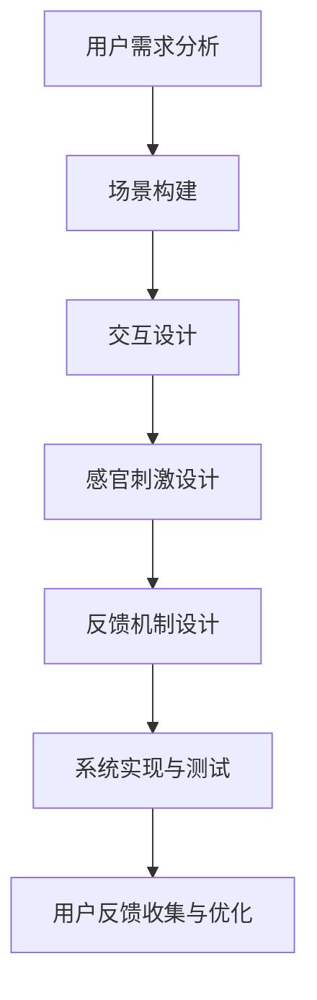

                 

关键词：虚拟现实，VR，沉浸式体验，用户体验，设计，开发，技术

> 摘要：本文旨在探讨虚拟现实（VR）开发的沉浸式体验设计，从背景介绍、核心概念、算法原理、数学模型、项目实践、应用场景、工具资源推荐以及未来发展趋势与挑战等方面，全面解析VR技术的核心要素和未来潜力。

## 1. 背景介绍

虚拟现实（Virtual Reality，VR）技术是一种通过计算机模拟构建的虚拟环境，使人们可以在其中沉浸体验。随着计算机技术、图形处理能力以及传感技术的不断发展，VR技术逐渐从实验室走向公众视野，应用领域也从游戏扩展到教育、医疗、房地产等多个行业。

沉浸式体验设计是VR技术的核心，其目标是通过各种手段提升用户的感知和参与感，使虚拟世界与真实世界之间的界限模糊化。设计一个成功的沉浸式VR体验，不仅需要深入理解用户体验，还需要掌握VR技术的基本原理和开发流程。

### 1.1 VR技术的发展历程

VR技术起源于20世纪60年代的计算机科学领域。1968年，美国计算机科学家伊凡·苏瑟兰（Ivan Sutherland）发明了世界上第一个头戴式显示器（Head-Mounted Display，HMD），标志着VR技术的诞生。此后，VR技术经历了数个阶段的发展，从早期的低分辨率、单色图像到现在的全高清、彩色三维图像，再到触觉反馈、嗅觉模拟等多种感官刺激手段。

### 1.2 VR技术的应用领域

随着VR技术的成熟，其应用领域不断扩大。以下是一些典型的VR应用场景：

- **游戏**：VR游戏是VR技术最早且最广泛的应用领域，通过沉浸式体验提供独特的游戏体验。
- **教育**：VR技术可以创建高度沉浸的学习环境，提供生动的教学资源，提高学生的学习兴趣和效果。
- **医疗**：VR技术用于手术模拟、心理治疗、康复训练等方面，帮助医生和患者更好地理解和应对各种医疗情况。
- **房地产**：VR技术可用于虚拟看房，让购房者在线上就能体验房产的真实效果。
- **旅游**：通过VR技术，用户可以“游览”世界各地的名胜古迹，体验异国风情。

### 1.3 沉浸式体验设计的意义

沉浸式体验设计是提升VR技术用户体验的关键。通过设计，用户可以在虚拟环境中获得更真实、更丰富的感官体验，从而更好地融入虚拟世界。以下是沉浸式体验设计的一些关键要素：

- **场景构建**：通过精确的环境建模和渲染技术，创建逼真的虚拟场景。
- **交互设计**：设计直观、自然的交互方式，使用户能够轻松地与虚拟环境互动。
- **感官刺激**：利用视觉、听觉、触觉等多种感官刺激手段，增强用户的沉浸感。
- **故事叙述**：通过引人入胜的故事情节，使用户在虚拟世界中产生情感共鸣。

## 2. 核心概念与联系

### 2.1 VR系统架构

VR系统通常由以下核心组件组成：

- **头戴式显示器（HMD）**：提供虚拟环境的视觉体验。
- **跟踪系统**：用于跟踪用户的位置和头部运动，确保虚拟环境与用户视角同步。
- **计算机系统**：负责渲染虚拟场景和处理用户输入。
- **音频系统**：提供空间音效，增强沉浸感。
- **输入设备**：如手柄、手套等，用于与虚拟环境进行交互。

### 2.2 沉浸式体验设计原理

沉浸式体验设计主要涉及以下原理：

- **多感官融合**：通过视觉、听觉、触觉等多种感官刺激，增强用户的整体体验。
- **空间感知**：通过精确的跟踪技术和环境建模，实现用户在虚拟环境中的空间感知。
- **反馈机制**：及时的用户反馈可以增强沉浸感和互动性。

### 2.3 Mermaid 流程图

下面是一个简化的VR系统架构和沉浸式体验设计流程的Mermaid流程图：



## 3. 核心算法原理 & 具体操作步骤

### 3.1 算法原理概述

VR系统的核心算法主要包括场景渲染算法、跟踪算法和交互算法。以下分别介绍这些算法的原理：

- **场景渲染算法**：通过图形处理单元（GPU）实现虚拟场景的实时渲染。常见的渲染算法有光线追踪、屏幕空间反射等。
- **跟踪算法**：用于实时跟踪用户的位置和头部运动，确保虚拟环境与用户视角同步。常见的跟踪算法有光学跟踪、惯性测量单元（IMU）跟踪等。
- **交互算法**：用于处理用户的输入并生成相应的反馈，实现用户与虚拟环境的互动。常见的交互算法有自然用户界面（NUI）、手势识别等。

### 3.2 算法步骤详解

#### 3.2.1 场景渲染算法

1. **场景建模**：使用三维建模工具创建虚拟场景，包括物体、角色、环境等。
2. **纹理映射**：为场景中的物体贴上纹理，增加真实感。
3. **渲染管线**：设置渲染管线，包括顶点着色器、像素着色器等，实现场景的实时渲染。

#### 3.2.2 跟踪算法

1. **初始化**：初始化跟踪系统，设置跟踪参数。
2. **数据采集**：采集用户的位置和头部运动数据。
3. **数据处理**：处理采集到的数据，进行数据滤波、插值等处理。
4. **视角更新**：根据处理后的数据更新虚拟环境中的视角。

#### 3.2.3 交互算法

1. **输入采集**：采集用户的输入数据，如按键、手势等。
2. **输入处理**：对采集到的输入数据进行处理，如识别手势、解析按键等。
3. **反馈生成**：根据用户的输入生成相应的反馈，如物体移动、角色动作等。

### 3.3 算法优缺点

- **场景渲染算法**：优点是能够实现高质量的实时渲染，缺点是计算资源消耗较大，对硬件要求较高。
- **跟踪算法**：优点是能够实时跟踪用户的位置和头部运动，缺点是精度受限于跟踪设备的性能。
- **交互算法**：优点是能够实现自然的用户交互，缺点是复杂度高，需要大量的数据处理和生成。

### 3.4 算法应用领域

- **游戏**：通过场景渲染算法和交互算法实现高质量的虚拟游戏体验。
- **教育**：通过跟踪算法和交互算法实现沉浸式的教学体验。
- **医疗**：通过跟踪算法和交互算法实现虚拟手术模拟和心理治疗。

## 4. 数学模型和公式 & 详细讲解 & 举例说明

### 4.1 数学模型构建

VR系统中的数学模型主要包括场景建模、跟踪算法和交互算法的数学模型。以下分别介绍这些模型的构建方法：

#### 4.1.1 场景建模

场景建模的核心是三维几何建模，常用的数学模型有：

- **点云模型**：使用一系列点的坐标表示场景。
- **体素模型**：使用体素（三维像素）组成场景。
- **多边形模型**：使用多边形（如三角形、四面体）表示场景。

#### 4.1.2 跟踪算法

跟踪算法的数学模型主要包括：

- **光学跟踪**：基于光学传感器和几何原理，建立用户位置与传感器读数之间的关系模型。
- **惯性测量单元（IMU）跟踪**：基于惯性测量原理，建立用户位置与加速度、角速度之间的关系模型。

#### 4.1.3 交互算法

交互算法的数学模型主要包括：

- **手势识别**：基于机器学习和计算机视觉技术，建立手势与图像特征之间的关系模型。
- **自然用户界面（NUI）**：基于语音识别、姿态识别等技术，建立用户输入与系统响应之间的关系模型。

### 4.2 公式推导过程

以下以光学跟踪算法为例，介绍其数学模型的推导过程：

#### 4.2.1 光学跟踪公式推导

光学跟踪算法的核心公式为：

\[ T(p) = \frac{1}{d} \cdot (p - p_0) \]

其中，\( T(p) \) 为传感器读数，\( p \) 为用户位置，\( p_0 \) 为传感器位置，\( d \) 为传感器与用户之间的距离。

推导过程如下：

1. **光线投射**：从传感器发射光线，与用户位置相交。
2. **几何关系**：根据几何原理，建立光线与用户位置的关系。
3. **距离计算**：利用传感器读数和几何关系，计算用户与传感器的距离。
4. **位置计算**：根据距离计算用户的位置。

### 4.3 案例分析与讲解

以下通过一个简单的光学跟踪算法案例，介绍其具体实现过程：

#### 4.3.1 案例背景

假设我们有一个光学传感器，用于跟踪一个在房间内移动的用户。传感器固定在墙上，用户手持一个标记物（如手环），标记物可以反射光线。

#### 4.3.2 案例实现

1. **初始化**：设置传感器位置和标记物位置。
2. **光线投射**：从传感器发射光线，模拟光线与标记物相交。
3. **几何计算**：根据光线投射结果，计算用户与传感器的距离。
4. **位置更新**：根据计算结果，更新用户的位置。

#### 4.3.3 案例分析

该案例展示了光学跟踪算法的基本原理和实现过程。在实际应用中，光学跟踪算法需要考虑多种因素，如光线反射、传感器误差等，以实现更精确的跟踪效果。

## 5. 项目实践：代码实例和详细解释说明

### 5.1 开发环境搭建

在开始VR项目实践之前，需要搭建一个适合VR开发的开发环境。以下是一个基于Unity引擎的VR项目开发环境的搭建步骤：

1. **安装Unity引擎**：从Unity官网下载并安装Unity Hub，然后安装Unity编辑器和必要的插件。
2. **安装VR插件**：如VRChat、HTC Vive插件等。
3. **配置VR设备**：根据设备的说明书，连接VR设备（如HTC Vive、Oculus Rift）并进行驱动安装和配置。
4. **创建Unity项目**：在Unity Hub中创建一个新的Unity项目，选择VR模板。

### 5.2 源代码详细实现

以下是一个简单的VR项目代码实例，用于实现一个虚拟房间并允许用户在其中自由移动：

```csharp
using UnityEngine;

public class VRUserMovement : MonoBehaviour
{
    public float movementSpeed = 5.0f;

    private CharacterController characterController;

    void Start()
    {
        characterController = GetComponent<CharacterController>();
    }

    void Update()
    {
        float moveHorizontal = Input.GetAxis("Horizontal");
        float moveVertical = Input.GetAxis("Vertical");

        Vector3 moveDirection = new Vector3(moveHorizontal, 0, moveVertical) * movementSpeed;

        characterController.Move(moveDirection * Time.deltaTime);
    }
}
```

### 5.3 代码解读与分析

上述代码实现了用户在虚拟房间中的自由移动。具体解读如下：

- **组件添加**：在Unity编辑器中，将`CharacterController`组件添加到虚拟角色的对象上。
- **输入处理**：使用`Input.GetAxis`方法获取用户的输入，分别获取水平方向和垂直方向的输入。
- **移动计算**：根据输入计算移动方向，并将其乘以移动速度，得到移动向量。
- **移动实现**：使用`CharacterController.Move`方法实现角色的移动。

### 5.4 运行结果展示

运行该代码后，用户可以在虚拟房间中通过左右键控制角色的前进和后退，从而实现自由移动。通过调整`movementSpeed`参数，可以改变角色的移动速度。

## 6. 实际应用场景

### 6.1 VR游戏

VR游戏是VR技术应用最广泛的领域之一。通过VR技术，玩家可以沉浸在游戏世界中，体验更为真实的游戏感受。以下是一些典型的VR游戏应用场景：

- **多人在线游戏**：玩家可以在虚拟世界中与其他玩家互动，共同完成任务或进行竞技比赛。
- **恐怖游戏**：通过虚拟现实技术，创造令人毛骨悚然的恐怖场景，增强游戏的紧张感。
- **运动游戏**：通过VR技术，玩家可以在家中体验各种运动项目，如滑雪、骑马等。

### 6.2 VR教育

VR技术可以创造高度沉浸的学习环境，提高学生的学习兴趣和效果。以下是一些典型的VR教育应用场景：

- **虚拟实验室**：学生可以在虚拟环境中进行实验，提高实验操作技能。
- **历史重现**：通过VR技术，学生可以身临其境地体验历史事件，加深对历史知识的理解。
- **远程教育**：通过VR技术，实现远程教育，学生可以在家中参与课堂互动，提高学习效率。

### 6.3 VR医疗

VR技术在医疗领域的应用日益广泛，以下是一些典型的VR医疗应用场景：

- **手术模拟**：医生可以在虚拟环境中进行手术模拟，提高手术技能和安全性。
- **心理治疗**：通过VR技术，帮助患者克服恐惧、焦虑等心理问题。
- **康复训练**：通过VR技术，为康复患者提供个性化的康复训练方案。

### 6.4 VR房地产

VR技术可以用于虚拟看房，让购房者在线上就能体验房产的真实效果。以下是一些典型的VR房地产应用场景：

- **虚拟看房**：购房者可以通过VR设备在线上参观房产，了解房屋结构和周边环境。
- **虚拟装修**：购房者可以在虚拟环境中尝试不同的装修方案，提前了解装修效果。
- **房地产营销**：开发商可以通过VR技术展示楼盘，吸引更多购房者。

## 7. 工具和资源推荐

### 7.1 学习资源推荐

- **《虚拟现实（VR）开发技术基础》**：一本关于VR开发基础知识的教材，适合初学者。
- **VR/AR开发者论坛**：一个关于VR/AR技术开发的社区，可以找到各种技术讨论和资源。
- **Unity官方文档**：Unity引擎的官方文档，详细介绍了VR开发的各个方面。

### 7.2 开发工具推荐

- **Unity引擎**：一款功能强大的游戏引擎，支持VR开发。
- **Unreal Engine**：另一款功能强大的游戏引擎，支持VR开发。
- **HTC Vive**：一款高质量的VR头戴设备，适合开发VR应用。

### 7.3 相关论文推荐

- **"Virtual Reality: The Third Space"**：一篇关于虚拟现实空间体验的论文。
- **"A Survey on Virtual Reality Applications in Healthcare"**：一篇关于VR技术在医疗领域应用的综述。
- **"Deep Learning for Virtual Reality"**：一篇关于深度学习在VR中的应用的论文。

## 8. 总结：未来发展趋势与挑战

### 8.1 研究成果总结

随着技术的不断进步，VR技术取得了显著的成果。从早期的低分辨率、单色图像到现在的全高清、彩色三维图像，再到触觉反馈、嗅觉模拟等多种感官刺激手段，VR技术已经具备了较高的沉浸感和用户体验。同时，VR技术在游戏、教育、医疗、房地产等多个领域得到了广泛应用，为人们带来了全新的体验和生活方式。

### 8.2 未来发展趋势

未来，VR技术将继续朝着更高沉浸感、更广泛应用和更便捷使用的方向发展。以下是一些可能的发展趋势：

- **更高质量的图像和音效**：随着显示技术和音频技术的发展，VR设备的图像和音效质量将进一步提高，带来更为真实的沉浸体验。
- **更丰富的交互方式**：通过引入手势识别、语音交互等新技术，用户将可以更加自然地与虚拟环境进行互动。
- **更多应用场景**：随着技术的成熟和应用场景的拓展，VR技术将在更多领域得到应用，如远程工作、虚拟旅游、远程会议等。
- **更便捷的设备**：随着硬件技术的进步，VR设备的重量、体积和功耗将不断减小，使得VR设备更加便携和易用。

### 8.3 面临的挑战

尽管VR技术取得了显著成果，但仍面临一些挑战：

- **技术瓶颈**：虽然VR技术在图像和音效等方面取得了很大进步，但在触觉反馈、嗅觉模拟等方面仍有待提高。
- **应用场景限制**：VR技术仍需进一步拓展应用场景，以实现更广泛的社会价值。
- **用户体验优化**：如何提高用户的沉浸感和舒适度，是VR技术需要解决的重要问题。
- **社会接受度**：VR技术需要得到更广泛的社会认可和接受，才能实现其真正的价值。

### 8.4 研究展望

未来，VR技术将在以下几个方面取得突破：

- **多感官融合**：通过引入更多感官刺激手段，实现更为丰富的沉浸体验。
- **人工智能**：结合人工智能技术，实现智能化的交互和个性化定制。
- **混合现实**：将VR与AR技术相结合，实现现实世界与虚拟世界的无缝融合。
- **社会应用**：进一步拓展VR技术的应用领域，提高其在各个领域的社会价值。

## 9. 附录：常见问题与解答

### 9.1 VR技术是否对人体有害？

目前的研究表明，适度使用VR设备对人体的危害较小。然而，长时间连续使用VR设备可能会导致眼睛疲劳、头晕、恶心等不适症状。建议用户在使用VR设备时，注意适当休息，避免长时间连续使用。

### 9.2 VR技术是否会取代现实世界？

VR技术并不能完全取代现实世界，它更多的是作为一种补充和拓展。通过VR技术，我们可以创造一个虚拟的世界，提供新的体验和可能性，但它并不能完全替代现实生活中的情感、社交和实际操作。

### 9.3 VR技术是否会加剧社会隔离？

VR技术在一定程度上可能会加剧社会隔离，因为用户可能会更多地沉浸在虚拟世界中，减少与现实世界的互动。然而，通过合理的设计和应用，VR技术也可以促进社交互动，如多人在线游戏、远程工作等，从而减少社会隔离的影响。

### 9.4 VR技术的未来发展方向是什么？

VR技术的未来发展方向包括：更高沉浸感、更广泛的应用、更便捷的设备、多感官融合、人工智能、混合现实等。通过不断的技术创新和应用拓展，VR技术有望在未来实现更多的可能性，为人类社会带来更大的价值。

---

以上是关于《虚拟现实（VR）开发：沉浸式体验设计》的完整文章。本文详细介绍了VR技术的背景、核心概念、算法原理、数学模型、项目实践、应用场景、工具资源推荐以及未来发展趋势与挑战，旨在为广大读者提供全面、深入的VR技术知识。希望这篇文章能够对您在VR技术领域的探索和学习有所帮助。作者：禅与计算机程序设计艺术 / Zen and the Art of Computer Programming。

