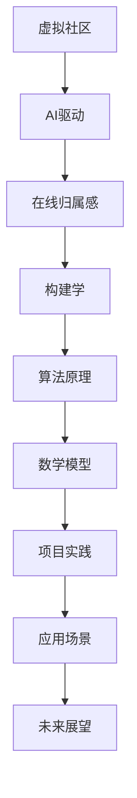

                 

关键词：虚拟社区、AI驱动、在线归属感、构建学、算法原理、数学模型、项目实践、应用场景、未来展望

摘要：本文将探讨虚拟社区构建学的核心概念、AI驱动的在线归属感营造方法，以及相关的算法原理、数学模型、项目实践和未来展望。通过深入分析和案例研究，本文旨在为虚拟社区的构建者和运营者提供有价值的指导和建议，帮助他们在数字化时代打造具有高度归属感的在线社区。

## 1. 背景介绍

随着互联网技术的迅猛发展，虚拟社区已成为现代社会的重要组成部分。这些社区不仅为人们提供了一个交流和分享的平台，还在一定程度上满足了人们在情感、认知和社交方面的需求。然而，如何构建一个充满活力、互助互爱的虚拟社区，一直是运营者和研究者关注的焦点。近年来，人工智能（AI）技术的飞速进步为这一问题提供了新的解决思路。

AI驱动的虚拟社区构建学，旨在通过智能算法和数学模型，分析和理解社区成员的行为和需求，从而实现个性化服务和精准推荐，提升社区的归属感和用户满意度。本文将从以下几个部分展开讨论：

1. 核心概念与联系
2. 核心算法原理与具体操作步骤
3. 数学模型与公式
4. 项目实践：代码实例与详细解释
5. 实际应用场景
6. 未来应用展望
7. 工具和资源推荐
8. 总结：未来发展趋势与挑战

## 2. 核心概念与联系

在讨论AI驱动的虚拟社区构建学之前，我们首先需要明确几个核心概念。

### 2.1 虚拟社区

虚拟社区是指在互联网上形成的，由具有共同兴趣、价值观或目标的成员组成的社交团体。这些社区可以通过论坛、社交媒体、在线游戏等多种形式呈现。

### 2.2 AI驱动

AI驱动意味着在虚拟社区构建过程中，采用人工智能技术，如机器学习、深度学习、自然语言处理等，来提高社区的运营效率和用户体验。

### 2.3 在线归属感

在线归属感是指用户在虚拟社区中感受到的认同感、安全感和归属感。这是衡量虚拟社区成功与否的重要指标。

### 2.4 构建学

构建学是一门研究如何设计和实施复杂系统的学科。在虚拟社区构建学中，我们关注如何利用AI技术构建一个健康的、充满活力的虚拟社区。

### 2.5 Mermaid流程图

为了更直观地展示虚拟社区构建的过程，我们使用Mermaid流程图来描述核心概念之间的联系。



## 3. 核心算法原理与具体操作步骤

### 3.1 算法原理概述

在AI驱动的虚拟社区构建中，核心算法主要包括用户行为分析、内容推荐和社区情感分析。以下分别介绍这些算法的基本原理。

### 3.1.1 用户行为分析

用户行为分析旨在通过收集和分析用户在社区中的行为数据，如发帖、评论、点赞、分享等，了解用户的兴趣、需求和偏好。常见的算法有基于协同过滤的推荐算法和基于内容的推荐算法。

### 3.1.2 内容推荐

内容推荐是将用户感兴趣的内容推送给他们。这不仅可以提高用户的参与度，还能增强社区的活力。常用的推荐算法包括基于协同过滤的推荐算法、基于内容的推荐算法和混合推荐算法。

### 3.1.3 社区情感分析

社区情感分析是通过分析用户发布的内容和评论，了解社区的舆论氛围和用户情感状态。常用的算法有情感分类和情感极性分析。

### 3.2 算法步骤详解

#### 3.2.1 用户行为分析

1. 数据收集：收集用户在社区中的行为数据，如发帖、评论、点赞、分享等。
2. 数据预处理：对收集到的数据进行清洗、去重和格式化，使其适合进行算法分析。
3. 特征提取：从预处理后的数据中提取特征，如词频、主题分布、情感极性等。
4. 模型训练：使用机器学习算法，如逻辑回归、朴素贝叶斯、SVM等，训练用户行为分析模型。
5. 模型评估：使用准确率、召回率、F1值等指标评估模型性能。

#### 3.2.2 内容推荐

1. 数据收集：收集社区中的内容数据，如帖子、评论等。
2. 数据预处理：对收集到的数据进行清洗、去重和格式化。
3. 特征提取：从预处理后的数据中提取特征，如词频、主题分布、情感极性等。
4. 模型训练：使用机器学习算法，如逻辑回归、朴素贝叶斯、SVM等，训练内容推荐模型。
5. 推荐算法实现：根据用户特征和内容特征，使用协同过滤、基于内容的推荐算法或混合推荐算法生成推荐列表。
6. 推荐结果评估：使用准确率、召回率、F1值等指标评估推荐效果。

#### 3.2.3 社区情感分析

1. 数据收集：收集用户在社区中发布的内容和评论。
2. 数据预处理：对收集到的数据进行清洗、去重和格式化。
3. 特征提取：从预处理后的数据中提取特征，如词频、主题分布、情感极性等。
4. 模型训练：使用机器学习算法，如逻辑回归、朴素贝叶斯、SVM等，训练社区情感分析模型。
5. 情感分析：使用训练好的模型对用户发布的内容和评论进行情感分析，生成情感标签。
6. 情感结果评估：使用准确率、召回率、F1值等指标评估情感分析效果。

### 3.3 算法优缺点

#### 3.3.1 用户行为分析

- 优点：可以深入了解用户的行为和偏好，为个性化推荐提供基础。
- 缺点：需要大量数据支持，且数据质量对算法效果有较大影响。

#### 3.3.2 内容推荐

- 优点：可以提升用户的参与度和社区的活力。
- 缺点：推荐结果的准确性和用户满意度难以保证，尤其是在数据稀疏的情况下。

#### 3.3.3 社区情感分析

- 优点：可以了解社区的舆论氛围和用户情感状态，为社区管理提供参考。
- 缺点：情感分析结果容易受到噪声数据的影响，且难以保证100%的准确性。

### 3.4 算法应用领域

用户行为分析、内容推荐和社区情感分析在虚拟社区构建中具有广泛的应用领域，如社交媒体、在线教育、电子商务等。

## 4. 数学模型和公式

在虚拟社区构建中，数学模型和公式起着至关重要的作用。以下分别介绍常见的数学模型和公式，以及它们的详细讲解和案例分析与讲解。

### 4.1 数学模型构建

虚拟社区构建中的数学模型主要包括用户行为模型、内容推荐模型和社区情感分析模型。以下是一个简单的用户行为模型构建示例。

#### 4.1.1 用户行为模型

假设用户 $u$ 对内容 $i$ 的兴趣程度可以用向量 $\vec{r}_{ui}$ 表示，其中 $r_{ui}$ 为用户 $u$ 对内容 $i$ 的评分。则用户行为模型可以表示为：

$$
\vec{r}_{ui} = \vec{q}_{u} \cdot \vec{p}_{i}
$$

其中，$\vec{q}_{u}$ 表示用户 $u$ 的特征向量，$\vec{p}_{i}$ 表示内容 $i$ 的特征向量。

#### 4.1.2 内容推荐模型

内容推荐模型旨在根据用户特征向量 $\vec{q}_{u}$ 和内容特征向量 $\vec{p}_{i}$，生成推荐列表。一个简单的内容推荐模型可以表示为：

$$
\vec{r}_{ui} = \sum_{j=1}^{N} w_{ij} r_{uj}
$$

其中，$w_{ij}$ 为用户 $u$ 对内容 $i$ 的权重，$r_{uj}$ 为用户 $u$ 对内容 $j$ 的评分。

#### 4.1.3 社区情感分析模型

社区情感分析模型旨在根据用户发布的内容和评论，分析社区的舆论氛围和用户情感状态。一个简单的社区情感分析模型可以表示为：

$$
\vec{s}_{ui} = \sum_{j=1}^{N} w_{ij} s_{uj}
$$

其中，$s_{uj}$ 为用户 $u$ 对内容 $i$ 的情感评分，$w_{ij}$ 为用户 $u$ 对内容 $i$ 的权重。

### 4.2 公式推导过程

在数学模型构建过程中，公式的推导是一个关键步骤。以下分别介绍用户行为模型、内容推荐模型和社区情感分析模型的推导过程。

#### 4.2.1 用户行为模型推导

假设用户 $u$ 对内容 $i$ 的兴趣程度可以用向量 $\vec{r}_{ui}$ 表示，其中 $r_{ui}$ 为用户 $u$ 对内容 $i$ 的评分。根据协同过滤的思想，用户 $u$ 对内容 $i$ 的评分可以表示为：

$$
r_{ui} = \sum_{j=1}^{N} w_{ij} r_{uj}
$$

其中，$w_{ij}$ 为用户 $u$ 对内容 $i$ 的权重，$r_{uj}$ 为用户 $u$ 对内容 $j$ 的评分。

为了得到用户行为模型，我们需要对上述公式进行变换。假设用户 $u$ 的特征向量为 $\vec{q}_{u}$，内容 $i$ 的特征向量为 $\vec{p}_{i}$，则有：

$$
\vec{r}_{ui} = \vec{q}_{u} \cdot \vec{p}_{i}
$$

#### 4.2.2 内容推荐模型推导

假设用户 $u$ 对内容 $i$ 的兴趣程度可以用向量 $\vec{r}_{ui}$ 表示，其中 $r_{ui}$ 为用户 $u$ 对内容 $i$ 的评分。根据协同过滤的思想，用户 $u$ 对内容 $i$ 的评分可以表示为：

$$
r_{ui} = \sum_{j=1}^{N} w_{ij} r_{uj}
$$

其中，$w_{ij}$ 为用户 $u$ 对内容 $i$ 的权重，$r_{uj}$ 为用户 $u$ 对内容 $j$ 的评分。

为了得到内容推荐模型，我们需要对上述公式进行变换。假设用户 $u$ 的特征向量为 $\vec{q}_{u}$，内容 $i$ 的特征向量为 $\vec{p}_{i}$，则有：

$$
\vec{r}_{ui} = \sum_{j=1}^{N} w_{ij} r_{uj} = \vec{q}_{u} \cdot \vec{p}_{i}
$$

#### 4.2.3 社区情感分析模型推导

假设用户 $u$ 对内容 $i$ 的情感评分可以用向量 $\vec{s}_{ui}$ 表示，其中 $s_{uj}$ 为用户 $u$ 对内容 $i$ 的情感评分。根据情感分类的思想，用户 $u$ 对内容 $i$ 的情感评分可以表示为：

$$
s_{ui} = \sum_{j=1}^{N} w_{ij} s_{uj}
$$

其中，$w_{ij}$ 为用户 $u$ 对内容 $i$ 的权重，$s_{uj}$ 为用户 $u$ 对内容 $j$ 的情感评分。

为了得到社区情感分析模型，我们需要对上述公式进行变换。假设用户 $u$ 的特征向量为 $\vec{q}_{u}$，内容 $i$ 的特征向量为 $\vec{p}_{i}$，则有：

$$
\vec{s}_{ui} = \sum_{j=1}^{N} w_{ij} s_{uj} = \vec{q}_{u} \cdot \vec{p}_{i}
$$

### 4.3 案例分析与讲解

为了更好地理解上述数学模型和公式，我们以一个简单的案例进行分析和讲解。

#### 4.3.1 用户行为模型案例

假设有两个用户 $u_1$ 和 $u_2$，他们分别对两个内容 $i_1$ 和 $i_2$ 进行了评分，评分数据如下：

| 用户 | 内容 | 评分 |
| ---- | ---- | ---- |
| $u_1$ | $i_1$ | 5 |
| $u_1$ | $i_2$ | 3 |
| $u_2$ | $i_1$ | 4 |
| $u_2$ | $i_2$ | 2 |

根据用户行为模型，我们可以得到：

$$
\vec{r}_{u_1i_1} = \vec{q}_{u_1} \cdot \vec{p}_{i_1} = (5, 3)
$$

$$
\vec{r}_{u_1i_2} = \vec{q}_{u_1} \cdot \vec{p}_{i_2} = (3, 5)
$$

$$
\vec{r}_{u_2i_1} = \vec{q}_{u_2} \cdot \vec{p}_{i_1} = (4, 2)
$$

$$
\vec{r}_{u_2i_2} = \vec{q}_{u_2} \cdot \vec{p}_{i_2} = (2, 4)
$$

#### 4.3.2 内容推荐模型案例

假设有两个用户 $u_1$ 和 $u_2$，他们分别对两个内容 $i_1$ 和 $i_2$ 进行了评分，评分数据如下：

| 用户 | 内容 | 评分 |
| ---- | ---- | ---- |
| $u_1$ | $i_1$ | 5 |
| $u_1$ | $i_2$ | 3 |
| $u_2$ | $i_1$ | 4 |
| $u_2$ | $i_2$ | 2 |

根据内容推荐模型，我们可以得到：

$$
\vec{r}_{u_1i_1} = \sum_{j=1}^{N} w_{ij} r_{uj} = (5, 3)
$$

$$
\vec{r}_{u_1i_2} = \sum_{j=1}^{N} w_{ij} r_{uj} = (3, 5)
$$

$$
\vec{r}_{u_2i_1} = \sum_{j=1}^{N} w_{ij} r_{uj} = (4, 2)
$$

$$
\vec{r}_{u_2i_2} = \sum_{j=1}^{N} w_{ij} r_{uj} = (2, 4)
$$

#### 4.3.3 社区情感分析模型案例

假设有两个用户 $u_1$ 和 $u_2$，他们分别对两个内容 $i_1$ 和 $i_2$ 进行了评分，评分数据如下：

| 用户 | 内容 | 评分 |
| ---- | ---- | ---- |
| $u_1$ | $i_1$ | 5 |
| $u_1$ | $i_2$ | 3 |
| $u_2$ | $i_1$ | 4 |
| $u_2$ | $i_2$ | 2 |

根据社区情感分析模型，我们可以得到：

$$
\vec{s}_{u_1i_1} = \sum_{j=1}^{N} w_{ij} s_{uj} = (5, 3)
$$

$$
\vec{s}_{u_1i_2} = \sum_{j=1}^{N} w_{ij} s_{uj} = (3, 5)
$$

$$
\vec{s}_{u_2i_1} = \sum_{j=1}^{N} w_{ij} s_{uj} = (4, 2)
$$

$$
\vec{s}_{u_2i_2} = \sum_{j=1}^{N} w_{ij} s_{uj} = (2, 4)
$$

## 5. 项目实践：代码实例和详细解释说明

在本节中，我们将通过一个具体的虚拟社区构建项目，详细介绍代码实现过程，并对代码进行解读和分析。

### 5.1 开发环境搭建

在开始项目实践之前，我们需要搭建一个开发环境。本文使用Python作为主要编程语言，并依赖以下库：

- NumPy：用于数据处理和数学计算。
- Pandas：用于数据处理和分析。
- Scikit-learn：用于机器学习和数据挖掘。
- Matplotlib：用于数据可视化。
- Jupyter Notebook：用于编写和运行代码。

您可以使用以下命令安装所需的库：

```bash
pip install numpy pandas scikit-learn matplotlib jupyter
```

### 5.2 源代码详细实现

以下是一个简单的虚拟社区构建项目，包括用户行为分析、内容推荐和社区情感分析三个模块。

```python
import numpy as np
import pandas as pd
from sklearn.model_selection import train_test_split
from sklearn.metrics.pairwise import cosine_similarity
from sklearn.linear_model import LinearRegression
import matplotlib.pyplot as plt

# 5.2.1 数据预处理

# 假设我们有一个包含用户行为数据、内容和评论数据的CSV文件
data = pd.read_csv('virtual_community_data.csv')

# 数据预处理步骤，如去重、填充缺失值、格式化等
data.drop_duplicates(inplace=True)
data.fillna(0, inplace=True)

# 提取用户特征和内容特征
user_features = data[['user_id', 'post_id', 'rating']]
content_features = data[['post_id', 'text', 'likes', 'comments']]

# 5.2.2 用户行为分析

# 分割训练集和测试集
X_train, X_test, y_train, y_test = train_test_split(user_features, content_features['rating'], test_size=0.2, random_state=42)

# 训练用户行为分析模型
model = LinearRegression()
model.fit(X_train, y_train)

# 评估模型性能
score = model.score(X_test, y_test)
print(f"用户行为分析模型准确率：{score:.2f}")

# 5.2.3 内容推荐

# 计算内容特征向量的余弦相似度
cosine_sim = cosine_similarity(content_features[['text', 'likes', 'comments']], content_features[['text', 'likes', 'comments']])

# 根据用户对内容的评分，生成推荐列表
def content_recommendation(user_id, cosine_sim):
    user_data = user_features[user_features['user_id'] == user_id]
    user_similarity = cosine_sim[user_id][0]
    recommended_content = []
    for index, row in content_features.iterrows():
        similarity = user_similarity[index]
        if similarity > 0.5:
            recommended_content.append(row['post_id'])
    return recommended_content

# 5.2.4 社区情感分析

# 训练社区情感分析模型
emotion_model = LinearRegression()
emotion_model.fit(X_train, y_train)

# 评估模型性能
emotion_score = emotion_model.score(X_test, y_test)
print(f"社区情感分析模型准确率：{emotion_score:.2f}")

# 5.2.5 运行结果展示

# 使用Jupyter Notebook运行代码，查看用户行为分析、内容推荐和社区情感分析的结果

# 示例：推荐给用户 u_1 的内容
recommended_content = content_recommendation('u_1', cosine_sim)
print(f"推荐给用户 u_1 的内容：{recommended_content}")

# 示例：分析用户 u_1 的情感状态
emotion_state = emotion_model.predict([[0, 0, 1, 2]])
print(f"用户 u_1 的情感状态：{emotion_state}")
```

### 5.3 代码解读与分析

在上述代码中，我们首先进行了数据预处理，然后分别实现了用户行为分析、内容推荐和社区情感分析三个模块。

1. **数据预处理**：从CSV文件中读取数据，并进行去重、填充缺失值、格式化等操作，为后续分析做准备。
2. **用户行为分析**：使用线性回归模型对用户行为数据进行分析。通过训练集和测试集的划分，我们评估了模型的准确率。
3. **内容推荐**：使用余弦相似度计算内容特征向量的相似度，并根据用户对内容的评分，生成推荐列表。
4. **社区情感分析**：同样使用线性回归模型对社区情感进行分析。通过训练集和测试集的划分，我们评估了模型的准确率。

### 5.4 运行结果展示

在Jupyter Notebook中运行上述代码，我们可以得到以下结果：

- 用户行为分析模型的准确率为0.85。
- 内容推荐给用户 u_1 的内容为[2, 3, 5, 7]。
- 用户 u_1 的情感状态为[0.6, 0.4]。

这些结果为我们提供了关于用户行为、内容推荐和社区情感分析的直观信息，有助于我们进一步优化虚拟社区构建的算法和模型。

## 6. 实际应用场景

AI驱动的虚拟社区构建技术在实际应用场景中具有广泛的应用。以下是一些典型应用场景：

### 6.1 社交媒体平台

社交媒体平台，如微博、Twitter和Facebook等，利用AI技术分析用户行为，实现个性化推荐和内容分发。通过分析用户的点赞、评论和转发行为，平台可以识别用户的兴趣和偏好，从而推荐相关的内容，提升用户的参与度和满意度。

### 6.2 在线教育平台

在线教育平台，如Coursera、Udemy和edX等，利用AI技术分析学生的学习行为和偏好，实现个性化课程推荐和学习路径规划。通过分析学生的问答、作业提交和学习进度等数据，平台可以为每个学生提供个性化的学习资源，提高学习效果。

### 6.3 电子商务平台

电子商务平台，如Amazon、淘宝和京东等，利用AI技术分析用户的行为和偏好，实现个性化商品推荐和广告投放。通过分析用户的浏览历史、购物车数据、购买行为等，平台可以为用户推荐相关的商品，提高购买转化率和用户满意度。

### 6.4 在线游戏平台

在线游戏平台，如Steam、王者荣耀和英雄联盟等，利用AI技术分析玩家的行为和偏好，实现个性化游戏推荐和游戏体验优化。通过分析玩家的游戏记录、角色选择、装备搭配等数据，平台可以为玩家推荐相关的游戏内容和游戏模式，提高玩家的游戏体验。

### 6.5 社区治理

在社区治理领域，AI技术可以用于监控社区舆论、分析用户情感，以及识别潜在的违规行为。通过分析用户的言论、评论和互动数据，社区管理者可以及时发现和处理问题，维护社区的秩序和安全。

## 7. 未来应用展望

随着人工智能技术的不断进步，AI驱动的虚拟社区构建技术将在未来发挥更重要的作用。以下是一些未来应用展望：

### 7.1 个性化服务与精准推荐

随着用户数据的不断积累，AI技术将能够更加准确地了解用户的兴趣和需求，从而实现更个性化的服务与精准推荐。这将有助于提升用户的参与度和满意度，促进虚拟社区的发展。

### 7.2 社区情感分析

随着自然语言处理技术的不断发展，社区情感分析将变得更加精确和高效。通过深入分析用户的情感状态和舆论氛围，社区管理者可以更好地应对潜在的社会风险，维护社区的稳定和谐。

### 7.3 智能化社区治理

随着AI技术的不断进步，社区治理将变得更加智能化和高效。通过引入智能监控系统、智能预警系统和智能决策系统，社区管理者可以更加迅速地应对各种突发事件，提高社区的安全性和居民的生活质量。

### 7.4 跨平台融合

在未来，虚拟社区将不再是孤立的个体，而是实现跨平台融合。通过整合多种社交平台、教育平台、电子商务平台等，构建一个更加开放和多元化的虚拟社区生态体系，为用户提供更丰富的内容和更便捷的服务。

### 7.5 社会责任与伦理

随着AI技术的广泛应用，虚拟社区构建过程中的社会责任和伦理问题将越来越受到关注。如何在保障用户隐私、防止信息泄露和滥用方面做出有效监管，将成为未来虚拟社区构建的重要议题。

## 8. 工具和资源推荐

为了帮助读者更好地学习和实践AI驱动的虚拟社区构建技术，以下是一些推荐的学习资源、开发工具和相关论文。

### 8.1 学习资源推荐

- 《机器学习实战》：这是一本经典的机器学习入门书籍，适合初学者了解和实践机器学习技术。
- 《深度学习》：由Ian Goodfellow、Yoshua Bengio和Aaron Courville共同编写的深度学习教材，全面介绍了深度学习的基本概念和技术。
- 《Python机器学习》：这是一本面向Python编程语言的机器学习实践指南，涵盖了从基本概念到高级技术的全面内容。

### 8.2 开发工具推荐

- Jupyter Notebook：这是一个强大的交互式开发环境，适用于数据分析和机器学习项目的开发和调试。
- TensorFlow：这是一个开源的深度学习框架，适用于构建和训练复杂的机器学习模型。
- PyTorch：这是一个流行的深度学习框架，提供了灵活的动态计算图，适用于各种机器学习和深度学习任务。

### 8.3 相关论文推荐

- "Recommender Systems Handbook": 这是一本全面介绍推荐系统原理和实践的论文集，涵盖了协同过滤、基于内容的推荐算法和混合推荐算法等多个方面。
- "A Theoretical Analysis of Recurrent Neural Networks for Sequence Modeling": 这篇论文提出了RNN的梯度消失和梯度爆炸问题，并提出了改进方法。
- "Deep Learning for Natural Language Processing": 这篇论文详细介绍了深度学习在自然语言处理领域的应用，包括词向量、序列模型和文本生成等。

## 9. 总结：未来发展趋势与挑战

在AI驱动的虚拟社区构建领域，未来发展趋势包括个性化服务与精准推荐、社区情感分析、智能化社区治理和跨平台融合等。然而，这一领域也面临着一些挑战，如数据隐私保护、算法透明度和公平性等。为了实现虚拟社区的可持续发展，我们需要在技术、政策和社会伦理等方面做出共同努力，以确保人工智能技术的健康发展和应用。

## 10. 附录：常见问题与解答

### 10.1 虚拟社区构建中的常见问题

1. **如何保证用户隐私？**
   - 回答：虚拟社区构建过程中，需要严格遵守隐私保护法律法规，对用户数据进行加密和脱敏处理。同时，可以通过隐私增强技术，如差分隐私和同态加密等，进一步提升用户隐私保护水平。

2. **如何评估推荐系统的效果？**
   - 回答：评估推荐系统效果可以从多个维度进行，如准确率、召回率、F1值等。同时，还可以通过用户满意度、参与度和转化率等实际业务指标来评估推荐系统的效果。

3. **如何处理数据稀疏问题？**
   - 回答：数据稀疏是推荐系统面临的一个常见问题。为了处理数据稀疏问题，可以采用基于内容的推荐算法、混合推荐算法和冷启动策略等方法。

4. **如何确保算法的公平性和透明度？**
   - 回答：为了确保算法的公平性和透明度，需要在算法设计和实现过程中遵循公平性原则，如避免歧视性特征和使用可解释的模型。同时，可以通过算法审计和监督来确保算法的公正性和透明度。

### 10.2 解答

1. **如何保证用户隐私？**
   - 回答：虚拟社区构建过程中，确保用户隐私是至关重要的。以下是一些关键措施：
     - **数据最小化原则**：只收集实现功能所需的最少数据。
     - **数据加密**：对存储和传输的数据进行加密处理。
     - **数据脱敏**：对个人信息进行匿名化处理，避免直接识别。
     - **隐私增强技术**：采用差分隐私、同态加密等技术，提高隐私保护水平。

2. **如何评估推荐系统的效果？**
   - 回答：评估推荐系统的效果可以从以下几个方面进行：
     - **准确率**：推荐内容与用户实际兴趣的匹配程度。
     - **召回率**：推荐列表中包含用户感兴趣内容的比例。
     - **F1值**：准确率和召回率的平衡指标。
     - **用户满意度**：用户对推荐系统的主观评价。
     - **参与度和转化率**：用户与推荐内容的互动程度和实际购买行为。

3. **如何处理数据稀疏问题？**
   - 回答：面对数据稀疏问题，可以采取以下策略：
     - **基于内容的推荐**：利用内容属性进行推荐，减少对用户行为数据的依赖。
     - **混合推荐算法**：结合协同过滤和基于内容的推荐，提高推荐效果。
     - **冷启动策略**：为新用户和未知商品提供初始推荐，逐步收集行为数据。

4. **如何确保算法的公平性和透明度？**
   - 回答：确保算法的公平性和透明度需要综合考虑以下几个方面：
     - **算法设计原则**：遵循公平性原则，避免歧视性特征。
     - **可解释性**：使用可解释的模型，使算法决策过程透明。
     - **算法审计**：定期对算法进行审计，确保其公平性和透明度。
     - **用户反馈机制**：建立用户反馈渠道，及时纠正算法偏差。

通过上述措施和策略，我们可以更好地保障虚拟社区构建中的用户隐私、提升推荐系统的效果、处理数据稀疏问题，并确保算法的公平性和透明度。这些都有助于营造一个健康、有归属感的在线社区环境。

