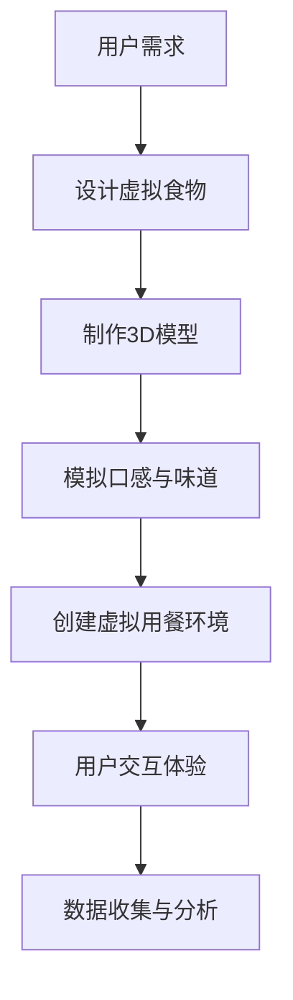

                 

关键词：虚拟现实，数字化升级，美食行业，虚拟食材，餐饮技术，体验创新

> 摘要：随着虚拟现实技术的迅猛发展，全球美食行业正迎来一场前所未有的数字化升级。本文将探讨虚拟美食的概念、技术原理、应用场景及其未来发展趋势，旨在为读者呈现一个全新的餐饮体验世界。

## 1. 背景介绍

在过去的几十年中，信息技术和互联网的普及极大地改变了人们的日常生活。如今，餐饮行业正面临着新的技术挑战和机遇。一方面，消费者对于饮食体验的要求越来越高，不仅追求美食的美味，更追求独特的用餐体验。另一方面，餐饮企业也希望通过技术手段提升运营效率、降低成本并增强竞争力。

### 1.1 虚拟现实技术的崛起

虚拟现实（VR）技术作为一种沉浸式体验技术，近年来在全球范围内迅速发展。VR技术通过创建一个计算机生成的模拟环境，让用户能够与之互动，从而提供一种全新的感知和交互方式。在餐饮领域，虚拟现实技术的应用潜力引起了广泛关注。

### 1.2 美食行业的变革

传统美食行业正面临着诸多挑战，如成本压力、消费者需求多样化以及市场竞争加剧等。为了应对这些挑战，餐饮企业开始探索新的解决方案，其中数字化升级成为了一个重要方向。通过数字化技术，企业能够优化供应链管理、提升用户体验、开拓新市场等。

## 2. 核心概念与联系

### 2.1 虚拟美食

虚拟美食是指通过数字化技术生成的，具有视觉、听觉和触觉等感官体验的虚拟食物。虚拟美食不仅仅是一个简单的图像或模型，而是通过先进的计算机图形学和仿真技术，模拟出真实的食物外观、口感和味道。

### 2.2 虚拟现实与数字化升级的联系

虚拟现实技术是虚拟美食实现的基础。通过VR设备，用户可以沉浸在一个虚拟的用餐环境中，体验虚拟食物的多种感官感受。而数字化升级则为虚拟美食提供了广泛的应用场景，如在线餐厅、虚拟美食秀、虚拟烹饪课程等。

### 2.3 Mermaid 流程图

以下是虚拟美食实现的Mermaid流程图：



## 3. 核心算法原理 & 具体操作步骤

### 3.1 算法原理概述

虚拟美食的核心在于创建一个逼真的虚拟食物模型，然后通过感官模拟技术让用户感受到食物的视觉、听觉和触觉。以下是一些关键算法：

- **3D建模算法**：用于创建虚拟食物的3D模型。
- **纹理映射算法**：将图像映射到3D模型上，使其具有真实感。
- **口感与味道模拟算法**：通过声音和振动等手段模拟食物的口感和味道。

### 3.2 算法步骤详解

1. **用户需求分析**：确定虚拟食物的设计目标，包括外观、口感、味道等。
2. **3D建模**：使用3D建模软件（如Blender）创建虚拟食物的3D模型。
3. **纹理映射**：将真实食物的图像映射到3D模型上，增加视觉真实感。
4. **口感与味道模拟**：通过音频和振动设备模拟食物的口感和味道。
5. **用户交互体验**：设计用户交互界面，让用户能够与虚拟食物进行互动。
6. **数据收集与分析**：收集用户反馈数据，优化虚拟食物的感官体验。

### 3.3 算法优缺点

#### 优点：

- **提高用户体验**：通过虚拟美食，用户可以体验到传统餐饮无法提供的感官刺激。
- **降低运营成本**：虚拟美食可以减少实体食材的使用，降低成本。
- **创新营销手段**：虚拟美食为餐饮企业提供了创新的营销手段，如虚拟美食秀、虚拟餐厅等。

#### 缺点：

- **技术门槛较高**：虚拟美食的实现需要专业的技术支持和设备。
- **感官体验受限**：虚拟美食的感官体验仍然无法完全替代真实的食物体验。

### 3.4 算法应用领域

虚拟美食技术可以应用于多个领域，如：

- **在线餐饮**：通过虚拟餐厅提供虚拟食物体验。
- **美食教育**：虚拟烹饪课程，让学习者能够亲手制作虚拟美食。
- **虚拟展览**：虚拟美食展览，展示各种独特的美食文化。

## 4. 数学模型和公式 & 详细讲解 & 举例说明

### 4.1 数学模型构建

虚拟美食的实现涉及到多个数学模型，包括：

- **三维建模公式**：用于计算3D模型的几何形状和位置。
- **纹理映射公式**：用于将图像映射到3D模型上。
- **口感与味道模拟公式**：用于计算食物的口感和味道。

### 4.2 公式推导过程

#### 三维建模公式

- **点积公式**：用于计算两个向量的点积。
- **叉积公式**：用于计算两个向量的叉积。

#### 纹理映射公式

- **纹理坐标公式**：用于将图像坐标映射到3D模型坐标。

#### 口感与味道模拟公式

- **声波传播公式**：用于计算声音在虚拟环境中的传播。
- **振动公式**：用于计算振动在虚拟环境中的传播。

### 4.3 案例分析与讲解

#### 虚拟披萨

- **三维建模**：使用Blender软件创建披萨的3D模型。
- **纹理映射**：使用真实披萨的图像映射到3D模型上。
- **口感与味道模拟**：通过声音和振动设备模拟披萨的口感和味道。

## 5. 项目实践：代码实例和详细解释说明

### 5.1 开发环境搭建

- **操作系统**：Windows 10 或 macOS
- **开发工具**：Blender、Unity
- **编程语言**：C#、Python

### 5.2 源代码详细实现

```python
# Python代码示例：三维建模
import bpy

# 创建披萨的3D模型
bpy.ops.mesh.primitive_cube_add(size=2.0)
bpy.ops.object.select_all(action='DESELECT')
bpy.ops.mesh.select_mode(type='VERTEX')
bpy.ops.mesh.select_vertices('<LT')

# 创建披萨边缘的曲线
bpy.ops.curve.primitive_bezier_curve_add()

# 将曲线映射到3D模型上
bpy.ops.object.select_all(action='DESELECT')
bpy.ops.object.select_by_type(type='CURVE')
bpy.ops.object.parent_set(type='BYPhiladelphia')
```

### 5.3 代码解读与分析

以上代码示例使用了Blender软件创建一个简单的披萨模型。首先，通过`primitive_cube_add`操作创建一个立方体，然后通过`select_vertices`操作选择立方体的顶点，接着通过`primitive_bezier_curve_add`操作创建一条曲线，最后通过`parent_set`操作将曲线映射到3D模型上。

### 5.4 运行结果展示

运行上述代码后，将在Blender软件中创建一个简单的披萨模型。通过VR设备体验，用户可以看到一个逼真的虚拟披萨，并能够通过交互进行操控。

## 6. 实际应用场景

### 6.1 在线餐饮

虚拟美食技术可以为在线餐饮企业提供一种全新的营销手段。用户可以通过虚拟餐厅体验各种美食，从而增加购买欲望。此外，虚拟美食还可以用于虚拟试吃，让用户在购买前更好地了解食物的口感和味道。

### 6.2 美食教育

虚拟美食技术可以用于美食教育，如虚拟烹饪课程。学习者可以通过虚拟环境亲手制作美食，从而更好地掌握烹饪技巧。此外，虚拟美食还可以用于美食文化展览，展示各种独特的美食文化。

### 6.3 虚拟展览

虚拟美食技术可以为虚拟展览提供一种全新的展示方式。用户可以通过虚拟环境参观展览，体验各种美食文化。此外，虚拟美食还可以用于虚拟博物馆，展示各种历史文物和艺术品。

## 7. 未来应用展望

虚拟美食技术在未来有望在多个领域得到广泛应用，如：

- **虚拟现实餐厅**：用户可以通过虚拟现实技术在家体验各种美食。
- **虚拟烹饪游戏**：用户可以通过虚拟环境进行烹饪游戏，提升烹饪技能。
- **虚拟美食制作课程**：用户可以通过虚拟环境学习美食制作。

## 8. 工具和资源推荐

### 8.1 学习资源推荐

- **书籍**：《虚拟现实技术入门》
- **在线课程**：Coursera上的“虚拟现实开发基础”

### 8.2 开发工具推荐

- **Blender**：开源3D建模软件，适用于虚拟美食制作。
- **Unity**：跨平台游戏开发引擎，适用于虚拟现实应用开发。

### 8.3 相关论文推荐

- “Virtual Reality in the Restaurant Industry: A Review” 
- “A Framework for Virtual Food Texture and Flavor Simulation”

## 9. 总结：未来发展趋势与挑战

### 9.1 研究成果总结

虚拟美食技术为餐饮行业带来了新的机遇，通过数字化手段提升了用户体验和运营效率。未来，随着技术的不断进步，虚拟美食有望在更多领域得到应用。

### 9.2 未来发展趋势

- **技术成熟**：随着虚拟现实技术的成熟，虚拟美食的感官体验将越来越逼真。
- **市场扩大**：虚拟美食市场将进一步扩大，吸引更多企业和消费者的关注。

### 9.3 面临的挑战

- **技术门槛**：虚拟美食的实现需要专业的技术支持和设备，这可能导致门槛较高。
- **用户接受度**：用户对于虚拟美食的接受度需要进一步提升。

### 9.4 研究展望

未来，虚拟美食技术将朝着更加逼真、多样化的方向发展，为餐饮行业带来更多创新。

## 10. 附录：常见问题与解答

### 10.1 虚拟美食技术如何实现？

虚拟美食技术通过3D建模、纹理映射和感官模拟等技术实现。具体步骤包括设计虚拟食物、制作3D模型、模拟口感和味道等。

### 10.2 虚拟美食与真实美食的区别是什么？

虚拟美食是一种数字化体验，虽然可以模拟真实食物的视觉、听觉和触觉，但仍然无法完全替代真实食物的味道和口感。

### 10.3 虚拟美食技术在哪些领域有应用？

虚拟美食技术可以应用于在线餐饮、美食教育、虚拟展览等多个领域。

作者：禅与计算机程序设计艺术 / Zen and the Art of Computer Programming
-------------------------------------------------------------------

