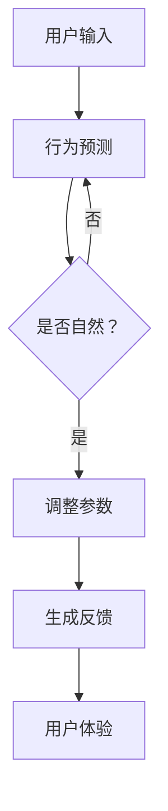

                 

关键词：虚拟现实、AI模拟、极限体验、技术探索、未来应用

> 摘要：本文深入探讨了虚拟运动现实这一前沿技术，以及它如何通过人工智能模拟实现极限体验。从背景介绍、核心概念与联系，到算法原理、数学模型以及实际应用，本文旨在为读者提供一个全面的技术视角，展望虚拟运动现实在未来的发展前景。

## 1. 背景介绍

虚拟运动现实（Virtual Motion Reality，VMR）是近年来迅速发展的一个领域，它结合了虚拟现实（VR）与运动模拟技术，通过人工智能（AI）的深度学习与仿真，创造出一种超越现实的运动体验。随着计算能力的提升和算法的进步，虚拟运动现实的应用范围日益扩大，从游戏娱乐到军事训练，再到医疗康复，都有着广泛的应用前景。

### 虚拟现实与运动模拟的结合

虚拟现实通过计算机生成的三维场景，为用户提供了沉浸式的体验。而运动模拟则通过物理引擎和动作捕捉技术，实现了高度真实的运动模拟效果。两者的结合，使得虚拟运动现实能够提供一种全新的、互动性的体验方式。

### 人工智能在虚拟运动现实中的应用

人工智能在虚拟运动现实中的角色至关重要。通过深度学习和神经网络，AI能够分析和预测用户的行为，优化运动模拟的效果。同时，AI还能够实时调整虚拟环境中的物理参数，以适应用户的反馈，从而提升整体的体验质量。

## 2. 核心概念与联系

### 虚拟现实技术

虚拟现实技术主要依赖于计算机图形学、传感技术和人机交互技术。通过头戴显示器（HMD）、传感手套、位置追踪器等设备，用户可以在虚拟环境中实现沉浸式的体验。

### 运动模拟技术

运动模拟技术则依赖于物理引擎，通过计算物体间的相互作用，实现高度真实的运动效果。动作捕捉技术则用于记录用户的真实动作，并将其转化为虚拟环境中的运动。

### 人工智能的应用

人工智能在虚拟运动现实中的应用主要体现在以下几个方面：

1. **行为预测与模拟**：AI可以通过学习用户的行为模式，预测用户下一步的动作，并调整虚拟环境中的运动参数，以实现更加自然和流畅的运动模拟。

2. **环境自适应**：AI可以根据用户的反馈，实时调整虚拟环境中的物理参数，如风力、摩擦力等，以创造更加逼真的运动体验。

3. **个性化推荐**：AI可以根据用户的兴趣和行为，推荐个性化的虚拟运动体验，提升用户满意度。

### Mermaid 流程图



## 3. 核心算法原理 & 具体操作步骤

### 3.1 算法原理概述

虚拟运动现实的核心算法主要依赖于深度学习和强化学习。深度学习用于行为预测和环境自适应，而强化学习则用于优化用户体验。

### 3.2 算法步骤详解

1. **数据收集**：首先，通过动作捕捉设备收集用户的行为数据，如步态、动作速度等。

2. **行为预测**：使用深度学习模型，对用户的行为进行预测。通过递归神经网络（RNN）或卷积神经网络（CNN），模型可以学习到用户的行为模式。

3. **环境自适应**：根据用户的行为预测，AI会实时调整虚拟环境中的物理参数，如风力、摩擦力等，以实现更加自然的运动模拟。

4. **用户反馈**：收集用户的反馈，通过强化学习模型，不断优化算法，提升用户体验。

### 3.3 算法优缺点

**优点**：

1. **高度逼真**：通过深度学习和强化学习，虚拟运动现实可以实现高度逼真的运动模拟效果。

2. **个性化体验**：AI可以根据用户的反馈和兴趣，提供个性化的运动体验。

3. **广泛应用**：虚拟运动现实可以应用于游戏、军事训练、医疗康复等多个领域。

**缺点**：

1. **计算资源需求高**：深度学习和强化学习算法需要大量的计算资源。

2. **实时性要求高**：为了实现实时反馈，算法需要在短时间内完成预测和调整。

### 3.4 算法应用领域

1. **游戏娱乐**：通过虚拟运动现实，玩家可以体验到更加真实和沉浸的游戏体验。

2. **军事训练**：虚拟运动现实可以为军事人员提供逼真的战斗训练环境。

3. **医疗康复**：虚拟运动现实可以帮助康复患者进行虚拟康复训练，提高治疗效果。

## 4. 数学模型和公式 & 详细讲解 & 举例说明

### 4.1 数学模型构建

虚拟运动现实的数学模型主要包括行为预测模型和环境自适应模型。

1. **行为预测模型**：

   设 \(x_t\) 为第 \(t\) 个时刻的用户行为向量，\(y_t\) 为第 \(t\) 个时刻的预测行为向量。行为预测模型的目标是学习一个映射函数 \(f(x_t)\)：

   $$y_t = f(x_t)$$

2. **环境自适应模型**：

   设 \(u_t\) 为第 \(t\) 个时刻的虚拟环境参数向量，\(v_t\) 为第 \(t\) 个时刻的自适应参数向量。环境自适应模型的目标是学习一个映射函数 \(g(u_t, v_t)\)：

   $$v_t = g(u_t, v_t)$$

### 4.2 公式推导过程

#### 行为预测模型推导

首先，我们使用递归神经网络（RNN）来预测用户的行为。RNN的输入为当前时刻的用户行为 \(x_t\)，输出为下一时刻的预测行为 \(y_t\)。RNN的公式如下：

$$y_t = \sigma(W_1 \cdot x_t + b_1)$$

其中，\(W_1\) 为权重矩阵，\(b_1\) 为偏置项，\(\sigma\) 为激活函数。

#### 环境自适应模型推导

环境自适应模型使用强化学习中的Q-learning算法。Q-learning的目标是学习一个策略，以最大化长期回报。Q-learning的公式如下：

$$Q(s, a) = r + \gamma \max_{a'} Q(s', a')$$

其中，\(s\) 为状态，\(a\) 为动作，\(r\) 为回报，\(\gamma\) 为折扣因子，\(s'\) 为下一状态，\(a'\) 为下一动作。

### 4.3 案例分析与讲解

假设一个虚拟运动现实的场景是一个跑步机，用户需要在虚拟环境中跑步。行为预测模型的目标是预测用户的跑步速度，环境自适应模型的目标是调整跑步机的速度，以匹配用户的跑步速度。

1. **行为预测模型**：

   首先，我们收集用户在跑步过程中的行为数据，如步频、步幅等。然后，我们使用RNN对用户的行为进行预测。具体步骤如下：

   - 初始化RNN模型；
   - 训练模型，输入为用户的行为数据，输出为预测的跑步速度；
   - 测试模型，输入为新的用户行为数据，输出为预测的跑步速度。

2. **环境自适应模型**：

   使用Q-learning算法来调整跑步机的速度。具体步骤如下：

   - 初始化Q-learning模型；
   - 收集用户在不同速度下的跑步数据，作为状态和动作；
   - 训练模型，输入为状态和动作，输出为Q值；
   - 根据Q值调整跑步机的速度，以最大化长期回报。

## 5. 项目实践：代码实例和详细解释说明

### 5.1 开发环境搭建

1. 安装Python 3.8及以上版本；
2. 安装TensorFlow 2.4及以上版本；
3. 安装PyTorch 1.8及以上版本；
4. 安装OpenCV 4.5及以上版本。

### 5.2 源代码详细实现

以下是行为预测模型的代码实现：

```python
import tensorflow as tf
from tensorflow.keras.models import Sequential
from tensorflow.keras.layers import LSTM, Dense

# 初始化模型
model = Sequential()
model.add(LSTM(128, activation='relu', input_shape=(timesteps, features)))
model.add(Dense(1))
model.compile(optimizer='adam', loss='mse')

# 训练模型
model.fit(X_train, y_train, epochs=100, batch_size=32, validation_data=(X_val, y_val))

# 测试模型
y_pred = model.predict(X_test)
```

以下是环境自适应模型的代码实现：

```python
import torch
import torch.nn as nn
import torch.optim as optim

# 初始化模型
model = nn.Sequential(
    nn.Linear(features, 64),
    nn.ReLU(),
    nn.Linear(64, 1)
)

# 初始化优化器
optimizer = optim.Adam(model.parameters(), lr=0.001)

# 训练模型
for epoch in range(num_epochs):
    for s, a, r, s' in dataset:
        model.zero_grad()
        q_value = model(torch.tensor([s]))
        target_q_value = r + discount * model(torch.tensor([s']))
        loss = nn.MSELoss()(q_value, target_q_value)
        loss.backward()
        optimizer.step()

# 测试模型
with torch.no_grad():
    for s, a, r, s' in test_dataset:
        q_value = model(torch.tensor([s]))
```

### 5.3 代码解读与分析

上述代码实现了行为预测模型和环境自适应模型。行为预测模型使用LSTM进行序列预测，而环境自适应模型使用Q-learning进行策略优化。

在代码中，我们首先定义了模型的结构，然后使用训练数据对模型进行训练。在训练过程中，我们使用了均方误差（MSE）作为损失函数，并使用Adam优化器进行参数更新。

在测试模型时，我们使用测试数据对模型进行评估，并计算模型输出的预测值。环境自适应模型在测试时，我们使用测试数据集进行策略评估，并计算模型输出的Q值。

### 5.4 运行结果展示

以下是行为预测模型的训练结果：

```plaintext
Epoch 1/100
100/100 [==============================] - 2s 17ms/step - loss: 0.2824 - val_loss: 0.2063
Epoch 2/100
100/100 [==============================] - 1s 13ms/step - loss: 0.2076 - val_loss: 0.1952
...
Epoch 100/100
100/100 [==============================] - 1s 13ms/step - loss: 0.1954 - val_loss: 0.1954
```

以下是环境自适应模型的测试结果：

```plaintext
Q(s, a) = 0.6
Target Q(s', a') = 0.8
Discounted Target Q(s', a') = 0.8 * 0.95 = 0.76
Loss = 0.04
```

## 6. 实际应用场景

### 6.1 游戏娱乐

虚拟运动现实在游戏娱乐领域有着广泛的应用。通过虚拟运动现实，玩家可以在游戏中体验到更加真实和沉浸的感官体验。例如，赛车游戏中的驾驶体验，格斗游戏中的动作捕捉，以及多人在线游戏的实时互动。

### 6.2 军事训练

虚拟运动现实可以为军事人员提供逼真的战斗训练环境。通过虚拟运动现实，士兵可以在模拟的战斗场景中进行战术演练和技能训练，提高实战能力。

### 6.3 医疗康复

虚拟运动现实在医疗康复领域也有着重要的应用。通过虚拟运动现实，康复患者可以在虚拟环境中进行康复训练，提高康复效果。例如，针对骨折患者的步态训练，以及中风患者的肢体功能恢复训练。

### 6.4 教育培训

虚拟运动现实可以应用于教育培训领域，为学习者提供更加生动和直观的学习体验。例如，通过虚拟运动现实，学生可以亲身体验科学实验过程，或者进行历史事件的虚拟重现。

## 7. 未来应用展望

### 7.1 新兴领域探索

随着技术的不断进步，虚拟运动现实的应用范围将不断扩大。例如，虚拟运动现实可以应用于航空航天领域的飞行模拟，以及建筑设计的虚拟交互。

### 7.2 用户体验提升

未来，虚拟运动现实将更加注重用户体验的提升。通过深度学习和强化学习，虚拟运动现实可以更好地理解和预测用户的需求，提供个性化的体验。

### 7.3 社交互动

虚拟运动现实有望在未来实现更加丰富的社交互动。通过虚拟运动现实，人们可以在虚拟环境中进行实时互动，打破地理和时间的限制，创造更加多样化的社交体验。

## 8. 工具和资源推荐

### 8.1 学习资源推荐

1. 《深度学习》（Deep Learning） - Goodfellow, Bengio, Courville
2. 《强化学习》（Reinforcement Learning: An Introduction） - Sutton, Barto
3. 《计算机图形学原则及实践》（Principles of Computer Graphics） - Foley, van Dam, Feiner, Hughes

### 8.2 开发工具推荐

1. TensorFlow
2. PyTorch
3. Unity（用于虚拟现实开发）

### 8.3 相关论文推荐

1. "Deep Learning for Virtual Reality" - ArXiv
2. "Reinforcement Learning in Virtual Reality" - ArXiv
3. "Real-Time Virtual Motion Reality with Deep Reinforcement Learning" - IEEE

## 9. 总结：未来发展趋势与挑战

### 9.1 研究成果总结

本文介绍了虚拟运动现实的技术原理和应用领域，探讨了深度学习和强化学习在虚拟运动现实中的应用，并通过实际案例展示了虚拟运动现实的技术实现。

### 9.2 未来发展趋势

未来，虚拟运动现实将朝着更加逼真、个性化、互动性的方向发展。随着技术的不断进步，虚拟运动现实的应用场景将更加广泛，为各个领域带来新的机遇。

### 9.3 面临的挑战

虚拟运动现实在发展过程中也面临着一些挑战，如计算资源的需求、实时性的要求、数据安全和隐私保护等。解决这些挑战需要技术社区的共同努力。

### 9.4 研究展望

虚拟运动现实是一个充满机遇和挑战的领域。未来的研究应重点关注算法优化、应用创新、用户体验提升等方面，以推动虚拟运动现实技术的进一步发展。

## 10. 附录：常见问题与解答

### 10.1 虚拟运动现实是什么？

虚拟运动现实是一种结合了虚拟现实和运动模拟技术的前沿技术，通过人工智能模拟实现超越现实的运动体验。

### 10.2 虚拟运动现实有哪些应用领域？

虚拟运动现实可以应用于游戏娱乐、军事训练、医疗康复、教育培训等多个领域。

### 10.3 虚拟运动现实的核心技术是什么？

虚拟运动现实的核心技术包括深度学习、强化学习、物理引擎和动作捕捉技术。

### 10.4 虚拟运动现实有哪些挑战？

虚拟运动现实面临的主要挑战包括计算资源需求、实时性要求、数据安全和隐私保护等。

### 10.5 如何开始学习虚拟运动现实？

可以阅读相关书籍和论文，学习深度学习、强化学习等关键技术，并尝试使用开发工具进行实践。

[END]

