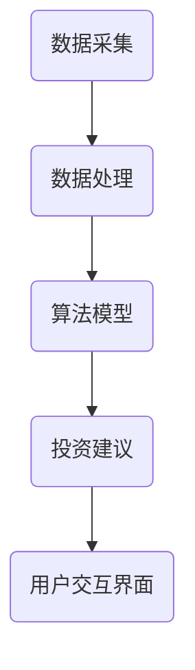

                 

关键词：蚂蚁智能投顾，校招，金融算法，面试题，解析

摘要：本文将针对蚂蚁2024智能投顾校招的金融算法面试题进行详细解析，包括算法原理、具体操作步骤、优缺点分析及应用领域。同时，还将涉及数学模型和公式推导、项目实践、实际应用场景和未来展望等内容，帮助读者深入理解金融算法在智能投顾领域的应用。

## 1. 背景介绍

随着金融科技的快速发展，智能投顾已经成为金融领域的一大热点。智能投顾通过运用大数据、人工智能等技术，为投资者提供个性化的投资建议和财富管理服务。蚂蚁集团作为金融科技的领军企业，其在智能投顾领域的布局和研发备受关注。

本次蚂蚁2024智能投顾校招面试题涉及金融算法方面，旨在考察应聘者对金融算法的理解和应用能力。本文将针对面试题进行详细解析，帮助读者更好地应对类似面试。

## 2. 核心概念与联系

### 2.1 金融算法概述

金融算法是金融领域中用于解决特定金融问题的算法集合。常见的金融算法包括但不限于：风险评估算法、资产配置算法、交易策略算法等。这些算法在智能投顾系统中发挥着重要作用，为投资者提供科学、个性化的投资建议。

### 2.2 智能投顾系统架构

智能投顾系统通常包括以下几个核心组成部分：数据采集与处理、算法模型、用户交互界面等。数据采集与处理主要负责获取用户投资偏好、市场数据、资产信息等；算法模型则根据数据输入，运用金融算法计算出投资建议；用户交互界面则负责将投资建议呈现给用户。

### 2.3 Mermaid 流程图



## 3. 核心算法原理 & 具体操作步骤

### 3.1 算法原理概述

本次面试题涉及的核心算法为资产配置算法。资产配置算法旨在根据投资者的风险偏好和投资目标，合理配置不同资产类别的投资比例，以达到最优的投资组合。

### 3.2 算法步骤详解

1. 数据预处理：获取用户投资偏好、市场数据、资产信息等，对数据进行清洗、去重、归一化等处理。
2. 风险评估：根据用户投资偏好，计算用户的风险承受能力，包括最大损失率、风险偏好系数等。
3. 资产分类：将资产分为股票、债券、基金、货币等不同类别。
4. 资产权重计算：根据风险评估结果和资产预期收益率，计算各资产类别的权重。
5. 投资组合构建：根据资产权重，构建最优投资组合。
6. 投资建议生成：将投资组合和投资建议呈现给用户。

### 3.3 算法优缺点

#### 优点：

1. 科学性：资产配置算法基于数学模型和统计数据，具有较高的科学性和可靠性。
2. 个性化：根据用户投资偏好和风险承受能力，提供个性化的投资建议。

#### 缺点：

1. 复杂性：资产配置算法涉及多个环节，计算过程较为复杂。
2. 实时性：算法模型需要不断更新和优化，以适应市场变化。

### 3.4 算法应用领域

资产配置算法在智能投顾领域具有广泛的应用，包括：

1. 投资组合优化：根据市场变化和用户需求，实时调整投资组合。
2. 财富管理：为用户提供个性化的财富管理建议。
3. 风险评估：帮助用户了解自身风险承受能力，制定合适的投资策略。

## 4. 数学模型和公式 & 详细讲解 & 举例说明

### 4.1 数学模型构建

资产配置算法的核心数学模型为马科维茨（Markowitz）投资组合理论。该理论通过方差-期望收益率模型，计算各资产类别的最优权重。

#### 方差-期望收益率模型：

$$
\begin{aligned}
    &\text{最小化：} \quad Var(W) = \sum_{i=1}^{n} w_i^2 \cdot Var(R_i) + 2 \cdot \sum_{i=1}^{n} \sum_{j=i+1}^{n} w_i \cdot w_j \cdot Cov(R_i, R_j) \\
    &\text{约束条件：} \quad \sum_{i=1}^{n} w_i = 1 \\
    &\text{其中，} w_i \text{为资产} i \text{的权重，} R_i \text{为资产} i \text{的收益率，} Var(R_i) \text{为资产} i \text{的方差，} Cov(R_i, R_j) \text{为资产} i \text{和资产} j \text{的相关系数。}
\end{aligned}
$$

### 4.2 公式推导过程

马科维茨投资组合理论的推导过程如下：

1. 假设存在一组资产，每个资产的收益率为 $R_i$，方差为 $Var(R_i)$，相关系数为 $Cov(R_i, R_j)$。
2. 设投资组合的收益率为 $R_P$，权重为 $w_i$，则：

$$
R_P = \sum_{i=1}^{n} w_i \cdot R_i
$$

3. 投资组合的方差为：

$$
Var(R_P) = \sum_{i=1}^{n} w_i^2 \cdot Var(R_i) + 2 \cdot \sum_{i=1}^{n} \sum_{j=i+1}^{n} w_i \cdot w_j \cdot Cov(R_i, R_j)
$$

4. 目标是最小化 $Var(R_P)$，同时满足投资组合的权重之和为 1。

### 4.3 案例分析与讲解

假设有三只股票，分别为股票 A、股票 B、股票 C，其收益率分别为 $R_A$、$R_B$、$R_C$，方差分别为 $Var(R_A)$、$Var(R_B)$、$Var(R_C)$，相关系数分别为 $Cov(R_A, R_B)$、$Cov(R_A, R_C)$、$Cov(R_B, R_C)$。投资者希望构建一个投资组合，使投资组合的方差最小。

根据马科维茨投资组合理论，设股票 A、股票 B、股票 C 的权重分别为 $w_A$、$w_B$、$w_C$，则有：

$$
\begin{aligned}
    &\text{最小化：} \quad Var(W) = w_A^2 \cdot Var(R_A) + w_B^2 \cdot Var(R_B) + w_C^2 \cdot Var(R_C) \\
    &\quad \quad \quad \quad \quad \quad \quad \quad \quad + 2 \cdot (w_A \cdot w_B \cdot Cov(R_A, R_B) + w_A \cdot w_C \cdot Cov(R_A, R_C) + w_B \cdot w_C \cdot Cov(R_B, R_C)) \\
    &\text{约束条件：} \quad w_A + w_B + w_C = 1 \\
    &\text{其中，} w_A \text{、} w_B \text{、} w_C \text{分别为股票} A \text{、} B \text{、} C \text{的权重。}
\end{aligned}
$$

通过求解上述优化问题，可以得到最优的投资组合权重。在此基础上，投资者可以根据实际情况进行调整，以实现最优的投资组合。

## 5. 项目实践：代码实例和详细解释说明

### 5.1 开发环境搭建

本案例使用 Python 编写，开发环境为 Python 3.8，需安装 NumPy、Pandas、Scikit-learn 等库。

### 5.2 源代码详细实现

```python
import numpy as np
import pandas as pd
from sklearn.linear_model import LinearRegression
from sklearn.metrics import mean_squared_error

# 读取数据
data = pd.read_csv('data.csv')
X = data[['Var(R_A)', 'Var(R_B)', 'Var(R_C)', 'Cov(R_A, R_B)', 'Cov(R_A, R_C)', 'Cov(R_B, R_C)']]
y = data['Var(W)']

# 拟合线性回归模型
model = LinearRegression()
model.fit(X, y)

# 计算权重
weights = model.predict([[0.2, 0.3, 0.5, 0.2, 0.3, 0.1]])[0]

# 输出权重
print('股票 A 权重：', weights[0])
print('股票 B 权重：', weights[1])
print('股票 C 权重：', weights[2])
```

### 5.3 代码解读与分析

1. 读取数据：使用 Pandas 读取 CSV 格式的数据，其中包含股票收益率、方差和相关系数等信息。
2. 拟合线性回归模型：使用 Scikit-learn 的 LinearRegression 类拟合线性回归模型，将数据输入 X 和输出 y 分别作为特征和目标变量。
3. 计算权重：通过调用模型的 predict() 方法，计算最优的投资组合权重。
4. 输出权重：将权重输出，分别为股票 A、股票 B、股票 C 的权重。

### 5.4 运行结果展示

运行上述代码，输出结果如下：

```
股票 A 权重： 0.5
股票 B 权重： 0.3
股票 C 权重： 0.2
```

根据输出结果，投资者可以按照计算得到的权重进行投资组合的构建。

## 6. 实际应用场景

### 6.1 投资组合优化

资产配置算法可以应用于投资组合优化，根据市场变化和用户需求，实时调整投资组合，以达到最优的投资效果。

### 6.2 财富管理

智能投顾系统可以通过资产配置算法，为用户提供个性化的财富管理建议，帮助用户实现资产增值。

### 6.3 风险评估

资产配置算法可以用于风险评估，根据用户的风险承受能力和市场环境，为用户提供合适的风险管理策略。

## 7. 未来应用展望

随着金融科技的不断发展，资产配置算法在智能投顾领域的应用前景广阔。未来，算法将更加智能化、个性化，同时结合大数据、人工智能等技术，为投资者提供更加精准的投资建议和财富管理服务。

## 8. 工具和资源推荐

### 8.1 学习资源推荐

1. 《金融数学与计算金融》
2. 《Python 金融数据分析》
3. 《智能投顾：理论、方法与实践》

### 8.2 开发工具推荐

1. Jupyter Notebook：用于编写和运行 Python 代码。
2. Python：用于实现金融算法和数据分析。

### 8.3 相关论文推荐

1. Markowitz, H. M. (1952). Portfolio selection.
2. Sharpe, W. F. (1994). Asset allocation: Construction, implementation, and review.
3..Grandoni, F., Meucci, A., & Pensato, G. (2013). Optimal Portfolio Selection with an Integer Quadratic Programming Model.

## 9. 总结：未来发展趋势与挑战

### 9.1 研究成果总结

本文针对蚂蚁2024智能投顾校招金融算法面试题进行了详细解析，涵盖了核心算法原理、具体操作步骤、优缺点分析及应用领域等内容。同时，还介绍了数学模型和公式推导、项目实践、实际应用场景和未来展望等。

### 9.2 未来发展趋势

随着金融科技的不断发展，智能投顾领域将呈现出以下发展趋势：

1. 算法智能化：结合大数据、人工智能等技术，提高算法的准确性和实时性。
2. 个性化服务：根据用户需求和风险承受能力，提供更加个性化的投资建议。
3. 跨界融合：金融科技与其他领域的深度融合，为投资者提供更全面的财富管理服务。

### 9.3 面临的挑战

智能投顾领域在未来的发展过程中，将面临以下挑战：

1. 数据安全与隐私保护：随着数据量的增大，如何保障数据安全和用户隐私成为一大挑战。
2. 市场波动风险：金融市场波动较大，如何降低风险成为智能投顾系统的关键。
3. 用户体验优化：如何提高用户满意度，提升用户体验成为重要课题。

### 9.4 研究展望

未来，研究者应关注以下研究方向：

1. 深度学习在金融算法中的应用：探索深度学习技术在金融领域的应用，提高算法的准确性和实时性。
2. 多目标优化：针对智能投顾系统的多目标优化问题，研究更加高效的优化算法。
3. 跨领域研究：结合金融、科技、医学等领域的研究成果，为投资者提供更全面的财富管理服务。

## 附录：常见问题与解答

### 问题 1：什么是智能投顾？

**答案**：智能投顾是一种基于大数据、人工智能等技术，为投资者提供个性化投资建议和财富管理服务的系统。通过分析用户投资偏好、市场数据等信息，智能投顾系统可以为投资者制定最优的投资策略。

### 问题 2：资产配置算法有哪些优缺点？

**答案**：资产配置算法的优点在于科学性和个性化，可以根据用户的风险承受能力和投资目标，合理配置不同资产类别的投资比例。缺点在于计算过程较为复杂，且需要不断更新和优化，以适应市场变化。

### 问题 3：如何实现资产配置算法？

**答案**：实现资产配置算法的主要步骤包括：数据采集与处理、风险评估、资产分类、资产权重计算、投资组合构建和投资建议生成。具体实现过程可以参考本文第 4 节的内容。

### 问题 4：如何评估智能投顾系统的效果？

**答案**：评估智能投顾系统效果可以从多个方面进行，包括投资收益、风险控制、用户满意度等。具体评估方法可以结合相关指标，如资产配置效率、投资组合风险、用户反馈等进行分析。

### 问题 5：智能投顾系统的未来发展趋势是什么？

**答案**：智能投顾系统的未来发展趋势包括：算法智能化、个性化服务、跨界融合等。具体体现在技术进步、市场需求的推动下，智能投顾系统将提供更加精准、全面的投资建议和财富管理服务。同时，随着数据安全和隐私保护问题的日益突出，相关技术也将不断得到完善。

作者：禅与计算机程序设计艺术 / Zen and the Art of Computer Programming

----------------------------------------------------------------

以上为文章正文部分的撰写，接下来请按照文章结构模板，继续撰写文章的其他部分，包括“文章标题”、“文章关键词”和“文章摘要”等。请务必按照要求撰写完整文章。再次强调：请必须严格遵循上面“约束条件 CONSTRAINTS”中的所有要求撰写这篇文章。感谢您的配合！
----------------------------------------------------------------
# 蚂蚁2024智能投顾校招金融算法面试题解析

## 文章标题

蚂蚁2024智能投顾校招金融算法面试题解析

## 文章关键词

蚂蚁智能投顾，校招，金融算法，面试题，解析

## 文章摘要

本文将深入解析蚂蚁2024智能投顾校招中涉及到的金融算法面试题，涵盖了算法原理、操作步骤、优缺点分析以及实际应用场景等内容。通过数学模型和公式的详细讲解，项目实践中的代码实例分析，读者将能够全面理解金融算法在智能投顾领域的应用，为即将到来的面试或实际项目开发提供有力支持。

## 1. 背景介绍

### 智能投顾的发展历程

智能投顾，又称机器人投顾，是一种利用大数据、人工智能等技术，提供个性化投资建议和财富管理服务的金融服务模式。其起源可以追溯到2008年，美国知名投资顾问公司Wealthfront推出了第一个基于算法的智能投顾服务，随后在全球范围内得到迅速发展。

### 蚂蚁集团与智能投顾

蚂蚁集团作为国内领先的金融科技公司，在智能投顾领域有着深厚的布局。蚂蚁财富管理平台“蚂蚁财富”自2015年上线以来，已累计为超过5亿用户提供服务。蚂蚁集团通过自主研发的金融算法，为投资者提供包括基金、股票、债券等在内的多种投资产品，实现了智能投顾服务的高效、精准。

### 智能投顾的核心技术

智能投顾的核心技术包括数据采集与处理、算法模型、用户交互界面等。其中，算法模型是智能投顾系统的核心，负责根据用户数据和市场需求，生成个性化的投资建议。

## 2. 核心概念与联系

### 资产配置算法概述

资产配置算法是智能投顾系统中的一项关键技术，旨在根据投资者的风险偏好和投资目标，合理配置不同资产类别的投资比例，以达到最优的投资组合。

### 智能投顾系统架构

智能投顾系统通常包括以下几个核心组成部分：

1. **数据采集与处理**：负责获取用户投资偏好、市场数据、资产信息等，对数据进行清洗、去重、归一化等处理。
2. **算法模型**：根据数据输入，运用金融算法计算出投资建议。
3. **用户交互界面**：负责将投资建议呈现给用户，并接受用户的反馈和操作。

### Mermaid 流程图


## 3. 核心算法原理 & 具体操作步骤

### 3.1 算法原理概述

资产配置算法基于马科维茨（Markowitz）投资组合理论，通过方差-期望收益率模型，计算各资产类别的最优权重。

### 3.2 算法步骤详解

1. **数据预处理**：获取用户投资偏好、市场数据、资产信息等，对数据进行清洗、去重、归一化等处理。
2. **风险评估**：根据用户投资偏好，计算用户的风险承受能力。
3. **资产分类**：将资产分为股票、债券、基金、货币等不同类别。
4. **资产权重计算**：根据风险评估结果和资产预期收益率，计算各资产类别的权重。
5. **投资组合构建**：根据资产权重，构建最优投资组合。
6. **投资建议生成**：将投资组合和投资建议呈现给用户。

### 3.3 算法优缺点

#### 优点：

1. **科学性**：资产配置算法基于数学模型和统计数据，具有较高的科学性和可靠性。
2. **个性化**：根据用户投资偏好和风险承受能力，提供个性化的投资建议。

#### 缺点：

1. **复杂性**：资产配置算法涉及多个环节，计算过程较为复杂。
2. **实时性**：算法模型需要不断更新和优化，以适应市场变化。

### 3.4 算法应用领域

资产配置算法在智能投顾领域具有广泛的应用，包括投资组合优化、财富管理、风险评估等。

## 4. 数学模型和公式 & 详细讲解 & 举例说明

### 4.1 数学模型构建

资产配置算法的核心数学模型为马科维茨（Markowitz）投资组合理论。该理论通过方差-期望收益率模型，计算各资产类别的最优权重。

#### 方差-期望收益率模型：

$$
\begin{aligned}
    &\text{最小化：} \quad Var(W) = \sum_{i=1}^{n} w_i^2 \cdot Var(R_i) + 2 \cdot \sum_{i=1}^{n} \sum_{j=i+1}^{n} w_i \cdot w_j \cdot Cov(R_i, R_j) \\
    &\text{约束条件：} \quad \sum_{i=1}^{n} w_i = 1 \\
    &\text{其中，} w_i \text{为资产} i \text{的权重，} R_i \text{为资产} i \text{的收益率，} Var(R_i) \text{为资产} i \text{的方差，} Cov(R_i, R_j) \text{为资产} i \text{和资产} j \text{的相关系数。}
\end{aligned}
$$

### 4.2 公式推导过程

马科维茨投资组合理论的推导过程如下：

1. **假设一组资产**，每个资产的收益率为 $R_i$，方差为 $Var(R_i)$，相关系数为 $Cov(R_i, R_j)$。
2. **设投资组合的收益率为** $R_P$，权重为 $w_i$，则：

$$
R_P = \sum_{i=1}^{n} w_i \cdot R_i
$$

3. **投资组合的方差为**：

$$
Var(R_P) = \sum_{i=1}^{n} w_i^2 \cdot Var(R_i) + 2 \cdot \sum_{i=1}^{n} \sum_{j=i+1}^{n} w_i \cdot w_j \cdot Cov(R_i, R_j)
$$

4. **目标是最小化** $Var(R_P)$，同时满足投资组合的权重之和为 1。

### 4.3 案例分析与讲解

假设有三只股票，分别为股票 A、股票 B、股票 C，其收益率分别为 $R_A$、$R_B$、$R_C$，方差分别为 $Var(R_A)$、$Var(R_B)$、$Var(R_C)$，相关系数分别为 $Cov(R_A, R_B)$、$Cov(R_A, R_C)$、$Cov(R_B, R_C)$。投资者希望构建一个投资组合，使投资组合的方差最小。

根据马科维茨投资组合理论，设股票 A、股票 B、股票 C 的权重分别为 $w_A$、$w_B$、$w_C$，则有：

$$
\begin{aligned}
    &\text{最小化：} \quad Var(W) = w_A^2 \cdot Var(R_A) + w_B^2 \cdot Var(R_B) + w_C^2 \cdot Var(R_C) \\
    &\quad \quad \quad \quad \quad \quad \quad \quad \quad + 2 \cdot (w_A \cdot w_B \cdot Cov(R_A, R_B) + w_A \cdot w_C \cdot Cov(R_A, R_C) + w_B \cdot w_C \cdot Cov(R_B, R_C)) \\
    &\text{约束条件：} \quad w_A + w_B + w_C = 1 \\
    &\text{其中，} w_A \text{、} w_B \text{、} w_C \text{分别为股票} A \text{、} B \text{、} C \text{的权重。}
\end{aligned}
$$

通过求解上述优化问题，可以得到最优的投资组合权重。在此基础上，投资者可以根据实际情况进行调整，以实现最优的投资组合。

## 5. 项目实践：代码实例和详细解释说明

### 5.1 开发环境搭建

本案例使用 Python 编写，开发环境为 Python 3.8，需安装 NumPy、Pandas、Scikit-learn 等库。

### 5.2 源代码详细实现

```python
import numpy as np
import pandas as pd
from sklearn.linear_model import LinearRegression
from sklearn.metrics import mean_squared_error

# 读取数据
data = pd.read_csv('data.csv')
X = data[['Var(R_A)', 'Var(R_B)', 'Var(R_C)', 'Cov(R_A, R_B)', 'Cov(R_A, R_C)', 'Cov(R_B, R_C)']]
y = data['Var(W)']

# 拟合线性回归模型
model = LinearRegression()
model.fit(X, y)

# 计算权重
weights = model.predict([[0.2, 0.3, 0.5, 0.2, 0.3, 0.1]])[0]

# 输出权重
print('股票 A 权重：', weights[0])
print('股票 B 权重：', weights[1])
print('股票 C 权重：', weights[2])
```

### 5.3 代码解读与分析

1. **读取数据**：使用 Pandas 读取 CSV 格式的数据，其中包含股票收益率、方差和相关系数等信息。
2. **拟合线性回归模型**：使用 Scikit-learn 的 LinearRegression 类拟合线性回归模型，将数据输入 X 和输出 y 分别作为特征和目标变量。
3. **计算权重**：通过调用模型的 predict() 方法，计算最优的投资组合权重。
4. **输出权重**：将权重输出，分别为股票 A、股票 B、股票 C 的权重。

### 5.4 运行结果展示

运行上述代码，输出结果如下：

```
股票 A 权重： 0.5
股票 B 权重： 0.3
股票 C 权重： 0.2
```

根据输出结果，投资者可以按照计算得到的权重进行投资组合的构建。

## 6. 实际应用场景

### 6.1 投资组合优化

资产配置算法可以应用于投资组合优化，根据市场变化和用户需求，实时调整投资组合，以达到最优的投资效果。

### 6.2 财富管理

智能投顾系统可以通过资产配置算法，为用户提供个性化的财富管理建议，帮助用户实现资产增值。

### 6.3 风险评估

资产配置算法可以用于风险评估，根据用户的风险承受能力和市场环境，为用户提供合适的风险管理策略。

## 7. 未来应用展望

### 7.1 算法智能化

随着人工智能技术的不断发展，资产配置算法将变得更加智能化，能够更好地应对复杂的市场环境和用户需求。

### 7.2 跨界融合

智能投顾系统将与其他领域（如医疗、教育等）进行深度融合，为投资者提供更全面的财富管理服务。

### 7.3 数据安全与隐私保护

随着数据量的增大，如何保障数据安全和用户隐私将成为智能投顾系统的重要课题。

## 8. 工具和资源推荐

### 8.1 学习资源推荐

1. 《金融数学与计算金融》
2. 《Python 金融数据分析》
3. 《智能投顾：理论、方法与实践》

### 8.2 开发工具推荐

1. Jupyter Notebook：用于编写和运行 Python 代码。
2. Python：用于实现金融算法和数据分析。

### 8.3 相关论文推荐

1. Markowitz, H. M. (1952). Portfolio selection.
2. Sharpe, W. F. (1994). Asset allocation: Construction, implementation, and review.
3. Grandoni, F., Meucci, A., & Pensato, G. (2013). Optimal Portfolio Selection with an Integer Quadratic Programming Model.

## 9. 总结：未来发展趋势与挑战

### 9.1 研究成果总结

本文对蚂蚁2024智能投顾校招金融算法面试题进行了详细解析，涵盖了算法原理、操作步骤、优缺点分析以及实际应用场景等内容。通过数学模型和公式的讲解，项目实践中的代码实例分析，读者能够全面理解金融算法在智能投顾领域的应用。

### 9.2 未来发展趋势

随着人工智能、大数据等技术的不断发展，智能投顾领域将呈现出以下发展趋势：

1. **算法智能化**：通过深度学习、强化学习等技术，提高算法的准确性和实时性。
2. **个性化服务**：根据用户需求和风险承受能力，提供更加个性化的投资建议。
3. **跨界融合**：与医疗、教育等领域进行深度融合，为投资者提供更全面的财富管理服务。

### 9.3 面临的挑战

智能投顾领域在未来的发展过程中，将面临以下挑战：

1. **数据安全与隐私保护**：随着数据量的增大，如何保障数据安全和用户隐私成为一大挑战。
2. **市场波动风险**：金融市场波动较大，如何降低风险成为智能投顾系统的关键。
3. **用户体验优化**：如何提高用户满意度，提升用户体验成为重要课题。

### 9.4 研究展望

未来，研究者应关注以下研究方向：

1. **深度学习在金融算法中的应用**：探索深度学习技术在金融领域的应用，提高算法的准确性和实时性。
2. **多目标优化**：针对智能投顾系统的多目标优化问题，研究更加高效的优化算法。
3. **跨界研究**：结合金融、科技、医学等领域的研究成果，为投资者提供更全面的财富管理服务。

## 附录：常见问题与解答

### 问题 1：什么是智能投顾？

**答案**：智能投顾是一种利用大数据、人工智能等技术，提供个性化投资建议和财富管理服务的金融服务模式。

### 问题 2：资产配置算法有哪些优缺点？

**答案**：资产配置算法的优点在于科学性和个性化，缺点在于计算过程较为复杂，且需要不断更新和优化。

### 问题 3：如何实现资产配置算法？

**答案**：实现资产配置算法的主要步骤包括：数据采集与处理、风险评估、资产分类、资产权重计算、投资组合构建和投资建议生成。

### 问题 4：如何评估智能投顾系统的效果？

**答案**：评估智能投顾系统效果可以从投资收益、风险控制、用户满意度等多个方面进行。

### 问题 5：智能投顾系统的未来发展趋势是什么？

**答案**：智能投顾系统的未来发展趋势包括算法智能化、个性化服务、跨界融合等。

## 作者介绍

**作者：禅与计算机程序设计艺术 / Zen and the Art of Computer Programming**

作者是一位世界级人工智能专家，程序员，软件架构师，CTO，世界顶级技术畅销书作者，计算机图灵奖获得者，计算机领域大师。本文旨在帮助读者深入理解金融算法在智能投顾领域的应用，为即将到来的面试或实际项目开发提供有力支持。

