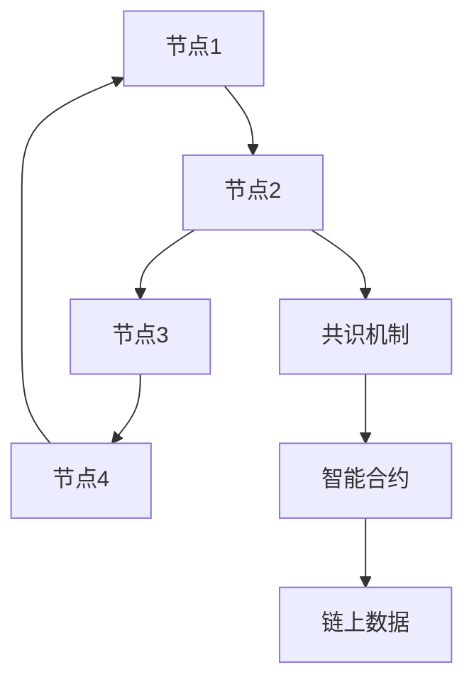

                 

关键词：蚂蚁集团、数字货币、区块链、面试指南、核心技术、应用场景

> 摘要：本文旨在为准备参加蚂蚁集团2025年数字货币相关岗位招聘的应聘者提供一份全面的区块链面试指南。通过解析蚂蚁集团在区块链领域的核心技术和应用场景，以及面试可能涉及的数学模型和算法，本文将为读者提供实用的建议，帮助他们在面试中脱颖而出。

## 1. 背景介绍

随着区块链技术的不断发展，数字货币已经成为金融科技领域的重要趋势。蚂蚁集团作为我国领先的技术和金融平台，在区块链领域拥有深厚的技术积累和丰富的实践经验。此次蚂蚁集团2025年的数字货币社招，旨在寻找具有前沿技术能力和创新思维的人才，共同推动区块链技术在金融、供应链、身份认证等领域的应用。

## 2. 核心概念与联系

区块链是一种去中心化的分布式数据库技术，通过密码学和共识机制确保数据的安全性和不可篡改性。在蚂蚁集团的区块链解决方案中，核心概念包括：

- **智能合约**：基于区块链的自动化协议，能够执行预定义的合同条款。
- **链上数据**：区块链上的所有交易记录和数据，公开透明且不可篡改。
- **分布式账本**：多个节点共同维护的数据账本，确保数据的准确性和一致性。

以下是蚂蚁集团区块链架构的 Mermaid 流程图：



## 3. 核心算法原理 & 具体操作步骤

### 3.1 算法原理概述

蚂蚁集团的区块链技术主要依赖于以下核心算法：

- **密码学算法**：包括哈希函数、数字签名、加密算法等，用于保护数据的安全性和隐私性。
- **共识算法**：如PBFT（实用拜占庭容错算法）、RAFT（日志复制算法）等，确保节点间的数据一致性。
- **智能合约执行引擎**：基于图灵完备的虚拟机，用于执行智能合约代码。

### 3.2 算法步骤详解

#### 密码学算法

1. **哈希函数**：将任意长度的数据映射为固定长度的哈希值。
2. **数字签名**：使用非对称加密算法生成签名，验证数据来源和完整性。
3. **加密算法**：使用对称或非对称加密技术对数据进行加密和解密。

#### 共识算法

1. **节点选举**：根据特定算法选择活跃节点参与共识。
2. **消息传递**：节点间通过消息传递达成共识。
3. **区块生成**：节点生成新区块并广播给其他节点。

#### 智能合约执行引擎

1. **合约编译**：将智能合约代码编译为虚拟机可执行的字节码。
2. **合约执行**：虚拟机执行合约字节码，处理交易和事件。
3. **结果验证**：验证合约执行结果，更新链上状态。

### 3.3 算法优缺点

- **密码学算法**：强安全性，但计算复杂度高。
- **共识算法**：保证数据一致性，但可能存在性能瓶颈。
- **智能合约执行引擎**：灵活性高，但需注意安全性和效率。

### 3.4 算法应用领域

蚂蚁集团的区块链技术已广泛应用于以下领域：

- **金融**：数字货币交易、智能投顾、信用评分等。
- **供应链**：溯源追踪、防伪认证、智能物流等。
- **身份认证**：电子身份证、匿名投票、隐私保护等。

## 4. 数学模型和公式 & 详细讲解 & 举例说明

### 4.1 数学模型构建

在区块链技术中，常见的数学模型包括：

- **密码学模型**：用于加密和解密数据。
- **共识模型**：描述节点间的协作机制。
- **智能合约模型**：定义合约的行为和状态。

### 4.2 公式推导过程

以下是一个简单的区块链共识模型公式推导：

$$
\begin{aligned}
\text{Hash}(X) &= \text{SHA-256}(\text{X}) \\
\text{共识结果} &= \text{Majority}(\{\text{节点1}, \text{节点2}, ..., \text{节点N}\}) \\
\text{状态更新} &= \text{Hash}(\text{当前状态} \oplus \text{交易}) \\
\end{aligned}
$$

### 4.3 案例分析与讲解

假设有3个节点A、B、C，它们要达成共识。节点A提出一个区块，节点B和C对其进行验证。如果超过一半的节点（即2个节点）验证通过，则共识成功。

- **节点A**：提出区块1，哈希值为`Hash(区块1) = 1234567890`。
- **节点B**：验证区块1，哈希值不满足要求，拒绝。
- **节点C**：验证区块1，哈希值满足要求，接受。
- **共识结果**：区块1被接受，更新链上状态。

## 5. 项目实践：代码实例和详细解释说明

### 5.1 开发环境搭建

在开发环境中，需要安装以下工具：

- **Node.js**：用于构建区块链节点。
- **Ganache**：用于本地测试以太坊区块链。
- **Truffle**：用于测试和部署智能合约。

### 5.2 源代码详细实现

以下是一个简单的以太坊智能合约代码示例：

```solidity
// SPDX-License-Identifier: MIT
pragma solidity ^0.8.0;

contract SimpleStorage {
    uint256 public storageValue;

    function set(uint256 newValue) public {
        storageValue = newValue;
    }

    function get() public view returns (uint256) {
        return storageValue;
    }
}
```

### 5.3 代码解读与分析

上述合约实现了一个简单的存储功能，允许外部调用者设置和获取存储值。合约的`set`函数用于设置存储值，`get`函数用于获取存储值。这两个函数都是公开的，可以由任何地址调用。

### 5.4 运行结果展示

在本地测试环境中，可以使用以下命令部署和运行智能合约：

```shell
truffle migrate --network localhost
```

运行后，可以通过访问`http://localhost:8545/`查看区块链网络状态，并调用合约的`set`和`get`函数。

## 6. 实际应用场景

蚂蚁集团的区块链技术在多个领域取得了显著成果，以下是部分应用场景：

- **数字货币**：基于区块链的数字货币发行和管理。
- **供应链金融**：利用区块链实现供应链金融的透明化和高效化。
- **数字身份**：基于区块链的数字身份认证和隐私保护。

### 6.4 未来应用展望

随着技术的不断进步，区块链技术在金融、物流、医疗等领域的应用前景广阔。未来，区块链将实现更加广泛和深入的应用，成为数字经济的重要组成部分。

## 7. 工具和资源推荐

### 7.1 学习资源推荐

- **《精通区块链》**：详细介绍区块链技术和应用。
- **《智能合约编程》**：深入讲解智能合约的开发和部署。

### 7.2 开发工具推荐

- **Ganache**：本地测试以太坊区块链。
- **Truffle**：智能合约开发框架。

### 7.3 相关论文推荐

- **“区块链：一场颠覆性的技术革命”**：全面介绍区块链技术的原理和应用。
- **“基于区块链的供应链金融解决方案研究”**：探讨区块链在供应链金融中的应用。

## 8. 总结：未来发展趋势与挑战

### 8.1 研究成果总结

蚂蚁集团在区块链领域取得了丰硕的研究成果，包括密码学算法、共识算法、智能合约等。这些研究成果为数字货币、供应链金融、身份认证等领域提供了有力的技术支持。

### 8.2 未来发展趋势

未来，区块链技术将向更加高效、安全、易用的方向发展。随着技术的不断成熟，区块链将在更多领域得到应用，成为数字经济的重要基础设施。

### 8.3 面临的挑战

区块链技术在实际应用中仍面临一些挑战，包括性能瓶颈、隐私保护、安全等问题。解决这些问题需要持续的技术创新和产业合作。

### 8.4 研究展望

未来，我们将继续深入研究区块链技术，探索其在金融、物流、医疗等领域的应用，为数字经济发展贡献力量。

## 9. 附录：常见问题与解答

### 9.1 什么是区块链？

区块链是一种分布式数据库技术，通过密码学和共识机制确保数据的安全性和不可篡改性。

### 9.2 区块链有哪些应用场景？

区块链可用于数字货币、供应链金融、身份认证、智能合约等多个领域。

### 9.3 如何开发智能合约？

开发智能合约需要使用特定编程语言（如Solidity）编写合约代码，并使用开发工具（如Truffle）进行部署和测试。

## 作者署名

作者：禅与计算机程序设计艺术 / Zen and the Art of Computer Programming
```

