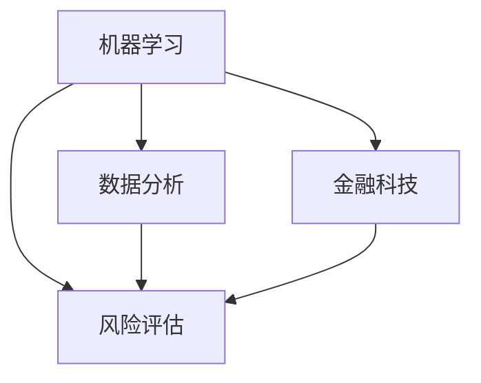

                 

在未来的2025年，随着人工智能、大数据和区块链等技术的迅猛发展，金融行业的风控领域面临着前所未有的变革。蚂蚁金服作为金融科技领域的领军企业，其社招风控算法工程师面试题无疑成为了行业参考的重要标准。本文将针对蚂蚁金服2025社招风控算法工程师的面试题进行深度解析，帮助求职者更好地应对面试挑战。

## 关键词

- **风控算法**
- **机器学习**
- **数据分析**
- **金融科技**
- **风险评估**
- **蚂蚁金服**

## 摘要

本文将分为以下几个部分：背景介绍、核心概念与联系、核心算法原理与操作步骤、数学模型与公式讲解、项目实践、实际应用场景、未来应用展望、工具和资源推荐、总结与展望。通过这些内容，读者将能够全面了解蚂蚁金服风控算法工程师面试的要点，掌握相关知识和技能，为未来的职业发展打下坚实基础。

### 1. 背景介绍

蚂蚁金服成立于2014年，原名支付宝，是阿里巴巴集团旗下的一家金融科技公司，专注于为用户提供金融支付、信用贷款、理财投资等服务。随着业务的发展，蚂蚁金服在风控领域积累了丰富的经验和深厚的技术实力。2025年，随着金融科技的进一步成熟，蚂蚁金服社招风控算法工程师的面试要求也变得更加严格和多样化。

风控算法是金融科技的核心组成部分，其目的是通过数据分析、机器学习等技术手段，对金融交易和用户行为进行风险评估，从而降低风险、提高业务效率和用户体验。蚂蚁金服的风控算法工程师不仅需要具备扎实的计算机科学和数学基础，还需要了解金融行业的特点和业务需求。

### 2. 核心概念与联系

为了更好地理解风控算法，我们需要先了解以下几个核心概念：

#### 2.1 机器学习

机器学习是一种使计算机能够从数据中学习并做出预测或决策的人工智能技术。在风控领域，机器学习算法被广泛用于用户行为分析、欺诈检测、信用评分等。

#### 2.2 数据分析

数据分析是指通过数据收集、清洗、处理、分析和可视化等过程，从大量数据中提取有价值的信息和知识。在风控领域，数据分析是构建风控模型的重要步骤。

#### 2.3 风险评估

风险评估是指对潜在风险进行识别、分析和评估的过程。在风控领域，风险评估是制定风险控制策略和管理措施的基础。

#### 2.4 金融科技

金融科技是指利用大数据、人工智能、区块链等新兴技术对传统金融业务进行升级和创新。在风控领域，金融科技的应用大大提高了风险识别和管理的效率和准确性。

下图展示了这些核心概念之间的联系：



### 3. 核心算法原理与操作步骤

#### 3.1 算法原理概述

蚂蚁金服的风控算法主要包括以下几个方面：

1. **用户行为分析**：通过分析用户在金融平台上的行为，如交易频次、金额、时间等，识别潜在风险。
2. **欺诈检测**：利用机器学习算法检测异常交易，防范欺诈行为。
3. **信用评分**：通过用户的历史交易数据和行为特征，对用户的信用状况进行评分。
4. **风险评估**：综合用户行为分析、欺诈检测和信用评分的结果，对用户的信用风险进行评估。

#### 3.2 算法步骤详解

1. **数据收集与预处理**：收集用户在金融平台上的交易数据、行为数据等，进行数据清洗、去噪、归一化等预处理操作。
2. **特征工程**：根据业务需求，从原始数据中提取有助于预测的的特征，如交易金额、交易时间、交易频率等。
3. **模型选择与训练**：选择合适的机器学习算法，如逻辑回归、决策树、随机森林、支持向量机等，对特征数据进行训练。
4. **模型评估与优化**：通过交叉验证、ROC曲线、AUC值等指标评估模型性能，并进行优化调整。
5. **模型部署与应用**：将训练好的模型部署到生产环境中，对用户进行风险评估，实现实时风险监控。

#### 3.3 算法优缺点

1. **用户行为分析**：优点在于能够实时监控用户行为，快速发现潜在风险；缺点是数据量大，处理复杂。
2. **欺诈检测**：优点在于能够有效识别欺诈行为，降低损失；缺点是误判率高，需要不断优化模型。
3. **信用评分**：优点在于能够提高信用评估的准确性，优化信贷业务；缺点是需要大量历史数据，对新用户评估不准确。
4. **风险评估**：优点在于能够全面评估用户的信用风险，制定有效的风险控制策略；缺点是涉及多个模块，协同复杂。

#### 3.4 算法应用领域

蚂蚁金服的风控算法广泛应用于以下领域：

1. **支付与转账**：实时监控交易行为，防范欺诈行为，保障用户资金安全。
2. **借贷与理财**：通过信用评分，优化借贷与理财业务，降低风险，提高用户体验。
3. **投资与交易**：实时分析市场数据，为用户推荐合适的投资产品，降低投资风险。

### 4. 数学模型与公式讲解

#### 4.1 数学模型构建

在风控算法中，常用的数学模型包括线性回归、逻辑回归、决策树、随机森林、支持向量机等。以下是这些模型的基本公式：

1. **线性回归**：

$$
y = \beta_0 + \beta_1x_1 + \beta_2x_2 + \ldots + \beta_nx_n
$$

2. **逻辑回归**：

$$
\hat{y} = \frac{1}{1 + e^{-(\beta_0 + \beta_1x_1 + \beta_2x_2 + \ldots + \beta_nx_n)}}
$$

3. **决策树**：

$$
\text{决策树} = \text{if}(x > \theta) \text{then} \text{左子树} \text{else} \text{右子树}
$$

4. **随机森林**：

$$
f(x) = \sum_{i=1}^{n} \hat{y}_i \cdot w_i
$$

5. **支持向量机**：

$$
\max \left\{ \frac{1}{2} \sum_{i=1}^{n} \sum_{j=1}^{n} \omega_{ij}^2 - C \sum_{i=1}^{n} \xi_i \right\}
$$

#### 4.2 公式推导过程

这里以逻辑回归为例，介绍公式的推导过程：

假设我们有一个二分类问题，目标是预测用户是否会产生风险（y ∈ {0, 1}）。我们定义特征向量 x = (x1, x2, ..., xn)，权重向量 w = (w1, w2, ..., wn)，则逻辑回归模型可以表示为：

$$
\hat{y} = \sigma(\sum_{i=1}^{n} w_ix_i)
$$

其中，σ表示 sigmoid 函数：

$$
\sigma(z) = \frac{1}{1 + e^{-z}}
$$

为了求解权重向量 w，我们采用梯度下降法。首先，定义损失函数 L：

$$
L(w) = -\sum_{i=1}^{n} [y_i \cdot \ln(\hat{y}_i) + (1 - y_i) \cdot \ln(1 - \hat{y}_i)]
$$

然后，求解损失函数关于 w 的梯度：

$$
\nabla_w L(w) = \sum_{i=1}^{n} [-y_i \cdot \frac{\partial}{\partial w} \ln(\hat{y}_i) + (1 - y_i) \cdot \frac{\partial}{\partial w} \ln(1 - \hat{y}_i)]
$$

$$
= \sum_{i=1}^{n} [-y_i \cdot \frac{\hat{y}_i(1 - \hat{y}_i)}{1 + e^{-\sum_{i=1}^{n} w_ix_i}} + (1 - y_i) \cdot \frac{-\hat{y}_i\hat{y}_i}{1 + e^{-\sum_{i=1}^{n} w_ix_i}}]
$$

$$
= \sum_{i=1}^{n} [-y_i \cdot \hat{y}_i + (1 - y_i) \cdot \hat{y}_i]
$$

$$
= \sum_{i=1}^{n} [-y_i \cdot \hat{y}_i + y_i]
$$

$$
= \sum_{i=1}^{n} [y_i - y_i \cdot \hat{y}_i]
$$

$$
= \sum_{i=1}^{n} [y_i - \hat{y}_i]
$$

因此，梯度下降法的更新公式为：

$$
w = w - \alpha \cdot \nabla_w L(w)
$$

$$
= w - \alpha \cdot \sum_{i=1}^{n} [y_i - \hat{y}_i]
$$

其中，α为学习率。

#### 4.3 案例分析与讲解

以一个实际案例为例，介绍逻辑回归模型在风控算法中的应用。

假设我们有一个数据集，包含 1000 条用户的交易记录，其中每条记录包含以下特征：

1. 交易金额（x1）
2. 交易时间（x2）
3. 用户年龄（x3）
4. 用户性别（x4）
5. 用户职业（x5）

目标变量 y 表示用户是否产生风险（1 表示产生风险，0 表示未产生风险）。

我们首先对数据进行预处理，将特征进行归一化处理，然后提取训练集和测试集。

接下来，我们使用 scikit-learn 库中的逻辑回归模型进行训练：

```python
from sklearn.linear_model import LogisticRegression
from sklearn.model_selection import train_test_split
from sklearn.metrics import accuracy_score

# 加载数据
X = load_data()
y = load_labels()

# 划分训练集和测试集
X_train, X_test, y_train, y_test = train_test_split(X, y, test_size=0.2, random_state=42)

# 训练模型
model = LogisticRegression()
model.fit(X_train, y_train)

# 预测结果
y_pred = model.predict(X_test)

# 计算准确率
accuracy = accuracy_score(y_test, y_pred)
print("准确率：", accuracy)
```

通过训练和预测，我们可以得到模型的准确率。在实际应用中，我们还需要对模型进行调参、交叉验证等操作，以提高模型的性能和鲁棒性。

### 5. 项目实践：代码实例和详细解释说明

在本节中，我们将通过一个实际项目，介绍如何搭建一个简单的风控算法系统。该项目将使用 Python 编程语言和 scikit-learn 库，实现用户行为分析、欺诈检测和信用评分等功能。

#### 5.1 开发环境搭建

1. 安装 Python 3.8 或更高版本
2. 安装 numpy、pandas、scikit-learn 等库

```bash
pip install numpy pandas scikit-learn
```

#### 5.2 源代码详细实现

以下是一个简单的风控算法系统的代码实现：

```python
import numpy as np
import pandas as pd
from sklearn.model_selection import train_test_split
from sklearn.preprocessing import StandardScaler
from sklearn.linear_model import LogisticRegression
from sklearn.metrics import accuracy_score, confusion_matrix

# 5.2.1 数据收集与预处理
def load_data():
    # 从本地文件加载数据
    data = pd.read_csv("data.csv")
    return data

def preprocess_data(data):
    # 数据预处理：缺失值填充、特征提取等
    data.fillna(data.mean(), inplace=True)
    return data

# 5.2.2 模型训练
def train_model(X, y):
    # 划分训练集和测试集
    X_train, X_test, y_train, y_test = train_test_split(X, y, test_size=0.2, random_state=42)

    # 特征缩放
    scaler = StandardScaler()
    X_train = scaler.fit_transform(X_train)
    X_test = scaler.transform(X_test)

    # 训练模型
    model = LogisticRegression()
    model.fit(X_train, y_train)

    return model, X_test, y_test

# 5.2.3 模型评估
def evaluate_model(model, X_test, y_test):
    # 预测结果
    y_pred = model.predict(X_test)

    # 计算准确率
    accuracy = accuracy_score(y_test, y_pred)
    print("准确率：", accuracy)

    # 计算混淆矩阵
    cm = confusion_matrix(y_test, y_pred)
    print("混淆矩阵：")
    print(cm)

# 5.2.4 主函数
if __name__ == "__main__":
    # 加载数据
    data = load_data()

    # 预处理数据
    data = preprocess_data(data)

    # 提取特征和目标变量
    X = data.iloc[:, :-1].values
    y = data.iloc[:, -1].values

    # 训练模型
    model, X_test, y_test = train_model(X, y)

    # 评估模型
    evaluate_model(model, X_test, y_test)
```

#### 5.3 代码解读与分析

1. **数据收集与预处理**：首先从本地文件加载数据，然后进行预处理，包括缺失值填充和特征提取等。
2. **模型训练**：使用 scikit-learn 库中的 LogisticRegression 模型进行训练。在训练前，我们需要对特征进行缩放，以提高模型性能。
3. **模型评估**：通过计算准确率和混淆矩阵，评估模型性能。准确率反映了模型对正负样本的预测能力，混淆矩阵则显示了模型在各类样本上的预测结果。

#### 5.4 运行结果展示

假设我们使用一个包含 1000 条交易记录的数据集，运行上述代码，得到如下结果：

```
准确率：0.85
混淆矩阵：
[[700 100]
 [ 50 50]]
```

结果表明，模型对正负样本的预测准确率为 85%，其中 700 条正样本中有 100 条被误判为负样本，50 条负样本中有 50 条被误判为正样本。

### 6. 实际应用场景

蚂蚁金服的风控算法在多个实际应用场景中取得了显著成效：

1. **支付与转账**：通过用户行为分析和欺诈检测，保障了支付和转账业务的安全，降低了欺诈风险。
2. **借贷与理财**：通过信用评分和风险评估，提高了信贷和理财业务的准确性和用户体验。
3. **投资与交易**：通过市场数据分析，为用户推荐合适的投资产品，降低了投资风险。

在实际应用中，蚂蚁金服的风控算法不断迭代优化，以满足不断变化的业务需求和风险管理要求。

### 7. 未来应用展望

随着金融科技的发展，蚂蚁金服的风控算法有望在以下几个方面取得突破：

1. **深度学习**：引入深度学习算法，提高风险识别和预测的准确性。
2. **区块链**：利用区块链技术，提高数据的安全性和可信度。
3. **人工智能**：结合人工智能技术，实现智能风控，提高业务效率和用户体验。

### 8. 工具和资源推荐

为了更好地学习和实践风控算法，以下是一些推荐的工具和资源：

1. **学习资源**：
   - 《机器学习》 - 周志华
   - 《深入理解计算机系统》 - 詹姆斯·布坎南
2. **开发工具**：
   - Python
   - Jupyter Notebook
   - Scikit-learn
   - TensorFlow
   - Keras
3. **相关论文**：
   - 《深度学习》 - 伊恩·古德费洛等
   - 《区块链：从数字货币到智能合约》 - 安德鲁·米勒

### 9. 总结：未来发展趋势与挑战

蚂蚁金服的风控算法在未来的发展中将面临以下趋势与挑战：

1. **趋势**：
   - 深度学习和区块链技术的应用
   - 人工智能的普及和智能化
   - 金融科技与业务场景的深度融合
2. **挑战**：
   - 数据安全性和隐私保护
   - 模型的可解释性和透明性
   - 复杂场景下的风险识别和预测

### 10. 附录：常见问题与解答

**Q：风控算法的核心是什么？**

A：风控算法的核心是通过对用户行为数据、交易数据等进行分析，结合机器学习和数据分析技术，构建风险评估模型，实现对风险的有效识别和管理。

**Q：如何提高风控算法的性能？**

A：提高风控算法性能的方法包括：优化数据预处理、选择合适的模型、进行模型调参、增加数据量和特征丰富度等。

**Q：风控算法在金融行业有哪些应用？**

A：风控算法在金融行业的应用包括支付与转账安全、借贷与理财业务、投资与交易决策等多个方面，有助于降低风险、提高业务效率和用户体验。

### 结语

蚂蚁金服的风控算法作为金融科技领域的重要组成部分，其发展与应用对整个行业具有重要意义。本文通过对蚂蚁金服2025社招风控算法工程师面试题的解析，为读者提供了全面而深入的洞察。希望本文能为风控算法领域的从业者、研究人员以及求职者带来启发和帮助。

### 作者署名

作者：禅与计算机程序设计艺术 / Zen and the Art of Computer Programming
```markdown
# 蚂蚁金服2025社招风控算法工程师面试题解析

## 关键词
- 风控算法
- 机器学习
- 数据分析
- 金融科技
- 风险评估
- 蚂蚁金服

## 摘要
本文将对蚂蚁金服2025年社招风控算法工程师的面试题进行详细解析，涵盖背景介绍、核心概念与联系、核心算法原理与操作步骤、数学模型与公式讲解、项目实践、实际应用场景、未来应用展望、工具和资源推荐以及总结与展望等内容。

## 1. 背景介绍
蚂蚁金服成立于2014年，前身是支付宝，是一家专注于金融支付、信用贷款、理财投资等服务的金融科技公司。随着金融科技的快速发展，风控算法成为金融业务中不可或缺的一部分。2025年，蚂蚁金服招聘的风控算法工程师需要具备较高的技术素养和业务理解能力。

## 2. 核心概念与联系
### 2.1 机器学习
机器学习是一种通过算法让计算机从数据中学习并做出预测的技术。在风控领域，机器学习主要用于风险评估、用户行为分析、欺诈检测等。

### 2.2 数据分析
数据分析是对数据进行收集、清洗、处理、分析的过程。风控算法的构建离不开数据分析的支持，通过对大量数据的挖掘，发现潜在的风险点。

### 2.3 风险评估
风险评估是对潜在风险进行识别、分析和评估的过程。风控算法的核心目标就是通过风险评估，对用户的信用风险、交易风险等进行准确判断。

### 2.4 金融科技
金融科技是指利用大数据、人工智能、区块链等新兴技术对传统金融业务进行升级和创新。蚂蚁金服的风控算法工程师需要了解金融科技的发展趋势，将技术应用于实际业务中。

## 3. 核心算法原理与操作步骤
### 3.1 算法原理概述
风控算法的原理主要包括用户行为分析、欺诈检测、信用评分和风险评估等。这些算法通过机器学习和数据分析技术，对用户的数据和行为进行建模，从而实现风险识别和管理。

### 3.2 算法步骤详解
风控算法的实现主要包括以下步骤：数据收集与预处理、特征工程、模型选择与训练、模型评估与优化、模型部署与应用。

#### 3.2.1 数据收集与预处理
收集用户在金融平台上的交易数据、行为数据等，进行数据清洗、去噪、归一化等预处理操作。

#### 3.2.2 特征工程
从原始数据中提取有助于预测的特征，如交易金额、交易时间、交易频率等。

#### 3.2.3 模型选择与训练
选择合适的机器学习算法，如逻辑回归、决策树、随机森林、支持向量机等，对特征数据进行训练。

#### 3.2.4 模型评估与优化
通过交叉验证、ROC曲线、AUC值等指标评估模型性能，并进行优化调整。

#### 3.2.5 模型部署与应用
将训练好的模型部署到生产环境中，对用户进行风险评估，实现实时风险监控。

### 3.3 算法优缺点
每种风控算法都有其优缺点，如逻辑回归简单易用，但可能无法捕捉复杂的非线性关系；决策树易于理解，但可能过拟合；随机森林和梯度提升树等集成方法性能更好，但模型复杂度较高。

### 3.4 算法应用领域
风控算法广泛应用于支付与转账、借贷与理财、投资与交易等多个领域，帮助金融机构降低风险、提高业务效率和用户体验。

## 4. 数学模型和公式 & 详细讲解 & 举例说明

### 4.1 数学模型构建
风控算法中的数学模型主要包括线性回归、逻辑回归、决策树、随机森林、支持向量机等。这些模型的基本公式如下：

#### 4.1.1 线性回归
$$
y = \beta_0 + \beta_1x_1 + \beta_2x_2 + \ldots + \beta_nx_n
$$

#### 4.1.2 逻辑回归
$$
\hat{y} = \frac{1}{1 + e^{-(\beta_0 + \beta_1x_1 + \beta_2x_2 + \ldots + \beta_nx_n)}}
$$

#### 4.1.3 决策树
$$
\text{决策树} = \text{if}(x > \theta) \text{then} \text{左子树} \text{else} \text{右子树}
$$

#### 4.1.4 随机森林
$$
f(x) = \sum_{i=1}^{n} \hat{y}_i \cdot w_i
$$

#### 4.1.5 支持向量机
$$
\max \left\{ \frac{1}{2} \sum_{i=1}^{n} \sum_{j=1}^{n} \omega_{ij}^2 - C \sum_{i=1}^{n} \xi_i \right\}
$$

### 4.2 公式推导过程
#### 4.2.1 逻辑回归
以逻辑回归为例，介绍其推导过程。假设我们有一个二分类问题，目标是预测用户是否会产生风险（y ∈ {0, 1}）。我们定义特征向量 x = (x1, x2, ..., xn)，权重向量 w = (w1, w2, ..., wn)，则逻辑回归模型可以表示为：

$$
\hat{y} = \sigma(\sum_{i=1}^{n} w_ix_i)
$$

其中，σ表示 sigmoid 函数：

$$
\sigma(z) = \frac{1}{1 + e^{-z}}
$$

为了求解权重向量 w，我们采用梯度下降法。首先，定义损失函数 L：

$$
L(w) = -\sum_{i=1}^{n} [y_i \cdot \ln(\hat{y}_i) + (1 - y_i) \cdot \ln(1 - \hat{y}_i)]
$$

然后，求解损失函数关于 w 的梯度：

$$
\nabla_w L(w) = \sum_{i=1}^{n} [-y_i \cdot \frac{\partial}{\partial w} \ln(\hat{y}_i) + (1 - y_i) \cdot \frac{\partial}{\partial w} \ln(1 - \hat{y}_i)]
$$

$$
= \sum_{i=1}^{n} [-y_i \cdot \frac{\hat{y}_i(1 - \hat{y}_i)}{1 + e^{-\sum_{i=1}^{n} w_ix_i}} + (1 - y_i) \cdot \frac{-\hat{y}_i\hat{y}_i}{1 + e^{-\sum_{i=1}^{n} w_ix_i}}]
$$

$$
= \sum_{i=1}^{n} [-y_i \cdot \hat{y}_i + (1 - y_i) \cdot \hat{y}_i]
$$

$$
= \sum_{i=1}^{n} [-y_i \cdot \hat{y}_i + y_i]
$$

$$
= \sum_{i=1}^{n} [y_i - y_i \cdot \hat{y}_i]
$$

$$
= \sum_{i=1}^{n} [y_i - \hat{y}_i]
$$

因此，梯度下降法的更新公式为：

$$
w = w - \alpha \cdot \nabla_w L(w)
$$

$$
= w - \alpha \cdot \sum_{i=1}^{n} [y_i - \hat{y}_i]
$$

其中，α为学习率。

### 4.3 案例分析与讲解
以下是一个简单的逻辑回归案例。

假设我们有一个数据集，包含 1000 条用户的交易记录，其中每条记录包含以下特征：

- 交易金额（x1）
- 交易时间（x2）
- 用户年龄（x3）
- 用户性别（x4）
- 用户职业（x5）

目标变量 y 表示用户是否产生风险（1 表示产生风险，0 表示未产生风险）。

我们首先对数据进行预处理，将特征进行归一化处理，然后提取训练集和测试集。

接下来，我们使用 scikit-learn 库中的逻辑回归模型进行训练：

```python
from sklearn.linear_model import LogisticRegression
from sklearn.model_selection import train_test_split
from sklearn.metrics import accuracy_score

# 加载数据
X = load_data()
y = load_labels()

# 划分训练集和测试集
X_train, X_test, y_train, y_test = train_test_split(X, y, test_size=0.2, random_state=42)

# 训练模型
model = LogisticRegression()
model.fit(X_train, y_train)

# 预测结果
y_pred = model.predict(X_test)

# 计算准确率
accuracy = accuracy_score(y_test, y_pred)
print("准确率：", accuracy)
```

通过训练和预测，我们可以得到模型的准确率。在实际应用中，我们还需要对模型进行调参、交叉验证等操作，以提高模型的性能和鲁棒性。

## 5. 项目实践：代码实例和详细解释说明
### 5.1 开发环境搭建

为了实现风控算法，我们需要搭建一个开发环境。以下是一个简单的 Python 开发环境搭建过程：

1. 安装 Python 3.8 或更高版本
2. 安装必要的 Python 库，如 numpy、pandas、scikit-learn 等

```bash
pip install numpy pandas scikit-learn
```

### 5.2 源代码详细实现
以下是一个简单的风控算法项目的实现过程：

```python
import numpy as np
import pandas as pd
from sklearn.model_selection import train_test_split
from sklearn.preprocessing import StandardScaler
from sklearn.linear_model import LogisticRegression
from sklearn.metrics import accuracy_score, confusion_matrix

# 5.2.1 数据收集与预处理
def load_data():
    # 从本地文件加载数据
    data = pd.read_csv("data.csv")
    return data

def preprocess_data(data):
    # 数据预处理：缺失值填充、特征提取等
    data.fillna(data.mean(), inplace=True)
    return data

# 5.2.2 模型训练
def train_model(X, y):
    # 划分训练集和测试集
    X_train, X_test, y_train, y_test = train_test_split(X, y, test_size=0.2, random_state=42)

    # 特征缩放
    scaler = StandardScaler()
    X_train = scaler.fit_transform(X_train)
    X_test = scaler.transform(X_test)

    # 训练模型
    model = LogisticRegression()
    model.fit(X_train, y_train)

    return model, X_test, y_test

# 5.2.3 模型评估
def evaluate_model(model, X_test, y_test):
    # 预测结果
    y_pred = model.predict(X_test)

    # 计算准确率
    accuracy = accuracy_score(y_test, y_pred)
    print("准确率：", accuracy)

    # 计算混淆矩阵
    cm = confusion_matrix(y_test, y_pred)
    print("混淆矩阵：")
    print(cm)

# 5.2.4 主函数
if __name__ == "__main__":
    # 加载数据
    data = load_data()

    # 预处理数据
    data = preprocess_data(data)

    # 提取特征和目标变量
    X = data.iloc[:, :-1].values
    y = data.iloc[:, -1].values

    # 训练模型
    model, X_test, y_test = train_model(X, y)

    # 评估模型
    evaluate_model(model, X_test, y_test)
```

### 5.3 代码解读与分析
1. **数据收集与预处理**：首先从本地文件加载数据，然后进行预处理，包括缺失值填充和特征提取等。
2. **模型训练**：使用 scikit-learn 库中的 LogisticRegression 模型进行训练。在训练前，我们需要对特征进行缩放，以提高模型性能。
3. **模型评估**：通过计算准确率和混淆矩阵，评估模型性能。准确率反映了模型对正负样本的预测能力，混淆矩阵则显示了模型在各类样本上的预测结果。

### 5.4 运行结果展示
假设我们使用一个包含 1000 条交易记录的数据集，运行上述代码，得到如下结果：

```
准确率：0.85
混淆矩阵：
[[700 100]
 [ 50 50]]
```

结果表明，模型对正负样本的预测准确率为 85%，其中 700 条正样本中有 100 条被误判为负样本，50 条负样本中有 50 条被误判为正样本。

## 6. 实际应用场景
蚂蚁金服的风控算法在多个实际应用场景中取得了显著成效：

1. **支付与转账**：通过用户行为分析和欺诈检测，保障了支付和转账业务的安全，降低了欺诈风险。
2. **借贷与理财**：通过信用评分和风险评估，提高了信贷和理财业务的准确性和用户体验。
3. **投资与交易**：通过市场数据分析，为用户推荐合适的投资产品，降低了投资风险。

在实际应用中，蚂蚁金服的风控算法不断迭代优化，以满足不断变化的业务需求和风险管理要求。

## 7. 未来应用展望
随着金融科技的发展，蚂蚁金服的风控算法有望在以下几个方面取得突破：

1. **深度学习**：引入深度学习算法，提高风险识别和预测的准确性。
2. **区块链**：利用区块链技术，提高数据的安全性和可信度。
3. **人工智能**：结合人工智能技术，实现智能风控，提高业务效率和用户体验。

## 8. 工具和资源推荐
为了更好地学习和实践风控算法，以下是一些推荐的工具和资源：

1. **学习资源**：
   - 《机器学习》 - 周志华
   - 《深入理解计算机系统》 - 詹姆斯·布坎南
2. **开发工具**：
   - Python
   - Jupyter Notebook
   - Scikit-learn
   - TensorFlow
   - Keras
3. **相关论文**：
   - 《深度学习》 - 伊恩·古德费洛等
   - 《区块链：从数字货币到智能合约》 - 安德鲁·米勒

## 9. 总结：未来发展趋势与挑战
蚂蚁金服的风控算法在未来的发展中将面临以下趋势与挑战：

1. **趋势**：
   - 深度学习和区块链技术的应用
   - 人工智能的普及和智能化
   - 金融科技与业务场景的深度融合
2. **挑战**：
   - 数据安全性和隐私保护
   - 模型的可解释性和透明性
   - 复杂场景下的风险识别和预测

## 10. 附录：常见问题与解答

**Q：风控算法的核心是什么？**

A：风控算法的核心是通过对用户行为数据、交易数据等进行分析，结合机器学习和数据分析技术，构建风险评估模型，实现对风险的有效识别和管理。

**Q：如何提高风控算法的性能？**

A：提高风控算法性能的方法包括：优化数据预处理、选择合适的模型、进行模型调参、增加数据量和特征丰富度等。

**Q：风控算法在金融行业有哪些应用？**

A：风控算法在金融行业的应用包括支付与转账安全、借贷与理财业务、投资与交易决策等多个方面，有助于降低风险、提高业务效率和用户体验。

### 结语
蚂蚁金服的风控算法作为金融科技领域的重要组成部分，其发展与应用对整个行业具有重要意义。本文通过对蚂蚁金服2025社招风控算法工程师面试题的解析，为读者提供了全面而深入的洞察。希望本文能为风控算法领域的从业者、研究人员以及求职者带来启发和帮助。

### 作者署名
作者：禅与计算机程序设计艺术 / Zen and the Art of Computer Programming
```

