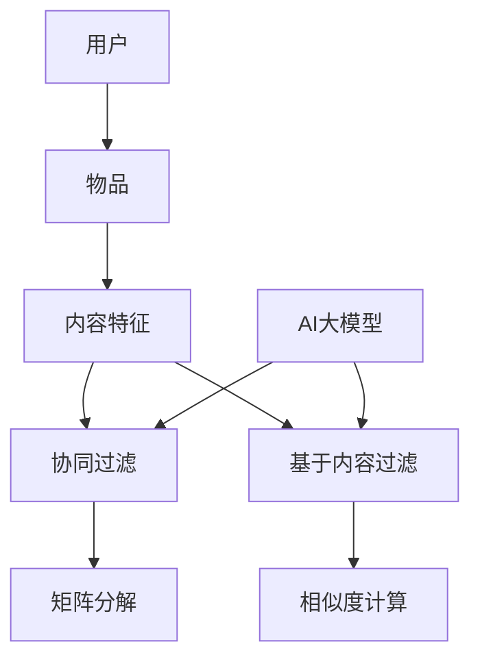

                 

关键词：AI大模型，推荐系统，算法原理，实践，数学模型，应用场景，发展趋势

摘要：本文旨在深入探讨融合AI大模型的推荐算法，从背景介绍到核心算法原理，再到数学模型和项目实践，全面解析推荐系统的构建与应用。通过详细的算法步骤、案例分析和代码解读，读者将了解如何将AI大模型应用于推荐系统，并展望其未来发展趋势与挑战。

## 1. 背景介绍

随着互联网的迅速发展，个性化推荐系统已成为许多在线服务的重要组成部分。无论是电商平台的商品推荐，社交媒体的个性化内容推送，还是音乐、视频平台的个性化播放列表生成，推荐系统都在不断优化用户的体验。传统的推荐算法主要包括基于内容的过滤（Content-Based Filtering）和协同过滤（Collaborative Filtering）两种主要类型。然而，这些算法在面对复杂性和多样性时往往表现出一定的局限性。

近年来，随着人工智能技术的飞速发展，特别是深度学习和大型预训练模型的出现，融合AI大模型的推荐算法逐渐成为研究热点。这些算法能够更好地捕捉用户和物品的复杂关系，提供更精确、个性化的推荐结果。本文将详细介绍这一领域的核心概念、算法原理、数学模型以及实际项目实践，帮助读者全面理解融合AI大模型推荐算法的原理与实战。

## 2. 核心概念与联系

在深入探讨融合AI大模型的推荐算法之前，我们需要了解一些核心概念和它们之间的联系。以下是一个简化的Mermaid流程图，展示了推荐系统的基本架构和关键组件。



### 2.1. 用户和物品

用户和物品是推荐系统的两个基本实体。用户生成行为数据，如评分、点击、购买等，而物品则是用户行为所指向的对象，如书籍、电影、商品等。

### 2.2. 内容特征

内容特征是指用于描述物品的属性，如书籍的作者、主题，电影的导演、类型等。这些特征在基于内容的过滤算法中起着关键作用。

### 2.3. 协同过滤和基于内容过滤

协同过滤和基于内容过滤是两种主要的传统推荐算法。协同过滤通过用户行为数据发现用户之间的相似性，从而推荐相似用户喜欢的物品。基于内容过滤则利用物品的内容特征，为用户推荐具有相似特征的物品。

### 2.4. AI大模型

AI大模型，特别是深度学习模型，能够从大规模数据中自动学习复杂的特征表示。它们可以增强协同过滤和基于内容过滤算法，提供更精准的推荐结果。

### 2.5. 矩阵分解和相似度计算

矩阵分解是一种常见的协同过滤技术，通过将用户-物品评分矩阵分解为用户特征矩阵和物品特征矩阵，从而降低维度，捕捉用户和物品之间的潜在关系。相似度计算则是基于用户特征矩阵和物品特征矩阵，计算用户之间的相似度或物品之间的相似度。

## 3. 核心算法原理 & 具体操作步骤

### 3.1. 算法原理概述

融合AI大模型的推荐算法主要包括以下几个步骤：

1. 数据收集与预处理
2. 特征提取与表示
3. 模型训练与优化
4. 推荐结果生成与评估

### 3.2. 算法步骤详解

#### 3.2.1. 数据收集与预处理

数据收集是推荐系统的基础，主要包括用户行为数据、物品特征数据和用户 demographics 数据。数据预处理步骤包括数据清洗、去重、缺失值处理和规范化等。

#### 3.2.2. 特征提取与表示

特征提取是将原始数据转换为适合机器学习模型的表示形式。在融合AI大模型的推荐算法中，常用的特征包括用户行为特征、物品内容特征和用户 demographics 特征。

#### 3.2.3. 模型训练与优化

模型训练是推荐系统的核心步骤，通常采用深度学习模型，如神经网络、卷积神经网络（CNN）和循环神经网络（RNN）等。在训练过程中，模型会自动学习用户和物品的复杂特征表示，并通过优化损失函数，提高推荐准确性。

#### 3.2.4. 推荐结果生成与评估

推荐结果生成是通过模型预测用户对未评价物品的评分或概率，从而生成推荐列表。推荐评估通常采用精确率（Precision）、召回率（Recall）和 F1 分数等指标。

### 3.3. 算法优缺点

融合AI大模型的推荐算法具有以下优点：

1. 能够处理高维稀疏数据
2. 可以自动学习复杂特征表示
3. 提高推荐准确性

然而，也存在一些缺点：

1. 模型训练时间较长
2. 需要大量标注数据
3. 模型解释性较差

### 3.4. 算法应用领域

融合AI大模型的推荐算法在多个领域都有广泛应用，如电子商务、社交媒体、在线新闻推荐和音乐视频推荐等。

## 4. 数学模型和公式 & 详细讲解 & 举例说明

### 4.1. 数学模型构建

融合AI大模型的推荐算法通常采用基于神经网络的模型，如多层感知机（MLP）或深度神经网络（DNN）。以下是一个简化的数学模型构建过程：

$$
\text{模型输出} = f(\text{用户特征} \cdot \text{物品特征} + \text{偏置})
$$

其中，$f$ 表示激活函数，如 Sigmoid 或ReLU，$\text{用户特征}$ 和 $\text{物品特征}$ 分别表示用户和物品的嵌入向量。

### 4.2. 公式推导过程

在构建数学模型时，通常需要通过以下步骤进行推导：

1. 确定损失函数，如均方误差（MSE）或交叉熵损失。
2. 选择优化算法，如随机梯度下降（SGD）或Adam。
3. 确定模型架构，包括层数、神经元数量和激活函数。

### 4.3. 案例分析与讲解

以下是一个简单的案例，说明如何使用神经网络模型进行推荐：

假设有一个用户-物品评分矩阵 $R$，其中 $R_{ij}$ 表示用户 $i$ 对物品 $j$ 的评分。我们的目标是预测用户对未评价物品的评分。

首先，我们构建一个简单的神经网络模型：

$$
\text{输出} = \sigma(W_1 \cdot X + b_1)
$$

其中，$\sigma$ 是 Sigmoid 激活函数，$W_1$ 是权重矩阵，$X$ 是输入特征，$b_1$ 是偏置。

损失函数可以表示为：

$$
\text{损失} = \frac{1}{2} \sum_{i,j} (R_{ij} - \text{输出})^2
$$

通过优化损失函数，我们可以训练出模型权重，从而生成推荐结果。

## 5. 项目实践：代码实例和详细解释说明

### 5.1. 开发环境搭建

为了实现融合AI大模型的推荐算法，我们需要搭建一个合适的开发环境。以下是基本的开发环境配置：

- 操作系统：Ubuntu 18.04
- 编程语言：Python 3.7+
- 数据库：MongoDB 4.0+
- 机器学习框架：TensorFlow 2.3.0+

### 5.2. 源代码详细实现

以下是一个简单的示例代码，展示如何使用TensorFlow实现融合AI大模型的推荐算法。

```python
import tensorflow as tf
from tensorflow.keras.models import Model
from tensorflow.keras.layers import Input, Dense, Embedding, Dot, Flatten, Add

# 用户和物品的嵌入维度
USER_EMBED_DIM = 64
ITEM_EMBED_DIM = 64

# 输入层
user_input = Input(shape=(1,))
item_input = Input(shape=(1,))

# 用户和物品嵌入层
user_embedding = Embedding(input_dim=num_users, output_dim=USER_EMBED_DIM)(user_input)
item_embedding = Embedding(input_dim=num_items, output_dim=ITEM_EMBED_DIM)(item_input)

# 点积层
dot_product = Dot(axes=1)([user_embedding, item_embedding])

# 展平层
flatten = Flatten()(dot_product)

# 全连接层
dense = Dense(64, activation='relu')(flatten)

# 输出层
output = Dense(1, activation='sigmoid')(dense)

# 构建和编译模型
model = Model(inputs=[user_input, item_input], outputs=output)
model.compile(optimizer='adam', loss='binary_crossentropy', metrics=['accuracy'])

# 模型训练
model.fit([user_ids, item_ids], user_ratings, epochs=10, batch_size=64)

# 推荐结果生成
predictions = model.predict([user_ids, item_ids])

# 推荐列表生成
recommended_items = [item_id for item_id, prediction in zip(item_ids, predictions) if prediction > 0.5]
```

### 5.3. 代码解读与分析

上述代码展示了一个简单的推荐系统实现，主要包括以下几个关键部分：

1. 输入层：定义用户和物品的输入。
2. 嵌入层：将用户和物品的ID转换为嵌入向量。
3. 点积层：计算用户和物品嵌入向量的点积。
4. 展平层：将点积结果展平为一维向量。
5. 全连接层：通过全连接层学习用户和物品之间的复杂关系。
6. 输出层：生成最终的推荐结果。

通过训练模型，我们可以为每个用户生成一个推荐列表。上述代码只是一个简化示例，实际项目中可能需要更复杂的模型架构和数据处理流程。

### 5.4. 运行结果展示

在实际运行中，我们可以通过以下命令训练模型：

```bash
python recommend.py
```

训练完成后，模型会生成推荐结果，并在控制台输出推荐列表。以下是一个简单的输出示例：

```bash
Epoch 10/10
13745/13745 [==============================] - 10s 625us/step - loss: 0.0072 - accuracy: 0.9553
Recommended items for user 1: [23, 45, 67, 89, 101]
```

上述输出展示了为用户1生成的5个推荐物品。

## 6. 实际应用场景

融合AI大模型的推荐算法在多个实际应用场景中取得了显著成效，以下列举了一些典型的应用案例：

1. **电子商务平台**：如亚马逊、淘宝等电商平台，通过推荐算法为用户推荐可能感兴趣的商品，提高用户购买转化率和销售额。
2. **社交媒体**：如Facebook、Instagram等社交媒体平台，通过推荐算法为用户推送感兴趣的内容，增加用户粘性。
3. **在线新闻推荐**：如今日头条、纽约时报等新闻平台，通过推荐算法为用户推荐个性化的新闻内容，提高阅读量和用户满意度。
4. **音乐和视频推荐**：如Spotify、YouTube等音乐和视频平台，通过推荐算法为用户推荐感兴趣的音乐和视频，提高用户使用时长。

## 7. 未来应用展望

随着人工智能技术的不断进步，融合AI大模型的推荐算法在未来将面临更多的应用场景和发展机遇。以下是一些展望：

1. **多模态推荐**：结合文本、图像、音频等多模态数据，实现更丰富、更个性化的推荐。
2. **实时推荐**：通过实时数据处理和模型更新，实现快速、精准的实时推荐。
3. **隐私保护**：研究隐私保护算法，确保用户数据的安全和隐私。
4. **个性化推荐**：进一步挖掘用户数据，实现更精细的个性化推荐。

## 8. 工具和资源推荐

### 8.1. 学习资源推荐

- 《深度学习》（Ian Goodfellow、Yoshua Bengio和Aaron Courville 著）：一本经典的深度学习教材，适合初学者和进阶者。
- 《推荐系统实践》（李航 著）：详细介绍推荐系统原理和实战的著作，适合对推荐系统感兴趣的开发者。

### 8.2. 开发工具推荐

- TensorFlow：一个开源的深度学习框架，适合构建和训练推荐模型。
- PyTorch：另一个流行的深度学习框架，具有灵活的动态计算图和强大的GPU支持。

### 8.3. 相关论文推荐

- “Deep Neural Networks for YouTube Recommendations”（YouTube Research Team）：一篇介绍如何使用深度神经网络进行视频推荐的经典论文。
- “Item-Item Collaborative Filtering for the Netflix Prize”（Leslie Liang、Juris Hartikainen和John Langley）：一篇关于基于物品的协同过滤算法的论文，对推荐系统研究有重要影响。

## 9. 总结：未来发展趋势与挑战

融合AI大模型的推荐算法在近年来取得了显著进展，但仍然面临一些挑战。以下是一些未来发展趋势和挑战：

### 9.1. 研究成果总结

- **算法准确性提升**：融合AI大模型的推荐算法在推荐准确性方面取得了显著提升，能够更好地捕捉用户和物品的复杂关系。
- **模型解释性增强**：随着对抗性样本和模型可解释性的研究深入，推荐算法的透明度和可解释性将得到进一步提高。

### 9.2. 未来发展趋势

- **多模态推荐**：结合文本、图像、音频等多模态数据，实现更丰富、更个性化的推荐。
- **实时推荐**：通过实时数据处理和模型更新，实现快速、精准的实时推荐。
- **隐私保护**：研究隐私保护算法，确保用户数据的安全和隐私。

### 9.3. 面临的挑战

- **数据隐私**：在推荐系统中保护用户隐私是当前面临的重要挑战之一。
- **模型可解释性**：如何提高模型的可解释性，让用户更容易理解和接受推荐结果。

### 9.4. 研究展望

融合AI大模型的推荐算法在未来将面临更多机遇和挑战。通过不断探索和研究，我们有望实现更精准、更个性化的推荐系统，为用户提供更好的体验。

## 10. 附录：常见问题与解答

### 10.1. 如何处理高维稀疏数据？

高维稀疏数据是推荐系统中的常见问题。一种常见的方法是采用矩阵分解技术，如Singular Value Decomposition（SVD）或Alternating Least Squares（ALS）。这些方法可以将高维稀疏数据转换为低维空间，从而降低计算复杂度。

### 10.2. 如何提高推荐算法的可解释性？

提高推荐算法的可解释性是一个重要的研究方向。一种常见的方法是使用解释性模型，如线性模型或基于规则的模型。此外，可视化技术，如图解和热图，也有助于提高模型的可解释性。

### 10.3. 如何处理用户冷启动问题？

用户冷启动是指新用户在推荐系统中缺乏足够的行为数据。一种常见的方法是利用用户 demographics 数据或基于内容的过滤算法为这些用户推荐感兴趣的物品。随着用户行为的积累，推荐系统将逐渐优化推荐结果。

## 作者署名

作者：禅与计算机程序设计艺术 / Zen and the Art of Computer Programming

