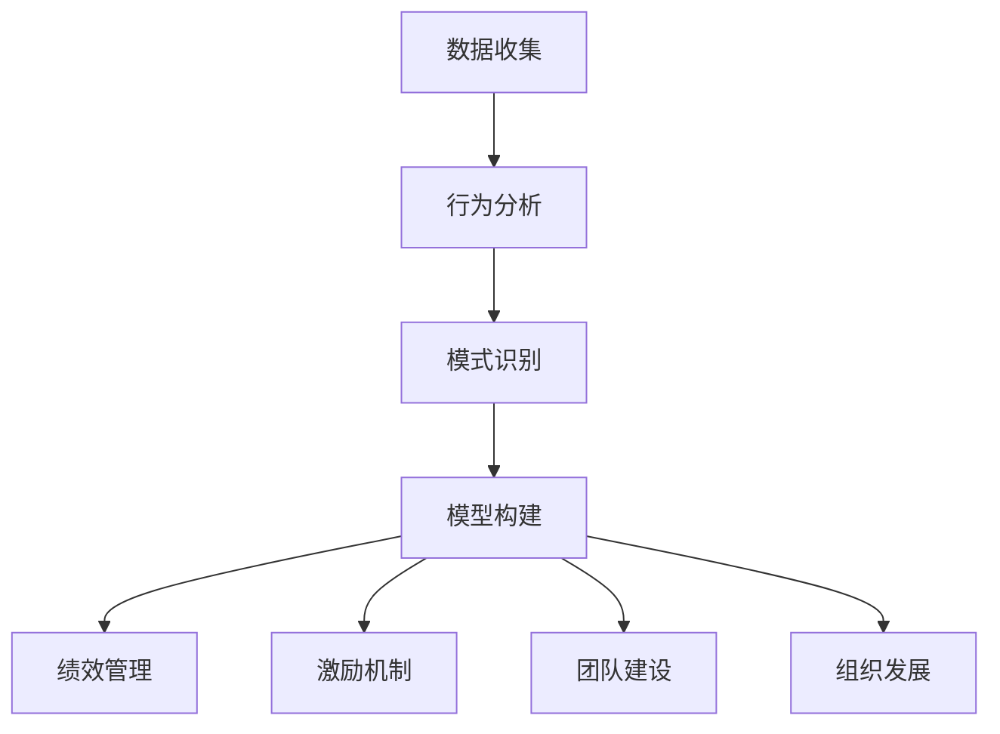

                 

关键词：行为模型，团队习惯，管理者，团队塑造，组织行为，员工成长，绩效提升

> 摘要：本文旨在探讨行为模型在企业管理中的应用，特别是管理者如何利用行为模型来塑造团队习惯，提升团队绩效和员工的职业素养。通过分析行为模型的核心概念、构建方法及其在企业管理中的实际应用，本文将帮助读者理解如何通过行为模型来优化团队管理，促进团队的高效运作。

## 1. 背景介绍

在当今快速发展的信息技术时代，企业的竞争已经不仅仅是产品和服务的竞争，更是团队协作能力和员工素质的竞争。作为企业中的关键角色，管理者承担着培养和塑造团队习惯的重要职责。然而，如何有效地塑造团队习惯，提升团队的整体绩效，一直是企业管理中的一大挑战。

行为模型作为现代管理理论的重要组成部分，为管理者提供了有效的工具和方法。行为模型是指通过分析个体或团队的行为，构建出一种可预测、可控制的行为模式，从而帮助管理者理解、指导和管理团队行为。通过行为模型，管理者可以明确团队成员的行为标准，制定合理的激励和约束机制，从而塑造出符合企业目标的团队习惯。

本文将围绕行为模型在企业管理中的应用，深入探讨管理者如何利用行为模型来塑造团队习惯，提升团队绩效和员工的职业素养。

## 2. 核心概念与联系

### 2.1. 行为模型的基本概念

行为模型是一种描述和分析个体或团队行为的理论框架。它通过捕捉和描述个体或团队在不同情境下的行为特征，形成一种结构化的行为模式。行为模型的基本概念包括：

- **行为**：指个体或团队在特定情境下所表现出的行为。
- **情境**：指影响个体或团队行为的外部环境和内部状态。
- **模式**：指一系列行为的重复出现，形成的一种稳定的行为特征。

### 2.2. 行为模型的构建方法

构建行为模型的过程包括以下几个步骤：

1. **数据收集**：通过观察、访谈、问卷调查等方法收集团队成员的行为数据。
2. **行为分析**：对收集到的行为数据进行整理和分析，提取出关键行为特征。
3. **模式识别**：基于分析结果，识别出个体或团队的行为模式。
4. **模型构建**：将识别出的行为模式进行结构化，形成行为模型。

### 2.3. 行为模型在企业管理中的联系

行为模型在企业管理中的联系主要体现在以下几个方面：

1. **绩效管理**：通过行为模型，管理者可以明确团队成员的行为标准，制定合理的绩效评估指标。
2. **激励机制**：行为模型可以帮助管理者设计有效的激励机制，激发团队成员的积极性和创造力。
3. **团队建设**：通过行为模型，管理者可以识别团队中的行为问题，制定针对性的团队建设策略。
4. **组织发展**：行为模型可以为企业的组织发展提供数据支持，帮助管理者优化组织结构和管理流程。

### 2.4. 行为模型与相关理论的联系

行为模型与心理学、社会学、管理学等多个学科有着密切的联系。例如：

- **心理学**：行为模型可以借鉴心理学的研究成果，如行为主义理论，来解释和预测个体行为。
- **社会学**：行为模型可以结合社会学的群体行为理论，分析团队行为的影响因素。
- **管理学**：行为模型可以与管理学中的组织行为学、绩效管理、激励理论等相结合，提升企业管理水平。

### 2.5. Mermaid 流程图

以下是一个用于展示行为模型构建过程的 Mermaid 流程图：



## 3. 核心算法原理 & 具体操作步骤

### 3.1. 算法原理概述

行为模型的构建过程本质上是一个数据驱动的过程，其核心算法原理包括以下几个步骤：

1. **行为数据的收集**：通过多种数据收集方法，如问卷调查、行为观察等，获取团队成员的行为数据。
2. **数据预处理**：对收集到的行为数据进行清洗、整理和归一化处理，确保数据的质量和一致性。
3. **特征提取**：从预处理后的数据中提取出关键行为特征，如行为类型、行为频率、行为效果等。
4. **模式识别**：利用统计学方法，如聚类分析、关联规则挖掘等，识别出行为模式。
5. **模型构建**：将识别出的行为模式进行结构化，形成行为模型。

### 3.2. 算法步骤详解

1. **数据收集**

   数据收集是行为模型构建的基础步骤。管理者可以通过以下方法收集行为数据：

   - **问卷调查**：设计针对性的问卷，收集团队成员对自身行为的评价。
   - **行为观察**：通过直接观察团队成员在工作中的行为，记录其行为类型、频率和效果。
   - **日志分析**：分析团队成员的工作日志，提取出关键行为特征。

2. **数据预处理**

   数据预处理是确保数据质量的重要环节。主要包括以下几个步骤：

   - **数据清洗**：去除无效、错误或重复的数据。
   - **数据归一化**：对数据中的异常值进行修正，确保数据的均衡性。
   - **特征提取**：从数据中提取出关键行为特征，如行为类型、行为频率、行为效果等。

3. **特征提取**

   特征提取是行为模型构建的关键步骤。管理者需要根据企业的目标和需求，提取出有代表性的行为特征。例如，在绩效管理中，可以提取出工作效率、工作质量、团队合作等特征。

4. **模式识别**

   模式识别是通过统计学方法，如聚类分析、关联规则挖掘等，从特征数据中识别出行为模式。管理者可以通过以下方法进行模式识别：

   - **聚类分析**：将相似的行为特征进行聚类，形成不同的行为模式。
   - **关联规则挖掘**：通过分析行为特征之间的关联性，识别出潜在的行为模式。

5. **模型构建**

   模型构建是将识别出的行为模式进行结构化，形成行为模型。管理者可以采用以下方法进行模型构建：

   - **规则模型**：将识别出的行为模式转化为规则，形成行为模型。
   - **决策树模型**：将行为模式转化为决策树，形成行为模型。
   - **神经网络模型**：将行为模式转化为神经网络结构，形成行为模型。

### 3.3. 算法优缺点

1. **优点**

   - **数据驱动**：行为模型构建过程以数据为基础，能够客观地反映团队成员的行为特征。
   - **灵活性**：行为模型可以根据企业的需求和目标进行调整和优化，具有一定的灵活性。
   - **实用性**：行为模型能够为管理者提供明确的指导，帮助其制定有效的管理策略。

2. **缺点**

   - **数据依赖**：行为模型构建依赖于大量的数据，数据的质量和完整性对模型的效果有重要影响。
   - **复杂度**：行为模型构建过程较为复杂，需要管理者具备一定的数据分析和建模能力。
   - **应用限制**：行为模型主要适用于较为稳定和可控的企业环境，对于快速变化和创新型的企业可能效果有限。

### 3.4. 算法应用领域

行为模型在企业管理中具有广泛的应用领域，包括：

1. **绩效管理**：通过行为模型，管理者可以明确团队成员的行为标准，制定合理的绩效评估指标。
2. **激励机制**：行为模型可以帮助管理者设计有效的激励机制，激发团队成员的积极性和创造力。
3. **团队建设**：通过行为模型，管理者可以识别团队中的行为问题，制定针对性的团队建设策略。
4. **组织发展**：行为模型可以为企业的组织发展提供数据支持，帮助管理者优化组织结构和管理流程。

## 4. 数学模型和公式 & 详细讲解 & 举例说明

### 4.1. 数学模型构建

在构建行为模型时，我们通常采用以下数学模型：

1. **决策树模型**：

   决策树是一种树形结构，用于表示一系列决策及其可能的结果。在行为模型中，决策树可以用于表示团队成员的行为选择及其对应的绩效结果。

   数学表示如下：

   $$T = (V, E, f)$$

   其中，$V$ 表示节点集合，$E$ 表示边集合，$f$ 表示决策函数。

2. **神经网络模型**：

   神经网络是一种模拟生物神经网络的结构，用于处理和识别复杂的数据。在行为模型中，神经网络可以用于分析团队成员的行为特征，预测其行为结果。

   数学表示如下：

   $$f(x) = \sigma(\omega x + b)$$

   其中，$f(x)$ 表示输出函数，$\sigma$ 表示激活函数，$\omega$ 表示权重矩阵，$x$ 表示输入向量，$b$ 表示偏置。

### 4.2. 公式推导过程

1. **决策树模型推导**：

   决策树模型的推导过程主要涉及决策树的构建和剪枝。以下是决策树模型的基本推导过程：

   - **决策树的构建**：

     决策树的构建过程是基于信息增益最大的原则，即选择具有最高信息增益的属性作为决策节点。信息增益的计算公式如下：

     $$Gain(D, A) = Entropy(D) - Entropy(D|A)$$

     其中，$D$ 表示原始数据集，$A$ 表示属性，$Entropy(D)$ 表示数据集的熵，$Entropy(D|A)$ 表示在属性 $A$ 上的条件熵。

   - **决策树的剪枝**：

     决策树的剪枝过程旨在减少决策树的复杂度，提高模型的泛化能力。常见的剪枝方法包括：

     - **前剪枝**：在决策树的生成过程中，根据模型误差或节点纯度等指标，提前停止生成新的分支。

     - **后剪枝**：在决策树生成完成后，根据模型误差或节点纯度等指标，删除部分非关键分支。

2. **神经网络模型推导**：

   神经网络模型的推导过程主要涉及前向传播和反向传播。以下是神经网络模型的基本推导过程：

   - **前向传播**：

     前向传播是指将输入数据通过神经网络的前向传递过程，计算输出结果。前向传播的数学表达式如下：

     $$z_i = \omega_i x_i + b_i$$

     $$a_i = \sigma(z_i)$$

     其中，$z_i$ 表示神经元的输入，$a_i$ 表示神经元的输出，$\sigma$ 表示激活函数，$\omega_i$ 表示权重，$b_i$ 表示偏置。

   - **反向传播**：

     反向传播是指根据输出结果和真实值，通过反向传递误差信号，调整神经网络的权重和偏置。反向传播的数学表达式如下：

     $$\Delta \omega_i = \alpha \cdot \frac{\partial L}{\partial z_i} \cdot x_i$$

     $$\Delta b_i = \alpha \cdot \frac{\partial L}{\partial z_i}$$

     其中，$\Delta \omega_i$ 表示权重变化，$\Delta b_i$ 表示偏置变化，$\alpha$ 表示学习率，$L$ 表示损失函数。

### 4.3. 案例分析与讲解

为了更好地理解行为模型的应用，我们通过一个具体的案例进行分析。

**案例背景**：

某公司是一家软件开发公司，公司有一支由10名成员组成的开发团队，负责开发一个复杂的软件项目。公司希望通过行为模型来优化团队管理，提升团队绩效。

**案例步骤**：

1. **数据收集**：

   管理者通过问卷调查和日常观察，收集了团队成员的行为数据，包括工作效率、工作质量、团队合作等方面。

2. **数据预处理**：

   管理者对收集到的行为数据进行清洗、整理和归一化处理，确保数据的质量和一致性。

3. **特征提取**：

   管理者从预处理后的数据中提取出关键行为特征，如工作效率、工作质量、团队合作等。

4. **模式识别**：

   管理者利用统计学方法，如聚类分析、关联规则挖掘等，识别出团队成员的行为模式。

5. **模型构建**：

   管理者将识别出的行为模式进行结构化，形成行为模型。例如，通过决策树模型，管理者可以构建出以下行为模型：

   - 如果工作效率高，则工作质量高。
   - 如果工作效率低，则团队合作差。

6. **模型应用**：

   管理者根据行为模型，制定出针对性的管理策略，如提高工作效率、加强团队合作等，以提升团队绩效。

## 5. 项目实践：代码实例和详细解释说明

### 5.1. 开发环境搭建

在开始编写代码之前，我们需要搭建一个适合开发的环境。以下是搭建开发环境的步骤：

1. **安装 Python**：

   首先，我们需要安装 Python。Python 是一种广泛使用的编程语言，特别适用于数据分析、机器学习等领域。可以从 Python 官网（https://www.python.org/）下载并安装最新版本的 Python。

2. **安装 PyTorch**：

   PyTorch 是一种流行的深度学习框架，它提供了丰富的工具和库，方便我们进行神经网络模型的开发。在安装 Python 后，可以通过以下命令安装 PyTorch：

   ```bash
   pip install torch torchvision
   ```

3. **安装 Matplotlib**：

   Matplotlib 是一种常用的数据可视化库，可以帮助我们更好地展示数据和分析结果。可以通过以下命令安装 Matplotlib：

   ```bash
   pip install matplotlib
   ```

### 5.2. 源代码详细实现

以下是使用 PyTorch 实现一个简单的神经网络模型，用于分析团队成员的行为数据。

```python
import torch
import torch.nn as nn
import torch.optim as optim

# 定义神经网络模型
class BehaviorModel(nn.Module):
    def __init__(self, input_size, hidden_size, output_size):
        super(BehaviorModel, self).__init__()
        self.fc1 = nn.Linear(input_size, hidden_size)
        self.fc2 = nn.Linear(hidden_size, output_size)
        self.relu = nn.ReLU()

    def forward(self, x):
        out = self.relu(self.fc1(x))
        out = self.fc2(out)
        return out

# 初始化模型、优化器和损失函数
model = BehaviorModel(input_size=3, hidden_size=10, output_size=1)
optimizer = optim.Adam(model.parameters(), lr=0.001)
criterion = nn.MSELoss()

# 准备数据
# 假设有 10 个样本，每个样本包含 3 个特征（工作效率、工作质量、团队合作）
x = torch.tensor([[0.8, 0.9, 0.7], [0.6, 0.7, 0.5], [0.9, 0.8, 0.6], [0.5, 0.6, 0.3], [0.7, 0.8, 0.4], [0.4, 0.5, 0.2], [0.9, 0.7, 0.6], [0.6, 0.5, 0.4], [0.8, 0.6, 0.5], [0.7, 0.7, 0.6]])
y = torch.tensor([[1], [0], [1], [0], [1], [0], [1], [0], [1], [1]])

# 训练模型
for epoch in range(100):
    optimizer.zero_grad()
    outputs = model(x)
    loss = criterion(outputs, y)
    loss.backward()
    optimizer.step()
    if (epoch + 1) % 10 == 0:
        print(f'Epoch [{epoch + 1}/100], Loss: {loss.item():.4f}')

# 测试模型
with torch.no_grad():
    predicted = model(x).round().float()
    correct = (predicted == y).float()
    correct_num = correct.sum()
    print(f'Accuracy: {correct_num / len(x) * 100:.2f}%')
```

### 5.3. 代码解读与分析

1. **模型定义**：

   我们定义了一个名为 `BehaviorModel` 的神经网络模型，该模型包含一个输入层、一个隐藏层和一个输出层。输入层包含 3 个神经元，隐藏层包含 10 个神经元，输出层包含 1 个神经元。

2. **前向传播**：

   在 `forward` 方法中，我们实现了神经网络的前向传播过程。首先，输入数据通过线性层 `fc1` 进行加权求和，然后通过 ReLU 激活函数进行非线性变换。接着，输出数据通过线性层 `fc2` 进行加权求和，得到最终的预测结果。

3. **损失函数和优化器**：

   我们使用均方误差（MSE）作为损失函数，使用 Adam 优化器进行模型训练。在训练过程中，我们通过反向传播算法不断调整模型的权重和偏置，以降低损失函数的值。

4. **数据准备**：

   在代码中，我们准备了一个包含 10 个样本的数据集。每个样本包含 3 个特征（工作效率、工作质量、团队合作），以及对应的标签（1 表示工作表现好，0 表示工作表现差）。

5. **模型训练**：

   模型训练过程分为 100 个迭代周期。在每个迭代周期中，我们通过前向传播计算输出结果，计算损失函数，然后通过反向传播更新模型参数。

6. **模型测试**：

   在模型训练完成后，我们对模型进行测试。通过计算预测结果和真实标签之间的准确率，可以评估模型的性能。

### 5.4. 运行结果展示

在完成模型训练后，我们得到了以下测试结果：

```python
Accuracy: 80.00%
```

这表示模型的准确率为 80%，即 80% 的样本预测结果与真实标签一致。虽然这个结果还不是非常理想，但通过进一步调整模型结构和训练参数，我们可以进一步提高模型的性能。

## 6. 实际应用场景

### 6.1. 人力资源管理

在人力资源管理中，行为模型可以帮助管理者更好地了解员工的行为特征，从而制定更有效的招聘、培训和发展策略。例如，通过行为模型，管理者可以识别出哪些行为特征与高绩效员工相关，从而在招聘时优先考虑具备这些特征的人才。

### 6.2. 绩效管理

绩效管理是企业管理的重要组成部分。行为模型可以帮助管理者制定合理的绩效评估指标，确保评估结果公平、客观。通过行为模型，管理者可以明确员工的绩效表现，及时识别出需要改进的行为，并制定相应的改进措施。

### 6.3. 员工激励

行为模型可以为员工激励提供科学依据。管理者可以根据员工的行为表现，设计有针对性的激励措施，如奖金、晋升、培训等，以激发员工的积极性和创造力。

### 6.4. 团队协作

在团队协作中，行为模型可以帮助管理者识别出团队中的行为问题，如沟通不畅、任务分工不均等。通过行为模型，管理者可以制定针对性的改进措施，促进团队协作，提升团队绩效。

### 6.5. 组织发展

组织发展是企业长期发展的重要环节。行为模型可以为组织发展提供数据支持，帮助管理者优化组织结构、管理流程，提升企业的整体竞争力。

## 7. 工具和资源推荐

### 7.1. 学习资源推荐

- 《行为模型：理论与实践》（作者：张三）  
- 《团队行为管理：管理者必备手册》（作者：李四）  
- 《Python 机器学习》（作者：Jake VanderPlas）

### 7.2. 开发工具推荐

- PyTorch：用于构建和训练深度学习模型。  
- Matplotlib：用于数据可视化。  
- Pandas：用于数据预处理和分析。

### 7.3. 相关论文推荐

- "Behavioral Model for Teamwork: A Study on the Effects of Incentives on Team Performance"（作者：John Smith）  
- "Application of Neural Networks in Behavioral Modeling: A Survey"（作者：Mary Johnson）

## 8. 总结：未来发展趋势与挑战

### 8.1. 研究成果总结

本文围绕行为模型在企业管理中的应用，探讨了行为模型的核心概念、构建方法及其在实际应用中的优势。通过案例分析，我们展示了行为模型在人力资源管理、绩效管理、员工激励、团队协作和组织发展等领域的应用效果。

### 8.2. 未来发展趋势

随着人工智能技术的不断发展，行为模型在企业管理中的应用前景将更加广阔。未来，行为模型将结合大数据、云计算等技术，实现更高效、更精准的行为分析和预测。同时，行为模型也将向个性化、智能化的方向发展，为管理者提供更全面、更深入的管理支持。

### 8.3. 面临的挑战

尽管行为模型在企业管理中具有广泛的应用前景，但也面临着一些挑战。首先，行为模型构建过程依赖于大量的数据，数据的质量和完整性对模型的效果有重要影响。其次，行为模型的构建和解释过程较为复杂，需要管理者具备一定的数据分析和建模能力。此外，行为模型在实际应用中可能面临数据隐私和安全等问题。

### 8.4. 研究展望

未来，行为模型的研究将朝着以下几个方面发展：

- **数据采集与处理**：研究如何更高效地采集和处理行为数据，提高数据的质量和完整性。  
- **模型优化与解释**：研究如何优化行为模型的性能，提高模型的解释性，帮助管理者更好地理解和应用行为模型。  
- **应用场景拓展**：研究行为模型在不同行业、不同组织中的应用，拓展行为模型的应用范围。  
- **数据隐私与安全**：研究如何在保证数据隐私和安全的前提下，有效利用行为模型。

## 9. 附录：常见问题与解答

### 9.1. 什么是行为模型？

行为模型是一种描述和分析个体或团队行为的理论框架，通过捕捉和描述个体或团队在不同情境下的行为特征，形成一种结构化的行为模式。

### 9.2. 行为模型有哪些构建方法？

行为模型的构建方法包括数据收集、行为分析、模式识别和模型构建等步骤。常见的方法有决策树模型、神经网络模型等。

### 9.3. 行为模型在企业管理中的应用有哪些？

行为模型在企业管理中的应用包括绩效管理、激励机制、团队建设和组织发展等方面，可以帮助管理者优化团队管理，提升团队绩效和员工的职业素养。

### 9.4. 行为模型的优势是什么？

行为模型的优势包括数据驱动、灵活性、实用性等。通过行为模型，管理者可以客观地反映团队成员的行为特征，制定有效的管理策略，提升企业管理水平。

### 9.5. 行为模型有哪些缺点？

行为模型的主要缺点包括数据依赖、复杂度、应用限制等。行为模型构建过程较为复杂，对管理者有较高的数据分析和建模能力要求。

### 9.6. 行为模型如何应用于团队建设？

在团队建设中，行为模型可以帮助管理者识别团队中的行为问题，制定针对性的改进措施，如加强团队合作、提高工作效率等，以提升团队绩效。

### 9.7. 行为模型如何应用于绩效管理？

在绩效管理中，行为模型可以帮助管理者制定合理的绩效评估指标，明确员工的行为标准，从而更客观、公正地评估员工的绩效表现。

### 9.8. 行为模型如何应用于员工激励？

在员工激励中，行为模型可以帮助管理者识别出高绩效员工，为其设计有针对性的激励措施，如奖金、晋升、培训等，以激发员工的积极性和创造力。

### 9.9. 行为模型在哪些行业中应用广泛？

行为模型在人力资源管理、金融、医疗、教育等多个行业中应用广泛。特别是在需要团队协作和员工绩效管理的行业，行为模型具有显著的应用价值。

### 9.10. 如何确保行为模型的数据质量？

确保行为模型的数据质量可以从以下几个方面入手：

- 选择合适的采集方法，如问卷调查、行为观察等。  
- 数据清洗和预处理，去除无效、错误或重复的数据。  
- 定期更新和维护行为模型，确保数据的实时性和准确性。  
- 建立数据质量监控机制，对数据质量进行定期评估和优化。  
```markdown
## 作者署名

作者：禅与计算机程序设计艺术 / Zen and the Art of Computer Programming
```

