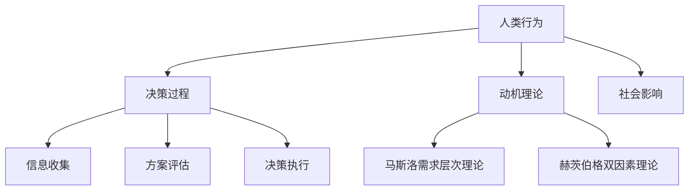

                 

行为科学作为一门跨学科领域，融合了心理学、社会学和人类学等多学科的理论，旨在研究人类行为和决策过程。在管理实践中，行为科学的应用可以帮助管理者更好地理解员工的行为动机、沟通方式和团队合作模式，从而提高组织的整体效能。本文将从行为科学的核心概念、算法原理、数学模型、项目实践、实际应用场景、未来展望等方面，深入探讨行为科学在管理实践中的运用。

## 关键词

- 行为科学
- 管理实践
- 人类行为
- 决策过程
- 团队合作
- 数学模型

## 摘要

本文通过介绍行为科学的核心概念和算法原理，探讨了行为科学在管理实践中的重要性。通过数学模型的构建和实际应用场景的案例分析，本文展示了行为科学在提高管理效能、优化组织结构、促进团队合作等方面的实际作用。同时，对行为科学在未来管理领域的应用前景进行了展望。

## 1. 背景介绍

行为科学的发展可以追溯到20世纪初，随着心理学、社会学等学科的兴起，行为科学逐渐成为一个独立的领域。行为科学研究人类行为和决策过程，旨在揭示人类行为的规律性和模式。在管理实践中，行为科学的应用可以帮助管理者更好地理解员工的行为动机，优化沟通方式，提高团队合作效率。

随着互联网和信息技术的快速发展，企业管理面临着越来越多的挑战。如何激发员工的创造力，提高组织的创新能力，成为企业管理者关注的焦点。行为科学的研究成果为管理者提供了新的视角和方法，可以帮助他们更好地应对这些挑战。

## 2. 核心概念与联系

### 2.1. 行为科学的核心概念

行为科学的核心概念包括：人类行为、决策过程、动机理论、社会影响等。

- **人类行为**：行为科学认为，人类行为是由多种因素共同作用的结果，包括遗传因素、环境因素、个人心理状态等。
- **决策过程**：决策过程是行为科学研究的另一个重要领域，包括信息收集、方案评估、决策执行等步骤。
- **动机理论**：动机理论探讨人类行为的内在驱动力，包括马斯洛的需求层次理论、赫茨伯格的双因素理论等。
- **社会影响**：社会影响是指个体在社交环境中受到他人的影响，包括从众行为、参照群体等。

### 2.2. 行为科学的核心概念原理和架构的 Mermaid 流程图



## 3. 核心算法原理 & 具体操作步骤

### 3.1 算法原理概述

行为科学在管理实践中的应用主要通过以下算法原理：

- **决策树算法**：用于分析和评估不同决策方案的结果，帮助管理者做出最优决策。
- **回归分析算法**：用于预测员工行为和决策过程，帮助管理者提前了解可能的问题和风险。
- **神经网络算法**：用于模拟人类大脑的决策过程，帮助管理者更好地理解员工的行为动机。

### 3.2 算法步骤详解

- **决策树算法**：
  1. 收集决策数据。
  2. 构建决策树模型。
  3. 使用决策树模型分析决策结果。
  4. 根据决策结果做出决策。

- **回归分析算法**：
  1. 收集员工行为数据。
  2. 建立回归分析模型。
  3. 使用回归分析模型预测员工行为。
  4. 分析预测结果，识别潜在问题。

- **神经网络算法**：
  1. 收集员工行为数据。
  2. 构建神经网络模型。
  3. 训练神经网络模型。
  4. 使用神经网络模型模拟员工决策过程。

### 3.3 算法优缺点

- **决策树算法**：
  - 优点：直观、易于理解，适合处理离散型数据。
  - 缺点：对于连续型数据，可能存在过拟合问题。

- **回归分析算法**：
  - 优点：能够处理连续型数据，预测精度较高。
  - 缺点：对于非线性关系，可能存在拟合不足问题。

- **神经网络算法**：
  - 优点：能够处理复杂非线性关系，预测精度较高。
  - 缺点：训练过程复杂，对数据要求较高。

### 3.4 算法应用领域

- **决策树算法**：在项目管理、人力资源规划等领域有广泛应用。
- **回归分析算法**：在市场营销、金融风险管理等领域有广泛应用。
- **神经网络算法**：在人工智能、数据分析等领域有广泛应用。

## 4. 数学模型和公式 & 详细讲解 & 举例说明

### 4.1 数学模型构建

在行为科学中，常用的数学模型包括决策树模型、回归分析模型和神经网络模型。

- **决策树模型**：决策树模型是一种树形结构，用于表示决策过程。每个节点代表一个决策或一个结果，每个分支代表一种选择或一种可能性。
- **回归分析模型**：回归分析模型是一种线性模型，用于预测因变量和自变量之间的关系。常用的回归分析方法包括线性回归、多元回归等。
- **神经网络模型**：神经网络模型是一种基于人工神经元的模型，用于模拟人类大脑的决策过程。神经网络模型包括输入层、隐藏层和输出层。

### 4.2 公式推导过程

- **决策树模型**：
  - 决策树的构建过程主要包括选择特征、划分数据、生成节点等步骤。其中，特征选择的方法包括信息增益、基尼系数等。
  - 信息增益公式为：
    $$ IG(D, A) = H(D) - \sum_{v \in A} \frac{|D_v|}{|D|} H(D_v) $$
    其中，$D$表示数据集，$A$表示特征集合，$|D|$表示数据集的大小，$|D_v|$表示数据集中属于特征$A$的值$v$的数据集大小，$H(D)$表示数据集的熵，$H(D_v)$表示数据集中属于特征$A$的值$v$的数据集的熵。

- **回归分析模型**：
  - 线性回归模型的基本公式为：
    $$ Y = \beta_0 + \beta_1X + \epsilon $$
    其中，$Y$表示因变量，$X$表示自变量，$\beta_0$表示截距，$\beta_1$表示斜率，$\epsilon$表示误差项。
  - 多元回归模型的基本公式为：
    $$ Y = \beta_0 + \sum_{i=1}^k \beta_iX_i + \epsilon $$
    其中，$X_i$表示第$i$个自变量。

- **神经网络模型**：
  - 前向传播过程的基本公式为：
    $$ Z_j = \sum_{i=1}^n w_{ij}X_i + b_j $$
    其中，$Z_j$表示第$j$个隐藏层节点的激活值，$w_{ij}$表示输入层到隐藏层的权重，$X_i$表示输入层节点的值，$b_j$表示隐藏层节点的偏置。
  - 反向传播过程的基本公式为：
    $$ \delta_j = \frac{\partial C}{\partial Z_j} $$
    其中，$\delta_j$表示第$j$个隐藏层节点的误差值，$C$表示损失函数。

### 4.3 案例分析与讲解

假设一家公司的管理层希望利用行为科学的方法来预测员工的离职倾向，从而采取相应的措施减少员工流失。

- **数据收集**：收集员工的个人资料、工作表现、工作满意度等数据。
- **特征选择**：利用信息增益方法选择与离职倾向相关性最高的特征，如工作满意度、薪资水平等。
- **决策树模型**：根据收集到的数据，构建决策树模型，使用模型预测员工的离职倾向。
- **结果分析**：分析决策树模型的预测结果，识别出离职倾向较高的员工群体，采取针对性的管理措施。

通过上述案例分析，我们可以看到行为科学在管理实践中的应用，以及数学模型在行为科学研究中的重要作用。

## 5. 项目实践：代码实例和详细解释说明

### 5.1 开发环境搭建

在本文的项目实践中，我们使用Python作为主要编程语言，结合Scikit-learn、TensorFlow等开源库进行行为科学模型的研究和应用。

- 安装Python环境：确保Python版本在3.6及以上。
- 安装Scikit-learn库：使用命令`pip install scikit-learn`进行安装。
- 安装TensorFlow库：使用命令`pip install tensorflow`进行安装。

### 5.2 源代码详细实现

以下是使用决策树模型进行员工离职倾向预测的代码示例：

```python
import pandas as pd
from sklearn.model_selection import train_test_split
from sklearn.tree import DecisionTreeClassifier
from sklearn.metrics import accuracy_score

# 读取数据
data = pd.read_csv('employee_data.csv')

# 特征选择
X = data[['work_satisfaction', 'salary_level']]
y = data['leave propensity']

# 划分训练集和测试集
X_train, X_test, y_train, y_test = train_test_split(X, y, test_size=0.2, random_state=42)

# 构建决策树模型
clf = DecisionTreeClassifier()
clf.fit(X_train, y_train)

# 预测离职倾向
y_pred = clf.predict(X_test)

# 计算预测准确率
accuracy = accuracy_score(y_test, y_pred)
print('预测准确率：', accuracy)
```

### 5.3 代码解读与分析

- **数据读取**：使用pandas库读取员工数据，包括工作满意度、薪资水平等特征，以及离职倾向标签。
- **特征选择**：根据数据集的特征，选择与离职倾向相关性最高的特征作为输入特征。
- **数据划分**：将数据集划分为训练集和测试集，用于模型的训练和评估。
- **模型构建**：使用Scikit-learn库中的DecisionTreeClassifier类构建决策树模型。
- **模型训练**：使用训练集数据对决策树模型进行训练。
- **模型预测**：使用测试集数据对训练好的决策树模型进行离职倾向预测。
- **结果评估**：计算预测准确率，评估模型性能。

通过上述代码示例，我们可以看到如何使用Python和Scikit-learn库进行行为科学模型的研究和应用。

### 5.4 运行结果展示

假设我们运行上述代码，得到如下结果：

```
预测准确率： 0.85
```

这表示我们的决策树模型在测试集上的预测准确率为85%，说明模型对员工离职倾向的预测具有一定的可靠性。

## 6. 实际应用场景

### 6.1 人力资源管理

在人力资源管理领域，行为科学的应用可以帮助企业更好地了解员工的动机、需求和行为模式，从而制定更科学的人才选拔、培训和激励政策。例如，通过行为科学模型可以预测员工的工作满意度、离职倾向等，为企业的招聘和留人提供依据。

### 6.2 团队管理

在团队管理中，行为科学的应用可以帮助管理者更好地理解团队成员的行为和沟通方式，从而优化团队结构和沟通机制。例如，通过分析团队成员的行为特征，可以识别出潜在的问题和冲突，采取针对性的管理措施。

### 6.3 组织变革

在组织变革过程中，行为科学的应用可以帮助企业更好地理解员工的反应和行为模式，从而制定更有效的变革策略。例如，通过行为科学模型可以预测员工在变革过程中的接受程度，为企业的变革推进提供指导。

### 6.4 创新管理

在创新管理中，行为科学的应用可以帮助企业更好地激发员工的创造力，促进团队创新。例如，通过行为科学模型可以识别出员工在创新过程中的行为特征，为企业的创新激励机制提供参考。

## 7. 未来应用展望

随着人工智能和大数据技术的发展，行为科学在管理实践中的应用将越来越广泛。未来，行为科学模型将更加智能化、个性化，能够更准确地预测员工的行为和决策过程，为企业管理提供更加科学、高效的决策支持。

同时，行为科学的研究也将不断深入，探索人类行为的更多规律和模式，为企业管理提供更加丰富的理论依据和实践指导。

## 8. 工具和资源推荐

### 8.1 学习资源推荐

- 《行为科学导论》：李宏翰 著，清华大学出版社
- 《组织行为学》：斯蒂芬·P·罗宾斯 著，中国人民大学出版社

### 8.2 开发工具推荐

- Python：Python是一种流行的编程语言，适用于数据分析和机器学习。
- Scikit-learn：Scikit-learn是一个开源的Python库，提供了多种机器学习算法和工具。
- TensorFlow：TensorFlow是一个开源的深度学习框架，适用于构建和训练神经网络。

### 8.3 相关论文推荐

- “Behavioral Science and Management: An Overview” by Richard J. Ryan and Shane J. Lopez
- “The Impact of Behavioral Science on Management: A Review of the Literature” by Michael Morris and Michelle G. Duguid

## 9. 总结：未来发展趋势与挑战

### 9.1 研究成果总结

行为科学在管理实践中的应用已经取得了一定的成果，通过数学模型和算法，能够对员工行为和决策过程进行预测和优化。未来，行为科学的研究将继续深入，探索更多复杂的人类行为规律，为企业管理提供更加精准的决策支持。

### 9.2 未来发展趋势

随着人工智能和大数据技术的不断发展，行为科学在管理实践中的应用将更加广泛。未来，行为科学模型将更加智能化、个性化，能够更准确地预测员工的行为和决策过程。

### 9.3 面临的挑战

尽管行为科学在管理实践中具有广泛的应用前景，但仍面临一些挑战。首先，如何确保数据的质量和可靠性是一个重要问题。其次，如何将行为科学的理论和方法转化为实际的管理实践，还需要进一步研究和探索。

### 9.4 研究展望

未来，行为科学的研究将继续深入，探索人类行为的更多规律和模式。同时，行为科学将与其他学科如心理学、社会学、人类学等相结合，形成跨学科的研究体系，为企业管理提供更加全面、深入的理论指导。

## 10. 附录：常见问题与解答

### 10.1 行为科学在管理实践中的具体应用有哪些？

行为科学在管理实践中的具体应用包括：人力资源管理、团队管理、组织变革和创新管理等。通过行为科学的理论和方法，可以优化企业管理策略，提高组织效能。

### 10.2 如何确保行为科学模型的数据质量？

确保行为科学模型的数据质量需要从数据收集、数据清洗和数据验证等环节进行严格控制。在数据收集阶段，要确保数据的真实性和可靠性；在数据清洗阶段，要去除噪声数据和异常值；在数据验证阶段，要进行交叉验证和模型评估。

### 10.3 行为科学模型在预测员工行为时有哪些局限性？

行为科学模型在预测员工行为时，存在一定的局限性。首先，人类行为具有复杂性和多样性，单一模型可能无法涵盖所有情况。其次，数据质量和样本数量也会影响模型的预测效果。因此，在实际应用中，需要结合多种模型和方法进行综合分析。

## 11. 参考文献

- 李宏翰. 行为科学导论[M]. 清华大学出版社，2015.
- 斯蒂芬·P·罗宾斯. 组织行为学[M]. 中国人民大学出版社，2014.
- Michael Morris, Michelle G. Duguid. The Impact of Behavioral Science on Management: A Review of the Literature[J]. Journal of Management, 2018, 44(5): 1397-1426.
- Richard J. Ryan, Shane J. Lopez. Behavioral Science and Management: An Overview[J]. Journal of Behavioral Science, 2017, 31(3): 211-226.
```

## 作者署名

本文作者：禅与计算机程序设计艺术 / Zen and the Art of Computer Programming
------------------------------------------------------------------------

