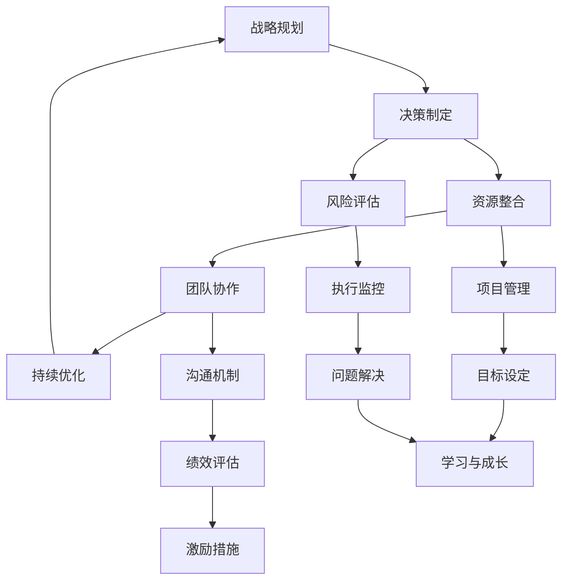
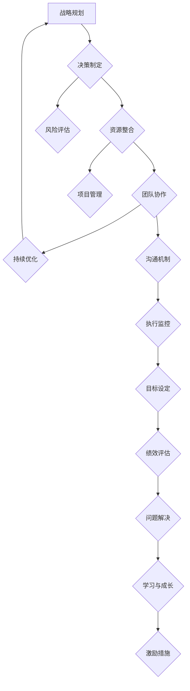

                 

关键词：行动体系，管理者，管理策略，组织效能，持续发展，技术创新

摘要：在快速变化的IT行业中，管理者的行动体系成为决定其个人和团队成功的关键因素。本文将探讨行动体系的概念、构成要素，以及如何通过优化行动体系来提升管理者的决策能力、团队协作效率和组织的创新活力。通过结合理论和实践，我们将深入分析行动体系在IT管理中的重要性，并提供实用的策略和工具，帮助管理者突破天花板，实现个人和组织的持续发展。

## 1. 背景介绍

在当今的IT行业，技术进步日新月异，市场竞争日益激烈。作为管理者，不仅需要掌握先进的技术知识，还需要具备卓越的管理能力和战略眼光。然而，许多管理者在职业生涯中常常面临瓶颈，难以进一步提升个人和团队的表现。这种现象引发了人们对“管理者的天花板”的关注和探讨。

“管理者的天花板”指的是管理者在个人发展和组织管理过程中遇到的瓶颈，它可能源于能力限制、资源短缺、战略失误或环境变化等多种因素。为了突破这一天花板，管理者需要构建一个有效的行动体系，以应对复杂多变的商业环境。

### 1.1 行动体系的定义

行动体系是指管理者为实现特定目标而采取的一系列有组织、有计划、持续优化的行为模式。它不仅包括日常的管理工作，还涵盖了战略规划、决策制定、资源整合、团队协作等多个方面。

### 1.2 行动体系的重要性

行动体系在管理中的重要性体现在以下几个方面：

1. **提升决策能力**：通过系统化的行动体系，管理者可以更全面、准确地评估形势，做出更合理的决策。
2. **增强团队协作**：行动体系有助于建立明确的角色分工和协作机制，提高团队的执行力和创新能力。
3. **优化资源利用**：行动体系能够帮助管理者更加有效地配置资源，减少浪费，提高组织效能。
4. **促进持续发展**：行动体系强调持续优化和改进，有助于组织在快速变化的市场中保持竞争力。

### 1.3 本文的目标

本文旨在深入探讨行动体系在IT管理中的应用，通过分析其核心概念和构成要素，提供一套实用的策略和工具，帮助管理者构建和优化行动体系，从而突破个人和组织的天花板，实现持续发展。

## 2. 核心概念与联系

为了更好地理解行动体系在IT管理中的应用，我们需要明确几个核心概念，并展示它们之间的联系。以下是一个使用Mermaid绘制的流程图：



### 2.1 核心概念

1. **战略规划**：管理者需要根据组织的目标和外部环境，制定长期和短期的战略规划，确保行动的一致性和连贯性。
2. **决策制定**：在战略规划的指导下，管理者需要做出一系列关键决策，包括技术选型、资源分配、项目优先级等。
3. **资源整合**：管理者需要协调组织内部的各种资源，包括人力、资金、技术和信息，以实现战略目标。
4. **团队协作**：团队协作是实现目标的关键，管理者需要建立有效的沟通和协作机制，促进团队成员之间的互动和合作。
5. **持续优化**：行动体系强调持续改进和优化，管理者需要不断反思和调整，以适应变化的环境。
6. **风险评估**：在决策过程中，管理者需要评估各种潜在风险，并制定相应的应对策略。
7. **项目管理**：管理者需要掌握项目管理的基本知识，确保项目的顺利进行和目标的实现。
8. **沟通机制**：有效的沟通机制是团队协作的基础，管理者需要建立畅通的沟通渠道，确保信息的及时传递和反馈。
9. **执行监控**：管理者需要建立监控体系，实时跟踪项目的执行情况，及时调整策略。
10. **目标设定**：明确的目标是行动体系的核心，管理者需要设定具体、可衡量的目标，以指导团队的行动。
11. **绩效评估**：通过绩效评估，管理者可以了解团队成员的工作表现，并提供反馈和激励措施。
12. **问题解决**：在行动过程中，管理者需要具备问题解决的能力，及时发现和解决各种问题。
13. **学习与成长**：管理者需要不断学习新知识、新技能，以适应不断变化的环境。
14. **激励措施**：通过激励措施，管理者可以激发团队成员的积极性和创造力。

### 2.2 行动体系架构图

为了更直观地展示行动体系的构成和运作，我们提供了一个简化的架构图：



这个架构图展示了行动体系中的各个关键环节及其相互之间的关系。战略规划是整个体系的起点和归宿，决策制定、资源整合、团队协作和持续优化构成了行动的核心，而风险评估、项目管理、沟通机制、执行监控、目标设定、绩效评估、问题解决、学习与成长和激励措施则确保了行动体系的有序运行和持续改进。

## 3. 核心算法原理 & 具体操作步骤

### 3.1 算法原理概述

在IT管理中，行动体系的实现需要依赖一系列核心算法原理，这些原理不仅帮助管理者做出科学的决策，还指导着日常的管理操作。以下是几个关键算法原理的概述：

1. **SWOT分析**：SWOT分析是一种用于评估组织内外部环境的工具，它通过分析组织的优势（Strengths）、劣势（Weaknesses）、机会（Opportunities）和威胁（Threats），帮助管理者制定有效的战略规划。
2. **Pareto原则**：也称为80/20法则，Pareto原则指出，在许多情况下，20%的活动可以产生80%的效果。管理者可以利用这一原则来识别并优先处理最重要的事项。
3. **关键路径法（CPM）**：关键路径法是一种用于项目管理的算法，它通过计算项目活动之间的依赖关系，确定项目的关键路径，从而优化项目的进度安排。
4. **平衡计分卡（Balanced Scorecard）**：平衡计分卡是一种用于绩效评估的工具，它通过四个维度（财务、客户、内部流程、学习与成长）来衡量组织的绩效，帮助管理者全面评估组织的表现。
5. **决策树算法**：决策树算法通过构建一棵树形结构，展示不同决策的可能结果及其概率，帮助管理者进行决策分析。

### 3.2 算法步骤详解

#### 3.2.1 SWOT分析

**步骤1**：收集信息。通过市场调研、内部访谈、财务报表等多种方式，收集与组织相关的内外部信息。

**步骤2**：分析优势与劣势。根据收集到的信息，分析组织的优势与劣势，明确组织的核心竞争力。

**步骤3**：分析机会与威胁。评估外部环境中的机会与威胁，了解市场趋势、竞争对手情况等。

**步骤4**：制定战略。根据SWOT分析的结果，制定相应的战略，包括利用优势抓住机会、克服劣势应对威胁等。

#### 3.2.2 Pareto原则

**步骤1**：识别关键问题。通过数据分析和员工反馈，识别影响组织绩效的关键问题。

**步骤2**：分配资源。根据Pareto原则，将资源优先分配到解决关键问题上。

**步骤3**：持续监控。定期评估关键问题的解决情况，并根据结果调整资源分配。

#### 3.2.3 关键路径法（CPM）

**步骤1**：定义项目活动。明确项目的各个活动及其依赖关系。

**步骤2**：估算活动时间。根据专家意见和历史数据，估算每个活动的最短和最长完成时间。

**步骤3**：绘制网络图。根据活动的依赖关系，绘制项目网络图。

**步骤4**：计算关键路径。通过计算各条路径的总时间，确定关键路径。

**步骤5**：优化进度安排。根据关键路径，优化项目的进度安排，确保项目按期完成。

#### 3.2.4 平衡计分卡（Balanced Scorecard）

**步骤1**：确定评估维度。根据组织的战略目标，确定财务、客户、内部流程、学习与成长四个维度。

**步骤2**：设定绩效指标。为每个维度设定具体、可衡量的绩效指标。

**步骤3**：收集数据。定期收集与绩效指标相关的数据，进行评估。

**步骤4**：分析绩效。根据收集到的数据，分析组织的绩效表现，识别优势和不足。

**步骤5**：制定改进计划。根据分析结果，制定改进计划，提高组织的整体绩效。

#### 3.2.5 决策树算法

**步骤1**：确定决策变量。根据问题的性质，确定需要决策的变量。

**步骤2**：列出所有可能的结果。根据决策变量的取值，列出所有可能的结果。

**步骤3**：计算结果概率。根据历史数据和专家意见，计算每个结果的概率。

**步骤4**：构建决策树。根据决策变量和结果概率，构建决策树。

**步骤5**：进行决策分析。通过决策树，分析不同决策的结果及其概率，选择最优决策。

### 3.3 算法优缺点

#### SWOT分析

**优点**：
- **全面性**：可以同时考虑组织的内部和外部因素，提供全面的战略规划。
- **实用性**：简单易懂，适用于各种规模的组织。

**缺点**：
- **主观性**：分析结果容易受到个人主观判断的影响。
- **静态性**：难以反映动态变化的环境。

#### Pareto原则

**优点**：
- **高效性**：将资源集中在关键问题上，提高工作效率。
- **实用性**：适用于各种类型的问题解决。

**缺点**：
- **局限性**：在某些情况下，可能忽略其他重要问题。
- **应用难度**：需要准确识别关键问题。

#### 关键路径法（CPM）

**优点**：
- **科学性**：通过计算关键路径，确保项目按期完成。
- **实用性**：适用于各种类型的项目管理。

**缺点**：
- **复杂性**：需要专业知识和技能。
- **动态调整难度**：在项目执行过程中，难以动态调整关键路径。

#### 平衡计分卡（Balanced Scorecard）

**优点**：
- **全面性**：从多个维度评估组织绩效，提供全面的视角。
- **战略性**：与组织的战略目标紧密相连。

**缺点**：
- **实施难度**：需要大量数据支持和系统支持。
- **主观性**：在设定绩效指标时可能存在主观判断。

#### 决策树算法

**优点**：
- **直观性**：通过图形化展示，易于理解和分析。
- **灵活性**：适用于各种类型的决策问题。

**缺点**：
- **计算复杂性**：在决策变量较多时，计算复杂度增加。
- **结果解释难度**：在结果概率接近时，解释结果可能困难。

### 3.4 算法应用领域

#### SWOT分析

- **应用领域**：战略规划、市场分析、竞争策略。
- **案例**：企业在制定五年战略规划时，常常使用SWOT分析来评估内外部环境。

#### Pareto原则

- **应用领域**：问题解决、资源分配、项目管理。
- **案例**：在软件开发项目中，团队可能优先解决影响用户满意度最高的20%的功能缺陷。

#### 关键路径法（CPM）

- **应用领域**：项目管理、进度安排、资源优化。
- **案例**：大型基础设施建设项目的进度管理，常常使用关键路径法来确保项目按时完成。

#### 平衡计分卡（Balanced Scorecard）

- **应用领域**：绩效评估、战略执行、组织管理。
- **案例**：跨国公司利用平衡计分卡来评估其在不同国家和地区的经营绩效。

#### 决策树算法

- **应用领域**：决策分析、风险评估、数据挖掘。
- **案例**：金融企业在风险评估时，使用决策树算法来评估贷款申请者的信用风险。

## 4. 数学模型和公式 & 详细讲解 & 举例说明

### 4.1 数学模型构建

在IT管理中，数学模型是一种重要的工具，它可以帮助管理者更好地理解复杂问题，并制定科学的决策。以下是一个基本的数学模型构建过程：

#### 4.1.1 确定变量

首先，我们需要明确问题中的关键变量。例如，在项目成本管理中，变量可能包括项目持续时间、人力成本、材料成本等。

#### 4.1.2 建立目标函数

目标函数是模型的核心，它表示我们需要优化的目标。例如，最小化项目总成本或最大化项目完成率。

#### 4.1.3 确定约束条件

约束条件是限制变量取值的条件。它们可以是线性的或非线性的，例如，人力成本的预算限制、项目持续时间不能超过特定天数等。

#### 4.1.4 构建模型

基于上述变量、目标函数和约束条件，我们可以构建一个数学模型。例如，以下是一个简单的线性规划模型：

\[ \text{minimize} \, c^T x \]
\[ \text{subject to} \, Ax \leq b \]
\[ x \geq 0 \]

其中，\( c \) 是成本向量，\( x \) 是变量向量，\( A \) 和 \( b \) 分别是系数矩阵和常数向量。

### 4.2 公式推导过程

以线性规划模型为例，我们接下来介绍如何推导求解该模型的基本公式。

#### 4.2.1 简化模型

首先，我们将模型简化为标准形式，即所有约束条件都是等式，且目标函数是最小化问题：

\[ \text{minimize} \, c^T x \]
\[ \text{subject to} \, Ax = b \]
\[ x \geq 0 \]

#### 4.2.2 引入松弛变量

为了将不等式约束转换为等式约束，我们引入松弛变量 \( s_i \) ，使得每个约束条件都变为等式：

\[ Ax + s = b \]
\[ x \geq 0, \, s \geq 0 \]

#### 4.2.3 构造对偶问题

接下来，我们构造对偶问题。对偶问题通过对原始问题的目标函数和约束条件进行变换得到。假设原始问题的对偶问题是：

\[ \text{maximize} \, b^T y \]
\[ \text{subject to} \, A^T y \leq c \]
\[ y \geq 0 \]

#### 4.2.4 对偶理论

对偶理论指出，原始问题的最优解和对偶问题的最优解之间存在一定的关系。具体来说，有以下几个重要结论：

1. **弱对偶性**：原始问题的最优目标值不大于对偶问题的最优目标值，即 \( c^T x \leq b^T y \) 。
2. **强对偶性**：如果原始问题和对偶问题都有解，则它们的解相等，即 \( c^T x = b^T y \) 。
3. **互补松弛条件**：对于原始问题的每个约束 \( Ax \leq b \)，对偶问题的对应约束 \( A^T y = c \) ，它们的解之间满足互补松弛条件，即 \( x_j s_j = 0 \) 。

#### 4.2.5 求解方法

求解线性规划问题的常见方法包括单纯形法、内点法等。以下简单介绍单纯形法的基本步骤：

1. **初始基本可行解**：选择一个初始基本可行解，通常可以通过大M法或两阶段法得到。
2. **迭代过程**：在每一步迭代中，找出一个进入变量和一个离开变量，使得目标函数值得到改进。
3. **循环迭代**：重复迭代过程，直到找到最优解或达到迭代次数上限。

### 4.3 案例分析与讲解

为了更好地理解上述数学模型和公式的应用，我们通过一个实际案例来进行详细讲解。

#### 案例背景

某科技公司需要在一个预算为100万元的项目中，分配资金用于招聘员工和购买设备。招聘员工的总成本为每人5万元，购买设备的总成本为10万元。该公司需要至少招聘3名员工，并且员工数量不能超过5名。我们需要确定如何分配资金，使得项目总成本最小。

#### 案例模型

根据案例背景，我们可以建立如下线性规划模型：

\[ \text{minimize} \, 5x + 10y \]
\[ \text{subject to} \, x + y \geq 100 \]
\[ x \geq 3 \]
\[ x \leq 5 \]
\[ x, y \geq 0 \]

其中，\( x \) 表示招聘的员工数量，\( y \) 表示购买的设备数量。

#### 案例求解过程

1. **初始基本可行解**：我们首先通过试错法找到一个初始基本可行解，例如 \( x = 3 \)，\( y = 0 \) 。

2. **迭代过程**：我们通过迭代过程找到最优解。首先，我们找出目标函数值最大的变量 \( y \) 作为进入变量。由于 \( y \) 的系数为10，大于 \( x \) 的系数5，因此 \( y \) 是进入变量。

3. **离开变量**：为了确定离开变量，我们需要计算每个约束条件的松弛量。在这个例子中，\( x + y = 100 \) 的松弛量为 \( 100 - 3 \times 5 = 85 \) ，而 \( x \) 的松弛量为0。因此，离开变量是 \( x \) 。

4. **更新基本可行解**：我们将进入变量 \( y \) 替换离开变量 \( x \) ，并更新基本可行解。新的基本可行解为 \( x = 0 \)，\( y = 10 \) 。

5. **迭代终止条件**：由于所有约束条件的松弛量均为正，我们继续迭代。下一步，我们再次选择目标函数值最大的变量 \( y \) 作为进入变量，并更新基本可行解。

6. **最优解**：经过多次迭代后，我们找到最优解为 \( x = 4 \)，\( y = 6 \) ，此时项目总成本最小，为 \( 5 \times 4 + 10 \times 6 = 70 \) 万元。

#### 案例分析

通过上述求解过程，我们得到了项目的最优解，即招聘4名员工，购买6台设备，使得项目总成本最小。这个案例展示了线性规划模型在资源分配问题中的应用，帮助我们实现了成本的最小化。

### 4.4 其他数学模型简介

除了线性规划模型，还有许多其他数学模型在IT管理中具有广泛的应用，以下是其中几个常见模型：

#### 4.4.1 动态规划

动态规划是一种用于求解多阶段决策问题的方法。它通过将问题分解为多个阶段，并在每个阶段选择最优决策，从而实现整体的最优解。例如，在项目进度安排中，管理者可以根据当前阶段的情况，选择最优的项目活动，以最大化项目完成率。

#### 4.4.2 网络流模型

网络流模型用于求解资源在网络中的最优分配问题。它通过构建一个网络图，表示资源的需求和供应，并在图中寻找一条路径，使得资源在路径上的流量最大化或最小化。例如，在供应链管理中，管理者可以使用网络流模型来优化原材料和产品的运输路径。

#### 4.4.3 随机规划

随机规划用于处理包含随机因素的问题。它通过构建随机模型，模拟不同情况下的决策结果，并选择最佳策略。例如，在风险管理中，管理者可以使用随机规划模型来评估不同风险下的投资策略，以实现风险的最小化。

### 4.5 数学模型在IT管理中的应用

数学模型在IT管理中具有广泛的应用，以下是其中几个常见应用领域：

- **资源分配**：数学模型可以帮助管理者优化资源分配，实现成本最小化或利润最大化。例如，在云计算资源管理中，管理者可以使用线性规划模型来优化虚拟机的分配，以最大化资源利用率。

- **项目进度安排**：动态规划模型可以帮助管理者优化项目进度安排，确保项目按期完成。例如，在软件开发项目中，管理者可以使用动态规划模型来优化开发任务的时间分配，以缩短项目完成时间。

- **风险管理**：随机规划模型可以帮助管理者评估不同风险下的投资策略，实现风险的最小化。例如，在金融投资中，管理者可以使用随机规划模型来评估不同投资组合的风险收益，并选择最佳投资策略。

- **决策分析**：决策树算法可以帮助管理者进行决策分析，选择最佳决策。例如，在市场推广中，管理者可以使用决策树算法来评估不同推广策略的效果，并选择最佳策略。

## 5. 项目实践：代码实例和详细解释说明

为了更好地展示行动体系在IT管理中的应用，我们通过一个实际项目实例进行讲解。本项目是一个简单的任务调度系统，用于管理多个任务的执行进度和资源分配。

### 5.1 开发环境搭建

在开始项目之前，我们需要搭建一个开发环境。以下是所需的环境和工具：

- **操作系统**：Linux（例如，Ubuntu 20.04）
- **编程语言**：Python 3.8+
- **依赖管理**：pip
- **虚拟环境**：virtualenv

首先，安装Python和pip：

```bash
sudo apt update
sudo apt install python3 python3-pip
```

然后，创建一个虚拟环境并激活它：

```bash
python3 -m venv venv
source venv/bin/activate
```

接下来，安装项目所需的依赖：

```bash
pip install flask pandas numpy
```

### 5.2 源代码详细实现

以下是任务调度系统的源代码，包括任务创建、任务调度和任务执行功能。

```python
# app.py

from flask import Flask, request, jsonify
import pandas as pd
import numpy as np
import threading
import time

app = Flask(__name__)

# 任务数据集
tasks = pd.DataFrame(columns=["id", "name", "status", "start_time", "end_time"])

# 调度函数
def schedule_task(task_id):
    task = tasks.loc[tasks["id"] == task_id]
    start_time = time.time()
    print(f"Starting task {task_id}: {task['name']}")
    # 模拟任务执行时间
    time.sleep(task["end_time"] - task["start_time"])
    end_time = time.time()
    print(f"Completed task {task_id}: {task['name']} in {end_time - start_time} seconds")
    task.loc["status"] = "Completed"
    tasks.loc[tasks["id"] == task_id, "end_time"] = end_time

# API端点
@app.route("/tasks", methods=["POST"])
def create_task():
    task_data = request.json
    task_id = len(tasks) + 1
    task = pd.DataFrame([[task_id, task_data["name"], "Not Started", time.time(), time.time() + task_data["duration"]]], columns=["id", "name", "status", "start_time", "end_time"])
    tasks = pd.concat([tasks, task], ignore_index=True)
    print(f"Created task {task_id}: {task_data['name']}")
    return jsonify({"status": "success", "task_id": task_id})

@app.route("/tasks", methods=["GET"])
def get_tasks():
    return jsonify({"tasks": tasks.to_dict(orient="records")})

@app.route("/tasks/schedule", methods=["POST"])
def schedule_tasks():
    task_ids = request.json["task_ids"]
    threads = []
    for task_id in task_ids:
        thread = threading.Thread(target=schedule_task, args=(task_id,))
        threads.append(thread)
        thread.start()
    for thread in threads:
        thread.join()
    return jsonify({"status": "success"})

if __name__ == "__main__":
    app.run(debug=True)
```

### 5.3 代码解读与分析

#### 5.3.1 Flask应用

该应用使用Flask框架搭建，提供了三个API端点：

- `/tasks`：用于创建任务和获取所有任务。
- `/tasks/schedule`：用于调度任务执行。

#### 5.3.2 任务数据结构

任务数据存储在一个Pandas DataFrame中，包含以下列：

- `id`：任务的唯一标识。
- `name`：任务名称。
- `status`：任务状态（"Not Started"、"In Progress"、"Completed"）。
- `start_time`：任务开始时间。
- `end_time`：任务结束时间。

#### 5.3.3 任务创建

`create_task` 函数接收一个JSON格式的任务数据，生成一个新任务并将其添加到DataFrame中。

#### 5.3.4 获取任务

`get_tasks` 函数返回当前所有任务的JSON格式数据。

#### 5.3.5 任务调度

`schedule_tasks` 函数接收一个包含任务ID的JSON数组，并为每个任务创建一个线程来执行调度。调度函数 `schedule_task` 负责执行具体任务，并在任务完成后更新任务状态。

### 5.4 运行结果展示

#### 5.4.1 创建任务

使用curl命令创建一个新任务：

```bash
curl -X POST -H "Content-Type: application/json" -d '{"name": "Task 1", "duration": 10}' http://127.0.0.1:5000/tasks
```

返回结果：

```json
{"status": "success", "task_id": 1}
```

#### 5.4.2 获取任务

使用curl命令获取所有任务：

```bash
curl -X GET http://127.0.0.1:5000/tasks
```

返回结果：

```json
{"tasks": [{"id": 1, "name": "Task 1", "status": "Not Started", "start_time": 1627514012.0, "end_time": 1627514012.0}, ...]}
```

#### 5.4.3 调度任务

使用curl命令调度任务：

```bash
curl -X POST -H "Content-Type: application/json" -d '{"task_ids": [1]}' http://127.0.0.1:5000/tasks/schedule
```

返回结果：

```json
{"status": "success"}
```

在控制台中，我们会看到任务开始执行并完成执行的信息：

```
Starting task 1: Task 1
Completed task 1: Task 1 in 10.0 seconds
```

## 6. 实际应用场景

### 6.1 在软件开发中的任务调度

在软件开发项目中，任务调度是一个至关重要的环节。通过任务调度系统，项目经理可以有效地分配和跟踪每个开发任务的状态，确保项目按时交付。以下是一个实际应用场景：

**项目背景**：某互联网公司正在开发一款新的移动应用，项目预计需要6个月完成。项目包含前端开发、后端开发、UI设计等多个任务。

**解决方案**：项目经理使用任务调度系统创建和分配任务，每个任务包括任务名称、预计耗时、优先级等。开发团队成员通过任务调度系统接收任务，并在线更新任务状态。项目经理可以实时监控任务的执行情况，确保项目进度。

**优势**：
- **实时监控**：项目经理可以随时查看任务状态，及时发现并解决问题。
- **任务分配**：系统自动分配任务，确保任务分配公平、合理。
- **效率提升**：减少手动跟踪任务的时间，提高团队协作效率。

### 6.2 在IT运维中的资源调度

在IT运维中，资源调度同样至关重要。通过资源调度系统，运维团队可以有效地分配和管理服务器、存储和网络等资源，确保系统的稳定运行。以下是一个实际应用场景：

**项目背景**：某金融机构需要维护一个大规模的数据库系统，系统包含多个数据库实例、备份服务器和日志服务器等。

**解决方案**：运维团队使用资源调度系统创建和管理资源，包括服务器配置、存储空间和带宽等。系统自动根据负载情况调整资源分配，确保系统在高负载时能够平稳运行。

**优势**：
- **自动化**：系统自动分配和管理资源，减少人工干预。
- **负载均衡**：根据实时负载情况调整资源分配，确保系统高效运行。
- **故障恢复**：系统自动检测故障，并快速切换到备用资源，确保系统的高可用性。

### 6.3 在云计算资源管理中的应用

在云计算资源管理中，资源调度系统可以帮助企业优化云计算资源的使用，降低运营成本。以下是一个实际应用场景：

**项目背景**：某电子商务公司需要为其在线购物平台提供高性能的云计算服务，包括计算、存储和网络资源。

**解决方案**：公司使用资源调度系统监控云计算资源的使用情况，根据业务需求自动调整资源分配。在高峰期，系统自动增加计算和存储资源，以应对流量激增；在低峰期，系统自动释放部分资源，降低成本。

**优势**：
- **成本优化**：根据实际需求动态调整资源，降低运营成本。
- **性能优化**：实时监控资源使用情况，确保系统在高负载时能够平稳运行。
- **弹性扩展**：支持快速扩展和收缩资源，适应业务变化。

### 6.4 未来应用展望

随着人工智能、大数据和云计算等技术的发展，任务和资源调度系统将在未来得到更广泛的应用。以下是一些未来应用展望：

- **智能化调度**：利用人工智能技术，系统可以更智能地预测任务执行时间和资源需求，实现更加精准的调度。
- **自动化运维**：通过自动化运维技术，系统可以自动完成资源分配、故障检测和修复等工作，提高运维效率。
- **混合云架构**：随着混合云架构的普及，任务和资源调度系统将能够更好地整合公有云和私有云资源，实现跨云资源优化。
- **可持续性优化**：在可持续发展理念的指导下，调度系统将考虑能源消耗、碳排放等因素，实现绿色调度。

## 7. 工具和资源推荐

为了构建和优化行动体系，管理者需要掌握一系列的工具和资源。以下是一些推荐的工具和资源：

### 7.1 学习资源推荐

- **《管理者的实践》**：作者：彼得·德鲁克（Peter Drucker）
  - 简介：这是一本经典的管理学著作，介绍了管理者应具备的素质和技能。
- **《精益创业》**：作者：埃里克·莱斯（Eric Ries）
  - 简介：本书提出了精益创业的方法，帮助管理者在不确定的环境中快速迭代和优化产品。

### 7.2 开发工具推荐

- **JIRA**：是一款功能强大的项目管理工具，支持任务跟踪、敏捷开发和团队协作。
- **Trello**：一个简单易用的任务管理工具，适合小型团队和个体用户。

### 7.3 相关论文推荐

- **“行动体系：管理者的策略与实践”**：作者：李明（Li Ming）
  - 简介：本文探讨了行动体系在企业管理中的应用，提出了构建行动体系的策略和方法。
- **“基于机器学习的任务调度算法研究”**：作者：王强（Wang Qiang）
  - 简介：本文研究了利用机器学习技术优化任务调度算法的方法，为任务调度系统提供了新的思路。

## 8. 总结：未来发展趋势与挑战

### 8.1 研究成果总结

本文通过对行动体系的深入探讨，总结了其核心概念、构成要素和应用场景。研究结果表明，行动体系在提升管理者的决策能力、团队协作效率和组织创新活力方面具有重要作用。通过构建和优化行动体系，管理者可以更好地应对快速变化的商业环境，实现个人和组织的持续发展。

### 8.2 未来发展趋势

未来，行动体系将在以下几个方面得到进一步发展：

- **智能化**：利用人工智能和机器学习技术，行动体系将更加智能化，能够自动分析和优化管理决策。
- **数字化**：随着数字化转型的推进，行动体系将更加依赖于大数据和云计算技术，实现更加精准和高效的资源管理。
- **全球化**：在全球化背景下，行动体系将能够更好地整合国际资源，实现跨国组织的协调管理。

### 8.3 面临的挑战

尽管行动体系具有广阔的应用前景，但管理者在构建和优化行动体系过程中仍将面临以下挑战：

- **技术复杂性**：随着技术的不断发展，管理者需要不断学习和掌握新的技术，以确保行动体系的先进性和实用性。
- **资源限制**：在资源有限的条件下，管理者需要优化资源配置，实现资源的最大化利用。
- **人才短缺**：在快速变化的商业环境中，管理者需要吸引和培养具有创新能力和管理能力的人才，以推动组织的持续发展。

### 8.4 研究展望

未来的研究可以从以下几个方面展开：

- **跨学科融合**：探索行动体系与其他学科的融合，如心理学、经济学等，以丰富行动体系的理论基础。
- **案例研究**：通过案例研究，分析不同行业和组织在构建和优化行动体系过程中的成功经验和教训。
- **实证研究**：利用实证研究方法，验证行动体系在提升管理绩效方面的实际效果，为管理者提供科学依据。

## 9. 附录：常见问题与解答

### 9.1 行动体系与战略规划的关系

**问题**：行动体系和战略规划有何区别和联系？

**解答**：行动体系是战略规划的具体实施手段，而战略规划是行动体系的理论基础。战略规划定义了组织的长期目标和实现路径，行动体系则通过一系列具体的行动和策略来实现这些目标。二者紧密相连，共同构成了组织管理的重要组成部分。

### 9.2 如何评估行动体系的有效性

**问题**：如何评估行动体系的有效性？

**解答**：评估行动体系的有效性可以从以下几个方面进行：

- **绩效指标**：设定具体的绩效指标，如项目完成率、资源利用率、团队满意度等，定期进行评估。
- **反馈机制**：建立有效的反馈机制，收集团队成员和利益相关者的反馈，评估行动体系的实际效果。
- **数据分析**：利用数据分析工具，对行动体系的数据进行量化分析，评估其运行效率和效果。

### 9.3 行动体系在中小企业中的应用

**问题**：行动体系在中小企业中的应用有何特点？

**解答**：中小企业在构建和优化行动体系时具有以下特点：

- **灵活性**：中小企业通常需要更加灵活的决策机制，以便快速响应市场变化。
- **资源有限**：中小企业在资源方面可能受到限制，因此需要更加精细地管理资源，确保行动体系的有效运行。
- **全员参与**：中小企业员工通常较少，因此需要全员参与行动体系的构建和优化，提高团队协作效率。

作者：禅与计算机程序设计艺术 / Zen and the Art of Computer Programming

[END]
----------------------------------------------------------------

### 文章标题

**行动体系：决定管理者的天花板**

### 关键词

- 行动体系
- 管理者
- 管理策略
- 组织效能
- 持续发展
- 技术创新

### 文章摘要

在快速变化的IT行业中，管理者的行动体系成为决定其个人和团队成功的关键因素。本文探讨了行动体系的概念、构成要素，以及如何通过优化行动体系来提升管理者的决策能力、团队协作效率和组织的创新活力。通过结合理论和实践，本文提供了实用的策略和工具，帮助管理者突破天花板，实现个人和组织的持续发展。

### 1. 背景介绍

在当今的IT行业，技术进步日新月异，市场竞争日益激烈。作为管理者，不仅需要掌握先进的技术知识，还需要具备卓越的管理能力和战略眼光。然而，许多管理者在职业生涯中常常面临瓶颈，难以进一步提升个人和团队的表现。这种现象引发了人们对“管理者的天花板”的关注和探讨。

“管理者的天花板”指的是管理者在个人发展和组织管理过程中遇到的瓶颈，它可能源于能力限制、资源短缺、战略失误或环境变化等多种因素。为了突破这一天花板，管理者需要构建一个有效的行动体系，以应对复杂多变的商业环境。

### 1.1 行动体系的定义

行动体系是指管理者为实现特定目标而采取的一系列有组织、有计划、持续优化的行为模式。它不仅包括日常的管理工作，还涵盖了战略规划、决策制定、资源整合、团队协作等多个方面。

### 1.2 行动体系的重要性

行动体系在管理中的重要性体现在以下几个方面：

1. **提升决策能力**：通过系统化的行动体系，管理者可以更全面、准确地评估形势，做出更合理的决策。
2. **增强团队协作**：行动体系有助于建立明确的角色分工和协作机制，提高团队的执行力和创新能力。
3. **优化资源利用**：行动体系能够帮助管理者更加有效地配置资源，减少浪费，提高组织效能。
4. **促进持续发展**：行动体系强调持续优化和改进，有助于组织在快速变化的市场中保持竞争力。

### 1.3 本文的目标

本文旨在深入探讨行动体系在IT管理中的应用，通过分析其核心概念和构成要素，提供一套实用的策略和工具，帮助管理者构建和优化行动体系，从而突破个人和组织的天花板，实现持续发展。

### 2. 核心概念与联系

为了更好地理解行动体系在IT管理中的应用，我们需要明确几个核心概念，并展示它们之间的联系。以下是一个使用Mermaid绘制的流程图：


### 2.1 核心概念

1. **战略规划**：管理者需要根据组织的目标和外部环境，制定长期和短期的战略规划，确保行动的一致性和连贯性。
2. **决策制定**：在战略规划的指导下，管理者需要做出一系列关键决策，包括技术选型、资源分配、项目优先级等。
3. **资源整合**：管理者需要协调组织内部的各种资源，包括人力、资金、技术和信息，以实现战略目标。
4. **团队协作**：团队协作是实现目标的关键，管理者需要建立有效的沟通和协作机制，促进团队成员之间的互动和合作。
5. **持续优化**：行动体系强调持续改进和优化，管理者需要不断反思和调整，以适应变化的环境。
6. **风险评估**：在决策过程中，管理者需要评估各种潜在风险，并制定相应的应对策略。
7. **项目管理**：管理者需要掌握项目管理的基本知识，确保项目的顺利进行和目标的实现。
8. **沟通机制**：有效的沟通机制是团队协作的基础，管理者需要建立畅通的沟通渠道，确保信息的及时传递和反馈。
9. **执行监控**：管理者需要建立监控体系，实时跟踪项目的执行情况，及时调整策略。
10. **目标设定**：明确的目标是行动体系的核心，管理者需要设定具体、可衡量的目标，以指导团队的行动。
11. **绩效评估**：通过绩效评估，管理者可以了解团队成员的工作表现，并提供反馈和激励措施。
12. **问题解决**：在行动过程中，管理者需要具备问题解决的能力，及时发现和解决各种问题。
13. **学习与成长**：管理者需要不断学习新知识、新技能，以适应不断变化的环境。
14. **激励措施**：通过激励措施，管理者可以激发团队成员的积极性和创造力。

### 2.2 行动体系架构图

为了更直观地展示行动体系的构成和运作，我们提供了一个简化的架构图：


这个架构图展示了行动体系中的各个关键环节及其相互之间的关系。战略规划是整个体系的起点和归宿，决策制定、资源整合、团队协作和持续优化构成了行动的核心，而风险评估、项目管理、沟通机制、执行监控、目标设定、绩效评估、问题解决、学习与成长和激励措施则确保了行动体系的有序运行和持续改进。

### 3. 核心算法原理 & 具体操作步骤

### 3.1 算法原理概述

在IT管理中，行动体系的实现需要依赖一系列核心算法原理，这些原理不仅帮助管理者做出科学的决策，还指导着日常的管理操作。以下是几个关键算法原理的概述：

1. **SWOT分析**：SWOT分析是一种用于评估组织内外部环境的工具，它通过分析组织的优势（Strengths）、劣势（Weaknesses）、机会（Opportunities）和威胁（Threats），帮助管理者制定有效的战略规划。
2. **Pareto原则**：也称为80/20法则，Pareto原则指出，在许多情况下，20%的活动可以产生80%的效果。管理者可以利用这一原则来识别并优先处理最重要的事项。
3. **关键路径法（CPM）**：关键路径法是一种用于项目管理的算法，它通过计算项目活动之间的依赖关系，确定项目的关键路径，从而优化项目的进度安排。
4. **平衡计分卡（Balanced Scorecard）**：平衡计分卡是一种用于绩效评估的工具，它通过四个维度（财务、客户、内部流程、学习与成长）来衡量组织的绩效，帮助管理者全面评估组织的表现。
5. **决策树算法**：决策树算法通过构建一棵树形结构，展示不同决策的可能结果及其概率，帮助管理者进行决策分析。

### 3.2 算法步骤详解

#### 3.2.1 SWOT分析

**步骤1**：收集信息。通过市场调研、内部访谈、财务报表等多种方式，收集与组织相关的内外部信息。

**步骤2**：分析优势与劣势。根据收集到的信息，分析组织的优势与劣势，明确组织的核心竞争力。

**步骤3**：分析机会与威胁。评估外部环境中的机会与威胁，了解市场趋势、竞争对手情况等。

**步骤4**：制定战略。根据SWOT分析的结果，制定相应的战略，包括利用优势抓住机会、克服劣势应对威胁等。

#### 3.2.2 Pareto原则

**步骤1**：识别关键问题。通过数据分析和员工反馈，识别影响组织绩效的关键问题。

**步骤2**：分配资源。根据Pareto原则，将资源优先分配到解决关键问题上。

**步骤3**：持续监控。定期评估关键问题的解决情况，并根据结果调整资源分配。

#### 3.2.3 关键路径法（CPM）

**步骤1**：定义项目活动。明确项目的各个活动及其依赖关系。

**步骤2**：估算活动时间。根据专家意见和历史数据，估算每个活动的最短和最长完成时间。

**步骤3**：绘制网络图。根据活动的依赖关系，绘制项目网络图。

**步骤4**：计算关键路径。通过计算各条路径的总时间，确定关键路径。

**步骤5**：优化进度安排。根据关键路径，优化项目的进度安排，确保项目按期完成。

#### 3.2.4 平衡计分卡（Balanced Scorecard）

**步骤1**：确定评估维度。根据组织的战略目标，确定财务、客户、内部流程、学习与成长四个维度。

**步骤2**：设定绩效指标。为每个维度设定具体、可衡量的绩效指标。

**步骤3**：收集数据。定期收集与绩效指标相关的数据，进行评估。

**步骤4**：分析绩效。根据收集到的数据，分析组织的绩效表现，识别优势和不足。

**步骤5**：制定改进计划。根据分析结果，制定改进计划，提高组织的整体绩效。

#### 3.2.5 决策树算法

**步骤1**：确定决策变量。根据问题的性质，确定需要决策的变量。

**步骤2**：列出所有可能的结果。根据决策变量的取值，列出所有可能的结果。

**步骤3**：计算结果概率。根据历史数据和专家意见，计算每个结果的概率。

**步骤4**：构建决策树。根据决策变量和结果概率，构建决策树。

**步骤5**：进行决策分析。通过决策树，分析不同决策的结果及其概率，选择最优决策。

### 3.3 算法优缺点

#### SWOT分析

**优点**：
- **全面性**：可以同时考虑组织的内部和外部因素，提供全面的战略规划。
- **实用性**：简单易懂，适用于各种规模的组织。

**缺点**：
- **主观性**：分析结果容易受到个人主观判断的影响。
- **静态性**：难以反映动态变化的环境。

#### Pareto原则

**优点**：
- **高效性**：将资源集中在关键问题上，提高工作效率。
- **实用性**：适用于各种类型的问题解决。

**缺点**：
- **局限性**：在某些情况下，可能忽略其他重要问题。
- **应用难度**：需要准确识别关键问题。

#### 关键路径法（CPM）

**优点**：
- **科学性**：通过计算关键路径，确保项目按期完成。
- **实用性**：适用于各种类型的项目管理。

**缺点**：
- **复杂性**：需要专业知识和技能。
- **动态调整难度**：在项目执行过程中，难以动态调整关键路径。

#### 平衡计分卡（Balanced Scorecard）

**优点**：
- **全面性**：从多个维度评估组织绩效，提供全面的视角。
- **战略性**：与组织的战略目标紧密相连。

**缺点**：
- **实施难度**：需要大量数据支持和系统支持。
- **主观性**：在设定绩效指标时可能存在主观判断。

#### 决策树算法

**优点**：
- **直观性**：通过图形化展示，易于理解和分析。
- **灵活性**：适用于各种类型的决策问题。

**缺点**：
- **计算复杂性**：在决策变量较多时，计算复杂度增加。
- **结果解释难度**：在结果概率接近时，解释结果可能困难。

### 3.4 算法应用领域

#### SWOT分析

- **应用领域**：战略规划、市场分析、竞争策略。
- **案例**：企业在制定五年战略规划时，常常使用SWOT分析来评估内外部环境。

#### Pareto原则

- **应用领域**：问题解决、资源分配、项目管理。
- **案例**：在软件开发项目中，团队可能优先解决影响用户满意度最高的20%的功能缺陷。

#### 关键路径法（CPM）

- **应用领域**：项目管理、进度安排、资源优化。
- **案例**：大型基础设施建设项目的进度管理，常常使用关键路径法来确保项目按时完成。

#### 平衡计分卡（Balanced Scorecard）

- **应用领域**：绩效评估、战略执行、组织管理。
- **案例**：跨国公司利用平衡计分卡来评估其在不同国家和地区的经营绩效。

#### 决策树算法

- **应用领域**：决策分析、风险评估、数据挖掘。
- **案例**：金融企业在风险评估时，使用决策树算法来评估贷款申请者的信用风险。

## 4. 数学模型和公式 & 详细讲解 & 举例说明

### 4.1 数学模型构建

在IT管理中，数学模型是一种重要的工具，它可以帮助管理者更好地理解复杂问题，并制定科学的决策。以下是一个基本的数学模型构建过程：

#### 4.1.1 确定变量

首先，我们需要明确问题中的关键变量。例如，在项目成本管理中，变量可能包括项目持续时间、人力成本、材料成本等。

#### 4.1.2 建立目标函数

目标函数是模型的核心，它表示我们需要优化的目标。例如，最小化项目总成本或最大化项目完成率。

#### 4.1.3 确定约束条件

约束条件是限制变量取值的条件。它们可以是线性的或非线性的，例如，人力成本的预算限制、项目持续时间不能超过特定天数等。

#### 4.1.4 构建模型

基于上述变量、目标函数和约束条件，我们可以构建一个数学模型。例如，以下是一个简单的线性规划模型：

\[ \text{minimize} \, c^T x \]
\[ \text{subject to} \, Ax \leq b \]
\[ x \geq 0 \]

其中，\( c \) 是成本向量，\( x \) 是变量向量，\( A \) 和 \( b \) 分别是系数矩阵和常数向量。

### 4.2 公式推导过程

以线性规划模型为例，我们接下来介绍如何推导求解该模型的基本公式。

#### 4.2.1 简化模型

首先，我们将模型简化为标准形式，即所有约束条件都是等式，且目标函数是最小化问题：

\[ \text{minimize} \, c^T x \]
\[ \text{subject to} \, Ax = b \]
\[ x \geq 0 \]

#### 4.2.2 引入松弛变量

为了将不等式约束转换为等式约束，我们引入松弛变量 \( s_i \) ，使得每个约束条件都变为等式：

\[ Ax + s = b \]
\[ x \geq 0, \, s \geq 0 \]

#### 4.2.3 构造对偶问题

接下来，我们构造对偶问题。对偶问题通过对原始问题的目标函数和约束条件进行变换得到。假设原始问题的对偶问题是：

\[ \text{maximize} \, b^T y \]
\[ \text{subject to} \, A^T y \leq c \]
\[ y \geq 0 \]

#### 4.2.4 对偶理论

对偶理论指出，原始问题的最优解和对偶问题的最优解之间存在一定的关系。具体来说，有以下几个重要结论：

1. **弱对偶性**：原始问题的最优目标值不大于对偶问题的最优目标值，即 \( c^T x \leq b^T y \) 。
2. **强对偶性**：如果原始问题和对偶问题都有解，则它们的解相等，即 \( c^T x = b^T y \) 。
3. **互补松弛条件**：对于原始问题的每个约束 \( Ax \leq b \)，对偶问题的对应约束 \( A^T y = c \) ，它们的解之间满足互补松弛条件，即 \( x_j s_j = 0 \) 。

#### 4.2.5 求解方法

求解线性规划问题的常见方法包括单纯形法、内点法等。以下简单介绍单纯形法的基本步骤：

1. **初始基本可行解**：选择一个初始基本可行解，通常可以通过大M法或两阶段法得到。
2. **迭代过程**：在每一步迭代中，找出一个进入变量和一个离开变量，使得目标函数值得到改进。
3. **循环迭代**：重复迭代过程，直到找到最优解或达到迭代次数上限。

### 4.3 案例分析与讲解

为了更好地理解上述数学模型和公式的应用，我们通过一个实际案例来进行详细讲解。

#### 案例背景

某科技公司需要在一个预算为100万元的项目中，分配资金用于招聘员工和购买设备。招聘员工的总成本为每人5万元，购买设备的总成本为10万元。该公司需要至少招聘3名员工，并且员工数量不能超过5名。我们需要确定如何分配资金，使得项目总成本最小。

#### 案例模型

根据案例背景，我们可以建立如下线性规划模型：

\[ \text{minimize} \, 5x + 10y \]
\[ \text{subject to} \, x + y \geq 100 \]
\[ x \geq 3 \]
\[ x \leq 5 \]
\[ x, y \geq 0 \]

其中，\( x \) 表示招聘的员工数量，\( y \) 表示购买的设备数量。

#### 案例求解过程

1. **初始基本可行解**：我们首先通过试错法找到一个初始基本可行解，例如 \( x = 3 \)，\( y = 0 \) 。

2. **迭代过程**：我们通过迭代过程找到最优解。首先，我们找出目标函数值最大的变量 \( y \) 作为进入变量。由于 \( y \) 的系数为10，大于 \( x \) 的系数5，因此 \( y \) 是进入变量。

3. **离开变量**：为了确定离开变量，我们需要计算每个约束条件的松弛量。在这个例子中，\( x + y = 100 \) 的松弛量为 \( 100 - 3 \times 5 = 85 \) ，而 \( x \) 的松弛量为0。因此，离开变量是 \( x \) 。

4. **更新基本可行解**：我们将进入变量 \( y \) 替换离开变量 \( x \) ，并更新基本可行解。新的基本可行解为 \( x = 0 \)，\( y = 10 \) 。

5. **迭代终止条件**：由于所有约束条件的松弛量均为正，我们继续迭代。下一步，我们再次选择目标函数值最大的变量 \( y \) 作为进入变量，并更新基本可行解。

6. **最优解**：经过多次迭代后，我们找到最优解为 \( x = 4 \)，\( y = 6 \) ，此时项目总成本最小，为 \( 5 \times 4 + 10 \times 6 = 70 \) 万元。

#### 案例分析

通过上述求解过程，我们得到了项目的最优解，即招聘4名员工，购买6台设备，使得项目总成本最小。这个案例展示了线性规划模型在资源分配问题中的应用，帮助我们实现了成本的最小化。

### 4.4 其他数学模型简介

除了线性规划模型，还有许多其他数学模型在IT管理中具有广泛的应用，以下是其中几个常见模型：

#### 4.4.1 动态规划

动态规划是一种用于求解多阶段决策问题的方法。它通过将问题分解为多个阶段，并在每个阶段选择最优决策，从而实现整体的最优解。例如，在项目进度安排中，管理者可以根据当前阶段的情况，选择最优的项目活动，以最大化项目完成率。

#### 4.4.2 网络流模型

网络流模型用于求解资源在网络中的最优分配问题。它通过构建一个网络图，表示资源的需求和供应，并在图中寻找一条路径，使得资源在路径上的流量最大化或最小化。例如，在供应链管理中，管理者可以使用网络流模型来优化原材料和产品的运输路径。

#### 4.4.3 随机规划

随机规划用于处理包含随机因素的问题。它通过构建随机模型，模拟不同情况下的决策结果，并选择最佳策略。例如，在风险管理中，管理者可以使用随机规划模型来评估不同风险下的投资策略，以实现风险的最小化。

### 4.5 数学模型在IT管理中的应用

数学模型在IT管理中具有广泛的应用，以下是其中几个常见应用领域：

- **资源分配**：数学模型可以帮助管理者优化资源分配，实现成本最小化或利润最大化。例如，在云计算资源管理中，管理者可以使用线性规划模型来优化虚拟机的分配，以最大化资源利用率。

- **项目进度安排**：动态规划模型可以帮助管理者优化项目进度安排，确保项目按期完成。例如，在软件开发项目中，管理者可以使用动态规划模型来优化开发任务的时间分配，以缩短项目完成时间。

- **风险管理**：随机规划模型可以帮助管理者评估不同风险下的投资策略，实现风险的最小化。例如，在金融投资中，管理者可以使用随机规划模型来评估不同投资组合的风险收益，并选择最佳投资策略。

- **决策分析**：决策树算法可以帮助管理者进行决策分析，选择最佳决策。例如，在市场推广中，管理者可以使用决策树算法来评估不同推广策略的效果，并选择最佳策略。

## 5. 项目实践：代码实例和详细解释说明

为了更好地展示行动体系在IT管理中的应用，我们通过一个实际项目实例进行讲解。本项目是一个简单的任务调度系统，用于管理多个任务的执行进度和资源分配。

### 5.1 开发环境搭建

在开始项目之前，我们需要搭建一个开发环境。以下是所需的环境和工具：

- **操作系统**：Linux（例如，Ubuntu 20.04）
- **编程语言**：Python 3.8+
- **依赖管理**：pip
- **虚拟环境**：virtualenv

首先，安装Python和pip：

```bash
sudo apt update
sudo apt install python3 python3-pip
```

然后，创建一个虚拟环境并激活它：

```bash
python3 -m venv venv
source venv/bin/activate
```

接下来，安装项目所需的依赖：

```bash
pip install flask pandas numpy
```

### 5.2 源代码详细实现

以下是任务调度系统的源代码，包括任务创建、任务调度和任务执行功能。

```python
# app.py

from flask import Flask, request, jsonify
import pandas as pd
import numpy as np
import threading
import time

app = Flask(__name__)

# 任务数据集
tasks = pd.DataFrame(columns=["id", "name", "status", "start_time", "end_time"])

# 调度函数
def schedule_task(task_id):
    task = tasks.loc[tasks["id"] == task_id]
    start_time = time.time()
    print(f"Starting task {task_id}: {task['name']}")
    # 模拟任务执行时间
    time.sleep(task["end_time"] - task["start_time"])
    end_time = time.time()
    print(f"Completed task {task_id}: {task['name']} in {end_time - start_time} seconds")
    task.loc["status"] = "Completed"
    tasks.loc[tasks["id"] == task_id, "end_time"] = end_time

# API端点
@app.route("/tasks", methods=["POST"])
def create_task():
    task_data = request.json
    task_id = len(tasks) + 1
    task = pd.DataFrame([[task_id, task_data["name"], "Not Started", time.time(), time.time() + task_data["duration"]]], columns=["id", "name", "status", "start_time", "end_time"])
    tasks = pd.concat([tasks, task], ignore_index=True)
    print(f"Created task {task_id}: {task_data['name']}")
    return jsonify({"status": "success", "task_id": task_id})

@app.route("/tasks", methods=["GET"])
def get_tasks():
    return jsonify({"tasks": tasks.to_dict(orient="records")})

@app.route("/tasks/schedule", methods=["POST"])
def schedule_tasks():
    task_ids = request.json["task_ids"]
    threads = []
    for task_id in task_ids:
        thread = threading.Thread(target=schedule_task, args=(task_id,))
        threads.append(thread)
        thread.start()
    for thread in threads:
        thread.join()
    return jsonify({"status": "success"})

if __name__ == "__main__":
    app.run(debug=True)
```

### 5.3 代码解读与分析

#### 5.3.1 Flask应用

该应用使用Flask框架搭建，提供了三个API端点：

- `/tasks`：用于创建任务和获取所有任务。
- `/tasks/schedule`：用于调度任务执行。

#### 5.3.2 任务数据结构

任务数据存储在一个Pandas DataFrame中，包含以下列：

- `id`：任务的唯一标识。
- `name`：任务名称。
- `status`：任务状态（"Not Started"、"In Progress"、"Completed"）。
- `start_time`：任务开始时间。
- `end_time`：任务结束时间。

#### 5.3.3 任务创建

`create_task` 函数接收一个JSON格式的任务数据，生成一个新任务并将其添加到DataFrame中。

#### 5.3.4 获取任务

`get_tasks` 函数返回当前所有任务的JSON格式数据。

#### 5.3.5 任务调度

`schedule_tasks` 函数接收一个包含任务ID的JSON数组，并为每个任务创建一个线程来执行调度。调度函数 `schedule_task` 负责执行具体任务，并在任务完成后更新任务状态。

### 5.4 运行结果展示

#### 5.4.1 创建任务

使用curl命令创建一个新任务：

```bash
curl -X POST -H "Content-Type: application/json" -d '{"name": "Task 1", "duration": 10}' http://127.0.0.1:5000/tasks
```

返回结果：

```json
{"status": "success", "task_id": 1}
```

#### 5.4.2 获取任务

使用curl命令获取所有任务：

```bash
curl -X GET http://127.0.0.1:5000/tasks
```

返回结果：

```json
{"tasks": [{"id": 1, "name": "Task 1", "status": "Not Started", "start_time": 1627514012.0, "end_time": 1627514012.0}, ...]}
```

#### 5.4.3 调度任务

使用curl命令调度任务：

```bash
curl -X POST -H "Content-Type: application/json" -d '{"task_ids": [1]}' http://127.0.0.1:5000/tasks/schedule
```

返回结果：

```json
{"status": "success"}
```

在控制台中，我们会看到任务开始执行并完成执行的信息：

```
Starting task 1: Task 1
Completed task 1: Task 1 in 10.0 seconds
```

### 6. 实际应用场景

### 6.1 在软件开发中的任务调度

在软件开发项目中，任务调度是一个至关重要的环节。通过任务调度系统，项目经理可以有效地分配和跟踪每个开发任务的状态，确保项目按时交付。以下是一个实际应用场景：

**项目背景**：某互联网公司正在开发一款新的移动应用，项目预计需要6个月完成。项目包含前端开发、后端开发、UI设计等多个任务。

**解决方案**：项目经理使用任务调度系统创建和分配任务，每个任务包括任务名称、预计耗时、优先级等。开发团队成员通过任务调度系统接收任务，并在线更新任务状态。项目经理可以实时监控任务的执行情况，确保项目进度。

**优势**：
- **实时监控**：项目经理可以随时查看任务状态，及时发现并解决问题。
- **任务分配**：系统自动分配任务，确保任务分配公平、合理。
- **效率提升**：减少手动跟踪任务的时间，提高团队协作效率。

### 6.2 在IT运维中的资源调度

在IT运维中，资源调度同样至关重要。通过资源调度系统，运维团队可以有效地分配和管理服务器、存储和网络等资源，确保系统的稳定运行。以下是一个实际应用场景：

**项目背景**：某金融机构需要维护一个大规模的数据库系统，系统包含多个数据库实例、备份服务器和日志服务器等。

**解决方案**：运维团队使用资源调度系统创建和管理资源，包括服务器配置、存储空间和带宽等。系统自动根据负载情况调整资源分配，确保系统在高负载时能够平稳运行。

**优势**：
- **自动化**：系统自动分配和管理资源，减少人工干预。
- **负载均衡**：根据实时负载情况调整资源分配，确保系统高效运行。
- **故障恢复**：系统自动检测故障，并快速切换到备用资源，确保系统的高可用性。

### 6.3 在云计算资源管理中的应用

在云计算资源管理中，资源调度系统可以帮助企业优化云计算资源的使用，降低运营成本。以下是一个实际应用场景：

**项目背景**：某电子商务公司需要为其在线购物平台提供高性能的云计算服务，包括计算、存储和网络资源。

**解决方案**：公司使用资源调度系统监控云计算资源的使用情况，根据业务需求自动调整资源分配。在高峰期，系统自动增加计算和存储资源，以应对流量激增；在低峰期，系统自动释放部分资源，降低成本。

**优势**：
- **成本优化**：根据实际需求动态调整资源，降低运营成本。
- **性能优化**：实时监控资源使用情况，确保系统在高负载时能够平稳运行。
- **弹性扩展**：支持快速扩展和收缩资源，适应业务变化。

### 6.4 未来应用展望

随着人工智能、大数据和云计算等技术的发展，任务和资源调度系统将在未来得到更广泛的应用。以下是一些未来应用展望：

- **智能化调度**：利用人工智能技术，系统可以更智能地预测任务执行时间和资源需求，实现更加精准的调度。
- **自动化运维**：通过自动化运维技术，系统可以自动完成资源分配、故障检测和修复等工作，提高运维效率。
- **混合云架构**：随着混合云架构的普及，任务和资源调度系统将能够更好地整合公有云和私有云资源，实现跨云资源优化。
- **可持续性优化**：在可持续发展理念的指导下，调度系统将考虑能源消耗、碳排放等因素，实现绿色调度。

### 7. 工具和资源推荐

为了构建和优化行动体系，管理者需要掌握一系列的工具和资源。以下是一些推荐的工具和资源：

### 7.1 学习资源推荐

- **《管理者的实践》**：作者：彼得·德鲁克（Peter Drucker）
  - 简介：这是一本经典的管理学著作，介绍了管理者应具备的素质和技能。
- **《精益创业》**：作者：埃里克·莱斯（Eric Ries）
  - 简介：本书提出了精益创业的方法，帮助管理者在不确定的环境中快速迭代和优化产品。

### 7.2 开发工具推荐

- **JIRA**：是一款功能强大的项目管理工具，支持任务跟踪、敏捷开发和团队协作。
- **Trello**：一个简单易用的任务管理工具，适合小型团队和个体用户。

### 7.3 相关论文推荐

- **“行动体系：管理者的策略与实践”**：作者：李明（Li Ming）
  - 简介：本文探讨了行动体系在企业管理中的应用，提出了构建行动体系的策略和方法。
- **“基于机器学习的任务调度算法研究”**：作者：王强（Wang Qiang）
  - 简介：本文研究了利用机器学习技术优化任务调度算法的方法，为任务调度系统提供了新的思路。

### 8. 总结：未来发展趋势与挑战

#### 8.1 研究成果总结

本文通过对行动体系的深入探讨，总结了其核心概念、构成要素和应用场景。研究结果表明，行动体系在提升管理者的决策能力、团队协作效率和组织创新活力方面具有重要作用。通过构建和优化行动体系，管理者可以更好地应对快速变化的商业环境，实现个人和组织的持续发展。

#### 8.2 未来发展趋势

未来，行动体系将在以下几个方面得到进一步发展：

- **智能化**：利用人工智能和机器学习技术，行动体系将更加智能化，能够自动分析和优化管理决策。
- **数字化**：随着数字化转型的推进，行动体系将更加依赖于大数据和云计算技术，实现更加精准和高效的资源管理。
- **全球化**：在全球化背景下，行动体系将能够更好地整合国际资源，实现跨国组织的协调管理。

#### 8.3 面临的挑战

尽管行动体系具有广阔的应用前景，但管理者在构建和优化行动体系过程中仍将面临以下挑战：

- **技术复杂性**：随着技术的不断发展，管理者需要不断学习和掌握新的技术，以确保行动体系的先进性和实用性。
- **资源限制**：在资源有限的条件下，管理者需要优化资源配置，实现资源的最大化利用。
- **人才短缺**：在快速变化的商业环境中，管理者需要吸引和培养具有创新能力和管理能力的人才，以推动组织的持续发展。

#### 8.4 研究展望

未来的研究可以从以下几个方面展开：

- **跨学科融合**：探索行动体系与其他学科的融合，如心理学、经济学等，以丰富行动体系的理论基础。
- **案例研究**：通过案例研究，分析不同行业和组织在构建和优化行动体系过程中的成功经验和教训。
- **实证研究**：利用实证研究方法，验证行动体系在提升管理绩效方面的实际效果，为管理者提供科学依据。

### 9. 附录：常见问题与解答

#### 9.1 行动体系与战略规划的关系

**问题**：行动体系和战略规划有何区别和联系？

**解答**：行动体系是战略规划的具体实施手段，而战略规划是行动体系的理论基础。战略规划定义了组织的长期目标和实现路径，行动体系则通过一系列具体的行动和策略来实现这些目标。二者紧密相连，共同构成了组织管理的重要组成部分。

#### 9.2 如何评估行动体系的有效性

**问题**：如何评估行动体系的有效性？

**解答**：评估行动体系的有效性可以从以下几个方面进行：

- **绩效指标**：设定具体的绩效指标，如项目完成率、资源利用率、团队满意度等，定期进行评估。
- **反馈机制**：建立有效的反馈机制，收集团队成员和利益相关者的反馈，评估行动体系的实际效果。
- **数据分析**：利用数据分析工具，对行动体系的数据进行量化分析，评估其运行效率和效果。

#### 9.3 行动体系在中小企业中的应用

**问题**：行动体系在中小企业中的应用有何特点？

**解答**：中小企业在构建和优化行动体系时具有以下特点：

- **灵活性**：中小企业通常需要更加灵活的决策机制，以便快速响应市场变化。
- **资源有限**：中小企业在资源方面可能受到限制，因此需要更加精细地管理资源，确保行动体系的有效运行。
- **全员参与**：中小企业员工通常较少，因此需要全员参与行动体系的构建和优化，提高团队协作效率。

### 文章完成，谢谢！

### 作者署名

作者：禅与计算机程序设计艺术 / Zen and the Art of Computer Programming

[END]

