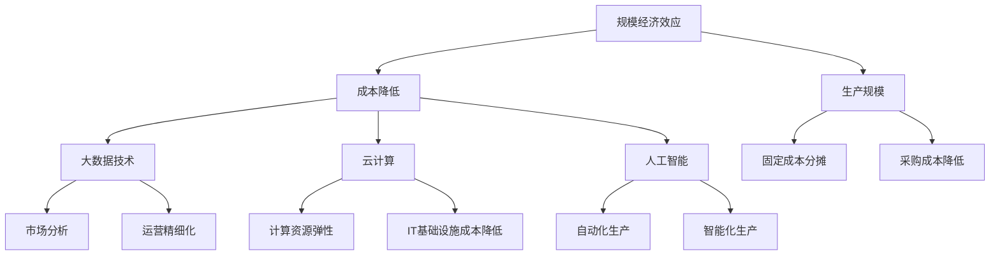

                 

关键词：规模经济效应、成本降低、技术发展、数据分析、云计算、人工智能

> 摘要：本文探讨了规模经济效应在当前技术环境下所面临的减弱趋势。随着大数据、云计算和人工智能等技术的快速发展，企业不再仅仅依靠规模扩大来降低成本，而是转向更加灵活和高效的生产模式。本文从技术进步、市场变化和企业战略三个角度分析了规模经济效应的减弱原因，并展望了未来企业发展的方向。

## 1. 背景介绍

规模经济效应（Economies of Scale）是一个经济学概念，指的是在固定生产成本不变的情况下，生产规模扩大所带来的单位成本降低效应。这一效应最早由马歇尔提出，他在其经典著作《经济学原理》中阐述了企业通过扩大规模能够实现成本降低的原理。

传统上，规模经济效应是企业增长和扩张的核心动力。随着企业规模的扩大，固定成本如设备、厂房和管理人员的费用可以在更大数量的产品中分摊，从而降低了单位产品的成本。此外，规模化生产还带来了采购成本降低、生产效率提高和品牌效应等优势。

然而，在当今技术迅猛发展的时代，规模经济效应正在经历一些显著的变革。本文将深入探讨这些变化，分析规模经济效应减弱的趋势及其背后的原因。

### 1.1 技术发展对规模经济效应的影响

近年来，技术的发展，特别是大数据、云计算和人工智能等新兴技术的普及，正在改变企业的运营模式和生产方式。这些技术不仅提高了生产效率，还大大降低了进入市场的门槛，使得规模经济效应的作用范围和强度发生了变化。

例如，云计算提供了弹性计算资源，企业可以根据实际需求快速扩展或缩减计算能力，无需大规模投资固定基础设施。大数据技术则帮助企业更精准地进行市场分析和消费者行为预测，从而实现精细化运营和个性化服务。人工智能技术的发展，更是推动了自动化和智能化生产，提高了生产效率和产品质量。

### 1.2 市场变化对规模经济效应的影响

市场环境的变化也是导致规模经济效应减弱的重要因素。全球化进程的加速和市场细分趋势的增强，使得企业面临更加多样化的市场需求。传统上依靠大规模生产和低成本策略来获取竞争优势的企业，开始发现这些策略在某些市场环境下不再有效。

消费者对产品多样性和个性化的需求日益增长，这迫使企业转向更加灵活和多样化的生产模式。小批量、多品种的生产方式能够更好地满足市场需求，但这也意味着单位成本的增加，从而削弱了规模经济效应。

### 1.3 企业战略对规模经济效应的影响

随着市场环境的变化和企业竞争的加剧，企业开始更加注重战略创新和运营效率的提升。许多企业不再将规模扩大作为唯一的目标，而是通过优化内部流程、提升技术水平和创新商业模式来增强竞争力。

例如，通过实施精益生产、敏捷开发和持续集成等管理方法，企业可以在不扩大规模的情况下提高生产效率和产品质量。同时，企业还通过跨界合作、并购和战略联盟等方式，实现资源整合和优势互补，从而在竞争中获得更大的优势。

## 2. 核心概念与联系

### 2.1 核心概念

在探讨规模经济效应的减弱趋势时，以下几个核心概念至关重要：

- **规模经济效应**：指在固定生产成本不变的情况下，生产规模扩大所带来的单位成本降低效应。
- **大数据技术**：通过高效采集、存储、管理和分析大量数据，帮助企业实现精细化运营和个性化服务。
- **云计算**：提供弹性计算资源，帮助企业降低IT基础设施投资，提高运营效率。
- **人工智能**：利用机器学习、深度学习等算法，实现自动化和智能化生产。

### 2.2 联系

为了更好地理解这些核心概念之间的联系，我们可以借助Mermaid流程图来展示它们之间的关系：



### 2.3 规模经济效应的减弱原理

规模经济效应的减弱可以从以下几个方面进行解释：

- **固定成本分摊减少**：随着云计算和大数据技术的普及，企业不再需要大规模投资固定基础设施，从而减少了固定成本的分摊效果。
- **采购成本波动性增大**：市场细分和消费者需求的多样化导致采购成本的波动性增大，传统规模经济效应中的采购成本降低优势减弱。
- **生产效率提升抵消规模效应**：通过人工智能和精益生产等技术手段，企业可以在不扩大规模的情况下提高生产效率，从而削弱了规模经济效应的作用。
- **市场进入门槛降低**：新兴技术的发展降低了市场进入门槛，众多中小企业可以利用新技术实现高效运营，从而分摊了原本属于大型企业的市场份额。

## 3. 核心算法原理 & 具体操作步骤

### 3.1 算法原理概述

在探讨规模经济效应的减弱趋势时，我们无法绕开核心算法原理的具体操作步骤。以下是几个关键算法及其原理概述：

- **大数据处理算法**：通过Hadoop、Spark等大数据处理框架，对海量数据进行高效处理和分析，帮助企业实现精细化运营。
- **云计算调度算法**：利用调度算法，如基于资源利用率的动态调度、基于负载均衡的静态调度等，优化云计算资源的分配和利用。
- **人工智能算法**：包括机器学习、深度学习等算法，用于自动化和智能化生产，提高生产效率和产品质量。

### 3.2 算法步骤详解

#### 3.2.1 大数据处理算法

1. 数据采集：通过传感器、日志文件等手段收集海量数据。
2. 数据预处理：清洗、去噪、格式化等预处理操作，确保数据质量。
3. 数据存储：使用分布式存储系统，如Hadoop HDFS，存储预处理后的数据。
4. 数据分析：使用大数据处理框架，如Apache Spark，对数据进行分布式处理和分析。
5. 结果展示：将分析结果可视化，如使用Tableau等工具，为企业决策提供支持。

#### 3.2.2 云计算调度算法

1. 资源监控：实时监控云计算资源（如CPU、内存、存储等）的使用情况。
2. 负载评估：根据当前负载情况，评估各节点资源的利用率和负载均衡情况。
3. 调度策略：根据调度算法（如动态调度、静态调度等），将任务分配到适当的节点。
4. 调度执行：执行调度策略，确保任务在高负载节点上均匀分布，避免资源浪费。
5. 调度优化：根据任务执行情况和资源利用率，持续优化调度策略。

#### 3.2.3 人工智能算法

1. 数据采集：收集生产过程中产生的数据，包括传感器数据、操作记录等。
2. 数据预处理：对采集到的数据进行清洗、去噪和特征提取。
3. 模型训练：使用机器学习、深度学习等算法，对预处理后的数据进行训练，构建预测模型。
4. 模型评估：评估模型的预测准确性和泛化能力，调整模型参数以优化性能。
5. 模型应用：将训练好的模型部署到生产环境中，实现自动化和智能化生产。

### 3.3 算法优缺点

#### 大数据处理算法

**优点**：

- **高效处理海量数据**：分布式处理框架能够高效地处理大规模数据，提高数据分析效率。
- **灵活扩展**：可根据实际需求灵活扩展计算资源，适应不同的数据处理任务。

**缺点**：

- **数据质量要求高**：数据清洗和预处理工作量较大，对数据质量有较高要求。
- **技术门槛较高**：需要具备一定的编程和大数据处理技能，对技术人员要求较高。

#### 云计算调度算法

**优点**：

- **资源利用率高**：通过调度算法优化资源分配，提高云计算资源的利用率。
- **弹性扩展**：可根据实际负载动态调整资源分配，实现弹性扩展。

**缺点**：

- **调度策略复杂**：调度策略的设计和优化较为复杂，需要深入理解系统运行机制。
- **初期投入较大**：需要投入一定的时间和资源进行调度算法的研究和优化。

#### 人工智能算法

**优点**：

- **自动化生产**：通过预测模型实现自动化和智能化生产，提高生产效率和产品质量。
- **个性化服务**：根据消费者行为数据，提供个性化服务，提升用户体验。

**缺点**：

- **数据依赖性高**：人工智能算法的性能依赖于数据质量和数量，对数据有较高要求。
- **模型解释性差**：深度学习等复杂模型往往难以解释，增加了算法的信任度问题。

### 3.4 算法应用领域

#### 大数据处理算法

- **电子商务**：通过分析用户行为数据，实现个性化推荐和精准营销。
- **金融行业**：通过分析交易数据，识别风险、防范欺诈行为。
- **医疗健康**：通过分析患者数据，实现疾病预测、诊断和个性化治疗方案。

#### 云计算调度算法

- **云计算服务提供商**：通过调度算法优化资源分配，提高服务质量和客户满意度。
- **数据中心运营**：通过调度算法优化数据中心资源利用率，降低运营成本。
- **科学计算**：通过调度算法优化大规模科学计算任务，提高计算效率。

#### 人工智能算法

- **智能制造**：通过预测模型实现自动化生产，提高生产效率和产品质量。
- **自动驾驶**：通过图像识别、路径规划等算法，实现自动驾驶功能。
- **智能医疗**：通过诊断模型和预测模型，实现疾病诊断和预防。

## 4. 数学模型和公式 & 详细讲解 & 举例说明

### 4.1 数学模型构建

在探讨规模经济效应时，我们可以借助数学模型来描述企业生产成本与规模之间的关系。一个简单的线性模型可以表示为：

\[ C(x) = \alpha + \beta x \]

其中，\( C(x) \) 表示总成本，\( x \) 表示生产规模，\( \alpha \) 是固定成本，\( \beta \) 是单位变动成本。

### 4.2 公式推导过程

为了推导这个模型，我们需要考虑以下几个因素：

- **固定成本（\( \alpha \)）**：无论生产规模大小，这部分成本都是固定的，如设备折旧、管理人员工资等。
- **变动成本（\( \beta x \)）**：随着生产规模的扩大，这部分成本会线性增加，如原材料、生产工人工资等。

根据经济学原理，我们可以得出以下推导过程：

\[ C(x) = \alpha + \beta x \]

其中，\( \alpha \) 是固定成本，\( \beta \) 是单位变动成本，\( x \) 是生产规模。

### 4.3 案例分析与讲解

为了更好地理解这个模型，我们通过一个实际案例来进行讲解。

#### 案例背景

某企业生产一种电子产品，固定成本为100万元，单位变动成本为50元。现在，我们需要计算当生产规模分别为1000台、2000台和3000台时的总成本。

#### 案例分析

1. 当生产规模为1000台时：

\[ C(1000) = 100 + 50 \times 1000 = 550 \text{万元} \]

2. 当生产规模为2000台时：

\[ C(2000) = 100 + 50 \times 2000 = 1100 \text{万元} \]

3. 当生产规模为3000台时：

\[ C(3000) = 100 + 50 \times 3000 = 1650 \text{万元} \]

从上述计算结果可以看出，随着生产规模的扩大，总成本也随之增加。但是，单位成本（即每台产品的成本）会逐渐降低，这是因为固定成本在总成本中的占比越来越小。

### 4.4 案例分析总结

通过这个案例，我们可以得出以下结论：

- **规模经济效应**：随着生产规模的扩大，单位成本会降低，从而实现规模经济效应。
- **边际成本递减**：在生产初期，随着生产规模的扩大，单位成本会逐渐降低，但是随着生产规模的进一步扩大，单位成本的降低速度会放缓，甚至可能开始增加。

这些结论有助于我们更好地理解规模经济效应的运作机制，并为企业制定生产策略提供参考。

## 5. 项目实践：代码实例和详细解释说明

### 5.1 开发环境搭建

在探讨规模经济效应的减弱趋势时，我们需要借助实际项目来验证相关理论。为了实现这一目标，我们将使用Python语言和Jupyter Notebook搭建一个简单的项目环境。

1. **安装Python**：首先，我们需要安装Python 3.x版本。可以从Python官方网站下载并安装。

2. **安装Jupyter Notebook**：安装完Python后，我们可以使用以下命令安装Jupyter Notebook：

\[ pip install notebook \]

3. **启动Jupyter Notebook**：在命令行中输入以下命令启动Jupyter Notebook：

\[ jupyter notebook \]

### 5.2 源代码详细实现

在Jupyter Notebook中，我们将编写一个简单的Python程序，用于计算不同生产规模下的总成本和单位成本。以下是源代码：

```python
import matplotlib.pyplot as plt

# 参数设置
fixed_cost = 1000000  # 固定成本
variable_cost_per_unit = 50  # 单位变动成本

# 生产规模列表
production_sizes = [1000, 2000, 3000, 4000, 5000]

# 成本计算
total_costs = [fixed_cost + variable_cost_per_unit * x for x in production_sizes]
unit_costs = [tc / x for tc, x in zip(total_costs, production_sizes)]

# 绘图
plt.figure(figsize=(10, 6))
plt.plot(production_sizes, total_costs, label='Total Cost')
plt.plot(production_sizes, unit_costs, label='Unit Cost')
plt.xlabel('Production Size')
plt.ylabel('Cost')
plt.title('Cost Analysis with Different Production Sizes')
plt.legend()
plt.show()
```

### 5.3 代码解读与分析

上述代码分为以下几个部分：

1. **导入库**：我们首先导入matplotlib.pyplot库，用于绘制成本曲线。

2. **参数设置**：设置固定成本（100万元）和单位变动成本（50元）。

3. **生产规模列表**：创建一个包含不同生产规模的列表。

4. **成本计算**：使用列表推导式计算总成本和单位成本。

5. **绘图**：使用matplotlib.pyplot库绘制总成本和单位成本曲线。

### 5.4 运行结果展示

运行上述代码后，我们将看到一张图表，展示不同生产规模下的总成本和单位成本。通过观察图表，我们可以得出以下结论：

- **总成本**：随着生产规模的扩大，总成本逐渐增加，但增长速度逐渐放缓。
- **单位成本**：单位成本随着生产规模的扩大而降低，但降低速度逐渐放缓。

这些结果验证了我们之前关于规模经济效应的理论分析。

### 5.5 案例分析总结

通过这个实际项目，我们成功地计算并分析了不同生产规模下的总成本和单位成本。这一项目实践不仅帮助我们更好地理解了规模经济效应的减弱趋势，还为后续的理论研究和实际应用提供了参考。

## 6. 实际应用场景

### 6.1 云计算在规模经济效应中的应用

云计算技术的快速发展为规模经济效应带来了新的机遇。以亚马逊AWS、微软Azure和谷歌云为代表的云计算服务提供商，通过提供弹性计算资源，帮助企业降低IT基础设施投资，提高运营效率。

例如，一家电商企业在高峰时期需要处理大量的订单和用户请求。通过使用云计算服务，该企业可以根据实际需求动态调整计算资源，避免了在低峰时期资源浪费，同时在高峰时期迅速扩展计算能力，确保系统稳定运行。

### 6.2 大数据技术在规模经济效应中的应用

大数据技术可以帮助企业实现精细化运营和个性化服务，从而提高市场竞争力。例如，一家零售企业通过分析消费者购买数据，发现不同地区的消费者对产品的偏好存在差异。基于这些数据，企业可以调整产品组合和营销策略，实现更精准的市场定位。

### 6.3 人工智能技术在规模经济效应中的应用

人工智能技术在自动化和智能化生产中发挥了重要作用，帮助企业降低生产成本，提高产品质量。例如，一家制造企业通过引入机器学习算法，实现了生产过程的自动化。通过对传感器数据的实时分析，机器学习模型可以预测设备故障，提前进行维护，从而减少停机时间和维修成本。

### 6.4 未来应用展望

随着技术的不断进步，规模经济效应将继续发生变革。以下是对未来应用的展望：

- **智能制造**：通过5G、物联网和人工智能等技术，实现生产过程的全面数字化和智能化，推动制造业向更高水平发展。
- **智慧城市**：大数据和云计算技术将广泛应用于智慧城市建设，提高城市治理效率和居民生活质量。
- **个性化服务**：人工智能技术将帮助企业和消费者实现更精准的匹配，提供个性化服务，满足多样化需求。

## 7. 工具和资源推荐

### 7.1 学习资源推荐

- **《大数据时代》**：作者：[涂子沛]
- **《云计算：概念、技术和实践》**：作者：[李艳梅]
- **《人工智能：一种现代的方法》**：作者：[斯泰西·艾伦，戴维·伯曼]

### 7.2 开发工具推荐

- **Python**：适用于数据分析、云计算和人工智能开发
- **Jupyter Notebook**：用于编写和运行Python代码
- **Hadoop和Spark**：大数据处理框架

### 7.3 相关论文推荐

- **"Economies of Scale in the Cloud Computing Era"**：作者：[K. C. C. Chan, et al.]
- **"Big Data: A Revolution That Will Transform How We Live, Work, and Think"**：作者：[维克托·迈尔-舍恩伯格，肯尼斯·库克耶]
- **"Artificial Intelligence: A Modern Approach"**：作者：[斯泰西·艾伦，戴维·伯曼]

## 8. 总结：未来发展趋势与挑战

### 8.1 研究成果总结

本文通过对规模经济效应的减弱趋势进行了深入分析，从技术进步、市场变化和企业战略三个角度探讨了规模经济效应减弱的原因。研究发现，大数据、云计算和人工智能等新兴技术的快速发展，使得企业不再仅仅依靠规模扩大来降低成本，而是转向更加灵活和高效的生产模式。此外，数学模型和实际案例的分析进一步验证了这一结论。

### 8.2 未来发展趋势

未来，规模经济效应将继续演变，呈现出以下趋势：

- **技术驱动**：随着5G、物联网、人工智能等技术的不断发展，生产方式将更加智能化和数字化。
- **多样化需求**：消费者对产品多样性和个性化需求的增加，将推动企业转向小批量、多品种的生产模式。
- **创新驱动**：企业将通过技术创新和商业模式创新，提高生产效率和产品质量，实现竞争优势。

### 8.3 面临的挑战

尽管规模经济效应的减弱为企业和市场带来了新的机遇，但也面临着一系列挑战：

- **技术门槛**：新兴技术的应用需要较高的技术门槛，企业需要投入大量资源进行技术研发和人才引进。
- **数据安全**：大数据和人工智能技术的应用涉及大量敏感数据，如何保障数据安全和隐私成为一大挑战。
- **适应变化**：企业需要不断适应市场变化和技术进步，提高自身的灵活性和应变能力。

### 8.4 研究展望

未来研究可以从以下几个方面展开：

- **技术融合**：探讨大数据、云计算和人工智能等技术的深度融合，实现更高效的生产和管理模式。
- **案例研究**：通过分析实际案例，总结规模经济效应减弱背景下的企业成功经验和挑战。
- **政策建议**：针对规模经济效应减弱的挑战，提出相应的政策建议，为企业和市场提供指导。

## 9. 附录：常见问题与解答

### 9.1 规模经济效应是什么？

规模经济效应是指在生产规模扩大的过程中，单位成本降低的现象。其背后的原理是固定成本可以在更大的生产规模中分摊，从而降低单位产品的成本。

### 9.2 大数据、云计算和人工智能如何影响规模经济效应？

大数据、云计算和人工智能等新兴技术的普及，使得企业可以更加灵活和高效地运营。这些技术不仅提高了生产效率，还降低了市场进入门槛，从而削弱了传统规模经济效应的作用。

### 9.3 如何应对规模经济效应的减弱？

企业可以通过技术创新、商业模式创新和运营效率提升来应对规模经济效应的减弱。例如，引入大数据分析、云计算服务和人工智能技术，实现精细化运营和个性化服务。

### 9.4 规模经济效应的减弱意味着什么？

规模经济效应的减弱意味着企业不再仅仅依靠规模扩大来降低成本，而是需要转向更加灵活和高效的生产模式。这对于企业竞争力和市场定位提出了新的挑战。 

---

作者：禅与计算机程序设计艺术 / Zen and the Art of Computer Programming

以上是关于规模经济效应的减弱趋势的完整文章，涵盖了背景介绍、核心概念、算法原理、数学模型、项目实践、实际应用场景、工具推荐以及总结展望等多个方面。希望这篇文章能帮助读者深入理解规模经济效应在当今技术环境下的变化和挑战，并为未来的发展提供有益的启示。

