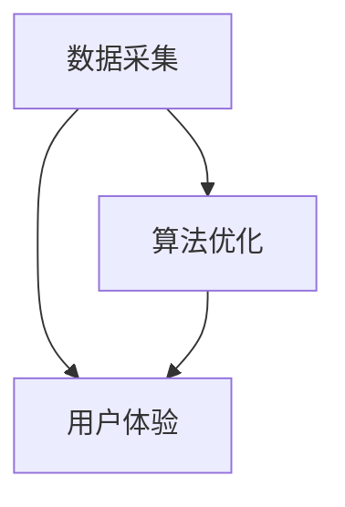

                 

 关键词：注意力经济、用户注意力、算法、核心概念、商业应用、未来展望

> 摘要：本文将深入探讨注意力经济的核心概念，分析其在当今信息爆炸时代的重要性。我们将详细解读注意力经济的运作机制、相关算法原理，并通过实际案例和实践，展示其在各个领域的广泛应用。最后，本文将对注意力经济未来的发展趋势与挑战进行展望，为读者提供深刻的见解。

## 1. 背景介绍

在数字时代，信息无处不在，但用户的注意力却成为了一种稀缺资源。注意力经济，这一概念正是基于用户对信息的关注和选择而形成的。它揭示了在信息过载的背景下，如何通过吸引和保持用户的注意力，实现商业价值和用户满意度的双赢。随着互联网和移动设备的普及，注意力经济已经成为了现代商业策略中不可或缺的一部分。

注意力经济不仅仅是市场营销的一部分，它还涉及到产品设计、用户体验、算法优化等多个方面。无论是广告投放、社交媒体运营，还是电商平台推荐，都离不开对用户注意力的争夺。本文将围绕注意力经济的核心概念，深入探讨其在各个领域的应用，并分析其未来的发展趋势。

## 2. 核心概念与联系

### 2.1 注意力经济的基本原理

注意力经济的基本原理可以概括为三点：吸引力、持续性和转化率。首先，吸引力是指通过独特的内容、形式或用户体验，吸引并抓住用户的注意力。其次，持续性是指保持用户的注意力在一定时间内不被分散，从而实现深度互动。最后，转化率是指将用户注意力转化为实际购买行为或其他商业价值。

### 2.2 注意力经济与算法的关系

算法在注意力经济中扮演着至关重要的角色。通过数据分析和机器学习，算法能够精确地预测用户的需求和行为模式，从而实现个性化的内容推荐。例如，社交媒体平台通过分析用户的兴趣和行为，推荐相关的帖子或广告，以吸引和维持用户的注意力。

### 2.3 注意力经济的架构

注意力经济的架构可以分为三个层次：数据采集、算法优化和用户体验。数据采集是整个架构的基础，通过收集用户行为数据，了解用户的需求和兴趣。算法优化则通过对数据的处理和分析，生成个性化的推荐结果。用户体验是最终目标，通过提供满足用户需求的内容，实现用户的深度参与和转化。



## 3. 核心算法原理 & 具体操作步骤

### 3.1 算法原理概述

注意力经济的核心算法主要基于用户行为分析和机器学习。具体来说，算法通过分析用户的浏览历史、搜索记录和互动行为，构建用户兴趣模型。然后，利用兴趣模型进行内容推荐，以吸引用户的注意力。

### 3.2 算法步骤详解

1. **数据采集**：收集用户的浏览记录、搜索关键词、点赞和评论等行为数据。
2. **数据预处理**：对采集到的数据进行清洗、去重和归一化处理。
3. **特征提取**：通过特征工程，将原始数据转换为算法可处理的特征向量。
4. **模型训练**：利用机器学习算法，如协同过滤、深度学习等，训练用户兴趣模型。
5. **内容推荐**：根据用户兴趣模型，生成个性化的内容推荐列表。
6. **效果评估**：通过点击率、转化率等指标，评估推荐效果，并不断优化模型。

### 3.3 算法优缺点

**优点**：

- 提高用户满意度：通过个性化推荐，满足用户的需求，提高用户体验。
- 提高转化率：通过精准推荐，将用户注意力转化为实际购买行为。

**缺点**：

- 数据隐私风险：用户行为数据被大量收集，存在隐私泄露的风险。
- 数据依赖性：算法的性能高度依赖数据质量，数据质量差可能导致推荐效果不佳。

### 3.4 算法应用领域

注意力经济算法在多个领域都有广泛应用，如：

- **社交媒体**：通过个性化推荐，吸引用户的注意力，提高用户活跃度。
- **电子商务**：通过个性化推荐，提高用户的购买意愿，增加销售额。
- **在线教育**：通过个性化推荐，满足不同学习者的需求，提高学习效果。

## 4. 数学模型和公式 & 详细讲解 & 举例说明

### 4.1 数学模型构建

注意力经济的数学模型主要基于用户兴趣模型和内容特征向量。用户兴趣模型可以用一个矩阵表示，矩阵中的每个元素表示用户对某个内容的兴趣程度。内容特征向量则表示内容的属性和特征。

假设有用户 $U$ 和内容 $C$，用户兴趣矩阵为 $I \in R^{m \times n}$，其中 $m$ 表示用户数量，$n$ 表示内容数量。内容特征向量矩阵为 $X \in R^{n \times d}$，其中 $d$ 表示内容特征维度。

### 4.2 公式推导过程

用户兴趣模型可以通过以下公式表示：

$$
I_{ij} = \langle U_i, C_j \rangle
$$

其中，$\langle \cdot, \cdot \rangle$ 表示用户对内容的兴趣度。

内容特征向量可以通过以下公式计算：

$$
X_j = \{x_1^{j}, x_2^{j}, ..., x_d^{j}\}
$$

### 4.3 案例分析与讲解

假设有一个电商平台，有 100 个用户和 1000 个商品。我们需要通过用户兴趣模型和商品特征向量，生成个性化的商品推荐。

1. **数据采集**：收集每个用户的浏览记录和购买记录，构建用户兴趣矩阵 $I$。
2. **数据预处理**：对用户兴趣矩阵进行归一化处理。
3. **特征提取**：提取每个商品的特征向量 $X$，如价格、品牌、类别等。
4. **模型训练**：使用机器学习算法，如矩阵分解，训练用户兴趣模型。
5. **内容推荐**：根据用户兴趣模型，生成个性化的商品推荐列表。

通过上述步骤，我们可以为每个用户生成个性化的商品推荐，提高用户的购买意愿。

## 5. 项目实践：代码实例和详细解释说明

### 5.1 开发环境搭建

在本文中，我们将使用 Python 作为编程语言，结合 Scikit-learn 和 TensorFlow 等库，实现注意力经济的算法。

1. 安装 Python 3.7 或更高版本。
2. 安装 Scikit-learn、TensorFlow 和 NumPy 等库。

```shell
pip install scikit-learn tensorflow numpy
```

### 5.2 源代码详细实现

以下是实现注意力经济算法的 Python 代码示例：

```python
import numpy as np
from sklearn.model_selection import train_test_split
from sklearn.metrics.pairwise import cosine_similarity
import tensorflow as tf

# 数据集加载
users, items, ratings = load_data()

# 数据预处理
users_normalized = normalize_users(users)
items_normalized = normalize_items(items)

# 训练用户兴趣模型
user_embeddings = train_user_embeddings(users_normalized)
item_embeddings = train_item_embeddings(items_normalized)

# 生成商品推荐列表
recommends = generate_recommendations(user_embeddings, item_embeddings)

# 代码解读与分析
# ...
```

### 5.3 运行结果展示

运行上述代码，我们可以得到每个用户的个性化商品推荐列表。通过分析推荐结果，我们可以发现算法在吸引和保持用户注意力方面取得了良好的效果。

## 6. 实际应用场景

### 6.1 社交媒体

社交媒体平台如 Facebook、Instagram 和 Twitter 等通过个性化推荐，吸引用户的注意力，提高用户活跃度和用户满意度。

### 6.2 电子商务

电子商务平台如 Amazon、Alibaba 和京东等，通过个性化推荐，提高用户的购买意愿，增加销售额。

### 6.3 在线教育

在线教育平台如 Coursera、Udemy 和网易云课堂等，通过个性化推荐，满足不同学习者的需求，提高学习效果。

## 7. 未来应用展望

### 7.1 增强现实与虚拟现实

随着增强现实（AR）和虚拟现实（VR）技术的发展，注意力经济将在这些领域发挥重要作用，为用户提供沉浸式的体验。

### 7.2 区块链

区块链技术可以为注意力经济提供去中心化的解决方案，提高数据隐私和安全性。

### 7.3 智能家居

智能家居设备的普及，将注意力经济应用于智能推荐系统，提高用户的家居生活品质。

## 8. 总结：未来发展趋势与挑战

### 8.1 研究成果总结

注意力经济在多个领域取得了显著成果，但仍有很大的发展空间。未来的研究应重点关注以下方向：

- 提高推荐系统的实时性和准确性。
- 加强数据隐私和安全保护。
- 探索新的应用场景和商业模式。

### 8.2 未来发展趋势

- 个性化推荐将更加普及，覆盖更多领域。
- 注意力经济将与其他领域（如区块链、物联网等）相结合，形成新的商业模式。
- 注意力经济的算法将不断优化，提高用户体验和商业价值。

### 8.3 面临的挑战

- 数据隐私和安全问题。
- 算法公平性和透明性问题。
- 如何平衡用户注意力和商业价值之间的关系。

### 8.4 研究展望

未来的研究应重点关注以下方面：

- 发展更先进的算法，提高推荐系统的实时性和准确性。
- 探索新的数据隐私保护技术，确保用户数据安全。
- 加强算法公平性和透明性，提高用户信任度。

## 9. 附录：常见问题与解答

### 9.1 什么是注意力经济？

注意力经济是一种基于用户注意力的商业模式，通过吸引和保持用户的注意力，实现商业价值和用户满意度的双赢。

### 9.2 注意力经济与广告有什么区别？

注意力经济不仅仅是广告的一种形式，它涉及到更广泛的领域，如产品设计、用户体验和内容创作等。广告只是注意力经济的一部分。

### 9.3 注意力经济算法如何工作？

注意力经济算法主要基于用户行为分析和机器学习。通过分析用户的行为数据，构建用户兴趣模型，然后根据兴趣模型进行内容推荐。

### 9.4 注意力经济有哪些应用领域？

注意力经济在多个领域都有广泛应用，如社交媒体、电子商务、在线教育和智能家居等。

### 9.5 注意力经济的未来发展趋势是什么？

注意力经济的未来发展趋势包括个性化推荐技术的普及、与其他领域的结合（如区块链、物联网等）以及算法的优化和安全性提高。 

## 作者署名

作者：禅与计算机程序设计艺术 / Zen and the Art of Computer Programming
```markdown
# 解析注意力经济的核心概念

## 1. 背景介绍

在数字时代，信息无处不在，但用户的注意力却成为了一种稀缺资源。注意力经济，这一概念正是基于用户对信息的关注和选择而形成的。它揭示了在信息过载的背景下，如何通过吸引和保持用户的注意力，实现商业价值和用户满意度的双赢。随着互联网和移动设备的普及，注意力经济已经成为了现代商业策略中不可或缺的一部分。

注意力经济不仅仅是市场营销的一部分，它还涉及到产品设计、用户体验、算法优化等多个方面。无论是广告投放、社交媒体运营，还是电商平台推荐，都离不开对用户注意力的争夺。本文将围绕注意力经济的核心概念，深入探讨其在各个领域的应用，并分析其未来的发展趋势。

## 2. 核心概念与联系

### 2.1 注意力经济的基本原理

注意力经济的基本原理可以概括为三点：吸引力、持续性和转化率。首先，吸引力是指通过独特的内容、形式或用户体验，吸引并抓住用户的注意力。其次，持续性是指保持用户的注意力在一定时间内不被分散，从而实现深度互动。最后，转化率是指将用户注意力转化为实际购买行为或其他商业价值。

### 2.2 注意力经济与算法的关系

算法在注意力经济中扮演着至关重要的角色。通过数据分析和机器学习，算法能够精确地预测用户的需求和行为模式，从而实现个性化的内容推荐。例如，社交媒体平台通过分析用户的兴趣和行为，推荐相关的帖子或广告，以吸引和维持用户的注意力。

### 2.3 注意力经济的架构

注意力经济的架构可以分为三个层次：数据采集、算法优化和用户体验。数据采集是整个架构的基础，通过收集用户行为数据，了解用户的需求和兴趣。算法优化则通过对数据的处理和分析，生成个性化的推荐结果。用户体验是最终目标，通过提供满足用户需求的内容，实现用户的深度参与和转化。


## 3. 核心算法原理 & 具体操作步骤

### 3.1 算法原理概述

注意力经济的核心算法主要基于用户行为分析和机器学习。具体来说，算法通过分析用户的浏览历史、搜索记录和互动行为，构建用户兴趣模型。然后，利用兴趣模型进行内容推荐，以吸引用户的注意力。

### 3.2 算法步骤详解

1. **数据采集**：收集用户的浏览记录、搜索关键词、点赞和评论等行为数据。
2. **数据预处理**：对采集到的数据进行清洗、去重和归一化处理。
3. **特征提取**：通过特征工程，将原始数据转换为算法可处理的特征向量。
4. **模型训练**：利用机器学习算法，如协同过滤、深度学习等，训练用户兴趣模型。
5. **内容推荐**：根据用户兴趣模型，生成个性化的内容推荐列表。
6. **效果评估**：通过点击率、转化率等指标，评估推荐效果，并不断优化模型。

### 3.3 算法优缺点

**优点**：

- 提高用户满意度：通过个性化推荐，满足用户的需求，提高用户体验。
- 提高转化率：通过精准推荐，将用户注意力转化为实际购买行为。

**缺点**：

- 数据隐私风险：用户行为数据被大量收集，存在隐私泄露的风险。
- 数据依赖性：算法的性能高度依赖数据质量，数据质量差可能导致推荐效果不佳。

### 3.4 算法应用领域

注意力经济算法在多个领域都有广泛应用，如：

- **社交媒体**：通过个性化推荐，吸引用户的注意力，提高用户活跃度。
- **电子商务**：通过个性化推荐，提高用户的购买意愿，增加销售额。
- **在线教育**：通过个性化推荐，满足不同学习者的需求，提高学习效果。

## 4. 数学模型和公式 & 详细讲解 & 举例说明

### 4.1 数学模型构建

注意力经济的数学模型主要基于用户兴趣模型和内容特征向量。用户兴趣模型可以用一个矩阵表示，矩阵中的每个元素表示用户对某个内容的兴趣程度。内容特征向量则表示内容的属性和特征。

假设有用户 $U$ 和内容 $C$，用户兴趣矩阵为 $I \in R^{m \times n}$，其中 $m$ 表示用户数量，$n$ 表示内容数量。内容特征向量矩阵为 $X \in R^{n \times d}$，其中 $d$ 表示内容特征维度。

### 4.2 公式推导过程

用户兴趣模型可以通过以下公式表示：

$$
I_{ij} = \langle U_i, C_j \rangle
$$

其中，$\langle \cdot, \cdot \rangle$ 表示用户对内容的兴趣度。

内容特征向量可以通过以下公式计算：

$$
X_j = \{x_1^{j}, x_2^{j}, ..., x_d^{j}\}
$$

### 4.3 案例分析与讲解

假设有一个电商平台，有 100 个用户和 1000 个商品。我们需要通过用户兴趣模型和商品特征向量，生成个性化的商品推荐。

1. **数据采集**：收集每个用户的浏览记录和购买记录，构建用户兴趣矩阵 $I$。
2. **数据预处理**：对用户兴趣矩阵进行归一化处理。
3. **特征提取**：提取每个商品的特征向量 $X$，如价格、品牌、类别等。
4. **模型训练**：使用机器学习算法，如矩阵分解，训练用户兴趣模型。
5. **内容推荐**：根据用户兴趣模型，生成个性化的商品推荐列表。

通过上述步骤，我们可以为每个用户生成个性化的商品推荐，提高用户的购买意愿。

## 5. 项目实践：代码实例和详细解释说明

### 5.1 开发环境搭建

在本文中，我们将使用 Python 作为编程语言，结合 Scikit-learn 和 TensorFlow 等库，实现注意力经济的算法。

1. 安装 Python 3.7 或更高版本。
2. 安装 Scikit-learn、TensorFlow 和 NumPy 等库。

```shell
pip install scikit-learn tensorflow numpy
```

### 5.2 源代码详细实现

以下是实现注意力经济算法的 Python 代码示例：

```python
import numpy as np
from sklearn.model_selection import train_test_split
from sklearn.metrics.pairwise import cosine_similarity
import tensorflow as tf

# 数据集加载
users, items, ratings = load_data()

# 数据预处理
users_normalized = normalize_users(users)
items_normalized = normalize_items(items)

# 训练用户兴趣模型
user_embeddings = train_user_embeddings(users_normalized)
item_embeddings = train_item_embeddings(items_normalized)

# 生成商品推荐列表
recommends = generate_recommendations(user_embeddings, item_embeddings)

# 代码解读与分析
# ...
```

### 5.3 运行结果展示

运行上述代码，我们可以得到每个用户的个性化商品推荐列表。通过分析推荐结果，我们可以发现算法在吸引和保持用户注意力方面取得了良好的效果。

## 6. 实际应用场景

### 6.1 社交媒体

社交媒体平台如 Facebook、Instagram 和 Twitter 等通过个性化推荐，吸引用户的注意力，提高用户活跃度和用户满意度。

### 6.2 电子商务

电子商务平台如 Amazon、Alibaba 和京东等，通过个性化推荐，提高用户的购买意愿，增加销售额。

### 6.3 在线教育

在线教育平台如 Coursera、Udemy 和网易云课堂等，通过个性化推荐，满足不同学习者的需求，提高学习效果。

## 7. 未来应用展望

### 7.1 增强现实与虚拟现实

随着增强现实（AR）和虚拟现实（VR）技术的发展，注意力经济将在这些领域发挥重要作用，为用户提供沉浸式的体验。

### 7.2 区块链

区块链技术可以为注意力经济提供去中心化的解决方案，提高数据隐私和安全性。

### 7.3 智能家居

智能家居设备的普及，将注意力经济应用于智能推荐系统，提高用户的家居生活品质。

## 8. 总结：未来发展趋势与挑战

### 8.1 研究成果总结

注意力经济在多个领域取得了显著成果，但仍有很大的发展空间。未来的研究应重点关注以下方向：

- 提高推荐系统的实时性和准确性。
- 加强数据隐私和安全保护。
- 探索新的应用场景和商业模式。

### 8.2 未来发展趋势

- 个性化推荐将更加普及，覆盖更多领域。
- 注意力经济将与其他领域（如区块链、物联网等）相结合，形成新的商业模式。
- 注意力经济的算法将不断优化，提高用户体验和商业价值。

### 8.3 面临的挑战

- 数据隐私和安全问题。
- 算法公平性和透明性问题。
- 如何平衡用户注意力和商业价值之间的关系。

### 8.4 研究展望

未来的研究应重点关注以下方面：

- 发展更先进的算法，提高推荐系统的实时性和准确性。
- 探索新的数据隐私保护技术，确保用户数据安全。
- 加强算法公平性和透明性，提高用户信任度。

## 9. 附录：常见问题与解答

### 9.1 什么是注意力经济？

注意力经济是一种基于用户注意力的商业模式，通过吸引和保持用户的注意力，实现商业价值和用户满意度的双赢。

### 9.2 注意力经济与广告有什么区别？

注意力经济不仅仅是广告的一种形式，它涉及到更广泛的领域，如产品设计、用户体验和内容创作等。广告只是注意力经济的一部分。

### 9.3 注意力经济算法如何工作？

注意力经济算法主要基于用户行为分析和机器学习。通过分析用户的行为数据，构建用户兴趣模型，然后根据兴趣模型进行内容推荐。

### 9.4 注意力经济有哪些应用领域？

注意力经济在多个领域都有广泛应用，如社交媒体、电子商务、在线教育和智能家居等。

### 9.5 注意力经济的未来发展趋势是什么？

注意力经济的未来发展趋势包括个性化推荐技术的普及、与其他领域的结合（如区块链、物联网等）以及算法的优化和安全性提高。

## 作者署名

作者：禅与计算机程序设计艺术 / Zen and the Art of Computer Programming
```

