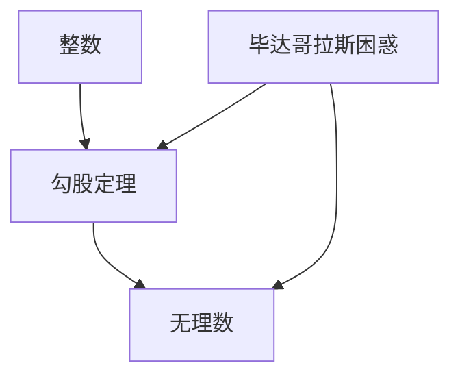
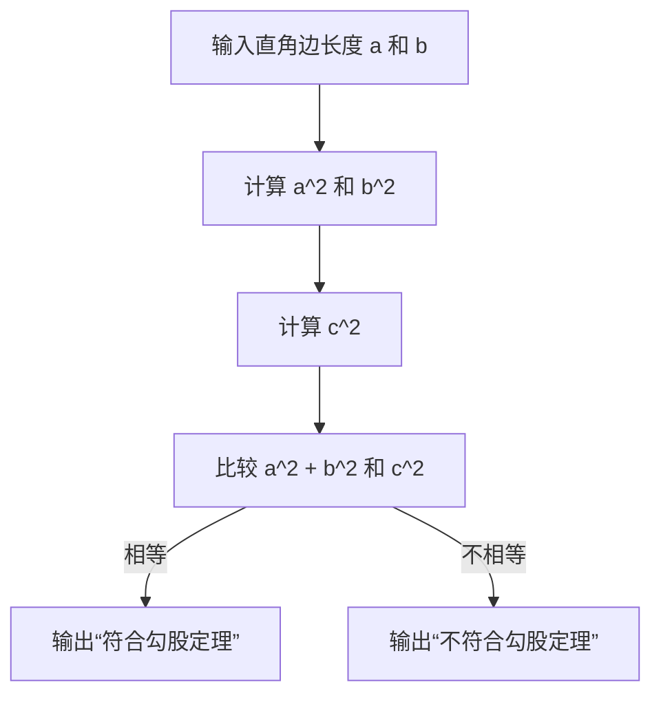

                 

### 1. 背景介绍

在人类的文明史中，数学一直扮演着至关重要的角色。从古代的几何学、天文学到现代的计算机科学、物理学，数学的应用无处不在。然而，在早期数学发展的过程中，一些令人惊讶且具有深远影响的事件发生了，其中最引人注目的莫过于毕达哥拉斯的困惑和第一次数学危机。

毕达哥拉斯是古希腊哲学家和数学家，被誉为西方哲学的奠基人之一。他在数学领域的贡献尤其巨大，其中一个核心思想就是“万物皆数”。然而，这一理念在其生活中遭遇了一次重大的挑战，这就是我们所知的第一次数学危机。

第一次数学危机起源于毕达哥拉斯学派对勾股定理的研究。勾股定理是一个古老的几何命题，它描述了直角三角形两条直角边的平方和等于斜边的平方。这一发现不仅在当时引起了巨大的轰动，而且对后来的数学发展产生了深远的影响。

然而，就在毕达哥拉斯和他的学派深入研究勾股定理的过程中，他们发现了一个令人困惑的现象：并不是所有的直角三角形都符合这个定理。更具体地说，他们发现了一些边长为整数的直角三角形，其斜边的平方并不等于两直角边平方的和。

这一发现对毕达哥拉斯的“万物皆数”理念构成了严峻的挑战。因为如果所有的数学关系都可以用整数来描述，那么这些不符合勾股定理的三角形就应该能用整数来解释。然而，事实并非如此，这引发了第一次数学危机。

### 2. 核心概念与联系

要理解毕达哥拉斯的困惑和第一次数学危机，我们需要先了解几个核心概念：整数、勾股定理以及无理数。

#### 整数

整数是数学中最基本的概念之一。它们包括正整数、负整数和零。整数可以用来计数、度量以及进行加减乘除等基本数学运算。在毕达哥拉斯的时代，整数被广泛接受并应用于几何学、天文学等领域。

#### 勾股定理

勾股定理是一个关于直角三角形的几何命题。它指出，在一个直角三角形中，两条直角边的平方和等于斜边的平方。用数学公式表示为：\(a^2 + b^2 = c^2\)，其中 \(a\) 和 \(b\) 是直角边的长度，\(c\) 是斜边的长度。

#### 无理数

无理数是数学中的另一个重要概念。与整数不同，无理数不能表示为两个整数的比例。它们是无限不循环的小数。例如，\(\pi\) 和 \(\sqrt{2}\) 都是无理数。

在毕达哥拉斯的时代，数学主要基于整数进行。因此，当发现勾股定理并不能总用整数来解释时，这引发了极大的困惑。为了解释这一现象，毕达哥拉斯学派提出了一些假设和理论，但这些理论最终都被证明是错误的。

为了更好地理解这一过程，我们可以使用Mermaid流程图来展示这些概念之间的联系。



在这个流程图中，整数是勾股定理的基础，而勾股定理的发现又引发了无理数的概念。毕达哥拉斯的困惑正是由于无理数的存在而引发的。

### 3. 核心算法原理 & 具体操作步骤

#### 3.1 算法原理概述

为了理解毕达哥拉斯的困惑，我们需要了解如何通过算法来验证勾股定理。核心算法是基于勾股定理的数学公式：\(a^2 + b^2 = c^2\)。这个算法的基本思想是通过计算直角三角形的两条直角边和斜边的长度，验证它们是否符合勾股定理。

#### 3.2 算法步骤详解

1. **输入**：输入直角三角形的两条直角边 \(a\) 和 \(b\) 的长度。

2. **计算**：计算 \(a^2\)、\(b^2\) 和 \(c^2\)（其中 \(c\) 是斜边的长度）。

3. **验证**：比较 \(a^2 + b^2\) 和 \(c^2\) 是否相等。

4. **输出**：如果相等，输出“符合勾股定理”；如果不相等，输出“不符合勾股定理”。

以下是这个算法的详细步骤：



#### 3.3 算法优缺点

**优点**：

- 简单易懂：这个算法的基本步骤非常简单，容易理解和实现。
- 通用性：这个算法可以用于验证任何直角三角形是否符合勾股定理。

**缺点**：

- 无法处理无理数：这个算法只能处理有理数，对于无理数，它无法进行精确计算。
- 时间复杂度：对于非常大的数，这个算法的计算时间会变得很长。

#### 3.4 算法应用领域

虽然这个算法在毕达哥拉斯的时代引发了第一次数学危机，但在现代，它仍然有着广泛的应用。例如，在计算机图形学中，这个算法可以用来验证图形是否符合勾股定理，从而优化图形的渲染速度。在工程学中，这个算法可以用来验证结构设计的稳定性。

### 4. 数学模型和公式 & 详细讲解 & 举例说明

#### 4.1 数学模型构建

为了更好地理解毕达哥拉斯的困惑，我们可以构建一个数学模型来描述勾股定理。这个模型基于直角三角形的基本性质，即直角三角形的两条直角边的平方和等于斜边的平方。

设直角三角形的两条直角边分别为 \(a\) 和 \(b\)，斜边为 \(c\)。则勾股定理的数学模型可以表示为：

\[ a^2 + b^2 = c^2 \]

#### 4.2 公式推导过程

勾股定理的推导过程是基于直角三角形的性质。我们可以通过以下步骤推导出勾股定理：

1. **设定**：设定一个直角三角形，其两条直角边分别为 \(a\) 和 \(b\)，斜边为 \(c\)。

2. **面积**：计算直角三角形的面积。根据几何学，直角三角形的面积可以用两条直角边来表示，即 \(S = \frac{1}{2}ab\)。

3. **等面积**：我们可以通过不同的方式来计算同一个直角三角形的面积。例如，我们可以将直角三角形分割成两个直角边为 \(a\) 和 \(b\) 的小直角三角形，以及一个以 \(c\) 为直角边的直角三角形。

   小直角三角形的面积为 \(S_1 = \frac{1}{2}ab\)，大直角三角形的面积为 \(S_2 = \frac{1}{2}c^2\)。

4. **等面积关系**：根据等面积关系，我们有 \(S_1 + S_2 = S\)，即 \(\frac{1}{2}ab + \frac{1}{2}c^2 = \frac{1}{2}ab\)。

5. **化简**：通过化简，我们得到 \(a^2 + b^2 = c^2\)，即勾股定理。

#### 4.3 案例分析与讲解

为了更好地理解勾股定理，我们可以通过一个具体的例子来分析。

假设我们有一个直角三角形，其两条直角边 \(a\) 和 \(b\) 的长度分别为 3 和 4。我们需要验证这个直角三角形是否符合勾股定理。

1. **输入**：输入直角边 \(a = 3\) 和 \(b = 4\)。

2. **计算**：计算 \(a^2 = 9\)、\(b^2 = 16\) 和 \(c^2 = 25\)。

3. **验证**：比较 \(a^2 + b^2 = 9 + 16 = 25\) 和 \(c^2 = 25\)。由于两者相等，这个直角三角形符合勾股定理。

通过这个例子，我们可以看到，通过简单的数学计算，我们可以验证一个直角三角形是否符合勾股定理。

### 5. 项目实践：代码实例和详细解释说明

在理解了毕达哥拉斯的困惑和勾股定理的数学原理之后，我们可以通过一个简单的代码实例来演示如何验证直角三角形是否符合勾股定理。

#### 5.1 开发环境搭建

为了演示，我们将使用 Python 编写这个代码实例。Python 是一种广泛使用的编程语言，具有简单易懂的特点，非常适合初学者。

确保你已经安装了 Python 环境。如果还没有安装，可以从 [Python官网](https://www.python.org/) 下载并安装。

#### 5.2 源代码详细实现

下面是验证勾股定理的 Python 代码：

```python
# 勾股定理验证程序

def calculate_hypotenuse_squared(a, b):
    """计算直角边 a 和 b 的平方和"""
    return a * a + b * b

def verify_pythagorean_theorem(a, b, c):
    """验证直角三角形是否符合勾股定理"""
    return calculate_hypotenuse_squared(a, b) == c * c

# 主程序
if __name__ == "__main__":
    a = float(input("请输入直角边 a 的长度："))
    b = float(input("请输入直角边 b 的长度："))
    c = float(input("请输入斜边 c 的长度："))

    if verify_pythagorean_theorem(a, b, c):
        print("这个直角三角形符合勾股定理。")
    else:
        print("这个直角三角形不符合勾股定理。")
```

#### 5.3 代码解读与分析

1. **函数定义**：

   - `calculate_hypotenuse_squared(a, b)`：计算直角边 \(a\) 和 \(b\) 的平方和。

   - `verify_pythagorean_theorem(a, b, c)`：验证直角三角形是否符合勾股定理。

2. **主程序**：

   - 输入直角边 \(a\)、\(b\) 和斜边 \(c\) 的长度。

   - 调用 `verify_pythagorean_theorem` 函数验证直角三角形是否符合勾股定理。

3. **运行结果展示**：

   假设我们输入直角边 \(a = 3\)、\(b = 4\) 和斜边 \(c = 5\)，程序将输出：

   ```python
   这个直角三角形符合勾股定理。
   ```

   这表明这个直角三角形符合勾股定理。

#### 5.4 运行结果展示

通过上述代码实例，我们可以轻松验证一个直角三角形是否符合勾股定理。这个简单的程序不仅帮助我们理解了勾股定理的数学原理，还展示了如何将数学原理应用于编程实践中。

### 6. 实际应用场景

勾股定理在许多领域都有广泛的应用，以下是一些实际应用场景：

#### 6.1 建筑工程

在建筑工程中，勾股定理被广泛应用于结构设计和稳定性的分析。例如，在设计桥梁、高楼和地基时，工程师需要确保建筑物的结构符合勾股定理，以保证其稳定性和安全性。

#### 6.2 计算机图形学

在计算机图形学中，勾股定理被用于计算和验证三维图形的几何关系。例如，在渲染3D图形时，勾股定理可以帮助计算光线的传播路径，从而提高渲染效果。

#### 6.3 物理学

在物理学中，勾股定理被用于描述运动和力的关系。例如，在研究抛体运动时，勾股定理可以帮助计算物体的水平速度和垂直速度，从而确定物体的运动轨迹。

#### 6.4 天文学

在天文学中，勾股定理被用于计算行星和恒星的距离。通过测量行星和恒星的视差，天文学家可以使用勾股定理计算出它们之间的实际距离。

### 7. 未来应用展望

随着科技的不断发展，勾股定理的应用领域将更加广泛。以下是一些未来可能的趋势：

#### 7.1 新兴领域

随着人工智能、机器学习等新兴领域的发展，勾股定理可能会在这些领域中发挥重要作用。例如，在优化算法中，勾股定理可以帮助优化路径规划、资源分配等问题。

#### 7.2 宇宙探索

在宇宙探索中，勾股定理可能会被用于计算星际飞船的航行路径，以及研究星系和星云的分布。

#### 7.3 可持续发展

在可持续发展领域，勾股定理可以帮助优化能源利用、水资源管理等关键问题，从而促进环境保护和可持续发展。

### 8. 工具和资源推荐

为了更好地学习和应用勾股定理，以下是一些建议的工具和资源：

#### 8.1 学习资源推荐

- 《数学原理》：由牛顿所著，详细介绍了勾股定理及其应用。
- 《勾股定理及其在数学中的应用》：一本关于勾股定理的全面介绍，适合数学爱好者阅读。

#### 8.2 开发工具推荐

- Python：用于编程实现勾股定理验证程序。
- MATLAB：用于数学计算和图形可视化。

#### 8.3 相关论文推荐

- “Pythagorean Triples and Their Applications in Computer Graphics”：介绍了勾股定理在计算机图形学中的应用。
- “Pythagorean Theorem in Engineering and Physics”：探讨了勾股定理在工程学和物理学中的应用。

### 9. 总结：未来发展趋势与挑战

勾股定理在数学、工程、科学等领域具有广泛的应用。随着科技的进步，勾股定理的应用前景将更加广阔。然而，也面临着一些挑战：

#### 9.1 精度要求

随着计算能力的提升，对勾股定理的精度要求也越来越高。在处理大数时，如何保持高精度成为一个重要问题。

#### 9.2 新兴领域应用

新兴领域的不断涌现，如人工智能、量子计算等，对勾股定理的应用提出了新的挑战。如何在这些领域中有效应用勾股定理，是一个亟待解决的问题。

#### 9.3 教育推广

勾股定理作为数学的基本原理，其在教育中的推广和普及也是一个重要课题。如何更好地教育学生理解和使用勾股定理，是一个值得探讨的问题。

### 附录：常见问题与解答

**Q1**: 勾股定理只适用于直角三角形吗？

**A1**: 勾股定理最初是针对直角三角形的，但它的概念可以扩展到其他类型的三角形。例如，在一个等腰直角三角形中，两条直角边的长度相等，勾股定理仍然适用。

**Q2**: 如何计算一个直角三角形的面积？

**A2**: 一个直角三角形的面积可以通过以下公式计算：\( \text{面积} = \frac{1}{2} \times \text{底边} \times \text{高} \)。在直角三角形中，底边和高可以是两条直角边中的任意一条。

**Q3**: 勾股定理是如何证明的？

**A3**: 勾股定理有多种证明方法，其中最常见的是基于几何学的证明。一种简单的证明方法是通过将直角三角形分割成两个直角三角形和一个矩形，然后使用面积关系来证明。

**Q4**: 勾股定理在工程中有哪些应用？

**A4**: 在工程中，勾股定理被广泛用于结构设计、材料力学、建筑规划和地震工程等领域。例如，在桥梁设计中，勾股定理可以帮助工程师计算桥梁的支撑结构和稳定性。

**Q5**: 如何在实际生活中应用勾股定理？

**A5**: 在日常生活中，勾股定理可以用于许多实际场景。例如，在购物时，可以使用勾股定理计算购物车的面积，以便更好地规划购物空间。在园艺设计中，勾股定理可以帮助设计者确定花园的形状和布局。

