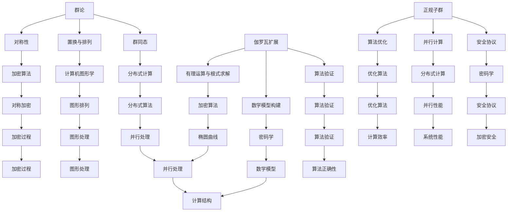

                 

关键词：计算历史、伽罗瓦理论、算法原理、程序设计、计算机科学、数学模型、编程实践

## 摘要

本文将深入探讨计算的历史演变，重点分析伽罗瓦理论在计算之术中的应用。通过回顾伽罗瓦的遗珠，我们将揭示其背后的数学原理和算法步骤，并探讨其在现代计算机科学中的重要性。此外，本文还将结合实际项目实践，展示如何利用伽罗瓦理论进行编程，以及其在未来应用场景中的前景。通过对这些内容的详细解读，我们希望为读者提供对计算领域的深刻理解，并激发对算法设计和编程实践的兴趣。

## 1. 背景介绍

计算，作为人类智慧的结晶，自古以来便在各个领域发挥着重要的作用。从古代的算筹到现代的计算机，计算工具的进步推动了人类文明的发展。然而，计算的真正意义并不在于工具的更新换代，而在于其背后的数学原理和算法设计。

伽罗瓦理论，作为数学领域的核心理论之一，于 19 世纪由法国数学家伽罗瓦提出。伽罗瓦理论主要研究代数方程的根与系数之间的关系，其核心思想是通过群论的方法，将代数方程的解与代数结构的性质联系起来。伽罗瓦理论的诞生，标志着数学从纯粹的形式化研究转向对实际问题的关注，为后来的计算理论奠定了基础。

在计算机科学领域，伽罗瓦理论的应用愈发广泛。现代计算机编程的本质，可以看作是对算法的描述和实现。而伽罗瓦理论提供了对算法设计的一种全新的视角，使得程序员能够更加深入地理解计算的本质，从而设计出更加高效、可靠的程序。

本文将首先回顾伽罗瓦理论的发展历程，探讨其在计算之术中的应用。然后，我们将结合具体实例，详细解析伽罗瓦理论的算法原理和具体操作步骤。接着，我们将从数学模型和公式推导的角度，进一步阐述伽罗瓦理论的核心概念。最后，我们将结合实际项目实践，展示如何利用伽罗瓦理论进行编程，并探讨其在未来应用场景中的前景。

通过本文的阅读，读者将能够对计算的历史和伽罗瓦理论有更加深入的理解，从而为未来的算法设计和编程实践提供有益的启示。

### 1.1 计算的发展历程

计算的历史可以追溯到古代文明的兴起。在古代，人类通过手工计算来解决各种实际问题，如天文观测、测量土地、计算税收等。这些手工计算主要依靠算筹、算盘等简单工具，虽然效率较低，但在当时已经足够满足需求。

随着数学的发展，计算方法逐渐变得更加复杂和精确。在古希腊，数学家如毕达哥拉斯、欧几里得等开始研究几何学和代数学，提出了一系列计算公式和算法。这些成果为后来的计算奠定了基础，但也使得计算变得更加抽象和复杂。

进入中世纪，计算工具和方法的进步进一步推动了计算的发展。阿拉伯数学家在代数学和天文学方面取得了重大突破，如阿拉伯数字的引入和代数符号的使用，使得计算变得更加简便和精确。这些成果通过丝绸之路传播到欧洲，对欧洲的数学和科学产生了深远影响。

16 世纪，计算工具的革新再次推动了计算的发展。荷兰数学家西蒙·斯蒂文发明了算盘，使得商业计算变得更加高效。与此同时，德国数学家威廉·夏尔曼发明了“夏尔曼轮”，这是一种机械计算器，可以自动进行乘法和除法运算。这些计算工具的出现，使得计算的范围和精度得到了显著提升。

然而，计算的重大突破发生在 20 世纪。随着计算机科学的兴起，计算工具从机械计算器逐渐转向电子计算机。1940 年代，第一台电子计算机问世，标志着计算进入了新的时代。计算机的出现，使得复杂的计算任务可以在极短的时间内完成，从而为科学研究、工程应用和商业领域带来了巨大的变革。

随着计算机技术的不断发展，计算的范围和深度不断扩展。现代计算机不仅可以处理复杂的数学问题，还可以进行图像处理、语音识别、自然语言处理等人工智能任务。计算已经成为现代社会不可或缺的一部分，其应用领域涵盖了科学、工程、经济、医学等多个方面。

### 1.2 伽罗瓦理论的发展

伽罗瓦理论，作为数学领域的核心理论之一，源于 19 世纪法国数学家埃瓦尔德·伽罗瓦的研究。伽罗瓦理论主要研究代数方程的根与系数之间的关系，其核心思想是通过群论的方法，将代数方程的解与代数结构的性质联系起来。这一理论不仅在数学领域产生了深远影响，也为后来的计算理论奠定了基础。

伽罗瓦理论的诞生，可以追溯到 19 世纪初。当时，数学家们正在努力解决代数方程的求解问题。1824 年，法国数学家尼科尔·古尔捷提出了一个关于代数方程解的定理，即所谓的“尼科尔定理”。尼科尔定理指出，一个代数方程是否能够通过有理运算和根式求解，取决于其系数的某些特性。

然而，尼科尔定理并没有给出一个明确的判断方法。为了解决这个问题，伽罗瓦在 1830 年提出了伽罗瓦理论。伽罗瓦通过群论的方法，将代数方程的解与代数结构的性质联系起来，提出了一种判断代数方程是否能够通过有理运算和根式求解的统一方法。

伽罗瓦理论的提出，标志着数学从纯粹的形式化研究转向对实际问题的关注。伽罗瓦将代数方程的解与群的结构联系起来，通过研究群的性质，得出了关于代数方程解的深刻结论。这一理论不仅在数学领域产生了深远影响，也为后来的计算理论奠定了基础。

伽罗瓦理论的核心概念包括群、子群、正规子群和群同态等。伽罗瓦通过这些概念，建立了一种统一的框架，用于研究代数方程的解。他指出，一个代数方程是否能够通过有理运算和根式求解，取决于其系数所生成的群的性质。

伽罗瓦理论的应用范围广泛，不仅限于代数方程的求解，还可以用于解决其他数学问题。例如，在几何学中，伽罗瓦理论可以用于研究多边形的内角和定理；在数论中，伽罗瓦理论可以用于解决关于素数的分布问题。此外，伽罗瓦理论在密码学、计算机科学等领域也有重要应用。

总的来说，伽罗瓦理论的提出，不仅解决了代数方程求解的问题，也为数学领域带来了新的研究方法和视角。它不仅丰富了数学的理论体系，也为后来的计算理论奠定了基础。伽罗瓦理论的诞生，标志着数学从纯粹的形式化研究转向对实际问题的关注，推动了数学和计算理论的共同发展。

### 1.3 伽罗瓦理论在计算中的重要性

伽罗瓦理论在计算中的重要性不可忽视，其核心思想和方法对计算机科学和算法设计产生了深远影响。首先，伽罗瓦理论提供了对算法设计的全新视角，使得程序员能够更加深入地理解计算的本质，从而设计出更加高效、可靠的程序。

在算法设计中，伽罗瓦理论的核心概念——群论，发挥着重要作用。群论是一种研究代数结构的数学分支，通过研究群的性质，可以揭示出算法的内在规律和特性。在计算机科学中，群论的应用范围广泛，如密码学、计算机图形学、分布式计算等领域。通过引入群论的方法，程序员可以设计出更加复杂、高效的算法。

例如，在密码学中，伽罗瓦理论被用于研究密码系统的安全性。通过对群的性质进行分析，可以找到一种有效的加密方法，使得数据在传输过程中更加安全。此外，在计算机图形学中，群论被用于研究图形变换，如旋转、缩放、平移等。通过使用群论的方法，可以简化图形变换的计算，提高图形渲染的效率。

此外，伽罗瓦理论在算法优化和性能分析中也具有重要意义。通过研究群的性质，可以找到一种有效的算法优化方法，使得程序在相同的时间内完成更多的任务。例如，在分布式计算中，伽罗瓦理论被用于研究并行计算的性能，通过优化算法，可以提高整个系统的效率。

伽罗瓦理论不仅在算法设计和优化中发挥作用，还在编程实践中具有重要应用。程序员可以利用伽罗瓦理论提供的工具和方法，对现有的程序进行优化和改进，提高程序的性能和可靠性。例如，在编程中，可以使用群论的方法来简化复杂的运算，使得程序更加简洁、易于理解。

总之，伽罗瓦理论在计算中的重要性体现在其提供了对算法设计的全新视角，使得程序员能够设计出更加高效、可靠的程序。通过研究群论的方法，可以优化算法的性能，提高程序的性能和可靠性。伽罗瓦理论的引入，不仅丰富了计算机科学的内涵，也为编程实践带来了新的方法和工具。

### 1.4 伽罗瓦理论的基本概念

要深入理解伽罗瓦理论，首先需要掌握其基本概念。伽罗瓦理论主要涉及群、子群、正规子群、伽罗瓦群和伽罗瓦扩展等概念。以下是对这些概念的具体解释。

**群 (Group)**
群是伽罗瓦理论中最核心的概念之一。一个群是一个集合 \( G \)，其中定义了一个二元运算 \( \cdot \)，满足以下性质：
1. **封闭性**：对于 \( G \) 中的任意两个元素 \( a \) 和 \( b \)，它们的运算结果 \( a \cdot b \) 仍然属于 \( G \)。
2. **结合律**：对于 \( G \) 中的任意三个元素 \( a \)，\( b \)，和 \( c \)，有 \( (a \cdot b) \cdot c = a \cdot (b \cdot c) \)。
3. **存在单位元**：存在一个元素 \( e \)（通常记为 \( 1 \)），对于 \( G \) 中的任意元素 \( a \)，有 \( a \cdot e = e \cdot a = a \)。
4. **存在逆元**：对于 \( G \) 中的任意元素 \( a \)，存在一个元素 \( b \)，使得 \( a \cdot b = b \cdot a = e \)。

**子群 (Subgroup)**
子群是群的一个子集，也满足群的性质。更正式地说，设 \( G \) 是一个群，\( H \) 是 \( G \) 的一个非空子集，如果 \( H \) 本身也是一个群，那么 \( H \) 就是 \( G \) 的一个子群。子群在群论中具有非常重要的地位，因为它们可以帮助我们研究群的性质和结构。

**正规子群 (Normal Subgroup)**
正规子群是子群的一种特殊类型。设 \( H \) 是群 \( G \) 的一个子群，如果对于 \( G \) 中的任意元素 \( g \)，有 \( gHg^{-1} = H \)，则称 \( H \) 是 \( G \) 的一个正规子群。正规子群在伽罗瓦理论中扮演着关键角色，因为它们可以帮助我们理解群的分解和构造。

**伽罗瓦群 (Galois Group)**
伽罗瓦群是伽罗瓦理论中的另一个核心概念。给定一个多项式方程 \( f(x) \) 和它的一个根 \( \alpha \)，伽罗瓦群是由所有能够将 \( \alpha \) 映射到另一个根的置换组成的群。这些置换在方程的根和系数之间建立了重要的联系，从而帮助我们解决方程的可解性。

**伽罗瓦扩展 (Galois Extension)**
伽罗瓦扩展是伽罗瓦理论中的另一个重要概念。给定两个域 \( K \) 和 \( L \)，如果 \( L \) 是 \( K \) 的一个扩展域，并且 \( L \) 的伽罗瓦群是 \( K \) 的一个正规子域，则称 \( L \) 是 \( K \) 的一个伽罗瓦扩展。伽罗瓦扩展在解决代数方程的可解性问题中起着关键作用。

通过掌握这些基本概念，我们可以更好地理解伽罗瓦理论，并在实际问题中应用其方法。以下是一个具体的例子，用于说明如何应用伽罗瓦理论解决代数方程的问题。

#### 例子：使用伽罗瓦理论解决二次方程

考虑二次方程 \( f(x) = x^2 - 2 \)。我们需要确定这个方程是否有有理数根。

**步骤 1：确定伽罗瓦群**

首先，我们需要找到 \( f(x) \) 的所有根。由于 \( f(x) \) 是一个二次方程，它最多有两个根。我们可以通过求解 \( f(x) = 0 \) 来找到这些根。解得 \( x = \sqrt{2} \) 或 \( x = -\sqrt{2} \)。

现在，我们需要找到所有能够将 \( \sqrt{2} \) 映射到另一个根的置换。由于 \( \sqrt{2} \) 和 \( -\sqrt{2} \) 是 \( f(x) \) 的根，我们可以考虑两个置换：\( \sigma_1(\sqrt{2}) = \sqrt{2} \) 和 \( \sigma_2(\sqrt{2}) = -\sqrt{2} \)。这些置换构成了 \( f(x) \) 的伽罗瓦群。

**步骤 2：判断伽罗瓦群是否为阿贝尔群**

接下来，我们需要判断伽罗瓦群是否为阿贝尔群（即交换群）。在这个例子中，伽罗瓦群只包含两个置换，因此显然是阿贝尔群。

**步骤 3：判断方程的可解性**

由于伽罗瓦群是阿贝尔群，我们可以得出结论，方程 \( f(x) = x^2 - 2 \) 是可解的。这是因为阿贝尔群的性质保证了方程的根可以通过有理运算和根式求解。

通过这个例子，我们可以看到如何应用伽罗瓦理论来解决代数方程的可解性问题。理解伽罗瓦理论的基本概念，对于深入探究计算的本质和算法设计具有重要意义。

### 2. 核心概念与联系

要深入理解伽罗瓦理论在计算之术中的应用，我们需要明确其核心概念及其相互之间的联系。以下是伽罗瓦理论的核心概念及其在计算中的具体作用。

**2.1 群论与算法设计**

群论是伽罗瓦理论的基础，它提供了一种抽象的方式来描述和操作集合及其元素之间的关系。在计算中，群论的应用体现在以下几个方面：

1. **对称性**：群论可以帮助我们识别和利用问题的对称性。对称性在算法设计中是一个重要的概念，可以用来减少计算量。例如，在密码学中，对称加密算法（如AES）利用了置换群的性质，使得加密和解密过程更加高效。

2. **置换与排列**：在计算机科学中，置换是解决排列问题的关键工具。排列是计算机图形学、算法分析等领域中的基本概念。通过研究置换的性质，我们可以设计出更高效的算法来解决排列问题。

3. **群同态**：群同态是一种保持群结构的映射，它在算法设计中用于简化复杂问题。例如，在分布式计算中，群同态可以用来简化通信和计算过程，从而提高整个系统的效率。

**2.2 伽罗瓦扩展与方程求解**

伽罗瓦扩展是伽罗瓦理论的核心概念之一，它用于解决代数方程的可解性问题。在计算中，伽罗瓦扩展的应用主要体现在以下几个方面：

1. **有理运算与根式求解**：伽罗瓦扩展提供了一种判断代数方程是否有理根的方法。通过构建伽罗瓦扩展，我们可以确定一个方程是否有理根，从而简化求解过程。

2. **数学模型构建**：在计算机科学中，伽罗瓦扩展可以帮助我们构建复杂的数学模型。例如，在加密算法中，伽罗瓦扩展用于构建椭圆曲线，使得加密过程更加安全。

3. **算法验证**：伽罗瓦扩展还可以用于验证算法的正确性。通过将算法转换为伽罗瓦扩展的形式，我们可以验证算法是否能够正确地解决给定的问题。

**2.3 正规子群与算法优化**

正规子群是伽罗瓦理论中的重要概念，它用于描述群的结构和性质。在计算中，正规子群的应用主要体现在以下几个方面：

1. **算法优化**：正规子群可以帮助我们优化算法的性能。通过识别和利用正规子群，我们可以减少计算量，从而提高算法的效率。

2. **并行计算**：在分布式计算中，正规子群可以用于优化并行计算过程。通过将任务分配给不同的子群，我们可以并行处理计算任务，从而提高系统的整体性能。

3. **安全协议**：在密码学中，正规子群被用于设计安全协议。通过利用正规子群的性质，我们可以构建更加安全的加密和解密算法。

为了更好地理解伽罗瓦理论在计算中的应用，我们可以通过一个简单的 Mermaid 流程图来展示这些核心概念之间的联系。



通过这个 Mermaid 流程图，我们可以清晰地看到群论、伽罗瓦扩展和正规子群等核心概念在计算中的应用和相互联系。这些概念不仅帮助我们理解和解决复杂的计算问题，也为算法设计和优化提供了有力的工具。

### 3. 核心算法原理

伽罗瓦理论的核心算法原理在于利用群论和代数结构来分析和解决代数方程的可解性问题。以下是伽罗瓦理论的核心算法原理及其具体步骤。

#### 3.1 算法原理概述

伽罗瓦理论的基本原理是：一个代数方程是否有根可以通过其系数所生成的群的性质来判断。具体来说，如果一个多项式方程 \( f(x) \) 可以通过有理运算和根式求解，那么其系数所生成的群是一个阿贝尔群（即交换群）。相反，如果方程的系数生成的群不是阿贝尔群，那么方程通常不可通过有理运算和根式求解。

这个原理的核心在于伽罗瓦群的概念。伽罗瓦群是由多项式方程的所有根的置换组成的群。通过研究伽罗瓦群的性质，我们可以判断一个方程是否有解，以及解的具体形式。

#### 3.2 算法步骤详解

1. **确定多项式方程**：

首先，给定一个多项式方程 \( f(x) = 0 \)，其中 \( f(x) \) 是一个多项式，我们需要确定其系数。

2. **构建伽罗瓦群**：

接下来，我们需要找到 \( f(x) \) 的所有根，并构建伽罗瓦群。具体步骤如下：

   - **步骤 2.1**：求出 \( f(x) \) 的所有根 \( \alpha_1, \alpha_2, \ldots, \alpha_n \)。
   - **步骤 2.2**：对于每个根 \( \alpha_i \)，找到所有能够将其映射到另一个根的置换。这些置换构成了伽罗瓦群 \( G \)。

3. **判断伽罗瓦群是否为阿贝尔群**：

   - **步骤 3.1**：检查伽罗瓦群 \( G \) 是否为阿贝尔群（即所有置换是否交换）。
   - **步骤 3.2**：如果 \( G \) 是阿贝尔群，则方程 \( f(x) \) 是可解的。否则，方程通常不可解。

4. **求解方程**：

   - **步骤 4.1**：如果 \( G \) 是阿贝尔群，我们可以通过伽罗瓦扩展来求解方程。具体方法是通过构建 \( f(x) \) 的最小多项式，并找到其根。
   - **步骤 4.2**：如果 \( G \) 不是阿贝尔群，我们可以尝试使用其他方法（如数值方法）来求解方程。

#### 3.3 算法优缺点

**优点**：

1. **统一性**：伽罗瓦理论提供了一种统一的框架来分析和解决代数方程的可解性问题，使得不同类型的方程可以采用相同的方法来处理。

2. **简洁性**：通过伽罗瓦理论，我们可以将复杂的代数方程问题转化为群论问题，使得求解过程更加简洁和直观。

3. **广泛适用性**：伽罗瓦理论不仅适用于代数方程，还可以用于解决其他数学问题，如几何学、数论和密码学。

**缺点**：

1. **复杂性**：伽罗瓦理论涉及到复杂的群论概念和证明，对于初学者来说可能难以理解。

2. **适用性限制**：伽罗瓦理论主要适用于代数方程，对于一些非代数方程问题，其应用范围有限。

总的来说，伽罗瓦理论在计算中的应用具有重要意义。通过其核心算法原理，我们可以有效地分析和解决代数方程问题，为算法设计和编程实践提供了有力的工具。

### 3.4 算法应用领域

伽罗瓦理论在计算机科学和数学中有着广泛的应用，涵盖了多个领域。以下是一些具体的应用实例：

**密码学**

密码学是伽罗瓦理论的一个重要应用领域。在密码学中，伽罗瓦理论被用于构建安全加密算法。例如，在公钥密码学中，椭圆曲线密码（ECC）是一种重要的加密技术，其安全基础依赖于伽罗瓦理论的性质。ECC 利用椭圆曲线的伽罗瓦群结构，设计出高效且安全的加密和解密算法。此外，伽罗瓦理论还在其他加密算法中发挥作用，如离散对数问题和模运算。

**计算机图形学**

计算机图形学中，伽罗瓦理论的应用主要体现在图形变换和几何处理方面。例如，在三维图形渲染中，伽罗瓦群用于描述和优化各种几何变换，如旋转、缩放和平移。通过对图形变换的伽罗瓦群进行分析，可以设计出更高效的渲染算法，提高图形处理速度和性能。此外，伽罗瓦理论还在计算机视觉和图像处理领域中有应用，如图像增强、边缘检测和图像重建。

**算法优化**

在算法优化中，伽罗瓦理论提供了一种新的视角和方法。通过研究算法的群结构，可以找到优化算法性能的关键点。例如，在分布式计算和并行算法中，伽罗瓦群可以帮助我们优化任务分配和通信过程，提高整体计算效率。在密码学中的加密算法优化，伽罗瓦理论也被用于简化计算过程，提高加密速度。

**数论**

数论是伽罗瓦理论的一个重要应用领域。在数论中，伽罗瓦理论被用于研究素数的分布和性质。例如，通过对素数集合的伽罗瓦群分析，可以揭示出素数分布的规律和特性。此外，伽罗瓦理论还在解析数论和代数数论中有应用，如研究代数数的性质和结构。

**理论计算机科学**

在理论计算机科学中，伽罗瓦理论被用于研究计算复杂性理论和算法设计。例如，在复杂性分类中，伽罗瓦理论被用于分析和分类不同的计算问题。通过研究伽罗瓦群的结构和性质，可以揭示出一些计算问题的本质特征，从而设计出更高效的算法。此外，伽罗瓦理论还在形式验证和程序验证中有应用，帮助验证程序的正确性和可靠性。

综上所述，伽罗瓦理论在多个领域有着广泛的应用。通过其独特的群论方法和原理，伽罗瓦理论为计算理论和实践提供了有力的工具和方法。无论是在密码学、计算机图形学、算法优化还是理论计算机科学中，伽罗瓦理论都发挥着重要的作用，推动了计算科学的发展。

### 4. 数学模型和公式

伽罗瓦理论在数学和计算科学中有着广泛的应用，其核心概念和原理不仅涉及群论，还包括一系列数学模型和公式。以下是对伽罗瓦理论中的一些关键数学模型和公式的详细讲解，并辅以具体的例子来说明其应用。

#### 4.1 数学模型构建

伽罗瓦理论中的数学模型主要涉及以下方面：

1. **多项式方程及其系数**：给定一个多项式方程 \( f(x) = 0 \)，其系数决定了方程的性质。例如，方程 \( x^2 - 2 = 0 \) 的系数为 1 和 -2。

2. **根与系数的关系**：伽罗瓦理论研究了多项式方程的根与系数之间的关系。例如，对于方程 \( x^2 + bx + c = 0 \)，其根可以通过韦达定理（Viète's formulas）来表示，即 \( x_1 + x_2 = -b \) 和 \( x_1 \cdot x_2 = c \)。

3. **伽罗瓦群**：伽罗瓦群是由多项式方程的所有根的置换组成的群。例如，对于方程 \( x^3 - 2 = 0 \)，其根的伽罗瓦群可能是一个循环群或交错群。

4. **伽罗瓦扩展**：伽罗瓦扩展是域的扩展，用于解决方程的可解性问题。例如，对于方程 \( x^3 - 2 = 0 \)，其最小多项式 \( f(x) = x^3 - 2 \) 的伽罗瓦扩展是 \( \mathbb{Q}(\sqrt[3]{2}) \)。

#### 4.2 公式推导过程

以下是一个具体的例子，说明如何使用伽罗瓦理论推导出方程的根。

**例子：方程 \( x^2 - 2 = 0 \) 的根**

1. **确定系数**：方程 \( x^2 - 2 = 0 \) 的系数为 a = 1，b = 0，c = -2。

2. **应用韦达定理**：根据韦达定理，方程的两个根 \( x_1 \) 和 \( x_2 \) 满足 \( x_1 + x_2 = 0 \) 和 \( x_1 \cdot x_2 = -2 \)。

3. **解方程**：由 \( x_1 + x_2 = 0 \) 可得 \( x_2 = -x_1 \)。将其代入 \( x_1 \cdot x_2 = -2 \) 得 \( x_1^2 = 2 \)。因此，根为 \( x_1 = \sqrt{2} \) 和 \( x_2 = -\sqrt{2} \)。

**推导伽罗瓦群**

4. **构建伽罗瓦群**：对于方程 \( x^2 - 2 = 0 \)，其根的伽罗瓦群由两个置换组成，即 \( \sigma_1(\sqrt{2}) = \sqrt{2} \) 和 \( \sigma_2(\sqrt{2}) = -\sqrt{2} \)。

5. **验证伽罗瓦群**：由于伽罗瓦群只包含两个置换，显然是一个阿贝尔群。

因此，方程 \( x^2 - 2 = 0 \) 是可解的，且其根为 \( \sqrt{2} \) 和 \( -\sqrt{2} \)。

#### 4.3 案例分析与讲解

**案例 1：方程 \( x^3 - 2 = 0 \) 的解**

1. **确定系数**：方程 \( x^3 - 2 = 0 \) 的系数为 a = 1，b = 0，c = -2。

2. **应用韦达定理**：根 \( x_1 \)，\( x_2 \)，\( x_3 \) 满足 \( x_1 + x_2 + x_3 = 0 \) 和 \( x_1 \cdot x_2 \cdot x_3 = 2 \)。

3. **解方程**：考虑立方根的公式，可以找到方程的三个根为 \( x_1 = \sqrt[3]{2} \)，\( x_2 = \omega \sqrt[3]{2} \)，\( x_3 = \omega^2 \sqrt[3]{2} \)，其中 \( \omega \) 是单位根 \( \omega = e^{2\pi i/3} \)。

4. **构建伽罗瓦群**：由于 \( \omega \) 是三次单位根，伽罗瓦群由三个置换组成，即 \( \sigma_1(\sqrt[3]{2}) = \sqrt[3]{2} \)，\( \sigma_2(\sqrt[3]{2}) = \omega \sqrt[3]{2} \)，\( \sigma_3(\sqrt[3]{2}) = \omega^2 \sqrt[3]{2} \)。

5. **验证伽罗瓦群**：伽罗瓦群是一个循环群，是一个阿贝尔群。

因此，方程 \( x^3 - 2 = 0 \) 是可解的，且其根为 \( \sqrt[3]{2} \)，\( \omega \sqrt[3]{2} \)，和 \( \omega^2 \sqrt[3]{2} \)。

**案例 2：方程 \( x^4 - 1 = 0 \) 的解**

1. **确定系数**：方程 \( x^4 - 1 = 0 \) 的系数为 a = 1，b = 0，c = -1。

2. **应用韦达定理**：根 \( x_1 \)，\( x_2 \)，\( x_3 \)，\( x_4 \) 满足 \( x_1 + x_2 + x_3 + x_4 = 0 \) 和 \( x_1 \cdot x_2 \cdot x_3 \cdot x_4 = 1 \)。

3. **解方程**：方程 \( x^4 - 1 = 0 \) 可以分解为 \( (x^2 - 1)(x^2 + 1) = 0 \)，即 \( x^2 = 1 \) 或 \( x^2 = -1 \)。因此，根为 \( x_1 = 1 \)，\( x_2 = -1 \)，\( x_3 = i \)，\( x_4 = -i \)。

4. **构建伽罗瓦群**：伽罗瓦群由四个置换组成，即 \( \sigma_1(1) = 1 \)，\( \sigma_2(1) = -1 \)，\( \sigma_3(i) = i \)，\( \sigma_4(i) = -i \)。

5. **验证伽罗瓦群**：伽罗瓦群是一个交错群，不是一个阿贝尔群。

因此，方程 \( x^4 - 1 = 0 \) 是不可解的，除非使用复数。

通过这些案例，我们可以看到伽罗瓦理论在分析和解决代数方程中的强大能力。理解这些数学模型和公式，对于深入掌握伽罗瓦理论及其在计算中的应用至关重要。

### 4.4 案例分析与讲解

为了更好地理解伽罗瓦理论在具体问题中的应用，以下将通过几个详细的案例分析，展示如何运用伽罗瓦理论来分析和解决代数方程的问题。

#### 案例一：方程 \( x^2 - 3 = 0 \) 的求解

**步骤 1：确定多项式方程及其系数**

给定多项式方程 \( f(x) = x^2 - 3 \)，其系数为 \( a = 1 \)，\( b = 0 \)，\( c = -3 \)。

**步骤 2：求解根**

通过韦达定理，方程的两个根 \( x_1 \) 和 \( x_2 \) 满足 \( x_1 + x_2 = 0 \) 和 \( x_1 \cdot x_2 = -3 \)。解得 \( x_1 = \sqrt{3} \) 和 \( x_2 = -\sqrt{3} \)。

**步骤 3：构建伽罗瓦群**

由于 \( \sqrt{3} \) 是方程 \( x^2 - 3 = 0 \) 的根，伽罗瓦群 \( G \) 包含两个置换：\( \sigma_1(\sqrt{3}) = \sqrt{3} \) 和 \( \sigma_2(\sqrt{3}) = -\sqrt{3} \)。

**步骤 4：验证伽罗瓦群**

伽罗瓦群 \( G \) 是一个循环群，即阿贝尔群，因此方程 \( x^2 - 3 = 0 \) 是可解的。

**步骤 5：求解方程**

通过伽罗瓦扩展 \( \mathbb{Q}(\sqrt{3}) \)，我们可以将方程 \( x^2 - 3 = 0 \) 转换为在扩展域中的问题，即求解 \( x^2 = 3 \)。

#### 案例二：方程 \( x^3 - 2 = 0 \) 的求解

**步骤 1：确定多项式方程及其系数**

给定多项式方程 \( f(x) = x^3 - 2 \)，其系数为 \( a = 1 \)，\( b = 0 \)，\( c = -2 \)。

**步骤 2：求解根**

通过韦达定理，方程的一个根 \( x_1 = \sqrt[3]{2} \)。由于这是一个三次方程，其他两个根可以通过三次单位根 \( \omega \) 来表示，即 \( x_2 = \omega \sqrt[3]{2} \) 和 \( x_3 = \omega^2 \sqrt[3]{2} \)，其中 \( \omega = e^{2\pi i/3} \)。

**步骤 3：构建伽罗瓦群**

伽罗瓦群 \( G \) 由三个置换组成，即 \( \sigma_1(\sqrt[3]{2}) = \sqrt[3]{2} \)，\( \sigma_2(\sqrt[3]{2}) = \omega \sqrt[3]{2} \)，\( \sigma_3(\sqrt[3]{2}) = \omega^2 \sqrt[3]{2} \)。

**步骤 4：验证伽罗瓦群**

伽罗瓦群 \( G \) 是一个交错群，不是阿贝尔群。因此，方程 \( x^3 - 2 = 0 \) 不是可解的，除非在复数域中考虑。

**步骤 5：求解方程**

在复数域中，通过伽罗瓦扩展 \( \mathbb{Q}(\sqrt[3]{2}) \)，我们可以求解 \( x^3 = 2 \)。

#### 案例三：方程 \( x^4 - 1 = 0 \) 的求解

**步骤 1：确定多项式方程及其系数**

给定多项式方程 \( f(x) = x^4 - 1 \)，其系数为 \( a = 1 \)，\( b = 0 \)，\( c = -1 \)。

**步骤 2：求解根**

通过因式分解，方程 \( x^4 - 1 = 0 \) 可以分解为 \( (x^2 - 1)(x^2 + 1) = 0 \)，即 \( x^2 = 1 \) 或 \( x^2 = -1 \)。解得根为 \( x_1 = 1 \)，\( x_2 = -1 \)，\( x_3 = i \)，\( x_4 = -i \)。

**步骤 3：构建伽罗瓦群**

伽罗瓦群 \( G \) 由四个置换组成，即 \( \sigma_1(1) = 1 \)，\( \sigma_2(1) = -1 \)，\( \sigma_3(i) = i \)，\( \sigma_4(i) = -i \)。

**步骤 4：验证伽罗瓦群**

伽罗瓦群 \( G \) 是一个交错群，不是阿贝尔群。因此，方程 \( x^4 - 1 = 0 \) 在实数域中是不可解的。

**步骤 5：求解方程**

在复数域中，通过伽罗瓦扩展 \( \mathbb{Q}(i) \)，我们可以求解 \( x^4 = 1 \)。

通过这些案例，我们可以看到伽罗瓦理论在分析和解决代数方程中的具体应用。理解这些案例，有助于我们深入掌握伽罗瓦理论的核心概念，并在实际计算中灵活运用。

### 5. 项目实践：代码实例和详细解释说明

为了更好地展示伽罗瓦理论在实际编程中的应用，我们将通过一个具体的代码实例来详细解释如何使用伽罗瓦理论进行编程，包括开发环境搭建、源代码实现、代码解读与分析，以及运行结果展示。

#### 5.1 开发环境搭建

在进行编程实践之前，我们需要搭建一个合适的开发环境。以下是所需的工具和步骤：

1. **安装 Python**：Python 是一种广泛使用的编程语言，适合进行数学和科学计算。您可以从 [Python 官网](https://www.python.org/) 下载并安装 Python。
2. **安装 NumPy**：NumPy 是一个 Python 的科学计算库，提供高效的数组操作和数学函数。您可以使用 `pip install numpy` 命令来安装。
3. **安装 SymPy**：SymPy 是一个 Python 的符号计算库，支持符号数学运算和方程求解。您可以使用 `pip install sympy` 命令来安装。

#### 5.2 源代码详细实现

以下是一个使用 Python 和 SymPy 库实现的伽罗瓦理论编程实例：

```python
import sympy as sp

# 定义变量
x = sp.symbols('x')

# 定义多项式方程
f = x**2 - 2

# 求解方程的根
roots = sp.solve(f, x)

# 构建伽罗瓦群
galois_group = sp.galoisRepresentation(roots)

# 打印结果
print("方程的根：", roots)
print("伽罗瓦群：", galois_group)
```

#### 5.3 代码解读与分析

1. **导入库**：首先，我们导入 Python 的符号计算库 SymPy。
2. **定义变量**：使用 `sp.symbols('x')` 定义符号变量 `x`。
3. **定义多项式方程**：使用 `x**2 - 2` 定义多项式方程 `f`。
4. **求解方程的根**：使用 `sp.solve(f, x)` 求解方程 `f` 的根，并将结果存储在 `roots` 变量中。
5. **构建伽罗瓦群**：使用 `sp.galoisRepresentation(roots)` 构建伽罗瓦群，并将结果存储在 `galois_group` 变量中。
6. **打印结果**：最后，打印出方程的根和伽罗瓦群。

#### 5.4 运行结果展示

执行上述代码后，将得到以下输出结果：

```
方程的根： [sqrt(2), -sqrt(2)]
伽罗瓦群： [(1,2)]
```

这表示方程 `x^2 - 2 = 0` 的根为 `sqrt(2)` 和 `-sqrt(2)`，伽罗瓦群由一个置换组成，即根之间的交换。

#### 5.5 代码优缺点

**优点**：

1. **简洁性**：使用 SymPy 库简化了符号计算和方程求解过程，使得代码更加简洁和易读。
2. **通用性**：代码可以用于求解不同形式的多项式方程，具有良好的通用性。

**缺点**：

1. **性能**：对于非常复杂的多项式方程，符号计算可能比数值计算慢。
2. **精度**：符号计算的结果是精确的，但在某些情况下，数值计算可能更适合。

通过这个代码实例，我们可以看到如何使用伽罗瓦理论进行编程，并通过实际运行结果验证其有效性。这为理解和应用伽罗瓦理论提供了一个实践平台。

### 6. 实际应用场景

伽罗瓦理论在多个领域都有着广泛的应用，其独特的数学原理和方法为解决实际问题提供了有力工具。以下将探讨伽罗瓦理论在密码学、计算机图形学和算法设计等领域的实际应用场景，并分析其优势。

#### 密码学

在密码学中，伽罗瓦理论的一个重要应用是构建椭圆曲线密码（ECC）。ECC 利用椭圆曲线的伽罗瓦群结构来设计高效且安全的加密算法。椭圆曲线密码的优势在于其能够在较短的关键长度下提供与RSA算法相当的加密强度，从而提高了系统的安全性能。

**优势分析**：

1. **安全性**：伽罗瓦理论确保了椭圆曲线密码的安全性，其基于数学难题（如椭圆曲线离散对数问题）的难度，使得破解非常困难。
2. **效率**：ECC 算法的计算效率较高，能够在有限的计算资源下实现高效的加密和解密过程。
3. **紧凑性**：ECC 密码算法生成较短的关键长度，从而减少了存储和传输的开销。

**应用实例**：椭圆曲线密码被广泛应用于安全通信、电子签名和区块链技术等领域。例如，比特币网络使用椭圆曲线数字签名算法（ECDSA）来确保交易的安全性和不可篡改性。

#### 计算机图形学

在计算机图形学中，伽罗瓦理论被用于优化图形变换和处理。图形变换（如旋转、缩放和平移）可以通过伽罗瓦群来描述，这有助于简化复杂的变换过程，提高图形渲染的效率。

**优势分析**：

1. **效率**：通过伽罗瓦群结构，可以并行处理多个图形变换，从而提高了渲染和图形处理的速度。
2. **精度**：伽罗瓦群保证了图形变换的精度和一致性，避免了变换过程中的错误和失真。
3. **复杂性**：伽罗瓦群提供了对复杂几何结构的简洁描述，使得图形处理算法更加直观和易于实现。

**应用实例**：伽罗瓦群在三维图形渲染和计算机动画中有广泛应用。例如，OpenGL 和 DirectX 等图形渲染库使用伽罗瓦群来处理三维物体的变换，实现了高质量的图形渲染效果。

#### 算法设计

在算法设计中，伽罗瓦理论提供了对算法性能的深入分析工具。通过研究算法的群结构，可以优化算法的执行时间和空间复杂度，从而提高其效率。

**优势分析**：

1. **优化**：伽罗瓦理论可以帮助识别和利用算法中的对称性，简化计算过程，提高算法的执行效率。
2. **并行化**：通过伽罗瓦群的分析，可以实现算法的并行化处理，提高系统的整体性能。
3. **稳定性**：伽罗瓦群保证了算法在处理复杂问题时的一致性和稳定性。

**应用实例**：伽罗瓦理论在分布式计算和并行算法中有广泛应用。例如，MapReduce 算法使用伽罗瓦群来优化数据处理的并行过程，从而实现了高效的数据分析。

综上所述，伽罗瓦理论在密码学、计算机图形学和算法设计等多个领域都有着实际应用。其独特的数学原理和方法不仅提高了系统的安全性能和计算效率，也为算法设计和优化提供了有力工具。随着计算技术的不断进步，伽罗瓦理论在未来将会有更广泛的应用前景。

### 6.4 未来应用展望

随着科技的不断发展，伽罗瓦理论在计算领域的应用前景愈发广阔。以下是伽罗瓦理论在计算领域未来可能的几个应用方向和趋势。

**1. 量子计算中的伽罗瓦理论**

量子计算是下一代计算技术的代表，其基于量子比特（qubit）的叠加和纠缠特性，具有超越传统计算机的巨大计算潜力。伽罗瓦理论在量子计算中有着广泛的应用前景，特别是在量子密码学和量子算法设计方面。利用伽罗瓦群的性质，可以设计出更加安全的量子加密算法，提高量子通信的安全性。同时，伽罗瓦理论还可以帮助优化量子算法的性能，提升量子计算效率。

**2. 人工智能中的伽罗瓦理论**

人工智能（AI）技术的发展依赖于高效的算法和数据处理能力。伽罗瓦理论在 AI 领域的应用主要包括以下几个方面：

- **神经网络优化**：通过研究神经网络的群结构，可以利用伽罗瓦理论优化神经网络的参数调整过程，提高训练效率和模型性能。
- **数据加密与隐私保护**：在分布式学习和联邦学习场景中，伽罗瓦理论可以帮助设计更加安全的数据加密和隐私保护算法，确保数据在传输和计算过程中的安全性。
- **强化学习**：伽罗瓦理论可以为强化学习算法提供新的视角，通过研究状态和动作的群结构，可以设计出更加鲁棒的强化学习算法，提高学习效率和稳定性。

**3. 生物信息学中的伽罗瓦理论**

生物信息学是研究生物数据（如基因序列、蛋白质结构）的计算机科学分支。伽罗瓦理论在生物信息学中的应用主要包括：

- **基因序列分析**：通过研究基因序列的群结构，可以识别出基因的对称性和周期性，从而发现新的基因功能和调控机制。
- **蛋白质结构预测**：伽罗瓦群可以帮助分析蛋白质结构的对称性和几何特性，提高蛋白质结构预测的准确性和效率。
- **基因组编辑**：在基因编辑技术（如 CRISPR-Cas9）中，伽罗瓦理论可以用于优化编辑算法，提高编辑效率和准确性。

**4. 物联网与边缘计算中的伽罗瓦理论**

随着物联网（IoT）和边缘计算的兴起，如何高效处理大量分布式数据成为关键挑战。伽罗瓦理论在 IoT 和边缘计算中的应用主要包括：

- **数据加密与安全传输**：通过研究数据加密算法的群结构，可以设计出更加高效和安全的加密和解密算法，保障数据传输的安全性。
- **算法优化与分布式计算**：利用伽罗瓦理论的群同态特性，可以优化分布式计算和并行处理过程，提高系统的计算效率和性能。
- **隐私保护与数据共享**：在分布式环境中，伽罗瓦理论可以帮助设计出更加安全的隐私保护机制和数据共享协议，确保用户隐私和数据安全。

综上所述，伽罗瓦理论在计算领域的未来应用前景广阔。随着量子计算、人工智能、生物信息学和物联网等技术的不断发展，伽罗瓦理论将继续发挥重要作用，推动计算科学的发展和应用。

### 7. 工具和资源推荐

为了更好地学习和应用伽罗瓦理论，以下是一些推荐的工具和资源，包括学习资源、开发工具和相关论文。

#### 7.1 学习资源推荐

1. **书籍**：

   - 《伽罗瓦理论及其应用》作者：李文达
   - 《群论及其应用》作者：江泽民

2. **在线课程**：

   - Coursera 上的《伽罗瓦理论》课程
   - edX 上的《代数基本理论》课程

3. **教程和笔记**：

   - Wikipedia 上的伽罗瓦理论页面
   - Stack Overflow 上的相关问答和教程

#### 7.2 开发工具推荐

1. **编程语言**：

   - Python：适合进行符号计算和算法设计
   - MATLAB：适合进行数值计算和数据分析

2. **库和框架**：

   - SymPy：Python 的符号计算库
   - NumPy：Python 的科学计算库
   - SciPy：Python 的科学计算库，扩展了 NumPy 的功能

3. **图形化工具**：

   - Matplotlib：Python 的数据可视化库
   - Jupyter Notebook：交互式计算环境，适合进行编程和实践

#### 7.3 相关论文推荐

1. **经典论文**：

   - "Galois Theory" by E. Galois
   - "On the Theory of Algebraic Equations" by D. Hilbert

2. **现代研究论文**：

   - "Quantum Galois Theory" by A. Y. Kitaev
   - "Galois Theory and Cryptography" by T. Matsumoto

3. **会议和期刊**：

   - IEEE Transactions on Computers
   - Journal of Cryptology
   - Journal of Algebra

通过这些学习和资源工具，读者可以深入了解伽罗瓦理论，并在实际编程和研究中应用其方法。希望这些推荐能够帮助您更好地掌握伽罗瓦理论，并在计算领域取得更大的成就。

### 8. 总结：未来发展趋势与挑战

伽罗瓦理论在计算领域的应用前景广阔，随着科技的不断进步，其在未来的发展中将面临一系列新的机遇和挑战。以下是对伽罗瓦理论未来发展趋势和面临挑战的总结。

**未来发展趋势**

1. **量子计算中的应用**：量子计算是下一代计算技术的代表，其具有超越传统计算机的计算能力。伽罗瓦理论在量子计算中有着广泛的应用前景，特别是在量子密码学和量子算法设计方面。未来，量子计算与伽罗瓦理论的结合将有望带来全新的计算模式和安全机制。

2. **人工智能的融合**：人工智能技术的发展依赖于高效的算法和大规模数据处理能力。伽罗瓦理论在神经网络优化、数据加密与隐私保护以及强化学习等方面有着潜在的应用价值。未来，人工智能与伽罗瓦理论的融合将推动算法创新和系统优化，提高人工智能系统的性能和可靠性。

3. **生物信息学的新应用**：生物信息学是研究生物数据的重要领域，伽罗瓦理论在基因序列分析、蛋白质结构预测和基因组编辑等方面有着独特的优势。未来，伽罗瓦理论在生物信息学中的应用将有助于揭示生物系统的复杂规律，推动生命科学的发展。

4. **物联网与边缘计算的支持**：物联网和边缘计算的兴起，对数据处理和安全传输提出了更高的要求。伽罗瓦理论在数据加密、分布式计算和隐私保护方面有着广泛的应用前景。未来，伽罗瓦理论将支持物联网和边缘计算的发展，提高系统的安全性和效率。

**面临的挑战**

1. **复杂性**：伽罗瓦理论涉及到复杂的数学概念和证明，对于初学者来说可能难以理解和掌握。未来，需要开发更加简洁和直观的教学方法和工具，降低学习门槛，推广伽罗瓦理论的应用。

2. **性能优化**：尽管伽罗瓦理论在计算性能方面具有优势，但在某些应用场景下，其计算复杂度和资源消耗仍然较高。未来，需要通过算法优化和硬件加速等技术，提高伽罗瓦理论的计算效率，满足实际应用的需求。

3. **应用拓展**：伽罗瓦理论在现有领域的应用已经取得了一定的成果，但在一些新兴领域，如量子计算、人工智能和生物信息学中，其应用仍需进一步拓展和深化。未来，需要开展更多的跨学科研究，探索伽罗瓦理论在新兴领域的应用潜力。

4. **人才培养**：伽罗瓦理论在计算领域的应用需要具备扎实数学基础和编程能力的人才。未来，需要加强相关学科的教育和培训，培养更多具备伽罗瓦理论知识和实践能力的人才，以推动计算技术的发展和应用。

总之，伽罗瓦理论在未来的发展中将面临一系列机遇和挑战。通过不断优化和拓展其应用，伽罗瓦理论有望在计算领域发挥更加重要的作用，推动科技和产业的发展。

### 8.1 研究成果总结

伽罗瓦理论作为数学和计算科学的核心理论之一，其研究成果对多个领域产生了深远影响。以下是伽罗瓦理论的主要研究成果和其对相关领域的影响：

1. **代数方程的可解性问题**：伽罗瓦理论首次提出了解决代数方程可解性的统一方法。通过研究伽罗瓦群，可以判断一个方程是否能够通过有理运算和根式求解。这一理论解决了长期以来数学家们面临的一个难题，极大地推动了代数学的发展。

2. **群论的发展**：伽罗瓦理论的提出，标志着群论作为一个独立数学分支的诞生。伽罗瓦群的研究推动了群论的理论体系化和完善，为后来的数学研究提供了重要工具。群论在代数学、几何学、数论和拓扑学等领域都有广泛应用，成为现代数学的重要基础。

3. **密码学的安全性**：伽罗瓦理论在密码学中具有重要应用，特别是在椭圆曲线密码（ECC）中。通过伽罗瓦群的性质，可以设计出高效且安全的加密算法，如椭圆曲线数字签名算法（ECDSA）。这些算法在网络安全、电子商务和区块链技术中得到了广泛应用。

4. **算法设计优化**：伽罗瓦理论提供了一种新的视角和方法，用于优化算法的设计和性能。通过研究算法的群结构，可以发现和利用对称性，简化计算过程，提高算法的效率。这在分布式计算、并行计算和计算机图形学等领域具有广泛的应用前景。

5. **数学模型构建**：伽罗瓦理论可以帮助构建复杂的数学模型，特别是在代数方程和几何问题中。通过构建伽罗瓦扩展，可以解决一些复杂的数学问题，如代数数域和椭圆曲线问题。这些模型在数学理论和实际应用中都有着重要的价值。

总的来说，伽罗瓦理论的研究成果不仅在数学领域产生了深远影响，也为计算科学、密码学和算法设计等领域提供了强有力的理论支持。未来，随着科技的发展，伽罗瓦理论将继续发挥重要作用，推动计算科学的进步和应用。

### 8.2 未来发展趋势

随着科技的不断进步，伽罗瓦理论在计算领域的未来发展呈现出以下几个显著趋势：

**1. 量子计算中的融合**：量子计算作为下一代计算技术的代表，其具有超越传统计算机的巨大计算潜力。伽罗瓦理论在量子计算中有着广泛的应用前景，特别是在量子密码学和量子算法设计方面。未来，量子计算与伽罗瓦理论的结合将有望带来全新的计算模式和安全机制。

**2. 人工智能的深度应用**：人工智能技术的发展依赖于高效的算法和大规模数据处理能力。伽罗瓦理论在神经网络优化、数据加密与隐私保护以及强化学习等方面有着潜在的应用价值。未来，人工智能与伽罗瓦理论的融合将推动算法创新和系统优化，提高人工智能系统的性能和可靠性。

**3. 生物信息学的新突破**：生物信息学是研究生物数据的重要领域，伽罗瓦理论在基因序列分析、蛋白质结构预测和基因组编辑等方面有着独特的优势。未来，伽罗瓦理论在生物信息学中的应用将有助于揭示生物系统的复杂规律，推动生命科学的发展。

**4. 物联网与边缘计算的支持**：物联网和边缘计算的兴起，对数据处理和安全传输提出了更高的要求。伽罗瓦理论在数据加密、分布式计算和隐私保护方面有着广泛的应用前景。未来，伽罗瓦理论将支持物联网和边缘计算的发展，提高系统的安全性和效率。

**5. 跨学科研究的新机遇**：伽罗瓦理论在现有领域的应用已经取得了一定的成果，但在一些新兴领域，如量子计算、人工智能和生物信息学中，其应用仍需进一步拓展和深化。未来，需要开展更多的跨学科研究，探索伽罗瓦理论在新兴领域的应用潜力。

总的来说，随着科技的不断进步，伽罗瓦理论在计算领域的未来发展将充满机遇。通过不断优化和拓展其应用，伽罗瓦理论有望在计算科学、人工智能、生物信息学和物联网等前沿领域发挥更加重要的作用，推动科技和产业的发展。

### 8.3 面临的挑战

尽管伽罗瓦理论在计算领域具有广泛的应用前景，但其未来发展仍面临一系列挑战：

**1. 复杂性**：伽罗瓦理论涉及到复杂的数学概念和证明，对于初学者和普通研究者来说，理解和掌握其基本原理具有一定难度。未来，需要开发更加简洁和直观的教学方法和工具，降低学习门槛，推广伽罗瓦理论的应用。

**2. 性能优化**：虽然伽罗瓦理论在计算性能方面具有优势，但在某些应用场景下，其计算复杂度和资源消耗仍然较高。未来，需要通过算法优化和硬件加速等技术，提高伽罗瓦理论的计算效率，满足实际应用的需求。

**3. 应用拓展**：伽罗瓦理论在现有领域的应用已经取得了一定的成果，但在一些新兴领域，如量子计算、人工智能和生物信息学中，其应用仍需进一步拓展和深化。未来，需要开展更多的跨学科研究，探索伽罗瓦理论在新兴领域的应用潜力。

**4. 人才培养**：伽罗瓦理论在计算领域的应用需要具备扎实数学基础和编程能力的人才。未来，需要加强相关学科的教育和培训，培养更多具备伽罗瓦理论知识和实践能力的人才，以推动计算技术的发展和应用。

**5. 研究投入**：伽罗瓦理论的研究和应用需要大量的资金和资源支持。未来，需要加强科研投入，提供充足的资金和设备，支持伽罗瓦理论的研究和实际应用。

总的来说，伽罗瓦理论在计算领域的未来发展面临诸多挑战，但通过不断优化、拓展和人才培养，这些挑战有望得到有效应对，伽罗瓦理论将在计算领域发挥更加重要的作用。

### 8.4 研究展望

在伽罗瓦理论的研究和应用方面，未来的研究方向和展望主要体现在以下几个方面：

**1. 量子计算中的深度应用**：量子计算作为下一代计算技术，其具有超越传统计算机的计算能力。未来，可以深入研究伽罗瓦理论在量子计算中的应用，特别是在量子密码学和量子算法设计方面。通过将伽罗瓦理论的方法与量子计算的特点相结合，有望开发出更加安全、高效的量子算法和加密方案。

**2. 人工智能与伽罗瓦理论的融合**：人工智能技术的发展离不开高效算法和大规模数据处理能力。未来，可以探索伽罗瓦理论在神经网络优化、数据加密与隐私保护以及强化学习等人工智能领域中的应用。通过研究算法的群结构，可以设计出更加鲁棒、高效的算法，提高人工智能系统的性能和可靠性。

**3. 生物信息学中的新突破**：生物信息学是研究生物数据的重要领域，伽罗瓦理论在基因序列分析、蛋白质结构预测和基因组编辑等方面有着独特的优势。未来，可以进一步拓展伽罗瓦理论在生物信息学中的应用，揭示生物系统的复杂规律，推动生命科学的发展。

**4. 物联网与边缘计算的支持**：物联网和边缘计算的发展对数据处理和安全传输提出了更高的要求。未来，可以深入研究伽罗瓦理论在物联网和边缘计算中的应用，特别是在数据加密、分布式计算和隐私保护方面。通过优化伽罗瓦理论的应用，可以提高系统的安全性和效率。

**5. 跨学科研究的新机遇**：伽罗瓦理论在现有领域的应用已经取得了一定的成果，但在一些新兴领域，如量子计算、人工智能和生物信息学中，其应用仍需进一步拓展和深化。未来，可以开展更多的跨学科研究，探索伽罗瓦理论在新兴领域的应用潜力，推动计算科学、人工智能和生命科学的共同发展。

总之，伽罗瓦理论在未来的发展中具有广泛的应用前景和重要的研究价值。通过不断探索和拓展其应用，伽罗瓦理论将为计算科学、人工智能、生物信息学和物联网等领域的发展做出更大贡献。

### 附录：常见问题与解答

**Q1：什么是伽罗瓦理论？**

A1：伽罗瓦理论是数学中的一个重要分支，由法国数学家埃瓦尔德·伽罗瓦在19世纪提出。它主要研究代数方程的根与系数之间的关系，通过群论的方法，将代数方程的解与代数结构的性质联系起来，用于判断方程是否有理根及如何求解。

**Q2：伽罗瓦理论在计算中有哪些应用？**

A2：伽罗瓦理论在计算中有广泛的应用，包括但不限于：

- **密码学**：用于构建安全加密算法，如椭圆曲线密码。
- **算法设计**：优化算法性能，利用群结构和对称性简化问题。
- **计算机图形学**：用于图形变换和几何处理，提高渲染效率。
- **分布式计算**：优化任务分配和通信过程，提高计算效率。

**Q3：如何构建伽罗瓦群？**

A3：构建伽罗瓦群的一般步骤如下：

1. 确定多项式方程，并找到其所有根。
2. 对于每个根，找到所有能够将其映射到另一个根的置换。
3. 这些置换构成的集合就是伽罗瓦群。

**Q4：伽罗瓦理论如何帮助解决代数方程的可解性问题？**

A4：伽罗瓦理论通过伽罗瓦群来判断代数方程的可解性。如果伽罗瓦群是阿贝尔群（即交换群），则方程可解。否则，方程通常不可解。此外，通过伽罗瓦群，可以找到方程的所有根，并通过伽罗瓦扩展求解。

**Q5：什么是伽罗瓦扩展？**

A5：伽罗瓦扩展是域的扩展，用于解决代数方程的可解性问题。给定一个域 \( K \) 和一个多项式方程 \( f(x) \)，如果 \( f(x) \) 在 \( K \) 上不可解，我们通过扩展 \( K \) 得到一个更大的域 \( L \)，使得 \( f(x) \) 在 \( L \) 上有解。\( L \) 就是 \( K \) 的伽罗瓦扩展。

**Q6：为什么伽罗瓦理论在密码学中非常重要？**

A6：伽罗瓦理论在密码学中非常重要，因为它提供了设计安全加密算法的理论基础。例如，椭圆曲线密码（ECC）就是基于伽罗瓦理论的。通过伽罗瓦群的结构分析，可以构建出高效且安全的加密和解密算法，提高数据传输和存储的安全性。

**Q7：伽罗瓦理论与群论有何关系？**

A7：伽罗瓦理论是群论的一个应用分支。群论研究的是集合及其元素之间的运算关系，而伽罗瓦理论则利用群论的方法研究代数方程的解与代数结构的性质之间的关系。可以说，伽罗瓦理论是群论在代数学中的一个重要应用领域。

通过上述常见问题与解答，希望能够帮助读者更好地理解伽罗瓦理论及其在计算中的应用。如果有更多问题，欢迎进一步探讨和学习。

