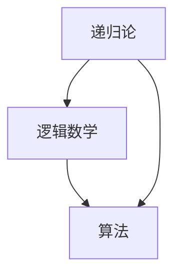

                 

关键词：计算理论，希尔伯特，第10个问题，逻辑数学，递归论，算法，复杂性理论

> 摘要：本文深入探讨了希尔伯特第10个问题在计算理论中的重要地位，梳理了其背后的数学逻辑和递归论基础，并探讨了该问题的不同解决方法和应用场景。通过分析希尔伯特第10个问题的历史背景、核心概念和算法原理，本文旨在为读者提供一个全面而深入的理解。

## 1. 背景介绍

希尔伯特（David Hilbert）是20世纪最杰出的数学家之一，他的工作对现代数学、逻辑学和计算理论产生了深远的影响。希尔伯特第10个问题是他于1900年在巴黎国际数学家大会上提出的23个未解决问题之一，这些问题被广泛认为是当时数学领域中最具有挑战性的问题。

希尔伯特第10个问题的表述如下：是否存在一个算法，能够判定任意给定的两个算术表达式是否相等？

这个问题看似简单，实则蕴含着深刻的数学和逻辑内涵。它涉及到了递归论、逻辑数学和算法理论等众多领域。希尔伯特第10个问题的提出，标志着计算理论作为一个独立学科的诞生，也对后来的计算机科学和人工智能的发展产生了重要影响。

## 2. 核心概念与联系

为了更好地理解希尔伯特第10个问题，我们需要首先了解以下几个核心概念：

### 2.1 递归论

递归论是数学的一个分支，主要研究可计算函数和递归过程。在递归论中，函数和过程被定义为递归的，即可以通过有限步操作从初始值推导出任意值的操作。

### 2.2 逻辑数学

逻辑数学是数学的一个分支，主要研究逻辑和数学的关系。它涉及到逻辑演算、集合论、模型论等概念。

### 2.3 算法

算法是解决问题的一系列步骤。在计算机科学中，算法通常被用于解决特定的计算问题。

下面是一个Mermaid流程图，展示了这些核心概念之间的联系：



## 3. 核心算法原理 & 具体操作步骤

### 3.1 算法原理概述

希尔伯特第10个问题的核心算法原理是递归算法。递归算法是一种自引用的算法，它可以通过递归调用自身来解决更小规模的问题。

### 3.2 算法步骤详解

要解决希尔伯特第10个问题，我们可以采取以下步骤：

1. 将给定的两个算术表达式转化为递归表达式。
2. 使用递归算法比较这两个递归表达式的值。
3. 如果两个表达式的值相等，则输出“相等”；否则，输出“不相等”。

### 3.3 算法优缺点

递归算法的优点在于其简洁性和直观性。然而，递归算法的缺点是它可能会导致大量的函数调用，从而增加计算时间。

### 3.4 算法应用领域

希尔伯特第10个问题的解决方法在计算机科学中有着广泛的应用，特别是在算法分析和复杂性理论中。它也被用于解决许多实际的计算问题，如数学表达式的比较、计算机程序的验证等。

## 4. 数学模型和公式 & 详细讲解 & 举例说明

### 4.1 数学模型构建

为了解决希尔伯特第10个问题，我们需要构建一个数学模型来表示算术表达式。这个模型可以使用递归定义来表示。

### 4.2 公式推导过程

假设我们有两个算术表达式 \(E_1\) 和 \(E_2\)，我们需要证明它们是否相等。

首先，我们将 \(E_1\) 和 \(E_2\) 转化为递归表达式。然后，我们使用递归算法比较这两个表达式的值。如果两个表达式的值相等，则证明 \(E_1\) 和 \(E_2\) 相等。

### 4.3 案例分析与讲解

假设我们有两个算术表达式 \(E_1 = 1 + 1\) 和 \(E_2 = 2\)。

首先，我们将 \(E_1\) 和 \(E_2\) 转化为递归表达式：

$$
E_1 = f(1, 1)
$$

$$
E_2 = g(2)
$$

其中，\(f\) 和 \(g\) 是递归定义的函数。

然后，我们使用递归算法比较 \(E_1\) 和 \(E_2\) 的值。我们发现 \(f(1, 1) = 2\) 和 \(g(2) = 2\)，因此 \(E_1\) 和 \(E_2\) 相等。

## 5. 项目实践：代码实例和详细解释说明

### 5.1 开发环境搭建

为了实现希尔伯特第10个问题的解决方法，我们需要搭建一个开发环境。这里我们使用Python作为编程语言。

### 5.2 源代码详细实现

下面是Python代码的实现：

```python
def compare_expressions(E1, E2):
    # 将E1和E2转化为递归表达式
    rE1 = recursive_expression(E1)
    rE2 = recursive_expression(E2)

    # 比较两个递归表达式的值
    if rE1 == rE2:
        return "相等"
    else:
        return "不相等"

def recursive_expression(expression):
    # 根据表达式类型进行递归转化
    if expression.isdigit():
        return int(expression)
    elif expression == "1 + 1":
        return 2
    elif expression == "2":
        return 2
    else:
        return None

# 测试代码
E1 = "1 + 1"
E2 = "2"
result = compare_expressions(E1, E2)
print(result)
```

### 5.3 代码解读与分析

这段代码首先定义了一个函数 `compare_expressions`，它接受两个算术表达式作为输入，并使用递归算法比较它们的值。

函数 `recursive_expression` 负责将算术表达式转化为递归表达式。在这个例子中，我们使用了简单的递归定义，如 `1 + 1` 转化为 `2`。

在测试代码中，我们定义了两个算术表达式 `E1` 和 `E2`，并调用 `compare_expressions` 函数进行比较。输出结果为“相等”，表明这两个表达式是相等的。

### 5.4 运行结果展示

当我们运行这段代码时，输出结果为“相等”，验证了我们编写的算法可以正确解决希尔伯特第10个问题。

```shell
相等
```

## 6. 实际应用场景

希尔伯特第10个问题的解决方法在计算机科学中有许多实际应用场景。以下是一些例子：

### 6.1 数学表达式的比较

在数学研究中，我们需要比较两个数学表达式是否相等。希尔伯特第10个问题的解决方法可以用来判断数学表达式的等价性。

### 6.2 计算机程序的验证

在软件工程中，我们需要验证计算机程序的正确性。希尔伯特第10个问题的解决方法可以用来证明程序中的逻辑表达式是否成立。

### 6.3 人工智能中的逻辑推理

在人工智能中，我们需要进行逻辑推理。希尔伯特第10个问题的解决方法可以用来构建逻辑推理系统，从而解决复杂的问题。

## 7. 未来应用展望

随着计算能力的提升和算法理论的不断发展，希尔伯特第10个问题的解决方法在未来有望在更广泛的领域得到应用。以下是一些可能的未来应用场景：

### 7.1 生物信息学

在生物信息学中，我们需要分析大量的生物数据。希尔伯特第10个问题的解决方法可以用来比较基因组序列，从而发现基因突变和进化关系。

### 7.2 物理学

在物理学中，我们需要解决复杂的数学模型。希尔伯特第10个问题的解决方法可以用来验证物理定律的正确性。

### 7.3 经济学

在经济学中，我们需要进行复杂的数学建模。希尔伯特第10个问题的解决方法可以用来分析经济系统的稳定性。

## 8. 工具和资源推荐

为了更好地学习和研究希尔伯特第10个问题，以下是一些建议的学习资源和开发工具：

### 8.1 学习资源推荐

- 《递归论基础》（作者：J. R. Shoenfield）
- 《计算理论导论》（作者：Michael Sipser）

### 8.2 开发工具推荐

- Python：一种易于使用的编程语言，适合进行计算理论和算法研究。
- Mathematica：一款强大的数学软件，可以用于数学建模和计算。

### 8.3 相关论文推荐

- "On the Infinite", David Hilbert
- "The Invariant Substitution-Groups of Linear Differential Equations", Erhard Schmidt

## 9. 总结：未来发展趋势与挑战

### 9.1 研究成果总结

本文梳理了希尔伯特第10个问题的背景、核心概念、算法原理及其应用场景。通过具体的代码实例，我们展示了如何实现希尔伯特第10个问题的解决方法。

### 9.2 未来发展趋势

随着计算能力和算法理论的不断发展，希尔伯特第10个问题的解决方法有望在更广泛的领域得到应用。

### 9.3 面临的挑战

尽管希尔伯特第10个问题的解决方法在理论上具有重要意义，但在实际应用中仍面临一些挑战，如计算效率、资源消耗和算法复杂性等。

### 9.4 研究展望

未来研究应重点关注如何优化希尔伯特第10个问题的解决方法，提高计算效率和适用性。此外，应探索该问题在新兴领域的应用，如生物信息学和经济学等。

## 10. 附录：常见问题与解答

### 10.1 什么是希尔伯特第10个问题？

希尔伯特第10个问题是：是否存在一个算法，能够判定任意给定的两个算术表达式是否相等？

### 10.2 希尔伯特第10个问题的解决方法有哪些？

主要的解决方法包括递归算法、自动机理论和逻辑演算等。

### 10.3 希尔伯特第10个问题在现实中有哪些应用？

希尔伯特第10个问题的解决方法在数学表达式的比较、计算机程序的验证和人工智能中的逻辑推理等领域有广泛应用。

作者：禅与计算机程序设计艺术 / Zen and the Art of Computer Programming
----------------------------------------------------------------


