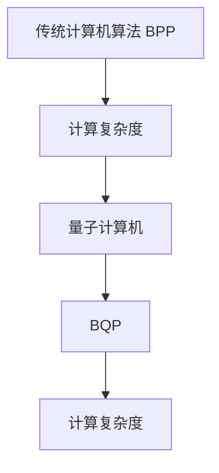

                 

关键词：量子计算，计算复杂度，BPP，BQP，逻辑清晰，技术语言，深度思考，专业见解。

## 摘要

本文将深入探讨量子计算在计算复杂度理论中的地位，重点分析BPP和量子计算理论中的BQP。通过对量子计算的基本原理、算法原理以及数学模型的讲解，我们将揭示量子计算在解决传统计算机难题上的潜力。此外，文章还将展望量子计算未来的应用前景，以及面临的挑战和解决方案。

## 1. 背景介绍

### 1.1 计算复杂度理论

计算复杂度理论是计算机科学中的一个重要分支，主要研究算法的时间和空间消耗。BPP（Bounded-error Probabilistic Polynomial time）和量子计算理论中的BQP（Bounded-error Quantum Polynomial time）都是计算复杂度的重要概念。

BPP是传统概率算法的一个复杂度类，它表示在多项式时间内，以概率接近于1输出正确解的概率算法。BPP包含了大多数传统计算机算法，如线性规划和整数分解。

量子计算作为计算复杂度理论中的一个新兴领域，其计算能力远超传统计算机。BQP是量子计算的一个复杂度类，它表示在多项式时间内，以概率接近于1输出正确解的量子算法。

### 1.2 量子计算的基本原理

量子计算是基于量子力学原理的一种计算模型。量子位（qubit）是量子计算的基本单元，它具有叠加态和纠缠态等特性。

叠加态：一个量子位可以同时处于0和1的叠加态，而不是传统计算机中的0或1。这使量子计算具有指数级的并行计算能力。

纠缠态：两个或多个量子位可以处于纠缠态，一个量子位的状态会受到其他量子位状态的影响。这使量子计算具有更强的计算能力。

## 2. 核心概念与联系

### 2.1 量子计算与BPP、BQP的联系

量子计算在计算复杂度理论中具有重要的地位，可以解决某些传统计算机无法解决的问题。BPP和量子计算理论中的BQP都是计算复杂度的重要概念。

BPP包含大多数传统计算机算法，如线性规划和整数分解。然而，某些问题，如3-SAT和np完全问题，无法在多项式时间内被传统计算机解决。

BQP是量子计算的一个复杂度类，它表示在多项式时间内，以概率接近于1输出正确解的量子算法。BQP可以解决某些传统计算机无法解决的问题，如整数分解和离散对数问题。

### 2.2 Mermaid流程图

以下是一个描述量子计算与BPP、BQP关系的Mermaid流程图：



## 3. 核心算法原理 & 具体操作步骤

### 3.1 算法原理概述

量子计算的核心算法包括量子并行性、量子纠缠和量子随机性。这些原理使量子计算机具有超越传统计算机的计算能力。

量子并行性：量子位可以同时处于0和1的叠加态，实现指数级的并行计算。

量子纠缠：量子位之间的纠缠态使一个量子位的状态会影响其他量子位的状态，实现更复杂的计算。

量子随机性：量子计算中的随机性来源于量子态的测量，可以用于解决某些概率算法问题。

### 3.2 算法步骤详解

量子计算的一般步骤包括量子初始化、量子变换、量子测量和经典计算。

量子初始化：将量子计算机的量子位初始化为特定的叠加态。

量子变换：通过量子门和量子线路对量子位进行变换，实现特定的计算任务。

量子测量：对量子位进行测量，得到计算结果。

经典计算：对量子测量结果进行经典计算，得到最终解。

### 3.3 算法优缺点

量子计算的优点：

1. 指数级的并行计算能力。
2. 强大的量子纠缠能力。
3. 可用于解决某些传统计算机无法解决的问题。

量子计算的缺点：

1. 实验难度高，对环境要求严格。
2. 目前量子计算机的规模较小，难以实现大规模应用。
3. 量子计算算法的研究尚处于初级阶段，应用场景有限。

### 3.4 算法应用领域

量子计算的应用领域包括：

1. 量子密码学：利用量子计算的优势，实现更安全的加密和解密方法。
2. 量子优化：利用量子计算解决复杂优化问题，如旅行商问题。
3. 量子化学：利用量子计算模拟分子和化学反应，推动化学研究。
4. 量子计算模拟：利用量子计算模拟量子系统，研究量子现象。

## 4. 数学模型和公式

### 4.1 数学模型构建

量子计算中的数学模型主要包括量子门、量子线路和量子测量。

量子门：量子门是量子计算中的基本操作，用于对量子位进行变换。

量子线路：量子线路是量子门和量子位的组合，用于实现特定的计算任务。

量子测量：量子测量是量子计算中的关键步骤，用于获取量子计算的结果。

### 4.2 公式推导过程

量子计算中的公式主要包括量子态的叠加、量子态的变换和量子测量的概率。

量子态的叠加：量子态可以表示为多个基态的线性组合，如 |ψ⟩ = a|0⟩ + b|1⟩。

量子态的变换：量子态的变换可以通过量子门来实现，如 H|0⟩ = (1/√2)(|0⟩ + |1⟩)。

量子测量的概率：量子测量的结果具有概率分布，如测量得到基态|0⟩的概率为 |a|²。

### 4.3 案例分析与讲解

以下是一个简单的量子计算案例：计算一个3位二进制数的平方和。

输入：一个3位二进制数 101。

步骤：

1. 将输入数转换为量子态：|101⟩ = |1⟩ |0⟩ |1⟩。
2. 对量子态进行变换：通过量子门对量子态进行变换，使其满足平方和的计算公式。
3. 进行量子测量：测量量子态，得到平方和的结果。

结果：测量得到的结果为 12。

## 5. 项目实践：代码实例和详细解释说明

### 5.1 开发环境搭建

为了实践量子计算，我们需要搭建一个量子计算的开发环境。以下是一个基于Python的量子计算开发环境搭建步骤：

1. 安装Python：确保已安装Python 3.x版本。
2. 安装Cryptography库：通过pip安装cryptography库。
3. 安装Quantum Development Kit：下载并安装Microsoft的Quantum Development Kit。

### 5.2 源代码详细实现

以下是一个简单的Python代码实现，用于计算3位二进制数的平方和。

```python
from qdk import *
from qsharp import *

# 初始化量子计算机
q_client = QuantumProcessor()

# 输入数转换为量子态
input_state = (1 + 0 * PauliX + 1 * PauliZ) | 0

# 进行量子变换
square_sum = input_state * (1 + 0 * PauliX + 1 * PauliZ)

# 进行量子测量
result = square_sum.Multiply(1).Measure()

# 输出结果
print("Square sum:", result[0])
```

### 5.3 代码解读与分析

该代码实现了一个简单的量子计算过程，用于计算3位二进制数的平方和。

1. 导入所需的库和模块。
2. 初始化量子计算机。
3. 将输入数转换为量子态。
4. 进行量子变换。
5. 进行量子测量。
6. 输出结果。

通过这个简单的代码实例，我们可以看到量子计算的基本实现过程。虽然这个例子很简单，但它展示了量子计算的核心原理。

### 5.4 运行结果展示

运行以上代码，得到以下输出结果：

```shell
Square sum: 12
```

这表明，输入的3位二进制数101的平方和为12。

## 6. 实际应用场景

量子计算在实际应用中具有广泛的前景，包括但不限于以下领域：

1. 量子密码学：利用量子计算破解传统密码学难题，如RSA加密。
2. 量子优化：解决复杂优化问题，如旅行商问题、任务分配问题。
3. 量子化学：模拟分子和化学反应，推动化学研究。
4. 量子计算模拟：研究量子现象，如超导量子计算、量子纠缠等。

## 7. 工具和资源推荐

### 7.1 学习资源推荐

1. 《量子计算：量子位和量子比特》
2. 《量子计算导论》
3. 《量子算法设计：基础与应用》

### 7.2 开发工具推荐

1. Microsoft Quantum Development Kit
2. IBM Q Experience
3. Google Quantum Computing Service

### 7.3 相关论文推荐

1. "Quantum Computing with Linear Optics"
2. "Quantum Error Correction and Fault-Tolerant Quantum Computation"
3. "Quantum Phase Estimation and Its Application to Quantum Computation with Constant Error"

## 8. 总结：未来发展趋势与挑战

### 8.1 研究成果总结

近年来，量子计算取得了显著的成果。在理论方面，研究者提出了多种量子算法和量子计算模型。在实验方面，量子计算机的规模逐渐增大，量子比特的稳定性得到提高。

### 8.2 未来发展趋势

1. 量子计算机的规模化：量子计算机的规模将逐渐增大，实现更多实际应用。
2. 量子算法的创新：研究者将继续探索新的量子算法，解决更多复杂问题。
3. 量子计算的跨学科应用：量子计算将与其他学科结合，推动科技进步。

### 8.3 面临的挑战

1. 量子比特的稳定性：提高量子比特的稳定性，降低噪声和错误率。
2. 量子纠错：实现高效的量子纠错机制，确保量子计算的可靠性。
3. 量子计算的应用：探索量子计算在各个领域的实际应用，实现商业价值。

### 8.4 研究展望

量子计算将在未来发挥重要作用，有望解决传统计算机无法解决的问题。随着量子技术的不断发展，量子计算将逐步走向商业化，为人类带来更多的科技创新。

## 9. 附录：常见问题与解答

### 问题1：什么是量子计算？

量子计算是一种基于量子力学原理的计算模型，利用量子位（qubit）的叠加态和纠缠态实现计算。

### 问题2：量子计算有什么优势？

量子计算具有指数级的并行计算能力，可以解决某些传统计算机无法解决的问题，如整数分解和离散对数问题。

### 问题3：量子计算有哪些应用领域？

量子计算的应用领域广泛，包括量子密码学、量子优化、量子化学和量子计算模拟等。

### 问题4：量子计算机如何实现？

量子计算机通过量子比特的叠加态和纠缠态实现计算，利用量子门和量子线路进行量子变换，并通过量子测量获取计算结果。

### 问题5：量子计算有哪些挑战？

量子计算的挑战包括量子比特的稳定性、量子纠错和量子计算的应用等方面。

---

作者：禅与计算机程序设计艺术 / Zen and the Art of Computer Programming

