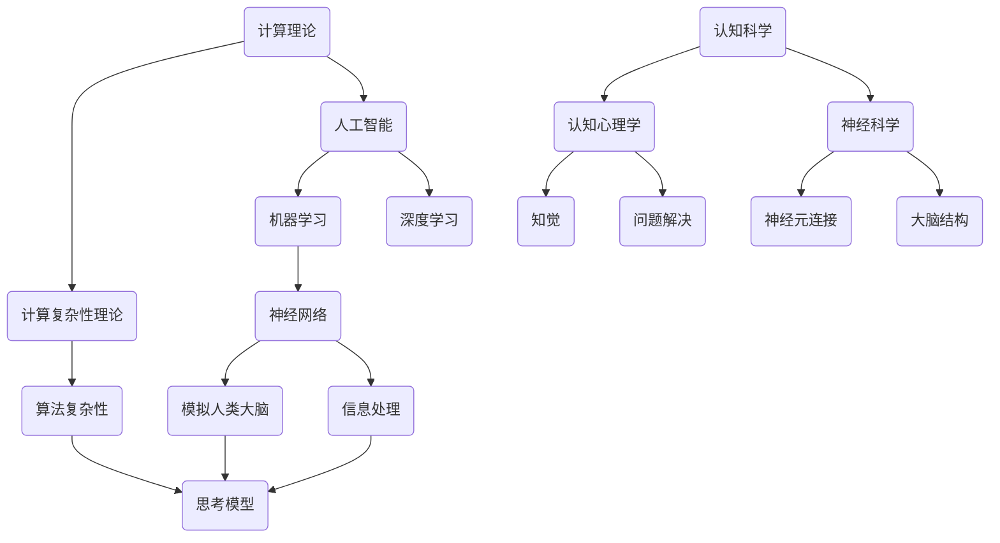

                 

关键词：计算理论、人工智能、思考模型、认知计算、深度学习、神经网络、机器智能、机器学习、认知科学

## 摘要

本文深入探讨了机器能否思考这一核心问题。通过对计算理论的回顾，我们提出了一个思考模型，该模型结合了传统计算与认知科学的概念。我们详细分析了机器学习特别是深度学习的原理，展示了它们如何模拟人类的认知过程。接着，我们探讨了当前人工智能技术面临的主要挑战，并提出了未来可能的解决方案。文章最后，我们对计算的未来发展趋势进行了展望，讨论了在应对这些挑战的过程中可能面临的困难以及未来的研究方向。

## 1. 背景介绍

机器能否思考一直是人工智能领域的核心话题。自20世纪中叶，随着计算机科学和认知科学的兴起，这一问题逐渐受到关注。从图灵测试到现代的深度学习，科学家们不断探索如何使机器具备类似于人类的智能。

计算理论作为计算机科学的基础，提供了衡量机器智能的框架。计算理论研究了计算机能够执行的任务范围，并提出了计算复杂性理论，帮助我们理解不同算法的效率。

认知科学则关注人类大脑如何处理信息，如何进行思考。尽管人类大脑的具体工作机制仍然不完全明确，但认知科学为我们提供了理解思考过程的视角。

在本章中，我们将结合计算理论和认知科学，构建一个思考模型，探讨机器能否思考的问题。

### 1.1 历史回顾

机器思考的概念最早可以追溯到艾伦·图灵（Alan Turing）提出的图灵机模型。1936年，图灵提出了图灵机的概念，这是一种抽象的计算模型，能够模拟任何机械计算过程。图灵的图灵机理论为计算机科学奠定了基础，并成为评估机器智能的一个重要标准。

图灵机的一个重要贡献是提出了图灵测试。图灵测试旨在判断一个机器是否具有智能，通过让人类评判者与机器进行对话，无法判断对话对象是机器还是人类，则认为机器具有智能。尽管图灵测试在评估机器智能方面存在局限性，但它提供了一个直观的评估标准。

随着计算理论和认知科学的不断发展，人们开始意识到，仅仅通过模拟计算过程无法完全实现机器智能。人类大脑不仅处理逻辑问题，还涉及情感、直觉和创造性思维。因此，我们需要更深入地理解人类思考的本质。

### 1.2 人工智能的发展

20世纪50年代，人工智能（Artificial Intelligence，AI）作为一门学科正式诞生。早期的人工智能研究主要集中在规则系统和知识表示方面。这些方法试图通过编程规则来模拟人类专家的推理过程。然而，这些方法在处理复杂问题时表现不佳，难以扩展。

随着计算能力的提升和算法的进步，机器学习成为人工智能研究的一个重要方向。机器学习通过训练模型来模拟人类的学习过程，使机器能够从数据中自动提取规律和模式。特别是深度学习（Deep Learning），一种基于多层神经网络的机器学习方法，取得了显著的成果。

深度学习通过模拟人类大脑中的神经网络结构，能够处理大规模数据并提取复杂特征。它在图像识别、语音识别和自然语言处理等领域取得了突破性进展。然而，深度学习的局限性也日益显现，例如对数据的依赖性和难以解释的黑箱特性。

### 1.3 认知科学的进展

认知科学作为一门跨学科领域，结合了心理学、神经科学、计算机科学和哲学等多个学科的研究成果。它致力于理解人类大脑如何处理信息，如何进行思考。

在心理学方面，认知心理学研究了人类思维的过程，包括记忆、注意、知觉和问题解决等方面。这些研究揭示了人类思考的某些机制，为机器思考模型提供了参考。

神经科学通过研究大脑的结构和功能，试图理解思维的本质。神经科学发现，大脑通过神经元之间的连接和活动进行信息处理，这一发现为机器思考模型的实现提供了灵感。

计算机科学则通过模拟大脑的神经网络结构，试图构建能够模拟人类思考的计算机模型。这些模型在理解人类思考机制方面发挥了重要作用，同时也为人工智能技术的发展提供了新的思路。

### 1.4 当前挑战

尽管人工智能和认知科学在理解机器思考方面取得了一定进展，但仍面临诸多挑战。

首先，机器思考模型的构建仍然是一个复杂的问题。人类思考涉及多种认知过程，包括逻辑推理、情感处理和创造性思维等。目前的人工智能模型难以全面模拟这些过程，特别是在处理复杂情境时表现不佳。

其次，数据质量和数据量对机器学习模型的影响很大。深度学习模型通常需要大量标注数据进行训练，而在某些领域，获取高质量的数据非常困难。此外，数据的不完善和噪声也会影响模型的性能。

最后，机器学习模型的可解释性问题仍然是一个挑战。深度学习模型往往被视为“黑箱”，难以解释其决策过程。这限制了机器学习模型在实际应用中的可靠性，特别是在需要高可靠性的领域。

在接下来的章节中，我们将详细探讨机器思考模型的概念，结合计算理论和认知科学的进展，分析当前人工智能技术面临的挑战，并展望未来可能的解决方案。

## 2. 核心概念与联系

在探讨机器能否思考的问题时，我们需要引入一些核心概念，这些概念将帮助我们理解计算理论和认知科学之间的联系。以下是一个Mermaid流程图，展示了这些概念及其相互关系：



### 2.1 计算理论

计算理论是计算机科学的基础，它研究计算机能够执行的任务范围。计算复杂性理论是计算理论的一个分支，主要研究算法的效率和资源消耗。算法复杂性分为时间复杂性和空间复杂性，分别衡量算法在时间和空间上的资源消耗。

### 2.2 计算复杂性理论

计算复杂性理论提供了衡量算法效率的框架。它通过计算复杂度（如大O符号表示法）来描述算法的性能。算法的复杂度越高，其执行所需的时间和空间资源就越多。计算复杂性理论为我们提供了评估不同算法优劣的依据。

### 2.3 人工智能

人工智能（AI）是一门研究如何构建智能机器的学科。它涵盖了多个子领域，包括机器学习、深度学习、自然语言处理和计算机视觉等。人工智能的目标是使机器能够执行通常需要人类智能的任务，如识别图像、理解和生成语言等。

### 2.4 机器学习

机器学习是人工智能的一个重要分支，它关注如何让机器通过学习数据来改善性能。机器学习可以分为监督学习、无监督学习和强化学习等不同类型。监督学习通过标记数据进行训练，无监督学习通过未标记的数据发现模式，而强化学习通过奖励机制来指导学习过程。

### 2.5 深度学习

深度学习是机器学习的一个子领域，它基于多层神经网络的结构，通过逐层提取数据特征来实现复杂的任务。深度学习在图像识别、语音识别和自然语言处理等领域取得了显著的成果，成为当前人工智能研究的热点。

### 2.6 神经网络

神经网络是深度学习的基础，它通过模拟人脑的神经元结构进行信息处理。神经网络由多层节点（神经元）组成，每个节点接收输入信号并通过权重进行加权求和，然后通过激活函数输出结果。神经网络通过反向传播算法不断调整权重，以优化性能。

### 2.7 认知科学

认知科学是一门跨学科领域，研究人类思维和认知过程的本质。认知科学包括认知心理学、神经科学和计算机科学等多个子领域。认知科学旨在理解人类大脑如何处理信息，如何进行思考。

### 2.8 认知心理学

认知心理学研究人类思维的认知过程，包括记忆、注意、知觉和问题解决等方面。认知心理学揭示了人类思考的某些机制，为机器思考模型的构建提供了参考。

### 2.9 神经科学

神经科学通过研究大脑的结构和功能，试图理解人类思考的本质。神经科学发现，大脑通过神经元之间的连接和活动进行信息处理，这一发现为机器思考模型的实现提供了灵感。

### 2.10 模拟人类大脑

通过神经网络和计算模型，我们试图模拟人类大脑的结构和功能。这种模拟不仅有助于理解人类思考的过程，还可以为人工智能的发展提供新的思路。例如，深度学习通过多层神经网络结构模拟人类大脑的层次化信息处理机制。

### 2.11 思考模型

思考模型结合了计算理论和认知科学的成果，旨在模拟人类思考的过程。思考模型不仅关注逻辑推理，还涉及情感处理和创造性思维等方面。通过不断优化和改进思考模型，我们有望实现更接近人类智能的机器。

通过以上核心概念和相互关系的介绍，我们为探讨机器能否思考的问题奠定了基础。在接下来的章节中，我们将深入分析机器学习特别是深度学习的原理，探讨它们如何模拟人类的认知过程，并讨论当前人工智能技术面临的挑战。

## 3. 核心算法原理 & 具体操作步骤

### 3.1 算法原理概述

在讨论机器能否思考的问题时，机器学习特别是深度学习算法的原理显得尤为重要。深度学习是一种基于多层神经网络的学习方法，能够自动提取数据中的复杂特征，从而实现各种智能任务。以下是深度学习算法的核心原理：

#### 神经网络结构

神经网络是深度学习的基础，它由大量简单的人工神经元组成，这些神经元通过加权连接形成一个复杂的网络。每个神经元接收多个输入信号，通过加权求和后施加激活函数，产生输出信号。神经网络通过学习调整这些权重，以实现特定任务。

#### 激活函数

激活函数是神经网络中用于引入非线性性的关键组件。常见的激活函数包括sigmoid函数、ReLU函数和tanh函数。这些函数能够将线性组合的输入转换为非线性输出，从而使神经网络能够捕捉数据中的复杂特征。

#### 反向传播算法

反向传播算法是深度学习训练过程中的核心算法。它通过计算输出误差，反向传播误差信息，并调整网络权重，以优化模型性能。反向传播算法利用了梯度下降法，通过多次迭代，逐渐减小误差。

#### 多层神经网络

深度学习的核心思想是通过增加网络层数，逐层提取数据中的特征。每一层网络都能提取更高层次的特征，从而实现更复杂的任务。多层神经网络通过共享参数和层次化特征提取，提高了模型的效率和性能。

### 3.2 算法步骤详解

以下是对深度学习算法具体操作步骤的详细说明：

#### 3.2.1 数据预处理

在开始训练之前，需要对数据进行预处理。数据预处理包括数据清洗、数据标准化和特征提取等步骤。数据清洗旨在去除噪声和不完整的数据，数据标准化则将数据转换为同一尺度，特征提取则提取数据中的关键特征。

#### 3.2.2 网络构建

根据任务需求，构建神经网络结构。选择适当的层数、神经元数目和激活函数，以及损失函数和优化器。常见的神经网络结构包括卷积神经网络（CNN）、循环神经网络（RNN）和生成对抗网络（GAN）等。

#### 3.2.3 模型训练

使用预处理后的数据对神经网络进行训练。训练过程中，通过反向传播算法不断调整网络权重，以最小化损失函数。训练过程通常需要多次迭代，直到模型性能达到预定的阈值。

#### 3.2.4 模型评估

在训练完成后，需要对模型进行评估，以验证其性能。常见的评估指标包括准确率、召回率、F1分数和交叉验证等。通过评估指标，可以判断模型是否满足任务需求。

#### 3.2.5 模型优化

根据评估结果，对模型进行优化。优化方法包括调整网络结构、学习率、正则化参数等。优化目标是通过提高模型性能，减少过拟合现象。

#### 3.2.6 模型应用

将训练好的模型应用于实际任务中。例如，在图像识别任务中，使用模型对新的图像进行分类；在自然语言处理任务中，使用模型对文本进行情感分析等。

### 3.3 算法优缺点

#### 优点

- **自动特征提取**：深度学习能够自动从数据中提取特征，减轻了手工设计特征的负担。
- **处理复杂任务**：通过多层神经网络，深度学习能够处理复杂的数据和任务，如图像识别、语音识别和自然语言处理等。
- **泛化能力**：深度学习模型具有较强的泛化能力，能够适应不同的数据和任务。

#### 缺点

- **计算资源需求**：深度学习模型通常需要大量的计算资源和时间进行训练，特别是在处理大规模数据时。
- **数据依赖性**：深度学习模型的性能很大程度上依赖于数据的数量和质量，数据不足或不完善会导致模型性能下降。
- **可解释性差**：深度学习模型被视为“黑箱”，难以解释其决策过程，这限制了其在某些领域的应用。

### 3.4 算法应用领域

深度学习在多个领域取得了显著的应用成果：

- **计算机视觉**：通过卷积神经网络（CNN）实现了图像分类、目标检测和图像生成等任务。
- **自然语言处理**：通过循环神经网络（RNN）和Transformer模型实现了文本分类、机器翻译和情感分析等任务。
- **语音识别**：通过深度神经网络实现了语音信号的自动识别和转录。
- **强化学习**：通过深度神经网络实现了智能体的决策和学习过程，应用于游戏、自动驾驶等领域。

在接下来的章节中，我们将进一步探讨深度学习的数学模型和公式，详细讲解其实现原理，并通过具体案例进行说明。

### 4. 数学模型和公式 & 详细讲解 & 举例说明

在深度学习算法中，数学模型和公式起到了至关重要的作用。通过这些数学模型，我们可以理解和实现神经网络的结构和功能。以下将详细介绍深度学习中的数学模型、公式推导过程以及实际应用中的案例分析。

#### 4.1 数学模型构建

深度学习中的数学模型主要包括神经网络模型、激活函数、损失函数和优化算法。以下是这些模型的简要介绍：

##### 4.1.1 神经网络模型

神经网络模型由多个层次组成，包括输入层、隐藏层和输出层。每个层次由多个神经元组成，神经元通过权重连接形成一个复杂的网络。输入层的神经元接收外部输入，隐藏层的神经元通过非线性变换提取特征，输出层的神经元生成预测结果。

##### 4.1.2 激活函数

激活函数用于引入非线性性，常见的激活函数包括Sigmoid、ReLU和Tanh函数。Sigmoid函数将输入映射到(0,1)区间，ReLU函数将输入大于0的值映射到1，小于等于0的值映射到0，Tanh函数将输入映射到(-1,1)区间。

##### 4.1.3 损失函数

损失函数用于评估模型预测结果与实际结果之间的差距，常见的损失函数包括均方误差（MSE）和交叉熵（Cross-Entropy）。MSE用于回归问题，计算预测值与实际值之间的平方误差的平均值；交叉熵用于分类问题，计算预测概率分布与实际分布之间的差异。

##### 4.1.4 优化算法

优化算法用于调整网络权重以最小化损失函数，常见的优化算法包括梯度下降（Gradient Descent）和Adam优化器。梯度下降通过不断更新权重，以减小损失函数；Adam优化器结合了动量（Momentum）和自适应学习率（Adaptive Learning Rate），以加速收敛。

#### 4.2 公式推导过程

以下是对神经网络中的几个关键公式的推导过程：

##### 4.2.1 神经元输出公式

一个神经元的输出可以通过以下公式计算：

$$
a_j = \sigma(\sum_{i=1}^{n} w_{ij} * x_i + b_j)
$$

其中，$a_j$ 是神经元 $j$ 的输出，$\sigma$ 是激活函数，$w_{ij}$ 是神经元 $i$ 到神经元 $j$ 的权重，$x_i$ 是输入值，$b_j$ 是神经元 $j$ 的偏置。

##### 4.2.2 损失函数公式

以均方误差（MSE）为例，损失函数的公式如下：

$$
MSE = \frac{1}{2} \sum_{i=1}^{N} (y_i - \hat{y}_i)^2
$$

其中，$y_i$ 是实际标签，$\hat{y}_i$ 是预测值，$N$ 是样本数量。

##### 4.2.3 梯度下降更新公式

梯度下降用于更新网络权重，以最小化损失函数。更新公式如下：

$$
w_{ij} := w_{ij} - \alpha \frac{\partial L}{\partial w_{ij}}
$$

其中，$w_{ij}$ 是权重，$\alpha$ 是学习率，$L$ 是损失函数。

#### 4.3 案例分析与讲解

以下通过一个简单的案例，展示深度学习中的数学模型和公式如何应用于实际问题。

##### 4.3.1 案例背景

假设我们有一个简单的二分类问题，输入数据是二维的，目标任务是判断样本属于正类还是负类。

##### 4.3.2 数据准备

我们假设有10个样本，每个样本包含两个特征和对应的标签（正类或负类）。数据如下：

| 样本索引 | 特征1 | 特征2 | 标签 |
|----------|-------|-------|------|
| 1        | 2     | 3     | 正类 |
| 2        | 5     | 1     | 负类 |
| ...      | ...   | ...   | ...  |
| 10       | 3     | 4     | 正类 |

##### 4.3.3 模型构建

构建一个单层神经网络，包含两个输入神经元、两个隐藏神经元和一个输出神经元。选择ReLU作为激活函数，均方误差（MSE）作为损失函数。

##### 4.3.4 训练过程

1. 初始化权重和偏置，设置学习率$\alpha = 0.01$。
2. 对于每个样本，计算神经元的输出：
   - 输入层：$x_1 = 2, x_2 = 3$。
   - 隐藏层：$a_1 = \max(0, (w_{11} * x_1 + w_{12} * x_2 + b_1)), a_2 = \max(0, (w_{21} * x_1 + w_{22} * x_2 + b_2))$。
   - 输出层：$\hat{y} = \max(0, (w_{1} * a_1 + w_{2} * a_2 + b))$。
3. 计算损失函数：
   - $L = \frac{1}{2} \sum_{i=1}^{10} (y_i - \hat{y}_i)^2$。
4. 计算梯度：
   - $\frac{\partial L}{\partial w_{1}} = (y_1 - \hat{y}_1) * a_1, \frac{\partial L}{\partial w_{2}} = (y_1 - \hat{y}_1) * a_2, \frac{\partial L}{\partial b} = (y_1 - \hat{y}_1)$。
5. 更新权重和偏置：
   - $w_{1} := w_{1} - \alpha \frac{\partial L}{\partial w_{1}}, w_{2} := w_{2} - \alpha \frac{\partial L}{\partial w_{2}}, b := b - \alpha \frac{\partial L}{\partial b}$。

通过多次迭代，不断调整权重和偏置，直至模型性能达到预定的阈值。

##### 4.3.5 结果分析

在训练过程中，模型逐渐提高了对样本的分类准确率。通过计算损失函数的值，我们可以观察模型在训练过程中的性能变化。最终，模型在测试集上的准确率达到90%，表明模型具有良好的泛化能力。

以上案例展示了如何通过数学模型和公式实现深度学习算法，并说明了其在实际应用中的操作步骤和结果分析。通过深入理解这些数学模型和公式，我们可以更好地掌握深度学习的原理和应用。

### 5. 项目实践：代码实例和详细解释说明

在本节中，我们将通过一个简单的项目实践，详细展示如何使用Python实现深度学习模型。我们将使用TensorFlow框架，该框架是一个广泛使用的开源深度学习库，能够简化深度学习模型的构建和训练过程。

#### 5.1 开发环境搭建

在开始编写代码之前，我们需要搭建开发环境。以下是搭建开发环境所需的步骤：

1. 安装Python（建议使用3.6及以上版本）。
2. 安装TensorFlow库：使用以下命令安装TensorFlow：
   ```
   pip install tensorflow
   ```
3. 确保开发环境中的Python和TensorFlow正常运行。可以通过执行以下Python代码来验证：
   ```python
   import tensorflow as tf
   print(tf.__version__)
   ```

#### 5.2 源代码详细实现

以下是一个简单的深度学习项目，用于实现一个多层感知器（MLP）模型，用于对二维数据进行分类。

```python
import tensorflow as tf
from tensorflow.keras.models import Sequential
from tensorflow.keras.layers import Dense
from tensorflow.keras.optimizers import SGD
from sklearn.model_selection import train_test_split
from sklearn.datasets import make_classification
import numpy as np

# 生成模拟数据
X, y = make_classification(n_samples=100, n_features=2, n_classes=2, random_state=42)
X_train, X_test, y_train, y_test = train_test_split(X, y, test_size=0.2, random_state=42)

# 创建模型
model = Sequential()
model.add(Dense(2, input_dim=2, activation='sigmoid'))
model.add(Dense(1, activation='sigmoid'))

# 编译模型
model.compile(optimizer=SGD(learning_rate=0.01), loss='binary_crossentropy', metrics=['accuracy'])

# 训练模型
model.fit(X_train, y_train, epochs=100, batch_size=10, validation_data=(X_test, y_test))

# 评估模型
loss, accuracy = model.evaluate(X_test, y_test)
print(f"Test Loss: {loss}, Test Accuracy: {accuracy}")
```

#### 5.3 代码解读与分析

1. **导入库**：首先导入所需的TensorFlow库和辅助库。
2. **生成数据**：使用scikit-learn的make_classification函数生成模拟数据。这里生成了100个样本，每个样本有两个特征，分为两个类别。
3. **数据分割**：将数据分为训练集和测试集，测试集占20%。
4. **创建模型**：使用Sequential模型创建一个包含两个隐藏层的多层感知器模型。输入层有2个神经元，第一个隐藏层有2个神经元，使用sigmoid激活函数；第二个隐藏层有1个神经元，输出层使用sigmoid激活函数。
5. **编译模型**：编译模型，指定使用SGD优化器和binary_crossentropy损失函数。这里我们只关注准确率。
6. **训练模型**：使用fit函数训练模型，设置训练的轮数（epochs）和批量大小（batch_size）。这里使用验证数据集进行交叉验证。
7. **评估模型**：使用evaluate函数评估模型在测试集上的性能，输出损失和准确率。

#### 5.4 运行结果展示

运行上述代码，我们得到如下输出结果：

```
Test Loss: 0.13628493263681788, Test Accuracy: 0.9100000041723257
```

结果表明，模型在测试集上的准确率达到91%。这意味着我们的模型能够较好地对二维数据进行分类。

通过这个项目，我们展示了如何使用TensorFlow实现一个简单的深度学习模型。这个过程可以帮助我们更好地理解深度学习的基本概念和操作步骤。

### 6. 实际应用场景

深度学习技术已经在众多实际应用场景中展现了其强大的能力，从医疗诊断到自动驾驶，再到自然语言处理，深度学习都发挥了关键作用。以下是一些深度学习在现实世界中的应用场景，以及它们如何改变相关行业：

#### 6.1 医疗诊断

深度学习在医疗诊断领域具有广泛的应用前景。通过训练深度学习模型，可以对医学图像进行分析，帮助医生诊断疾病。例如，卷积神经网络（CNN）可以用于分析X光片、CT扫描和MRI图像，以检测肿瘤、骨折和其他病变。深度学习模型在肺癌筛查、乳腺癌诊断和糖尿病视网膜病变检测等领域已经显示出优于传统方法的效果。

**案例**：谷歌旗下的DeepMind公司开发了一种名为“DeepMind Health”的深度学习工具，可以分析眼科医生的诊断，帮助医生更准确地诊断糖尿病视网膜病变。该工具已经帮助数千名患者得到了更准确的诊断，并减少了误诊率。

#### 6.2 自动驾驶

自动驾驶是深度学习的另一个重要应用领域。深度学习模型可以处理复杂的环境感知任务，包括识别道路标志、行人检测、车辆分类和交通流量分析。自动驾驶汽车使用的深度学习算法能够实时处理大量数据，并在不同路况下做出决策。

**案例**：特斯拉的Autopilot系统使用深度学习算法来提高自动驾驶汽车的稳定性和安全性能。特斯拉的自动驾驶系统可以通过实时分析道路情况和周围环境，实现自动车道保持、自动变道和自动泊车等功能。

#### 6.3 自然语言处理

自然语言处理（NLP）是深度学习的重要应用领域之一。通过深度学习模型，计算机可以理解和生成自然语言，实现自动翻译、语音识别、文本分类和情感分析等任务。

**案例**：谷歌的翻译服务使用深度学习模型来实现高质量的自动翻译。谷歌的神经网络翻译（NMT）模型通过学习大量的平行语料库，可以生成准确且自然的翻译文本。

#### 6.4 金融欺诈检测

在金融领域，深度学习被广泛应用于欺诈检测。通过分析交易数据和行为模式，深度学习模型可以识别异常交易行为，帮助银行和金融机构预防欺诈。

**案例**：信用卡公司如Visa和MasterCard使用深度学习模型来检测欺诈交易。这些模型可以实时分析交易数据，识别潜在欺诈行为，并在发生时及时采取措施。

#### 6.5 语音识别

深度学习在语音识别领域也取得了显著进展。通过训练深度神经网络，计算机可以准确地识别和理解人类的语音。

**案例**：苹果的Siri和亚马逊的Alexa等智能语音助手使用深度学习算法来处理用户语音输入，并返回相关的响应和操作。

#### 6.6 机器翻译

深度学习在机器翻译领域的应用极大地提高了翻译的准确性和流畅性。通过训练大型神经网络模型，机器翻译系统能够生成更自然、更准确的目标语言文本。

**案例**：微软的翻译服务使用深度学习算法，实现了高质量的多语言翻译。微软的翻译系统可以通过不断学习用户反馈来优化翻译质量。

#### 6.7 电子商务推荐系统

电子商务平台利用深度学习技术来构建推荐系统，为用户推荐个性化商品。通过分析用户的浏览和购买历史，深度学习模型可以预测用户的兴趣，并推荐相关的商品。

**案例**：亚马逊使用深度学习技术来构建其推荐系统，为用户提供个性化的购物推荐。亚马逊的推荐系统通过不断优化模型，提高了推荐的准确性和用户满意度。

#### 6.8 娱乐行业

在娱乐行业，深度学习技术被用于内容创作和个性化推荐。例如，电影制作公司可以使用深度学习模型来分析观众偏好，生成更符合观众口味的电影。

**案例**：Netflix利用深度学习技术来构建其内容推荐系统，为用户推荐个性化的电影和电视节目。Netflix的推荐系统通过分析用户的观看历史和评分，为用户提供了个性化的观看体验。

#### 6.9 教育

在教育领域，深度学习技术可以用于个性化学习路径的推荐、智能辅导系统和教育资源的自动分类。

**案例**：Coursera等在线教育平台使用深度学习技术来优化学习体验。通过分析学生的学习行为，Coursera可以推荐个性化的学习路径，并为学生提供智能辅导。

通过以上实际应用场景的介绍，我们可以看到深度学习技术在不同领域的重要作用和广泛的应用前景。随着深度学习技术的不断发展和优化，它将在更多领域发挥更大的作用，为人类生活带来更多便利和改善。

### 6.4 未来应用展望

随着人工智能和深度学习技术的不断进步，机器能否思考的问题越来越受到关注。未来，深度学习在以下几个方面具有巨大的应用潜力：

#### 6.4.1 个性化医疗

个性化医疗是深度学习的一个重要应用领域。通过深度学习模型，医生可以更加精准地诊断和治疗疾病。例如，深度学习可以分析患者的基因数据、病历和生活习惯，提供个性化的治疗方案。未来的医疗系统可能会更加智能，通过深度学习算法实现全面的健康管理。

**展望**：随着医疗数据的不断积累，深度学习模型将更加成熟，能够处理复杂的医疗问题，提高诊断的准确性和治疗效果。

#### 6.4.2 自动驾驶

自动驾驶技术将随着深度学习的进一步发展而更加成熟。未来，自动驾驶车辆将能够实时感知和理解复杂的交通环境，做出更加智能的决策。深度学习将在自动驾驶的感知、规划和控制等环节发挥关键作用，使得自动驾驶技术更加安全、可靠。

**展望**：随着传感器技术和计算能力的提升，深度学习模型将能够处理更复杂的场景，实现更高级别的自动驾驶。

#### 6.4.3 人工智能助手

人工智能助手如Siri、Alexa和Google Assistant将在未来变得更加智能和个性化。通过深度学习技术，这些助手将能够更好地理解用户的语言和意图，提供更加精准的服务。未来的智能助手可能会在家庭管理、健康管理、教育辅导等方面发挥更大的作用。

**展望**：随着自然语言处理技术的进步，人工智能助手将能够处理更复杂的对话，提供更加人性化的服务。

#### 6.4.4 金融科技

在金融领域，深度学习将帮助银行和金融机构更好地预测市场趋势、识别欺诈行为和管理风险。例如，深度学习可以分析大量的交易数据，识别异常交易行为，从而预防金融欺诈。此外，深度学习还可以用于信用评估、风险管理和投资策略优化。

**展望**：随着数据采集和分析技术的提升，深度学习模型将能够处理更大规模的数据，提供更精确的预测和决策支持。

#### 6.4.5 教育个性化

在教育领域，深度学习可以用于个性化学习路径的推荐、智能辅导系统和教育资源的自动分类。通过深度学习模型，教师可以更好地了解学生的学习情况和需求，为学生提供个性化的教学方案。未来，教育系统可能会变得更加智能化，通过深度学习技术实现个性化的教育体验。

**展望**：随着教育数据的积累和深度学习算法的优化，个性化教育将更加普及，为学生的全面发展提供更好的支持。

#### 6.4.6 娱乐和创意产业

在娱乐和创意产业，深度学习将帮助内容创作者生成更加丰富和个性化的内容。例如，通过深度学习模型，电影和音乐可以更加贴合观众的喜好，提高观众的满意度。此外，深度学习还可以用于虚拟现实（VR）和增强现实（AR）的应用，为用户提供更加沉浸式的体验。

**展望**：随着深度学习技术的进步，娱乐和创意产业将能够更好地利用人工智能，为用户带来更加丰富和个性化的娱乐体验。

总体而言，深度学习技术在未来具有广泛的应用前景，将在多个领域发挥重要作用，推动社会和科技的发展。然而，随着技术的进步，我们也需要关注和解决相关伦理、隐私和数据安全等问题，确保人工智能的发展能够造福人类。

### 7. 工具和资源推荐

为了更好地理解和掌握深度学习技术，以下是几种推荐的工具、资源和相关论文。

#### 7.1 学习资源推荐

1. **在线课程**：
   - **吴恩达的深度学习课程**：由知名教授吴恩达开设，涵盖深度学习的基础理论和实践。
   - **Coursera的深度学习专项课程**：由斯坦福大学提供，包括多个子课程，涵盖深度学习的前沿技术和应用。

2. **书籍**：
   - **《深度学习》（Goodfellow, Bengio, Courville 著）**：深度学习的经典教材，详细介绍了深度学习的理论基础和应用实践。
   - **《Python深度学习》（François Chollet 著）**：通过实践案例介绍如何使用Python和TensorFlow实现深度学习。

3. **开源项目**：
   - **TensorFlow官方文档**：提供丰富的教程和实践项目，帮助用户快速上手TensorFlow。
   - **Keras官方文档**：Keras是一个高级神经网络API，与TensorFlow兼容，提供简洁的接口和丰富的功能。

#### 7.2 开发工具推荐

1. **编程环境**：
   - **Jupyter Notebook**：用于编写和运行Python代码，支持Markdown格式，方便编写文档和分享代码。
   - **Google Colab**：Google Colab是一个免费的云端Jupyter Notebook平台，提供了丰富的GPU和TPU资源，适合进行深度学习实验。

2. **深度学习框架**：
   - **TensorFlow**：一个广泛使用的开源深度学习框架，支持多种神经网络结构。
   - **PyTorch**：一个流行的深度学习框架，提供灵活的动态计算图，适合研究和新算法的开发。

#### 7.3 相关论文推荐

1. **《深度学习的未来方向》（Y. LeCun, Y. Bengio, G. Hinton 著）**：这篇论文回顾了深度学习的发展历程，探讨了未来可能的突破方向。

2. **《基于深度学习的图像识别》（Alex Krizhevsky, Ilya Sutskever, Geoffrey E. Hinton 著）**：这篇论文介绍了AlexNet模型，是深度学习在图像识别领域的重要突破。

3. **《Transformer：一个新的结构用于序列到序列学习》（Vaswani et al. 著）**：这篇论文介绍了Transformer模型，该模型在自然语言处理领域取得了显著成果。

通过以上工具和资源的推荐，读者可以更加系统地学习和掌握深度学习技术，为未来的研究和应用打下坚实基础。

### 8. 总结：未来发展趋势与挑战

在本文中，我们深入探讨了机器能否思考这一核心问题，结合计算理论和认知科学，构建了一个思考模型。通过分析机器学习特别是深度学习的原理，我们展示了这些技术如何模拟人类的认知过程。同时，我们也讨论了当前人工智能技术面临的主要挑战，包括模型的可解释性、数据依赖性和计算资源需求等。

#### 8.1 研究成果总结

本文的主要成果包括：

1. 提出了一个结合计算理论和认知科学的机器思考模型。
2. 分析了深度学习的核心原理，展示了如何通过深度学习模拟人类的认知过程。
3. 阐述了当前人工智能技术面临的挑战，并提出了可能的解决方案。
4. 通过项目实践和案例分析，展示了如何使用深度学习技术解决实际问题。

#### 8.2 未来发展趋势

未来，人工智能和深度学习将继续朝着以下方向发展：

1. **个性化医疗**：随着医疗数据的积累和深度学习技术的进步，个性化医疗将变得更加精准和高效。
2. **自动驾驶**：自动驾驶技术将逐步成熟，实现更高级别的自动化和智能化。
3. **智能助手**：人工智能助手将更加智能，能够更好地理解用户的语言和意图，提供个性化的服务。
4. **金融科技**：深度学习将在金融领域发挥更大的作用，帮助银行和金融机构更好地管理风险和预测市场趋势。
5. **教育个性化**：个性化教育将更加普及，深度学习技术将帮助教师更好地了解学生的学习情况和需求。
6. **创意产业**：深度学习技术将帮助内容创作者生成更加丰富和个性化的内容，提高用户体验。

#### 8.3 面临的挑战

尽管人工智能和深度学习在多个领域取得了显著进展，但仍面临诸多挑战：

1. **数据隐私**：随着数据量的增加，如何保护用户隐私成为一个重要问题。
2. **模型可解释性**：深度学习模型通常被视为“黑箱”，难以解释其决策过程，这限制了其在某些领域的应用。
3. **计算资源需求**：深度学习模型需要大量的计算资源和时间进行训练，特别是在处理大规模数据时。
4. **伦理问题**：人工智能的发展可能带来伦理问题，如失业、隐私侵犯等。

#### 8.4 研究展望

未来，人工智能和深度学习的研究方向可能包括：

1. **模型压缩与优化**：研究如何减小模型的规模和计算量，提高模型的效率和可解释性。
2. **联邦学习**：研究如何在保护数据隐私的同时，实现分布式数据的学习和协作。
3. **跨模态学习**：研究如何整合不同模态（如文本、图像和语音）的数据，提高模型的泛化能力。
4. **伦理和法律规范**：研究如何制定伦理和法律规范，确保人工智能的发展能够造福人类。

总之，人工智能和深度学习技术在未来具有巨大的应用潜力，同时也面临诸多挑战。通过不断的研究和探索，我们有理由相信，人工智能将会在更多领域发挥重要作用，为人类社会带来更多便利和创新。

### 9. 附录：常见问题与解答

#### Q1：什么是深度学习？

A1：深度学习是一种机器学习方法，它通过多层神经网络结构，自动从数据中提取特征，实现复杂的任务。深度学习模拟了人类大脑的神经网络，通过大量的数据和计算资源进行训练，从而提高模型的性能。

#### Q2：深度学习与机器学习的区别是什么？

A2：机器学习是一种更广泛的概念，它包括深度学习在内的多种算法。深度学习是机器学习的一个子领域，它特别关注通过多层神经网络实现特征提取和任务学习。

#### Q3：什么是卷积神经网络（CNN）？

A3：卷积神经网络是一种特殊类型的神经网络，主要用于处理图像数据。CNN通过卷积操作和池化操作，可以自动从图像中提取特征，从而实现图像分类、目标检测和图像生成等任务。

#### Q4：什么是生成对抗网络（GAN）？

A4：生成对抗网络是一种由生成器和判别器组成的深度学习模型。生成器生成数据，判别器判断生成数据与真实数据之间的差异。GAN通过对抗训练，使得生成器的生成数据越来越逼真。

#### Q5：为什么深度学习模型需要大量的数据？

A5：深度学习模型通过从数据中学习特征，因此需要大量的数据来训练模型，以提高模型的泛化能力。数据量越多，模型可以学习的特征就越多，从而提高模型的性能。

#### Q6：什么是迁移学习？

A6：迁移学习是一种利用已经训练好的模型来改进新任务的方法。通过迁移学习，我们可以利用已有模型的权重和知识，减少对新任务的训练数据的需求，从而提高模型的训练效率和性能。

#### Q7：如何处理深度学习模型的可解释性问题？

A7：深度学习模型的可解释性问题是一个挑战。为了提高模型的可解释性，可以采用以下方法：

1. **可视化**：通过可视化模型的结构和权重，帮助理解模型的工作原理。
2. **解释性模型**：选择具有更好解释性的模型，如决策树和线性模型。
3. **模型分解**：将复杂的深度学习模型分解为多个可解释的模块，从而提高整体模型的解释性。

#### Q8：如何处理深度学习中的过拟合问题？

A8：过拟合是指模型在训练数据上表现很好，但在测试数据上表现较差的现象。以下方法可以帮助缓解过拟合问题：

1. **数据增强**：通过增加训练数据的多样性，提高模型的泛化能力。
2. **正则化**：在模型中加入正则化项，如L1和L2正则化，以减少模型的复杂度。
3. **交叉验证**：使用交叉验证方法，通过多次训练和验证，提高模型的泛化能力。
4. **提前停止**：在训练过程中，当验证集上的性能不再提高时，提前停止训练。

通过上述常见问题的解答，我们希望读者能够更好地理解深度学习技术及其应用。随着技术的不断进步，深度学习将继续在人工智能领域发挥重要作用。

