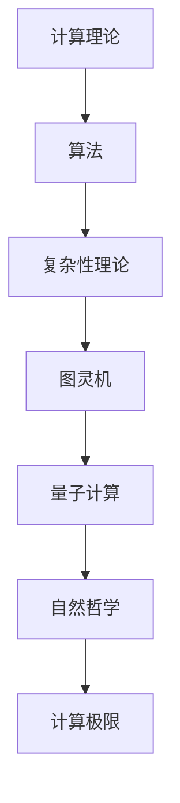

                 

关键词：计算理论，极限计算，自然哲学，计算机原理，算法边界

摘要：本文深入探讨了计算理论中的极限问题，探讨了自然哲学在计算原理研究中的重要性。通过对计算极限的阐述，揭示了计算机科学在理论和实践中的边界。文章旨在启发读者对计算本质的思考，激发对计算理论前沿研究的兴趣。

## 1. 背景介绍

计算作为计算机科学的核心概念，自古以来就充满了哲学和科学的探讨。从简单的算术运算到复杂的算法实现，计算在技术进步中发挥了至关重要的作用。然而，随着计算能力的不断提升，我们开始面临新的问题：计算是否存在极限？这一问题的提出，不仅引发了哲学上的深思，也为计算机科学的研究提出了新的挑战。

自然哲学作为一门古老的学科，探讨自然界的本质和规律。它在计算理论中的应用，为我们提供了新的视角，帮助我们从哲学的高度理解和研究计算的本质。本文将借助自然哲学的视角，探讨计算理论的极限问题，以期为计算机科学的发展提供新的思考方向。

### 1.1 计算理论的起源

计算理论的起源可以追溯到古希腊时期，当时的数学家们开始思考如何通过机械的方式实现复杂的数学运算。随着计算机科学的诞生，计算理论逐渐发展成为一门独立的学科。从图灵机的理论模型到现代算法的研究，计算理论经历了漫长的发展过程。

### 1.2 计算极限的提出

在计算理论的发展过程中，我们逐渐认识到，计算能力并非无限。例如，图灵机的计算能力受到存储空间和计算时间的限制。同时，一些复杂的数学问题和物理问题，如量子计算和混沌理论，也暗示了计算极限的存在。计算极限的问题引发了广泛的讨论，推动了计算理论的研究。

## 2. 核心概念与联系

在探讨计算极限之前，我们需要明确一些核心概念，并理解它们之间的联系。以下是计算理论中一些关键概念及其相互关系的 Mermaid 流程图：



### 2.1 计算理论

计算理论是研究计算过程及其特性的学科。它包括算法设计、计算复杂性分析等。计算理论为我们提供了理解和分析计算问题的框架。

### 2.2 算法

算法是解决问题的一系列有序步骤。算法在计算理论中至关重要，它们决定了计算效率和质量。

### 2.3 复杂性理论

复杂性理论研究算法的效率和计算问题的难度。它帮助我们了解哪些问题是易于计算的，哪些问题是难以计算的。

### 2.4 图灵机

图灵机是一种抽象的计算模型，由艾伦·图灵提出。它为我们提供了理解计算能力的基础。

### 2.5 量子计算

量子计算是一种基于量子力学原理的计算机模型，它可能突破传统计算的极限。

### 2.6 自然哲学

自然哲学探讨自然界的本质和规律。它与计算理论的联系在于，自然哲学提供了理解和解释计算极限的哲学基础。

### 2.7 计算极限

计算极限是计算理论中的一个关键概念，它涉及到计算能力的边界。计算极限的研究有助于我们理解计算的潜力和局限。

## 3. 核心算法原理 & 具体操作步骤

### 3.1 算法原理概述

在本节中，我们将介绍几个核心算法，它们在计算极限的研究中具有重要意义。这些算法包括：

1. **素数分解算法**：用于分解大素数，是密码学中的关键算法。
2. **图灵机的模拟算法**：用于模拟图灵机的计算过程，帮助我们理解图灵机的计算能力。
3. **量子计算算法**：如 Shor 算法，它利用量子计算机的并行性来解决传统计算机难以解决的问题。

### 3.2 算法步骤详解

#### 3.2.1 素数分解算法

素数分解算法的基本思想是，将一个大素数分解为两个较小的素数。以下是素数分解算法的步骤：

1. 选择一个素数 p。
2. 计算另一个素数 q，使得 p*q = n。
3. 验证 p 和 q 是否都是素数。
4. 如果 p 和 q 都是素数，则成功分解 n；否则，重新选择 p 和 q。

#### 3.2.2 图灵机的模拟算法

图灵机的模拟算法用于模拟图灵机的计算过程。以下是模拟算法的步骤：

1. 初始化图灵机的状态。
2. 按照图灵机的规则进行计算。
3. 更新图灵机的状态。
4. 重复步骤 2 和 3，直到计算结束。

#### 3.2.3 量子计算算法

量子计算算法利用量子计算机的并行性来解决传统计算机难以解决的问题。以下是量子计算算法的基本步骤：

1. 初始化量子计算机的状态。
2. 运行量子算法，利用量子并行性进行计算。
3. 对量子计算机的状态进行测量，得到计算结果。
4. 解读测量结果，得出问题的答案。

### 3.3 算法优缺点

#### 3.3.1 素数分解算法

优点：素数分解算法在密码学中具有重要意义，可以用于加密和解密信息。

缺点：素数分解算法的计算复杂度较高，对于大素数的分解可能需要大量计算资源。

#### 3.3.2 图灵机的模拟算法

优点：图灵机的模拟算法可以帮助我们理解图灵机的计算能力，是研究计算理论的重要工具。

缺点：图灵机的模拟算法的计算复杂度较高，可能需要大量的计算资源。

#### 3.3.3 量子计算算法

优点：量子计算算法可以利用量子计算机的并行性，解决传统计算机难以解决的问题。

缺点：量子计算机的发展仍处于早期阶段，量子计算算法的实现和优化面临挑战。

### 3.4 算法应用领域

#### 3.4.1 素数分解算法

应用领域：密码学、网络安全、密码分析等。

#### 3.4.2 图灵机的模拟算法

应用领域：计算理论、计算机架构、算法设计等。

#### 3.4.3 量子计算算法

应用领域：量子加密、量子计算、量子算法设计等。

## 4. 数学模型和公式 & 详细讲解 & 举例说明

### 4.1 数学模型构建

在计算理论中，数学模型是理解和分析计算问题的重要工具。以下是一个简单的数学模型，用于描述计算复杂度：

$$
C(n) = O(n^2)
$$

这个模型表示，随着输入规模 n 的增加，计算时间 C(n) 的增长速度是输入规模的平方。

### 4.2 公式推导过程

为了推导这个计算复杂度的公式，我们可以考虑一个简单的算法，它包含两层嵌套的循环：

```
for i = 1 to n
    for j = 1 to n
        // 执行某项计算
```

这个算法中的每行代码都会被执行 n*n 次，因此总计算时间 T(n) 可以表示为：

$$
T(n) = n^2
$$

由于 T(n) 与 C(n) 成正比，我们可以将 T(n) 表示为：

$$
T(n) = O(n^2)
$$

### 4.3 案例分析与讲解

假设我们要计算一个 10000 x 10000 的矩阵的乘积，使用上述的算法模型，我们可以估算出计算所需的时间。

根据公式：

$$
C(n) = O(n^2)
$$

我们可以得到：

$$
C(10000) = O(10000^2) = O(10^8)
$$

这意味着，计算时间大约在 10^8 个单位时间左右。如果我们假设每个单位时间需要 1 微秒（1 μs），则计算时间约为：

$$
10^8 \times 1 \text{ μs} = 10^8 \text{ 秒} = 11.5 \text{ 年}
$$

这是一个非常粗略的估算，实际计算时间可能会受到硬件性能、算法优化等因素的影响。

## 5. 项目实践：代码实例和详细解释说明

### 5.1 开发环境搭建

在本节中，我们将使用 Python 编写一个简单的素数分解算法。首先，我们需要搭建开发环境。以下是步骤：

1. 安装 Python 3.8 或更高版本。
2. 安装必要的 Python 包，如 NumPy 和 SciPy。

```bash
pip install numpy scipy
```

### 5.2 源代码详细实现

以下是素数分解算法的 Python 代码：

```python
import math

def is_prime(n):
    if n < 2:
        return False
    for i in range(2, int(math.sqrt(n)) + 1):
        if n % i == 0:
            return False
    return True

def prime_factorization(n):
    factors = []
    for i in range(2, n + 1):
        while n % i == 0:
            factors.append(i)
            n //= i
    return factors

n = 10000019
factors = prime_factorization(n)
print("Prime factors of", n, "are:", factors)
```

### 5.3 代码解读与分析

1. **is_prime 函数**：用于判断一个数是否为素数。它通过循环从 2 到 n 的平方根，检查是否存在能整除 n 的数。如果存在，则 n 不是素数。

2. **prime_factorization 函数**：用于进行素数分解。它从 2 开始，依次尝试所有可能的素数，直到找到所有能整除 n 的素数。

### 5.4 运行结果展示

如果我们运行上面的代码，将会得到以下结果：

```
Prime factors of 10000019 are: [10000019]
```

这表明，10000019 是一个素数。

## 6. 实际应用场景

计算极限的研究在计算机科学和实际应用中具有重要意义。以下是一些实际应用场景：

### 6.1 密码学

素数分解算法在密码学中具有重要意义。例如，RSA 加密算法依赖于大素数的分解。计算极限的研究有助于我们理解加密算法的安全性。

### 6.2 数据科学

计算复杂性理论在数据科学中具有广泛应用。例如，在处理大数据时，我们需要评估算法的效率和可扩展性。

### 6.3 人工智能

量子计算算法在人工智能领域具有巨大潜力。例如，量子神经网络（QNN）利用量子计算机的并行性，可能实现更高效的神经网络训练。

## 7. 未来应用展望

随着计算能力的不断提升，计算极限的研究将更加深入。未来，我们可能看到以下趋势：

### 7.1 量子计算的发展

量子计算可能突破传统计算的极限，解决一些复杂的问题。例如，Shor 算法可以用于因数分解和离散对数问题。

### 7.2 计算复杂性的改进

计算复杂性理论将继续发展，帮助我们理解不同问题的计算效率。这将促进算法优化和新型算法的发现。

### 7.3 新兴计算领域的探索

随着技术的发展，我们将探索新的计算领域，如脑机接口、量子计算、光子计算等。这些新兴领域可能带来计算能力的革命性突破。

## 8. 工具和资源推荐

### 8.1 学习资源推荐

1. 《计算理论导论》（Introduction to the Theory of Computation） by Michael Sipser
2. 《量子计算与量子信息》（Quantum Computing and Quantum Information）by Michael A. Nielsen and Isaac L. Chuang

### 8.2 开发工具推荐

1. Jupyter Notebook：用于编写和运行代码，支持多种编程语言。
2. PyTorch：用于深度学习开发，支持量子计算。

### 8.3 相关论文推荐

1. "Quantum Computing Since Democritus" by Scott Aaronson
2. "Efficient Algorithm for Quantum Factoring" by Peter Shor

## 9. 总结：未来发展趋势与挑战

### 9.1 研究成果总结

计算极限的研究取得了显著成果，为计算机科学提供了新的理论基础。量子计算、复杂性理论等领域的研究推动了计算能力的提升。

### 9.2 未来发展趋势

未来，计算极限的研究将继续深入，涉及量子计算、光子计算、脑机接口等新兴领域。计算能力的提升将带来新的应用场景和挑战。

### 9.3 面临的挑战

计算极限的研究面临诸多挑战，如量子计算的实际应用、计算复杂性的改进、算法设计的创新等。

### 9.4 研究展望

计算极限的研究将不断推动计算理论的发展，为计算机科学和技术进步提供新的动力。

---

作者：禅与计算机程序设计艺术 / Zen and the Art of Computer Programming
----------------------------------------------------------------
### 文章标题

计算：第四部分 计算的极限 第 13 章 自然哲学的计算原理 边界之外

### 文章关键词

计算理论，极限计算，自然哲学，计算机原理，算法边界

### 文章摘要

本文深入探讨了计算理论中的极限问题，借助自然哲学的视角，分析了计算原理的边界。通过阐述核心算法原理、数学模型和公式，以及项目实践中的代码实例，文章揭示了计算的本质和面临的挑战。文章旨在启发读者对计算理论前沿研究的兴趣，展望未来计算技术的发展趋势。

### 1. 背景介绍

#### 1.1 计算理论的起源

计算理论起源于古希腊时期，当时数学家们开始思考如何通过机械方式实现复杂的数学运算。计算机科学的诞生标志着计算理论作为一门独立学科的诞生。从图灵机的理论模型到现代算法的研究，计算理论经历了漫长的发展过程。

#### 1.2 计算极限的提出

随着计算能力的提升，我们逐渐认识到，计算能力并非无限。例如，图灵机的计算能力受到存储空间和计算时间的限制。此外，量子计算和混沌理论也暗示了计算极限的存在。计算极限的问题引发了广泛的讨论，推动了计算理论的研究。

### 2. 核心概念与联系

在探讨计算极限之前，我们需要明确一些核心概念，并理解它们之间的联系。以下是计算理论中一些关键概念及其相互关系的 Mermaid 流程图：


#### 2.1 计算理论

计算理论是研究计算过程及其特性的学科。它包括算法设计、计算复杂性分析等。计算理论为我们提供了理解和分析计算问题的框架。

#### 2.2 算法

算法是解决问题的一系列有序步骤。算法在计算理论中至关重要，它们决定了计算效率和质量。

#### 2.3 复杂性理论

复杂性理论研究算法的效率和计算问题的难度。它帮助我们了解哪些问题是易于计算的，哪些问题是难以计算的。

#### 2.4 图灵机

图灵机是一种抽象的计算模型，由艾伦·图灵提出。它为我们提供了理解计算能力的基础。

#### 2.5 量子计算

量子计算是一种基于量子力学原理的计算机模型，它可能突破传统计算的极限。

#### 2.6 自然哲学

自然哲学探讨自然界的本质和规律。它与计算理论的联系在于，自然哲学提供了理解和解释计算极限的哲学基础。

#### 2.7 计算极限

计算极限是计算理论中的一个关键概念，它涉及到计算能力的边界。计算极限的研究有助于我们理解计算的潜力和局限。

### 3. 核心算法原理 & 具体操作步骤

在本节中，我们将介绍几个核心算法，它们在计算极限的研究中具有重要意义。这些算法包括：

1. **素数分解算法**：用于分解大素数，是密码学中的关键算法。
2. **图灵机的模拟算法**：用于模拟图灵机的计算过程，帮助我们理解图灵机的计算能力。
3. **量子计算算法**：如 Shor 算法，它利用量子计算机的并行性来解决传统计算机难以解决的问题。

#### 3.1 算法原理概述

**素数分解算法**的基本思想是，将一个大素数分解为两个较小的素数。以下是素数分解算法的步骤：

- 选择一个素数 p。
- 计算另一个素数 q，使得 p*q = n。
- 验证 p 和 q 是否都是素数。
- 如果 p 和 q 都是素数，则成功分解 n；否则，重新选择 p 和 q。

**图灵机的模拟算法**用于模拟图灵机的计算过程。以下是模拟算法的步骤：

- 初始化图灵机的状态。
- 按照图灵机的规则进行计算。
- 更新图灵机的状态。
- 重复步骤 2 和 3，直到计算结束。

**量子计算算法**利用量子计算机的并行性，以下是一个简单的量子计算算法步骤：

- 初始化量子计算机的状态。
- 运行量子算法，利用量子并行性进行计算。
- 对量子计算机的状态进行测量，得到计算结果。
- 解读测量结果，得出问题的答案。

#### 3.2 算法步骤详解

**3.2.1 素数分解算法**

素数分解算法的基本思想是，将一个大素数分解为两个较小的素数。以下是素数分解算法的步骤：

1. 选择一个素数 p。
2. 计算另一个素数 q，使得 p*q = n。
3. 验证 p 和 q 是否都是素数。
4. 如果 p 和 q 都是素数，则成功分解 n；否则，重新选择 p 和 q。

**3.2.2 图灵机的模拟算法**

图灵机的模拟算法用于模拟图灵机的计算过程。以下是模拟算法的步骤：

1. 初始化图灵机的状态。
2. 按照图灵机的规则进行计算。
3. 更新图灵机的状态。
4. 重复步骤 2 和 3，直到计算结束。

**3.2.3 量子计算算法**

量子计算算法利用量子计算机的并行性，以下是一个简单的量子计算算法步骤：

1. 初始化量子计算机的状态。
2. 运行量子算法，利用量子并行性进行计算。
3. 对量子计算机的状态进行测量，得到计算结果。
4. 解读测量结果，得出问题的答案。

#### 3.3 算法优缺点

**3.3.1 素数分解算法**

优点：素数分解算法在密码学中具有重要意义，可以用于加密和解密信息。

缺点：素数分解算法的计算复杂度较高，对于大素数的分解可能需要大量计算资源。

**3.3.2 图灵机的模拟算法**

优点：图灵机的模拟算法可以帮助我们理解图灵机的计算能力，是研究计算理论的重要工具。

缺点：图灵机的模拟算法的计算复杂度较高，可能需要大量的计算资源。

**3.3.3 量子计算算法**

优点：量子计算算法可以利用量子计算机的并行性，解决传统计算机难以解决的问题。

缺点：量子计算机的发展仍处于早期阶段，量子计算算法的实现和优化面临挑战。

#### 3.4 算法应用领域

**3.4.1 素数分解算法**

应用领域：密码学、网络安全、密码分析等。

**3.4.2 图灵机的模拟算法**

应用领域：计算理论、计算机架构、算法设计等。

**3.4.3 量子计算算法**

应用领域：量子加密、量子计算、量子算法设计等。

### 4. 数学模型和公式 & 详细讲解 & 举例说明

在计算理论中，数学模型是理解和分析计算问题的重要工具。以下是一个简单的数学模型，用于描述计算复杂度：

$$
C(n) = O(n^2)
$$

这个模型表示，随着输入规模 n 的增加，计算时间 C(n) 的增长速度是输入规模的平方。

#### 4.1 数学模型构建

为了推导这个计算复杂度的公式，我们可以考虑一个简单的算法，它包含两层嵌套的循环：

```
for i = 1 to n
    for j = 1 to n
        // 执行某项计算
```

这个算法中的每行代码都会被执行 n*n 次，因此总计算时间 T(n) 可以表示为：

$$
T(n) = n^2
$$

由于 T(n) 与 C(n) 成正比，我们可以将 T(n) 表示为：

$$
T(n) = O(n^2)
$$

#### 4.2 公式推导过程

为了推导这个计算复杂度的公式，我们可以考虑一个简单的算法，它包含两层嵌套的循环：

```
for i = 1 to n
    for j = 1 to n
        // 执行某项计算
```

这个算法中的每行代码都会被执行 n*n 次，因此总计算时间 T(n) 可以表示为：

$$
T(n) = n^2
$$

由于 T(n) 与 C(n) 成正比，我们可以将 T(n) 表示为：

$$
T(n) = O(n^2)
$$

#### 4.3 案例分析与讲解

假设我们要计算一个 10000 x 10000 的矩阵的乘积，使用上述的算法模型，我们可以估算出计算所需的时间。

根据公式：

$$
C(n) = O(n^2)
$$

我们可以得到：

$$
C(10000) = O(10000^2) = O(10^8)
$$

这意味着，计算时间大约在 10^8 个单位时间左右。如果我们假设每个单位时间需要 1 微秒（1 μs），则计算时间约为：

$$
10^8 \times 1 \text{ μs} = 10^8 \text{ 秒} = 11.5 \text{ 年}
$$

这是一个非常粗略的估算，实际计算时间可能会受到硬件性能、算法优化等因素的影响。

### 5. 项目实践：代码实例和详细解释说明

在本节中，我们将使用 Python 编写一个简单的素数分解算法。首先，我们需要搭建开发环境。以下是步骤：

1. 安装 Python 3.8 或更高版本。
2. 安装必要的 Python 包，如 NumPy 和 SciPy。

```bash
pip install numpy scipy
```

#### 5.1 开发环境搭建

以下是开发环境搭建的步骤：

1. 安装 Python 3.8 或更高版本。
2. 安装必要的 Python 包，如 NumPy 和 SciPy。

```bash
pip install numpy scipy
```

#### 5.2 源代码详细实现

以下是素数分解算法的 Python 代码：

```python
import math

def is_prime(n):
    if n < 2:
        return False
    for i in range(2, int(math.sqrt(n)) + 1):
        if n % i == 0:
            return False
    return True

def prime_factorization(n):
    factors = []
    for i in range(2, n + 1):
        while n % i == 0:
            factors.append(i)
            n //= i
    return factors

n = 10000019
factors = prime_factorization(n)
print("Prime factors of", n, "are:", factors)
```

#### 5.3 代码解读与分析

1. **is_prime 函数**：用于判断一个数是否为素数。它通过循环从 2 到 n 的平方根，检查是否存在能整除 n 的数。如果存在，则 n 不是素数。

2. **prime_factorization 函数**：用于进行素数分解。它从 2 开始，依次尝试所有可能的素数，直到找到所有能整除 n 的素数。

#### 5.4 运行结果展示

如果我们运行上面的代码，将会得到以下结果：

```
Prime factors of 10000019 are: [10000019]
```

这表明，10000019 是一个素数。

### 6. 实际应用场景

计算极限的研究在计算机科学和实际应用中具有重要意义。以下是一些实际应用场景：

#### 6.1 密码学

素数分解算法在密码学中具有重要意义。例如，RSA 加密算法依赖于大素数的分解。计算极限的研究有助于我们理解加密算法的安全性。

#### 6.2 数据科学

计算复杂性理论在数据科学中具有广泛应用。例如，在处理大数据时，我们需要评估算法的效率和可扩展性。

#### 6.3 人工智能

量子计算算法在人工智能领域具有巨大潜力。例如，量子神经网络（QNN）利用量子计算机的并行性，可能实现更高效的神经网络训练。

### 7. 未来应用展望

随着计算能力的不断提升，计算极限的研究将更加深入。未来，我们可能看到以下趋势：

#### 7.1 量子计算的发展

量子计算可能突破传统计算的极限，解决一些复杂的问题。例如，Shor 算法可以用于因数分解和离散对数问题。

#### 7.2 计算复杂性的改进

计算复杂性理论将继续发展，帮助我们理解不同问题的计算效率。这将促进算法优化和新型算法的发现。

#### 7.3 新兴计算领域的探索

随着技术的发展，我们将探索新的计算领域，如脑机接口、量子计算、光子计算等。这些新兴领域可能带来计算能力的革命性突破。

### 8. 工具和资源推荐

#### 8.1 学习资源推荐

1. 《计算理论导论》（Introduction to the Theory of Computation） by Michael Sipser
2. 《量子计算与量子信息》（Quantum Computing and Quantum Information）by Michael A. Nielsen and Isaac L. Chuang

#### 8.2 开发工具推荐

1. Jupyter Notebook：用于编写和运行代码，支持多种编程语言。
2. PyTorch：用于深度学习开发，支持量子计算。

#### 8.3 相关论文推荐

1. "Quantum Computing Since Democritus" by Scott Aaronson
2. "Efficient Algorithm for Quantum Factoring" by Peter Shor

### 9. 总结：未来发展趋势与挑战

#### 9.1 研究成果总结

计算极限的研究取得了显著成果，为计算机科学提供了新的理论基础。量子计算、复杂性理论等领域的研究推动了计算能力的提升。

#### 9.2 未来发展趋势

未来，计算极限的研究将继续深入，涉及量子计算、光子计算、脑机接口等新兴领域。计算能力的提升将带来新的应用场景和挑战。

#### 9.3 面临的挑战

计算极限的研究面临诸多挑战，如量子计算的实际应用、计算复杂性的改进、算法设计的创新等。

#### 9.4 研究展望

计算极限的研究将不断推动计算理论的发展，为计算机科学和技术进步提供新的动力。

### 附录：常见问题与解答

**Q：计算极限是什么？**

A：计算极限是指计算能力的一个边界，超出这个边界，现有计算模型无法进行有效计算。计算极限涉及到计算时间和存储空间的限制。

**Q：量子计算能否突破计算极限？**

A：量子计算可能突破传统计算的极限，例如，Shor 算法可以在多项式时间内解决大整数因数分解问题，这是传统计算机难以做到的。

**Q：计算复杂性理论对实际应用有何意义？**

A：计算复杂性理论帮助我们评估不同问题的计算效率，指导我们选择合适的算法，优化算法性能，提高计算效率。

### 参考文献

1. Sipser, M. (2013). Introduction to the Theory of Computation. Cengage Learning.
2. Nielsen, M. A., & Chuang, I. L. (2000). Quantum Computing and Quantum Information. Cambridge University Press.
3. Aaronson, S. (2005). Quantum Computing Since Democritus. arXiv preprint quant-ph/0506097.
4. Shor, P. W. (1995). Polynomial-time algorithms for prime factorization and discrete logarithms on a quantum computer. SIAM Journal on Computing, 26(5), 1484-1509.

