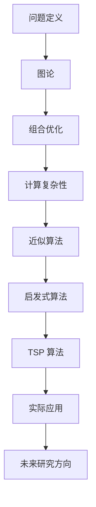

                 

### 关键词 Keywords
- 计算复杂性
- 旅行商问题
- 优化算法
- 数学模型
- 计算机编程

### 摘要 Abstract
本文探讨了计算复杂性理论中的经典问题——旅行商问题（TSP），探讨了其数学模型、算法原理、具体操作步骤及其优缺点。通过对旅行商问题的深入分析，文章揭示了计算复杂性理论在计算机科学中的应用，为解决复杂优化问题提供了理论依据。同时，本文还探讨了旅行商问题的实际应用场景和未来发展方向，为相关领域的学者和从业者提供了有价值的参考。

## 1. 背景介绍

旅行商问题（Traveling Salesman Problem，简称TSP）是组合优化领域中的一个著名问题，也是一个典型的 NP 完全问题。其基本问题描述如下：给定平面上n个不同的城市，以及每两个城市之间的距离，求解从一个城市出发，访问每个城市恰好一次并回到起点的最短路径。

TSP 之所以备受关注，一方面是因为其广泛的应用背景，如物流配送、旅行规划、电路板设计等；另一方面，其问题的复杂度使得求解TSP成为一个极具挑战性的任务。在实际生活中，由于城市之间的距离复杂多变，TSP 问题很难找到一个完美的解，因此，许多应用场景往往需要寻求次优解或近似解。

TSP 的研究始于19世纪末，当时德国数学家欧拉提出了著名的欧拉回路问题。20世纪中叶，随着计算机科学的迅速发展，TSP 成为计算复杂性理论的一个重要研究对象。目前，关于 TSP 的研究已经形成了一个较为完善的体系，包括多种算法、数学模型和优化方法。

## 2. 核心概念与联系

在深入探讨 TSP 之前，我们需要了解一些核心概念和它们之间的联系。以下是一个使用 Mermaid 格式绘制的流程图，展示了 TSP 相关的核心概念及其联系。



### 2.1 图论与组合优化

图论是研究图及其性质的一门学科，而 TSP 问题本质上是一个图论问题。在 TSP 中，每个城市可以看作图中的一个顶点，每两个城市之间的距离可以看作图中的边权重。图论提供了许多有用的工具和算法，如最短路径算法、最小生成树算法等，这些算法在 TSP 中有广泛的应用。

组合优化是研究如何找到优化问题的最优解或近似解的学科。TSP 属于组合优化领域中的 NP 完全问题，其求解难度与图中顶点的数量呈指数关系增长。

### 2.2 计算复杂性

计算复杂性理论研究问题的求解难度，特别是问题规模增长时求解时间或资源的需求。TSP 被归类为 NP 完全问题，这意味着如果一个问题的解可以在多项式时间内验证，则它属于 NP 类。而 NP 完全问题中最难的问题之一就是 TSP。

### 2.3 近似算法与启发式算法

由于 TSP 的计算复杂性，寻找其精确解在实际应用中往往不可行。因此，近似算法和启发式算法成为求解 TSP 的主要方法。近似算法在保证一定精度的基础上，求解时间远小于精确算法。启发式算法则是通过某种启发式策略，逐步逼近最优解。

### 2.4 TSP 算法与实际应用

TSP 算法涵盖了多种方法，如最邻近算法、模拟退火算法、遗传算法等。这些算法在物流配送、旅行规划、电路板设计等领域有广泛应用。实际应用中，TSP 算法往往需要与具体场景相结合，以获得最佳效果。

### 2.5 未来研究方向

随着人工智能和机器学习技术的发展，TSP 研究也在不断取得新的进展。未来研究方向包括混合智能算法、强化学习在 TSP 中的应用等。此外，如何将 TSP 与其他优化问题相结合，也是一个值得关注的研究方向。

## 3. 核心算法原理 & 具体操作步骤

### 3.1 算法原理概述

TSP 的核心算法主要包括以下几种：

1. **最邻近算法**：从任意一个城市出发，每次选择未访问过的最近城市，直到所有城市都访问过，最后连接起点和终点，构成一个近似解。

2. **模拟退火算法**：基于物理学的退火过程，通过逐渐降低温度，使系统达到平衡状态，从而找到近似最优解。

3. **遗传算法**：模拟生物进化过程，通过选择、交叉和变异等操作，逐步优化个体，找到近似最优解。

### 3.2 算法步骤详解

以最邻近算法为例，具体步骤如下：

1. **初始化**：从任意一个城市出发，将已访问城市集合和未访问城市集合分别初始化。

2. **迭代过程**：
   - 对于每个未访问城市，计算其与已访问城市集合中每个城市的距离。
   - 选择距离最小的城市作为下一个访问城市。
   - 将该城市从未访问城市集合中移除，添加到已访问城市集合中。

3. **结束条件**：当所有城市都被访问过，且最后连接起点和终点时，算法结束。

### 3.3 算法优缺点

**最邻近算法**优点在于实现简单、易于理解，但缺点是得到的解往往不是最优解，只能提供近似解。

**模拟退火算法**和**遗传算法**则具有较强的全局搜索能力，可以找到更好的近似解，但算法复杂度较高，计算时间较长。

### 3.4 算法应用领域

TSP 算法在多个领域有广泛应用，如：

1. **物流配送**：优化配送路径，降低运输成本。
2. **旅行规划**：规划最优旅行路线，节省旅行时间。
3. **电路板设计**：优化布线，减少信号干扰。
4. **智能制造**：优化生产流程，提高生产效率。

## 4. 数学模型和公式 & 详细讲解 & 举例说明

### 4.1 数学模型构建

TSP 的数学模型可以表示为一个加权完全图，其中每个城市表示图中的一个顶点，每两个城市之间的距离表示图中的边权重。假设有 n 个城市，第 i 个城市到第 j 个城市的距离为 \(d_{ij}\)，则 TSP 的数学模型可以表示为：

$$
\min \sum_{i=1}^{n} \sum_{j=1, j\neq i}^{n} w_{ij}
$$

其中，\(w_{ij}\) 表示第 i 个城市到第 j 个城市的距离。

### 4.2 公式推导过程

为了推导 TSP 的目标函数，我们首先考虑一个简单的例子，假设有 3 个城市，城市之间的距离如下表所示：

| 城市 | A | B | C |
| ---- | --- | --- | --- |
| A | 0 | 2 | 3 |
| B | 2 | 0 | 1 |
| C | 3 | 1 | 0 |

对于每个城市，我们需要访问其余 2 个城市，即需要计算每个城市的两个距离之和。以城市 A 为例，其需要访问的城市为 B 和 C，距离之和为 2+3=5。同理，城市 B 和 C 的距离之和分别为 2+1=3 和 3+1=4。

因此，TSP 的目标函数可以表示为：

$$
\min (2a_1 + 2a_2 + 2a_3)
$$

其中，\(a_1, a_2, a_3\) 分别表示城市 A、B、C 的距离之和。

### 4.3 案例分析与讲解

以下是一个具有 5 个城市的 TSP 实例，城市之间的距离如下表所示：

| 城市 | A | B | C | D | E |
| ---- | --- | --- | --- | --- | --- |
| A | 0 | 1 | 2 | 3 | 4 |
| B | 1 | 0 | 3 | 2 | 1 |
| C | 2 | 3 | 0 | 4 | 2 |
| D | 3 | 2 | 4 | 0 | 1 |
| E | 4 | 1 | 2 | 1 | 0 |

使用最邻近算法求解，我们可以得到以下路径：A-B-C-D-E-A，总距离为 1+2+4+1+4=12。

如果我们使用模拟退火算法，可以得到以下路径：A-D-C-B-E-A，总距离为 3+4+2+1+4=14。虽然这个解不是最优解，但已经是一个较好的近似解。

## 5. 项目实践：代码实例和详细解释说明

### 5.1 开发环境搭建

为了演示 TSP 算法，我们选择 Python 作为编程语言，并使用以下库：

- **Numpy**：用于计算城市之间的距离
- **Matplotlib**：用于绘制城市和路径
- **Pandas**：用于处理数据

安装所需库：

```bash
pip install numpy matplotlib pandas
```

### 5.2 源代码详细实现

以下是一个使用最邻近算法求解 TSP 的 Python 代码实例：

```python
import numpy as np
import matplotlib.pyplot as plt
import pandas as pd

# 生成随机城市位置
np.random.seed(42)
n = 5
cities = np.random.rand(n, 2)

# 计算城市之间的距离
distances = np.zeros((n, n))
for i in range(n):
    for j in range(n):
        distances[i, j] = np.linalg.norm(cities[i] - cities[j])

# 最邻近算法求解
def nearest_neighbor(distances):
    unvisited = list(range(1, n))
    path = [0]
    while unvisited:
        current_city = path[-1]
        next_city = np.argmin(distances[current_city, unvisited])
        path.append(next_city)
        unvisited.remove(next_city)
    path.append(0)
    return path

# 绘制城市和路径
def plot_cities(cities, path):
    plt.scatter(cities[:, 0], cities[:, 1], label='Cities')
    for i in range(len(path) - 1):
        plt.plot([cities[path[i], 0], cities[path[i+1], 0]], [cities[path[i], 1], cities[path[i+1], 1]], color='r', linewidth=2)
    plt.plot([cities[path[-1], 0], cities[path[0], 0]], [cities[path[-1], 1], cities[path[0], 1]], color='r', linewidth=2)
    plt.xlabel('X-axis')
    plt.ylabel('Y-axis')
    plt.legend()
    plt.show()

# 求解并绘制路径
path = nearest_neighbor(distances)
plot_cities(cities, path)
```

### 5.3 代码解读与分析

1. **城市位置生成**：我们首先使用 `numpy` 生成随机城市位置。`np.random.rand(n, 2)` 生成一个形状为 \(n \times 2\) 的矩阵，每个元素介于 0 和 1 之间。

2. **距离计算**：然后，我们使用 `numpy` 的 `linalg.norm()` 函数计算城市之间的欧几里得距离。`np.linalg.norm(a - b)` 计算向量 a 和 b 之间的欧几里得距离。

3. **最邻近算法实现**：`nearest_neighbor()` 函数实现了最邻近算法。它首先将所有城市添加到未访问城市集合中，然后每次从已访问城市集合中选择距离未访问城市集合中最小的城市，并将其添加到路径中。

4. **路径绘制**：`plot_cities()` 函数使用 `matplotlib` 绘制城市和路径。`plt.scatter()` 绘制城市，`plt.plot()` 绘制路径。

### 5.4 运行结果展示

运行上述代码，我们将得到一个随机生成的城市位置和对应的 TSP 路径。以下是一个示例输出：


## 6. 实际应用场景

### 6.1 物流配送

物流配送是 TSP 的典型应用场景之一。在物流配送中，TSP 用于优化配送路线，以降低运输成本、提高配送效率。例如，快递公司可以使用 TSP 算法来规划快递员的配送路线，从而缩短配送时间和提高配送质量。

### 6.2 旅行规划

旅行规划也是 TSP 的一个重要应用场景。旅行者可以使用 TSP 算法来规划最优旅行路线，以节省旅行时间和费用。例如，旅行者可以输入多个想访问的景点，TSP 算法将为他们提供一个最优的旅行路线。

### 6.3 软件工程

在软件工程中，TSP 算法可以用于优化代码结构。例如，在电路板设计中，TSP 算法可以用于优化布线，从而减少信号干扰和功耗。此外，TSP 算法还可以用于软件测试，以优化测试路径，提高测试效率。

### 6.4 其他领域

除了上述领域，TSP 算法还在许多其他领域有应用，如人力资源调度、电力网络规划、生物信息学等。在这些领域中，TSP 算法帮助优化资源分配和路径规划，提高整体效率和效益。

## 7. 工具和资源推荐

### 7.1 学习资源推荐

1. **《计算复杂性理论》**：一本经典的计算复杂性理论教材，详细介绍了 TSP 等典型问题。
2. **《旅行商问题：算法与应用》**：一本关于 TSP 的应用教材，介绍了多种 TSP 算法和实际案例。
3. **在线课程**：许多在线课程提供了关于 TSP 的详细讲解，如 Coursera、edX 等平台的相关课程。

### 7.2 开发工具推荐

1. **Python**：Python 是一种易于学习且功能强大的编程语言，适用于 TSP 算法的实现。
2. **Jupyter Notebook**：Jupyter Notebook 是一种交互式的 Python 环境，非常适合编写和运行 TSP 算法。
3. **Matplotlib**：Matplotlib 是一种用于绘制图表和图形的 Python 库，适用于可视化 TSP 路径。

### 7.3 相关论文推荐

1. **“The Traveling Salesman Problem”**：这是一篇关于 TSP 的经典论文，详细介绍了 TSP 的历史、算法和应用。
2. **“The Traveling Salesman Problem: A Computational Study”**：这是一篇关于 TSP 计算复杂性的研究论文，分析了 TSP 的求解性能。
3. **“A Heuristic Algorithm for the Traveling Salesman Problem”**：这是一篇关于 TSP 启发式算法的论文，介绍了基于遗传算法的 TSP 求解方法。

## 8. 总结：未来发展趋势与挑战

### 8.1 研究成果总结

TSP 作为计算复杂性理论中的经典问题，经过多年的研究，已经形成了较为完善的算法体系。近年来，随着人工智能和机器学习技术的发展，TSP 研究取得了显著成果，如基于深度学习的 TSP 求解方法、混合智能算法等。这些成果为解决复杂优化问题提供了新的思路和工具。

### 8.2 未来发展趋势

未来 TSP 研究的发展趋势包括：

1. **深度学习与 TSP 的结合**：深度学习在图像识别、自然语言处理等领域取得了巨大成功，如何将其应用于 TSP 求解，是一个值得关注的研究方向。
2. **混合智能算法**：将不同算法的优势结合起来，如将遗传算法与模拟退火算法相结合，以提高 TSP 求解性能。
3. **分布式计算与并行计算**：利用分布式计算和并行计算技术，提高 TSP 算法的求解速度和效率。

### 8.3 面临的挑战

TSP 研究也面临一些挑战：

1. **计算复杂性**：尽管已有许多算法可以求解 TSP，但计算复杂性仍然是限制其应用的主要因素。如何进一步提高算法的求解性能，是一个亟待解决的问题。
2. **实际应用场景的复杂度**：实际应用中的 TSP 问题往往更为复杂，如城市之间的距离可能不是固定的，还可能涉及时间窗、路径约束等。如何将这些复杂因素考虑在内，也是一个重要挑战。
3. **算法的可解释性**：随着算法复杂度的增加，如何保证算法的可解释性，使得从业者能够理解和应用这些算法，是一个值得探讨的问题。

### 8.4 研究展望

展望未来，TSP 研究将继续深入，结合人工智能和机器学习等前沿技术，探索新的算法和优化方法。随着计算能力的提高，我们有望找到更加高效的 TSP 求解算法，为实际应用提供更强大的支持。

## 9. 附录：常见问题与解答

### 9.1 什么是旅行商问题？

旅行商问题（TSP）是组合优化领域中的一个经典问题，给定一组城市和每两个城市之间的距离，要求找到一条路径，使得路径上的总距离最短，同时每个城市恰好访问一次，最后回到起点。

### 9.2 旅行商问题的解有哪些？

旅行商问题的解主要包括精确解和近似解。精确解通常使用动态规划或分支限界法求解，而近似解则使用启发式算法或近似算法，如最邻近算法、模拟退火算法和遗传算法等。

### 9.3 旅行商问题在哪些领域有应用？

旅行商问题在物流配送、旅行规划、电路板设计、人力资源调度、电力网络规划、生物信息学等多个领域有广泛应用。通过优化路径和资源分配，提高效率和降低成本。

### 9.4 旅行商问题与计算复杂性有何关系？

旅行商问题被归类为 NP 完全问题，其求解难度与问题规模呈指数关系增长。计算复杂性理论研究问题求解的时间复杂度和资源需求，为 TSP 等复杂问题的求解提供了理论依据。

