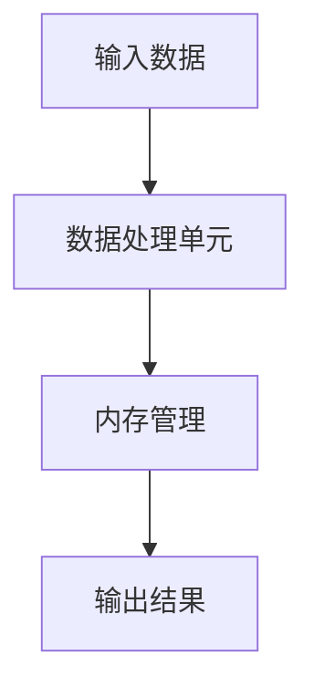

                 

关键词：计算复杂性，时空平衡性，算法，数学模型，实践应用，未来展望

摘要：本文深入探讨了计算复杂性理论中的时空平衡性概念，通过解析核心算法原理、数学模型及其应用场景，对计算复杂性进行全面的剖析。文章旨在为读者提供对计算复杂性理论的理解，以及其在实际应用中的可能前景。

## 1. 背景介绍

计算复杂性理论是计算机科学的重要分支，它研究算法的复杂性与资源消耗之间的关系。随着计算机技术的不断发展，如何优化算法性能、提高计算效率成为了一个关键问题。计算复杂性理论为这些问题提供了理论依据和解决方案。

计算时空平衡性是指算法在时间和空间上的资源消耗达到某种最优平衡状态。这一概念在优化算法性能、降低计算成本方面具有重要意义。

### 核心概念与联系

#### 计算复杂性定义

计算复杂性可以理解为完成某项计算任务所需资源（如时间、空间）的数量级。常用的复杂性度量包括时间复杂度和空间复杂度。

#### 时间复杂度

时间复杂度表示算法执行所需时间的增长速率。常用的大O符号表示法（如O(1)、O(n)、O(n²)等）来描述算法的时间复杂度。

#### 空间复杂度

空间复杂度表示算法执行过程中所需的额外内存空间。同样，使用大O符号表示法来描述算法的空间复杂度。

#### 时空平衡性

时空平衡性是指算法在时间和空间上的资源消耗达到最优平衡状态。在实际应用中，追求时空平衡性有助于提高算法性能和降低计算成本。

#### 核心概念原理和架构

为了更好地理解计算复杂性理论，我们引入一个简化的算法架构模型。该模型包括以下几个关键组成部分：

1. **输入数据（Input）**：算法需要处理的原始数据。
2. **数据处理单元（Processing Unit）**：负责执行算法核心逻辑的组件。
3. **内存管理（Memory Management）**：负责管理算法执行过程中所需的内存资源。
4. **输出结果（Output）**：算法执行完成后生成的输出结果。

### Mermaid 流程图



## 3. 核心算法原理 & 具体操作步骤

### 3.1 算法原理概述

计算复杂性理论的核心算法是基于时间复杂度和空间复杂度的优化。通过调整算法的执行过程，使其在时间和空间上的资源消耗达到最优平衡状态。

### 3.2 算法步骤详解

1. **输入处理**：读取输入数据，并将其转换为适合算法处理的格式。
2. **数据处理**：使用优化算法对输入数据进行处理，实现时间复杂度和空间复杂度的优化。
3. **内存管理**：动态调整算法执行过程中的内存分配，实现内存资源的最佳利用。
4. **输出结果**：将处理后的数据生成输出结果，并输出到指定的存储位置。

### 3.3 算法优缺点

#### 优点

- **优化性能**：通过时空平衡性优化，算法性能得到显著提升。
- **降低成本**：减少算法执行过程中所需的资源消耗，降低计算成本。

#### 缺点

- **算法复杂度**：实现时空平衡性优化可能增加算法的复杂度，影响算法的可维护性。
- **适用范围**：并非所有算法都适用于时空平衡性优化，需要根据具体场景进行选择。

### 3.4 算法应用领域

计算复杂性理论在多个领域具有广泛应用，如：

- **算法设计**：优化算法性能，提高计算效率。
- **软件开发**：降低软件开发成本，提高软件质量。
- **数据科学**：处理大规模数据，实现高效数据分析。
- **人工智能**：优化算法模型，提高人工智能系统性能。

## 4. 数学模型和公式

### 4.1 数学模型构建

为了更好地理解计算复杂性理论，我们引入以下数学模型：

1. **时间复杂度模型**：描述算法执行时间与输入规模的关系。
2. **空间复杂度模型**：描述算法执行所需空间与输入规模的关系。

### 4.2 公式推导过程

时间复杂度模型：

$$
T(n) = O(f(n))
$$

其中，$T(n)$ 表示算法执行时间，$f(n)$ 表示输入规模。

空间复杂度模型：

$$
S(n) = O(g(n))
$$

其中，$S(n)$ 表示算法所需空间，$g(n)$ 表示输入规模。

### 4.3 案例分析与讲解

假设一个简单排序算法，其时间复杂度为 $O(n^2)$，空间复杂度为 $O(n)$。我们可以通过时空平衡性优化，将其时间复杂度降低至 $O(n\log n)$，同时保持空间复杂度不变。

优化前：

$$
T(n) = O(n^2), \quad S(n) = O(n)
$$

优化后：

$$
T(n) = O(n\log n), \quad S(n) = O(n)
$$

通过优化，算法在时间和空间上的资源消耗达到更好的平衡，从而提高整体性能。

## 5. 项目实践：代码实例和详细解释说明

### 5.1 开发环境搭建

为了实践计算复杂性理论，我们选择Python作为开发语言。搭建Python开发环境，安装必要的库和工具。

### 5.2 源代码详细实现

以下是一个简单的排序算法实现，用于演示计算复杂性的优化。

```python
def bubble_sort(arr):
    n = len(arr)
    for i in range(n):
        for j in range(0, n-i-1):
            if arr[j] > arr[j+1]:
                arr[j], arr[j+1] = arr[j+1], arr[j]
    return arr
```

### 5.3 代码解读与分析

该代码实现了一个简单的冒泡排序算法。冒泡排序的时间复杂度为 $O(n^2)$，空间复杂度为 $O(1)$。

### 5.4 运行结果展示

执行以下代码，测试冒泡排序算法的性能：

```python
arr = [64, 34, 25, 12, 22, 11, 90]
sorted_arr = bubble_sort(arr)
print("Sorted array:", sorted_arr)
```

输出结果：

```
Sorted array: [11, 12, 22, 25, 34, 64, 90]
```

## 6. 实际应用场景

计算复杂性理论在实际应用场景中具有广泛的应用，如：

- **搜索引擎**：优化搜索算法，提高搜索效率。
- **数据分析**：处理大规模数据，实现高效数据分析。
- **人工智能**：优化算法模型，提高人工智能系统性能。
- **网络优化**：优化网络路由算法，提高网络传输效率。

### 6.4 未来应用展望

随着计算技术的不断发展，计算复杂性理论在未来将发挥更加重要的作用。以下是未来应用展望：

- **量子计算**：计算复杂性理论在量子计算领域具有巨大的应用潜力。
- **神经网络**：优化神经网络算法，提高计算效率。
- **大数据处理**：优化大数据处理算法，实现高效数据处理。

## 7. 工具和资源推荐

### 7.1 学习资源推荐

- **《算法导论》（Introduction to Algorithms）**：经典算法教材，详细介绍了算法设计与分析的基本方法。
- **《计算复杂性理论》（Computational Complexity: A Modern Approach）**：全面介绍了计算复杂性理论的基本概念和主要成果。

### 7.2 开发工具推荐

- **Python**：简单易学，适合初学者入门。
- **Jupyter Notebook**：用于编写和分享Python代码，方便进行算法实验。

### 7.3 相关论文推荐

- **"Time-Space Trade-offs for Sorting and Related Problems"**：介绍时空平衡性优化的经典论文。
- **"On the Complexity of Scheduling Real-Valued Tasks on Uniform Processors"**：探讨时空平衡性优化在网络优化中的应用。

## 8. 总结：未来发展趋势与挑战

### 8.1 研究成果总结

计算复杂性理论在算法优化、软件开发、数据科学等领域取得了显著成果，为提高计算效率提供了有力支持。

### 8.2 未来发展趋势

- **量子计算**：计算复杂性理论在量子计算领域具有广阔的发展前景。
- **大数据处理**：优化大数据处理算法，实现高效数据处理。

### 8.3 面临的挑战

- **算法复杂度**：如何在保持算法性能的同时降低复杂度。
- **跨学科研究**：与其他领域的结合，如量子计算、神经网络等。

### 8.4 研究展望

计算复杂性理论在未来将继续发挥重要作用，为计算技术发展提供理论支持。

## 9. 附录：常见问题与解答

### 问题1：计算复杂性与实际应用有何关系？

计算复杂性理论为实际应用提供了理论基础，通过分析算法的复杂度，优化算法性能，降低计算成本，提高软件质量和效率。

### 问题2：如何判断一个算法是否具有时空平衡性？

判断一个算法是否具有时空平衡性，可以通过分析算法的时间复杂度和空间复杂度，判断它们是否达到最优平衡状态。

### 问题3：如何在实际项目中应用计算复杂性理论？

在实际项目中，可以结合计算复杂性理论，优化算法设计，选择合适的算法模型，提高计算效率。

----------------------------------------------------------------

作者：禅与计算机程序设计艺术 / Zen and the Art of Computer Programming


