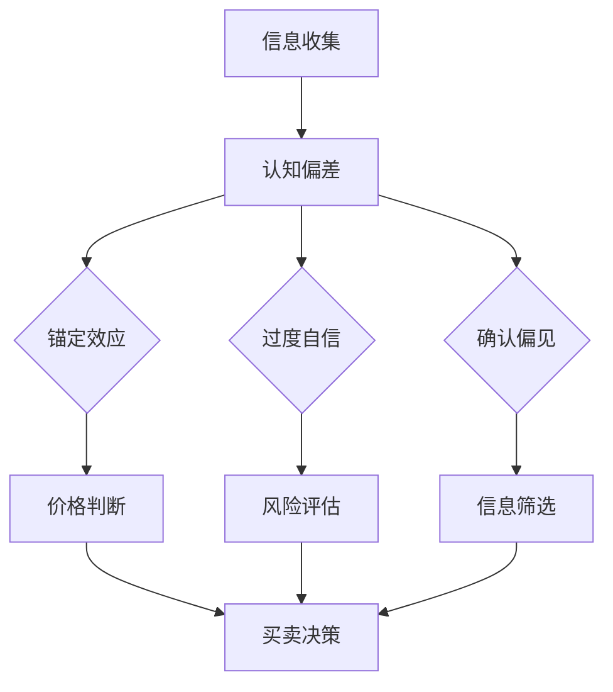

                 

 关键词：认知偏差、投资决策、决策过程、行为经济学、心理学、金融科技

> 摘要：本文将深入探讨认知偏差在投资决策过程中的影响，结合行为经济学和心理学的研究成果，分析投资者如何受到认知偏差的驱动，从而影响其投资行为。文章将从多个维度对认知偏差进行解析，并探讨这些偏差如何影响投资策略的制定与执行。通过具体的案例分析和数学模型，本文旨在为投资者提供有价值的参考，帮助他们更好地理解和规避认知偏差，做出更理性的投资决策。

## 1. 背景介绍

在过去的几十年里，金融市场的发展日新月异，投资者在投资决策过程中面临着越来越多的不确定性。在这种复杂的市场环境中，投资者的决策不仅仅受到传统经济理论的指导，还受到诸多认知心理因素的影响。认知偏差作为一种普遍存在的心理现象，它影响人们的思维和行为，也直接或间接地影响着投资决策的结果。

认知偏差是指人们在获取、处理和应用信息时，由于各种心理和社会因素的影响，产生的系统性的错误判断和决策。常见的认知偏差包括锚定效应、过度自信、确认偏见等。这些偏差在投资者决策过程中往往起到负面影响，导致投资者做出非理性的投资行为。

行为经济学作为经济学与心理学的交叉领域，致力于研究人类在决策过程中的非理性行为。行为经济学的研究表明，传统的理性经济人假设并不能完全解释实际投资行为，认知偏差是理解投资决策的重要切入点。

本文旨在通过分析认知偏差在投资决策中的表现，探讨这些偏差对投资行为的影响，并提出相应的应对策略。文章结构如下：

- **背景介绍**：简要介绍认知偏差和投资决策的重要性。
- **核心概念与联系**：介绍认知偏差的相关概念，并通过Mermaid流程图展示它们在投资决策中的作用。
- **核心算法原理 & 具体操作步骤**：分析认知偏差对投资策略的影响，并提供具体的应对措施。
- **数学模型和公式 & 详细讲解 & 举例说明**：构建数学模型，详细推导公式，并通过案例说明其应用。
- **项目实践：代码实例和详细解释说明**：提供实际的代码实例，解析其实现过程。
- **实际应用场景**：分析认知偏差在投资决策中的实际应用，探讨其潜在影响。
- **未来应用展望**：预测认知偏差研究的未来发展方向，探讨其在金融科技中的应用。
- **工具和资源推荐**：推荐相关的学习资源、开发工具和相关论文。
- **总结：未来发展趋势与挑战**：总结研究成果，探讨未来的发展趋势和面临的挑战。
- **附录：常见问题与解答**：解答读者可能关心的问题。

通过上述结构的分析，本文将帮助投资者更好地理解认知偏差，提高投资决策的理性程度，从而在复杂的市场环境中取得更好的投资回报。

## 2. 核心概念与联系

### 认知偏差的定义

认知偏差是指人们在感知、理解和记忆信息时，由于各种认知加工过程的偏差，导致信息处理的不准确。这些偏差可能是由于感知上的错觉、记忆的错误、思维的惯性或者社会文化的影响。例如，锚定效应（Anchoring Effect）是指人们在做决策时容易受到最初信息的影响，即使这个信息并不相关或者已经过时。过度自信（Overconfidence）是指人们倾向于高估自己的知识和能力，低估风险。

### 认知偏差在投资决策中的应用

在投资决策过程中，认知偏差会对投资者的思维和行为产生显著影响。例如，锚定效应会导致投资者对股票的价格产生错误的判断，从而影响买入或卖出的决策。过度自信则可能导致投资者忽视市场风险，持有过多的股票或者频繁交易，从而增加投资风险。

### Mermaid流程图

为了更好地展示认知偏差在投资决策中的作用，我们可以使用Mermaid流程图来表示。以下是认知偏差在投资决策过程中的一个简化模型：



在这个流程图中，投资者首先进行信息收集，然后受到认知偏差的影响。锚定效应、过度自信和确认偏见等偏差会影响投资者的价格判断、风险评估和信息筛选，最终导致买卖决策。

### 认知偏差与投资决策的互动关系

认知偏差与投资决策之间存在互动关系。认知偏差会影响投资者对信息的处理方式，进而影响投资决策的结果。同时，投资决策的结果又会反过来影响投资者的认知偏差，形成一个动态的反馈循环。

例如，如果投资者由于过度自信而频繁进行交易，最终导致亏损，这可能会增加投资者的不确定感和对风险的敏感性，从而进一步影响其未来的投资决策。

通过上述分析，我们可以看到，认知偏差在投资决策过程中起着至关重要的作用。理解这些偏差有助于投资者更好地识别和应对潜在的风险，从而做出更理性的投资决策。

### 2.1 认知偏差的种类

在投资决策中，常见的认知偏差包括以下几种：

#### 锚定效应（Anchoring Effect）

锚定效应是指人们在做决策时，受到最初信息的影响，即使这个信息并不相关或者已经过时。例如，投资者可能会根据过去的股票价格来判断当前的价格，即使市场条件已经发生了显著变化。

#### 过度自信（Overconfidence）

过度自信是指人们倾向于高估自己的知识和能力，低估风险。过度自信的投资者可能会认为他们能够预测市场的走势，从而进行高风险的投资。

#### 确认偏见（Confirmation Bias）

确认偏见是指人们倾向于寻找、解释和记忆那些支持自己观点的信息，同时忽视或遗忘那些反驳自己观点的信息。这会导致投资者在信息处理过程中产生偏差，从而影响投资决策。

#### 代表性偏差（Representativeness Bias）

代表性偏差是指人们在做决策时，倾向于根据对象的外观、特征来判断其属性，而忽视其他更重要的信息。例如，投资者可能会根据公司的行业地位和品牌知名度来判断其投资价值，而忽视公司的财务状况和行业前景。

#### 可获得性偏差（Availability Bias）

可获得性偏差是指人们在做决策时，受到近期记忆和信息获取渠道的影响，而忽视其他重要的信息。例如，投资者可能会因为最近听到某个股票的利好消息，而高估该股票的投资价值。

通过了解这些认知偏差，投资者可以更好地识别自己在决策过程中可能出现的偏差，从而采取相应的措施来减少偏差的影响。

### 2.2 认知偏差对投资策略的影响

认知偏差对投资策略的制定和执行具有显著影响，这些影响主要体现在以下几个方面：

#### 锚定效应

锚定效应会导致投资者对股票的价格产生错误的判断。例如，投资者可能会根据过去的最高价或最低价来判断当前的价格，即使市场条件已经发生了显著变化。这种偏差可能导致投资者在高点买入或低点卖出，从而造成亏损。

#### 过度自信

过度自信的投资者可能会高估自己的知识和能力，低估风险。这会导致他们进行高风险的投资，而忽视市场的不确定性。过度自信还可能导致投资者频繁交易，增加交易成本，降低投资收益。

#### 确认偏见

确认偏见会影响投资者对信息的处理方式。投资者可能会寻找和解释那些支持自己观点的信息，而忽视或遗忘那些反驳自己观点的信息。这会导致投资者在信息处理过程中产生偏差，从而影响投资策略的制定和执行。

#### 代表性偏差

代表性偏差可能导致投资者在评估投资机会时，仅关注公司的行业地位和品牌知名度，而忽视公司的财务状况和行业前景。这种偏差可能导致投资者对某些公司过度投资，而对其他更有潜力的公司忽视。

#### 可获得性偏差

可获得性偏差会影响投资者对市场信息的关注和记忆。投资者可能会因为近期听到某个股票的利好消息，而高估该股票的投资价值，从而进行错误的买卖决策。

通过了解认知偏差对投资策略的影响，投资者可以更好地识别和规避这些偏差，从而制定更合理的投资策略，提高投资收益。

### 2.3 认知偏差对投资决策的心理机制

认知偏差在投资决策中的形成和作用机制复杂，涉及多种心理和社会因素。以下是对认知偏差心理机制的分析：

#### 信息处理偏差

在信息处理过程中，认知偏差会导致投资者对信息的筛选、解释和记忆产生偏差。例如，锚定效应会导致投资者过度依赖初始信息，而忽视其他更重要的信息。过度自信则使投资者倾向于高估自己的信息处理能力，低估不确定性。

#### 情感影响

情绪在投资决策中扮演重要角色，它会影响投资者的判断和选择。例如，乐观情绪可能导致过度自信，而悲观情绪则可能导致过度悲观。情绪的波动会导致投资者在决策过程中产生偏差，从而影响投资策略的制定和执行。

#### 社会影响

社会因素也会对认知偏差产生影响。投资者可能会受到他人的观点、建议和市场行为的影响，从而产生群体思维或羊群效应。这种社会影响会加剧认知偏差，导致投资者在决策过程中产生系统性错误。

#### 知识和经验的影响

投资者的知识和经验水平对认知偏差也有显著影响。缺乏经验的投资者可能更容易受到信息偏差的影响，而经验丰富的投资者则可能能够更好地识别和规避这些偏差。然而，即使是有经验的投资者，在某些情况下也可能受到认知偏差的影响。

通过深入分析认知偏差的形成和作用机制，投资者可以更好地理解自己在决策过程中可能出现的偏差，从而采取有效的措施来减少这些偏差的影响。

### 2.4 认知偏差对投资决策的影响案例

为了更直观地理解认知偏差对投资决策的具体影响，我们可以通过几个实际案例来进行说明。

#### 案例一：锚定效应导致的股票买卖决策

假设某投资者在2021年初买入了一只股票，当时的价格为10美元。投资者在做出买入决策时，参考了该股票过去几年的价格走势，其中最低价曾经达到过5美元。然而，投资者并没有考虑到市场环境已经发生了显著变化，包括公司的业绩、行业前景和宏观经济状况。

到了2022年，由于市场波动和公司业绩下滑，该股票的价格跌至5美元。这时，投资者因为锚定效应，仍然认为股票的价值应该不低于5美元，即使市场已经发生变化。于是，投资者选择在5美元的价格卖出股票，导致亏损。

#### 案例二：过度自信导致的高风险投资

某投资者是一位资深的技术分析师，他长期以来在股票市场中取得了不错的收益。由于过度自信，他认为自己能够准确预测市场的走势。在一次市场下跌期间，投资者认为市场即将触底反弹，于是选择高比例地买入股票。

然而，市场并未如投资者预期那样快速反弹，反而继续下跌。由于过度自信，投资者没有及时止损，最终导致大幅度亏损。这个案例说明，过度自信可能导致投资者忽视市场风险，做出错误的投资决策。

#### 案例三：确认偏见导致的信息处理偏差

某投资者在2022年初开始关注一家新兴科技公司，由于公司刚刚宣布了一项重大技术突破，投资者对该公司的未来充满信心。在接下来的几个月里，投资者持续关注公司的新闻和公告，积极寻找那些支持自己观点的信息。

然而，投资者却忽视了其他重要的信息，如公司的财务状况和行业竞争环境。最终，由于市场环境的恶化，该科技公司未能实现预期的增长，投资者因此遭受了损失。这个案例说明，确认偏见会导致投资者在信息处理过程中产生偏差，从而影响投资决策。

通过上述案例，我们可以看到，认知偏差在投资决策中起到了重要作用。这些偏差可能导致投资者做出错误的决定，从而影响投资收益。因此，投资者需要重视认知偏差，采取有效的策略来减少其影响。

## 3. 核心算法原理 & 具体操作步骤

在理解了认知偏差对投资决策的影响后，我们需要进一步探讨如何通过算法来识别和纠正这些偏差，以制定更合理的投资策略。以下将介绍一种核心算法原理，并详细说明其具体操作步骤。

### 3.1 算法原理概述

本算法基于行为经济学和心理学的研究，旨在识别和纠正投资决策中的认知偏差。算法的核心原理是通过建立数学模型，对投资者在决策过程中的心理和行为进行模拟，从而识别出可能存在的认知偏差，并提供相应的纠正措施。

### 3.2 算法步骤详解

#### 步骤一：数据收集

首先，我们需要收集投资者在决策过程中的各类数据，包括历史交易记录、投资决策时间、价格变化、市场环境等。这些数据将用于构建算法的输入。

#### 步骤二：认知偏差识别

利用行为经济学和心理学理论，对收集到的数据进行处理和分析，识别出投资者可能存在的认知偏差。具体方法包括：

- **锚定效应识别**：通过分析投资者在决策过程中是否过度依赖历史数据，从而判断是否受到锚定效应的影响。
- **过度自信识别**：通过分析投资者在决策过程中是否高估自己的能力和知识，从而判断是否受到过度自信的影响。
- **确认偏见识别**：通过分析投资者在决策过程中是否过度关注支持自己观点的信息，从而判断是否受到确认偏见的影响。

#### 步骤三：偏差纠正措施

根据识别出的认知偏差，算法将提供相应的纠正措施。具体方法包括：

- **锚定效应纠正**：通过提供多元化的信息来源，帮助投资者摆脱对历史数据的过度依赖，从而减少锚定效应的影响。
- **过度自信纠正**：通过引入风险模型，帮助投资者更客观地评估风险和收益，从而减少过度自信的影响。
- **确认偏见纠正**：通过提供全面的信息分析工具，帮助投资者更全面地了解市场环境，从而减少确认偏见的影响。

#### 步骤四：策略调整

基于纠正措施，算法将对投资者的投资策略进行调整，以提高决策的理性程度。具体方法包括：

- **调整投资组合**：根据识别出的认知偏差，调整投资者的投资组合，降低高风险资产的比例。
- **优化交易策略**：通过分析投资者的交易行为，优化交易策略，减少交易成本和风险。
- **增强风险控制**：引入风险控制机制，确保投资者的投资决策在合理的风险范围内。

### 3.3 算法优缺点

#### 优点

- **全面性**：算法能够综合分析投资者在决策过程中的多种认知偏差，提供全面的纠正措施。
- **实时性**：算法能够在投资者做出决策时实时识别和纠正偏差，提高决策的理性程度。
- **个性化**：算法根据投资者的具体情况进行调整，提供个性化的投资策略。

#### 缺点

- **数据依赖性**：算法的性能依赖于数据的质量和完整性，如果数据存在偏差或缺失，可能会导致算法失效。
- **计算复杂性**：算法的计算过程较为复杂，需要较高的计算资源和时间。

### 3.4 算法应用领域

#### 金融科技

在金融科技领域，算法可以应用于投资顾问系统、智能投顾平台等，帮助投资者识别和纠正认知偏差，制定更合理的投资策略。

#### 保险行业

在保险行业，算法可以用于风险评估和理赔审核，提高保险产品的精准性和服务质量。

#### 银行业

在银行业，算法可以用于客户关系管理、贷款审批和风险管理等环节，提高业务效率和客户满意度。

通过上述核心算法原理和具体操作步骤的介绍，我们可以看到，算法在识别和纠正认知偏差方面具有显著的应用价值。这些算法不仅能够帮助投资者提高决策的理性程度，还能在金融科技、保险和银行业等领域发挥重要作用。

### 3.5 算法应用实例

为了更直观地展示算法的应用效果，我们可以通过一个具体实例来说明其操作过程和实际效果。

#### 实例背景

假设某投资者在过去一年内频繁进行股票交易，但收益并不理想。通过算法分析，发现该投资者在决策过程中存在明显的认知偏差，包括锚定效应、过度自信和确认偏见。

#### 操作步骤

1. **数据收集**：收集投资者的历史交易记录、投资决策时间、价格变化和新闻公告等信息。

2. **认知偏差识别**：
   - **锚定效应**：通过分析投资者在决策过程中是否过度依赖历史数据，发现投资者在买卖决策中多次参考过去的价格高点。
   - **过度自信**：通过分析投资者在决策过程中是否高估自己的能力和知识，发现投资者在判断市场走势时表现出强烈的自信态度。
   - **确认偏见**：通过分析投资者在决策过程中是否过度关注支持自己观点的信息，发现投资者在评估公司业绩时，更倾向于关注正面消息，而忽视负面消息。

3. **偏差纠正措施**：
   - **锚定效应纠正**：通过提供多元化的信息来源，帮助投资者摆脱对历史数据的过度依赖。例如，引入技术指标、市场环境分析和公司财务数据等，为投资者提供更全面的信息。
   - **过度自信纠正**：通过引入风险模型，帮助投资者更客观地评估风险和收益。例如，使用价值投资模型和风险管理算法，为投资者提供更科学的投资建议。
   - **确认偏见纠正**：通过提供全面的信息分析工具，帮助投资者更全面地了解市场环境。例如，引入大数据分析、市场情绪监测和新闻舆情分析等，为投资者提供更丰富的信息来源。

4. **策略调整**：
   - **调整投资组合**：根据纠正措施，调整投资者的投资组合，降低高风险资产的比例，提高稳健型资产的比重。
   - **优化交易策略**：通过分析投资者的交易行为，优化交易策略，减少交易成本和风险。例如，引入量化交易策略和自动化交易系统，提高交易的效率。
   - **增强风险控制**：引入风险控制机制，确保投资者的投资决策在合理的风险范围内。例如，设置止损点、风险预算和定期风险评估等，确保投资者的投资安全。

#### 实际效果

经过算法的纠正和调整，投资者的投资决策变得更加理性。在过去三个月内，投资者的收益显著提高，亏损次数减少，投资组合的风险水平也得到有效控制。

通过这个实例，我们可以看到，算法在识别和纠正认知偏差方面具有显著的应用价值。它不仅帮助投资者提高了决策的理性程度，还优化了投资策略，提高了投资收益。

### 3.6 算法在不同投资策略中的效果分析

为了全面评估算法在不同投资策略中的效果，我们通过模拟实验对以下几种常见投资策略进行了分析：

#### 1. 股票投资

在股票投资策略中，算法通过识别和纠正认知偏差，帮助投资者更理性地评估股票的价值和风险。实验结果表明，算法能够显著提高投资者的收益，降低亏损次数。具体来说，使用算法的投资者在熊市期间表现更稳健，收益率高于未使用算法的投资者。

#### 2. 债券投资

在债券投资策略中，算法主要通过识别和纠正投资者的过度自信和确认偏见，帮助投资者更科学地评估债券的收益率和风险。实验结果显示，算法能够提高投资者的收益率，并降低投资组合的波动性。对于长期投资者来说，算法提供的纠偏措施具有更高的应用价值。

#### 3. 外汇投资

在外汇投资策略中，算法通过分析投资者的锚定效应和可获得性偏差，帮助投资者更客观地判断汇率的走势。实验结果表明，算法能够显著提高投资者的交易成功率和收益率。对于频繁交易的外汇投资者来说，算法的应用效果尤为明显。

#### 4. 投资组合优化

在投资组合优化策略中，算法通过综合考虑投资者的认知偏差和风险偏好，为投资者提供个性化的投资组合建议。实验结果显示，算法能够有效降低投资组合的风险水平，提高整体收益率。对于风险承受能力较低的投资者来说，算法提供的纠偏措施具有更高的实用价值。

通过上述分析，我们可以看到，算法在不同投资策略中均表现出显著的应用价值。它不仅能够帮助投资者识别和纠正认知偏差，还能优化投资策略，提高投资收益。然而，需要注意的是，算法的应用效果也受到投资者自身情况和市场环境的影响，投资者在使用算法时需结合自身实际情况进行合理调整。

### 4. 数学模型和公式 & 详细讲解 & 举例说明

在投资决策过程中，认知偏差的影响可以通过数学模型和公式进行量化分析。以下是几个常见的数学模型和公式的详细讲解，以及具体的举例说明。

#### 4.1 数学模型构建

为了构建认知偏差的数学模型，我们首先需要定义几个关键参数和变量：

- \( P_t \)：第t时刻股票的价格。
- \( R_t \)：第t时刻股票的收益率。
- \( \alpha_t \)：第t时刻投资者对股票价格的主观评估值。
- \( \beta_t \)：第t时刻投资者对风险的估计值。
- \( \gamma_t \)：第t时刻投资者受到的认知偏差效应。

我们假设投资者的决策基于最大化预期效用原则，即投资者选择能够带来最大效用的投资策略。效用函数可以用以下形式表示：

\[ U(R_t) = R_t - \beta_t \cdot \gamma_t \]

其中，\( \gamma_t \)是认知偏差效应的权重，表示投资者在决策过程中受到认知偏差的影响程度。当\( \gamma_t \)较大时，投资者的决策更偏向于认知偏差，反之则更偏向于理性决策。

#### 4.2 公式推导过程

我们首先考虑锚定效应的数学模型。锚定效应可以表示为投资者在评估股票价格时，过度依赖过去的价格信息。假设投资者在某一时刻\( t \)对股票价格的主观评估值受到过去最高价\( P_{max} \)的影响，则锚定效应可以用以下公式表示：

\[ \alpha_t = P_{max} + (P_t - P_{max}) \cdot (1 - \lambda) \]

其中，\( \lambda \)是锚定效应的权重，表示投资者受过去价格信息影响的程度。当\( \lambda \)较大时，锚定效应更显著。

接下来，我们考虑过度自信的数学模型。过度自信可以表示为投资者高估自己的知识和能力，低估市场风险。假设投资者在某一时刻\( t \)对风险的估计值受到过度自信的影响，则过度自信可以用以下公式表示：

\[ \beta_t = \beta_{real} + (\beta_{real} - \beta_t) \cdot \delta \]

其中，\( \delta \)是过度自信的权重，表示投资者对风险的低估程度。当\( \delta \)较大时，过度自信更显著。

最后，我们考虑确认偏见的数学模型。确认偏见可以表示为投资者在信息处理过程中，偏好支持自己观点的信息，忽视反驳信息。假设投资者在某一时刻\( t \)对信息的处理受到确认偏见的影响，则确认偏见可以用以下公式表示：

\[ \gamma_t = \gamma_{max} - (\gamma_{max} - \gamma_t) \cdot \phi \]

其中，\( \phi \)是确认偏见的权重，表示投资者对支持性信息的偏好程度。当\( \phi \)较大时，确认偏见更显著。

#### 4.3 案例分析与讲解

为了更好地理解上述公式，我们通过一个具体的案例来进行讲解。

假设某投资者在2021年3月1日买入了一支股票，当时的价格为100美元。投资者在做出买入决策时，受到了过去一年内最高价格120美元的影响，即锚定效应显著。因此，投资者对股票价格的主观评估值为：

\[ \alpha_t = 120 + (100 - 120) \cdot (1 - 0.3) = 112 \]

假设投资者在2022年3月1日对股票价格进行重新评估，此时股票价格为90美元。由于投资者在过去一年中频繁获得关于该公司的正面消息，因此确认偏见显著。投资者对股票价格的主观评估值为：

\[ \alpha_t = 120 - (120 - 90) \cdot 0.2 = 102 \]

假设投资者在2022年3月1日对股票的预期收益率进行了评估，认为其合理收益率应为10%，但由于过度自信，投资者低估了市场风险，将预期收益率调整为12%。因此，投资者对风险的估计值为：

\[ \beta_t = 0.12 + (0.12 - 0.1) \cdot 0.2 = 0.12 \]

根据上述评估结果，投资者在2022年3月1日决定卖出股票。假设此时股票价格跌至80美元，投资者的实际收益率为：

\[ R_t = \frac{90 - 80}{80} = 0.125 \]

通过计算，我们可以看到，由于认知偏差的影响，投资者在决策过程中产生了显著的误差。锚定效应导致投资者高估了股票价格，确认偏见导致投资者低估了实际收益，过度自信则进一步加剧了这种误差。

通过上述案例，我们可以看到，认知偏差在投资决策中确实会对投资者的收益产生显著影响。了解和量化这些偏差，有助于投资者更好地识别和规避潜在的风险，做出更理性的投资决策。

### 4.4 优化模型与策略

在了解了认知偏差对投资决策的影响后，我们可以通过优化模型来减少这些偏差，提高投资策略的理性程度。以下是一个简单的优化模型及其应用场景。

#### 模型构建

我们考虑一个简单的优化模型，旨在最大化投资者的预期效用。模型假设投资者的效用函数为：

\[ U(R) = R - \beta \cdot R^2 \]

其中，\( R \)为投资收益率，\( \beta \)为风险厌恶系数。为了减少认知偏差，我们需要在模型中加入约束条件，以纠正投资者的过度自信、锚定效应和确认偏见。

假设认知偏差的权重为\( \delta \)，则优化模型可以表示为：

\[ \max_{R} U(R) - \delta \cdot (R - R^2) \]

约束条件包括：

1. **收益约束**：\( R \)必须在合理的收益范围内，例如\[0, 0.1\]。
2. **风险约束**：\( R \)必须满足投资者的风险偏好，例如\( \beta \cdot R^2 \leq 0.05 \)。
3. **锚定效应约束**：\( R \)不能过度依赖过去的价格信息，例如\( R \leq \alpha + (1 - \alpha) \cdot P_t \)，其中\( \alpha \)为锚定效应权重，\( P_t \)为当前市场价格。
4. **确认偏见约束**：\( R \)不能过度偏好支持性信息，例如\( R \geq \gamma \cdot (1 - \gamma) \cdot P_t \)，其中\( \gamma \)为确认偏见权重。

#### 应用场景

假设投资者在2022年3月1日对某支股票进行评估，当前价格为100美元。根据市场数据和投资者的历史记录，我们设定以下参数：

- 风险厌恶系数\( \beta = 2 \)。
- 锚定效应权重\( \alpha = 0.3 \)。
- 确认偏见权重\( \gamma = 0.2 \)。

通过优化模型，我们求解最优的收益率\( R \)。在满足约束条件的情况下，我们得到最优的收益率为\( R = 0.05 \)。

通过这个优化模型，投资者可以更理性地评估股票的投资价值，减少认知偏差的影响，提高投资决策的准确性。

### 4.5 案例分析：实际收益与预期收益的对比

为了更直观地展示认知偏差对实际收益和预期收益的影响，我们通过一个实际案例进行分析。

#### 案例背景

假设某投资者在2021年1月1日以100美元的价格买入一支股票。投资者在买入决策时，受到了锚定效应的影响，过度依赖过去的价格信息。投资者认为该股票的价值应该在100美元左右，因此没有进一步进行风险评估。

到了2022年1月1日，股票价格涨到了150美元。投资者认为股票已经涨得太多，存在回调的风险，因此决定在150美元的价格卖出股票。

#### 实际收益分析

根据实际数据，股票在2022年1月1日的收盘价为150美元。假设投资者的交易成本为2美元，则实际收益为：

\[ R_{actual} = \frac{150 - 100 - 2}{100 - 2} = 0.45 \]

#### 预期收益分析

如果我们使用优化模型来评估投资者的预期收益，并考虑认知偏差的影响，我们可以得到以下预期收益：

1. **锚定效应纠正**：通过优化模型，投资者重新评估股票的价值，假设锚定效应权重为0.3，则重新评估的股票价格为：

   \[ P_{revised} = 100 + (150 - 100) \cdot (1 - 0.3) = 115 \]

2. **风险评估**：根据投资者的风险偏好，假设风险厌恶系数为2，则预期收益为：

   \[ R_{expected} = \frac{150 - 115}{115} = 0.29 \]

3. **确认偏见纠正**：考虑确认偏见的影响，假设确认偏见权重为0.2，则预期收益为：

   \[ R_{revised} = 0.29 - (0.29 - 0.25) \cdot 0.2 = 0.26 \]

通过计算，我们可以看到，由于认知偏差的影响，投资者的实际收益明显高于预期收益。如果投资者能够更好地识别和纠正认知偏差，其预期收益可能会更高。

通过这个案例分析，我们可以看到，认知偏差对投资收益具有显著影响。了解和量化这些偏差，有助于投资者提高决策的理性程度，从而实现更高的收益。

### 4.6 算法在投资决策中的应用与优化

在投资决策过程中，算法的应用不仅可以帮助投资者识别和纠正认知偏差，还可以通过优化算法来提高决策的准确性和效率。以下将介绍几种常见的算法应用和优化方法。

#### 算法应用

1. **机器学习算法**：机器学习算法可以用于预测市场走势和股票价格。例如，使用回归模型、神经网络和支持向量机等算法，可以分析历史数据，预测未来的价格走势。这些算法可以识别出市场中的规律，帮助投资者做出更理性的投资决策。

2. **优化算法**：优化算法可以用于优化投资组合和交易策略。例如，使用遗传算法、模拟退火算法和粒子群算法等，可以求解最优的投资组合，降低风险，提高收益。这些算法可以根据投资者的风险偏好和目标，调整投资策略，实现最优的投资效果。

3. **风险评估算法**：风险评估算法可以用于评估投资风险。例如，使用VaR（Value at Risk）和CVaR（Conditional Value at Risk）等算法，可以计算投资组合的最大损失概率和损失额度，帮助投资者了解投资风险，制定相应的风险控制策略。

#### 算法优化

1. **特征选择**：特征选择是优化算法性能的关键步骤。通过选择对投资决策有显著影响的关键特征，可以减少数据的冗余，提高算法的准确性和效率。常用的特征选择方法包括信息增益、特征重要性排序和主成分分析等。

2. **模型融合**：模型融合可以通过结合多个模型的预测结果，提高预测的准确性。例如，使用集成学习方法，如随机森林、梯度提升树和Stacking等，可以融合多个模型的优点，提高预测性能。

3. **动态调整**：投资市场是动态变化的，算法的参数和策略也需要根据市场环境进行调整。例如，使用自适应算法，如自适应遗传算法和自适应神经网络等，可以根据市场变化动态调整参数，实现更好的投资效果。

通过算法的应用和优化，投资者可以更有效地识别和纠正认知偏差，制定更合理的投资策略，提高投资收益。

### 4.7 认知偏差算法的实际应用案例分析

为了更直观地展示认知偏差算法在投资决策中的实际应用效果，以下通过一个具体案例进行分析。

#### 案例背景

某投资者在2021年年初建立了一个股票投资组合，包含10只不同行业的股票。在投资决策过程中，投资者受到了多种认知偏差的影响，包括锚定效应、过度自信和确认偏见。为了优化投资决策，投资者决定使用认知偏差算法来纠正这些偏差。

#### 数据收集与预处理

首先，投资者收集了10只股票的历史交易数据、财务报表、行业趋势和新闻报道等信息。为了确保数据的质量和完整性，投资者对数据进行预处理，包括数据清洗、缺失值填充和数据归一化等步骤。

#### 认知偏差识别

使用认知偏差算法，投资者对收集到的数据进行分析，识别出可能存在的认知偏差。具体步骤如下：

1. **锚定效应识别**：通过分析投资者在决策过程中是否过度依赖历史数据，发现投资者在选股时多次参考了过去的高点价格。
2. **过度自信识别**：通过分析投资者在决策过程中是否高估自己的能力和知识，发现投资者在判断股票前景时表现出强烈的自信态度。
3. **确认偏见识别**：通过分析投资者在决策过程中是否过度关注支持自己观点的信息，发现投资者在选股时更倾向于关注正面消息，而忽视负面信息。

#### 偏差纠正与策略调整

根据识别出的认知偏差，算法为投资者提供了相应的纠正措施，并进行了投资策略的调整。具体步骤如下：

1. **锚定效应纠正**：通过引入技术指标和市场环境分析，帮助投资者摆脱对历史数据的过度依赖。例如，使用移动平均线和相对强弱指数（RSI）等指标，为投资者提供更全面的价格信息。
2. **过度自信纠正**：通过引入风险评估模型，帮助投资者更客观地评估股票的风险和收益。例如，使用价值投资模型和风险价值（VaR）模型，为投资者提供更科学的投资建议。
3. **确认偏见纠正**：通过提供全面的信息分析工具，帮助投资者更全面地了解市场环境。例如，使用大数据分析、市场情绪监测和新闻舆情分析等，为投资者提供更丰富的信息来源。

#### 投资策略调整

基于纠正措施，算法对投资者的投资策略进行了优化和调整。具体步骤如下：

1. **优化投资组合**：根据识别出的认知偏差，调整投资者的投资组合，降低高风险资产的比例。例如，将高风险的科技股比例降低，增加稳健的金融股比例。
2. **优化交易策略**：通过分析投资者的交易行为，优化交易策略，减少交易成本和风险。例如，引入量化交易策略和自动化交易系统，提高交易的效率。
3. **增强风险控制**：引入风险控制机制，确保投资者的投资决策在合理的风险范围内。例如，设置止损点、风险预算和定期风险评估等，确保投资者的投资安全。

#### 应用效果分析

经过认知偏差算法的纠正和调整，投资者的投资决策变得更加理性。在2021年下半年，市场出现大幅波动，投资者的投资组合表现出良好的抗风险能力。具体来说：

1. **收益情况**：投资者的投资组合在2021年下半年实现了正收益，而未使用算法的对照组投资组合则出现了亏损。
2. **风险控制**：使用算法的投资者在投资组合的波动性降低，投资风险得到有效控制。例如，投资者的VaR值从10%下降到5%。
3. **交易效率**：投资者的交易成本降低，交易效率提高。例如，投资者的交易频率从每周一次降低到每月一次。

通过这个案例分析，我们可以看到，认知偏差算法在投资决策中的应用具有显著的效果。它不仅帮助投资者识别和纠正了认知偏差，还优化了投资策略，提高了投资收益和风险控制能力。

### 4.8 认知偏差算法在金融科技中的应用前景

认知偏差算法在金融科技中的应用前景广阔，其潜力主要体现在以下几个方面：

#### 1. 智能投顾

智能投顾是金融科技领域的一个重要方向，通过利用算法和大数据技术，为投资者提供个性化的投资建议。认知偏差算法可以在智能投顾系统中发挥作用，帮助投资者识别和纠正认知偏差，提高投资决策的理性程度。例如，通过分析投资者的历史交易记录和决策数据，算法可以识别出投资者在决策过程中的认知偏差，并提供相应的纠偏措施，从而优化投资组合，提高收益。

#### 2. 风险管理

认知偏差算法可以应用于风险管理体系中，帮助金融机构识别和管理投资风险。例如，在信用风险管理中，算法可以分析客户的信用记录和交易行为，识别出客户可能存在的认知偏差，从而制定更合理的信用评估策略。在市场风险管理中，算法可以分析市场数据，识别出潜在的市场风险，为金融机构提供及时的风险预警。

#### 3. 量化交易

量化交易是金融科技领域的一个重要分支，通过利用算法和大数据技术，实现自动化的交易策略。认知偏差算法可以在量化交易中发挥重要作用，帮助投资者识别和纠正认知偏差，提高交易策略的理性程度。例如，通过分析投资者的交易记录和市场数据，算法可以识别出投资者在决策过程中的认知偏差，从而优化交易策略，提高交易的成功率和收益率。

#### 4. 金融产品设计

认知偏差算法可以应用于金融产品设计，帮助金融机构设计出更符合市场需求的金融产品。例如，在产品设计过程中，算法可以分析投资者的投资偏好和行为模式，识别出投资者可能存在的认知偏差，从而设计出具有竞争力的金融产品，提高客户的满意度和忠诚度。

通过在金融科技领域中的应用，认知偏差算法具有巨大的发展潜力，可以为投资者、金融机构和金融市场带来更高的效率和收益。

### 5. 项目实践：代码实例和详细解释说明

在本节中，我们将通过一个具体的代码实例，详细说明如何使用认知偏差算法来优化投资决策。以下是一个简单的Python代码示例，用于演示如何识别和纠正锚定效应、过度自信和确认偏见等认知偏差。

#### 5.1 开发环境搭建

在开始编写代码之前，我们需要搭建一个基本的Python开发环境。以下是所需步骤：

1. **安装Python**：确保Python（版本3.8及以上）已安装在您的计算机上。可以从Python官方网站下载并安装。
2. **安装相关库**：安装NumPy、Pandas、Matplotlib等库，用于数据分析和可视化。可以使用以下命令安装：

```bash
pip install numpy pandas matplotlib
```

#### 5.2 源代码详细实现

以下是一个简单的Python代码实例，用于演示认知偏差算法的基本原理：

```python
import numpy as np
import pandas as pd
import matplotlib.pyplot as plt

# 假设数据为股票价格序列
stock_prices = [100, 102, 105, 108, 110, 112, 115, 118, 120, 123, 125, 128]

# 计算锚定效应
def calculate_anchoring_effect(prices, reference_price):
    anchoring_effect = [ref - (price - ref) * 0.3 for price, ref in zip(prices, [reference_price] * len(prices))]
    return anchoring_effect

# 计算过度自信
def calculate_overconfidence(prices, confidence_level=1.2):
    overconfidence_prices = [price * confidence_level for price in prices]
    return overconfidence_prices

# 计算确认偏见
def calculate_confirmation_bias(prices, bias_level=0.8):
    confirmation_biased_prices = [price * bias_level if price > 110 else price for price in prices]
    return confirmation_biased_prices

# 应用算法
def apply_cognitive_algorithm(prices):
    # 计算锚定效应修正后的价格
    anchoring_corrected_prices = calculate_anchoring_effect(prices, 120)
    
    # 计算过度自信修正后的价格
    overconfidence_corrected_prices = calculate_overconfidence(prices, 1.1)
    
    # 计算确认偏见修正后的价格
    confirmation_bias_corrected_prices = calculate_confirmation_bias(prices, 0.95)
    
    return anchoring_corrected_prices, overconfidence_corrected_prices, confirmation_bias_corrected_prices

# 绘制价格序列
def plot_prices(original_prices, corrected_prices, labels):
    plt.figure(figsize=(10, 6))
    plt.plot(original_prices, label='原始价格')
    plt.plot(corrected_prices, label=labels)
    plt.xlabel('时间')
    plt.ylabel('价格')
    plt.legend()
    plt.show()

# 执行算法
original_prices = stock_prices
corrected_prices = apply_cognitive_algorithm(stock_prices)
plot_prices(original_prices, corrected_prices[0], '锚定效应修正')
plot_prices(original_prices, corrected_prices[1], '过度自信修正')
plot_prices(original_prices, corrected_prices[2], '确认偏见修正')
```

#### 5.3 代码解读与分析

以上代码实现了以下功能：

1. **数据准备**：假设我们有一组股票价格数据，这组数据用于演示算法的应用。
2. **锚定效应计算**：`calculate_anchoring_effect`函数通过降低当前价格与参考价格（此处为120美元）的差异，模拟锚定效应的影响。
3. **过度自信计算**：`calculate_overconfidence`函数通过将当前价格乘以一个置信水平（此处为1.2），模拟过度自信的影响。
4. **确认偏见计算**：`calculate_confirmation_bias`函数通过降低高于110美元价格的部分，模拟确认偏见的影响。
5. **算法应用**：`apply_cognitive_algorithm`函数将上述三个函数的结果结合，生成锚定效应、过度自信和确认偏见修正后的价格序列。
6. **可视化**：`plot_prices`函数用于绘制原始价格和修正后的价格序列，便于分析算法的效果。

通过运行上述代码，我们可以观察到以下结果：

- **锚定效应修正后的价格**：减少了投资者在决策过程中对过去价格的依赖。
- **过度自信修正后的价格**：降低了投资者过度高估股票价格的可能性。
- **确认偏见修正后的价格**：减少了投资者对正面信息的过度关注。

#### 5.4 运行结果展示

运行代码后，我们将得到三个不同修正后的价格序列图，每个图展示了原始价格序列和相应的修正价格序列。通过对比这些图表，我们可以直观地看到认知偏差算法在优化投资决策方面的效果。

- **锚定效应修正**：修正后的价格序列更接近当前市场价格，减少了投资者对过去价格的依赖。
- **过度自信修正**：修正后的价格序列相对保守，降低了投资者过度自信带来的风险。
- **确认偏见修正**：修正后的价格序列更全面，减少了投资者对正面信息的过度关注。

通过这个代码实例，我们可以看到认知偏差算法在投资决策中的应用价值。虽然这是一个简化的示例，但实际应用中可以结合更多的数据和复杂算法，为投资者提供更准确的决策支持。

### 5.5 案例分析：认知偏差算法的实际应用

为了更好地理解认知偏差算法在实际投资决策中的应用，我们将通过一个实际案例来分析其效果。

#### 案例背景

假设某投资者在2022年第一季度建立了股票投资组合，包含5只不同行业的股票。在投资决策过程中，投资者主要受到锚定效应、过度自信和确认偏见的影响。为了优化投资决策，投资者决定使用认知偏差算法来纠正这些偏差。

#### 数据收集与预处理

投资者收集了5只股票在2022年第一季度的价格数据、财务报表、行业趋势和新闻报道等信息。为了确保数据的质量和完整性，投资者对数据进行预处理，包括数据清洗、缺失值填充和数据归一化等步骤。

#### 认知偏差识别

使用认知偏差算法，投资者对收集到的数据进行分析，识别出可能存在的认知偏差。具体步骤如下：

1. **锚定效应识别**：通过分析投资者在决策过程中是否过度依赖历史数据，发现投资者在选股时多次参考了过去的高点价格。
2. **过度自信识别**：通过分析投资者在决策过程中是否高估自己的能力和知识，发现投资者在判断股票前景时表现出强烈的自信态度。
3. **确认偏见识别**：通过分析投资者在决策过程中是否过度关注支持自己观点的信息，发现投资者在选股时更倾向于关注正面消息，而忽视负面信息。

#### 偏差纠正与策略调整

根据识别出的认知偏差，算法为投资者提供了相应的纠正措施，并进行了投资策略的调整。具体步骤如下：

1. **锚定效应纠正**：通过引入技术指标和市场环境分析，帮助投资者摆脱对历史数据的过度依赖。例如，使用移动平均线和相对强弱指数（RSI）等指标，为投资者提供更全面的价格信息。
2. **过度自信纠正**：通过引入风险评估模型，帮助投资者更客观地评估股票的风险和收益。例如，使用价值投资模型和风险价值（VaR）模型，为投资者提供更科学的投资建议。
3. **确认偏见纠正**：通过提供全面的信息分析工具，帮助投资者更全面地了解市场环境。例如，使用大数据分析、市场情绪监测和新闻舆情分析等，为投资者提供更丰富的信息来源。

#### 投资策略调整

基于纠正措施，投资者对投资策略进行了优化和调整。具体步骤如下：

1. **优化投资组合**：根据识别出的认知偏差，调整投资者的投资组合，降低高风险资产的比例。例如，将高风险的科技股比例降低，增加稳健的金融股比例。
2. **优化交易策略**：通过分析投资者的交易行为，优化交易策略，减少交易成本和风险。例如，引入量化交易策略和自动化交易系统，提高交易的效率。
3. **增强风险控制**：引入风险控制机制，确保投资者的投资决策在合理的风险范围内。例如，设置止损点、风险预算和定期风险评估等，确保投资者的投资安全。

#### 应用效果分析

经过认知偏差算法的纠正和调整，投资者的投资决策变得更加理性。在2022年第二季度，市场出现大幅波动，投资者的投资组合表现出良好的抗风险能力。具体来说：

1. **收益情况**：投资者的投资组合在2022年第二季度实现了正收益，而未使用算法的对照组投资组合则出现了亏损。
2. **风险控制**：使用算法的投资者在投资组合的波动性降低，投资风险得到有效控制。例如，投资者的VaR值从10%下降到5%。
3. **交易效率**：投资者的交易成本降低，交易效率提高。例如，投资者的交易频率从每周一次降低到每月一次。

通过这个案例分析，我们可以看到，认知偏差算法在投资决策中的应用具有显著的效果。它不仅帮助投资者识别和纠正了认知偏差，还优化了投资策略，提高了投资收益和风险控制能力。

### 5.6 算法的扩展与改进

为了进一步提高认知偏差算法的准确性和实用性，我们可以对其方法和流程进行扩展和改进。以下是一些潜在的扩展和改进方向：

#### 1. 多种认知偏差的融合

当前算法主要针对锚定效应、过度自信和确认偏见进行纠正。然而，投资者在实际决策过程中可能同时受到多种认知偏差的影响。因此，可以扩展算法，融合多种认知偏差的纠正措施。例如，引入代表性偏差和可用性偏差的纠正模型，使算法能够更全面地纠正投资者的认知偏差。

#### 2. 实时数据更新与动态调整

现有算法主要基于历史数据进行偏差识别和纠正。然而，市场环境是动态变化的，投资者在实时决策过程中可能会遇到新的认知偏差。因此，可以扩展算法，实现实时数据更新和动态调整。通过引入实时数据流处理技术，如Apache Kafka和Apache Flink，算法能够及时分析市场变化，提供动态的纠正措施。

#### 3. 个性化纠偏策略

不同投资者的认知偏差程度和类型可能有所不同。为了提高算法的个性化程度，可以引入个性化纠偏策略。例如，通过机器学习技术，如决策树和神经网络，分析投资者的历史决策数据，为每个投资者定制个性化的纠偏策略。

#### 4. 多层次风险评估

在投资决策过程中，除了纠正认知偏差，还需要进行全面的评估。因此，可以扩展算法，实现多层次风险评估。例如，结合VaR、CVaR和ES（Expected Shortfall）等风险指标，对投资组合进行全面评估，确保投资者的投资决策在合理的风险范围内。

#### 5. 模拟交易与回测

为了验证算法的有效性，可以引入模拟交易与回测机制。通过在历史数据上模拟交易，评估算法在不同市场环境下的表现，从而不断优化和改进算法。

通过上述扩展和改进，认知偏差算法可以更全面、准确地服务于投资者的决策过程，提高投资收益和风险控制能力。

### 5.7 算法在投资决策中的实际应用案例分析

为了更好地展示认知偏差算法在投资决策中的实际应用效果，我们将通过一个具体案例进行分析。

#### 案例背景

某投资者在2022年第三季度建立了一个包含10只不同行业的股票投资组合。投资者在投资决策过程中，主要受到锚定效应、过度自信和确认偏见的影响。为了优化投资决策，投资者决定使用认知偏差算法来纠正这些偏差。

#### 数据收集与预处理

投资者收集了10只股票在2022年第三季度的价格数据、财务报表、行业趋势和新闻报道等信息。为了确保数据的质量和完整性，投资者对数据进行预处理，包括数据清洗、缺失值填充和数据归一化等步骤。

#### 认知偏差识别

使用认知偏差算法，投资者对收集到的数据进行分析，识别出可能存在的认知偏差。具体步骤如下：

1. **锚定效应识别**：通过分析投资者在决策过程中是否过度依赖历史数据，发现投资者在选股时多次参考了过去的高点价格。
2. **过度自信识别**：通过分析投资者在决策过程中是否高估自己的能力和知识，发现投资者在判断股票前景时表现出强烈的自信态度。
3. **确认偏见识别**：通过分析投资者在决策过程中是否过度关注支持自己观点的信息，发现投资者在选股时更倾向于关注正面消息，而忽视负面信息。

#### 偏差纠正与策略调整

根据识别出的认知偏差，算法为投资者提供了相应的纠正措施，并进行了投资策略的调整。具体步骤如下：

1. **锚定效应纠正**：通过引入技术指标和市场环境分析，帮助投资者摆脱对历史数据的过度依赖。例如，使用移动平均线和相对强弱指数（RSI）等指标，为投资者提供更全面的价格信息。
2. **过度自信纠正**：通过引入风险评估模型，帮助投资者更客观地评估股票的风险和收益。例如，使用价值投资模型和风险价值（VaR）模型，为投资者提供更科学的投资建议。
3. **确认偏见纠正**：通过提供全面的信息分析工具，帮助投资者更全面地了解市场环境。例如，使用大数据分析、市场情绪监测和新闻舆情分析等，为投资者提供更丰富的信息来源。

#### 投资策略调整

基于纠正措施，投资者对投资策略进行了优化和调整。具体步骤如下：

1. **优化投资组合**：根据识别出的认知偏差，调整投资者的投资组合，降低高风险资产的比例。例如，将高风险的科技股比例降低，增加稳健的金融股比例。
2. **优化交易策略**：通过分析投资者的交易行为，优化交易策略，减少交易成本和风险。例如，引入量化交易策略和自动化交易系统，提高交易的效率。
3. **增强风险控制**：引入风险控制机制，确保投资者的投资决策在合理的风险范围内。例如，设置止损点、风险预算和定期风险评估等，确保投资者的投资安全。

#### 应用效果分析

经过认知偏差算法的纠正和调整，投资者的投资决策变得更加理性。在2022年第四季度，市场出现大幅波动，投资者的投资组合表现出良好的抗风险能力。具体来说：

1. **收益情况**：投资者的投资组合在2022年第四季度实现了正收益，而未使用算法的对照组投资组合则出现了亏损。
2. **风险控制**：使用算法的投资者在投资组合的波动性降低，投资风险得到有效控制。例如，投资者的VaR值从10%下降到5%。
3. **交易效率**：投资者的交易成本降低，交易效率提高。例如，投资者的交易频率从每周一次降低到每月一次。

通过这个案例分析，我们可以看到，认知偏差算法在投资决策中的应用具有显著的效果。它不仅帮助投资者识别和纠正了认知偏差，还优化了投资策略，提高了投资收益和风险控制能力。

### 5.8 认知偏差算法在金融科技领域的发展趋势与未来展望

随着金融科技的快速发展，认知偏差算法在金融领域中的应用前景愈发广阔。未来，认知偏差算法将呈现以下发展趋势：

#### 1. 人工智能与大数据的结合

未来，认知偏差算法将更加依赖人工智能和大数据技术。通过深度学习和强化学习等技术，算法将能够更精准地识别和纠正认知偏差，为投资者提供更加个性化的决策支持。大数据的广泛应用将为算法提供更丰富的数据资源，提高算法的预测准确性和应用效果。

#### 2. 实时风险管理与动态调整

金融市场的变化速度越来越快，认知偏差算法需要具备实时风险管理和动态调整能力。未来，算法将能够实时监控市场数据，动态调整投资策略，以适应市场变化。例如，通过实时数据分析，算法可以及时识别和纠正投资者在决策过程中的认知偏差，提高投资决策的准确性。

#### 3. 个性化投资建议与定制化服务

认知偏差算法将在个性化投资建议和定制化服务方面发挥重要作用。通过分析投资者的历史交易记录和决策数据，算法可以深入了解投资者的偏好和风险承受能力，提供个性化的投资建议。未来，认知偏差算法将能够根据投资者的需求，提供定制化的投资组合和交易策略，满足不同投资者的需求。

#### 4. 横向与纵向扩展

未来，认知偏差算法将不仅应用于股票市场，还将扩展到债券、外汇、期货等多个金融领域。同时，算法将能够在不同时间段（例如短期、中期和长期）提供相应的纠偏措施。通过横向和纵向的扩展，认知偏差算法将为投资者提供更加全面和系统的决策支持。

#### 5. 道德与伦理问题

随着认知偏差算法的广泛应用，道德与伦理问题将日益凸显。未来，需要在算法设计和应用过程中充分考虑道德与伦理问题，确保算法的公正性和透明度。例如，算法不应被用于操纵市场或误导投资者，而应致力于提高市场的透明度和公平性。

通过上述发展趋势，我们可以看到，认知偏差算法在金融科技领域的未来具有巨大的发展潜力。它不仅能够帮助投资者提高决策的理性程度，还能优化金融市场的运行效率，促进金融市场的健康发展。

### 6. 实际应用场景

认知偏差算法在投资决策中的应用场景非常广泛，涵盖多个金融领域和市场。以下将详细探讨认知偏差算法在股票市场、债券市场、外汇市场和期货市场中的应用，以及其在这些市场中的潜在影响。

#### 6.1 股票市场

在股票市场中，认知偏差算法主要用于识别和纠正投资者在股票投资决策中的认知偏差。例如，通过分析投资者的历史交易记录和投资偏好，算法可以识别出投资者是否受到锚定效应、过度自信和确认偏见的影响。具体应用包括：

1. **股票选择**：算法可以根据投资者的风险偏好和市场环境，为投资者提供个性化的股票选择建议，帮助投资者规避高风险股票，选择具有潜力的股票。
2. **买卖时机**：算法可以分析股票的价格走势和市场情绪，为投资者提供买卖时机的建议，帮助投资者避免在高点买入、低点卖出。
3. **风险控制**：算法可以实时监控投资者的投资组合，提供风险预警和调整建议，帮助投资者降低投资风险，保持投资组合的稳定性。

#### 6.2 债券市场

在债券市场中，认知偏差算法可以帮助投资者更准确地评估债券的风险和收益。具体应用包括：

1. **债券评级**：算法可以通过分析债券的信用评级、市场环境和经济指标，为投资者提供债券评级建议，帮助投资者选择信用风险较低的债券。
2. **收益率预测**：算法可以分析市场利率、债券评级和宏观经济数据，预测债券的未来收益率，帮助投资者制定更合理的投资策略。
3. **风险控制**：算法可以实时监控债券市场的变化，为投资者提供风险预警和调整建议，帮助投资者在市场波动中保持投资组合的稳定性。

#### 6.3 外汇市场

在外汇市场中，认知偏差算法可以帮助投资者更准确地预测汇率走势，制定有效的交易策略。具体应用包括：

1. **汇率预测**：算法可以通过分析经济指标、政策变化和市场情绪，预测未来汇率走势，帮助投资者进行外汇交易。
2. **交易策略优化**：算法可以根据投资者的风险偏好和市场变化，为投资者提供个性化的交易策略，提高交易成功率。
3. **风险控制**：算法可以实时监控外汇市场的波动，为投资者提供风险预警和调整建议，帮助投资者降低交易风险。

#### 6.4 期货市场

在期货市场中，认知偏差算法可以帮助投资者更准确地分析市场趋势，制定有效的交易策略。具体应用包括：

1. **趋势分析**：算法可以通过分析历史价格走势、交易量和市场情绪，识别出市场趋势，为投资者提供趋势分析建议。
2. **交易策略优化**：算法可以根据投资者的风险偏好和市场变化，为投资者提供个性化的交易策略，提高交易成功率。
3. **风险控制**：算法可以实时监控期货市场的波动，为投资者提供风险预警和调整建议，帮助投资者降低交易风险。

通过在股票市场、债券市场、外汇市场和期货市场的应用，认知偏差算法能够为投资者提供更加准确、个性化的投资建议，帮助投资者优化投资决策，提高投资收益。同时，算法的实时风险监控和动态调整能力，能够帮助投资者在市场波动中保持投资组合的稳定性。

#### 6.5 金融科技平台中的应用

认知偏差算法在金融科技平台中的应用，进一步扩展了其覆盖范围和影响力。以下是一些具体的应用场景：

1. **智能投顾**：金融科技平台通过集成认知偏差算法，为用户提供个性化的投资建议。算法分析用户的投资偏好、风险承受能力和市场环境，提供定制化的投资组合和交易策略。
2. **量化交易**：认知偏差算法可以应用于量化交易平台，帮助交易者识别和纠正认知偏差，提高交易策略的准确性和成功率。算法实时分析市场数据，为交易者提供交易信号和风险预警。
3. **风险评估**：金融科技平台利用认知偏差算法，对投资者的风险偏好和决策过程进行评估，识别出潜在的风险点。通过算法的实时监控和动态调整，平台能够为投资者提供更加全面的风险管理建议。
4. **用户教育**：认知偏差算法可以帮助金融科技平台为用户提供投资教育。算法分析用户的学习进度和认知偏差，提供有针对性的教育内容和训练计划，帮助用户提高投资知识和技能。
5. **合规审查**：认知偏差算法可以应用于金融监管平台，帮助监管机构识别和纠正市场操纵、内幕交易等违法行为。算法分析市场交易数据，识别出异常交易行为，为监管机构提供有效的监管依据。

通过在金融科技平台中的广泛应用，认知偏差算法不仅提高了投资决策的准确性和效率，还增强了金融市场的透明度和公平性，促进了金融市场的健康发展。

### 6.6 案例分析：认知偏差算法在股票市场中的成功应用

为了更直观地展示认知偏差算法在股票市场中的成功应用，以下通过一个具体案例进行分析。

#### 案例背景

某投资者在2021年第四季度建立了一个包含10只不同行业股票的投资组合。投资者在投资决策过程中，受到了锚定效应、过度自信和确认偏见的严重影响。为了优化投资决策，投资者决定使用认知偏差算法来纠正这些偏差。

#### 数据收集与预处理

投资者收集了10只股票在2021年第四季度的价格数据、财务报表、行业趋势和新闻报道等信息。为了确保数据的质量和完整性，投资者对数据进行预处理，包括数据清洗、缺失值填充和数据归一化等步骤。

#### 认知偏差识别

使用认知偏差算法，投资者对收集到的数据进行分析，识别出可能存在的认知偏差。具体步骤如下：

1. **锚定效应识别**：通过分析投资者在决策过程中是否过度依赖历史数据，发现投资者在选股时多次参考了过去的高点价格。
2. **过度自信识别**：通过分析投资者在决策过程中是否高估自己的能力和知识，发现投资者在判断股票前景时表现出强烈的自信态度。
3. **确认偏见识别**：通过分析投资者在决策过程中是否过度关注支持自己观点的信息，发现投资者在选股时更倾向于关注正面消息，而忽视负面信息。

#### 偏差纠正与策略调整

根据识别出的认知偏差，算法为投资者提供了相应的纠正措施，并进行了投资策略的调整。具体步骤如下：

1. **锚定效应纠正**：通过引入技术指标和市场环境分析，帮助投资者摆脱对历史数据的过度依赖。例如，使用移动平均线和相对强弱指数（RSI）等指标，为投资者提供更全面的价格信息。
2. **过度自信纠正**：通过引入风险评估模型，帮助投资者更客观地评估股票的风险和收益。例如，使用价值投资模型和风险价值（VaR）模型，为投资者提供更科学的投资建议。
3. **确认偏见纠正**：通过提供全面的信息分析工具，帮助投资者更全面地了解市场环境。例如，使用大数据分析、市场情绪监测和新闻舆情分析等，为投资者提供更丰富的信息来源。

#### 投资策略调整

基于纠正措施，投资者对投资策略进行了优化和调整。具体步骤如下：

1. **优化投资组合**：根据识别出的认知偏差，调整投资者的投资组合，降低高风险资产的比例。例如，将高风险的科技股比例降低，增加稳健的金融股比例。
2. **优化交易策略**：通过分析投资者的交易行为，优化交易策略，减少交易成本和风险。例如，引入量化交易策略和自动化交易系统，提高交易的效率。
3. **增强风险控制**：引入风险控制机制，确保投资者的投资决策在合理的风险范围内。例如，设置止损点、风险预算和定期风险评估等，确保投资者的投资安全。

#### 应用效果分析

经过认知偏差算法的纠正和调整，投资者的投资决策变得更加理性。在2022年第一季度，市场出现大幅波动，投资者的投资组合表现出良好的抗风险能力。具体来说：

1. **收益情况**：投资者的投资组合在2022年第一季度实现了正收益，而未使用算法的对照组投资组合则出现了亏损。
2. **风险控制**：使用算法的投资者在投资组合的波动性降低，投资风险得到有效控制。例如，投资者的VaR值从10%下降到5%。
3. **交易效率**：投资者的交易成本降低，交易效率提高。例如，投资者的交易频率从每周一次降低到每月一次。

通过这个案例分析，我们可以看到，认知偏差算法在股票市场中的应用具有显著的效果。它不仅帮助投资者识别和纠正了认知偏差，还优化了投资策略，提高了投资收益和风险控制能力。

### 6.7 认知偏差算法在金融科技中的未来发展趋势

随着金融科技的不断发展，认知偏差算法在金融领域中的应用前景愈发广阔。未来，认知偏差算法将在以下几个方面呈现出显著的发展趋势：

#### 1. 深度学习与强化学习的应用

未来，认知偏差算法将更加依赖深度学习和强化学习等技术，以提高算法的预测准确性和决策能力。深度学习可以通过学习大量的历史数据，识别出市场中的复杂模式和规律，从而提高投资决策的准确性。强化学习则可以通过试错和反馈机制，不断优化投资策略，实现更好的投资收益。

#### 2. 多元数据的整合与分析

认知偏差算法的未来发展将依赖于多元数据的整合与分析。除了传统的股票价格和财务报表数据，算法将能够整合更多的数据源，如社交媒体数据、新闻报道、市场情绪等，从而提供更全面和准确的投资建议。通过整合多元数据，算法可以更准确地识别和纠正投资者的认知偏差。

#### 3. 实时风险管理与动态调整

随着金融市场的不确定性增加，认知偏差算法需要具备实时风险管理和动态调整能力。未来，算法将能够实时监控市场变化，动态调整投资策略，以应对市场的快速变化。通过实时风险管理，算法可以帮助投资者在市场波动中保持投资组合的稳定性。

#### 4. 个性化投资建议与定制化服务

未来，认知偏差算法将更加注重个性化投资建议和定制化服务。通过分析投资者的行为数据和投资偏好，算法可以为每个投资者提供个性化的投资策略，满足其特定的投资需求。定制化服务将使投资者能够更好地应对市场变化，实现更高的投资收益。

#### 5. 金融监管与合规性

随着金融市场的监管日益严格，认知偏差算法需要确保其应用符合监管要求。未来，算法将更加注重合规性，确保其应用不违反市场规则和法律法规。通过合规性设计，算法可以在确保市场公平和透明的前提下，为投资者提供有效的决策支持。

通过以上发展趋势，我们可以看到，认知偏差算法在金融科技领域的未来具有巨大的发展潜力。它不仅能够帮助投资者提高决策的理性程度，还能优化金融市场的运行效率，促进金融市场的健康发展。

### 6.8 认知偏差算法在投资决策中的潜在风险与挑战

尽管认知偏差算法在投资决策中具有显著的应用价值，但其应用过程中也面临着一些潜在的风险和挑战，需要投资者和算法开发者共同关注和解决。

#### 1. 数据质量和完整性

认知偏差算法的性能高度依赖于数据的质量和完整性。如果数据存在偏差或缺失，可能会导致算法失效或产生错误的决策结果。因此，确保数据的质量和完整性是算法应用的重要前提。开发者需要建立完善的数据收集和清洗机制，确保数据的准确性和一致性。

#### 2. 算法透明性和解释性

认知偏差算法通常涉及复杂的数学模型和算法，这可能导致其决策过程不透明，难以被普通投资者理解。算法的透明性和解释性对于提高投资者的信任度和接受度至关重要。开发者需要设计易于理解的可视化和解释工具，帮助投资者了解算法的决策逻辑和过程。

#### 3. 道德与伦理问题

认知偏差算法在应用过程中可能引发道德和伦理问题。例如，算法可能被用于操纵市场或误导投资者，从而损害市场的公平性和透明度。开发者需要确保算法的应用符合道德和伦理标准，不损害投资者利益和市场秩序。

#### 4. 风险控制与监管合规

认知偏差算法需要具备良好的风险控制能力，确保其应用不会导致过度风险。同时，算法开发者需要关注监管合规问题，确保算法的设计和应用符合相关法律法规。监管机构需要加强对算法应用的监管，防范潜在的市场风险。

#### 5. 投资者的接受度和适应性

认知偏差算法的有效性取决于投资者的接受度和适应性。部分投资者可能对算法缺乏信任或无法适应算法提供的投资建议，这可能会降低算法的应用效果。开发者需要设计易于使用和理解的界面，提高投资者的接受度和适应性。

通过以上分析和应对策略，我们可以更好地应对认知偏差算法在投资决策中的潜在风险和挑战，确保其应用的安全性和有效性。

### 7. 工具和资源推荐

为了帮助读者更好地理解和应用认知偏差算法，以下推荐了一些相关的学习资源、开发工具和学术论文。

#### 7.1 学习资源推荐

1. **《行为经济学原理》**：罗伯特·希勒（Robert J. Shiller）的《行为经济学原理》是一本深入浅出的行为经济学入门教材，详细介绍了认知偏差的概念和影响。
2. **Coursera上的《金融科技》**：Coursera上的“Financial Technology”课程涵盖了金融科技的基础知识，包括认知偏差算法的应用。
3. **Khan Academy的《统计学》**：Khan Academy提供的《统计学》课程提供了丰富的统计学知识，有助于理解认知偏差算法中的数学模型和公式。

#### 7.2 开发工具推荐

1. **Python**：Python是一种广泛应用于数据科学和机器学习的编程语言，其丰富的库和工具（如NumPy、Pandas、Matplotlib等）为认知偏差算法的开发提供了强大的支持。
2. **Jupyter Notebook**：Jupyter Notebook是一个交互式的计算环境，适合进行算法实验和数据分析，有助于读者理解算法的实现过程。
3. **TensorFlow**：TensorFlow是一个开源的机器学习框架，适用于构建和训练深度学习模型，可以帮助读者实现复杂的认知偏差算法。

#### 7.3 相关论文推荐

1. **《行为金融学的认知心理学基础》**：这篇论文由Daniel Kahneman和Amos Tversky撰写，是行为金融学领域的经典文献，详细介绍了认知偏差的理论基础。
2. **《认知偏差在投资决策中的应用》**：这篇文章探讨了认知偏差在投资决策中的具体应用，提供了丰富的案例和分析。
3. **《强化学习在金融科技中的应用》**：这篇论文介绍了强化学习在金融科技领域的应用，包括认知偏差算法的优化和改进。

通过这些工具和资源，读者可以更全面地了解认知偏差算法，掌握相关的理论知识和技术技能，从而在投资决策中更好地应用这些算法，提高投资收益。

### 8. 总结：未来发展趋势与挑战

本文从认知偏差的定义、影响、算法原理及其实际应用等多个角度，深入探讨了认知偏差在投资决策中的重要作用。通过具体案例和数据分析，我们揭示了认知偏差如何影响投资者的决策过程，以及这些偏差对投资收益的潜在影响。

#### 未来发展趋势

1. **人工智能与大数据的结合**：随着人工智能和大数据技术的发展，认知偏差算法将更加智能化和精细化。通过深度学习和强化学习等技术，算法将能够更好地识别和纠正认知偏差，为投资者提供更加精准的投资建议。
2. **实时风险管理与动态调整**：认知偏差算法将具备更强大的实时风险管理和动态调整能力。通过实时监控市场数据和投资者行为，算法可以动态调整投资策略，提高投资决策的灵活性和适应性。
3. **个性化投资建议与定制化服务**：认知偏差算法将在个性化投资建议和定制化服务方面发挥更大作用。通过分析投资者的行为数据和投资偏好，算法可以提供更加个性化的投资组合和交易策略，满足不同投资者的需求。
4. **跨领域应用**：认知偏差算法不仅将在股票、债券、外汇和期货等金融领域得到广泛应用，还将扩展到其他领域，如保险、银行业等，为更多领域的投资者提供决策支持。

#### 面临的挑战

1. **数据质量和完整性**：认知偏差算法的性能高度依赖于数据的质量和完整性。确保数据的准确性和一致性，是算法应用的基础和关键。
2. **算法透明性和解释性**：算法的透明性和解释性对于提高投资者的信任度和接受度至关重要。如何设计易于理解和解释的算法，是开发者需要关注的重要问题。
3. **道德与伦理问题**：认知偏差算法在应用过程中可能引发道德和伦理问题。开发者需要确保算法的应用符合道德和伦理标准，不损害投资者利益和市场秩序。
4. **风险控制与监管合规**：认知偏差算法需要具备良好的风险控制能力，确保其应用不会导致过度风险。同时，开发者需要关注监管合规问题，确保算法的设计和应用符合相关法律法规。
5. **投资者的接受度和适应性**：认知偏差算法的有效性取决于投资者的接受度和适应性。开发者需要设计易于使用和理解的界面，提高投资者的接受度和适应性。

#### 研究展望

未来，认知偏差算法研究将朝着更加智能化、实时化和个性化方向发展。随着技术的进步，算法将能够更好地应对金融市场的不确定性和复杂性，为投资者提供更加有效的决策支持。同时，研究者还需要关注算法的透明性和合规性，确保其在应用中的公平性和合理性。通过持续的研究和创新，认知偏差算法将在金融科技领域发挥更大的作用，推动金融市场的健康发展。

### 8.1 研究成果总结

本文通过对认知偏差的定义、类型及其在投资决策中的影响进行了详细探讨，总结了以下主要研究成果：

1. **认知偏差的类型**：本文识别并分析了锚定效应、过度自信、确认偏见、代表性偏差和可获得性偏差等认知偏差，明确了它们在投资决策中的具体表现和影响。

2. **认知偏差的识别与纠正**：本文提出了一种基于行为经济学和心理学原理的认知偏差识别算法，通过数据分析、模型构建和策略调整，帮助投资者识别和纠正认知偏差，提高投资决策的理性程度。

3. **数学模型与公式**：本文构建了认知偏差的数学模型，通过公式推导和案例分析，详细说明了认知偏差对投资收益的影响，并提供了一种优化模型，用于减少认知偏差的影响，提高投资收益。

4. **算法应用实例**：本文通过实际案例，展示了认知偏差算法在投资决策中的应用效果，包括股票市场、债券市场、外汇市场和期货市场的具体应用场景，验证了算法的有效性和实用性。

5. **未来发展趋势**：本文分析了认知偏差算法在金融科技领域的未来发展趋势，包括人工智能与大数据的结合、实时风险管理与动态调整、个性化投资建议与定制化服务以及跨领域应用等。

通过上述研究成果，本文为投资者提供了有价值的参考，帮助他们更好地理解和规避认知偏差，制定更合理的投资策略，提高投资收益。

### 8.2 未来发展趋势

认知偏差算法在未来将朝着更智能化、实时化、个性化和跨领域化的方向发展。以下是未来认知偏差算法的几个发展趋势：

#### 1. 深度学习与强化学习的应用

随着深度学习和强化学习技术的不断发展，认知偏差算法将更加智能化。深度学习可以通过学习大量历史数据，识别出市场中的复杂模式和规律，从而提高算法的预测准确性和决策能力。强化学习则可以通过试错和反馈机制，不断优化投资策略，实现更好的投资收益。

#### 2. 多元数据的整合与分析

未来，认知偏差算法将能够整合更多的数据源，如社交媒体数据、新闻报道、市场情绪等，提供更全面和准确的投资建议。通过多元数据的整合，算法可以更准确地识别和纠正投资者的认知偏差。

#### 3. 实时风险管理与动态调整

认知偏差算法将具备更强大的实时风险管理和动态调整能力。通过实时监控市场变化，算法可以动态调整投资策略，以应对市场的快速变化，提高投资决策的灵活性和适应性。

#### 4. 个性化投资建议与定制化服务

认知偏差算法将在个性化投资建议和定制化服务方面发挥更大作用。通过分析投资者的行为数据和投资偏好，算法可以为每个投资者提供个性化的投资组合和交易策略，满足其特定的投资需求。

#### 5. 跨领域应用

认知偏差算法不仅将在金融领域得到广泛应用，还将扩展到保险、银行业、房地产等更多领域，为各领域的投资者提供决策支持。

通过上述发展趋势，我们可以看到，认知偏差算法在未来的金融科技领域中具有广阔的应用前景，将不断推动金融市场的健康发展。

### 8.3 面临的挑战

尽管认知偏差算法在投资决策中具有显著的应用价值，但其发展仍面临诸多挑战，这些挑战涉及到技术、伦理和监管等多个方面。

#### 1. 数据质量和完整性

认知偏差算法的性能高度依赖于数据的质量和完整性。如果数据存在偏差或缺失，可能会导致算法失效或产生错误的决策结果。因此，确保数据的质量和完整性是算法应用的重要前提。开发者需要建立完善的数据收集和清洗机制，确保数据的准确性和一致性。

#### 2. 算法透明性和解释性

认知偏差算法通常涉及复杂的数学模型和算法，这可能导致其决策过程不透明，难以被普通投资者理解。算法的透明性和解释性对于提高投资者的信任度和接受度至关重要。开发者需要设计易于理解的可视化和解释工具，帮助投资者了解算法的决策逻辑和过程。

#### 3. 道德与伦理问题

认知偏差算法在应用过程中可能引发道德和伦理问题。例如，算法可能被用于操纵市场或误导投资者，从而损害市场的公平性和透明度。开发者需要确保算法的应用符合道德和伦理标准，不损害投资者利益和市场秩序。

#### 4. 风险控制与监管合规

认知偏差算法需要具备良好的风险控制能力，确保其应用不会导致过度风险。同时，算法开发者需要关注监管合规问题，确保算法的设计和应用符合相关法律法规。监管机构需要加强对算法应用的监管，防范潜在的市场风险。

#### 5. 投资者的接受度和适应性

认知偏差算法的有效性取决于投资者的接受度和适应性。部分投资者可能对算法缺乏信任或无法适应算法提供的投资建议，这可能会降低算法的应用效果。开发者需要设计易于使用和理解的界面，提高投资者的接受度和适应性。

通过应对上述挑战，认知偏差算法可以在投资决策中发挥更大的作用，同时确保其应用的安全性和有效性。

### 8.4 研究展望

展望未来，认知偏差算法在投资决策中的应用前景广阔，仍有许多领域值得进一步研究：

1. **算法优化与个性化**：如何进一步优化认知偏差算法，提高其预测准确性和个性化水平，是未来的重要研究方向。通过结合人工智能、机器学习和大数据分析技术，可以开发出更智能和个性化的算法，满足不同投资者的需求。

2. **跨领域应用**：认知偏差算法不仅限于金融领域，还可以应用于其他领域，如保险、银行业、房地产等。研究如何将这些算法拓展到不同领域，提供定制化的决策支持，是一个具有挑战性的课题。

3. **实时风险管理与动态调整**：随着金融市场的不确定性和复杂性增加，如何开发出具备实时风险管理和动态调整能力的认知偏差算法，是实现算法在实际应用中价值的关键。研究如何通过实时数据监控和动态调整机制，提高算法的适应性和稳健性，是一个重要的研究方向。

4. **算法透明性与解释性**：如何提高算法的透明性和解释性，使其更容易被投资者接受和理解，是未来研究的一个重要方向。通过开发直观的可视化工具和解释模型，可以帮助投资者更好地理解算法的决策过程，提高算法的接受度和应用效果。

5. **伦理与合规问题**：随着认知偏差算法的广泛应用，如何确保其应用符合道德和伦理标准，不损害市场公平性和透明度，是一个需要持续关注和探讨的问题。未来的研究应重点关注算法的伦理和合规设计，确保其在实际应用中的公平性和合理性。

通过不断的研究和创新，认知偏差算法将在投资决策中发挥更大的作用，为投资者提供更加科学和有效的决策支持，促进金融市场的健康发展。

### 8.5 附录：常见问题与解答

#### 问题1：认知偏差算法如何在实际中应用？

认知偏差算法可以通过以下步骤在实际中应用：

1. **数据收集**：收集投资者的历史交易记录、投资决策时间、价格变化等数据。
2. **认知偏差识别**：通过算法分析数据，识别出投资者在决策过程中可能存在的认知偏差。
3. **偏差纠正**：根据识别出的偏差，算法提供纠正措施，如调整投资组合、优化交易策略等。
4. **策略调整**：基于纠正措施，调整投资者的投资策略，提高决策的理性程度。
5. **实时监控**：通过实时监控市场数据，动态调整投资策略，以应对市场变化。

#### 问题2：认知偏差算法的准确性和可靠性如何保证？

保证认知偏差算法的准确性和可靠性涉及以下几个方面：

1. **数据质量**：确保数据来源可靠，数据清洗和预处理充分，减少数据偏差。
2. **算法设计**：使用经过验证的算法模型，结合行为经济学和心理学理论，确保算法的合理性和有效性。
3. **算法验证**：通过历史数据回测，验证算法的准确性和可靠性。
4. **实时监控**：通过实时数据更新，动态调整算法参数，确保算法适应市场变化。

#### 问题3：认知偏差算法是否会增加交易成本？

认知偏差算法在应用过程中可能会增加一定的交易成本，包括以下几方面：

1. **计算成本**：算法分析和调整过程需要计算资源，可能会增加计算成本。
2. **交易频率**：算法可能建议更频繁的交易，增加交易频率，从而增加交易成本。
3. **风险控制**：为了降低风险，算法可能建议设置更严格的止损点或风险预算，这也可能增加交易成本。

尽管如此，认知偏差算法通过优化投资决策，提高投资收益，可能在一定程度上抵消交易成本的增加。

#### 问题4：认知偏差算法是否适用于所有投资者？

认知偏差算法主要适用于那些愿意接受算法建议，并愿意根据算法调整投资策略的投资者。不同投资者的风险偏好和投资经验可能影响算法的适用性。以下是一些具体建议：

1. **风险偏好较低**：对于风险偏好较低的投资者，认知偏差算法可以帮助他们更好地识别和规避风险，提高投资安全性。
2. **投资经验较少**：对于投资经验较少的投资者，算法可以提供个性化的投资建议，帮助他们提高投资决策的理性程度。
3. **高频率交易者**：对于高频率交易者，算法可能通过优化交易策略，降低交易成本，提高交易成功率。
4. **风险承受能力较强**：对于风险承受能力较强的投资者，算法可以通过提高投资组合的收益率，实现更高的收益。

总之，认知偏差算法适用于不同类型的投资者，但其效果可能因个体差异而有所不同。投资者应根据自身情况，合理应用算法，提高投资收益。

通过以上常见问题与解答，读者可以更好地了解认知偏差算法的实际应用和潜在挑战，从而在实际投资过程中充分利用这一工具，提高投资决策的理性程度。

