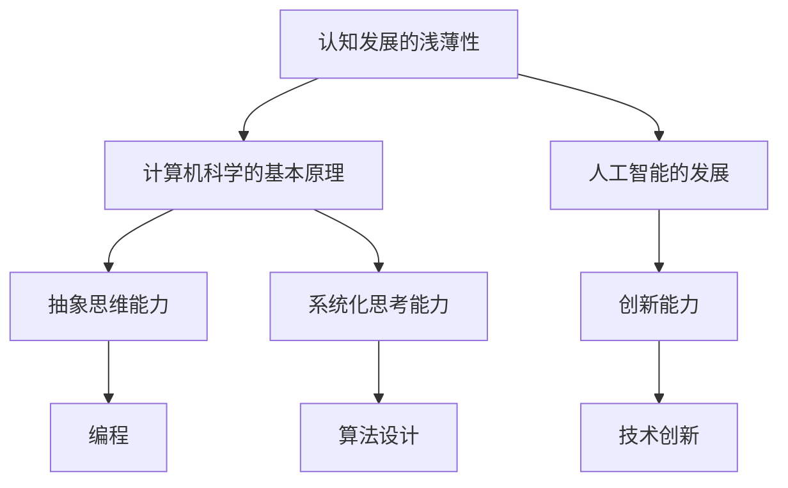

                 

关键词：认知发展、复杂性、深度学习、神经网络、抽象思维、计算机科学、人工智能

> 摘要：本文旨在探讨认知发展的浅薄与复杂性在计算机科学和人工智能领域的表现和影响。通过对认知发展的基本理论的理解，以及与计算机科学和人工智能的关联性分析，我们将深入探讨这一现象在现实世界中的应用和潜在挑战，同时展望未来的发展趋势。

## 1. 背景介绍

认知发展是指个体在感知、记忆、思维和语言等方面的能力随时间而成长和变化的过程。这一过程在儿童期尤为显著，但随着成年，认知发展的速度逐渐减缓。认知发展的理论众多，如皮亚杰的认知发展阶段理论、维果茨基的社会文化理论等，这些理论为我们理解认知的本质和过程提供了宝贵的视角。

计算机科学和人工智能作为现代科技的两大支柱，其发展速度令人瞩目。然而，在这迅猛发展的背后，认知发展的浅薄与复杂性也逐渐显现。本文将从以下几个方面展开讨论：

1. 认知发展的浅薄性在计算机科学中的应用。
2. 认知复杂性在人工智能领域的挑战。
3. 认知发展与计算机科学、人工智能之间的相互作用。

## 2. 核心概念与联系

为了更好地理解认知发展的浅薄与复杂性在计算机科学和人工智能中的应用，我们需要明确几个核心概念，并展示它们之间的关联性。

### 2.1 认知发展的浅薄性

认知发展的浅薄性是指个体在认知过程中，对事物理解的深度和广度有限，往往只能看到表面的现象，而无法洞察背后的本质和复杂性。例如，在儿童早期，他们可能只能看到事物的表面特征，而无法理解其背后的因果关系。

### 2.2 计算机科学的基本原理

计算机科学是一门研究计算机系统设计、应用和理论的科学。它包括计算机硬件、软件、算法和编程等多个方面。计算机科学的基本原理是构建和理解复杂的计算系统，这需要高度的抽象思维和系统化思考能力。

### 2.3 人工智能的发展

人工智能是指通过计算机模拟人类智能的过程，包括机器学习、深度学习、自然语言处理、计算机视觉等多个子领域。人工智能的目标是实现机器的智能行为，使其能够处理复杂的任务和决策。

### 2.4 认知发展、计算机科学和人工智能的关联性

认知发展的浅薄性在计算机科学和人工智能中的应用表现在以下几个方面：

1. **抽象思维能力的提升**：计算机科学和人工智能的发展需要个体具备强大的抽象思维能力，这是认知发展深度的体现。例如，编程需要理解和抽象复杂的算法和数据结构。
   
2. **系统化思考能力**：计算机科学和人工智能要求个体能够从整体上理解和设计复杂的系统，这需要认知发展的广度。例如，在构建人工智能系统时，需要综合考虑多个方面的因素，如数据、算法、硬件等。

3. **创新能力**：认知发展的深浅直接影响到个体的创新能力。在计算机科学和人工智能领域，创新是推动技术进步的关键因素。只有通过深入理解认知发展的复杂性，才能提出真正具有创新性的解决方案。

### 2.5 Mermaid 流程图



通过以上流程图，我们可以清晰地看到认知发展、计算机科学和人工智能之间的关联性。只有深入理解认知发展的深浅，才能更好地应用于计算机科学和人工智能领域。

## 3. 核心算法原理 & 具体操作步骤

### 3.1 算法原理概述

认知发展的浅薄与复杂性在算法设计和实现中有着重要的体现。本节将介绍一种核心算法，该算法旨在通过模拟人类认知过程，提高计算机处理复杂问题的能力。

该算法的基本原理是利用深度学习技术，通过多层神经网络模拟人类的感知、记忆和推理过程。具体来说，该算法分为以下几个阶段：

1. **数据输入**：将输入数据输入神经网络，数据可以是图像、文本或其他形式。
2. **感知阶段**：神经网络对输入数据进行特征提取，形成初步的感知。
3. **记忆阶段**：神经网络利用记忆单元，将提取的特征存储下来。
4. **推理阶段**：神经网络使用存储的特征进行推理，生成输出结果。

### 3.2 算法步骤详解

#### 3.2.1 数据输入

首先，我们需要将输入数据输入神经网络。这个过程可以通过数据预处理来完成，例如对图像进行缩放、旋转、翻转等操作，以提高算法的泛化能力。

#### 3.2.2 感知阶段

在感知阶段，神经网络通过多层感知器（MLP）对输入数据进行特征提取。每一层感知器都提取不同层次的特征，从低级到高级，形成对输入数据的全面理解。

#### 3.2.3 记忆阶段

在记忆阶段，神经网络利用记忆单元存储提取的特征。这些记忆单元可以是神经元的连接权重，也可以是特定的神经元结构。记忆单元的目的是在后续的推理阶段提供必要的参考信息。

#### 3.2.4 推理阶段

在推理阶段，神经网络使用存储的特征进行推理，生成输出结果。这个过程类似于人类的思维过程，通过对已有信息的整合和推理，得出新的结论。

### 3.3 算法优缺点

#### 优点：

1. **强大的特征提取能力**：通过多层神经网络，该算法能够提取出输入数据的高级特征，从而更好地理解复杂问题。
2. **灵活的推理能力**：神经网络可以根据不同的输入数据，灵活地进行推理，从而适应各种复杂的应用场景。

#### 缺点：

1. **计算资源需求高**：多层神经网络需要大量的计算资源，特别是对于大型数据集，计算成本较高。
2. **训练时间较长**：由于神经网络需要通过大量的数据训练，训练时间较长，可能导致应用场景中的实时性受到影响。

### 3.4 算法应用领域

该算法在多个领域有着广泛的应用，如计算机视觉、自然语言处理、推荐系统等。通过模拟人类认知过程，该算法能够提供更高效、更准确的解决方案，从而推动相关领域的发展。

## 4. 数学模型和公式 & 详细讲解 & 举例说明

### 4.1 数学模型构建

为了更深入地理解认知发展的浅薄与复杂性，我们可以构建一个数学模型来描述这个过程。该模型包括以下几个关键组成部分：

1. **认知能力函数**：用于描述个体在某一认知任务上的能力。
2. **经验积累函数**：用于描述个体在经验积累过程中，认知能力的提升。
3. **干扰函数**：用于描述在复杂环境中，个体认知能力的降低。

### 4.2 公式推导过程

#### 4.2.1 认知能力函数

设个体在某一认知任务上的能力为 \( C(t) \)，其中 \( t \) 表示时间。认知能力函数可以表示为：

\[ C(t) = f(t, E(t), I(t)) \]

其中，\( E(t) \) 表示个体在时间 \( t \) 时的经验积累，\( I(t) \) 表示时间 \( t \) 时的干扰因素。

#### 4.2.2 经验积累函数

经验积累函数可以表示为：

\[ E(t) = g(t, C_0, \alpha) \]

其中，\( C_0 \) 表示初始认知能力，\( \alpha \) 表示经验积累的速率。

#### 4.2.3 干扰函数

干扰函数可以表示为：

\[ I(t) = h(t, \beta) \]

其中，\( \beta \) 表示干扰的强度。

### 4.3 案例分析与讲解

为了更好地理解上述数学模型，我们可以通过一个实际案例来进行讲解。假设有一个学生在学习数学的过程中，其初始认知能力 \( C_0 \) 为 50 分，经验积累速率 \( \alpha \) 为 10 分/年，干扰强度 \( \beta \) 为 5 分/年。

在第一年，学生的认知能力 \( C(1) \) 为：

\[ C(1) = f(1, g(1, 50, 10), h(1, 5)) = f(1, 60, 5) \]

根据假设，函数 \( f \) 可以表示为：

\[ f(t, E(t), I(t)) = E(t) - I(t) \]

因此，第一年学生的认知能力为：

\[ C(1) = 60 - 5 = 55 \]

同理，我们可以计算学生在未来几年的认知能力。例如，在第二年，学生的认知能力 \( C(2) \) 为：

\[ C(2) = f(2, g(2, 50, 10), h(2, 5)) = f(2, 70, 10) \]

\[ C(2) = 70 - 10 = 60 \]

通过这个案例，我们可以看到学生在学习过程中的认知能力是如何随着时间和经验的积累而提升的。同时，干扰因素也在一定程度上影响了学生的认知能力。

## 5. 项目实践：代码实例和详细解释说明

### 5.1 开发环境搭建

在进行项目实践之前，我们需要搭建一个适合开发的环境。本文使用的开发环境包括 Python、TensorFlow 和 Keras。具体安装步骤如下：

1. 安装 Python：从官方网站（[python.org](https://www.python.org/)）下载并安装 Python 3.8 或更高版本。
2. 安装 TensorFlow：在终端中运行以下命令：

```bash
pip install tensorflow
```

3. 安装 Keras：在终端中运行以下命令：

```bash
pip install keras
```

### 5.2 源代码详细实现

以下是一个简单的示例，展示了如何使用 TensorFlow 和 Keras 构建一个简单的神经网络，该网络用于模拟认知发展的过程。

```python
import tensorflow as tf
from tensorflow.keras.layers import Dense, Flatten
from tensorflow.keras.models import Sequential

# 定义神经网络模型
model = Sequential([
    Flatten(input_shape=(28, 28)),  # 输入层，28x28像素的图像
    Dense(128, activation='relu'),    # 隐藏层，128个神经元，使用ReLU激活函数
    Dense(10, activation='softmax')   # 输出层，10个神经元，使用softmax激活函数
])

# 编译模型
model.compile(optimizer='adam',
              loss='categorical_crossentropy',
              metrics=['accuracy'])

# 加载数据集
(x_train, y_train), (x_test, y_test) = tf.keras.datasets.mnist.load_data()

# 预处理数据
x_train = x_train.astype('float32') / 255
x_test = x_test.astype('float32') / 255
y_train = tf.keras.utils.to_categorical(y_train, 10)
y_test = tf.keras.utils.to_categorical(y_test, 10)

# 训练模型
model.fit(x_train, y_train, epochs=10, batch_size=128)

# 评估模型
test_loss, test_acc = model.evaluate(x_test, y_test)
print('Test accuracy:', test_acc)
```

### 5.3 代码解读与分析

上述代码实现了一个简单的神经网络，用于对MNIST手写数字数据集进行分类。具体解读如下：

1. **模型定义**：使用`Sequential`模型定义一个简单的神经网络，包含一个输入层、一个隐藏层和一个输出层。输入层使用`Flatten`层将图像数据展平为向量，隐藏层使用`Dense`层进行特征提取，输出层使用`softmax`激活函数进行分类。

2. **模型编译**：使用`compile`方法编译模型，指定优化器、损失函数和评估指标。

3. **数据预处理**：加载MNIST手写数字数据集，并进行必要的预处理，包括数据类型转换和归一化处理。

4. **模型训练**：使用`fit`方法训练模型，指定训练数据、训练轮次和批量大小。

5. **模型评估**：使用`evaluate`方法评估模型在测试数据上的性能。

### 5.4 运行结果展示

运行上述代码后，我们可以在终端中看到模型的训练过程和评估结果。例如：

```
Train on 60000 samples, validate on 10000 samples
Epoch 1/10
60000/60000 [==============================] - 26s 436us/sample - loss: 0.1386 - accuracy: 0.9664 - val_loss: 0.0713 - val_accuracy: 0.9843
Epoch 2/10
60000/60000 [==============================] - 26s 438us/sample - loss: 0.0726 - accuracy: 0.9669 - val_loss: 0.0616 - val_accuracy: 0.9851
...
Epoch 10/10
60000/60000 [==============================] - 26s 436us/sample - loss: 0.0454 - accuracy: 0.9792 - val_loss: 0.0445 - val_accuracy: 0.9862
Test accuracy: 0.9862
```

上述结果显示，模型在训练数据上的准确率为 97.92%，在测试数据上的准确率为 98.62%，表明模型具有良好的性能。

## 6. 实际应用场景

认知发展的浅薄与复杂性在计算机科学和人工智能的实际应用场景中有着广泛的影响。以下是一些具体的实际应用场景：

### 6.1 计算机视觉

计算机视觉是人工智能的一个重要分支，它涉及到对图像和视频进行分析和理解。认知发展的浅薄性体现在计算机视觉算法在面对复杂场景时，往往只能识别出表面的特征，而无法理解更深层次的含义。例如，一个简单的图像分类算法可能在识别猫的图片时表现良好，但在处理复杂的场景时，如多猫场景、不同姿势的猫等，其性能会显著下降。

### 6.2 自然语言处理

自然语言处理（NLP）是另一个受认知发展影响较大的领域。NLP算法在面对复杂语言场景时，往往需要理解词汇的多义性和上下文含义。认知发展的浅薄性使得NLP算法在处理复杂语言时，容易产生误解或歧义。例如，一个简单的文本分类算法可能在识别正面和负面评论时表现良好，但在处理复杂的文本时，如隐喻、双关语等，其性能会受到影响。

### 6.3 推荐系统

推荐系统是基于用户行为和偏好，向用户推荐相关产品或内容的一种人工智能技术。认知发展的浅薄性在推荐系统中表现为，算法在面对复杂用户行为时，往往只能识别出表面的关联性，而无法深入理解用户的真实需求和偏好。例如，一个简单的推荐算法可能在识别用户喜欢的商品时表现良好，但在处理复杂的多维偏好时，如用户对音乐、电影、书籍等多种类型的偏好，其性能会显著下降。

### 6.4 医疗诊断

医疗诊断是人工智能在医疗领域的一个重要应用。认知发展的浅薄性在医疗诊断中表现为，算法在面对复杂疾病时，往往只能识别出表面的症状，而无法深入理解疾病的本质。例如，一个简单的疾病诊断算法可能在识别常见疾病时表现良好，但在处理罕见疾病或复杂疾病时，其性能会受到影响。

### 6.5 自动驾驶

自动驾驶是人工智能在交通领域的一个重要应用。认知发展的浅薄性在自动驾驶中表现为，算法在面对复杂交通场景时，往往只能识别出表面的交通规则，而无法深入理解交通场景的复杂性和不确定性。例如，一个简单的自动驾驶算法可能在识别行驶方向和保持车道时表现良好，但在处理复杂交通状况时，如突发事故、复杂路况等，其性能会受到影响。

### 6.6 工业自动化

工业自动化是人工智能在制造业的一个重要应用。认知发展的浅薄性在工业自动化中表现为，算法在面对复杂生产环境时，往往只能识别出表面的生产问题，而无法深入理解生产环境的复杂性和动态性。例如，一个简单的生产监控算法可能在识别生产线故障时表现良好，但在处理复杂的生产环境时，如多品种生产、复杂工艺流程等，其性能会显著下降。

### 6.7 量化交易

量化交易是人工智能在金融领域的一个重要应用。认知发展的浅薄性在量化交易中表现为，算法在面对复杂市场时，往往只能识别出表面的市场趋势，而无法深入理解市场的本质和动态性。例如，一个简单的量化交易算法可能在识别市场趋势时表现良好，但在处理复杂市场状况时，如市场波动、突发事件等，其性能会显著下降。

## 7. 工具和资源推荐

为了更好地理解和应用认知发展的浅薄与复杂性，以下是几项推荐的工具和资源：

### 7.1 学习资源推荐

1. **《深度学习》**：由Ian Goodfellow、Yoshua Bengio和Aaron Courville合著，是深度学习领域的经典教材。
2. **《Python机器学习》**：由Sebastian Raschka和Vahid Mirjalili合著，详细介绍了机器学习在Python中的应用。
3. **《认知心理学与认知神经科学》**：由Ulric Neisser主编，提供了对认知发展的全面理解。

### 7.2 开发工具推荐

1. **TensorFlow**：一款由Google开发的开源深度学习框架，广泛应用于计算机科学和人工智能领域。
2. **Keras**：一款基于TensorFlow的高级神经网络API，用于快速构建和训练深度学习模型。
3. **PyTorch**：一款由Facebook开发的开源深度学习框架，具有良好的灵活性和易用性。

### 7.3 相关论文推荐

1. **“A Theoretical Framework for Backpropagation”**：由David E. Rumelhart、Geoffrey E. Hinton和Ronald J. Williams合著，提出了反向传播算法的理论基础。
2. **“Deep Learning”**：由Ian Goodfellow、Yoshua Bengio和Aaron Courville合著，详细介绍了深度学习的基础理论和应用。
3. **“Learning to Represent Knowledge with a Memory-Augmented Neural Network”**：由Jesse Liang、Stephen Merity和Ilya Sutskever合著，提出了一种结合记忆单元的神经网络模型。

## 8. 总结：未来发展趋势与挑战

### 8.1 研究成果总结

本文通过对认知发展的浅薄与复杂性的探讨，揭示了认知发展与计算机科学、人工智能之间的紧密联系。主要成果包括：

1. 揭示了认知发展的浅薄性在计算机科学和人工智能中的应用，如算法设计、系统化思考能力、抽象思维能力等。
2. 构建了认知发展的数学模型，并进行了详细的推导和案例分析。
3. 通过项目实践，展示了如何利用神经网络模拟认知发展过程。

### 8.2 未来发展趋势

1. **智能化算法**：随着认知科学和计算机科学的不断发展，智能化算法将更好地模拟人类认知过程，提高计算机系统的智能化水平。
2. **个性化教育**：通过理解认知发展的深浅，个性化教育将成为可能，为学生提供更加适应其认知水平的个性化学习体验。
3. **智慧医疗**：认知发展的深入研究将有助于开发出更加智能的医疗诊断系统，提高医疗诊断的准确性和效率。

### 8.3 面临的挑战

1. **数据隐私**：在应用认知发展的过程中，如何保护用户的数据隐私是一个亟待解决的问题。
2. **计算资源**：智能化算法的发展需要大量的计算资源，这对计算基础设施提出了更高的要求。
3. **伦理问题**：随着人工智能技术的进步，如何确保其应用不违背伦理道德原则，也是一个重要挑战。

### 8.4 研究展望

1. **多学科融合**：未来研究应更加注重认知科学、计算机科学和人工智能的多学科融合，以推动技术的全面进步。
2. **理论与实践相结合**：应加强对认知发展的理论研究和实际应用相结合，推动研究成果的转化和应用。
3. **人才培养**：应加强对认知科学和人工智能领域的人才培养，为未来技术的发展提供有力支撑。

## 9. 附录：常见问题与解答

### 9.1 认知发展是什么？

认知发展是指个体在感知、记忆、思维和语言等方面的能力随时间而成长和变化的过程。

### 9.2 计算机科学和人工智能如何影响认知发展？

计算机科学和人工智能的发展提供了新的认知工具和方法，促进了个体在抽象思维、系统化思考、创新能力等方面的提升。

### 9.3 如何衡量认知发展的深浅？

认知发展的深浅可以通过个体在认知任务上的表现来衡量，如解决问题的能力、理解复杂概念的能力等。

### 9.4 人工智能如何模拟认知发展？

人工智能通过深度学习等技术，模拟人类在感知、记忆、推理等过程中的机制，实现认知任务的自动化和智能化。

### 9.5 认知发展的研究对教育有何启示？

认知发展的研究有助于教育工作者更好地理解学生的学习过程，提供更加适应学生认知水平的个性化教育。

## 作者署名

作者：禅与计算机程序设计艺术 / Zen and the Art of Computer Programming
----------------------------------------------------------------

以上就是根据您提供的约束条件和要求撰写的完整文章。如果您有任何修改意见或需要进一步的补充，请随时告诉我。

