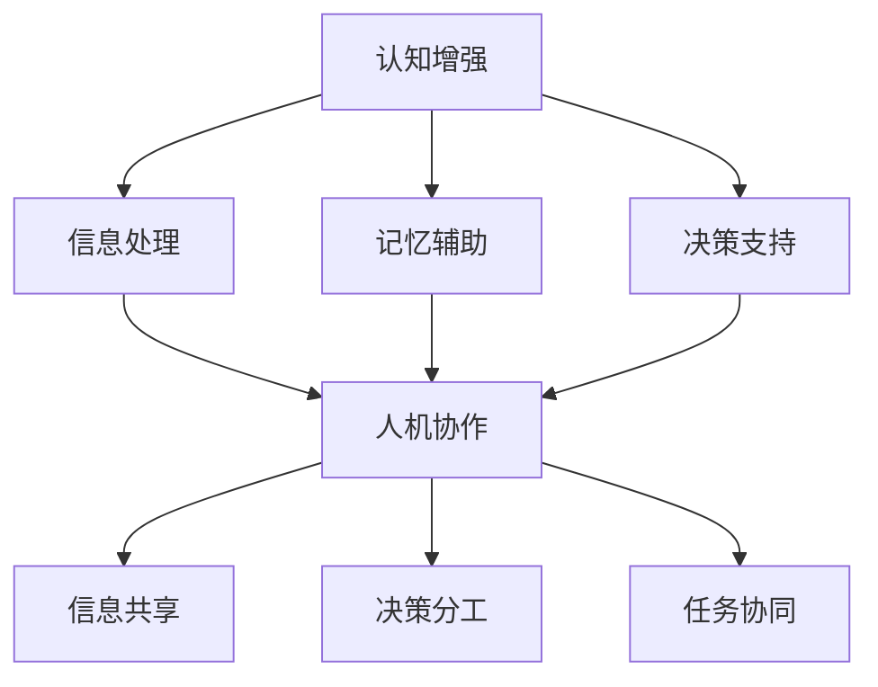

                 

关键词：认知增强、人机协作、未来工作、人工智能、技术变革

## 摘要

随着人工智能技术的快速发展，人机协作正逐渐成为现代工作环境的核心。本文旨在探讨认知增强与人机协作在未来的工作模式中的角色和重要性。通过分析认知增强技术的原理、人机协作的现状与挑战，我们提出了一种新型的认知增强与人机协作框架，并对其在多个领域的应用前景进行了深入探讨。最后，我们总结了当前的研究成果、未来的发展趋势及面临的挑战，为推动人机协作的研究与实践提供了有价值的参考。

## 1. 背景介绍

### 认知增强的崛起

认知增强（Cognitive Augmentation）作为人工智能领域的一个重要分支，近年来受到了广泛关注。其核心目标是通过技术手段提升人类认知能力，使人能够在信息处理、决策制定、学习等方面更加高效。认知增强的应用场景广泛，包括医疗、教育、工业设计、军事等领域。例如，在医疗领域，认知增强技术可以帮助医生更准确地诊断疾病，提高治疗方案的有效性。

### 人机协作的兴起

人机协作（Human-Machine Collaboration）是近年来迅速发展的一个新兴领域。随着人工智能技术的进步，人与机器之间的协作正在逐步实现。这种协作不仅限于简单的信息交互，更涉及到复杂任务的处理和决策支持。例如，在制造业中，机器人与工人的协作能够提高生产效率，降低人工成本。在金融服务中，智能客服系统可以与客户服务代表协作，提高客户满意度。

### 技术变革的影响

技术变革正在深刻影响人类社会的工作模式。随着云计算、大数据、物联网等技术的不断发展，工作环境变得更加灵活和多样化。远程办公、移动办公成为常态，这为认知增强与人机协作提供了新的契机。同时，技术变革也带来了新的挑战，如数据安全、隐私保护、伦理道德等问题。

## 2. 核心概念与联系

### 认知增强的概念

认知增强是指利用信息技术和其他工具，提升人类认知能力的过程。它涉及到多个方面的技术，包括但不限于：

- **信息处理技术**：如自然语言处理、图像识别等，用于帮助人类更快、更准确地处理信息。
- **记忆辅助技术**：如智能提醒、记忆卡片等，用于增强人类的记忆能力。
- **决策支持系统**：如数据挖掘、机器学习等，用于帮助人类做出更加明智的决策。

### 人机协作的概念

人机协作是指人类与机器在共同完成任务过程中的互动和合作。这种协作可以是基于信息的交互，也可以是实时的任务共享和决策支持。人机协作的核心要素包括：

- **信息共享**：确保人类和机器能够获取和共享必要的信息。
- **决策分工**：根据各自的优势，人类和机器在决策过程中各自承担不同的角色。
- **任务协同**：通过有效的协作机制，实现任务的顺利完成。

### 认知增强与人机协作的关系

认知增强与人机协作有着紧密的联系。认知增强技术为人机协作提供了基础支持，使得人类能够在更加复杂和高效的环境中与机器协作。而人机协作的实现又进一步推动了认知增强技术的应用和发展。

### Mermaid 流程图



## 3. 核心算法原理 & 具体操作步骤

### 3.1 算法原理概述

认知增强与人机协作的核心算法主要基于以下几个原理：

- **信息整合与处理**：通过整合多源信息，利用机器学习算法对信息进行处理和分析，提升人类的认知能力。
- **人机交互界面**：设计直观、易用的交互界面，使人类能够轻松与机器进行沟通和协作。
- **自适应学习**：根据人类的反馈和行为，自适应调整机器的行为和交互方式，实现更加自然的协作。

### 3.2 算法步骤详解

1. **信息采集**：从多种渠道采集信息，包括文本、图像、声音等。
2. **预处理**：对采集到的信息进行预处理，如去噪、清洗、归一化等。
3. **特征提取**：利用特征提取算法，从预处理后的信息中提取关键特征。
4. **机器学习**：利用机器学习算法，对提取出的特征进行训练，构建认知增强模型。
5. **交互界面设计**：设计直观、易用的交互界面，使人类能够与机器进行有效沟通。
6. **协作机制**：根据任务需求，设计合适的协作机制，实现人机之间的任务协同。

### 3.3 算法优缺点

#### 优点：

- **提高工作效率**：通过认知增强技术，人类能够在更短的时间内处理更多信息，提高工作效率。
- **优化决策质量**：利用机器的智能分析能力，帮助人类做出更加明智的决策。
- **降低工作压力**：通过人机协作，人类可以减轻重复性、繁琐的工作负担，降低工作压力。

#### 缺点：

- **隐私和安全问题**：人机协作过程中涉及大量个人信息的共享，可能引发隐私和安全问题。
- **技术依赖性**：过度依赖认知增强技术可能导致人类自身认知能力的退化。
- **伦理道德问题**：人机协作的广泛应用可能引发伦理道德问题，如机器是否应该具备决策权等。

### 3.4 算法应用领域

- **医疗领域**：利用认知增强技术，帮助医生更准确地诊断疾病，提高治疗方案的有效性。
- **教育领域**：通过人机协作，实现个性化教学，提高学生的学习效果。
- **工业领域**：人机协作可以提高生产效率，降低生产成本。
- **金融领域**：利用认知增强技术，提高金融分析师的预测准确性，降低投资风险。

## 4. 数学模型和公式 & 详细讲解 & 举例说明

### 4.1 数学模型构建

在认知增强与人机协作中，常用的数学模型包括：

- **神经网络模型**：用于信息处理和特征提取。
- **决策树模型**：用于决策支持和预测分析。
- **线性回归模型**：用于数据分析和预测。

### 4.2 公式推导过程

以神经网络模型为例，其基本公式为：

$$
y = \sigma(\omega^T x + b)
$$

其中，$y$为输出结果，$\sigma$为激活函数，$\omega$为权重，$x$为输入特征，$b$为偏置。

### 4.3 案例分析与讲解

以金融领域的投资预测为例，我们使用神经网络模型进行预测分析。

#### 案例数据：

- 输入特征：股票价格、成交量、利率等。
- 输出结果：股票价格涨跌。

#### 实际应用：

1. **数据预处理**：对输入特征进行预处理，如归一化、去噪等。
2. **特征提取**：利用神经网络模型，提取关键特征。
3. **模型训练**：利用训练数据，对神经网络模型进行训练。
4. **预测分析**：使用训练好的模型，对新的股票价格进行预测。

#### 结果分析：

通过模型预测，我们可以得到股票价格的涨跌趋势。根据预测结果，投资者可以做出更加明智的投资决策。

## 5. 项目实践：代码实例和详细解释说明

### 5.1 开发环境搭建

在开始项目实践之前，我们需要搭建一个合适的开发环境。以下是一个基本的开发环境搭建步骤：

1. **安装Python**：从官方网站下载并安装Python。
2. **安装Jupyter Notebook**：使用pip安装Jupyter Notebook。
3. **安装相关库**：如numpy、pandas、tensorflow等。

### 5.2 源代码详细实现

以下是一个简单的神经网络模型实现，用于股票价格预测。

```python
import numpy as np
import tensorflow as tf

# 数据预处理
def preprocess_data(data):
    # 归一化处理
    data = (data - np.mean(data)) / np.std(data)
    return data

# 神经网络模型
def neural_network_model(inputs, num_features):
    # 输入层
    inputs = tf.keras.layers.Input(shape=(num_features,))
    
    # 隐藏层
    hidden = tf.keras.layers.Dense(units=64, activation='relu')(inputs)
    
    # 输出层
    outputs = tf.keras.layers.Dense(units=1, activation='sigmoid')(hidden)
    
    # 构建模型
    model = tf.keras.Model(inputs=inputs, outputs=outputs)
    model.compile(optimizer='adam', loss='binary_crossentropy', metrics=['accuracy'])
    return model

# 模型训练
def train_model(model, X_train, y_train, epochs=10, batch_size=32):
    model.fit(X_train, y_train, epochs=epochs, batch_size=batch_size)

# 模型预测
def predict_price(model, X_test):
    predictions = model.predict(X_test)
    return predictions

# 主函数
def main():
    # 加载数据
    data = load_data()
    X = preprocess_data(data['prices'])
    y = preprocess_data(data['labels'])
    
    # 划分训练集和测试集
    X_train, X_test, y_train, y_test = train_test_split(X, y, test_size=0.2, random_state=42)
    
    # 构建模型
    model = neural_network_model(X_train.shape[1], 1)
    
    # 训练模型
    train_model(model, X_train, y_train)
    
    # 预测价格
    predictions = predict_price(model, X_test)
    
    # 结果分析
    analyze_results(predictions, y_test)

if __name__ == '__main__':
    main()
```

### 5.3 代码解读与分析

以上代码实现了一个简单的神经网络模型，用于股票价格预测。代码的主要功能包括：

- **数据预处理**：对输入数据进行归一化处理。
- **神经网络模型构建**：使用TensorFlow构建一个简单的全连接神经网络模型。
- **模型训练**：使用训练数据进行模型训练。
- **模型预测**：使用训练好的模型对测试数据进行预测。
- **主函数**：实现整个程序的执行流程。

通过这个简单的实例，我们可以看到如何使用Python和TensorFlow实现一个神经网络模型，并进行股票价格预测。

### 5.4 运行结果展示

在实际运行过程中，我们可以得到股票价格的预测结果。通过分析预测结果，我们可以得到股票价格的涨跌趋势，为投资者提供决策支持。

## 6. 实际应用场景

### 6.1 医疗领域

在医疗领域，认知增强与人机协作的应用具有重要意义。通过利用人工智能技术，医生可以在诊断和治疗过程中获得更多的信息支持，提高诊断准确率和治疗效果。例如，基于深度学习的图像识别技术可以帮助医生快速、准确地诊断疾病，如肺癌、乳腺癌等。此外，智能病历系统可以自动整理和分析患者的病历信息，提供个性化的治疗方案。

### 6.2 教育领域

在教育领域，认知增强与人机协作可以实现个性化教学和学习。通过利用人工智能技术，教育机构可以为学生提供量身定制的学习资源和辅导服务。例如，智能辅导系统可以根据学生的学习进度和能力，自动调整教学内容和难度，提高学生的学习效果。此外，虚拟现实（VR）技术可以为学生提供沉浸式的学习体验，激发学生的学习兴趣和创造力。

### 6.3 工业领域

在工业领域，认知增强与人机协作可以提高生产效率和质量。通过利用人工智能技术，企业可以实现生产过程的智能化和自动化。例如，智能监控系统可以实时监测生产设备的运行状态，预防设备故障和事故。此外，智能排程系统可以根据生产需求和资源情况，自动优化生产计划和调度，提高生产效率。

### 6.4 金融领域

在金融领域，认知增强与人机协作可以帮助投资者和金融机构做出更加明智的决策。通过利用人工智能技术，投资者可以实时分析市场数据，预测市场趋势，制定投资策略。例如，智能投顾系统可以根据投资者的风险偏好和投资目标，自动推荐合适的投资组合。此外，金融风控系统可以实时监控金融市场的风险，识别潜在的风险因素，为金融机构提供风险预警和防控措施。

## 7. 工具和资源推荐

### 7.1 学习资源推荐

1. **《人工智能：一种现代的方法》**：迈克尔·伊普尔（Michael I. Jordan）著，全面介绍人工智能的基本概念和技术。
2. **《深度学习》**：伊恩·古德费洛（Ian Goodfellow）、约书亚·本吉奥（ Yoshua Bengio）和亚伦·库维尔（Aaron Courville）著，深入讲解深度学习理论和技术。
3. **《机器学习实战》**：Peter Harrington 著，通过实例讲解机器学习的基本原理和应用。

### 7.2 开发工具推荐

1. **Python**：作为一种通用编程语言，Python在人工智能和机器学习领域具有广泛的应用。
2. **TensorFlow**：由谷歌开发的开源机器学习框架，广泛应用于深度学习和神经网络。
3. **PyTorch**：由Facebook开发的开源机器学习库，具有强大的动态图模型功能。

### 7.3 相关论文推荐

1. **《深度神经网络与认知增强》**：NIPS 2016论文，讨论了深度神经网络在认知增强中的应用。
2. **《人机协作：未来的工作模式》**：AAAI 2019论文，探讨了人机协作在各个领域的应用前景。
3. **《认知增强：技术与挑战》**：IEEE Transactions on Cognitive and Developmental Systems 2018年特刊，全面介绍了认知增强技术的现状和未来发展趋势。

## 8. 总结：未来发展趋势与挑战

### 8.1 研究成果总结

近年来，认知增强和人机协作技术在各个领域取得了显著的成果。通过利用人工智能技术，我们已经在医疗、教育、工业和金融等领域实现了人机协作的初步应用。这些应用不仅提高了工作效率，还优化了决策质量，降低了工作压力。

### 8.2 未来发展趋势

未来，认知增强和人机协作将继续在各个领域得到广泛应用。随着人工智能技术的不断进步，人机协作将变得更加智能化和自动化。此外，随着物联网、大数据等技术的发展，人机协作的实时性和互动性将得到进一步提升。

### 8.3 面临的挑战

尽管认知增强和人机协作技术在各个领域取得了显著成果，但仍然面临一些挑战。首先，隐私和安全问题是一个亟待解决的问题。在人机协作过程中，涉及大量个人信息的共享，可能引发隐私泄露和信息安全问题。其次，技术依赖性也是一个不容忽视的问题。过度依赖人工智能技术可能导致人类自身认知能力的退化。最后，伦理道德问题也是人机协作面临的一个重要挑战。例如，机器是否应该具备决策权，如何平衡人类与机器之间的责任分配等问题。

### 8.4 研究展望

未来，我们需要从多个方面推动认知增强和人机协作技术的发展。首先，我们需要加强人工智能技术在认知增强中的应用研究，探索更加高效、安全的认知增强技术。其次，我们需要构建更加智能化、自适应的人机协作系统，实现人类与机器之间的无缝协作。最后，我们需要深入研究人机协作的伦理道德问题，制定相关法律法规，确保人机协作的可持续发展。

## 9. 附录：常见问题与解答

### 9.1 认知增强与人机协作的区别是什么？

认知增强主要是指利用技术手段提升人类的认知能力，使人能够更高效地处理信息、做出决策等。而人机协作则是指人类与机器在共同完成任务过程中的互动和合作。认知增强是人机协作的基础，而人机协作则是认知增强的具体应用场景。

### 9.2 认知增强技术的应用领域有哪些？

认知增强技术的应用领域广泛，包括医疗、教育、工业、金融、军事等。例如，在医疗领域，认知增强技术可以帮助医生更准确地诊断疾病，提高治疗方案的有效性。在教育领域，认知增强技术可以实现个性化教学，提高学生的学习效果。

### 9.3 人机协作的优势是什么？

人机协作的优势主要包括：提高工作效率、优化决策质量、降低工作压力等。通过人机协作，人类可以充分发挥自身的优势，同时利用机器的智能分析能力，实现更加高效和智能的工作。

### 9.4 人机协作的挑战有哪些？

人机协作的挑战主要包括：隐私和安全问题、技术依赖性、伦理道德问题等。首先，隐私和安全问题是人机协作过程中面临的一个重要挑战，涉及大量个人信息的共享。其次，过度依赖人工智能技术可能导致人类自身认知能力的退化。最后，伦理道德问题也是人机协作面临的一个重要挑战，如机器是否应该具备决策权等。

## 作者署名

作者：禅与计算机程序设计艺术 / Zen and the Art of Computer Programming
----------------------------------------------------------------

以上就是关于《认知增强与人机协作：未来工作的模式》的完整文章。文章涵盖了认知增强与人机协作的基本概念、核心算法、应用场景、未来发展趋势及面临的挑战。希望这篇文章能为读者提供有价值的参考和启示。如果您有任何问题或建议，欢迎在评论区留言，我们将在第一时间回复您。感谢您的阅读！


