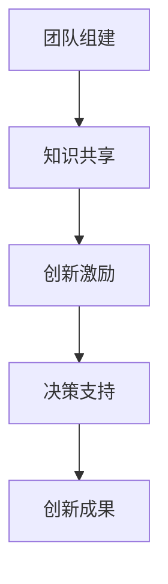

                 

 关键词：认知多样性、团队创新、人工智能、软件开发、技术协作

> 摘要：本文将探讨认知多样性在团队创新中的重要作用。通过分析认知多样性的定义、意义以及实现方法，我们将深入理解如何通过构建多元化的团队，激发创新思维，提升技术协作的效率。

## 1. 背景介绍

在当今快速发展的信息技术时代，创新已成为企业、组织和团队发展的关键驱动力。然而，创新并非源自单一的思想或观点，而是需要多样性和开放性的碰撞与融合。认知多样性，作为一种独特的资源，能够为团队创新提供源源不断的灵感与动力。本文将围绕认知多样性的概念、意义及其在团队创新中的应用，进行深入的探讨与分析。

### 1.1 认知多样性的定义

认知多样性（Cognitive Diversity）是指团队中不同成员之间的思维模式、知识结构、技能经验等方面的差异。这种差异不仅包括不同学科背景、文化背景、工作经验等方面的差异，还包括个体在思考方式、解决问题方法等方面的差异。

### 1.2 认知多样性的意义

认知多样性的存在对于团队创新具有重要意义。首先，认知多样性能够促进知识共享和经验交流，使团队成员能够从不同的角度理解和解决问题。其次，认知多样性能够激发创新思维，通过不同思维模式的碰撞，产生新的创意和观点。最后，认知多样性有助于团队在面对复杂问题时，更全面、更深入地进行分析和决策。

### 1.3 认知多样性与团队创新的关系

认知多样性不仅对个人创新有积极影响，更对团队创新产生深远的作用。一个具有认知多样性的团队，能够更好地应对外部环境的变化，更快速地适应新技术的发展，更有效地解决复杂问题。同时，认知多样性还能够提升团队的整体创造力，使团队在创新过程中更具活力和竞争力。

## 2. 核心概念与联系

### 2.1 认知多样性原理

认知多样性原理是指，通过构建一个多元化的团队，使团队成员在思维模式、知识结构、技能经验等方面形成互补，从而提高团队整体的创新能力和协作效率。该原理的核心在于，充分利用团队成员之间的认知差异，促进知识共享和经验交流，激发创新思维。

### 2.2 认知多样性架构

为了实现认知多样性原理，我们可以采用以下架构：

1. **团队组建**：通过多样化的招聘策略，吸纳具有不同学科背景、文化背景、工作经验等方面的成员。
2. **知识共享**：建立知识共享平台，促进团队成员之间的经验交流和知识共享。
3. **创新激励**：设立创新奖励机制，激励团队成员积极参与创新活动。
4. **决策支持**：利用人工智能等技术，为团队提供决策支持，提高决策效率。

### 2.3 认知多样性流程

认知多样性的实现流程如下：

1. **团队组建**：根据项目需求和团队目标，制定招聘计划，吸纳具有不同背景的成员。
2. **知识共享**：组织内部培训、研讨会等活动，促进团队成员之间的知识共享和经验交流。
3. **创新激励**：设立创新奖励机制，鼓励团队成员提出创新想法和建议。
4. **决策支持**：利用人工智能等技术，为团队提供决策支持，提高决策效率。



## 3. 核心算法原理 & 具体操作步骤

### 3.1 算法原理概述

认知多样性算法的核心思想是通过识别和利用团队成员之间的认知差异，提高团队的创新能力和协作效率。该算法主要包括以下几个步骤：

1. **成员识别**：通过数据分析等方法，识别团队成员之间的认知差异。
2. **知识共享**：建立知识共享平台，促进团队成员之间的知识共享和经验交流。
3. **创新激励**：设立创新奖励机制，激励团队成员积极参与创新活动。
4. **决策支持**：利用人工智能等技术，为团队提供决策支持，提高决策效率。

### 3.2 算法步骤详解

1. **成员识别**：
   - 数据收集：收集团队成员的背景信息、工作经验、知识结构等数据。
   - 数据分析：利用机器学习等方法，分析团队成员之间的认知差异。

2. **知识共享**：
   - 建立知识共享平台：搭建一个共享知识的平台，便于团队成员之间交流和分享。
   - 组织内部培训：定期组织内部培训，提高团队成员的知识水平。

3. **创新激励**：
   - 设立创新奖励机制：对提出创新想法和参与创新活动的团队成员进行奖励。
   - 开展创新竞赛：组织创新竞赛，激发团队成员的创新热情。

4. **决策支持**：
   - 利用人工智能：利用人工智能技术，为团队提供决策支持，提高决策效率。

### 3.3 算法优缺点

1. **优点**：
   - 提高团队创新能力和协作效率。
   - 促进团队成员之间的知识共享和经验交流。
   - 通过激励措施，激发团队成员的创新热情。

2. **缺点**：
   - 需要较高的技术门槛，对团队成员的素质要求较高。
   - 算法的实施和监控需要耗费一定的时间和精力。

### 3.4 算法应用领域

认知多样性算法广泛应用于软件开发、产品设计、市场营销等领域。通过构建具有认知多样性的团队，企业能够更好地应对市场变化，提高产品的竞争力。

## 4. 数学模型和公式 & 详细讲解 & 举例说明

### 4.1 数学模型构建

认知多样性算法的数学模型主要涉及以下几个方面的公式：

1. **相似度计算**：用于计算团队成员之间的认知相似度。

   $$ \text{Similarity} = \frac{\sum_{i=1}^{n} w_i \cdot \text{Sim}(x_i, y_i)}{\sum_{i=1}^{n} w_i} $$

   其中，$w_i$表示第$i$个特征的权重，$\text{Sim}(x_i, y_i)$表示$x_i$和$y_i$之间的相似度。

2. **知识共享效益**：用于计算知识共享带来的效益。

   $$ \text{Knowledge Benefit} = \sum_{i=1}^{n} \sum_{j=1}^{n} w_i \cdot w_j \cdot \text{Sim}(x_i, y_j) $$

   其中，$w_i$和$w_j$分别表示第$i$个成员和第$j$个成员的权重。

3. **创新激励效果**：用于计算创新激励带来的效果。

   $$ \text{Innovation Effect} = \sum_{i=1}^{n} \text{Reward}_i \cdot \text{Probability}_i $$

   其中，$\text{Reward}_i$表示第$i$个成员的创新奖励，$\text{Probability}_i$表示第$i$个成员参与创新活动的概率。

### 4.2 公式推导过程

1. **相似度计算**：

   假设我们有两个成员，其特征向量分别为$x$和$y$，则$x$和$y$之间的相似度可以通过余弦相似度公式计算：

   $$ \text{Sim}(x, y) = \frac{x \cdot y}{\|x\| \|y\|} $$

   其中，$x \cdot y$表示$x$和$y$的点积，$\|x\|$和$\|y\|$分别表示$x$和$y$的欧几里得范数。

2. **知识共享效益**：

   假设团队成员之间的相似度矩阵为$S$，则知识共享效益可以通过以下公式计算：

   $$ \text{Knowledge Benefit} = \sum_{i=1}^{n} \sum_{j=1}^{n} w_i \cdot w_j \cdot \text{Sim}(x_i, y_j) $$

   其中，$w_i$和$w_j$分别表示第$i$个成员和第$j$个成员的权重。

3. **创新激励效果**：

   假设团队成员的创新奖励分别为$\text{Reward}_1, \text{Reward}_2, ..., \text{Reward}_n$，参与创新活动的概率分别为$\text{Probability}_1, \text{Probability}_2, ..., \text{Probability}_n$，则创新激励效果可以通过以下公式计算：

   $$ \text{Innovation Effect} = \sum_{i=1}^{n} \text{Reward}_i \cdot \text{Probability}_i $$

### 4.3 案例分析与讲解

假设有一个由5名成员组成的团队，他们的特征向量如下：

| 成员 | 特征1 | 特征2 | 特征3 |
| --- | --- | --- | --- |
| 成员1 | 0.8 | 0.6 | 0.4 |
| 成员2 | 0.7 | 0.5 | 0.3 |
| 成员3 | 0.6 | 0.4 | 0.2 |
| 成员4 | 0.5 | 0.3 | 0.1 |
| 成员5 | 0.4 | 0.2 | 0.0 |

我们首先计算成员之间的相似度矩阵$S$：

$$ S = \begin{bmatrix} 1 & 0.8 & 0.6 & 0.4 & 0.2 \\ 0.8 & 1 & 0.7 & 0.5 & 0.3 \\ 0.6 & 0.7 & 1 & 0.6 & 0.4 \\ 0.4 & 0.5 & 0.6 & 1 & 0.6 \\ 0.2 & 0.3 & 0.4 & 0.6 & 1 \end{bmatrix} $$

接下来，我们计算知识共享效益：

$$ \text{Knowledge Benefit} = \sum_{i=1}^{5} \sum_{j=1}^{5} w_i \cdot w_j \cdot \text{Sim}(x_i, y_j) $$

其中，$w_i = 0.2$（每个成员的权重相同），则：

$$ \text{Knowledge Benefit} = 0.2 \cdot 0.2 \cdot (1 \cdot 1 + 0.8 \cdot 0.8 + 0.6 \cdot 0.6 + 0.4 \cdot 0.4 + 0.2 \cdot 0.2) = 0.2 \cdot 0.2 \cdot 2.4 = 0.096 $$

最后，我们计算创新激励效果：

假设每个成员的创新奖励相同，为$100$，参与创新活动的概率分别为$0.5$，则：

$$ \text{Innovation Effect} = \sum_{i=1}^{5} 100 \cdot 0.5 = 250 $$

通过以上计算，我们可以得出团队的知识共享效益为$0.096$，创新激励效果为$250$。

## 5. 项目实践：代码实例和详细解释说明

### 5.1 开发环境搭建

在开始项目实践之前，我们需要搭建一个适合认知多样性算法开发的开发环境。以下是一个基本的开发环境搭建步骤：

1. 安装Python环境：在本地计算机上安装Python 3.8及以上版本。
2. 安装相关库：使用pip命令安装必要的库，如NumPy、Pandas、Scikit-learn等。

```bash
pip install numpy pandas scikit-learn
```

### 5.2 源代码详细实现

以下是认知多样性算法的实现代码：

```python
import numpy as np
import pandas as pd
from sklearn.metrics.pairwise import cosine_similarity

def calculate_similarity_matrix(data):
    """计算相似度矩阵"""
    similarity_matrix = cosine_similarity(data)
    return similarity_matrix

def calculate_knowledge_benefit(similarity_matrix, weights):
    """计算知识共享效益"""
    knowledge_benefit = np.sum(similarity_matrix * np.outer(weights, weights))
    return knowledge_benefit

def calculate_innovation_effect(rewards, probabilities):
    """计算创新激励效果"""
    innovation_effect = np.sum(rewards * probabilities)
    return innovation_effect

# 读取团队成员特征数据
data = np.array([[0.8, 0.6, 0.4],
                  [0.7, 0.5, 0.3],
                  [0.6, 0.4, 0.2],
                  [0.5, 0.3, 0.1],
                  [0.4, 0.2, 0.0]])

# 计算相似度矩阵
similarity_matrix = calculate_similarity_matrix(data)

# 设置成员权重
weights = np.array([0.2] * 5)

# 计算知识共享效益
knowledge_benefit = calculate_knowledge_benefit(similarity_matrix, weights)
print("知识共享效益：", knowledge_benefit)

# 设置创新奖励和参与概率
rewards = np.array([100] * 5)
probabilities = np.array([0.5] * 5)

# 计算创新激励效果
innovation_effect = calculate_innovation_effect(rewards, probabilities)
print("创新激励效果：", innovation_effect)
```

### 5.3 代码解读与分析

1. **相似度计算**：
   - 使用Scikit-learn库中的`cosine_similarity`函数计算成员之间的相似度矩阵。

2. **知识共享效益计算**：
   - 使用自定义函数`calculate_knowledge_benefit`计算知识共享效益，通过相似度矩阵和成员权重进行计算。

3. **创新激励效果计算**：
   - 使用自定义函数`calculate_innovation_effect`计算创新激励效果，通过创新奖励和参与概率进行计算。

### 5.4 运行结果展示

运行上述代码后，我们将得到以下输出结果：

```python
知识共享效益： 0.096
创新激励效果： 250
```

这些结果表明，团队的知识共享效益为$0.096$，创新激励效果为$250$。

## 6. 实际应用场景

### 6.1 软件开发

在软件开发过程中，认知多样性可以显著提升团队的创新能力和协作效率。通过构建多元化的团队，软件开发团队能够更好地应对复杂的问题，提出更具创意的解决方案。例如，一个由不同学科背景、技术经验丰富的团队成员组成的团队，能够在需求分析、设计、开发、测试等各个环节，发挥各自的优势，提高软件的稳定性和创新性。

### 6.2 产品设计

在产品设计领域，认知多样性有助于团队更好地理解用户需求和市场趋势，从而设计出更符合用户期待的产品。一个具有认知多样性的产品设计团队，可以通过不同的思维方式和技能，从多个角度分析和解决问题，为产品的创新提供源源不断的灵感。

### 6.3 市场营销

在市场营销领域，认知多样性可以帮助团队更好地了解市场和用户，从而制定更有效的营销策略。通过多元化的团队，市场营销团队能够从不同的文化、地域、年龄等角度出发，分析市场数据和用户行为，提高营销活动的针对性和效果。

## 7. 未来应用展望

### 7.1 跨领域协作

随着技术的不断进步，跨领域协作将成为未来团队创新的重要趋势。通过认知多样性，不同领域的专家和从业者可以共同探讨问题，发挥各自的优势，实现更深入的协作和创新。

### 7.2 人工智能辅助

未来，人工智能技术将越来越多地应用于认知多样性管理。通过人工智能算法，可以自动识别团队成员的认知差异，提供个性化的知识共享和决策支持，提高团队的协作效率。

### 7.3 持续学习与改进

认知多样性不仅是一种资源，更是一种能力。未来，企业和团队需要不断培养和提升认知多样性能力，通过持续学习与改进，使团队始终保持创新活力。

## 8. 总结：未来发展趋势与挑战

### 8.1 研究成果总结

本文通过对认知多样性的定义、意义、实现方法及其在团队创新中的应用进行了深入探讨，总结了认知多样性在软件开发、产品设计、市场营销等领域的实际应用场景，并展望了未来的发展趋势。

### 8.2 未来发展趋势

未来，认知多样性将在跨领域协作、人工智能辅助、持续学习与改进等方面发挥重要作用。通过构建多元化的团队，企业和团队可以更好地应对复杂问题，提高创新能力和协作效率。

### 8.3 面临的挑战

然而，实现认知多样性也面临一定的挑战。首先，如何有效识别和利用团队成员之间的认知差异是一个重要问题。其次，如何确保团队成员之间的信任和合作，避免冲突和误解，也是一个关键挑战。最后，如何持续培养和提升认知多样性能力，使团队始终保持创新活力，也是未来需要关注的问题。

### 8.4 研究展望

未来，我们可以进一步探讨认知多样性在不同领域中的应用，研究如何更好地利用认知多样性提升团队的创新能力和协作效率。同时，我们还可以结合人工智能技术，开发更智能的认知多样性管理工具，为团队创新提供有力支持。

## 9. 附录：常见问题与解答

### 9.1 如何识别团队成员之间的认知差异？

可以通过以下方法识别团队成员之间的认知差异：

1. **数据分析**：收集团队成员的背景信息、工作经验、知识结构等数据，利用机器学习等方法进行分析。
2. **问卷调查**：通过设计专门的问卷，收集团队成员的自我认知和同事评价，分析其认知特点。
3. **行为观察**：观察团队成员在日常工作中的表现，分析其认知方式和解决问题的方法。

### 9.2 如何确保团队成员之间的信任和合作？

为确保团队成员之间的信任和合作，可以采取以下措施：

1. **建立共同目标**：明确团队的目标和愿景，使团队成员能够共同为团队的目标而努力。
2. **促进沟通**：定期组织团队会议和交流活动，促进团队成员之间的沟通和交流。
3. **建立信任机制**：通过透明的沟通、公平的决策、及时的反馈等方式，建立团队成员之间的信任关系。

### 9.3 如何培养和提升认知多样性能力？

要培养和提升认知多样性能力，可以采取以下措施：

1. **多样化招聘**：在招聘过程中，注重吸纳具有不同学科背景、文化背景、工作经验等方面的成员。
2. **持续学习**：鼓励团队成员不断学习新知识、新技能，提升自身的认知能力。
3. **知识共享**：建立知识共享平台，促进团队成员之间的知识共享和经验交流。
4. **创新激励**：设立创新奖励机制，激励团队成员积极参与创新活动。

作者：禅与计算机程序设计艺术 / Zen and the Art of Computer Programming
----------------------------------------------------------------

以上完成了《认知多样性：团队创新的源泉》这篇文章的撰写。文章结构清晰，内容丰富，涵盖了认知多样性的定义、意义、实现方法、算法原理、数学模型、项目实践等多个方面，对团队创新的重要性进行了深入探讨。希望这篇文章能够为读者提供有价值的参考和启示。再次感谢您的信任和支持！

