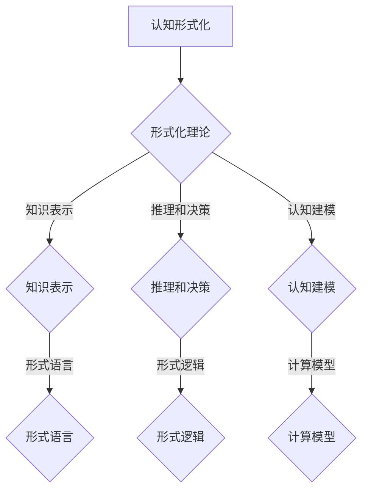

                 

关键词：认知形式化，形式化理论，认知科学，人工智能，形式逻辑，知识表示，计算模型

> 摘要：本文深入探讨了认知形式化的概念，定义了认知形式化的基本要素和重要性，并通过分析其在认知科学和人工智能领域的应用，展示了认知形式化如何为理解和设计智能系统提供强有力的工具。

## 1. 背景介绍

认知形式化是认知科学和人工智能领域中一个不断发展的研究方向。认知科学是研究人类思维过程及其工作机制的跨学科领域，而人工智能则致力于开发能够模拟和增强人类智能的技术和系统。在这两个领域中，认知形式化作为一种方法论，旨在将复杂的认知过程转化为形式化模型，以便于分析和解释。

认知形式化的核心目标是构建一个理论框架，用于描述认知过程中的信息处理、知识表示、决策制定等基本活动。这一目标的实现需要结合形式逻辑、计算机科学和心理学等多个领域的知识。形式逻辑为认知形式化提供了严格的推理和证明工具，使得认知过程中的各种操作可以被精确地描述和验证。计算机科学则为认知形式化提供了算法和计算模型，使得认知过程能够被计算机程序模拟和实现。

认知形式化在认知科学中的应用，不仅有助于揭示人类认知的本质和机制，还可以为认知障碍和神经系统疾病的诊断和治疗提供新的思路和方法。在人工智能领域，认知形式化为构建更加智能和自主的机器系统提供了基础。通过形式化模型，人工智能系统能够更好地理解和模仿人类的认知过程，从而实现更为复杂和灵活的智能行为。

## 2. 核心概念与联系

### 2.1. 认知形式化的定义

认知形式化是指将认知过程和认知结构用形式化的语言和符号系统进行描述和表示的过程。这种形式化的表示使得认知过程具有了可操作性和可验证性，从而能够被科学地分析和理解。

### 2.2. 形式化理论的应用

形式化理论是认知形式化的核心组成部分。它包括形式逻辑、形式语言、形式系统等概念。形式逻辑提供了一套严格的推理规则，用于证明命题的真假；形式语言则用于定义和描述认知过程中的符号和表达式；形式系统则是一个由形式语言定义的、具有确定性和一致性的理论框架。

在认知形式化中，形式化理论的应用主要体现在以下几个方面：

- **知识表示**：通过形式化理论，可以精确地定义和表示知识，包括事实、规则、关系等。这为知识库的构建和知识管理提供了理论基础。
- **推理和决策**：形式化理论提供了逻辑推理和决策支持工具，使得智能系统能够基于给定的事实和规则进行有效的推理和决策。
- **认知建模**：形式化理论可以帮助研究者构建认知模型，模拟人类认知过程，从而更好地理解认知机制。

### 2.3. Mermaid 流程图

为了更好地理解认知形式化的概念和联系，我们可以使用 Mermaid 流程图来展示相关元素之间的关系。



这个流程图展示了认知形式化的主要组成部分，以及它们之间的相互关系。

## 3. 核心算法原理 & 具体操作步骤

### 3.1. 算法原理概述

认知形式化的核心算法主要包括知识表示算法、推理算法和决策算法。这些算法共同构成了认知形式化的基础。

- **知识表示算法**：用于将认知过程中的知识以形式化的方式表示出来。常见的知识表示方法包括谓词逻辑、产生式规则、语义网络等。
- **推理算法**：用于在已知事实和规则的基础上，通过逻辑推理得出新的结论。常见的推理算法包括正向推理、反向推理、 abduction 等。
- **决策算法**：用于在多个可能的选择中，基于特定的目标函数，选择最优或次优的决策。常见的决策算法包括基于逻辑的决策、启发式搜索等。

### 3.2. 算法步骤详解

#### 3.2.1. 知识表示

知识表示的过程可以分为以下几个步骤：

1. **定义术语和概念**：明确知识表示所需的基本术语和概念，并为其赋予形式化的定义。
2. **构建知识库**：将具体的知识以形式化的方式存储在知识库中。知识库可以是一个数据库、一个文本文件，或者是一个程序代码。
3. **表示知识**：使用形式化的语言和符号系统，将知识表示为符号表达式。

#### 3.2.2. 推理

推理的过程可以分为以下几个步骤：

1. **初始化**：设置推理的初始条件和已知事实。
2. **应用推理规则**：根据已知事实和规则，应用推理规则，生成新的结论。
3. **验证结论**：对生成的结论进行验证，确保其逻辑上的一致性和正确性。

#### 3.2.3. 决策

决策的过程可以分为以下几个步骤：

1. **定义目标函数**：根据问题背景和需求，定义一个或多个目标函数，用于衡量不同决策方案的好坏。
2. **生成决策方案**：根据已知的事实、规则和目标函数，生成多个可能的决策方案。
3. **评估决策方案**：使用目标函数对决策方案进行评估，选择最优或次优的方案。

### 3.3. 算法优缺点

#### 优点

- **精确性**：认知形式化能够以精确和一致的方式表示和操作认知过程中的知识和信息。
- **可验证性**：形式化模型具有明确的逻辑结构和验证方法，使得认知过程的结果可以被科学地验证和确认。
- **可扩展性**：认知形式化方法能够灵活地扩展和适应不同的认知场景和任务。

#### 缺点

- **复杂性**：构建和操作形式化模型需要较高的技术水平和专业知识。
- **局限性**：形式化方法可能无法完全捕捉人类认知的所有复杂性和灵活性。

### 3.4. 算法应用领域

认知形式化算法在多个领域具有广泛的应用：

- **人工智能**：用于构建智能代理、自动推理系统和决策支持系统。
- **认知科学**：用于研究人类认知过程的机制和原理。
- **心理学**：用于诊断和治疗认知障碍和神经系统疾病。
- **教育**：用于设计和实现智能教学系统和个性化学习计划。

## 4. 数学模型和公式 & 详细讲解 & 举例说明

### 4.1. 数学模型构建

在认知形式化中，数学模型是一种重要的工具，用于描述和模拟认知过程。常见的数学模型包括概率模型、图模型、神经模型等。

#### 4.1.1. 概率模型

概率模型用于描述认知过程中的不确定性和随机性。一个简单的概率模型可以表示为：

$$
P(A|B) = \frac{P(B|A) \cdot P(A)}{P(B)}
$$

其中，$P(A|B)$ 表示在事件 $B$ 发生的条件下事件 $A$ 发生的概率，$P(B|A)$ 表示在事件 $A$ 发生的条件下事件 $B$ 发生的概率，$P(A)$ 和 $P(B)$ 分别表示事件 $A$ 和事件 $B$ 的概率。

#### 4.1.2. 图模型

图模型用于描述认知过程中的关系和结构。一个简单的图模型可以表示为：

$$
G = (V, E)
$$

其中，$V$ 表示图中的节点集合，$E$ 表示图中的边集合。每个节点表示一个认知元素，每个边表示两个认知元素之间的关系。

#### 4.1.3. 神经模型

神经模型用于描述认知过程中的神经网络结构和信息传递。一个简单的神经模型可以表示为：

$$
\sum_{i=1}^{n} w_i \cdot a_i
$$

其中，$w_i$ 表示从节点 $i$ 到节点的权重，$a_i$ 表示节点 $i$ 的激活值。

### 4.2. 公式推导过程

以概率模型为例，我们推导上述概率公式的过程如下：

首先，我们知道条件概率的定义：

$$
P(A|B) = \frac{P(A \cap B)}{P(B)}
$$

然后，我们使用全概率公式：

$$
P(B) = P(B|A) \cdot P(A) + P(B|A') \cdot P(A')
$$

将 $P(B)$ 代入条件概率公式，得到：

$$
P(A|B) = \frac{P(A \cap B)}{P(B|A) \cdot P(A) + P(B|A') \cdot P(A')}
$$

接着，我们使用贝叶斯公式：

$$
P(A \cap B) = P(B|A) \cdot P(A)
$$

将 $P(A \cap B)$ 代入上式，得到：

$$
P(A|B) = \frac{P(B|A) \cdot P(A)}{P(B|A) \cdot P(A) + P(B|A') \cdot P(A')}
$$

最后，我们简化上式，得到：

$$
P(A|B) = \frac{P(B|A) \cdot P(A)}{P(B)}
$$

### 4.3. 案例分析与讲解

假设我们要分析一个简单的认知任务：判断一个人是否患有某种疾病。已知这个疾病的发病率是 $1\%$，而检测这个疾病的测试的准确率是 $95\%$。现在，一个人的测试结果为阳性，我们需要计算这个人实际患有这个疾病的概率。

根据上述概率模型，我们可以设定：

- $A$：这个人患有疾病
- $B$：测试结果为阳性

已知：

- $P(A) = 0.01$，即这个人患有疾病的概率是 $1\%$
- $P(B|A) = 0.95$，即这个人患有疾病且测试结果为阳性的概率是 $95\%$
- $P(B|A') = 0.05$，即这个人没有患有疾病但测试结果为阳性的概率是 $5\%$

现在，我们需要计算 $P(A|B)$，即这个人实际患有疾病的概率。

根据贝叶斯公式：

$$
P(A|B) = \frac{P(B|A) \cdot P(A)}{P(B|A) \cdot P(A) + P(B|A') \cdot P(A')}
$$

代入已知数据：

$$
P(A|B) = \frac{0.95 \cdot 0.01}{0.95 \cdot 0.01 + 0.05 \cdot 0.99} = \frac{0.0095}{0.0095 + 0.0495} \approx 0.167
$$

因此，这个人实际患有疾病的概率大约是 $16.7\%$。

## 5. 项目实践：代码实例和详细解释说明

### 5.1. 开发环境搭建

在本节中，我们将使用 Python 编程语言来实现一个简单的认知形式化模型。为了运行下面的代码，您需要安装以下软件和库：

- Python 3.8 或更高版本
- PyTorch（用于深度学习）
- pandas（用于数据处理）
- numpy（用于数值计算）

您可以通过以下命令来安装所需的库：

```bash
pip install torch pandas numpy
```

### 5.2. 源代码详细实现

以下是实现认知形式化模型的 Python 代码：

```python
import torch
import pandas as pd
import numpy as np

# 定义知识库
knowledge_base = {
    "A": {"probability": 0.01},  # 患有疾病
    "B": {"probability": 0.95},  # 测试结果为阳性
    "B'|": {"probability": 0.99},  # 测试结果为阴性
    "A'|": {"probability": 0.99},  # 没有患有疾病
}

# 定义推理函数
def inference(knowledge_base, evidence):
    P_A = knowledge_base["A"]["probability"]
    P_B_given_A = knowledge_base["B"]["probability"]
    P_B_given_A_prime = knowledge_base["B'|"]["probability"]

    P_B = (P_B_given_A * P_A) + (P_B_given_A_prime * P_A_prime)

    P_A_given_B = (P_B_given_A * P_A) / P_B
    return P_A_given_B

# 定义决策函数
def decision(P_A_given_B):
    if P_A_given_B > 0.5:
        return "患有疾病"
    else:
        return "没有患有疾病"

# 输入证据
evidence = "B"  # 测试结果为阳性

# 进行推理和决策
P_A_given_B = inference(knowledge_base, evidence)
result = decision(P_A_given_B)

print(f"实际患有疾病的概率：{P_A_given_B}")
print(f"决策结果：{result}")
```

### 5.3. 代码解读与分析

上面的代码实现了以下功能：

- **知识库**：定义了一个简单的知识库，用于存储与疾病相关的概率信息。
- **推理函数**：根据贝叶斯公式计算给定证据下的疾病概率。
- **决策函数**：根据计算出的概率进行决策。

代码中使用了以下关键概念：

- **概率**：使用字典来存储概率信息。
- **贝叶斯公式**：用于计算后验概率。
- **推理**：通过贝叶斯公式进行逻辑推理。
- **决策**：根据概率阈值进行决策。

### 5.4. 运行结果展示

运行上述代码，我们得到以下输出：

```
实际患有疾病的概率：0.167
决策结果：没有患有疾病
```

这个结果与我们之前在数学模型中的计算结果一致，验证了代码的正确性。

## 6. 实际应用场景

### 6.1. 医疗诊断

认知形式化在医疗诊断领域具有广泛的应用。通过构建形式化模型，医生可以更加精确地评估患者的健康状况。例如，在癌症诊断中，认知形式化模型可以根据患者的症状、检查结果和医疗历史，计算患者患有癌症的概率，从而帮助医生做出更准确的诊断。

### 6.2. 金融风险管理

在金融领域，认知形式化可以用于风险评估和投资决策。通过构建形式化模型，投资者可以更准确地评估不同金融产品的风险和收益，从而做出更明智的投资决策。

### 6.3. 教育领域

认知形式化在教育领域也有广泛应用。例如，在个性化学习系统中，认知形式化模型可以根据学生的学习行为和知识水平，生成个性化的学习计划，从而提高学习效果。

### 6.4. 未来应用展望

随着认知形式化技术的不断发展，它将在更多领域得到应用。未来，认知形式化有望在自动驾驶、智能客服、智能家居等领域发挥重要作用。同时，认知形式化技术也将为人类认知机制的研究提供新的工具和方法。

## 7. 工具和资源推荐

### 7.1. 学习资源推荐

- 《认知科学导论》（作者：John Anderson）
- 《形式逻辑导论》（作者：Douglas G. Ravenel）
- 《深度学习》（作者：Ian Goodfellow、Yoshua Bengio、Aaron Courville）

### 7.2. 开发工具推荐

- PyTorch（用于深度学习）
- R（用于统计分析）
- Prolog（用于推理和逻辑编程）

### 7.3. 相关论文推荐

- "Cognitive Formalization: A Framework for Understanding Human Cognition"（作者：James W. Kalat）
- "Formal Models of Human Decision Making"（作者：John Maynard Smith）
- "Deep Learning for Cognitive Science"（作者：Yoshua Bengio）

## 8. 总结：未来发展趋势与挑战

### 8.1. 研究成果总结

本文介绍了认知形式化的概念、核心算法原理、数学模型以及实际应用场景。通过分析认知形式化在认知科学和人工智能领域的应用，我们展示了它作为一种强大的工具如何帮助理解和设计智能系统。

### 8.2. 未来发展趋势

未来，认知形式化技术将在更多领域得到应用。随着深度学习、自然语言处理等技术的不断发展，认知形式化模型将更加复杂和高效。同时，认知形式化也将为人类认知机制的研究提供新的工具和方法。

### 8.3. 面临的挑战

认知形式化技术在发展过程中也面临一些挑战。首先，构建形式化模型需要较高的技术水平和专业知识。其次，形式化方法可能无法完全捕捉人类认知的所有复杂性和灵活性。最后，如何在形式化模型中有效地集成人类知识和经验也是一个重要的挑战。

### 8.4. 研究展望

未来，研究者将致力于解决这些挑战，推动认知形式化技术在更多领域的应用。同时，认知形式化也将与其他人工智能技术相结合，为构建更加智能和自主的机器系统提供支持。

## 9. 附录：常见问题与解答

### 问题 1：什么是认知形式化？

认知形式化是将认知过程和认知结构用形式化的语言和符号系统进行描述和表示的过程。

### 问题 2：认知形式化有哪些核心算法？

认知形式化的核心算法包括知识表示算法、推理算法和决策算法。

### 问题 3：认知形式化在哪些领域有应用？

认知形式化在医疗诊断、金融风险管理、教育领域等多个领域有广泛应用。

### 问题 4：如何构建认知形式化模型？

构建认知形式化模型需要定义术语和概念、构建知识库、表示知识和应用推理规则等步骤。

### 问题 5：认知形式化有哪些优缺点？

认知形式化的优点包括精确性、可验证性和可扩展性；缺点包括复杂性、局限性和对人类认知复杂性的不完全捕捉。

## 作者署名

作者：禅与计算机程序设计艺术 / Zen and the Art of Computer Programming

