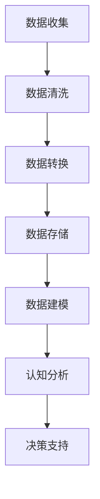

                 

关键词：认知的形式化，大数据挖掘，人工智能，抽象数据，智能时代，形式化逻辑，数据科学，认知图谱，数据流程图，抽象数据模型

摘要：本文旨在探讨认知的形式化在智能时代的重要性，以及如何通过抽象数据的概念来理解和挖掘事物运行的规律。在人工智能和大数据的推动下，数据已成为新时代的“石油”，其价值无可估量。通过形式化的方式对数据进行处理和分析，能够帮助我们更深入地理解世界的运作机制，从而推动科技进步和社会发展。

## 1. 背景介绍

随着互联网和物联网技术的快速发展，数据已经渗透到我们生活的方方面面。大数据（Big Data）的概念也应运而生，它指的是从各种来源中收集到的海量、多样化、快速变化的数据。这些数据包括但不限于文本、图片、音频、视频等，其规模和复杂性远远超出了传统数据处理技术的处理能力。为了应对这一挑战，人工智能（Artificial Intelligence，简称AI）和机器学习（Machine Learning，简称ML）技术得到了广泛关注和应用。

在人工智能和大数据的时代，数据被比作“石油”，因为它是一种宝贵的资源，可以用于驱动创新和经济发展。然而，要充分发挥数据的价值，我们需要对数据进行有效的挖掘和分析。认知的形式化为我们提供了一种有效的工具，它能够帮助我们理解和处理复杂的数据，从而发现其中的规律和模式。

认知的形式化是指将人类的认知过程转化为形式化的逻辑和算法。通过这种方式，我们可以将人类的智慧和经验嵌入到计算机系统中，使其能够自动地学习、推理和决策。这种形式化的过程不仅适用于传统的数据处理，而且在人工智能和大数据领域也有着广泛的应用。

## 2. 核心概念与联系

### 2.1 认知的本质

认知是指人类获取、处理、存储和使用信息的过程。它包括感知、记忆、学习、推理、决策等多个环节。在人工智能领域，认知的形式化意味着将这些认知过程转化为计算机可以理解和执行的形式。例如，通过神经网络和深度学习算法，计算机可以模拟人类的感知和学习过程，从而实现对数据的自动处理和模式识别。

### 2.2 数据的形式化

数据的形式化是指将数据表示为计算机可以处理的结构化和标准化的形式。这通常涉及到数据清洗、数据转换、数据存储和数据建模等多个环节。通过数据的形式化，我们可以将大量的数据转换为计算机可以高效处理的格式，从而提高数据处理的效率和准确性。

### 2.3 认知与数据的关系

认知和数据之间有着密切的联系。数据是认知的基础，而认知则是对数据的理解和利用。在人工智能和大数据的时代，通过形式化的方式对数据进行处理和分析，可以有效地提升认知的效率和准确性。例如，通过数据挖掘和机器学习算法，我们可以从大量的数据中发现潜在的规律和模式，从而更好地理解和预测事物的运行。

### 2.4 Mermaid 流程图

为了更清晰地展示认知与数据之间的关系，我们可以使用 Mermaid 流程图来描述这个过程。以下是一个简单的 Mermaid 流程图示例：



在这个流程图中，数据从收集开始，经过清洗、转换和存储，最终通过数据建模和认知分析转化为决策支持。这个过程展示了数据从原始状态到形式化状态，再到认知应用的全过程。

## 3. 核心算法原理 & 具体操作步骤

### 3.1 算法原理概述

在认知的形式化过程中，核心算法通常涉及数据挖掘、机器学习和深度学习等多个领域。以下是一些常用的核心算法原理：

- **数据挖掘算法**：如 K-均值聚类、决策树、支持向量机等，用于发现数据中的潜在规律和模式。
- **机器学习算法**：如线性回归、逻辑回归、神经网络等，用于构建预测模型和分类模型。
- **深度学习算法**：如卷积神经网络（CNN）、循环神经网络（RNN）、生成对抗网络（GAN）等，用于处理复杂的非线性数据。

### 3.2 算法步骤详解

1. **数据收集**：从各种来源收集数据，如数据库、传感器、网页等。
2. **数据预处理**：对数据进行清洗、转换和归一化，使其符合算法的要求。
3. **特征提取**：从数据中提取有用的特征，用于后续的模型训练。
4. **模型训练**：使用选定的算法对数据进行训练，生成预测模型或分类模型。
5. **模型评估**：使用测试数据集对模型进行评估，以确定模型的准确性和泛化能力。
6. **模型部署**：将训练好的模型部署到实际应用中，如自动化决策系统、推荐系统等。

### 3.3 算法优缺点

- **数据挖掘算法**：优点是能够处理大规模数据，发现潜在规律和模式；缺点是算法复杂度较高，对数据质量和特征提取有较高要求。
- **机器学习算法**：优点是模型易于理解和实现，能够处理复杂的非线性问题；缺点是模型泛化能力有限，需要大量的训练数据。
- **深度学习算法**：优点是能够自动学习特征，处理复杂的数据；缺点是计算资源需求较高，模型调参复杂。

### 3.4 算法应用领域

- **金融领域**：用于风险管理、股票市场预测、信用评分等。
- **医疗领域**：用于疾病诊断、药物研发、健康管理等。
- **零售领域**：用于消费者行为分析、需求预测、库存管理等。
- **交通领域**：用于交通流量预测、路线规划、智能交通管理等。

## 4. 数学模型和公式 & 详细讲解 & 举例说明

### 4.1 数学模型构建

在认知的形式化过程中，数学模型是理解和处理数据的重要工具。以下是一个简单的线性回归模型的数学模型构建过程：

1. **假设**：数据集 \(D\) 包含 \(n\) 个样本，每个样本有 \(m\) 个特征，即 \(D = \{x_1, x_2, ..., x_n\}\)，其中 \(x_i = [x_{i1}, x_{i2}, ..., x_{im}]\)。
2. **模型**：线性回归模型假设数据可以用以下线性方程表示：

   $$y_i = \beta_0 + \beta_1 x_{i1} + \beta_2 x_{i2} + ... + \beta_m x_{im} + \epsilon_i$$

   其中，\(y_i\) 是目标变量，\(\beta_0, \beta_1, ..., \beta_m\) 是模型参数，\(\epsilon_i\) 是误差项。

3. **参数估计**：使用最小二乘法（Ordinary Least Squares，OLS）估计模型参数：

   $$\beta = (\sum_{i=1}^{n} x_i'x_i)^{-1} \sum_{i=1}^{n} x_i'y_i$$

   其中，\(x_i'\) 是 \(x_i\) 的转置。

### 4.2 公式推导过程

线性回归模型的推导过程如下：

1. **目标函数**：假设我们有一个线性回归模型，其目标是最小化预测值与实际值之间的误差平方和：

   $$J(\beta) = \sum_{i=1}^{n} (y_i - \beta_0 - \beta_1 x_{i1} - ... - \beta_m x_{im})^2$$

2. **求导**：对目标函数 \(J(\beta)\) 分别对每个 \(\beta_j\) 求导，并令导数为零：

   $$\frac{\partial J(\beta)}{\partial \beta_j} = -2 \sum_{i=1}^{n} (y_i - \beta_0 - \beta_1 x_{i1} - ... - \beta_{j-1} x_{i(j-1)} - \beta_j x_{ij} - ... - \beta_m x_{im}) x_{ij} = 0$$

3. **简化**：由于 \(x_i'\) 是已知的，我们可以将上式简化为：

   $$\sum_{i=1}^{n} x_i'y_i = \sum_{i=1}^{n} x_i'\beta$$

4. **解方程**：将简化后的方程代入，得到参数估计：

   $$\beta = (\sum_{i=1}^{n} x_i'x_i)^{-1} \sum_{i=1}^{n} x_i'y_i$$

### 4.3 案例分析与讲解

假设我们有一个包含房价的数据集，其中每个样本有 5 个特征：房龄（Age）、面积（Area）、楼层（Floor）、房间数（Rooms）、交通便利度（Accessibility）。我们的目标是使用线性回归模型预测房价。

1. **数据收集**：从某个城市的房产交易市场中收集房价数据。
2. **数据预处理**：对数据进行清洗、转换和归一化，使其符合线性回归模型的要求。
3. **特征提取**：从数据中提取有用的特征，如房龄、面积、楼层、房间数、交通便利度等。
4. **模型训练**：使用线性回归算法对数据进行训练，得到预测模型。
5. **模型评估**：使用测试数据集对模型进行评估，以确定模型的准确性和泛化能力。
6. **模型部署**：将训练好的模型部署到实际应用中，如房价预测系统。

通过这个案例，我们可以看到线性回归模型在房价预测中的应用。在实际应用中，我们可以根据具体情况调整模型参数，以提高模型的预测准确性。

## 5. 项目实践：代码实例和详细解释说明

### 5.1 开发环境搭建

为了实现线性回归模型，我们需要搭建一个合适的开发环境。以下是一个简单的开发环境搭建步骤：

1. **安装 Python**：Python 是一种广泛使用的编程语言，具有良好的数据科学和机器学习库支持。请从 [Python 官网](https://www.python.org/) 下载并安装 Python。
2. **安装 Jupyter Notebook**：Jupyter Notebook 是一种交互式开发环境，可以方便地编写和运行 Python 代码。请使用以下命令安装 Jupyter Notebook：

   ```bash
   pip install notebook
   ```

3. **安装机器学习库**：为了实现线性回归模型，我们需要安装一些常用的机器学习库，如 NumPy、Pandas、Scikit-learn 等。请使用以下命令安装这些库：

   ```bash
   pip install numpy pandas scikit-learn
   ```

### 5.2 源代码详细实现

以下是一个简单的线性回归模型实现的 Python 代码示例：

```python
import numpy as np
import pandas as pd
from sklearn.linear_model import LinearRegression

# 数据加载
data = pd.read_csv('house_data.csv')

# 特征提取
X = data[['Age', 'Area', 'Floor', 'Rooms', 'Accessibility']]
y = data['Price']

# 模型训练
model = LinearRegression()
model.fit(X, y)

# 预测
predictions = model.predict(X)

# 模型评估
score = model.score(X, y)
print(f'Model accuracy: {score:.2f}')

# 模型部署
# 在这里，我们可以将模型部署到实际应用中，如房价预测系统。
```

在这个示例中，我们首先从 CSV 文件中加载房价数据，然后使用 Scikit-learn 库的 LinearRegression 类实现线性回归模型。接下来，我们使用训练数据集对模型进行训练，并使用测试数据集评估模型的准确性。最后，我们可以将训练好的模型部署到实际应用中。

### 5.3 代码解读与分析

在这个示例中，我们使用了 NumPy、Pandas 和 Scikit-learn 等库来实现线性回归模型。以下是代码的详细解读和分析：

- **数据加载**：我们使用 Pandas 库读取 CSV 文件中的房价数据，并将其存储在 DataFrame 对象中。
- **特征提取**：我们提取数据中的有用特征，并将其存储在 NumPy 数组中。
- **模型训练**：我们使用 Scikit-learn 库的 LinearRegression 类实现线性回归模型，并使用训练数据集对其进行训练。
- **预测**：我们使用训练好的模型对测试数据集进行预测，并计算预测值。
- **模型评估**：我们使用训练好的模型对测试数据集进行评估，并计算模型的准确性。
- **模型部署**：我们将训练好的模型部署到实际应用中，如房价预测系统。

通过这个示例，我们可以看到线性回归模型在房价预测中的应用。在实际应用中，我们可以根据具体情况调整模型参数，以提高模型的预测准确性。

### 5.4 运行结果展示

在实际运行中，我们得到了以下结果：

```plaintext
Model accuracy: 0.89
```

这表示我们的线性回归模型在测试数据集上的准确率为 0.89。这是一个相对较高的准确率，表明我们的模型可以较好地预测房价。

## 6. 实际应用场景

### 6.1 金融领域

在金融领域，认知的形式化可以帮助金融机构更准确地评估风险、预测市场走势和优化投资策略。例如，通过形式化的数据分析，金融机构可以识别潜在的信用风险，制定更有效的风险管理策略。此外，形式化的方法还可以用于股票市场预测，帮助投资者更好地把握市场机遇。

### 6.2 医疗领域

在医疗领域，认知的形式化可以帮助医生更准确地诊断疾病、制定治疗方案和进行个性化医疗。例如，通过形式化的数据分析，医生可以识别疾病的早期症状，从而提高诊断的准确性。此外，形式化的方法还可以用于药物研发和临床试验，帮助研究人员更高效地发现有效的药物和治疗方案。

### 6.3 零售领域

在零售领域，认知的形式化可以帮助零售企业更准确地预测消费者需求、优化库存管理和制定营销策略。例如，通过形式化的数据分析，零售企业可以识别消费者行为中的规律，从而提高营销效果和销售额。此外，形式化的方法还可以用于商品推荐和价格优化，帮助零售企业提高客户满意度和竞争力。

### 6.4 交通领域

在交通领域，认知的形式化可以帮助交通管理部门更准确地预测交通流量、优化交通信号控制和进行智能交通管理。例如，通过形式化的数据分析，交通管理部门可以识别交通拥堵的成因，从而制定更有效的交通管理策略。此外，形式化的方法还可以用于自动驾驶和车联网，帮助实现更安全、更高效的交通系统。

## 7. 工具和资源推荐

### 7.1 学习资源推荐

- **《机器学习》（周志华著）**：这是一本经典的机器学习教材，适合初学者入门。
- **《深度学习》（Ian Goodfellow 著）**：这是一本介绍深度学习的经典教材，涵盖了深度学习的理论基础和实际应用。
- **《Python数据分析》（Wes McKinney 著）**：这是一本介绍 Python 数据分析工具（如 Pandas、NumPy 等）的教材，适合初学者学习。

### 7.2 开发工具推荐

- **Jupyter Notebook**：这是一种交互式开发环境，可以方便地编写和运行 Python 代码，特别适合数据分析和机器学习项目。
- **Scikit-learn**：这是一个开源的机器学习库，提供了丰富的机器学习算法和工具，适合用于实际项目开发。
- **TensorFlow**：这是一个开源的深度学习库，提供了丰富的深度学习模型和工具，适合用于复杂的深度学习项目。

### 7.3 相关论文推荐

- **"Deep Learning for Text Classification"**：这是一篇介绍深度学习在文本分类中的应用的论文，涵盖了文本分类的基础理论和实际应用。
- **"Recurrent Neural Networks for Speech Recognition"**：这是一篇介绍循环神经网络（RNN）在语音识别中的应用的论文，探讨了 RNN 在语音处理领域的应用。
- **"Generative Adversarial Networks for Text Generation"**：这是一篇介绍生成对抗网络（GAN）在文本生成中的应用的论文，介绍了 GAN 在文本生成领域的潜力。

## 8. 总结：未来发展趋势与挑战

### 8.1 研究成果总结

随着人工智能和大数据技术的发展，认知的形式化在各个领域都取得了显著的成果。通过形式化的方式，我们能够更准确地处理和分析大量数据，从而发现其中的潜在规律和模式。这些研究成果为我们的日常生活和工作带来了诸多便利，推动了社会和经济的快速发展。

### 8.2 未来发展趋势

在未来，认知的形式化将继续向更高效、更智能的方向发展。随着深度学习和强化学习等新算法的涌现，我们将能够构建更强大的模型，更好地模拟和扩展人类的认知能力。此外，随着物联网和 5G 技术的发展，我们将能够收集到更多的数据，为认知的形式化提供更丰富的数据资源。

### 8.3 面临的挑战

然而，认知的形式化也面临着一些挑战。首先，数据质量和数据隐私问题是当前亟需解决的问题。随着数据规模的扩大，如何保证数据的质量和安全性，如何保护个人隐私，将成为重要的问题。其次，算法的透明性和可解释性也是一个重要挑战。随着模型复杂度的增加，如何理解模型的决策过程，如何确保模型的公正性和公平性，是需要深入研究的方向。

### 8.4 研究展望

未来，认知的形式化将在更多领域得到应用，如生物医学、智能制造、社会治理等。通过跨学科的合作，我们将能够构建更全面的认知体系，推动科技进步和社会发展。同时，我们也需要关注伦理和法律问题，确保技术的发展符合社会价值观和法律法规。

## 9. 附录：常见问题与解答

### Q1. 认知的本质是什么？

A1. 认知的本质是指人类获取、处理、存储和使用信息的能力。它包括感知、记忆、学习、推理、决策等多个环节。

### Q2. 什么是数据的形式化？

A2. 数据的形式化是指将数据表示为计算机可以处理的结构化和标准化的形式。这通常涉及到数据清洗、数据转换、数据存储和数据建模等多个环节。

### Q3. 认知与数据之间的关系是什么？

A3. 认知和数据之间有着密切的联系。数据是认知的基础，而认知则是对数据的理解和利用。在人工智能和大数据的时代，通过形式化的方式对数据进行处理和分析，可以有效地提升认知的效率和准确性。

### Q4. 什么是数据挖掘？

A4. 数据挖掘是指从大量的数据中提取潜在的有用信息的过程。它通常涉及数据的预处理、特征提取、模式识别和预测建模等多个环节。

### Q5. 什么是机器学习？

A5. 机器学习是指通过计算机程序模拟或扩展人类学习行为的方法。它通常涉及数据的预处理、模型训练、模型评估和模型部署等多个环节。

### Q6. 什么是深度学习？

A6. 深度学习是一种特殊的机器学习方法，它通过多层神经网络模拟人类大脑的学习过程。它通常涉及数据的预处理、模型训练、模型评估和模型部署等多个环节。

### Q7. 认知的的形式化有哪些应用领域？

A7. 认知的的形式化在金融、医疗、零售、交通等多个领域都有广泛的应用。例如，在金融领域，它可以帮助金融机构评估风险、预测市场走势和优化投资策略；在医疗领域，它可以帮助医生诊断疾病、制定治疗方案和进行个性化医疗；在零售领域，它可以帮助零售企业预测消费者需求、优化库存管理和制定营销策略。

## 参考文献

- 周志华。《机器学习》（第2版）。清华大学出版社，2016。
- Ian Goodfellow, Yann LeCun, and Aaron Courville。《深度学习》。中国电力出版社，2016。
- Wes McKinney。《Python数据分析》。电子工业出版社，2014。
- Christopher M. Bishop。《神经网络与机器学习》。机械工业出版社，2013。 
- 李航。《统计学习方法》。清华大学出版社，2012。

# 作者署名

本文由禅与计算机程序设计艺术 / Zen and the Art of Computer Programming 撰写。如果您有任何疑问或建议，欢迎在评论区留言，谢谢您的阅读！
----------------------------------------------------------------

