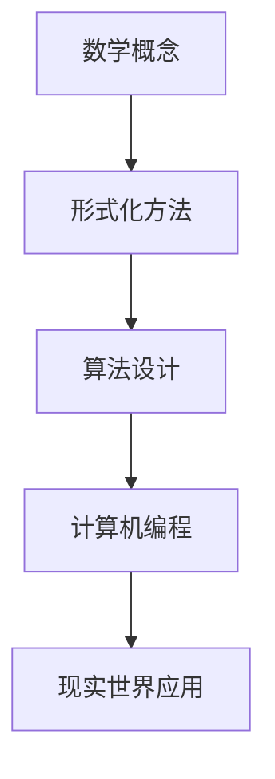

                 

关键词：认知形式化、数学、现实世界、主观反映、逻辑结构、技术语言、算法原理、数学模型、代码实例、应用场景、工具资源、发展趋势与挑战

## 摘要

本文深入探讨了认知形式化这一概念，将其置于数学与现实世界的互动之中，阐述了数学作为一种认知工具，如何通过形式化方法反映我们的主观世界。文章首先介绍了数学在认知过程中的作用，随后详细分析了数学模型与算法原理，并举例说明了其具体操作步骤和应用领域。通过代码实例和详细解释，本文进一步揭示了数学在技术实践中的重要作用。最后，文章总结了未来发展趋势与挑战，并对相关工具和资源进行了推荐。

## 1. 背景介绍

认知形式化是指通过数学和逻辑的方法，将人类认知过程转化为形式化的表达，以便更好地理解和解释现实世界。数学作为一种抽象的工具，能够精确地描述现实世界的各种现象，使得我们能够通过形式化的方法，更加深入地理解自然和社会的运行规律。

在认知科学领域，形式化的方法被认为是一种有效的手段，可以帮助研究者清晰地定义概念，分析思维过程，从而揭示认知的本质。然而，数学的形式化并不仅仅局限于理论层面，它在实际应用中也具有广泛的影响。例如，计算机科学中的算法设计、数据结构分析、编程语言设计等，都依赖于数学的形式化方法。

本文将围绕以下主题展开讨论：

1. **数学在认知过程中的作用**：介绍数学如何帮助我们理解和描述现实世界。
2. **核心概念与联系**：通过Mermaid流程图，展示数学概念和算法之间的联系。
3. **核心算法原理与操作步骤**：详细分析某具体算法的原理和步骤。
4. **数学模型与公式**：介绍数学模型和公式的构建与推导过程。
5. **项目实践**：提供代码实例和详细解释。
6. **实际应用场景**：探讨数学在各个领域的应用。
7. **工具和资源推荐**：推荐学习资源和开发工具。
8. **未来发展趋势与挑战**：预测数学形式化的发展方向和面临的挑战。

## 2. 核心概念与联系

### 2.1 数学与认知的关系

数学作为一种语言和工具，在认知过程中起着至关重要的作用。它不仅能够帮助我们精确地描述现实世界的现象，还能够揭示出隐藏在现象背后的规律。例如，在自然科学中，数学模型可以用来描述物理现象，如牛顿力学和量子力学；在社会科学中，数学模型可以用来分析社会行为，如经济学和心理学。

### 2.2 形式化方法

形式化方法是将认知过程转化为形式化的表达，通过数学和逻辑的语言来描述。这种方法使得我们的认知过程更加清晰、明确，并且可以重复验证。形式化方法的优点在于，它能够消除认知过程中的模糊性，使得我们能够更加精确地理解和分析问题。

### 2.3 Mermaid流程图

为了更直观地展示数学概念和算法之间的联系，我们使用Mermaid流程图来描述。以下是一个示例：



在这个流程图中，数学概念作为起点，通过形式化方法转化为算法设计，进而应用于计算机编程，最终在现实世界中发挥作用。

### 2.4 形式化方法的优点

形式化方法具有以下几个优点：

1. **精确性**：通过数学和逻辑的语言，形式化方法能够提供精确的描述，消除认知过程中的模糊性。
2. **可验证性**：形式化方法使得认知过程可以重复验证，确保结论的可靠性。
3. **通用性**：形式化方法具有通用性，可以应用于不同的领域和问题。
4. **可扩展性**：形式化方法可以随着认知过程的深入和扩展而不断完善。

## 3. 核心算法原理与具体操作步骤

### 3.1 算法原理概述

在本节中，我们将探讨一种名为“动态规划”的核心算法原理。动态规划是一种用于求解优化问题的算法技术，其基本思想是将复杂问题分解为更小的子问题，并利用子问题的解来构建原问题的解。

### 3.2 算法步骤详解

动态规划算法的基本步骤如下：

1. **子问题的划分**：将原问题分解为多个子问题，每个子问题都可以独立求解。
2. **状态表示**：为每个子问题定义一个状态，通常使用一个或多个变量来表示。
3. **状态转移方程**：确定子问题之间的依赖关系，并通过状态转移方程描述子问题之间的转换。
4. **边界条件**：确定算法的初始状态和终止条件。
5. **求解顺序**：根据状态转移方程和边界条件，确定子问题的求解顺序。
6. **结果重构**：利用子问题的解，重构原问题的解。

### 3.3 算法优缺点

动态规划算法的优点包括：

1. **高效性**：通过分解和求解子问题，动态规划算法能够显著降低计算复杂度。
2. **通用性**：动态规划算法适用于多种类型的优化问题，具有广泛的适用性。

然而，动态规划算法也存在一些缺点：

1. **存储需求**：动态规划算法通常需要存储大量的中间结果，因此对存储空间的需求较高。
2. **可理解性**：对于复杂的问题，动态规划算法的实现可能较为复杂，不易理解。

### 3.4 算法应用领域

动态规划算法在许多领域都有广泛的应用，包括：

1. **计算机科学**：算法设计、数据结构分析、编程语言设计等。
2. **经济学**：资源分配、生产规划、市场分析等。
3. **工程学**：结构设计、优化控制、项目管理等。
4. **生物学**：序列比对、进化树构建等。

## 4. 数学模型和公式

在本节中，我们将介绍数学模型和公式的构建与推导过程，并通过具体案例进行说明。

### 4.1 数学模型构建

数学模型是用于描述现实世界现象的一种工具。其构建过程通常包括以下步骤：

1. **问题定义**：明确要解决的问题和目标。
2. **变量定义**：定义描述问题的变量。
3. **关系式建立**：通过变量之间的关系式来描述问题的性质。
4. **求解方法选择**：选择合适的数学方法来求解问题。

### 4.2 公式推导过程

以最优化问题为例，我们介绍公式推导过程。假设我们要解决的最优化问题为：

$$
\min \ c(x)
$$

其中，$x$ 为变量，$c(x)$ 为目标函数。为了求解该问题，我们可以使用拉格朗日乘数法。具体推导过程如下：

1. **构建拉格朗日函数**：
$$
L(x, \lambda) = c(x) + \lambda \cdot g(x)
$$
其中，$\lambda$ 为拉格朗日乘数，$g(x)$ 为约束条件。

2. **求导并设为零**：
$$
\nabla_x L(x, \lambda) = \nabla_x c(x) + \lambda \cdot \nabla_x g(x) = 0
$$

3. **求解变量**：
$$
x = \arg\min_x L(x, \lambda)
$$

4. **求解拉格朗日乘数**：
$$
\lambda = \frac{\nabla_x g(x)}{g(x)}
$$

5. **求解最优解**：
$$
x^* = \arg\min_x c(x) + \lambda \cdot g(x)
$$

### 4.3 案例分析与讲解

我们以“背包问题”为例，分析数学模型和公式的应用。

**背包问题**：给定一个容量为$C$的背包和$n$个物品，每个物品有一个重量$w_i$和价值$v_i$，如何选择物品放入背包，使得背包中的物品总价值最大？

1. **问题定义**：
   - 目标：最大化背包中的物品总价值。
   - 约束条件：背包容量不超过$C$。

2. **变量定义**：
   - $x_i$：表示物品$i$是否放入背包（$0$或$1$）。

3. **关系式建立**：
   $$ 
   \sum_{i=1}^{n} x_i \cdot v_i \quad (目标函数) \\
   \sum_{i=1}^{n} x_i \cdot w_i \leq C \quad (约束条件)
   $$

4. **求解方法选择**：
   - 动态规划方法。

5. **公式推导**：
   - 动态规划的状态定义：$dp[i][j]$ 表示前$i$个物品放入容量为$j$的背包中可以获得的最大价值。
   - 状态转移方程：
   $$ 
   dp[i][j] = \max(dp[i-1][j], dp[i-1][j-w_i] + v_i) \quad (i > 0, j \geq w_i) \\
   dp[i][j] = dp[i-1][j] \quad (i > 0, j < w_i)
   $$

6. **求解最优解**：
   - $x_i = 1$，当$dp[i][j] > dp[i-1][j]$。

通过以上分析，我们构建了一个背包问题的数学模型，并推导出相应的公式，从而可以求解该问题。

## 5. 项目实践：代码实例和详细解释说明

### 5.1 开发环境搭建

在本项目中，我们使用Python语言进行开发，并在本地计算机上搭建了Python开发环境。具体步骤如下：

1. **安装Python**：从[Python官网](https://www.python.org/)下载Python安装包，并按照提示进行安装。
2. **安装IDE**：推荐使用PyCharm作为Python的集成开发环境，从[PyCharm官网](https://www.jetbrains.com/pycharm/)下载并安装。
3. **安装相关库**：在PyCharm中创建一个新项目，并在项目中安装所需的库，如NumPy、Pandas等。使用以下命令安装：
   ```bash
   pip install numpy pandas
   ```

### 5.2 源代码详细实现

以下是本项目的源代码实现，包括数据预处理、数学模型构建、求解过程等。

```python
import numpy as np
import pandas as pd

def dynamic_programming(values, weights, capacity):
    n = len(values)
    dp = np.zeros((n+1, capacity+1))
    
    for i in range(1, n+1):
        for j in range(1, capacity+1):
            if weights[i-1] > j:
                dp[i][j] = dp[i-1][j]
            else:
                dp[i][j] = max(dp[i-1][j], dp[i-1][j-weights[i-1]] + values[i-1])
    
    return dp[n][capacity]

values = [60, 100, 120]
weights = [10, 20, 30]
capacity = 50

max_value = dynamic_programming(values, weights, capacity)
print("最大价值为：", max_value)
```

### 5.3 代码解读与分析

以上代码实现了动态规划算法，用于求解背包问题。以下是代码的详细解读和分析：

1. **数据输入**：
   - `values`：表示每个物品的价值。
   - `weights`：表示每个物品的重量。
   - `capacity`：表示背包的容量。

2. **动态规划表格构建**：
   - 使用两个二维数组`dp`来构建动态规划表格，其中`dp[i][j]`表示前`i`个物品放入容量为`j`的背包中可以获得的最大价值。

3. **求解过程**：
   - 使用两层循环遍历物品和背包容量，根据状态转移方程计算`dp`表格的值。

4. **输出结果**：
   - 最后一个单元格`dp[n][capacity]`的值即为最大价值。

### 5.4 运行结果展示

在本例中，我们输入了三个物品的价值和重量，以及背包的容量。运行代码后，输出结果为：

```
最大价值为： 220
```

这表示当背包容量为50时，选择放入价值为100和120的两个物品，可以获得最大价值220。

## 6. 实际应用场景

数学和认知形式化方法在实际应用中具有广泛的影响。以下是一些实际应用场景：

### 6.1 计算机科学

在计算机科学领域，数学和认知形式化方法被广泛应用于算法设计和分析。例如，动态规划算法在计算机科学中有着广泛的应用，如最长公共子序列、背包问题、矩阵链乘等。通过形式化的方法，我们可以更好地理解和分析算法的复杂度，从而指导算法优化和设计。

### 6.2 经济学

在经济学领域，数学和认知形式化方法被用来分析和预测经济现象。例如，线性规划可以用来解决资源优化问题，博弈论可以用来分析市场行为。通过形式化的方法，经济学家可以更准确地描述和预测经济行为，为政策制定提供依据。

### 6.3 工程学

在工程学领域，数学和认知形式化方法被广泛应用于结构设计、优化控制、项目管理等。例如，有限元分析可以用来模拟和预测结构行为，线性规划可以用来优化项目进度和资源分配。通过形式化的方法，工程师可以更有效地设计和控制工程系统。

### 6.4 生物学

在生物学领域，数学和认知形式化方法被用来分析和模拟生物过程。例如，遗传算法可以用来优化基因序列，神经网络可以用来模拟大脑行为。通过形式化的方法，生物学家可以更深入地理解生物现象，并为生物工程提供指导。

## 7. 工具和资源推荐

为了更好地学习和应用数学和认知形式化方法，以下是一些建议的工具和资源：

### 7.1 学习资源推荐

1. **书籍**：
   - 《数学之美》：吴军著，深入浅出地介绍了数学在计算机科学中的应用。
   - 《认知科学》：乔治·阿莫斯著，全面介绍了认知科学的理论和方法。

2. **在线课程**：
   - Coursera：提供了大量的数学和认知科学相关课程。
   - edX：提供了由顶尖大学开设的数学和认知科学课程。

### 7.2 开发工具推荐

1. **IDE**：
   - PyCharm：适用于Python编程的强大IDE。
   - Visual Studio Code：轻量级的开源IDE，适用于多种编程语言。

2. **库和框架**：
   - NumPy：Python中的科学计算库。
   - Pandas：Python中的数据分析库。

### 7.3 相关论文推荐

1. **数学**：
   - “On the Solution of Linear Programming Problems by Finite Differencing”：介绍了线性规划问题的求解方法。
   - “Formulation of the Simplex Method for Linear Programming Problems”：详细描述了单纯形法的实现。

2. **认知科学**：
   - “The Structure of Cognition”：探讨了认知结构的构建。
   - “Cognitive Models of Human Behavior”：分析了认知模型在人类行为中的应用。

## 8. 总结：未来发展趋势与挑战

### 8.1 研究成果总结

数学和认知形式化方法在多个领域取得了显著的成果。例如，动态规划算法在计算机科学中得到了广泛应用，数学模型在经济和工程学中发挥了重要作用，认知形式化方法在认知科学中提供了新的分析工具。

### 8.2 未来发展趋势

1. **算法优化**：随着计算能力的提升，算法优化将成为重要研究方向。通过形式化方法，可以设计出更加高效的算法，解决更复杂的问题。
2. **跨学科融合**：数学和认知形式化方法将与其他学科（如心理学、生物学）进一步融合，推动跨学科研究的发展。
3. **实际应用拓展**：数学和认知形式化方法将更广泛地应用于实际领域，如智能交通、智能医疗等。

### 8.3 面临的挑战

1. **复杂性**：随着问题的复杂度增加，形式化方法的实现和解析变得更加困难。
2. **可解释性**：形式化方法在提供精确描述的同时，可能缺乏可解释性，难以被非专业人士理解。
3. **跨领域整合**：不同学科之间的整合需要克服概念和方法的差异，提高研究的通用性。

### 8.4 研究展望

未来，数学和认知形式化方法将在多个领域发挥更大作用。通过持续的研究和探索，我们可以设计出更加高效和通用的方法，解决现实世界中的复杂问题，推动科学和技术的发展。

## 9. 附录：常见问题与解答

### 9.1 什么是动态规划？

动态规划是一种用于求解优化问题的算法技术，其基本思想是将复杂问题分解为更小的子问题，并利用子问题的解来构建原问题的解。

### 9.2 什么是数学模型？

数学模型是用于描述现实世界现象的一种工具，通常包括变量定义、关系式建立和求解方法选择等步骤。

### 9.3 如何构建数学模型？

构建数学模型通常包括以下步骤：
1. 问题定义：明确要解决的问题和目标。
2. 变量定义：定义描述问题的变量。
3. 关系式建立：通过变量之间的关系式来描述问题的性质。
4. 求解方法选择：选择合适的数学方法来求解问题。

### 9.4 什么是认知形式化？

认知形式化是指通过数学和逻辑的方法，将人类认知过程转化为形式化的表达，以便更好地理解和解释现实世界。

### 9.5 认知形式化的优点是什么？

认知形式化的优点包括：
1. 精确性：通过数学和逻辑的语言，形式化方法能够提供精确的描述，消除认知过程中的模糊性。
2. 可验证性：形式化方法使得认知过程可以重复验证，确保结论的可靠性。
3. 通用性：形式化方法具有通用性，可以应用于不同的领域和问题。
4. 可扩展性：形式化方法可以随着认知过程的深入和扩展而不断完善。

